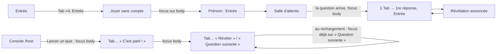

# Qui ne peut pas jouer, ou pas animer ? — rapport de l'expert accessibilité

## En bref

FiestApp est **jouable au clavier et au lecteur d'écran**, côté invité comme
côté animateur : les dialogues de la console sont exemplaires (piège de Tab,
Échap, retour du focus), les annonces du téléphone sont courtes et justes, et
les corrections de #30 tiennent toutes. Il n'y a **aucun défaut bloquant**
pour un invité aveugle ou malvoyant sur le chemin normal. Ce qui reste est une
série de défauts d'**état** et de **focus** faciles à corriger, et deux
questions de fond : le **texte agrandi à 200 %** sur un petit téléphone (les
avatars se chevauchent, les réponses passent sous le pli d'une question de
20 s), et **le temps** (critère 2.2.1), pour lequel l'application n'offre
qu'une pause collective. Les trois améliorations les plus rentables :
1. un **indicateur de focus visible sur les champs** (1 px qui passe de 60 % à
   100 % d'or aujourd'hui) — S ;
2. les **états des boutons bascule** : le son dit « Couper les sons, activé »
   quand le son est allumé ; le multiplicateur de points et QCM/Estimation
   n'annoncent aucun état — S ;
3. un **mode « texte agrandi »** au téléphone : titre de question borné, grille
   d'avatars qui passe à la ligne — M.

## Méthode

Une session de travail, seul dans le conteneur, sur l'atelier (`chez-iris`) :

- **Pilote de la tablée** : compte d'Iris activé, quiz de 5 questions (QCM,
  vrai/faux, deux estimations dont une photo à mémoriser) écrit par « Coller
  une liste » ; `iris` en `portable`, `iris-tel1` en `telephone` puis
  `petit-telephone` au texte à 200 % ; des fantômes (`fake-player.mjs`).
- **Scripts Playwright** (un Chromium à eux, hors de la régie), dans
  `retours/2026-09-24/experts/scripts/accessibilite/` :
  - `commun.mjs` — axe-core 4.10 (WCAG 2.0/2.1/2.2 A et AA + bonnes
    pratiques), un **enregistreur d'annonces** (les nœuds ajoutés et textes
    modifiés dans une région `aria-live`/`status`/`alert`, comme les lit un
    lecteur d'écran), la position du focus et son indicateur, et une **mesure
    de contraste** qui compose les opacités des ancêtres (ce qu'axe laisse en
    « incomplet ») ;
  - `pages.mjs` — axe, contrastes, cibles < 24 px et un tour de Tab sur
    l'accueil, l'entrée (trois états), l'historique, le souvenir, le bilan, la
    connexion, le compte, « Mes quiz », l'écran commun (Velours et Ivoire),
    l'administration ;
  - `partie.mjs` — une partie entière jouée **au clavier seul** (Tab, Entrée)
    par un téléphone 360 × 640, l'animateur avançant au clavier : axe à chaque
    écran, annonces, focus ;
  - `revelation.mjs` — les dialogues de la console au clavier, la pause vue
    du téléphone, les contrastes de la révélation dans les deux habillages,
    les états des boutons de la console ;
  - `reflow.mjs` — 320 px, texte à 200 %, écran commun à 200 % (683 × 384).
  - Pour les rejouer : `npm pack axe-core` hors du dépôt, puis
    `AXE=<…/axe.min.js> BASE=<adresse de la régie> node pages.mjs`.
- **Lecture du code** : `aria-live`, rôles, `aria-pressed`, `autoComplete`,
  `:focus-visible`, `prefers-reduced-motion`, les bornes de temps.

**Pas couvert** : un vrai lecteur d'écran (TalkBack, VoiceOver, NVDA) — les
annonces sont déduites des mutations DOM, pas entendues ; Safari et Firefox ;
le mode « couleurs forcées » de Windows (`forced-colors`) ; la clôture à hauts
faits et la carte d'un joueur au clavier ; l'éditeur au clavier au-delà des
noms et rôles (le tour de Tab automatique n'a pas ouvert le quiz).

## Constats

### 1. Les champs de saisie n'ont presque pas d'indicateur de focus
- **Où** : tous les `.input` — entrée (identifiant, mot de passe, prénom),
  estimation au téléphone, compte, connexion, nom d'équipe, surnom.
  `client/src/styles.css:341` (`.input:focus { outline: none; border-color: var(--accent) }`)
  et `:357` (`.input-line:focus { border-bottom-color: var(--accent) }`).
- **Constat** : le seul signe du focus est un trait de **1 px** qui passe de
  l'or à 60 % d'opacité à l'or plein. Entre les deux états : **2,27:1**. Les
  boutons, eux, ont un anneau de 2 px (`styles.css:389-399`).
- **Preuve** : `captures/accessibilite-3-focus-champ.png` — le focus est dans
  « Ton identifiant » ; rien ne le distingue de « Ton mot de passe ».
  `pages.mjs` : 10 des 17 arrêts de Tab du compte, 2 sur 6 à l'entrée, sans
  `outline` ni ombre. `partie.mjs` : le champ d'estimation reçoit le focus à
  l'ouverture de la question, sans indicateur visible.
- **Qui ça touche** : quiconque tape au clavier (clavier Bluetooth, commande
  vocale, animateur sur son PC) ; au téléphone, on voit le curseur clignoter,
  ce qui atténue.
- **Statut** : échec partiel de 2.4.7 (focus visible) — l'indicateur existe
  mais ne se voit pas ; échec de 2.4.13 (AAA) pour mémoire.
- **Piste** :
  ```css
  .input:focus-visible,
  .input-line:focus-visible {
    outline: 2px solid var(--accent);
    outline-offset: 3px;
    border-radius: 4px;
  }
  ```
  (ou un trait de 2 px plus un halo `box-shadow: 0 2px 0 var(--accent)`).
- **Priorité · effort** : P2 · S.

### 2. Les boutons bascule disent faux, ou ne disent rien
- **Où** et **constat** :
  - **Le son** — `client/src/views/HostApp.tsx:1088-1090` : le libellé change
    (« Couper les sons » / « Activer les sons ») **et** `aria-pressed={!muted}`.
    Son allumé, un lecteur d'écran annonce « Couper les sons, bouton bascule,
    activé » : il comprend que le son est coupé. Mesuré
    (`revelation.mjs`) : `{"nom":"Couper les sons","pressed":"true"}`.
    Le thème fait la même chose (`{"nom":"Revenir au fond sombre","pressed":"true"}`).
  - **Le multiplicateur** « points normaux / ×2 / ×3 » —
    `client/src/games/quiz/HostView.tsx:235-240` : seule la classe `active`
    marque le choix ; aucun `aria-pressed`. `voir` : trois boutons, aucun
    `[pressed]`.
  - **QCM / Estimation** dans l'éditeur — `client/src/views/EditorApp.tsx:1375-1388` :
    idem, rien n'annonce le type de la question.
  - À comparer avec « Suivante : au clic · 5 s · 10 s · 20 s »
    (`HostView.tsx:113`), qui porte bien `aria-pressed`.
- **Qui ça touche** : l'animateur au lecteur d'écran (et la commande vocale,
  qui s'appuie sur les états).
- **Statut** : bug confirmé (4.1.2 nom, rôle, valeur).
- **Piste** : un bouton bascule garde **un seul** libellé et dit son état
  par `aria-pressed` — « Sons » + `aria-pressed={!muted}`, « Fond clair » +
  `aria-pressed={theme === 'ivoire'}` ; le `title` peut garder la phrase
  d'action pour la souris. Ajouter `aria-pressed={multiplier === m}` et
  `aria-pressed={question.kind === …}`. Un test dans
  `server/test/accessibilite.test.ts` qui rend `HostView` et exige un
  `aria-pressed` sur chaque `.pill-btn`.
- **Priorité · effort** : P2 · S.

### 3. Au texte agrandi, le téléphone déborde
- **Où** : l'entrée (grille d'avatars) et la question, sur un
  `petit-telephone` (360 × 640) avec `zoom 200`.
- **Constat** :
  - les 24 avatars gardent leur taille de colonne pendant que l'emoji double :
    **ils se chevauchent** et le sixième sort de l'écran — des cibles qui se
    recouvrent ;
  - le titre de la question (serif, déjà grand) passe à 200 % : sur un
    vrai/faux, **les réponses sont entièrement sous le pli**, et en défilant
    on perd le chronomètre de vue ; « l'Exposition » est coupé à droite.
- **Preuve** : `captures/accessibilite-1-avatars-texte-200.png`,
  `captures/accessibilite-2-question-texte-200.png`. En largeur 320 px sans
  zoom et à l'écran commun à 200 %, en revanche, **aucun défilement
  horizontal ni élément hors cadre** (`reflow.mjs`).
- **Qui ça touche** : la grand-mère au petit téléphone qui a grossi la police
  système — le cas typique de la soirée ; chaque question lui coûte un
  défilement pendant que le temps court.
- **Statut** : friction (1.4.4 redimensionnement du texte : le contenu reste
  lisible en défilant, mais la grille d'avatars échoue à 200 %). Le zoom du
  pilote est un `zoom` CSS : à confirmer avec la taille de police d'Android.
- **Piste** : grille d'avatars en `grid-template-columns: repeat(auto-fill,
  minmax(3em, 1fr))` (la colonne grandit avec le texte) ; un plafond au titre
  de question en `min(…, 9vw)` / `clamp()` qui ne suive pas le zoom au-delà
  de 1,5 fois ; le chronomètre `position: sticky` en haut de la vue.
- **Priorité · effort** : P2 · M.

### 4. Le temps : seule une pause collective (2.2.1)
- **Où** : `shared/library.ts:10-12` (5 à 120 s, 20 par défaut), la photo à
  mémoriser (5 s d'observation), l'enchaînement automatique après la
  révélation (5 / 10 / 20 s), `server/src/games/quiz.ts:115-117` (temps de
  lecture offert : 1 s + 55 ms par caractère).
- **Constat** : aucun réglage ne donne plus de temps à **un** invité ; l'animateur
  peut mettre en pause (le téléphone l'annonce : « En pause — regarde
  l'écran commun ») et choisir des temps longs, et l'enchaînement « au clic »
  laisse lire la révélation. Un lecteur d'écran met plusieurs secondes à lire
  une question de quatre réponses avant qu'on puisse répondre.
- **Statut** : **tension avec un parti pris** — le chronomètre partagé est le
  jeu, et 2.2.1 admet l'exception « temps réel / essentiel ». Mais la pause
  et les temps longs sont entre les mains de l'animateur, qui ne sait pas
  qu'un invité en a besoin.
- **Piste** (à arbitrer) : (a) un réglage de soirée « temps généreux »
  (×1,5 sur toutes les durées) dans la console, simple à dire à voix haute ;
  (b) côté invité, une option « j'ai besoin de plus de temps » qui double
  son temps de lecture offert sans toucher au bonus de rapidité des autres
  (le barème est un choix de produit : à mesurer avec `calibrage.ts`) ;
  (c) dans l'éditeur, une phrase sous « Temps » : « 30 s et plus si un invité
  lit avec un lecteur d'écran ». Ne pas changer `LECTURE_MS` sans
  `VERSION_BAREME`.
- **Priorité · effort** : P2 · S pour (a) et (c), M pour (b).

### 5. Le focus se perd quand l'écran change de vue
- **Où** : entrée, après « Jouer sans compte » (`Entree.tsx:241`) ; console,
  après « Lancer un quiz » et « C'est parti ! » (`HostApp.tsx:1002-1013`) ;
  téléphone, à chaque nouvelle vue (question, révélation, podium).
- **Constat** : le bouton activé disparaît et le focus retombe sur `<body>`.
  Au téléphone c'est sans conséquence grave : la région live annonce la vue,
  et un seul Tab atteint la première réponse (mesuré à chaque question). À la
  console, l'animateur au clavier repart du haut de la page (22 arrêts de Tab
  en salle d'attente). Contre-exemple réussi : à l'ouverture de `/host` en
  pleine question, le focus est posé sur « Question suivante ».
- **Statut** : friction (2.4.3 ordre du focus).
- **Piste** : après un changement de vue, poser le focus sur le titre de la
  nouvelle vue (`tabIndex={-1}` + `ref.focus()`) — « Prénom » après « Jouer
  sans compte », « Choisis un quiz » après « Lancer un quiz », le bouton
  principal de la console après « C'est parti ! ».
- **Priorité · effort** : P3 · S.

### 6. Des noms qui manquent ou qui se répètent
- **Le QR code n'a pas de nom** (axe `svg-img-alt`, sévère) —
  `HostApp.tsx:535` et `:665`, `Cloture.tsx:41` : `QRCodeSVG` accepte un
  `title` : `title={`QR code de l'adresse ${joinUrl}`}`.
- **Les blocs qui défilent sans être focalisables** (axe
  `scrollable-region-focusable`) : `.guess-reveal` à la révélation d'une
  estimation et le classement de la salle d'attente (`.host-col > section`)
  — un `tabIndex={0}` avec un `aria-label` (« Toutes les estimations »).
- **L'éditeur** : cinq boutons « Supprimer » identiques
  (`EditorApp.tsx:1451` ; le dialogue, lui, nomme la question), aucune
  question n'a de titre (on navigue un quiz de 30 questions au lecteur
  d'écran sans pouvoir sauter de l'une à l'autre), et le champ « Coller une
  liste » n'a que son texte indicatif pour nom (« Colle tes questions ici… »).
  *Piste* : `aria-label={`Supprimer la question ${index + 1}`}`, un
  `<h3 className="sr-only">Question {index + 1}</h3>` (ou le bouton
  « Question 1 sur 5, déplacer » dans un `<h3>`), un `<label>` visible.
- **Titres de page** : `/connexion`, `/compte`, `/edit`, `/admin`, `/activer`
  s'appellent tous « FiestApp » (`document.title` n'est posé que par six vues)
  — 2.4.2 partiel. Et l'écran commun, l'accueil (`/`) et `/admin` n'ont pas de
  `h1`.
- **Statut** : bugs confirmés (axe et `voir`). **Priorité · effort** : P3 · S.

### 7. Aucune page n'a de `<main>`
- **Où** : toutes (axe `landmark-one-main`, `region`, bonne pratique).
- **Constat** : pas de repère principal ; le lecteur d'écran ne peut pas
  sauter au contenu. Les pages de l'animateur ont un `banner` et une
  `navigation`, mais le contenu flotte.
- **Piste** : envelopper la vue de chaque `*App.tsx` dans `<main>`.
- **Priorité · effort** : P3 · S.

### 8. Ce qu'entend l'animateur au lecteur d'écran : rien
- **Où** : l'écran commun et sa console.
- **Constat** : la seule région live de la console est la pastille de
  sauvegarde (`HostApp.tsx:512`). « 3 / 5 ont répondu », la révélation, un
  invité qui arrive ou se déconnecte ne sont pas annoncés. Un animateur
  aveugle anime à la voix, mais ne sait pas quand tout le monde a répondu.
- **Statut** : idée (l'écran commun est d'abord fait pour la salle).
- **Piste** : un `<p className="sr-only" aria-live="polite">` dans la console
  seulement, alimenté par les événements rares : « Tout le monde a répondu »,
  « Réponses closes », « Camille a rejoint la soirée ». Jamais le compteur à
  chaque réponse.
- **Priorité · effort** : P3 · S.

### 9. Petites annonces en trop au téléphone
- Le compte à rebours « Prépare-toi… 3 », « 2 », « 1 » est lu chiffre par
  chiffre (`PlayerView.tsx:193`, `GetReady` dans la région live
  `PlayerApp.tsx:287`) : `aria-live="off"` sur le chiffre, comme le fait
  `TimerBar`.
- « En pause — regarde l'écran commun » (`PlayerView.tsx:250`) : pour qui ne
  voit pas, « En pause — l'animateur reprend bientôt ».
- **Priorité · effort** : P3 · S.

### 10. Les comptes de la révélation, à peine lisibles en Velours
- **Où** : l'écran commun, révélation, réponses fausses (`.ans-count`,
  opacité `--dim` 0,38).
- **Constat** : les chiffres (« 0 », « 1 ») des réponses fausses tombent à
  **2,38:1** (27 px, seuil 3:1) en Velours ; ils passent en Ivoire. Le texte
  des réponses fausses, lui, passe partout. C'est un effacement voulu —
  mais c'est justement le nombre qu'on regarde.
- **Statut** : friction (1.4.3, fond en dégradé : mesure à confirmer à l'œil
  sur un vidéoprojecteur).
- **Piste** : n'estomper que la forme et le libellé, pas le compte
  (`.ans.dim .ans-count { opacity: 1 }` ou `--dim` à 0,55 pour lui).
- **Priorité · effort** : P3 · S.

## Mesures et cartes

### Critère par critère (WCAG 2.2 AA)

| Critère | Verdict | Preuve |
|---|---|---|
| 1.1.1 Contenu non textuel | **Partiel** | QR sans nom (constat 6) ; photos « Photo de la question » / « Photo à mémoriser » ; avatars « Avatar 🦊 » ; icônes décoratives masquées |
| 1.3.1 Information et relations | **Partiel** | titres h1-h3 au souvenir et au bilan, podium en liste, tableau des chiffres en vrai tableau ; éditeur sans titres par question, pas de `<main>` |
| 1.3.2 Ordre séquentiel | Réussi | podium dans l'ordre des rangs (#30) |
| 1.3.5 Finalité des champs | Réussi | `autocomplete` username / current-password / new-password / given-name partout où il faut (19 champs) |
| 1.4.1 Couleur | Réussi | formes ▲◆●■ doublent les couleurs ; ✓ et ✕ à la révélation ; « Raté… » / « Bien joué ! » en toutes lettres |
| 1.4.3 Contraste (minimum) | **Partiel** | aucun texte sous le seuil sur 13 pages ni en jeu (téléphone) ; `.ans-count` estompé 2,38:1 (constat 10) |
| 1.4.4 Redimensionnement du texte | **Partiel** | lisible en défilant, mais avatars qui se chevauchent à 200 % (constat 3) ; le zoom à deux doigts n'est pas bloqué (`index.html:11`) |
| 1.4.10 Redistribution | Réussi | 320 px et écran commun à 200 % : aucun défilement horizontal (`reflow.mjs`) |
| 1.4.11 Contraste non textuel | **Partiel** | trait des champs, focus 2,27:1 entre états (constat 1) |
| 1.4.13 Contenu au survol | Sans objet | pas d'infobulle maison |
| 2.1.1 Clavier | Réussi | partie entière jouée au clavier, console pilotée au clavier (`partie.mjs`) ; glisser-déposer doublé par Monter/Descendre |
| 2.1.2 Pas de piège | Réussi | trois dialogues : 8 Tab restent dedans, Échap ferme |
| 2.2.1 Réglage du délai | **Tension** | pause collective, durées 5-120 s ; rien par invité (constat 4) |
| 2.2.2 Mettre en pause, arrêter | Réussi | animations coupées par `prefers-reduced-motion` (`styles.css:1841`, règle globale) |
| 2.4.2 Titre de page | **Partiel** | cinq pages d'animateur s'appellent « FiestApp » |
| 2.4.3 Parcours du focus | **Partiel** | focus perdu sur `<body>` aux changements de vue (constat 5) ; dialogues : focus sur « Annuler », puis rendu au bouton d'origine |
| 2.4.6 En-têtes et étiquettes | **Partiel** | « Supprimer » ×n dans l'éditeur ; « Colle tes questions ici… » |
| 2.4.7 Focus visible | **Partiel** | anneau de 2 px sur les boutons ; champs presque invisibles (constat 1) |
| 2.4.11 Focus non masqué | Réussi (non mesuré en détail) | rien de caché sous la console fixe sur les captures à 1366 × 768 et à 200 % |
| 2.5.3 Nom dans l'étiquette | Réussi | « Exclure Camille (2) de la soirée », « La carte de Iris — rang 1, 0 point » |
| 2.5.7 Mouvements de glissement | Réussi | Monter / Descendre la question |
| 2.5.8 Taille des cibles | Réussi | seuls des liens en ligne < 24 px (exception) |
| 3.1.1 Langue de la page | Réussi | `<html lang="fr">` |
| 3.2.2 Changement au contexte | Réussi | aucun envoi au changement de valeur |
| 3.3.1 / 3.3.3 Erreurs | Réussi | `role="alert"` sur les erreurs de l'entrée et du profil, messages qui disent quoi faire |
| 3.3.2 Étiquettes | **Partiel** | le champ de la liste collée n'a que son texte indicatif |
| 3.3.7 / 3.3.8 Authentification | Réussi | le gestionnaire de mots de passe peut remplir, copier-coller permis |
| 4.1.2 Nom, rôle, valeur | **Échec** | son et thème à l'état contradictoire, multiplicateur et type de question sans état (constat 2) |
| 4.1.3 Messages d'état | Réussi | région live du téléphone : question, « Réponse enregistrée », révélation, podium ; minuteur `aria-live="off"` |

### Ce que le téléphone annonce, question par question (`partie.mjs`)

```
Le quiz va commencer…
Prépare-toi… 3 · 2 · 1                                   ← chiffre par chiffre
Question 1 / 5 Géographie Quelle est la capitale de l'Australie ? Sydney Canberra Melbourne Perth
Réponse enregistrée · tu peux encore changer, au prix du bonus de rapidité
Raté… tu avais dit Sydney La bonne réponse : Canberra Total quiz : 0 pts · 1ʳᵉ place
Question 3 / 5 … Quelle est l'altitude du mont Everest ? m Valider
Ta réponse : 8 000 m · tu peux encore la corriger
+ 115 pts Tu as dit 8 000 m — à 849 m près La bonne réponse : 8 849 m …
Question 4 / 5 Mémorise Question visuelle : une photo passe seule quelques secondes…
Quiz terminé ! Tu finis à la 1ʳᵉ place avec 345 pts Podium Rang 1 🐶 Clavier 345 points
```
Le chronomètre (`role="timer"`, `aria-live="off"`) ne parle jamais : c'est
voulu et juste. La pause : « En pause — regarde l'écran commun », les quatre
réponses désactivées.

### Le parcours au clavier seul



### axe, en chiffres

Sur 13 pages fixes et 15 écrans de jeu (×2 appareils) : **0 violation de
contraste axe**, **0 champ sans étiquette**, **0 bouton sans nom** en dehors du
QR. Restent : `svg-img-alt` (QR, sévère), `scrollable-region-focusable` (2),
`heading-order` (1), et, partout, `landmark-one-main` / `region` / 
`page-has-heading-one` (bonnes pratiques).

## Ce qui marche — à ne pas casser

- **Les dialogues** (`components/Dialog.tsx`) : `role="dialog"`,
  `aria-modal`, nommés par leur titre, focus sur « Annuler » (le geste sûr),
  Tab piégé, Échap, focus rendu au bouton d'origine. Le modèle à suivre.
- **La région live du téléphone** (`PlayerApp.tsx:287`) : une seule, polie,
  qui annonce la question entière à son arrivée puis seulement ce qui
  change ; le chronomètre qui se tait. La révélation dit la bonne réponse en
  toutes lettres, l'estimation dit l'écart.
- **#30 tient** : le bilan dit « la bonne réponse » ; le podium se lit 1-2-3
  avec « Rang 1 : » ; le classement de la salle d'attente dit
  « La carte de Iris — rang 1, 0 point » ; les libellés de la console
  portent le nom affiché (« Exclure Camille (2)… ») ; la photo à mémoriser
  s'annonce comme « Question visuelle » et reste jouable.
- **Les formes des réponses** (▲◆●■) et les coches : rien ne se dit par la
  couleur seule — la daltonienne est servie.
- **`autocomplete` partout** et **aucun `autoFocus`** sur l'entrée (hormis
  le champ d'estimation, qui en a besoin) : le gestionnaire de mots de passe
  et le clavier du téléphone font ce qu'on attend.
- **`prefers-reduced-motion`** coupé globalement, et les dessins des
  légendaires et Divins figés en plus.
- **Les contrastes** : Velours et Ivoire passent le seuil sur tous les textes
  mesurés, y compris les `--muted`.
- **Le glisser-déposer de l'éditeur** doublé par Monter / Descendre, et les
  déplacements annoncés (`EditorApp.tsx:758`, `:1121`).

## Recommandations, dans l'ordre

1. **Un anneau de focus sur les champs** (constat 1) — P2 · S.
2. **Les états des boutons bascule** : son, thème, multiplicateur,
   QCM/Estimation, avec un test dans `accessibilite.test.ts` (constat 2) —
   P2 · S.
3. **Le QR nommé et les blocs défilants focalisables** (constat 6, axe
   sévère) — P3 · S.
4. **Le texte agrandi au téléphone** : grille d'avatars fluide, titre de
   question plafonné, chronomètre collant (constat 3) — P2 · M.
5. **Le temps** : un réglage de soirée « temps généreux », et une phrase dans
   l'éditeur ; l'option par invité à arbitrer avec le barème (constat 4) —
   P2 · S à M.
6. **Le focus posé au changement de vue**, console d'abord (constat 5) —
   P3 · S.
7. **Titres de page, `<main>`, `h1`, titres de question dans l'éditeur,
   « Supprimer la question n »** (constats 6 et 7) — P3 · S.
8. **Une région live discrète pour l'animateur** (constat 8) — P3 · S.
9. **Le compte à rebours muet et la pause dite autrement** (constat 9) —
   P3 · S.
10. **Les comptes de la révélation non estompés** (constat 10) — P3 · S.

## Limites

- Aucun vrai lecteur d'écran : les annonces sont reconstituées à partir des
  mutations DOM dans les régions live (`commun.mjs`), ce qui approche
  TalkBack et NVDA sans les remplacer — à écouter sur un Android.
- Le texte agrandi est simulé par `zoom` CSS ; la taille de police
  d'Android et l'agrandissement du texte d'iOS réagissent un peu autrement.
- Chromium seulement ; `forced-colors` (contraste élevé de Windows) non testé
  — l'écran commun tourne sous Windows 10, à regarder.
- La clôture à hauts faits, la carte d'un joueur au clavier et l'éditeur au
  clavier de bout en bout n'ont été lus que dans le code.
- Les fantômes relancés au cours de la session ont rejoint en homonymes
  (« Bérénice (2) ») : un effet du banc, pas de l'application.
