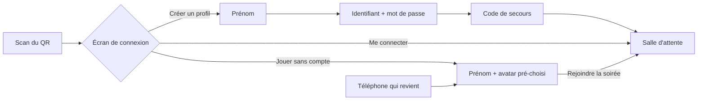

# FiestApp face aux autres — rapport de l'expert benchmark

*Analyste produit · atelier du 24 septembre 2026 · compte d'animateur « Sam » (`chez-sam`)*

## En bref

Sur ce qui fait une soirée entre amis, FiestApp fait mieux que tous les
outils du marché : pas de plafond de joueurs, des équipes et des estimations
gratuites (payantes ou absentes ailleurs), la question lue sur le téléphone,
un bilan public et imprimable pour chaque invité, et une robustesse
(reconnexion par jeton, accusé de chaque réponse) que Kahoot n'offre pas :
chez lui, qui revient doit reprendre un pseudo et repart de zéro. FiestApp
demande en revanche **plus de pas à deux endroits** : l'invité qui scanne fait
4 gestes au lieu de 3, et l'animateur neuf part d'une **bibliothèque vide**,
alors que les modèles de l'application existent déjà dans le dépôt. Les trois
emprunts les plus rentables, sans rien trahir des partis pris :
**(1) un « Partir d'un modèle » dans la bibliothèque vide** (S),
**(2) un nom de soirée à dire et à taper, affiché comme un code**, avec une
entrée qui pardonne (S), **(3) un « temps prolongé » réglable pour la
soirée**, comme les *Extended Timers* de Jackbox (M). Juste derrière : un
bouton « Partager » sur la fin de soirée, la lecture à voix haute au
téléphone, et une vraie vue « télécommande » pour l'animateur.

## Méthode

- **Recherche en ligne** (WebSearch, le 24 septembre 2026) sur les sept
  concurrents : prix et plafonds de l'offre gratuite, façon de rejoindre,
  création de quiz (IA, import), animation au téléphone, équipes, rapports,
  accessibilité. Chaque fait a sa source au tableau (§ Mesures). Les sources
  sont surtout des pages d'aide officielles, et des comparatifs de 2026
  quand l'éditeur ne publie pas le chiffre. Ce que je donne **de mémoire**
  (sans source relue ce jour) est marqué *(mém.)*.
- **L'atelier** (régie de la tablée, serveur jetable, Chromium) : j'ai compté
  chaque geste avec `pilote.mjs`, sur un compte d'animateur neuf. Activation,
  quiz écrit par « Coller une liste » (5 questions), lancement sur l'écran
  commun en **1366 × 768**, entrée d'une invitée anonyme en **360 × 640**,
  chemin sans QR par l'accueil `/`, création d'un profil à l'entrée, partie
  jouée avec trois joueurs fantômes, podium, clôture, fin de soirée au
  téléphone, souvenir, et la console d'animateur ouverte sur un téléphone
  (412 × 915).
- **Lecture** : README (« La direction » en entier), CLAUDE.md, la synthèse
  du 23 septembre, et le code quand un constat en dépendait.
- **Pas couvert** : je n'ai ouvert aucun concurrent en vrai (pas de compte,
  pas de navigateur vers leurs sites), donc leurs pas sont ceux de leur
  documentation. Je n'ai pas mesuré les temps (la machine est partagée) :
  seulement les gestes. Environ une heure et demie.

## Constats

### 1. L'animateur neuf part d'une page blanche — les modèles existent, mais pour l'administrateur seul
- **Où** : `/edit` d'un compte neuf (« Aucun quiz pour l'instant. Crée le
  premier ! ») ; `server/src/core/seed.ts:10-28`, qui importe
  `server/content/quiz/*.json` **dans l'espace de l'administrateur seulement**,
  une fois.
- **Constat** : le dépôt livre déjà deux quiz, dont un modèle fait pour la
  fête, « ⭐ Qui connaît le mieux [Prénom] ? (✏️ à personnaliser !) ». Un ami
  à qui l'on ouvre un espace ne les voit jamais. Kahoot, AhaSlides (plus de
  3 000 modèles, gratuits), Wayground et Blooket s'ouvrent tous sur une
  bibliothèque à copier.
- **Preuve** : atelier, compte `sam` activé, `/edit` vide ; README l. 180
  (« Les autres comptes commencent avec une bibliothèque vide »).
- **Qui ça touche** : chaque nouvel animateur, au moment où il décide s'il
  adopte l'outil. « Coller une liste » et « Copier le format complet »
  rattrapent beaucoup, mais il faut savoir quoi y écrire.
- **Statut** : friction. Aucun parti pris en jeu.
- **Piste** : dans la bibliothèque vide (et derrière un bouton discret
  ensuite), « Partir d'un modèle », qui liste les fichiers de
  `server/content/quiz/` et les copie par la création de quiz habituelle.
  C'est le même chemin que `seedLibrary(store, spaceId)`, mais au geste et
  pour l'espace connecté. Un test : un compte neuf copie un modèle et le
  retrouve dans sa bibliothèque, sans rien toucher à celle de l'admin.
- **Priorité · effort** : P2 · S.

### 2. Rejoindre sans le QR : une adresse à dicter, et un « nom de la soirée » que l'écran n'affiche pas comme tel
- **Où** : écran commun, salle d'attente (capture
  `retours/2026-09-24/experts/captures/benchmark-1-salle-d-attente.png`) ;
  accueil `/` → « Rejoindre une soirée » → « Quelle soirée ? »
  (`client/src/components/Rejoindre.tsx:22-66`).
- **Constat** : l'écran projette `http://…/chez-sam`, et le titre « La soirée
  de Sam ». L'accueil, lui, demande « Le nom de la soirée ». Taper « Chez
  Sam » marche (`normalizeSlug`, bravo), mais « sam », ce qu'on lit en gros
  au mur, mène à « Cette adresse ne mène à aucune soirée ». Kahoot affiche un
  PIN à 6-7 chiffres sur kahoot.it, et Jackbox 4 lettres sur jackbox.tv
  *(mém.)* : un code **fait pour être dit**. En ligne, l'adresse de FiestApp,
  c'est `fiestapp-quizz.onrender.com/chez-sam`.
- **Preuve** : atelier, `sam-tel2` : `ouvrir /` → « Rejoindre une soirée » →
  `ecrire "Le nom de la soirée" "sam"` → refus ; même chose avec « Chez Sam »
  → l'entrée de `chez-sam`.
- **Qui ça touche** : l'invité au téléphone sans appareil photo ou qui
  n'arrive pas à scanner, celui qui rejoint depuis le canapé du fond, et
  l'animateur qui dicte. C'est le cas « celle qui n'a pas le QR » de la
  tablée.
- **Statut** : friction.
- **Piste** : (a) dans la bande « Rejoindre » de l'écran commun, une seconde
  ligne, *« ou sur fiestapp-quizz.onrender.com, tape **chez-sam** »*, avec le
  même mot que le champ de l'accueil ; (b) sur un refus, essayer aussi
  `chez-<saisie>` avant de dire non (« sam » → `chez-sam`). Ça ne révèle rien
  qu'une adresse publique ne dise déjà, et ça ne liste aucun espace
  (invariant 3). Le nom d'espace **est** déjà le code de la soirée : il n'y a
  pas de PIN à inventer, qui changerait à chaque soirée et casserait les QR
  imprimés.
- **Priorité · effort** : P2 · S.

### 3. L'invité anonyme fait 4 gestes, pas 3 : l'écran de choix passe avant le prénom
- **Où** : entrée d'une soirée (capture
  `retours/2026-09-24/experts/captures/benchmark-2-entree-telephone.png`).
- **Constat** : scanner → « Jouer sans compte » → prénom → « Rejoindre la
  soirée » : **4 gestes** (l'avatar est pré-choisi, et c'est très bien).
  Kahoot par QR : scanner (le PIN est dans le lien) → pseudo → « OK » :
  **3**. Le premier parti pris dit « On scanne, on tape un prénom, on joue » :
  c'est aussi 3. Or l'écran du prénom porte déjà, en bas, un lien « j'ai un
  profil ».
- **Preuve** : atelier, `sam-tel1` (360 × 640) : `scanner`, `toucher "Jouer
  sans compte"`, `ecrire e25 "Mamie"`, `toucher e54` → salle d'attente.
  Kahoot : [aide officielle « How to join a Kahoot! game »](https://support.kahoot.com/hc/en-us/articles/360039890713-Kahoot-join-How-to-join-a-Kahoot-game).
- **Qui ça touche** : la moitié anonyme de la salle, à chaque première
  venue. Le téléphone qui revient, lui, arrive directement au prénom
  pré-rempli, donc un geste de moins.
- **Statut** : **tension avec un parti pris**. CLAUDE.md assume que
  « l'entrée est un écran de connexion », et le parti pris n° 1 veut un
  geste pour jouer. C'est à arbitrer, pas à corriger.
- **Piste** : pour un téléphone qui n'a **jamais** vu de profil, ouvrir
  directement sur l'écran du prénom, avec « J'ai un profil · Créer un
  profil » bien visibles en tête ou en pied. Garder l'écran de connexion en
  premier pour le téléphone qui a déjà eu un profil. À mesurer par une
  tablée (la grand-mère trouve-t-elle toujours son chemin ?).
- **Priorité · effort** : P3 · S (le choix d'ordre), à décider d'abord.

### 4. Pas de temps prolongé pour la soirée : chaque question garde le chrono écrit dans le quiz
- **Où** : le temps est réglé question par question (5 à 120 s,
  `shared/library.ts:10-12`). Il n'existe aucun réglage de soirée.
- **Constat** : Jackbox propose depuis le Party Pack 2, dans presque tous ses
  jeux, **Extended Timers**, et depuis le Pack 8 **No Timer**, présentés
  comme des réglages d'accessibilité. Kahoot a *Read aloud* *(voir § 6)*.
  Dans FiestApp, pour une salle avec des enfants, des grands-parents ou un
  invité qui lit mal, il faut retoucher chaque question. Le temps de lecture
  offert atténue le problème (et c'est une vraie avance, § « Ce qui
  marche »), mais la fenêtre de réponse reste la même.
- **Preuve** : [Jackbox, « What accessibility features are available »](https://support.jackboxgames.com/hc/en-us/articles/15794801592855-What-accessibility-features-are-available-in-your-games) ;
  [Accessibility Features in Party Pack 10](https://www.jackboxgames.com/blog/accessibility-features-in-the-jackbox-party-pack-10).
- **Qui ça touche** : quelques invités, mais ceux qui décrochent en premier.
- **Statut** : idée.
- **Piste** : dans le choix du quiz (à côté de « points normaux / ×2 / ×3 »),
  **« Temps : normal · +50 % · ×2 »**, appliqué par le serveur à `duration`
  au lancement de la partie et gardé dans l'état persisté (invariant 5). Tout
  le monde a le même temps : l'équité tient, et le barème n'est pas touché
  (les points restent écrits au journal, sans `VERSION_BAREME`).
- **Priorité · effort** : P2 · M.

### 5. L'après-soirée n'a pas de bouton « Partager »
- **Où** : fin de soirée au téléphone (« Rejoindre la soirée suivante »,
  « Revoir la soirée ») ; souvenir.
- **Constat** : la fin de soirée mène au souvenir d'un geste (vérifié), mais
  pour poster le lien dans le groupe il faut copier l'adresse à la main. Seul
  le bilan a « Copier le lien ». `navigator.share` n'apparaît nulle part dans
  `client/src`. Jackbox (post-game sharing, Pack 8) et Kahoot (partage des
  résultats) *(mém.)* poussent ce geste. La tablée d'hier le demandait déjà
  (idée de Camille M.).
- **Preuve** : `grep -rn "navigator.share" client/src` : rien ; atelier,
  `sam-tel1` : fin de soirée → « Revoir la soirée » → souvenir de l'archive.
- **Qui ça touche** : le lendemain de toute la salle. C'est le lien qui fait
  revenir.
- **Statut** : idée.
- **Piste** : « Partager la soirée » sur la fin de soirée et le souvenir :
  `navigator.share({ title, url })` quand il existe, sinon la copie dans le
  presse-papiers (sous try/catch). L'adresse vient de l'archive, jamais de
  l'espace (`derniere` change à la soirée suivante). Aucun fournisseur, aucune
  donnée : le parti pris 2 est tenu.
- **Priorité · effort** : P3 · S.

### 6. Rien ne lit la question à voix haute au téléphone
- **Où** : téléphone, pendant une question.
- **Constat** : Kahoot propose *Read aloud* gratuitement à tous les comptes
  (dans l'appli mobile) : la question puis les réponses, lues une à une et
  surlignées. FiestApp a fait le plus dur (la question s'affiche **sur** le
  téléphone, avec une zone `aria-live`, `PlayerApp.tsx:287`), mais sans
  lecteur d'écran, rien ne se lit à voix haute.
- **Preuve** : [Kahoot, Read aloud](https://support.kahoot.com/hc/en-us/articles/1500009756542-Read-aloud-app-feature) ;
  `grep -rn speechSynthesis client/src` : rien.
- **Qui ça touche** : l'invité qui lit mal, sans lunettes, ou un enfant.
- **Statut** : idée. **Tension légère** : le README veut que le son sorte
  **uniquement** de l'écran commun (« cinquante téléphones qui bipent
  ensemble »). Une lecture choisie par l'invité, au volume de son téléphone
  et à l'oreille, n'est pas un bip de salle, mais c'est à arbitrer.
- **Piste** : un bouton « 🔊 Lire » sur la question du téléphone, **jamais
  automatique** : `speechSynthesis.speak(new SpeechSynthesisUtterance(texte))`
  en `lang='fr-FR'`. Zéro fichier, zéro serveur.
- **Priorité · effort** : P3 · S-M.

### 7. L'animateur peut piloter depuis son téléphone, mais il y reçoit l'écran commun rétréci, pas une télécommande
- **Où** : `/host` ouvert sur un téléphone de l'animateur (capture
  `retours/2026-09-24/experts/captures/benchmark-3-console-au-telephone.png`).
- **Constat** : ça marche, et c'est déjà beaucoup : deux écrans animateurs
  sont admis, la mise en page s'adapte, et « Jouer depuis cet appareil » est
  là. Mais le téléphone montre le QR en grand et la salle d'attente, et la
  console arrive sous la ligne de flottaison (412 × 915). Kahoot se pilote
  depuis son appli (et projette par AirPlay ou Chromecast) ; Mentimeter et
  AhaSlides ont une vue présentateur *(mém.)*.
- **Preuve** : atelier, `sam-tel3` (412 × 915) : `/connexion` → `/host` →
  capture.
- **Qui ça touche** : l'animateur qui veut animer debout, loin du PC branché
  à la télé.
- **Statut** : idée. **Tension avec le parti pris 3** si la télécommande
  montre la bonne réponse avant la révélation : `hostView` est faite pour
  être **projetée**, donc sans secret. Une vue « présentateur » avec la
  réponse serait un troisième type de vue, réservé à une session
  d'animateur. C'est défendable (l'animateur connaît ses quiz), mais c'est
  une porte de plus par où la réponse peut fuir. À arbitrer.
- **Piste** : sans toucher aux vues, une mise en page « télécommande » de
  `/host` sous 600 px de large : en haut, l'action principale et le compteur
  « 3 / 4 ont répondu » ; dessous, Pause, Suivante, Reposer ; le QR réduit à
  une vignette.
- **Priorité · effort** : P3 · M (la mise en page) ; la vue présentateur,
  L et à décider.

### 8. Un seul type de jeu, sans question « sondage »
- **Où** : `games/quiz.ts` ; README, « Les chemins ouverts ».
- **Constat** : Blooket a 27 modes (18 gratuits), Kahoot a Team mode et ses
  variantes, Mentimeter et AhaSlides ont nuages de mots et sondages.
  FiestApp a QCM, vrai/faux et estimation, plus la photo qui disparaît. Pour
  une fête, ce qui manque le plus n'est pas un mode de plus mais **la
  question sans bonne réponse** : « Qui est le plus susceptible de… ? »,
  avec les invités comme choix, et la répartition comme révélation. C'est
  l'ADN de Jackbox (vote du public) et le prolongement naturel du modèle
  « Qui connaît le mieux [Prénom] ? ».
- **Statut** : idée, sur un chemin déjà ouvert par le README.
- **Piste** : un troisième `kind` (`sondage`), sans points, ou avec des
  points pour qui vote comme la majorité. Il faut alors le décider comme un
  barème, et le dire.
- **Priorité · effort** : P3 · L.

### 9. Ce qui tient de la tablée du 23 septembre (vu en passant)
- Le tutoiement est rétabli dans l'éditeur (« Crée le premier ! »).
- Le podium du souvenir se lit dans l'ordre des rangs (« Rang 1 : Léa »
  d'abord).
- La clôture propose encore « Soirée du 24 septembre 2026 », et non le titre
  de la soirée (axe 7 d'hier). À vérifier dans #28 si c'est un choix.

## Mesures et cartes

### Les pas, comptés

Un geste = un toucher, une saisie de champ ou un scan. Fermer le clavier
n'est pas compté. FiestApp : mesuré dans l'atelier. Concurrents : d'après
leur documentation.

| Parcours | FiestApp (mesuré) | Kahoot | Jackbox | Mentimeter |
|---|---|---|---|---|
| Invité anonyme, par QR | **4** : scan · Jouer sans compte · prénom · Rejoindre | **3** : scan · pseudo · OK ¹ | pas de QR, voir ligne suivante *(mém.)* | 2-3 : scan · (pseudo au quiz) ² |
| Invité sans QR | **7** par l'accueil : adresse du site · Rejoindre une soirée · nom · Rejoindre · Jouer sans compte · prénom · Rejoindre ; **5** en tapant l'adresse complète | 4 : kahoot.it · PIN · pseudo · OK | 4 | 3 : menti.com · code · pseudo |
| Invité qui revient | 2 : scan · confirmer (prénom pré-rempli) | 3 (et **il repart de zéro** s'il quitte en cours de partie ¹) | 4 | 3 |
| Créer un profil / compte joueur | 7 : scan · Créer un profil · prénom · Continuer · mot de passe · Créer · C'est noté. **Aucune adresse e-mail** | compte : e-mail ou SSO, âge, rôle *(mém.)* | aucun | aucun |
| Premier quiz de l'animateur (5 questions, liste prête) | 7 : Mes quiz · Nouveau quiz · titre · Coller une liste · coller · Ajouter · Enregistrer | générateur IA ou import tableur (modèle à télécharger) ³ | quiz fournis, pas d'édition | éditeur de diapos |
| Lancer le quiz | 3 : Écran commun · Lancer un quiz · C'est parti ! | ~3 : Start · Classic/Team · Start *(mém.)* | 2 | 1 |
| Après la partie → souvenir partagé | 1 geste au téléphone (Revoir la soirée), puis copie de l'adresse à la main | rapport à l'hôte seul (détail payant) ⁴ | partage d'après-partie *(mém.)* | résultats à l'hôte |

¹ [Kahoot, How to join a game](https://support.kahoot.com/hc/en-us/articles/360039890713-Kahoot-join-How-to-join-a-Kahoot-game) (consulté le 24/09/2026) : « you must pick a new nickname, and your score resets » quand on rejoint après être sorti.
² [Mentimeter, How to participate](https://help.mentimeter.com/en/articles/410537-how-to-participate-in-a-menti) ; pseudo et avatar seulement pour les diapos Quiz.
³ [Kahoot, generate a kahoot with AI](https://support.kahoot.com/hc/en-us/articles/40803785990675-How-to-generate-a-kahoot-with-AI) ; [import tableur](https://support.kahoot.com/hc/en-us/articles/115002812547-How-to-import-questions-from-a-spreadsheet-to-your-kahoot) (120 caractères par question, 75 par réponse).
⁴ [Kahoot Free Plan guide 2026](https://triviaeverywhere.com/blog/kahoot-free-plan-guide/).

### Les fonctions, face à face (offre gratuite, septembre 2026)

| | **FiestApp** | Kahoot | Wayground (ex-Quizizz) | Mentimeter | AhaSlides | Slido | Blooket | Jackbox |
|---|---|---|---|---|---|---|---|---|
| Prix | 0 € (auto-hébergé, Render + Turso gratuits) | gratuit, puis 36 à 300 $/an ᵃ | gratuit pour un enseignant ᵇ | gratuit ᶜ | gratuit ᵈ | gratuit ᵉ | gratuit ᶠ | 10 à 30 $ le pack ᵍ |
| Joueurs, offre gratuite | **150 par défaut, réglable** | **10** (3 pour un compte entreprise) ᵃ | — | **50 par mois** ᶜ | 50 par session ᵈ | 100 par événement ᵉ | 60 ᶠ | 8 + public ᵍ |
| Rejoindre | QR · adresse · nom de soirée | QR · PIN · lien | code · lien | QR · code · lien | QR · code | QR · code | code | code à 4 lettres |
| Compte joueur | facultatif, **sans e-mail** | facultatif (identifiant exigible) | facultatif *(mém.)* | aucun | aucun | aucun | facultatif *(mém.)* | aucun |
| Équipes | **oui, à la moyenne par membre** | payant ʰ | *(mém.)* modes d'équipe | un appareil par équipe ² | oui *(mém.)* | non | modes d'équipe, certains payants | selon le jeu |
| Estimation chiffrée | **oui, payée à la distance** | curseur, payant *(mém.)* | *(mém.)* | non | non | non | non | quelques jeux |
| Question sur le téléphone | **oui, toujours** | option ⁱ | oui | oui | oui | oui | oui | oui |
| Création par IA | **format copié pour n'importe quelle IA** (sans fournisseur) | intégrée, limitée en gratuit ³ | hub IA ᵇ | intégrée *(mém.)* | intégrée, gratuite ᵈ | *(mém.)* | *(mém.)* | — |
| Import | liste collée, fichier `.quiz.json` | tableur ³ | fichier | — | — | — | CSV *(mém.)* | — |
| Modèles de départ | **admin seul** (constat 1) | bibliothèque publique | bibliothèque | modèles | 3 000+ ᵈ | modèles | bibliothèque | quiz fournis |
| Télécommande au téléphone | `/host` responsive (constat 7) | appli + AirPlay/Chromecast ʲ | *(mém.)* | vue présentateur *(mém.)* | vue présentateur *(mém.)* | *(mém.)* | — | — |
| Rapport après partie | **bilan public par invité, fiches PDF, CSV, historique** | score seul en gratuit ⁴ | rapports enseignant | résultats | rapports payants *(mém.)* | analytics *(mém.)* | rapports *(mém.)* | partage *(mém.)* |
| Reprise après coupure | **jeton, points gardés, accusé de chaque réponse** | nouveau pseudo, score remis à zéro ¹ | *(mém.)* | — | — | — | *(mém.)* | reconnexion *(mém.)* |
| Accessibilité notable | question au téléphone, temps de lecture offert, formes ▲◆●■, mode Ivoire, animations coupées sur demande | lecture à voix haute, lecteurs d'écran ʲ | aménagements élargis ᵇ | — | — | — | — | **Extended Timers, No Timer**, sous-titres ᵏ |
| Données demandées | aucune (prénom, avatar) | e-mail de l'hôte | e-mail de l'enseignant | e-mail de l'hôte | e-mail de l'hôte | e-mail de l'hôte | e-mail de l'hôte | achat Steam/console |

Sources consultées le 24 septembre 2026 :
ᵃ [PanQuiz, Kahoot Pricing 2026](https://www.panquiz.com/en/blog/kahoot-pricing/), [Kahoot free player limit](https://www.triviaanywhere.com/blog/kahoot-free-player-limit) ·
ᵇ [Wayground, rebrand](https://wayground.com/home/from-quizizz-to-wayground), [PR Newswire](https://www.prnewswire.com/news-releases/quizizz-becomes-wayground-announces-new-ai-and-curriculum-supports-302489367.html) ·
ᶜ [Is Mentimeter Free? (50 participants par mois)](https://www.productcompass.pm/p/mentimeter-free-plan), [aide Mentimeter](https://help.mentimeter.com/en/articles/465589-how-many-people-can-participate-in-a-menti) ·
ᵈ [AhaSlides, pricing](https://ahaslides.com/pricing/), [revue 2026 (50 participants, 5 diapos de quiz)](https://freesurveymakers.com/ahaslides/) ·
ᵉ [Is Slido Free? (100 participants, un quiz par événement)](https://www.productcompass.pm/p/slido-free-plan) ·
ᶠ [Blooket, Is Blooket Free?](https://help.blooket.com/hc/en-us/articles/17351034967959-Is-Blooket-Free), [Blooket pricing](https://nibble-app.com/blog/blooket-pricing) ·
ᵍ [Jackbox, site officiel](https://www.jackboxgames.com/), [Steam, Trivia Murder Party 3 (sortie le 17/09/2026, 8 joueurs)](https://store.steampowered.com/app/3048060/Trivia_Murder_Party_3/) ·
ʰ [Kahoot Free Plan guide (équipes, rapports payants)](https://triviaeverywhere.com/blog/kahoot-free-plan-guide/) ·
ⁱ [Kahoot, See questions on participant's screen](https://support.kahoot.com/hc/en-us/articles/115003197928-How-to-enable-See-questions-on-participant-s-screen-in-Kahoot-live-games) ·
ʲ [Kahoot, host with the mobile app](https://support.kahoot.com/hc/en-us/articles/360001515188-How-to-host-live-kahoots-with-the-mobile-app), [accessibilité](https://kahoot.com/accessibility/) ·
ᵏ [Jackbox, accessibility features](https://support.jackboxgames.com/hc/en-us/articles/15794801592855-What-accessibility-features-are-available-in-your-games).

### Les emprunts, confrontés aux quatre partis pris

Légende : ✅ tenu · ⚠️ tension à arbitrer · ❌ contraire.
Partis pris : **1** un geste pour jouer · **2** zéro euro, zéro donnée ·
**3** le serveur décide · **4** ce qui a été joué se garde.

| Rang | Emprunt | Chez qui | 1 | 2 | 3 | 4 | Prio · effort |
|---|---|---|---|---|---|---|---|
| 1 | « Partir d'un modèle » pour tout espace | Kahoot, AhaSlides, Blooket | ✅ | ✅ | ✅ | ✅ | P2 · S |
| 2 | Un nom de soirée à dire, et une entrée qui pardonne (`chez-` deviné) | Kahoot (PIN), Jackbox (4 lettres) | ✅ | ✅ | ✅ | ✅ (QR imprimés intacts) | P2 · S |
| 3 | Temps prolongé réglé pour la soirée | Jackbox Extended Timers | ✅ | ✅ | ✅ (appliqué par le serveur) | ✅ | P2 · M |
| 4 | « Partager la soirée » (Web Share) | Jackbox, Kahoot | ✅ | ✅ | ✅ | ✅ (adresse d'archive) | P3 · S |
| 5 | Lecture à voix haute sur demande | Kahoot Read aloud | ✅ | ✅ (synthèse du navigateur) | ✅ | ✅ | P3 · S-M ⚠️ son hors de l'écran commun |
| 6 | Prénom d'abord pour un téléphone neuf | Kahoot | ✅ (3 gestes) | ✅ | ✅ | ✅ | P3 · S ⚠️ l'entrée comme écran de connexion (CLAUDE.md) |
| 7 | Mise en page « télécommande » de `/host` au téléphone | Kahoot, Mentimeter | ✅ | ✅ | ✅ tant qu'elle reste une `hostView` ; ⚠️ si elle montre la réponse | ✅ | P3 · M |
| 8 | Question « sondage » (qui est le plus susceptible de…) | Jackbox, Mentimeter | ✅ | ✅ | ✅ | ✅ | P3 · L |
| — | **Écarté** : générateur IA intégré | Kahoot, AhaSlides, Wayground | ✅ | ❌ clé et fournisseur payant, textes envoyés à un tiers | ✅ | ✅ | « Copier le format complet » fait mieux, gratuit et avec l'IA qu'on veut |
| — | **Écarté** : jeu à son rythme ou devoirs | Wayground, Blooket, Kahoot | ✅ | ✅ | ✅ | ✅ | hors sujet : une soirée se joue ensemble ; à rouvrir seulement pour les absents |
| — | **Écarté** : pseudo obligatoire, généré, ou e-mail « identifiant » | Kahoot | ❌ | ❌ | — | — | l'absence, pas l'infériorité |
| — | **Écarté** : public de spectateurs au-delà des joueurs | Jackbox | ✅ | ✅ | ✅ | ✅ | sans objet : 150 joueurs par défaut, chacun joue |

## Ce qui marche — à ne pas casser

- **Pas de plafond de salle.** 150 invités par défaut et réglable, quand
  Kahoot s'arrête à 10 en gratuit, Blooket à 60, Mentimeter à 50 par mois.
  Pour une fête de famille, c'est **le** argument, et il tient au parti
  pris 2.
- **La reprise après coupure.** Chez Kahoot, qui sort doit reprendre un
  pseudo et repart de zéro (source ¹). Ici, le jeton, l'accusé de chaque
  réponse et l'heure du serveur font qu'on ne perd rien. Ça ne se voit pas
  dans une démo, et c'est ce qui fait qu'on relance l'outil.
- **Les équipes gratuites, classées à la moyenne** : payantes chez Kahoot,
  « un appareil par équipe » chez Mentimeter.
- **L'estimation payée à la distance**, avec le temps de lecture offert :
  deux règles plus justes que chez tous les concurrents, et qui gardent la
  salle entière dans la partie.
- **La question écrite sur le téléphone**, toujours. Chez Kahoot, c'est une
  option que l'hôte doit penser à activer. Ici, c'est la base de
  l'accessibilité (loin de l'écran, malvoyant, lecteur d'écran).
- **L'après-soirée.** Aucun concurrent ne donne à **chaque invité, sans
  compte**, le bilan de ses réponses, des fiches à imprimer et un historique
  des soirées. C'est ce qui fait de FiestApp une application de fête et non
  de classe.
- **« Copier le format complet »** : l'IA de son choix, gratuite, sans
  qu'aucune clé ni aucun texte ne passe par le serveur. Aucun concurrent n'a
  cette porte ouverte, et elle respecte le parti pris 2 mieux qu'un
  générateur intégré.
- **Un profil sans e-mail**, avec un code de secours, et des homonymes
  réglés à l'affichage. Personne d'autre ne fait ça.
- **L'entrée pardonne déjà** (« Chez Sam » → `chez-sam`), l'avatar est
  pré-choisi, et le téléphone qui revient ne fait que 2 gestes.

## Recommandations, dans l'ordre

1. **« Partir d'un modèle »** dans la bibliothèque de tout espace, à partir
   de `server/content/quiz/` (constat 1). P2 · S.
2. **Le nom de soirée comme un code** : une ligne « tape **chez-sam** » dans
   la bande Rejoindre de l'écran commun, et `chez-<saisie>` essayé avant de
   refuser (constat 2). P2 · S.
3. **Temps prolongé pour la soirée** (+50 % · ×2), choisi au lancement et
   appliqué par le serveur (constat 4). P2 · M.
4. **« Partager la soirée »** sur la fin de soirée et le souvenir (Web
   Share, sinon copie), toujours avec l'adresse d'archive (constat 5).
   P3 · S.
5. **Arbitrer l'ordre de l'entrée** pour un téléphone neuf (prénom
   d'abord : 3 gestes, comme Kahoot), puis le mesurer par une tablée
   (constat 3). P3 · S, après décision.
6. **« 🔊 Lire »** sur la question du téléphone, à la demande (constat 6).
   P3 · S-M, après arbitrage du son.
7. **Mise en page télécommande** de `/host` sous 600 px (constat 7). P3 · M.
8. **Question « sondage »**, le premier pas du second module (constat 8).
   P3 · L.

## Limites

- Aucun concurrent n'a été ouvert en vrai. Leurs pas sont ceux de leur
  documentation ou de comparatifs de 2026, et les cases *(mém.)* sont à
  revérifier avant de les citer ailleurs. Les offres gratuites changent vite
  (Kahoot a changé ses plafonds plusieurs fois).
- Les gestes de FiestApp sont comptés dans un Chromium piloté, pas sur un
  vrai téléphone : le scan d'un QR par l'appareil photo, et le clavier
  qu'il faut fermer, ajoutent de la friction réelle que je n'ai pas
  chiffrée.
- Pas de mesure de temps (ni de chargement, ni de réveil de l'hébergeur
  gratuit). Or le réveil de Render, jusqu'à une minute, est sans doute la
  plus grosse friction face à un Kahoot toujours debout. À mesurer par la
  mission performance.
- Je n'ai joué qu'un quiz de cinq questions, avec des fantômes : ni
  équipes, ni photo, ni remise des prix.
