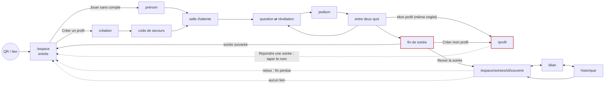
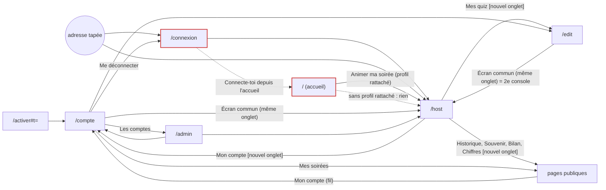

# La carte de l'application — rapport de l'expert architecte de l'information

## En bref

FiestApp a **une douzaine d'adresses et une vingtaine d'états sans adresse**.
Les pages publiques d'un espace (souvenir, bilan, soirées) forment un îlot bien
relié : un fil commun (`SpaceNav`), un bandeau d'archive, aucune impasse. Les
trous sont **aux jointures entre rôles et entre moments** : la page d'accueil
ignore la session d'animateur, `/connexion` est orpheline, la page de profil ne
sait pas quelle soirée on vient de quitter, et la fin de soirée d'un invité ne
vit qu'en mémoire — la quitter par l'un de ses propres liens, c'est la perdre
pour toujours. Les trois améliorations les plus rentables :
1. **Garder la fin de soirée** (stockage de session et liens dans un nouvel onglet)
   pour qu'on ne la perde plus en touchant « Revoir la soirée » ou « Créer mon profil ».
2. **« Ce soir » qui connaît la soirée en cours** sur `/profil` (et un
   « Rejoindre la soirée » sur le souvenir pendant une soirée ouverte).
3. **Une porte d'animateur sur l'accueil**, et des titres d'onglet partout.

## Méthode

- **Lecture du code** : `client/src/routes.ts`, `main.tsx`, les 12 vues et les
  composants qui portent des liens (`SpaceNav`, `ArchiveBanner`, `FinDeSoiree`,
  `Invitation`, `Rejoindre`, `retour.ts`) ; côté serveur, les redirections
  (`server/src/server.ts:470-486`), le 404 JSON (`:516`) et le repli `*` (`:548`).
- **Un arpenteur Playwright** (`retours/2026-09-24/experts/scripts/carte-du-site/arpenter.mjs`)
  qui visite **26 adresses** dans **4 rôles** (anonyme, animatrice `elodie`,
  administrateur `antoine`, joueuse à profil `margaux`) en 360 × 640 et relève
  l'adresse finale, le titre de l'onglet, les titres, les liens (texte → cible,
  `target`) et les boutons. Joué à **quatre moments** : sans soirée, choix du
  quiz, entre deux quiz, soirée close et archivée — **312 visites** au total.
- **Le pilote de la tablée** (atelier seul, salon `elodie`) pour les états sans
  adresse et le bouton retour : console en 1366 × 768, une invitée anonyme
  (Paulette) et une joueuse à profil (Margaux) en `petit-telephone`, trois
  fantômes ; un quiz de 5 questions (`quiz-express.mjs`, créé par l'API parce
  qu'un compte neuf n'a pas de quiz), clôture, retour arrière.
- Environ deux heures. **Pas couvert** : le téléphone de l'animateur qui
  pilote sa console (mode « Jouer depuis cet appareil »), la page « C'était un
  essai », l'exclusion d'un invité, les soirées à équipes, un vrai iPhone
  (geste retour de Safari).

## Constats

### 1. La fin de soirée se perd par ses propres liens
- **Où** : `client/src/components/FinDeSoiree.tsx:177-190`,
  `client/src/socket.ts:88-92`, `client/src/views/PlayerApp.tsx:233-237`.
- **Constat** : à la clôture, le téléphone oublie son identité
  (`oublierIdentite`) et garde la fin de soirée **dans l'état React seulement**.
  Ses deux liens, « Revoir la soirée » et « Créer mon profil », s'ouvrent **dans
  le même onglet** : au retour, l'invitée tombe sur l'entrée pré-remplie — son
  rang, ses exploits, ses niveaux ont disparu, et aucune adresse ne les rend.
  Même chose au moindre rechargement ou à la mise en veille longue d'Android.
- **Preuve** : Paulette, fin de soirée → « Revoir la soirée »
  (`/chez-elodie/soirees/2026-09-24-obhzo/souvenir`) → `retour` : l'entrée
  (`retours/2026-09-24/experts/captures/carte-du-site-2-fin-perdue.png`).
- **Qui ça touche** : chaque invité, au moment le plus émotionnel de la soirée ;
  l'anonyme surtout, qu'on invite justement à « Créer mon profil » par ce lien.
- **Statut** : bug confirmé (sens unique).
- **Piste** : ranger la fin reçue dans `sessionStorage` sous le slug (sous
  try/catch, comme le reste) et la relire au montage de `PlayerApp` tant que
  « Rejoindre la soirée suivante » n'a pas été touché ; en complément, ouvrir
  « Revoir la soirée » dans un nouvel onglet. Test : un rendu de `PlayerApp` avec
  une fin en stockage de session affiche `FinDeSoiree`, pas l'entrée.
- **Priorité · effort** : P2 · S.

### 2. `/profil` ne sait pas d'où l'on vient
- **Où** : `client/src/views/ProfilApp.tsx:168-183` ; le lien d'entrée
  `PlayerApp.tsx:389` (« Mon profil · niveau 1 », même onglet).
- **Constat** : entre deux quiz, Margaux touche « Mon profil ». La carte
  « Ce soir » n'offre que « Rejoindre une soirée », qui redemande **le nom de
  l'espace** à taper. Seul le bouton retour du navigateur la ramène à la soirée.
- **Preuve** : `retours/2026-09-24/experts/captures/carte-du-site-1-profil-en-soiree.png` ;
  relevé « entre-deux » : `joueuse / ⇒ … REJOINDRE UNE SOIRÉE` alors qu'elle
  est inscrite chez Élodie.
- **Qui** : tout joueur à profil (c'est le lien qu'on lui tend pendant la
  soirée) ; le parcours de retour est le plus long de toute la carte.
- **Statut** : friction (détour).
- **Piste** : `api.joueur.moi()` rend déjà `espace` (celui qu'il anime) ; y
  ajouter **la dernière soirée où ce profil est inscrit ce soir**, ou plus
  simplement lire le slug depuis le stockage du navigateur (`saveMe` le garde
  par espace) et afficher « Retourner chez Élodie » en premier bouton. Sinon,
  ouvrir « Mon profil » depuis `PlayerApp` en nouvel onglet.
- **Priorité · effort** : P2 · S.

### 3. L'accueil ignore l'animateur connecté, et `/connexion` est orpheline
- **Où** : `ProfilApp.tsx:99-121` (accueil sans profil) ; aucun lien vers
  `/connexion` dans tout le client (seulement des redirections :
  `AccountApp.tsx:24`, `AdminApp.tsx:37`, `AccountApp.tsx:114`).
- **Constat** : Élodie, connectée à son compte (session d'animateur, pas de
  profil rattaché), ouvre `/` : elle voit « Retrouver mon profil » — ni
  « Écran commun », ni « Mon compte », ni « Espace animateur ». Anonyme,
  personne ne peut découvrir `/host`, `/edit` ou `/connexion` depuis l'accueil :
  il faut connaître l'adresse. Le formulaire d'animateur renvoie, lui, vers
  l'accueil (« Connecte-toi depuis l'accueil ») : c'est un sens unique.
- **Preuve** : `retours/2026-09-24/experts/captures/carte-du-site-3-accueil-animatrice.png`
  (même appareil qui venait d'ouvrir `/host`) ; relevés des 4 moments : `/` et
  `/profil` n'ont **aucun lien** pour les rôles anonyme, animatrice et admin.
- **Qui** : l'animateur qui n'a pas rattaché de profil — celui du lien
  d'activation, donc **tout nouvel animateur** pendant sa première semaine.
- **Statut** : friction ; **tension** avec le parti pris « l'accueil est un
  écran de connexion de joueur, le chemin anonyme reste la valeur de
  l'application » (CLAUDE.md, « Ce qu'il ne faut pas faire »). Un petit lien
  de pied de page ne touche ni le format ni la place des deux gros boutons.
- **Piste** : dans `ProfilApp`, appeler `currentMe()` (déjà utilisé par
  `SpaceNav`) ; s'il répond, un bouton « Ouvrir ma console » au-dessus de
  « Rejoindre une soirée » ; sinon, en pied de page, un lien discret
  « Espace animateur » → `/connexion`.
- **Priorité · effort** : P2 · S.

### 4. Les pages d'une soirée qui ne mènent pas à la soirée
- **Où** : `SpaceNav.tsx:17-21` (trois onglets : Souvenir, Bilan, Soirées),
  `RecapApp.tsx` (« La soirée n'a pas encore commencé »).
- **Constat** : le souvenir, le bilan et l'historique d'un espace n'ont
  **aucun lien vers `/<espace>`**, la page où l'on joue — ni vers l'accueil. En
  salle d'attente, le souvenir dit « La soirée n'a pas encore commencé » et
  s'arrête là : une impasse pour qui a reçu le lien du souvenir la semaine
  précédente et arrive en avance.
- **Preuve** : relevé « choix du quiz » et « sans soirée » :
  `/chez-elodie/souvenir | La soirée n'a pas encore commencé. | SOUVENIR ; BILAN ; SOIRÉES`.
- **Qui** : l'invité qui revient par un lien partagé ; peu fréquent pendant la
  soirée (le QR est là), fréquent le lendemain.
- **Statut** : friction (impasse partielle, pas d'accès à la soirée).
- **Piste** : un quatrième onglet « Jouer » (ou un bouton sous l'en-tête du
  souvenir vide) vers `spacePath(slug)` ; sur une page archivée, « La
  prochaine soirée » vers la même adresse.
- **Priorité · effort** : P3 · S.

### 5. Deux consoles ouvertes par un aller-retour ordinaire
- **Où** : `HostApp.tsx:1017-1023` (« Mes quiz », « Mon compte » en
  `target="_blank"`) ; `EditorApp.tsx:257`, `AccountApp.tsx:59`
  (« Écran commun » vers `/host`, même onglet).
- **Constat** : console → « Mes quiz » (nouvel onglet) → « Écran commun » :
  ce nouvel onglet devient **une deuxième console**. « Mon compte » depuis elle
  en ouvre un troisième. L'onglet de l'éditeur a disparu, et l'animatrice a deux
  `/host` vivants (deux fois les sons, deux fois les gestes possibles).
- **Preuve** : pilote, `onglets` après ces trois gestes :
  `elodie → /host · elodie:onglet2 → /host · elodie:onglet3 → /compte`.
- **Qui** : l'animateur, en pleine soirée, sur le portable branché à la télé.
- **Statut** : friction confirmée ; les sons doublés restent **non confirmés**.
- **Piste** : quand `/edit` ou `/compte` ont été ouverts par la console
  (`window.opener` sur la même origine, ou `?depuis=console`), transformer
  « Écran commun » en « Revenir à la console » qui fait `window.close()` (ou
  `opener.focus()`) ; sinon, donner au lien `target="fiestapp-console"` : un
  onglet nommé est réutilisé au lieu d'être dupliqué. Même nom de cible côté
  console pour « Mes quiz » (`target="fiestapp-quiz"`).
- **Priorité · effort** : P2 · S.

### 6. Adresses sans page : 404 muets et titres génériques
- **Où** : `SpaceNav.tsx:67-74` (`SpaceError`), `ActivateApp.tsx`,
  `AdminApp.tsx:33`, `routes.ts:39-40`.
- **Constat** :
  - `/espace-qui-nexiste-pas/souvenir` et `/chez-elodie/soirees/inexistante` :
    « Impossible de charger le souvenir de la soirée. » (le serveur a répondu
    404, pas une panne), sous un fil dont **les trois onglets mènent à la même
    erreur** pour un espace inconnu ; onglet « FiestApp », pas de `h1`.
  - `/espace-qui-nexiste-pas` : « Quelle soirée ? » **sans** bouton
    « Revenir », alors que `/chez-elodie/nimporte` l'a.
  - `/activer` sans jeton ou jeton consommé : le formulaire s'affiche, le
    message dit « demande-en un nouveau », aucune sortie.
  - `/admin` pour un animateur non admin : une phrase, **aucun lien**.
  - `/host/plus`, `/edit/xyz` ouvrent la console ou l'éditeur (seul le premier
    segment compte) : sans conséquence, mais incohérent avec
    `/chez-elodie/nimporte`, qui est refusé.
- **Preuve** : relevés `1-sans-soiree` et `3-entre-deux`, lignes citées.
- **Statut** : friction (impasses mineures).
- **Piste** : distinguer 404 et panne dans `RecapApp`/`BilanApp`
  (`ApiError.status === 404` → « Cette soirée n'existe pas (ou plus). » + lien
  vers `/<espace>/soirees` ou, espace inconnu, vers `FormulaireSoiree perdu`) ;
  `onCancel` vers `/` sur l'entrée d'un espace inconnu ; un lien « Accueil »
  sous `/activer` et `/admin` refusé (« Mon compte ») ; `parseRoute` refuse
  les pages de compte suivies d'un segment.
- **Priorité · effort** : P3 · S.

### 7. Six pages sans titre d'onglet
- **Où** : `document.title` n'est posé que dans 6 vues sur 12.
- **Constat** : `/edit`, `/compte`, `/admin`, `/connexion`, `/activer`, la
  console **avant connexion** et toute page d'erreur s'appellent « FiestApp ».
  L'accueil anonyme s'appelle « Mon profil » alors qu'il n'y a pas encore de
  profil. L'animatrice qui a trois onglets ouverts (constat 5) les distingue
  mal, et l'historique du navigateur aussi.
- **Preuve** : colonne « onglet » des relevés (voir la matrice).
- **Statut** : friction.
- **Piste** : `Mes quiz · <titre de l'espace>`, `Mon compte`, `Les comptes`,
  `Connexion`, `Activer mon compte`, `Écran commun — connexion`, et `FiestApp`
  (ou « Rejoindre une soirée ») pour l'accueil sans profil.
- **Priorité · effort** : P3 · S.

### 8. Le bouton retour du navigateur, état par état
- **Où** : états sans adresse — l'accueil (`rejoindre`, création, secours),
  l'entrée d'une soirée (`Entree.tsx`), l'édition d'un quiz (`EditorApp`).
- **Constat** : seuls le bilan (`BilanApp.tsx:97`, `pushState`) et la soirée en
  cours (`retour.ts`, la garde « Quitter la soirée ? », qui **marche** : testée
  pendant une révélation) gèrent le retour. Partout ailleurs, retour = quitter
  la page :
  - `/chez-elodie` → « Jouer sans compte » → retour : sortie du site
    (`about:blank` depuis un QR, donc l'appareil photo) ;
  - `/` → « Rejoindre une soirée » ou « Créer un profil » → retour : la page
    précédente, pas l'accueil ;
  - `/edit` → « Éditer » un quiz → retour : `/compte`, l'éditeur est quitté
    (le brouillon du navigateur sauve le contenu, pas le geste).
- **Preuve** : pilote, `retour` après chacun de ces gestes (adresse relevée).
- **Qui** : les invités sous Android, dont le geste retour est fréquent et
  souvent involontaire (le commentaire de `retour.ts` le dit) ; l'animateur
  dans l'éditeur.
- **Statut** : friction.
- **Piste** : un petit crochet `useEtape(nom)` qui fait `pushState({etape})`
  à chaque étape et revient à l'étape précédente sur `popstate` — le même
  modèle que `BilanApp`. Pour l'éditeur, `?quiz=<id>` dans l'adresse (qui rend
  aussi l'édition rechargeable et partageable entre deux onglets).
- **Priorité · effort** : P3 · M.

### 9. Un même lieu, cinq noms
- **Où** : console, compte, fil, bandeau, fin de soirée.
- **Constat** : la liste des soirées s'appelle « Historique » (console),
  « Mes soirées » (compte), « Soirées » (fil), « Toutes les soirées »
  (bandeau), « Les soirées » (onglet). Le souvenir : « Page souvenir »,
  « Le souvenir », « Souvenir », « Revoir la soirée » ; et « Les chiffres »
  mène aussi au souvenir (`/stats` → `/souvenir#stats`). « Mes soirées »
  désigne en plus une section du profil, qui liste autre chose (les soirées
  **jouées**, tous espaces confondus).
- **Statut** : friction (vocabulaire).
- **Piste** : un nom par lieu — « L'historique » pour la liste, « Le souvenir »
  pour la page — et des verbes seulement sur les boutons (« Revoir la
  soirée » peut rester : c'est l'action, pas le lieu).
- **Priorité · effort** : P3 · S.

### 10. « Lancer un quiz » sans quiz : un toast qui dicte une adresse
- **Où** : `server/src/games/quiz.ts:517-518`, `HostApp.tsx:1003`.
- **Constat** : un compte neuf voit « Lancer un quiz » actif ; le toucher
  affiche un toast éphémère « Aucun quiz prêt à jouer — crée-en un dans
  l'espace animateur (/edit) ». Une adresse en texte au lieu d'un lien, sur
  l'écran projeté, qui s'efface avant qu'on la lise.
- **Preuve** : lecture du code ; au pilote, le geste « ne fait rien »
  (le toast était parti au relevé suivant).
- **Statut** : friction.
- **Piste** : la console sait si la bibliothèque est vide (le `pickPack`
  reçoit `packs`) ; à vide, le bouton devient « Créer mon premier quiz »
  → `/edit` (dans l'onglet nommé du constat 5).
- **Priorité · effort** : P3 · S.

### Ce qui tient de la synthèse du 23 septembre
Les axes 1 à 7 ne portaient pas sur la navigation. Côté carte, ce que la
première tablée avait trouvé tient : « Revoir la soirée » mène bien au
souvenir **archivé** de la soirée qu'on vient de clore (et non à la page vide
de la suivante), le bandeau « La dernière soirée » s'affiche sous l'adresse de
l'espace entre deux soirées, et la console offre « Le souvenir » à la clôture.

## Mesures et cartes

### Inventaire : 13 adresses, 22 états sans adresse

| Adresse | Vue | États sans adresse relevés |
|---|---|---|
| `/`, `/profil` | ProfilApp | sans profil : connexion · création · secours · « Quelle soirée ? » ; avec profil : page, « Quelle soirée ? » |
| `/<espace>` | PlayerApp + Entree | choix (connexion / sans compte / créer) · prénom · profil proposé · code de secours · salle d'attente · question · révélation · podium · entre deux quiz · carte d'un joueur · fin de soirée |
| `/host` | HostApp | connexion · salle d'attente · choix du quiz · question/révélation · podium · prix · victoire · clôture |
| `/edit` | EditorApp | connexion · liste · édition d'un quiz · import · « Coller une liste » |
| `/connexion` `/activer` `/compte` `/admin` | Login, Activate, Account, Admin | refus (`/admin` non admin), lien incomplet (`/activer`) |
| `/<espace>/souvenir` (`/stats`) | RecapApp | pas commencée · en cours · dernière soirée · archive · erreur |
| `/<espace>/bilan`, `/bilan/fiches` | BilanApp | vide · choisir · mon bilan (`#p=`) · la salle · fiches |
| `/<espace>/soirees` | ArchivesApp | vide · liste (+ « en cours ») · session révoquée |
| `/<espace>/soirees/<id>[/bilan]` | Recap/Bilan | archive · introuvable |
| tout le reste | LandingApp | « Quelle soirée ? » + « Revenir » |
| `/souvenir`, `/soirees`, `/bilan`… | serveur | 302 vers l'espace de l'administrateur |

### La carte de l'invité (anonyme ou à profil)

### La carte de l'animateur

### Matrice pages × liens (liens visibles, relevés par l'arpenteur)

Colonnes : où l'on peut aller **en un geste**. `●` lien, `◐` nouvel onglet,
`▲` seulement pour certains rôles, `—` rien.

| Depuis ↓ / vers → | `/` | `/<esp>` (jouer) | `/host` | `/edit` | `/compte` | `/admin` | souvenir | bilan | soirées | onglet |
|---|---|---|---|---|---|---|---|---|---|---|
| `/` sans profil | — | (taper) | — | — | — | — | — | — | — | Mon profil |
| `/` avec profil | — | (taper) | ▲ animer | — | — | — | ● (ses soirées) | — | — | Mon profil |
| `/<esp>` entrée | — | — | — | — | — | — | — | — | — | titre de l'espace |
| `/<esp>` entre deux quiz | — | — | — | — | — | — | — | — | — | titre de l'espace |
| fin de soirée | ● profil | ● suivante | — | — | — | — | ● | — | — | titre de l'espace |
| `/host` salle d'attente | — | ◐ (petits écrans) | — | ◐ | ◐ | — | ◐ chiffres | — | ◐ | … · Écran commun |
| `/host` podium | — | — | — | — | — | — | ◐ | ◐ | — | idem |
| `/host` clôture | — | — | — | — | — | — | ◐ | — | — | idem |
| `/edit` | — | — | ● | — | ● | ▲ | — | — | — | **FiestApp** |
| `/compte` | — | — (adresse à copier) | ● | ● | — | ▲ | — | — | ● | **FiestApp** |
| `/admin` | — | — | ● | — | ● | — | — | — | — | **FiestApp** |
| `/connexion`, `/host` et `/edit` déconnectés | ● | — | — | — | — | — | — | — | — | **FiestApp** |
| `/activer` | — | — | — | — | — | — | — | — | — | **FiestApp** |
| souvenir / bilan / soirées | — | **—** | — | — | ▲ animateur | — | ● | ● | ● | … · Souvenir |
| archive | — | — | — | — | ▲ | — | ● | ● | ● | nom de la soirée |
| erreur 404 d'une page publique | — | — | — | — | ▲ | — | ● (même erreur) | ● | ● | **FiestApp** |

### Impasses, orphelines, sens uniques

| Genre | Où | Gravité |
|---|---|---|
| **Sens unique** | fin de soirée → « Revoir la soirée » / « Créer mon profil » : pas de retour possible (constat 1) | P2 |
| **Sens unique** | soirée → « Mon profil » : retour seulement par le navigateur (constat 2) | P2 |
| **Sens unique** | `/connexion` → « Connecte-toi depuis l'accueil » → `/` ne ramène pas vers la console (constat 3) | P2 |
| **Orpheline** | `/connexion` : aucun lien n'y mène, seulement des redirections | P2 |
| **Orpheline** | `/host`, `/edit` pour un animateur sans profil rattaché : aucune entrée depuis l'accueil | P2 |
| **Orpheline (pour l'invité)** | le bilan de la soirée **en cours** : aucun lien depuis le téléphone (la console l'ouvre ; l'invité ne le trouve qu'après la clôture) | P3, peut-être voulu |
| **Impasse** | souvenir « pas encore commencé » : ni jouer ni accueil (constat 4) | P3 |
| **Impasse** | `/activer` lien incomplet ; `/admin` refusé (constat 6) | P3 |
| **Adresse vide** | `/<inconnu>/souvenir`, `/<esp>/soirees/<inconnu>` : « Impossible de charger » et un fil qui tourne en rond (constat 6) | P3 |
| **Détour** | bibliothèque vide : « (/edit) » dans un toast (constat 10) | P3 |
| **Doublon** | console → Mes quiz → Écran commun : deux consoles (constat 5) | P2 |

### Le modèle de navigation proposé

| Page | Ce qu'elle devrait offrir comme suite |
|---|---|
| `/` sans profil | les deux gros boutons (inchangés) ; **« Ouvrir ma console »** si une session d'animateur existe ; sinon un lien de pied « Espace animateur » |
| `/` avec profil | « Retourner chez <animateur> » si une soirée est en cours pour ce navigateur, **avant** « Rejoindre une soirée » ; « Animer ma soirée » inchangé |
| `/<esp>` entrée | chaque étape a son entrée d'historique ; retour = étape précédente |
| entre deux quiz | « Mon profil » en nouvel onglet (ou un retour qui sait revenir) |
| fin de soirée | relisible après un rechargement ; « Revoir la soirée » en nouvel onglet |
| `/host` | onglets nommés pour « Mes quiz » et « Mon compte » ; « Créer mon premier quiz » à bibliothèque vide |
| `/edit`, `/compte` ouverts par la console | « Revenir à la console » (ferme l'onglet) au lieu d'un second « Écran commun » |
| `/edit` | `?quiz=<id>` : l'édition a une adresse, le retour ramène à la liste |
| pages publiques | un onglet « Jouer » vers `/<esp>` ; 404 distincte d'une panne, avec la sortie qui va |
| `/activer`, `/admin` refusé, `/connexion` | un lien de sortie (« Accueil », « Mon compte ») et un titre d'onglet |

## Ce qui marche — à ne pas casser

- **Le fil des pages publiques** (`SpaceNav`) : trois onglets constants, qui
  gardent l'archive sous le pied (« Soirées » seul la quitte), un
  `aria-current`, et « Mon compte » pour l'animateur de l'espace seulement
  (vérifié : absent pour l'admin sur l'espace d'Élodie).
- **Le bandeau d'archive** et la bascule « La dernière soirée » entre deux
  soirées, sans redirection.
- **La garde du retour en soirée** (`retour.ts`) : testée en pleine révélation,
  « Quitter la soirée ? — Rester / Quitter », et elle se retire à la fin.
- **Les anciennes adresses** (`/souvenir`, `/soirees`) redirigent en 302 vers
  l'espace de l'administrateur ; `/stats` réécrit l'adresse en `/souvenir#stats`
  au lieu de dupliquer une page.
- **Les adresses perdues** ne laissent jamais une page blanche : « Quelle
  soirée ? » avec un message qui dit quoi faire.
- **Le bilan** : ses modes sont dans l'adresse (`#p=`), le retour marche, et
  « Copier le lien » donne l'adresse durable de l'archive.
- **La console garde l'écran projeté** : tout ce qui sort ouvre un nouvel
  onglet — c'est le bon parti pris ; seul le chemin inverse est à régler.
- `/connexion?next=` passe par `pageDeRetour` : aucun rebond vers ailleurs.

## Recommandations, dans l'ordre

1. **Fin de soirée relisible** (stockage de session, « Revoir la soirée » en
   nouvel onglet) — P2 · S.
2. **« Retourner à la soirée » sur `/profil`**, et « Mon profil » en nouvel
   onglet depuis la soirée — P2 · S.
3. **Une porte d'animateur sur l'accueil** (« Ouvrir ma console » si connecté,
   « Espace animateur » sinon) — P2 · S, à arbitrer avec le parti pris de
   l'accueil.
4. **Onglets nommés / « Revenir à la console »** pour ne plus dupliquer
   `/host` — P2 · S.
5. **Titres d'onglet** pour les six pages qui s'appellent « FiestApp » — P3 · S.
6. **404 distinctes et sorties** sur les pages d'erreur, `/activer`, `/admin`
   refusé, l'entrée d'un espace inconnu — P3 · S.
7. **Un onglet « Jouer »** dans le fil des pages publiques — P3 · S.
8. **« Créer mon premier quiz »** à la place du toast — P3 · S.
9. **Un nom par lieu** (« L'historique », « Le souvenir ») — P3 · S.
10. **Le retour du navigateur étape par étape** dans l'entrée, l'accueil et
    l'éditeur (`?quiz=`) — P3 · M.

## Limites

- Les états de la console à équipes (victoire, prix) et l'exclusion d'un
  invité n'ont été lus que dans le code, pas visités.
- Le geste retour a été simulé par `history.back()` de Chromium : le geste
  d'Android et le balayage de Safari iOS (qui peut restaurer la page depuis
  le cache) restent à vérifier sur de vrais appareils — le constat 1 pourrait
  y être moins grave (cache de page) ou pire (onglet tué en arrière-plan).
- Les sons doublés de deux consoles ouvertes (constat 5) ne sont pas
  confirmés.
- Les relevés bruts de l'arpenteur sont restés dans `export/` (ignoré par
  git) ; le script les régénère :
  `node retours/2026-09-24/experts/scripts/carte-du-site/arpenter.mjs <base> <sortie.json> [moment] [id-archive]`
  (Playwright global ; les comptes `elodie` et `margaux` doivent exister —
  `quiz-express.mjs` crée le quiz de cinq questions utilisé).
