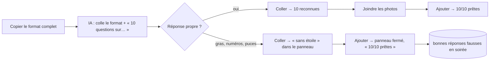

# L'éditeur de quiz, chronomètre en main — rapport de l'expert « outils de création »

## En bref

Un quiz de 10 questions (3 photos, 1 estimation, 1 vrai/faux, catégories, 45 s
partout) coûte **82 gestes et environ 600 frappes à la main** (≈ 5 min de
geste pur, plutôt 15 à 20 min en vrai), **9 gestes par « Coller une liste »**
et **2 par import d'un fichier exporté**. La liste collée est la bonne voie, et
l'axe 6 de la première tablée tient : une question neuve reprend le temps et
la catégorie de la précédente, l'aperçu joue la photo « mémoire », l'export
dit quoi faire du fichier. Trois défauts coûtent le plus :

1. **Une réponse d'IA « bavarde » (gras, numéros, puces, étoile à la fin) entre
   avec les mauvaises bonnes réponses, en affichant « 2/2 prêtes »** : l'avertissement
   disparaît avec le panneau, et les cartes n'en gardent rien.
2. **Le champ Temps ne se vide pas** : effacer « 20 » le fait revenir, et taper
   45 donne « 2045 », enregistré en 120 s sans un mot.
3. **Deux appareils sur le même quiz** (le portable et le téléphone de la
   mission) : le second « Enregistrer » écrase le premier en silence.

Ce qui rendrait l'éditeur deux fois plus rapide : un réglage « pour toutes les
questions » (temps, catégorie), une barre d'en-tête collante, et un type
« Vrai/Faux » d'un clic.

## Méthode

- **Atelier seul** (régie `--animateur Jules`, serveur `localhost:46611`),
  environ 1 h 15 le 24 septembre. Appareils : `jules` en `portable`
  (1366 × 768), `jules-tel` en `telephone` (412 × 915), connecté au même compte.
- **Les trois méthodes rejouées par script**, geste par geste, avec le pilote
  (`export/evaluations/editeur/geste.mjs`, `main.mjs`, `liste.mjs`) : chaque
  `toucher`, `ecrire`, `choisir`, `fichier`, `coller` compté, les caractères
  tapés comptés. Le **temps humain** est estimé au modèle KLM (pointer-cliquer
  1,1 s, 0,28 s par caractère — 40 mots/min —, liste déroulante 2,5 s, boîte de
  fichier 6 s, collage 3 s), sans le temps de réflexion : c'est un plancher. Le
  temps des agents ne dit rien d'un humain.
- **Le même contenu** pour les trois (`contenu.mjs`) : 10 questions, photos
  `gateau`, `ballons` (photo « mémoire »), `plage`, une estimation (330 mètres),
  un vrai/faux, 9 catégories dans l'ordre, 45 s partout.
- **Le lecteur de liste** passé au banc directement (`sale.ts`, `sale2.ts`,
  `sale3.ts` avec `npx tsx`) : 27 variantes qu'un ami ou une IA écrit.
- **Un quiz long** : mon propre Chromium (`long.mjs`) crée 10, 30 et 100
  questions, mesure la hauteur de page et le coût d'une frappe (du `keydown`
  au rendu suivant), CPU normal puis ralenti ×4 (téléphone moyen). Charge
  de la machine : 0,2 à 0,3.
- **Lu dans le code** : `client/src/views/EditorApp.tsx`, `shared/library.ts`,
  `shared/liste.ts`, `server/src/api.ts`.
- **Pas couvert** : un vrai téléphone (clavier réel, appareil photo), un
  lecteur d'écran, une vraie IA (j'ai écrit sa réponse à la main, dans le
  format propre puis dans un format « bavard » typique).

## Constats

### 1. Une liste « bavarde » entre avec de fausses bonnes réponses, marquée « prête »
- **Où** : « Coller une liste » → `parseImportedQuestions`, `shared/library.ts:555` ;
  le panneau `BulkImport`, `client/src/views/EditorApp.tsx:1133-1141`.
- **Constat** : l'étoile n'est reconnue **qu'en tête de ligne**. Une réponse
  mise en forme comme les IA et les humains l'écrivent le plus souvent —
  `**1. Quelle est la capitale… ?**`, `- Canberra *`, `B) *1989` — entre
  telle quelle : l'intitulé garde ses `**` et son « 1. », les réponses leurs
  « - » et « A) », et **la première réponse devient la bonne**. Le panneau le
  dit (« 2 sans étoile : la 1ʳᵉ réponse sera prise pour la bonne »), mais
  « Ajouter au quiz » reste actif et referme le panneau : l'éditeur affiche
  alors **« 2/2 prêtes »**, sans un ⚠ sur les cartes. Le quiz se joue faux.
  Autres lectures silencieuses : deux étoiles → la première gagne, sans
  mot ; une 5ᵉ réponse étoilée → coupée, et la 1ʳᵉ devient la bonne ;
  « Réponse : Canberra » en dernière ligne → une réponse de plus ; deux
  questions sans ligne vide entre elles → une seule question, la seconde
  devenue réponse ; « = 300 à 330 m » → 300, unité « à 330 m ».
- **Preuve** : `retours/2026-09-24/experts/captures/editeur-2-liste-ia-mal-lue.png`
  (Sydney et 1987 cochées, « 2/2 prêtes »). Rejouer : coller
  `**1. Quelle est la capitale de l’Australie ?**\n- Sydney\n- Canberra *\n- Perth`.
  Banc : `export/evaluations/editeur/sale.ts`, lignes `numerotee`, `lettres`,
  `gras`, `etoileFin`, `reponseLigne`, `sansLigneVide`, `deuxEtoiles`.
- **Qui ça touche, ce que ça coûte** : toute la salle — une bonne réponse
  fausse, découverte à la révélation, devant cinquante personnes. Le format
  copié dit bien « ni numéros, ni puces, ni gras » (`shared/liste.ts`), mais
  l'ami à qui on transfère un message, ou l'IA qui « met en forme » sa réponse,
  n'en tient pas compte.
- **Statut** : bug confirmé (le commentaire de `library.ts:565` promet « mieux
  vaut une alerte qu'un quiz faux », et l'alerte ne survit pas au panneau).
- **Piste** : (a) nettoyer avant de lire : retirer `**…**`, `__…__`, une
  numérotation `^\d+[.)]\s`, une puce `^[-•–]\s`, une lettre `^[A-D][.)]\s` ;
  accepter l'étoile en fin de ligne (`/\s*\*$/`) et « ✓ »/« (bonne réponse) » ;
  (b) une question sans étoile **n'est pas prête** : poser
  `correct = -1`/un drapeau `bonneAChoisir`, que `questionProblem` signale
  (« Choisis la bonne réponse ») — même mécanique que `photoAttendue` ;
  (c) deux étoiles ou plus de quatre réponses comptent comme « à vérifier »
  dans le résumé. Test : `liste.test.ts`, les sept blocs ci-dessus.
- **Priorité · effort** : P1 · S (nettoyage) + S (drapeau).

### 2. Le champ Temps ne se vide pas : « 45 » devient « 2045 », puis 120 s
- **Où** : `client/src/views/EditorApp.tsx:1559` —
  `value={question.duration || DEFAULT_DURATION}` et
  `onChange={e => … Number(e.target.value)}`.
- **Constat** : vider le champ donne `Number('') = 0`, que l'affichage
  remplace par 20. Au téléphone (retour arrière, retour arrière, 4, 5) comme
  au clavier (Ctrl+A, Suppr, 45), on lit **« 2045 »**. Rien ne le signale ;
  l'enregistrement le borne à **120 s** (`normalizeQuestions`,
  `shared/library.ts:348`). De même « 3 » devient 5 à l'enregistrement, sans
  un mot. Et la question suivante, voyant un temps hors bornes, repart à 20 s
  (`emptyQuestion`) : l'héritage du temps saute justement quand on l'a mal
  tapé.
- **Preuve** : `retours/2026-09-24/experts/captures/editeur-1-temps-2045.png`.
  Rejouer : `jules-tel toucher "Temps de réponse, en secondes"`, `touche End`,
  `touche Backspace` ×2 (le champ relit « 20 »), `touche 4`, `touche 5` →
  « 2045 ». Le geste `ecrire` du pilote tombe dans le même piège.
- **Qui ça touche** : l'animateur qui règle 45 s (la mission, et l'axe 6
  d'hier) ; puis la salle, qui joue une question de deux minutes.
- **Statut** : bug confirmé.
- **Piste** : garder le texte tapé, comme la cible de l'estimation
  (`cible` / `lireNombre`, même fichier, `:1300`) :
  `const [temps, setTemps] = useState(String(question.duration))`, l'état
  vide autorisé, et sous le champ, hors bornes : « De 5 à 120 s ». Au blur,
  borner et réécrire. Même traitement pour « Temps d'observation »
  (`:1649`).
- **Priorité · effort** : P2 · S.

### 3. Deux appareils sur un même quiz : le dernier « Enregistrer » écrase l'autre en silence
- **Où** : `PUT /api/quizzes/:id`, `server/src/api.ts:87-98` — aucune
  vérification de version.
- **Constat** : le portable et le téléphone ouvrent « Main levée ». Le
  téléphone change l'intitulé 1 et enregistre ; le portable change
  l'intitulé 2 et enregistre. Rouvert : l'intitulé 1 est revenu à l'ancien
  texte — « MODIF DU TELEPHONE » a disparu, et aucun des deux écrans ne l'a
  dit. Le mécanisme du brouillon sait déjà repérer « enregistré ailleurs
  depuis » (`brouillonDepasse`), mais seulement à la réouverture d'un
  brouillon.
- **Preuve** : rejoué dans l'atelier (`jules` et `jules-tel`, 17:20) ; la
  réouverture montre `MODIF DU PORTABLE` en question 2 et l'ancien texte en
  question 1.
- **Qui ça touche** : l'animateur qui écrit sur son téléphone dans le train
  et retouche sur le PC le soir, ou deux co-animateurs sur le même compte.
- **Statut** : bug confirmé.
- **Piste** : l'éditeur connaît déjà `base` (l'`updatedAt` d'où partent ses
  modifications). L'envoyer (`PUT … { title, questions, base }`) ; le serveur
  répond 409 si `quiz.updatedAt > base`, avec la version du serveur ; l'éditeur
  garde ses modifications (le brouillon est là) et propose « Garder la
  mienne » / « Voir l'autre ». Un champ absent (une page d'avant) garde
  l'ancien comportement — comme l'invariant 12. Test : deux `PUT` croisés
  dans `server/test/`.
- **Priorité · effort** : P2 · M.

### 4. Aucun réglage « pour toutes les questions »
- **Où** : `QuestionCard`, `EditorApp.tsx:1530-1565` ; rien d'autre dans
  l'éditeur (`grep "toutes"`).
- **Constat** : la question neuve hérite bien (axe 6 tenu : mes 9 questions
  suivantes sont toutes arrivées à 45 s, cf. `main.mjs`, journal
  `[{"n":2,"temps":"45"}…]`). Mais changer d'avis après coup — passer un quiz
  de 20 à 30 s, ou un quiz importé d'un ami — coûte 3 gestes par question
  (cliquer, tout sélectionner, taper), soit 30 gestes et 5 écrans de
  défilement pour 10 questions, 90 gestes et 14 écrans pour 30. Dans une
  liste collée, « Temps : 45 s » ne vaut que pour **son** bloc (banc
  `sale3.ts` : `[45, 20, 20]`) alors que « # Musique » vaut pour les
  suivants : l'IA doit répéter la ligne dix fois.
- **Statut** : friction (la première tablée l'avait déjà vue chez Nadia).
- **Piste** : dans l'en-tête, un menu « Régler tout le quiz » : temps (et
  catégorie) pour toutes les questions, ou « pour les questions sans
  réglage ». Dans la liste : une ligne `Temps : 45 s` **avant** le premier
  bloc (comme `# Catégorie`) vaudrait pour toutes les suivantes — à annoncer
  dans `FORMAT_DE_LISTE` et son exemple (piège du CLAUDE.md).
- **Priorité · effort** : P2 · S à M.

### 5. « Enregistrer » et « Annuler » vivent tout en haut d'une page de 5 à 45 écrans
- **Où** : `.editor-header` (`client/src/styles.css:1639`) n'est pas collant ;
  la ligne « Annuler » du déplacement est rendue sous le titre
  (`EditorApp.tsx:750-757`).
- **Constat** : une carte fait ~430 px au portable, ~790 px au téléphone. 10
  questions = 3 678 px (4,8 écrans de 768), 30 = 10 578 px (13,8), 100 =
  34 728 px (45) ; au téléphone, 10 questions = 12,4 écrans de 640. Après la
  dixième question, il faut remonter tout le quiz pour enregistrer. Pire :
  déplacer une question de la 3 à la 8 fait défiler jusqu'à elle, et le lien
  « Annuler » reste 2 000 px plus haut, invisible.
- **Preuve** : `retours/2026-09-24/experts/captures/editeur-3-annuler-hors-vue.png`
  (juste après « Déplacer » vers le n° 8 : la carte éclairée, aucun Annuler
  à l'écran) ; hauteurs mesurées par `long.mjs`.
- **Statut** : friction.
- **Piste** : `position: sticky; top: 0` sur `.editor-header` (avec son fond),
  qui porte « n/N prêtes », « Enregistrer », et la ligne « … · Annuler » ;
  ou un toast bas d'écran pour l'annulation, qui suit l'œil. Vérifier à
  360 × 640 que l'en-tête collant reste sur une ligne (titre réduit).
- **Priorité · effort** : P2 · S.

### 6. Supprimer une question ne se défait pas
- **Où** : `onDelete`, `EditorApp.tsx:776-778` ; `undo` ne connaît que les
  déplacements.
- **Constat** : une confirmation, puis plus rien — et toute modification
  efface même l'« Annuler » du déplacement. Le seul recours est « Retour →
  Effacer mes modifications », qui jette aussi tout ce qui a été écrit depuis
  le dernier enregistrement.
- **Statut** : friction.
- **Piste** : étendre `undo` à la suppression (garder la question et sa
  place, la réinsérer par `insertQuestions`), et supprimer **sans**
  confirmation une fois l'annulation offerte (Gmail) : un geste de moins.
- **Priorité · effort** : P3 · S.

### 7. Le vrai/faux se tape à la main, à chaque fois
- **Où** : le sélecteur QCM/Estimation, `EditorApp.tsx:1374-1389`.
- **Constat** : la mission et le README le disent : « on tape Vrai et Faux dans
  les deux premières cases ». 2 champs, 8 caractères, et deux cases
  « (optionnelle) » qui restent là. Rien ne rappelle cette astuce dans
  l'éditeur.
- **Statut** : friction · idée.
- **Piste** : un troisième bouton « Vrai/Faux » qui remplit les deux cases et
  masque les deux autres (le modèle reste un QCM à deux réponses : rien à
  changer côté jeu).
- **Priorité · effort** : P3 · S.

### 8. Recharger la page ramène à la liste, pas au quiz
- **Où** : `EditorApp` garde `editingId` en mémoire, sans adresse
  (`EditorApp.tsx:237`, aucun `pushState`).
- **Constat** : le brouillon tient (reprise complète — déplacement,
  suppression, frappe — en 3 gestes : Éditer, Reprendre, puis Enregistrer).
  Mais le rechargement renvoie à « Mes quiz », où il faut retrouver le bon quiz
  — j'en avais deux nommés « Main levée » après l'import (constat 10). Le
  bouton « précédent » du navigateur sort de l'éditeur au lieu de revenir à la
  liste.
- **Statut** : friction.
- **Piste** : `/edit/<id>` (ou `/edit#<id>`), lu au chargement ; « précédent »
  referme l'éditeur par `close()` (et sa question « Quitter sans
  enregistrer ? »).
- **Priorité · effort** : P3 · S.

### 9. Un temps ou une cible hors bornes ne se dit pas
- **Où** : `questionProblem`, `shared/library.ts:285`.
- **Constat** : « 3 s » ou « 2045 s » passent sans avertissement (recalés à
  l'enregistrement) ; « trois cents » en bonne réponse donne « Il manque la
  bonne réponse (un nombre) » — alors qu'on en a tapé une. Le lecteur de liste
  dit « 1 bloc(s) ignoré(s) » sans dire lequel : sur 30 blocs, on cherche.
- **Statut** : friction.
- **Piste** : sous le champ, « De 5 à 120 s » ; « « trois cents » ne se lit
  pas : tape 300 » ; dans le panneau de la liste, les premiers mots de chaque
  bloc ignoré (comme la liste des estimations lues, `EditorApp.tsx:1202`).
- **Priorité · effort** : P3 · S.

### 10. « Nouveau quiz » crée un quiz tout de suite, et l'import garde le même nom
- **Où** : `api.create('Nouveau quiz')`, `EditorApp.tsx:292` ; `importerQuiz`.
- **Constat** : ouvrir « Nouveau quiz » puis revenir laisse un « Nouveau quiz
  · 0 question prête » dans la liste — j'en avais deux au bout d'une heure.
  Importer un quiz qu'on a déjà donne deux quiz homonymes, que seule l'heure
  distingue. « Enregistré à 24 sept., 17:12 » se lit mal (« le 24 sept. à
  17:12 », ou « à 17:12 » le jour même).
- **Statut** : friction.
- **Piste** : ne pas proposer « Supprimer » mais le faire : un quiz vide et
  jamais renommé qu'on quitte s'efface ; à l'import d'un titre existant,
  « Main levée (2) ».
- **Priorité · effort** : P3 · S.

### 11. Au-delà de 30 questions, chaque frappe re-rend tout le quiz
- **Où** : `patch` recrée `quiz`, et chaque `QuestionCard` se re-rend (pas de
  `memo`) ; le brouillon est réécrit à chaque touche (`garderBrouillon`).
- **Constat** (frappe dans la dernière carte, médiane / 95ᵉ centile) :

  | Questions | CPU normal | CPU ×4 (téléphone moyen) | Ouverture (×4) |
  |---|---|---|---|
  | 10 | 5,7 / 16,5 ms | 24 / 34 ms | 0,23 s |
  | 30 | 11 / 23 ms | 43 / 60 ms | 0,38 s |
  | 100 | 31 / 42 ms | **148 / 204 ms** | 1,8 s |

  Linéaire : invisible à 30, sensible à 100 sur un téléphone (au-delà de
  100 ms, la frappe « colle »).
- **Preuve** : `export/evaluations/editeur/long.mjs` (charge 0,2-0,3).
- **Statut** : friction (seulement pour les très longs quiz, jusqu'à 100 permis).
- **Piste** : `React.memo(QuestionCard)` avec des rappels stables
  (`onChange(index, fn)` plutôt qu'une fermeture par carte) ; brouillon écrit
  à 300 ms d'intervalle au plus.
- **Priorité · effort** : P3 · S.

## Mesures et cartes

### Un quiz de 10 questions, par méthode

| Méthode | Gestes dans l'éditeur | Clics | Champs remplis | Caractères tapés | Listes | Fichiers | Temps humain (plancher KLM) | Reprises à la main |
|---|---|---|---|---|---|---|---|---|
| **À la main** | 82 | 22 | 48 | 596 | 10 | 3 | ≈ 4 min 50 s (+ la réflexion : 15-20 min réalistes) | 0 |
| **Coller une liste** (format complet copié, liste propre) | 9 | 5 | 1 (titre) | 12 | 0 | 1 boîte (3 photos) | ≈ 30 s + le détour chez l'IA (≈ 1-2 min) | 0 ; +1 clic pour la photo « mémoire » (ou une ligne « Observation : 5 s ») |
| **Coller une liste** (réponse d'IA « bavarde » : gras, numéros, puces) | 9 | 5 | 1 | 12 | 0 | 1 | idem | **toutes** : intitulés, réponses et bonnes réponses à retaper (constat 1) |
| **Importer un fichier** exporté | 2 | 1 | 0 | 0 | 0 | 1 | ≈ 10 s | 0 (photos, 45 s, catégories, photo « mémoire » : tout suit) |

Détail de la main (`mesures.jsonl`) : sur 82 gestes, 40 réponses de QCM, 10
intitulés, 9 catégories changées (les questions ne sont pas groupées par
thème : l'héritage de la catégorie n'en a épargné qu'une), **un seul** temps
réglé (l'héritage a fait les neuf autres), 3 photos, 1 case « mémoire », 2
bonnes réponses « Vrai/Faux » tapées à la main, 7 bonnes réponses cochées.

### Les autres gestes de la mission

| Geste | Coût | Remarque |
|---|---|---|
| Déplacer la 3 à la 8 | 3 gestes (pastille, numéro, Entrée) | l'« Annuler » est hors de vue (constat 5) |
| Dupliquer, insérer après | 1 geste | la copie arrive juste après, le curseur dans l'intitulé |
| Supprimer | 2 gestes | pas d'annulation (constat 6) |
| Régler 45 s sur **toutes** les questions après coup | 3 gestes × N | 30 pour 10, 90 pour 30 (constat 4) |
| Aperçu d'une photo « mémoire » | 1 geste | « Regardez bien… 5 s », puis la question — axe 6 tenu |
| Recharger en pleine écriture | 3 gestes pour reprendre | tout est revenu ; mais retour à la liste (constat 8) |
| Exporter | 1 geste | le message dit où est le fichier et quoi en faire — axe 6 tenu |

### Le parcours d'une liste d'IA

## Ce qui marche — à ne pas casser

- **L'héritage du temps et de la catégorie** (axe 6, #25) : une question neuve
  arrive à 45 s dans la bonne catégorie ; mes neuf suivantes n'ont demandé
  aucun réglage de temps.
- **Le format complet copié** : 2,9 Ko, règles, bornes, catégories et un
  exemple de tout ; une liste propre entre sans une retouche, photos jointes
  par leur nom, estimation lue « **330** mètres » dans le panneau avant
  d'ajouter.
- **L'import/export** : deux gestes, tout voyage (photos en clair, 45 s,
  catégories, photo « mémoire »), et le message d'export dit quoi faire.
- **Le brouillon** : rechargement en pleine écriture, tout revient
  (déplacement, suppression, frappe), avec « Reprendre / Les effacer ».
- **« Déplacer au n° »** et la carte éclairée qui suit l'œil et le clavier.
- **L'aperçu** qui projette aussi un brouillon et joue la phase « Regardez
  bien… ».
- **« 10/10 prêtes »** et les « ⚠ … ne sera pas jouée » : lisibles, justes —
  à condition qu'une question sans étoile en fasse partie (constat 1).

## Recommandations, dans l'ordre

1. **Liste collée : nettoyer gras, numéros, puces et lettres ; étoile en fin
   de ligne ; une question sans étoile n'est pas « prête »** — P1 · S.
2. **Champ Temps (et Observation) : garder le texte tapé, borner au blur, dire
   « de 5 à 120 s »** — P2 · S.
3. **En-tête collant** portant « prêtes », « Enregistrer » et « Annuler » — P2 · S.
4. **« Régler tout le quiz »** (temps, catégorie) ; `Temps :` en tête de liste
   vaut pour la suite — P2 · S-M.
5. **Enregistrement protégé** : `base` envoyé, 409 si le quiz a bougé
   ailleurs — P2 · M.
6. **Bouton « Vrai/Faux »** — P3 · S.
7. **Annuler une suppression** (et supprimer sans confirmation) — P3 · S.
8. **Adresse par quiz** (`/edit/<id>`) — P3 · S.
9. **Messages de bornes** et blocs ignorés nommés — P3 · S.
10. **Quiz vide abandonné effacé, import homonyme numéroté**, « Enregistré le
    … à … » — P3 · S.
11. **`memo` sur les cartes** pour les quiz de 100 questions — P3 · S.

Les trois premières divisent par deux le temps d'un quiz à la main qu'on
retouche (plus de remontée pour enregistrer, plus de temps retapé) et
suppriment le seul chemin par lequel l'éditeur laisse partir un quiz faux.

## Limites

- Les temps humains sont un plancher (modèle KLM, sans réflexion ni
  hésitation) ; les gestes et les caractères, eux, sont exacts.
- Aucune vraie IA n'a été interrogée : la réponse « bavarde » est celle que
  je leur connais (gras, numérotation, puces) ; à vérifier sur deux ou trois
  IA courantes avec le format copié tel quel — il se peut qu'elles le
  respectent mieux que prévu.
- Le téléphone est émulé (412 × 915, clavier simulé) : le « 2045 » est
  reproduit par touches, à revoir sur un vrai Android et un vrai iPhone
  (`type="number"` s'y comporte différemment, mais `Number('')` vaut 0
  partout).
- Les mesures de frappe dépendent du processeur ; seul leur rapport (linéaire
  en nombre de questions) est solide.
- Pas de lecteur d'écran ni de navigation au clavier seul dans l'éditeur.
