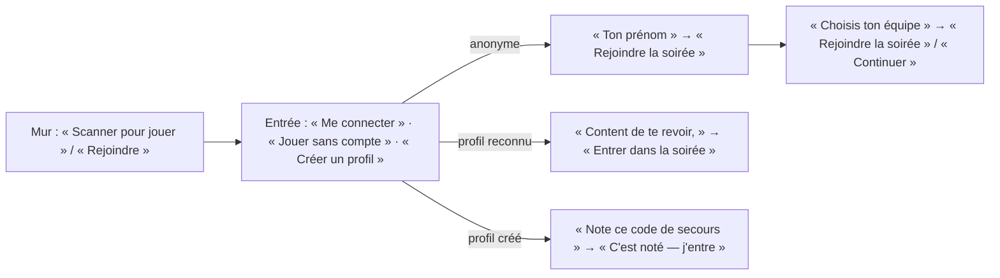

# Les mots de l'application — rapport de l'expert rédaction UX

## En bref

Les écrans de jeu sont bien écrits. Le téléphone parle court, au tu, et chaque
erreur d'invité dit quoi faire (« Ta réponse n'est pas partie — vérifie ta
connexion »). L'axe 7 de la première tablée tient pour l'essentiel : élision,
« 1ʳᵉ place », espaces fines, plus de « jeux physiques ». Les mots se gâtent
**dès qu'on sort de la question**. Le système des récompenses empile une
quinzaine de termes (souvenir, bilan, fiche, carte, palmarès, prix, hauts faits,
badges, légendaires, Divins, finitions, Éclat, barème, XP…) : plusieurs portent
deux sens, plusieurs noms sont donnés deux fois (« Le Devin », « Le Phénix »,
« L'Oracle »), et le classement des équipes est expliqué **de quatre façons
différentes, dont deux fausses**. Les trois corrections les plus rentables :
**(1)** une seule phrase, juste, pour dire comment les équipes se classent, et
bannir « barème » des écrans ; **(2)** un seul pitch du profil, qui ne promet pas
« tes points » ; **(3)** une passe de mots sur le mur et les pages partagées : une
consigne de l'animateur lue par toute la salle, « Le Sans-Faute » à 67 %,
l'année écrite « 1 889 », « Annuler » face à « Annuler les points ».

## Méthode

- **Inventaire complet** par lecture de l'arbre syntaxique. Le script
  `retours/2026-09-24/experts/scripts/mots/inventaire.mjs` relève les textes JSX,
  les attributs lisibles (`title`, `aria-label`, `placeholder`, `alt`), les
  chaînes et gabarits qui ressemblent à une phrase, et les `new Error('…')` de
  `client/src`, `shared` et `server/src`. Il sort **1 652 textes** (1 565 une fois
  écartés les tracés SVG et les classes). Je les ai tous lus, rangés par rôle
  (tableau plus bas), puis passés au crible par recherche : tu/vous, masculin,
  point médian, apostrophes, « wifi », « clique », « Quizz », doublons de noms.
  Pour rejouer : `node retours/2026-09-24/experts/scripts/mots/inventaire.mjs > inventaire.tsv`.
- **En situation**, sur ma propre régie (atelier, espace `chez-helene`) : compte
  activé ; quiz de 5 questions (3 QCM, 2 estimations dont une année) créé par
  « Coller une liste » ; un téléphone piloté en 360 × 640, qui joue sans compte
  sous « Jo » ; quatre fantômes (Camille ×2, Marie-Françoise, Jo) ; écran commun
  en 1366 × 768 ; quiz joué jusqu'au podium ; remise des prix, écran de
  victoire, clôture, fin de soirée au téléphone, souvenir, bilan, puis création
  d'un profil et page `/profil`. Environ deux heures au total.
- **Pas couvert en situation** : le mode équipes joué (ses textes sont lus dans
  le code), les pages admin au-delà de l'activation, la tablette, un lecteur
  d'écran réel. Les 1920 × 1080 n'ont pas été regardés : un mot ne change pas de
  sens avec la taille de l'écran.

## Constats

### 1. Le classement des équipes est expliqué de quatre façons, dont deux fausses
- **Où** : téléphone, classement (`client/src/views/PlayerApp.tsx:367`) ; mur,
  podium d'équipe (`HostApp.tsx:680`), écran de victoire (`HostApp.tsx:910`),
  panneau « Les équipes » (`HostApp.tsx:1064`) ; souvenir (`RecapApp.tsx:152`) ;
  bilan (`BilanRoom.tsx:72`, `:105`) ; `TeamBoard.tsx:64-71`.
- **Constat** : voici ce que disent les écrans.
  - Au téléphone : « Les équipes sont classées **à la moyenne par membre** ».
    C'est vrai pour un quiz, faux pour la soirée.
  - Au mur, après un quiz : « **Le chiffre cerclé** : le barème, prix compris —
    il range le tableau… **Le grand chiffre à droite**, la moyenne par membre :
    c'est elle qui fait le podium du quiz et distribue le barème. »
  - Au mur, écran de victoire : « **Le gros chiffre est le total du quiz**, prix
    compris : c'est lui qui classe les équipes ». Or ce chiffre est le cumul de
    la soirée (`finalPoints`, étiqueté « au total, prix compris »), pas le total
    d'un quiz.
  - Au souvenir : une troisième formulation, avec en plus « autant de points
    que d'équipes pour la meilleure, un de moins pour la suivante ».

  Trois noms pour deux nombres (« chiffre cerclé », « grand chiffre à droite »,
  « gros chiffre »). « Barème » y veut dire « points de classement de
  l'équipe », alors qu'en français un barème est une grille de notation.
- **Preuve** : les lignes citées ; en situation, je n'ai vu que la version sans
  équipes (« Aucune équipe — rien à couronner »).
- **Qui ça touche** : toute la salle au moment le plus attendu, la victoire. Et
  l'animateur, qui doit répondre à « pourquoi on a perdu alors qu'on a plus de
  points ? ».
- **Statut** : bug de texte confirmé (deux phrases fausses), jargon.
- **Piste** : un seul mot, **« points d'équipe »**, pour ce qui classe, et une
  seule phrase, posée dans `shared/` et reprise partout :
  > « À chaque quiz, l'équipe à la meilleure moyenne par joueur prend le plus de
  > points d'équipe. Les points d'équipe, prix compris, font le classement de la
  > soirée. »

  Au téléphone, entre deux quiz : « Les équipes se classent à la moyenne par
  joueur : une petite équipe n'est pas pénalisée. » Plus de « chiffre cerclé »
  dans le texte : une légende sous le chiffre (« pts d'équipe ») suffit.
- **Priorité · effort** : P1 · S.

### 2. Au mur, une consigne pour l'animateur, lue par toute la salle
- **Où** : remise des prix, écran commun (`HostApp.tsx:726`).
- **Constat** : « Des points pour les équipes : un prix ne rapporte rien **tant
  que tu ne cliques pas**, puis s'ajoute au total de l'équipe du lauréat, **sur
  l'échelle du barème**. Le palmarès, lui, **reste au souvenir**, remis ou non —
  sans jamais rapporter **d'expérience**. » Cinq termes internes en deux lignes,
  en tête de l'écran projeté. Le souvenir montre aussi aux invités une consigne
  d'animateur, sous chaque prix : « sans équipe — aucun point à donner »
  (`AwardsBoard.tsx:70`), vue dans `/souvenir`.
- **Preuve** : `retours/2026-09-24/experts/captures/mots-2-prix-au-mur.png`
  (1366 × 768).
- **Qui ça touche** : la salle entière. Le premier rang lit une phrase qu'il ne
  comprend pas, et qui ne lui est pas adressée.
- **Statut** : friction confirmée.
- **Piste** : au mur, un sous-titre pour la salle : « Des prix pour le fun — et
  quelques points pour les équipes. » La mécanique passe en `title` du bouton
  « Attribuer » : « Ajoute ce prix aux points de son équipe ». Dans le souvenir,
  ne rien afficher quand il n'y a pas d'équipe (`onAward` absent ⇒ pas de ligne
  `award-team`).
- **Priorité · effort** : P2 · S.

### 3. Trois promesses différentes pour le profil, dont une fausse
- **Où** : entrée (`Entree.tsx:256`), accueil (`ProfilForm.tsx:132`, `:250`),
  fin de soirée d'un anonyme (`FinDeSoiree.tsx:187`), salle d'attente
  (`PlayerApp.tsx:394`).
- **Constat** :
  - « Un profil retient ton niveau et tes prix d'une soirée à l'autre » ;
  - « Un profil **garde tes points** d'une soirée à l'autre, te fait monter de
    niveau et débloque des avatars » ;
  - « Avec un profil, **tu retrouves tes points** et tes prix à la prochaine
    soirée » ;
  - « Gagner des niveaux : créer un profil ».

  Les points d'une soirée ne se gardent pas : la suivante part de zéro. Ce qui
  se garde, c'est l'expérience, que l'écran appelle tour à tour « XP »,
  « points d'expérience » ou rien du tout (« 0 / 60 vers le niveau 2 »,
  `ProfilApp.tsx:161`). Jeanne, lors de la première tablée, avait compris
  « points » ; l'invariant 8 (aucun avantage de jeu) veut justement qu'on ne le
  laisse pas croire.
- **Preuve** : fin de soirée au téléphone, anonyme (relevé `texte`) : « Avec un
  profil, tu retrouves tes points et tes prix à la prochaine soirée. Créer mon
  profil ». Profil créé ensuite : « 0 / 60 vers le niveau 2 », sans unité
  (`retours/2026-09-24/experts/captures/mots-3-profil-jargon.png`).
- **Qui ça touche** : chaque invité anonyme, à la fin de chaque soirée.
- **Statut** : texte trompeur confirmé ; heurte l'invariant 8 dans l'esprit.
- **Piste** : une constante `PITCH_PROFIL` dans `shared/profil.ts`, la même
  partout :
  > « Un profil garde ton niveau, tes prix et tes avatars d'une soirée à
  > l'autre. Il ne change rien aux points du quiz. »

  Et une unité sous la barre : « 0 / 60 XP vers le niveau 2 », en définissant
  XP une fois, au survol ou dans le repli : « XP : l'expérience, gagnée en
  jouant ».
- **Priorité · effort** : P2 · S.

### 4. Les mêmes noms pour des choses différentes
- **Où** : `shared/hautsfaits.ts`, `shared/legendaires.ts`,
  `server/src/core/stats.ts`, `Carriere.tsx:367`, `StatsTable.tsx:27`.
- **Constat** :

  | Nom | Sens 1 | Sens 2 |
  |---|---|---|
  | **Le Devin** | haut fait de carrière : estimations au chiffre près (`hautsfaits.ts:295`) | prix du palmarès : meilleur coup d'œil (`stats.ts:360`) — alors que les estimations exactes, c'est « Le Pile-Poil » (`stats.ts:400`) |
  | **Le Phénix** | haut fait de soirée (`hautsfaits.ts:89`) | avatar légendaire (`legendaires.ts:49`) |
  | **L'Oracle** | haut fait (`hautsfaits.ts:107`) | avatar légendaire (`legendaires.ts:63`), qui demande huit Oracles |
  | **Le Flair** | haut fait (`hautsfaits.ts:161`) | case « Flair » de la fiche, un pourcentage sans légende (`Carriere.tsx:367`) |
  | **Seul contre tous** | haut fait (`hautsfaits.ts:98`) | détail du prix « Le Franc-Tireur » : « 2 fois seul contre tous » |
  | **Éclair / Foudre / Éclat** | prix « L'Éclair » (`stats.ts:266`), colonne « Éclair » (`StatsTable.tsx:27`) | haut fait « La Foudre », légendaire « Tigre Foudre », et « l'Éclat », qui n'a rien à voir |
  | **Retrouver mon profil** | titre de la connexion à l'accueil (`ProfilForm.tsx:123`) | titre de la récupération par code de secours (`Secours.tsx:48`) |
  | **fiche** | « Ma fiche », les chiffres d'un profil (`ProfilApp.tsx:313`) | « les fiches à imprimer, une par invité » (`BilanApp.tsx:194`) |

  Quand le nom d'un légendaire reprend celui du haut fait qui le débloque,
  c'est un choix, et il se défend. Mais un invité qui lit « Le Devin » au
  palmarès et « Le Devin » à sa carrière pour deux règles différentes se
  trompe à coup sûr.
- **Qui ça touche** : les joueurs à profil, qui lisent les deux.
- **Statut** : friction confirmée.
- **Piste** : renommer le prix « Le Devin » (stats) en « **Le Compas dans
  l'œil** » (il récompense le coup d'œil) ; donner à la case « Flair » un
  `title` : « Justes quand la majorité se trompait » ; appeler la connexion
  « **Me connecter** » à l'accueil et garder « Retrouver mon profil » pour le
  code de secours ; nommer les pages imprimées « les **pages** à imprimer ».
- **Priorité · effort** : P2 · S (un renommage de prix ne touche que le texte).

### 5. Une page, quatre noms ; deux pages, des noms qui ne disent rien
- **Où** : la liste des soirées s'appelle « Mes soirées » (`AccountApp.tsx:69`),
  « Soirées » (`SpaceNav.tsx:20`), « Historique » (`HostApp.tsx:1049`),
  « Toutes les soirées » (`ArchiveBanner.tsx:21`) et « Les soirées »
  (`ArchivesApp.tsx:67`). Les statistiques s'appellent « Les chiffres » au mur
  (`HostApp.tsx:837`) et « Toutes les statistiques » au souvenir
  (`RecapApp.tsx:183`). La page `bilan` est titrée « **Le bilan du quiz** »
  (`BilanApp.tsx:216`), alors qu'elle couvre toute la soirée (« 5 joueurs · 5
  questions · 1 quiz »). Le bandeau répète la date trois fois : « Soirée
  archivée : Soirée du 24 septembre 2026 · 24 septembre 2026 », puis
  « 24 SEPTEMBRE 2026 » juste au-dessous (`ArchiveBanner.tsx:18`).
- **Constat** : les onglets « Souvenir · Bilan · Soirées » ne disent pas ce qui
  les distingue. Le souvenir, c'est la soirée de tout le monde ; le bilan, mes
  réponses question par question.
- **Preuve** : relevés `texte` du souvenir et du bilan, téléphone 360 × 640.
- **Statut** : friction.
- **Piste** : « **Historique** » partout où l'on liste les soirées ; « Le bilan
  de la soirée » ; dans `SpaceNav`, des libellés qui disent le contenu :
  « La soirée · Mes réponses · Historique » (ou, si l'on garde les mots
  maison, un sous-titre d'une ligne sous chaque onglet). Dans le bandeau, ne
  pas redire la date quand le titre la porte déjà (`/^Soirée du /`).
- **Priorité · effort** : P2 · S.

### 6. Des mots qui disent le contraire de ce qu'ils montrent
- **« Le Sans-Faute » — « 67 % de réussite sur 3 questions »** : le prix va au
  meilleur pourcentage, même loin de 100 % (`stats.ts:312`). Vu au mur, au
  souvenir et au bilan (capture `mots-2`). *Piste* : « **Le Plus Précis** »,
  ou ne décerner « Sans-Faute » qu'à 100 % et « Le Plus Précis » en deçà.
- **« Annuler les points de cette question ? » → [Annuler] [Retirer les
  points]** (`HostView.tsx:202-204`, `Dialog.tsx:176`) : sous pression, l'animateur
  qui veut annuler les points touche « Annuler »… qui ferme la boîte sans rien
  faire. *Piste* : `cancelLabel: 'Garder les points'` ; plus généralement, un
  `cancelLabel` explicite chaque fois que le titre contient « Annuler ».
- **« Retirer « Jo » de la soirée ? » → [Exclure]** (`HostApp.tsx:209-211`) :
  deux verbes pour le même geste. *Piste* : « Exclure Jo de la soirée ? ».
- **« Enregistré à 24 sept., 17:10 »** (`EditorApp.tsx:749`) : « à » devant une
  date. *Piste* : « Enregistré le 24 sept. à 17 h 10 », ou « à 17 h 10 » seul
  quand c'est aujourd'hui.
- **L'aperçu de l'éditeur ne dit pas ce que dit le mur** : aperçu « Chacun tape
  son estimation — le plus proche gagne ! » (`EditorApp.tsx:894`), mur « Tapez
  votre estimation sur votre téléphone… » (`HostView.tsx:377`). Un aperçu doit
  reprendre le texte réel : une constante partagée.
- **Victoire sans équipe** : « L'équipe qui remporte le quiz » + « Aucune
  équipe — rien à couronner. » (`HostApp.tsx:859`, `:940`), alors que Jo a
  gagné la soirée seul avec 715 points. *Piste* : sans équipes, couronner le
  premier du classement, ou titrer « Pas d'équipes ce soir ».
- **Priorité · effort** : P2 · S pour chacun.

### 7. Une année s'écrit « 1 889 »
- **Où** : `client/src/format.ts:5` (`toLocaleString('fr-FR')`), lu au mur
  (`HostView.tsx:348`, `:367`), au téléphone (`PlayerView.tsx:322-323`) et au
  bilan.
- **Constat** : la bonne valeur « 1 889 » s'affiche en grand, et « Tu as dit
  1 890 — à 1 près ». Dans la liste des estimations, la même espace fine
  disparaît presque dans la police sans empattement : le même nombre se lit
  « 1 889 » à gauche et « 1890 » à droite. Or l'année est l'exemple même de
  l'estimation (`liste.ts` : « idéal pour une date », placeholder « Ex. 1994 »).
- **Preuve** : `retours/2026-09-24/experts/captures/mots-1-annee-a-deux-graphies.png`.
- **Statut** : bug de typographie confirmé.
- **Piste** : ne grouper qu'à partir de cinq chiffres, ce que permet l'usage
  français :
  ```ts
  export const formatNumber = (n: number) =>
    n.toLocaleString('fr-FR', { useGrouping: Math.abs(n) >= 10000 })
  ```
  (ou `useGrouping: 'min2'` là où les navigateurs le prennent). Test : `1889 →
  "1889"`, `35000 → "35 000"`.
- **Priorité · effort** : P2 · S.

### 8. Le masculin par défaut, et le point médian là où il gêne
- **Constat** : l'axe 7 a corrigé le rang (« 1ʳᵉ »). Il reste :
  - au masculin : « Content de te revoir, » (`Entree.tsx:298`), « L'animateur
    t'a **retiré** de la soirée » (`socket.ts:70`), « toi **seul** l'as comme
    ça » (`ProfilApp.tsx:216`), « **Vainqueur** de ce quiz »,
    « **Présent** sur tous les coups » (`Trophies.tsx:80`, `:93`),
    « Questions auxquelles **il** a répondu », « **il** surestime »
    (`StatsTable.tsx:21-39`), « Merci d'être **venus** » (`RecapApp.tsx:216`),
    et dans les règles des hauts faits : « **Premier** de la soirée »,
    « **Dernier** d'un quiz », « **Seul** de la salle » (`hautsfaits.ts:99-244`,
    `legendaires.ts:92`) ;
  - au point médian, cinq fois seulement : « 4 invité·e·s déjà là »
    (`Entree.tsx:260`, `:615`), « 5 connecté·e·s », en haut du mur, toute la
    soirée (`HostApp.tsx:530`), « t'a placé·e », « t'a sorti·e »
    (`sockets.ts:555-556`). Le lecteur d'écran lit « invité point e point s »,
    et le point médian cohabite avec « Invités (5) » sur le même écran.
- **Qui ça touche** : une salle sur deux est à moitié féminine ; et les
  lecteurs d'écran.
- **Statut** : friction ; c'est un choix de ton à arbitrer.
- **Piste** : des tournures **épicènes**, sans point médian — ni la grand-mère
  ni la synthèse vocale ne le lisent bien :
  - « 4 déjà là » ; au mur, « 5 en ligne » ;
  - « Te revoilà, Jo » ;
  - « L'animateur t'a retiré de la soirée » → « Tu ne fais plus partie de la
    soirée » ;
  - « t'a placé·e dans l'équipe » → « Ton équipe : 🦩 Les Paillettes (choix de
    l'animateur) » ;
  - « toi seul l'as comme ça » → « personne d'autre ne l'a comme ça » (la
    formule existe déjà, `Carriere.tsx:98`) ;
  - « Vainqueur de ce quiz » → « Gagne ce quiz » ; « il a répondu » → « a
    répondu » ;
  - « Merci d'être venus » → « Merci pour la soirée » ;
  - règles : « 1ʳᵉ place de la soirée », « Dernière place d'un quiz », « Seule
    personne de la salle à… ».
- **Priorité · effort** : P3 · S.

### 9. Des mots qui n'existent qu'une fois, ou jamais expliqués
- « **Niveau 3 · 2 badges** » à l'accueil d'un profil reconnu
  (`Entree.tsx:304`) : le mot « badge » n'apparaît nulle part ailleurs à
  l'écran. *Piste* : « 2 prix ».
- « **Finitions** » : le repli de `/profil` liste Mat, Argent, Or, **Holo**,
  Prisme, Aurore, Constellation sans jamais dire ce qu'est une finition. La
  seule phrase (`ProfilApp.tsx:293`) parle surtout de l'Éclat. *Piste* : en
  tête du repli, « Le cadre autour de ton avatar, que toute la salle voit. Un
  nouveau tous les quelques niveaux. »
- « Hauts faits… **Ils se lisent** à la clôture de chaque soirée »
  (`Carriere.tsx:243`) : « se lisent » pour « se gagnent ». *Piste* : « Ils se
  décernent à la fin de chaque soirée ».
- « **L'Éclat** … une chance sur quarante par **soirée qui compte** »
  (`ProfilApp.tsx:293`) : « soirée qui compte » est un terme du code
  (`soireeQuiCompte`). *Piste* : « par soirée jouée à deux ou plus ».
- « **Console animateur** », « il ouvre **cette console** depuis l'accueil »
  (`HostApp.tsx:1083`, `AccountApp.tsx:173`) ; ailleurs, « Espace
  animateur ». *Piste* : « ton espace animateur ».
- **Hôte / animateur** : « Vérifie le nom avec **ton hôte** »
  (`Rejoindre.tsx:35`, `:54`), « **Hôtes différents** » (`Carriere.tsx:370`),
  « Le Globe-trotteur : hôtes différents » ; partout ailleurs, « l'animateur ».
  Pour un invité, « hôte » est plus parlant : le garder côté invité, mais le
  même mot pour la fiche et le haut fait (« soirées chez N hôtes »).
- Le tableau des chiffres : « Éclair », « Série + », « Série − », « Dernière
  s. », « Seul », « Majorité », « Estim. », « 2 (0✓) » (`StatsTable.tsx`).
  Leur `title` ne s'affiche pas au toucher, et la page dit « **Clique** sur un
  en-tête pour trier » à un téléphone (`RecapApp.tsx:185`). *Piste* : une
  légende repliable sous le tableau, faite de ces mêmes `title` ;
  « **Touche** un en-tête ». La colonne « **Écart estim.** » juge une
  estimation en pour cent, ce que le CLAUDE.md écarte (« jamais à l'écart en
  pour cent ») : tension à arbitrer, garder le seul coup d'œil.
- **Priorité · effort** : P3 · S.

### 10. « Quizz » reste le nom de l'application installée
- **Où** : `client/public/manifest.webmanifest:2-3` (`"name": "Quizz"`,
  `"short_name": "Quizz"`), `client/index.html:23`
  (`apple-mobile-web-app-title`).
- **Constat** : les onglets disent maintenant « FiestApp » (axe 7 corrigé),
  mais une icône ajoutée à l'écran d'accueil, sous Android comme sous iOS,
  s'appelle toujours « Quizz ».
- **Statut** : reste confirmé de l'axe 7.
- **Piste** : « FiestApp » aux trois endroits.
- **Priorité · effort** : P3 · S.

### 11. Typographie et petites incohérences
- **Apostrophes** : 126 droites (') contre 119 courbes (’) dans les textes
  montrés, et douze fichiers mêlent les deux. Dans `ProfilForm.tsx`, « J'ai
  oublié mon mot de passe » et « J’ai déjà un profil » se côtoient. *Piste* :
  la courbe partout, par un remplacement mécanique dans les littéraux, et une
  vérification dans `divins.test.ts`, ou un test voisin, qui parcourt
  l'inventaire.
- **« wifi »** (`Liaison.tsx:25`, `erreurs.ts:15`), « **1 · Wifi** »
  (`HostApp.tsx:971`) : « Wi-Fi ». Et « ta 4G » → « tes données mobiles ».
- **Unités en capitales** : « Q1 · 45 **S** », « 715 **PTS** · 1ʳᵉ PLACE »
  au bilan, où l'étiquette passe en `text-transform: uppercase` : le symbole
  des secondes ne prend pas de capitale. *Piste* : sortir l'unité de
  l'étiquette capitalisée, ou écrire « 45 secondes ».
- **« pile-poil »** (`BilanPlayer.tsx:22`, `review.ts:384`) et **« pile poil »**
  (`PlayerView.tsx:323`) : choisir l'une (« pile-poil », celle du prix).
- **« bloc(s) ignoré(s) »** (`EditorApp.tsx:1139`) : seul pluriel à parenthèses,
  tous les autres sont calculés.
- **Surtitre coupé** : « LA SOIRÉE D’ » seul sur sa ligne, au-dessus de
  « Hélène » (`shared/space.ts:99`), vu à l'entrée en 360 × 640 :
  l'apostrophe flotte en capitales espacées. *Piste* : surtitre « La soirée »
  et grand titre « d’Hélène », ou surtitre « Bienvenue chez » et grand titre
  « Hélène ».
- **Anglicismes** : « Top du quiz » (`HostView.tsx:450`) → « En tête du quiz » ;
  « GO ! » (`GetReady.tsx:37`) → « C'est parti ! » ; « Éditer »
  (`EditorApp.tsx:334`) → « Modifier » ; « Format d'image non **supporté** »
  (`quizStore.ts:204`) → « Cette image ne se lit pas : envoie une photo JPEG ou
  PNG ».
- **Verbes différents pour un même geste** : « Revenir » (entrée, profil,
  secours, mur) et « Retour » (éditeur `EditorApp.tsx:680`, `:706`, bilan
  `BilanApp.tsx:297`) ; « Me connecter » (invité) et « Entrer » (console,
  `Invitation.tsx:84`) ; « réessaie » (`erreurs.ts`, `http.ts:4`) et
  « retente » (`sockets.ts:51`, `:66-72`). Choisir « Revenir », « Me
  connecter », « réessaie ».
- **Priorité · effort** : P3 · S.

### 12. Les erreurs : bonnes pour l'invité, muettes pour quelques-unes
Les messages d'invité suivent la convention : court, en français, et un geste
à faire. Font exception :
- « **La soirée est complète !** » (`sockets.ts:320`), que l'invité reçoit à
  l'entrée → « La soirée est complète — préviens l'animateur : il peut ouvrir
  des places. »
- « **Pas ton propre compte** » (`auth/routes.ts:266`, `:305`), à l'admin qui
  veut se désactiver → « Tu ne peux pas désactiver ton propre compte. »
- « **Image trop lourde** » (`quizStore.ts:200`) → « Photo trop lourde —
  choisis-en une plus petite. »
- « **Oups** / Touche pour recharger » (`main.tsx:128`) : le filet ne dit pas
  que rien n'est perdu → « Un souci d'affichage — touche pour recharger : ta
  place est gardée. »
- « **Impossible** » tout seul, en repli du changement d'équipe
  (`PlayerApp.tsx:178`) → `MOTIFS.imprevu`.
- « Aucun quiz prêt à jouer — crée-en un dans l’espace animateur **(/edit)** »
  (`games/quiz.ts:518`) : un chemin d'URL dans un toast → « … dans Mes quiz ».
- **Priorité · effort** : P3 · S.

## Mesures et cartes

**Inventaire** (script `inventaire.mjs`, textes utiles une fois retirés SVG et
classes : 1 565) :

| Rôle | Fichiers | Textes |
|---|---|---|
| Invité, au téléphone | Entree, PlayerView, PlayerApp, FinDeSoiree, Liaison, socket, sockets, erreurs… | 214 |
| La salle, au mur | HostView, HostApp, Cloture, TeamBoard, Podium, AwardsBoard, Trophies… | 245 |
| Animateur (éditeur, compte, admin, erreurs serveur) | EditorApp, AccountApp, AdminApp, auth/, liste, echange… | 420 |
| Pages partagées (souvenir, bilan, historique, carte, chiffres, prix) | RecapApp, BilanApp, Bilan*, ArchivesApp, StatsTable, stats.ts… | 330 |
| Profil et récompenses | ProfilApp, ProfilForm, Carriere, hautsfaits, legendaires… | 241 |

**Tu et vous** : le téléphone et les pages dites « tu » partout. Le mur dit
« vous » à la salle (« Préparez vos téléphones », « Regardez bien », « Tapez
votre estimation »), et c'est juste : il s'adresse à un groupe. Les deux seuls
écarts sont le « tu » de l'animateur projeté au mur (constat 2) et « ton 🍉
**vous** distinguera » (`Entree.tsx:639`). Grammaticalement correct (vous deux),
cette phrase se lit comme un vouvoiement ; mieux vaut « ton 🍉 fera la
différence ». Les « Créez / Choisissez » de l'axe 7 ont disparu.

**Les mots d'entrée, du QR à la salle d'attente** :



Cinq libellés pour le même pas, « entrer » : Rejoindre la soirée, Entrer dans
la soirée, C'est noté — j'entre, Continuer, Rejoindre. Ce n'est pas grave, car
chacun se lit seul à son écran. Mais « Rejoindre la soirée » partout (et « C'est
noté — je rejoins la soirée ») donnerait un seul mot à reconnaître à la
grand-mère.

### Glossaire

| Terme | Où il apparaît | Ce qu'il veut dire | Définition courte à afficher |
|---|---|---|---|
| Écran commun | mur, compte, erreurs d'invité (« regarde l'écran commun ») | la télé ou le vidéoprojecteur de la soirée | « le grand écran » (côté invité) |
| Espace (animateur) | compte, admin, console | le compte d'un animateur, avec ses quiz et ses soirées | « Ton espace : tes quiz, tes soirées, ton adresse » |
| Console | mur (« Console animateur »), compte | les commandes de l'animateur | à remplacer par « espace animateur » |
| Souvenir | onglet, mur, clôture | la page de la soirée pour tous : podium, prix, chiffres | « La soirée en un coup d'œil, pour tout le monde » |
| Bilan | onglet, souvenir | les réponses d'un joueur, question par question | « Tes réponses, question par question » |
| Historique / Soirées | compte, mur, bandeau | la liste des soirées closes | « Toutes les soirées de cet espace » |
| Fiche | profil (« Ma fiche »), bilan (« fiches à imprimer ») | deux choses | profil : « Mes chiffres » ; bilan : « pages à imprimer » |
| Carte | classement (« Touche un nom pour voir sa carte ») | le résumé public d'un joueur | « Son niveau, ses prix, ce soir » |
| Prix | mur, souvenir, profil | une distinction de la soirée, calculée ou libre | « Un prix de la soirée — pour le fun, et des points pour l'équipe » |
| Palmarès | souvenir, mur | les prix calculés sur les chiffres de la soirée | « Les prix que les chiffres désignent » |
| Prix libre | mur | un prix donné à la main par l'animateur | « Un prix inventé sur le moment » |
| Barème | mur, souvenir, bilan, équipes | les points d'équipe gagnés à chaque quiz | à remplacer par « points d'équipe » |
| Points / pts | partout | les points d'un quiz ; ils repartent de zéro à chaque soirée | — |
| XP / expérience | fin de soirée, profil | ce qui fait monter de niveau, gardé par le profil | « XP : l'expérience, gagnée en jouant » |
| Niveau | profil, carte, classement | le palier d'expérience | « Monte en jouant, ne descend jamais » |
| Hauts faits | fin de soirée, clôture, profil | exploits (ou coups du sort) d'une soirée, ou paliers de carrière | « Ce que tu as réussi — ou raté avec panache — ce soir » |
| Exploits / Coups du sort | profil, fin de soirée | hauts faits positifs / comiques | déjà clair |
| Palier de carrière | fin de soirée, profil | bronze, argent, or d'un haut fait cumulé | « Bronze, argent, or : un cumul sur toutes tes soirées » |
| Badge | entrée d'un profil reconnu | (le décompte des prix et hauts faits) | à remplacer par « prix » |
| Avatar légendaire | profil, clôture, fin | un des douze médaillons dessinés, débloqué par des hauts faits | « Un avatar dessiné, gagné par des hauts faits » |
| Divin | profil, clôture | cinq avatars secrets | « Personne ne sait ce qui les fait descendre » (déjà là) |
| Finition | profil, fin (« Nouvelle finition : ») | le cadre autour de l'avatar, gagné au niveau | « Le cadre de ton avatar, que la salle voit » |
| Éclat | profil, fin, clôture | une chance sur quarante qu'un avatar change de couleurs pour toujours | « Une chance sur quarante, à chaque soirée : ton avatar change de couleurs » |
| Rareté (Commune… Légendaire) | carte, carrière | la part des profils qui ont ce haut fait | « Rare : peu de joueurs l'ont » |
| Coup d'œil | bilan, carrière, chiffres | la part de la salle que tes estimations battent ou égalent | déjà défini sur place — à garder |
| Réflexe | carrière, carte | le temps moyen des bonnes réponses | « Ton temps moyen sur tes bonnes réponses » |
| Flair | fiche du profil | la part de tes bonnes réponses données quand la majorité se trompait | « Juste quand la salle se trompait » |
| QCM / Estimation | éditeur, bilan, précision | question à choix / réponse chiffrée | déjà clair |
| C'était un essai | clôture | effacer la soirée sans rien garder | déjà clair |

### Corrections, texte par texte

| `fichier:ligne` | Avant | Après |
|---|---|---|
| `PlayerApp.tsx:367` | Les équipes sont classées à la moyenne par membre : une petite équipe n'est pas pénalisée. | À chaque quiz, l'équipe à la meilleure moyenne par joueur prend le plus de points d'équipe : une petite équipe n'est pas pénalisée. |
| `HostApp.tsx:680`, `:1064` ; `RecapApp.tsx:152` | Le chiffre cerclé : le barème, prix compris — il range… Le grand chiffre à droite, la moyenne par membre… | À chaque quiz, l'équipe à la meilleure moyenne par joueur prend le plus de points d'équipe. Les points d'équipe, prix compris, font le classement. |
| `HostApp.tsx:910` | Le gros chiffre est le total du quiz, prix compris : c'est lui qui classe les équipes. | Le grand chiffre : les points d'équipe de la soirée, prix compris. C'est lui qui classe. |
| `TeamBoard.tsx:64` | · 18 au barème + 2 de prix | · 18 points d'équipe + 2 de prix |
| `HostApp.tsx:726` | Des points pour les équipes : un prix ne rapporte rien tant que tu ne cliques pas… | Des prix pour le fun — et quelques points pour les équipes. |
| `AwardsBoard.tsx:70` | sans équipe — aucun point à donner | (rien, hors console) |
| `FinDeSoiree.tsx:187` | Avec un profil, tu retrouves tes points et tes prix à la prochaine soirée. | Avec un profil, tu gardes ton niveau, tes prix et tes avatars d'une soirée à l'autre. |
| `ProfilForm.tsx:132` | Un profil garde tes points d'une soirée à l'autre, te fait monter de niveau et débloque des avatars. Il ne change rien au jeu… | Un profil garde ton niveau, tes prix et tes avatars d'une soirée à l'autre. Il ne change rien aux points du quiz. |
| `ProfilApp.tsx:161` | 0 / 60 vers le niveau 2 | 0 / 60 XP vers le niveau 2 |
| `ProfilForm.tsx:123` | Retrouver mon profil (connexion) | Me connecter |
| `Entree.tsx:304` | · 2 badges | · 2 prix |
| `Entree.tsx:298` | Content de te revoir, | Te revoilà, |
| `Entree.tsx:260`, `:615` | 4 invité·e·s déjà là | 4 déjà là |
| `Entree.tsx:639` | Il y a déjà un « Jo » — ton 🍉 vous distinguera. | Il y a déjà « Jo » dans la salle — ton 🍉 fera la différence. |
| `HostApp.tsx:530` | 5 connecté·e·s | 5 en ligne |
| `socket.ts:70` | L'animateur t'a retiré de la soirée | Tu ne fais plus partie de la soirée |
| `sockets.ts:555` | Hélène t'a placé·e dans l'équipe 🦩 Les Paillettes | Hélène te met dans l'équipe 🦩 Les Paillettes |
| `sockets.ts:556` | Hélène t'a sorti·e de ton équipe | Hélène te retire de ton équipe |
| `sockets.ts:320` | La soirée est complète ! | La soirée est complète — préviens l'animateur : il peut ouvrir des places. |
| `ProfilApp.tsx:216` | …et toi seul l'as comme ça. | …et personne d'autre ne l'a comme ça. |
| `Trophies.tsx:80` | Présent sur tous les coups | Sur tous les coups |
| `Trophies.tsx:93` | Vainqueur de ce quiz | Gagne ce quiz |
| `RecapApp.tsx:216` | Merci d'être venus. | Merci pour la soirée ! |
| `RecapApp.tsx:185` | Clique sur un en-tête pour trier | Touche un en-tête pour trier |
| `StatsTable.tsx:21` | Questions auxquelles il a répondu | Questions répondues |
| `StatsTable.tsx:39` | Positif : il surestime. Négatif : il sous-estime. | Positif : surestime. Négatif : sous-estime. |
| `stats.ts:312` | Le Sans-Faute | Le Plus Précis |
| `stats.ts:360` | Le Devin | Le Compas dans l'œil |
| `Carriere.tsx:367` | Flair (sans légende) | Flair — `title` : Justes quand la salle se trompait |
| `Carriere.tsx:243` | Ils se lisent à la clôture de chaque soirée | Ils se décernent à la fin de chaque soirée |
| `ProfilApp.tsx:293` | …par soirée qui compte… | …par soirée jouée à deux ou plus… |
| `HostView.tsx:202-204` | [Annuler] [Retirer les points] | [Garder les points] [Retirer les points] |
| `HostApp.tsx:209` | Retirer « Jo » de la soirée ? | Exclure « Jo » de la soirée ? |
| `EditorApp.tsx:749` | Enregistré à 24 sept., 17:10 | Enregistré le 24 sept. à 17 h 10 |
| `EditorApp.tsx:894` | Chacun tape son estimation | (le texte du mur, partagé) |
| `EditorApp.tsx:334` | Éditer | Modifier |
| `EditorApp.tsx:1139` | bloc(s) ignoré(s) | bloc ignoré / blocs ignorés |
| `BilanApp.tsx:216` | Le bilan du quiz | Le bilan de la soirée |
| `ArchiveBanner.tsx:18` | Soirée archivée : Soirée du 24 septembre 2026 · 24 septembre 2026 | Soirée archivée : Soirée du 24 septembre 2026 |
| `HostView.tsx:450` | Top du quiz | En tête du quiz |
| `GetReady.tsx:37` | GO ! | C'est parti ! |
| `Liaison.tsx:25`, `erreurs.ts:15` | vérifie ton wifi ou ta 4G | vérifie ton Wi-Fi ou tes données mobiles |
| `HostApp.tsx:971` | 1 · Wifi | 1 · Wi-Fi |
| `PlayerView.tsx:323` | pile poil | pile-poil |
| `quizStore.ts:204` | Format d'image non supporté | Cette image ne se lit pas : envoie une photo JPEG ou PNG |
| `quizStore.ts:200` | Image trop lourde | Photo trop lourde — choisis-en une plus petite |
| `auth/routes.ts:266`, `:305` | Pas ton propre compte | Tu ne peux pas le faire sur ton propre compte |
| `main.tsx:128` | Oups | Un souci d'affichage — ta place est gardée |
| `PlayerApp.tsx:178` | Impossible | (MOTIFS.imprevu) |
| `games/quiz.ts:518` | …dans l’espace animateur (/edit) | …dans Mes quiz |
| `manifest.webmanifest:2-3`, `index.html:23` | Quizz | FiestApp |
| `hautsfaits.ts:135`, `:172`, `:99` | Premier de la soirée… / Dernier d’un quiz… / Seul de la salle… | 1ʳᵉ place de la soirée… / Dernière place d’un quiz… / Seule personne de la salle… |

## Ce qui marche — à ne pas casser

- **Le téléphone en jeu** : « Réponse enregistrée · tu peux encore changer, au
  prix du bonus de rapidité », « Raté… tu avais dit Sydney », « Tu as dit
  1 890 — à 1 près ». Court, au tu, sans jargon, et chaque état a sa phrase.
- **Les erreurs d'invité** (`sockets.ts:57-74`, `shared/erreurs.ts`) : toutes
  disent quoi faire (« Trop tard — la question était finie », « Le quiz est en
  pause — regarde l'écran commun »). C'est la convention du CLAUDE.md, tenue.
- **Le coup d'œil** : un terme maison, mais défini partout où il paraît
  (bilan, carrière, chiffres, `title`), et jamais fondu avec la précision.
  C'est le modèle à suivre pour les autres termes.
- **« C'était un essai »** et « Clore la soirée » : des mots de tous les jours
  pour des gestes lourds, avec une boîte qui dit exactement ce qui sera gardé.
- **Le vous du mur, le tu du téléphone** : une frontière nette et juste.
- **L'axe 7** : « La soirée d’Hélène », « 1ʳᵉ place », espaces fines avant ? ! :
  (`espacesFines`), onglets « FiestApp » — tout tient à l'écran.
- **Les homonymes** : « Camille (2) » partout, jamais en base.

## Recommandations, dans l'ordre

1. Une seule phrase juste pour le classement des équipes, et « points
   d'équipe » à la place de « barème » sur tous les écrans — P1 · S.
2. Un seul pitch du profil, sans « tes points », et « XP » définie une fois —
   P2 · S.
3. Au mur, un sous-titre pour la salle à la remise des prix ; plus de consigne
   d'animateur dans le souvenir — P2 · S.
4. « Garder les points » face à « Retirer les points » ; « Exclure » dans le
   titre comme dans le bouton — P2 · S.
5. Les années sans espace : `formatNumber` ne groupe qu'à partir de cinq
   chiffres — P2 · S.
6. Défaire les doublons de noms : Le Devin (prix), Sans-Faute à 67 %,
   « Retrouver mon profil » deux fois, « fiche » deux fois ; légende pour
   « Flair » — P2 · S.
7. Une page, un nom : « Historique », « Le bilan de la soirée », un onglet qui
   dit son contenu — P2 · S.
8. Tournures épicènes à la place du masculin et du point médian — P3 · S.
9. « FiestApp » dans le manifeste ; apostrophes courbes partout, avec un test
   sur l'inventaire ; Wi-Fi, « Touche », unités hors capitales — P3 · S.
10. Les six messages d'erreur muets : un geste à faire pour chacun — P3 · S.

Presque tout se fait dans un seul lot d'une journée (M au total) : du texte,
aucune règle touchée, aucun barème, rien à `VERSION_BAREME`. Seuls les
renommages de prix (constat 4, 6) changent un nom que l'historique affiche :
c'est le but, les soirées passées en profiteront.

## Limites

- Le mode équipes n'a pas été joué dans l'atelier : ses textes (constat 1)
  sont lus dans le code, lignes citées, pas vus à l'écran.
- La lecture par un vrai lecteur d'écran du point médian (constat 8) est
  déduite, pas écoutée.
- Je n'ai pas vérifié l'écran commun en 1920 × 1080, ni sur Windows 10 : un
  mot ne change pas de sens avec l'écran, mais une coupure de ligne, si.
- Le script d'inventaire rate les textes construits hors JSX et hors chaîne
  « qui ressemble à une phrase » (un mot seul en minuscules, par exemple) :
  quelques libellés d'un mot peuvent manquer à l'inventaire.
- Les noms des hauts faits et légendaires sont un choix de produit : je
  signale les collisions, je ne juge pas le ton (« Le Kamikaze », « Le
  Cancre Magnifique ») — à l'équipe de trancher.
