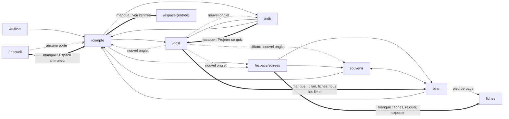

# Le parcours de l'animateur — rapport de l'expert en expérience utilisateur

## En bref

La soirée elle-même se tient bien : de l'écran commun à la clôture, la console
ne bouge plus sous le curseur, le premier quiz se lance en deux clics et la
clôture propose le bon nom. Le liant manque **avant** la soirée et **après**.
Il n'y a pas de premiers pas pour une animatrice qui découvre l'outil, rien ne
mène de l'éditeur à l'écran commun, et le podium d'un quiz n'offre qu'un
bouton, « Terminer le quiz », qui ramène à une salle d'attente de neuf boutons
égaux. Surtout, **le lendemain coûte plus que la soirée elle-même** (57 gestes
contre 44), pour trois raisons :
- l'accueil (`/`) n'a pas de porte pour l'animatrice, et il refuse ses
  identifiants pourtant justes ;
- envoyer les bilans demande 36 gestes pour 6 invités ;
- rien ne relie une soirée de l'historique aux quiz qu'on y a joués.

Les trois améliorations les plus rentables :
1. **Un écran de clôture qui ouvre le lendemain** : « Le bilan », « Les
   fiches » et « Tous les liens », avec un seul « Copier » pour tous les
   bilans. Gain : −32 gestes.
2. **Une porte pour l'animatrice sur l'accueil** : l'accueil lit sa session
   d'animateur, qu'il ignore aujourd'hui.
3. **Une console qui propose la suite après un quiz** : « Remise des prix »,
   « Quiz suivant » et « Clore la soirée » au podium ; l'enchaînement gardé
   d'un quiz à l'autre ; rien de la fin de soirée affiché avant le premier
   quiz.

Au total, le parcours idéal proposé demande **111 gestes au lieu de 168**
(−34 %). Hors saisie des questions, qui reste la même dans les deux parcours,
ce sont **62 gestes au lieu de 119**. Les moments « où est-ce que je vais
maintenant ? » passent de 7 à 1.

## Méthode

- **Parcours joué** dans l'atelier (serveur `http://localhost:33779`), dans le
  rôle d'Aline (`aline`, espace `chez-aline`), qui découvre l'application.
- **Appareils** : `aline` en `portable` (1366 × 768), avec les onglets
  `aline:entree`, `aline:onglet2` et `aline:lendemain`. Deux téléphones
  (`aline-tel1` « Marc », `aline-tel2` « Inès », 360 × 780) et quatre
  fantômes (`fake-player.mjs`, dont « xX_DarkLéa_Xx », renommé « Clara »).
- **Le parcours complet** : lien d'activation, réglages, un quiz de
  6 questions (dont une estimation et une photo qui disparaît, 45 s par
  question), aperçu et correction, écran commun, deux équipes, premier quiz,
  remise de deux prix, écran de victoire. Puis un second quiz, écrit pendant
  la soirée par « Coller une liste » et joué en ×2, et la clôture. Le
  lendemain : l'accueil, l'historique, le souvenir, le bilan, un lien copié,
  les fiches, la soirée suivante et l'export.
- **Mesure** : chaque geste est passé par un petit script qui le journalise,
  `export/evaluations/parcours-animateur/p.sh`, dans
  `export/evaluations/parcours-animateur/gestes.tsv` (309 lignes : heure,
  étape, appareil, geste).
- **Ce que je compte** : les tableaux ci-dessous comptent en **gestes
  d'humain**. Un clic, un champ rempli, un collage, une bascule d'onglet ou
  d'application valent un geste chacun. Les gestes d'observation du banc
  (`voir`, `capture`, `attendre`) sont exclus, comme mes essais de reproduction.
- **Lecture du code** : toutes les vues de l'animateur (`AccountApp`,
  `EditorApp`, `HostApp`, `HostView`, `ArchivesApp`, `RecapApp`, `BilanApp`,
  `SpaceNav`, `ProfilApp`, `ActivateApp`) et le module de jeu pour
  l'enchaînement et le choix du quiz.
- **Captures** : les principales sont copiées dans
  `export/evaluations/parcours-animateur/captures/`. Toutes les autres sont
  dans `export/tablee/2026-09-24-atelier/captures/aline/`.
- **Le temps** n'est pas mesuré, et c'est voulu. Mon temps d'agent (14 s pour
  activer, 32 s pour les réglages, 3 min 29 s pour les 6 questions) ne dit
  rien d'un humain, et une coupure d'une vingtaine de minutes de l'outil est
  tombée pendant le second quiz. Les chiffres qui suivent sont des gestes et
  des pages, pas des secondes.
- **Non couvert** :
  - relancer « Spécial Léa » dans la soirée suivante jusqu'au bout : le
    bouton reste grisé tant qu'aucun invité n'est connecté, et je l'ai lu
    dans le code sans rebrancher de téléphone ;
  - l'impression effective des fiches ;
  - l'import du fichier exporté chez un autre animateur ;
  - l'animateur qui a rattaché un profil joueur à son espace : pour lui,
    l'accueil ouvre bien la console (« Animer ma soirée »), et le constat 2 ne
    le concerne pas.

## Constats

### 1. Le lendemain coûte plus que la soirée : bilans, fiches et liens sont dispersés

- **Où** : l'écran de clôture (`client/src/views/HostApp.tsx:610-630`), le bilan
  (`client/src/views/BilanApp.tsx:102-115`, `180`, `194`), le souvenir
  (`client/src/views/RecapApp.tsx`) et l'historique
  (`client/src/views/ArchivesApp.tsx:134-148`).
- **Constat** : chaque page ne donne qu'un morceau du lendemain.
  - **La clôture** propose deux boutons, « Le souvenir » (dans un nouvel
    onglet) et « La soirée suivante ». Rien ne mène au bilan, aux fiches, à
    l'historique ni aux liens à envoyer.
  - **L'historique** donne « Souvenir » et « Bilan » pour chaque soirée, sans
    fiches ni lien à copier.
  - **Le souvenir** n'a pas de bouton pour copier son lien.
  - **Le bilan** copie un lien à la fois. Pour chaque invité, il faut choisir
    son prénom, « Copier le lien de ce bilan », coller dans la messagerie,
    revenir, puis « Changer de prénom ».
  - **Les fiches** ne se trouvent qu'en pied du bilan, dans une ligne
    « Pour l'animateur : les fiches à imprimer ».
- **Preuve** :
  - captures `025-23-soiree-close.png` (la console de clôture),
    `027-25-historique.png`, `028-26-souvenir.png` et
    `029-27-bilan-choix.png` (le lien des fiches, en pied de page) ;
  - le presse-papiers après « Copier le lien de ce bilan » :
    `…/chez-aline/soirees/2026-09-24-o64ye/bilan#p=670e3811-…`, un seul
    invité ;
  - le compte : 6 invités × (prénom + Copier + coller + 2 bascules
    d'application + Changer de prénom) = **36 gestes**.
- **Qui ça touche, ce que ça coûte** : l'animatrice, le lendemain, et tous les
  invités qui attendent leur bilan. C'est l'idée n° 10 de Nadia (« envoyer tous
  les bilans d'un coup »), qui reste ouverte. Le constat grandit avec la salle :
  à 30 invités, cela fait 180 gestes. En pratique, l'animatrice poste un seul
  lien, celui du choix des prénoms, et le bilan personnel ne sert qu'à ceux qui
  savent le trouver.
- **Statut** : friction confirmée (liant manquant).
- **Piste** :
  - (S) Dans la console de clôture, à côté de « Le souvenir » : « Le bilan »,
    « Les fiches » et « Tous les liens ».
  - (S-M) Dans le bilan, pour l'animateur de l'espace connecté (`useIsHost`),
    un panneau « Les liens de chacun ». Chaque ligne donne un prénom et son
    adresse d'archive, avec un seul bouton qui copie tout, prêt à coller dans
    le groupe :
    ```
    Les 30 ans de Léa — vos bilans :
    Marc : https://…/chez-aline/soirees/2026-09-24-o64ye/bilan#p=…
    Inès : https://…
    ```
    La liste se dérive du bilan (`review.players` et l'identifiant d'archive).
    Une fonction pure de `shared/` suffit, `liensDesBilans(review, origine)`,
    avec son test dans `server/test/`.
  - (S) « Copier le lien » sur le souvenir, qui donne toujours l'adresse de
    l'archive, comme le fait déjà `copyLink` dans le bilan.
  - (S) Sur chaque carte de l'historique : « Souvenir · Bilan · Fiches ».
- **Priorité · effort** : P2 · S à M.

### 2. L'accueil n'a pas de porte pour l'animatrice, et il refuse ses identifiants justes

- **Où** : `/` (`client/src/views/ProfilApp.tsx:49` et `106-121`).
- **Constat** : l'accueil ne consulte que la session d'un profil joueur
  (`api.joueur.moi()`). Aline a une session d'animatrice valide, mais aucun
  profil rattaché : elle voit « Retrouver mon profil », « Rejoindre une
  soirée » et « Créer un profil », sans un mot de son espace. Elle tape ses
  identifiants d'animatrice, `aline` et son mot de passe, dans « Ton
  identifiant » : **« Identifiant ou mot de passe incorrect »**. Aucun lien ne
  mène à `/connexion`, `/compte` ou `/host`. Il faut connaître l'adresse par
  cœur, ou passer par `/chez-aline/soirees`, dont le fil (`SpaceNav`) montre
  « Mon compte ».
- **Preuve** : capture `026-24-accueil-animatrice.png`. Le geste rejoué :
  `aline:lendemain ouvrir /`, puis `ecrire e10 "aline"`,
  `ecrire e13 "<son mot de passe>"`, `toucher e16`. Réponse :
  `alert: Identifiant ou mot de passe incorrect`.
- **Qui ça touche, ce que ça coûte** : tout animateur sans profil rattaché qui
  revient par l'accueil, le lendemain comme le jour de la soirée suivante. Il
  perd 4 gestes et se croit peut-être privé de son compte. C'est le moment
  « où est-ce que je vais ? » le plus coûteux du parcours : sans l'adresse,
  il n'y a pas d'issue.
- **Statut** : bug d'ergonomie confirmé. Il y a une tension avec un parti
  pris : l'accueil est un écran de connexion *au profil* par choix
  (CLAUDE.md, « Ce qu'il ne faut pas faire »), et le chemin anonyme doit
  rester visible sans défiler en 360 × 640.
- **Piste** :
  - (S) Si `currentMe()` (`client/src/api.ts:236`) rend un compte, poser en
    tête une carte « Animer « Les 30 ans de Léa » », avec « Écran commun »,
    « Mes quiz » et « Mes soirées ». Cette carte ne s'affiche que pour une
    session d'animateur ouverte, donc rien ne se dévoile à un inconnu.
  - (S) Sinon, sous les deux gros boutons, un lien discret « Tu animes une
    soirée ? Espace animateur » vers `/connexion`. Un lien texte ne pousse ni
    « Rejoindre une soirée » ni « Me connecter » hors de l'écran en
    360 × 640 ; c'est à vérifier à la capture.
  - Ne pas répondre « c'est un identifiant d'animateur » à l'échec : ce
    serait énumérer les comptes, ce que les garde-fous du README évitent
    (« un identifiant inconnu coûte le même temps… »).
- **Priorité · effort** : P2 · S.

### 3. Après un quiz, la console ne propose pas la suite, et la fin de soirée s'affiche avant le premier quiz

- **Où** :
  - le podium du quiz (`client/src/games/quiz/HostView.tsx:499-500`) ;
  - la salle d'attente (`client/src/views/HostApp.tsx:1001-1052`, et la
    condition de `1025`) ;
  - l'écran de victoire (`HostApp.tsx:942-948`).
- **Constat** :
  1. **Le podium du quiz** n'offre qu'un bouton, « Terminer le quiz ». Pour
     un quiz déjà fini, le libellé se lit mal, et il ramène à la salle
     d'attente, où le bouton doré redevient « Lancer un quiz ». La remise des
     prix, que la soirée attend à ce moment-là, est un bouton parmi neuf
     d'égale importance : Lancer un quiz, Mes quiz, Mon compte, Podium, Prix,
     Victoire, Les chiffres, Historique, Clore la soirée.
  2. **Avant le premier quiz**, dès qu'une équipe existe, la console montre
     déjà « Podium », « Prix », « Victoire », « Les chiffres » et « Clore la
     soirée ». La condition est `ranking.length > 0 || teams.length > 0`. Neuf
     boutons, donc, là où un seul compte : « Lancer un quiz ».
  3. **L'écran de victoire** propose « Revenir aux prix », « Clore la
     soirée » et « Revenir », mais pas « Quiz suivant ».
- **Preuve** : capture `019-17-podium-quiz1.png` (le bouton seul), capture
  `020-18-salle-apres-quiz1.png` (neuf boutons, et « Lancer un quiz » en
  doré), capture `011-10-salle-arrivee.png` (les boutons de fin de soirée,
  0 quiz joué), capture `022-20-victoire.png`. Le parcours réel de ma remise
  des prix : Terminer le quiz → Prix → Attribuer ×2 → Écran de victoire →
  Revenir → Lancer un quiz. C'est un aller-retour complet par la salle
  d'attente.
- **Qui ça touche, ce que ça coûte** : l'animatrice, au moment où la salle la
  regarde. Deux moments « où maintenant ? », au podium et au retour en salle
  d'attente. La première tablée avait noté « on sait toujours quoi faire
  ensuite » (Nadia). C'est vrai pendant un quiz, plus entre deux quiz.
- **Statut** : friction confirmée.
- **Piste** (S) :
  - Au podium du quiz, trois boutons : « Remise des prix » en action
    principale, « Quiz suivant » et « Clore la soirée ». Les trois
    terminent la session (`endSession`), puis ouvrent l'écran voulu :
    `QuizHost` reçoit un `onFin(suite: 'awards' | 'lobby' | 'cloture')` que
    `HostApp` traduit en `setScreen(…)` ou `clore()`.
  - Dans la salle d'attente, ne montrer Podium, Prix, Victoire, Les chiffres
    et Clore qu'**après un quiz joué** : `ranking.length > 0 ||
    bonuses.length > 0`, sans `teams.length`. Tant qu'un quiz n'a pas été
    joué, un bouton de fin de soirée ne sert à rien.
  - Sur l'écran de victoire, ajouter « Quiz suivant », qui revient à la salle
    d'attente et ouvre le choix du quiz.
  - La console garde ses places fixes (axe 2 de la première tablée) : on
    change les libellés, pas l'ordre des zones.
- **Priorité · effort** : P2 · S.

### 4. Rien ne mène de l'éditeur à l'écran commun, et « retour » quitte l'éditeur

- **Où** : l'en-tête de l'éditeur (`client/src/views/EditorApp.tsx:705-720`),
  la liste des quiz (`EditorApp.tsx:257-270`).
- **Constat** :
  - Une fois le quiz enregistré (« 6/6 prêtes · Enregistré »), l'en-tête ne
    propose que « Retour ». Pour projeter, il faut « Retour », vers la liste,
    puis « Écran commun » : 2 clics et 2 pages.
  - Ouvrir un quiz ne change pas l'adresse, qui reste `/edit`, sans entrée
    d'historique (aucun `pushState` dans `EditorApp.tsx`). Le bouton retour
    du navigateur ne revient donc pas à la liste : il **sort** de l'éditeur,
    vers `/compte`, la page d'avant. Et un quiz n'a pas d'adresse à garder en
    favori.
  - La liste « Mes quiz » ne mène pas à « Mes soirées ».
- **Preuve** : capture `009-08-editeur-enregistre.png`. Le geste
  `aline retour` depuis l'éditeur a mené à `💻 aline · /compte`
  (`gestes.tsv`, 15:10:03).
- **Qui ça touche, ce que ça coûte** : chaque animatrice qui vient d'écrire son
  quiz. Un « où maintenant ? », et un piège pour qui a le réflexe du retour.
  Le quiz était enregistré, donc je n'ai rien perdu. Avec des modifications en
  cours, le brouillon les garde, mais on sort quand même de l'éditeur.
- **Statut** : friction confirmée.
- **Piste** :
  - (S) Un bouton « Projeter ce quiz », dès qu'il y a une question prête et
    que tout est enregistré. Il mène à `/host`, où « Lancer un quiz » ouvrira
    le choix. Plus tard, il pourra présélectionner le quiz.
  - (S-M) Un quiz ouvert prend une entrée d'historique : `/edit#quiz=<id>`
    par `pushState`, et un `popstate` le referme en passant par `close()`,
    comme le fait déjà `BilanApp` pour `#p=`.
  - (S) « Mes soirées » dans l'en-tête de la liste.
- **Priorité · effort** : P3 · S.

### 5. La soirée suivante garde le titre de la veille, et régler le titre prend quatre champs

- **Où** : les réglages de `/compte` (`client/src/views/AccountApp.tsx:241-331`)
  et la clôture (`HostApp.tsx:628`, « La soirée suivante »).
- **Constat** :
  - **Le titre de la veille reste.** Le titre, le surtitre et le grand titre
    sont des réglages de l'espace, pas de la soirée. Après « La soirée
    suivante », l'écran commun et l'entrée des invités affichent encore
    « Les 30 ans de Léa », et rien ne le rappelle.
  - **Régler le titre prend quatre champs.** Il faut taper le même nom en
    trois morceaux (« Les 30 ans de Léa », « Les 30 ans de », « Léa »), plus
    la date, la même remarque que Nadia au premier soir.
  - **Rien ne montre l'entrée des invités.** Pour voir ce qu'ils verront, il
    faut copier l'adresse et l'ouvrir dans un nouvel onglet : 4 gestes, un
    aller-retour. L'adresse est un `<code>`, pas un lien (`AccountApp.tsx:85`).
  - **La date ne se voit presque nulle part.** « Date, telle qu'on l'écrit »
    ne paraît ni à l'entrée ni à l'écran commun, seulement sur le souvenir et
    le bilan de la soirée en cours (`RecapApp.tsx:109`, `BilanApp.tsx:211`).
    Elle survit elle aussi d'une soirée à l'autre.
- **Preuve** : capture `030-28-soiree-suivante.png` (la salle d'attente de la
  soirée suivante sous l'ancien titre), capture `004-03-entree-invites.png`
  (l'entrée, sans la date), capture `003-02b-compte-entier.png`.
- **Qui ça touche, ce que ça coûte** :
  - l'animatrice : 7 gestes et un aller-retour vers « Mon compte » à chaque
    nouvelle soirée, si elle y pense ;
  - les invités, sinon : ils entrent dans « Les 30 ans de Léa » pour le
    réveillon.
- **Statut** : friction confirmée. Il n'y a pas de tension : la clôture a
  justement été pensée pour « partir de zéro ».
- **Piste** :
  - (S) « La soirée suivante » demande d'abord le titre de la prochaine
    soirée, prérempli par le titre du moment et modifiable. Ce qu'on y tape
    enregistre les réglages (`api.space.saveSettings`).
  - (S) Dans `/compte`, un champ « Nom de la soirée », d'où se dérivent le
    surtitre et le grand titre. La règle existe déjà pour le titre par
    défaut (`defaultSettings`, `shared/space.ts`). Les deux champs se
    montrent sous « Affiner l'entrée ».
  - (S) Un lien « Voir l'entrée de mes invités ↗ » sur l'adresse.
  - (S) La date se dit, ou se retire. Si elle reste : « s'affiche sur le
    souvenir et le bilan ».
- **Priorité · effort** : P3 · S.

### 6. Le choix du quiz ne dit pas ce qui a été joué, et l'enchaînement s'oublie d'un quiz à l'autre

- **Où** : `server/src/games/quiz.ts:522` (le choix ne porte que le titre et
  le nombre de questions), `quiz.ts:534` (`autoNextSeconds: null` à chaque
  quiz), et la liste « Mes quiz ».
- **Constat** :
  - Au second quiz, « Spécial Léa », joué une heure plus tôt, se présente
    comme neuf : « 6 questions », sans « joué ce soir ». Rien ne le dit non
    plus dans « Mes quiz » (« modifié le 24 sept., 17:09 »), ni pour la
    soirée suivante.
  - L'enchaînement « 10 s », choisi au premier quiz, est revenu à « au clic »
    au second. Je ne l'ai vu qu'en attendant une question qui ne partait pas.
- **Preuve** : capture `023-21-choix-quiz2.png`. Pour l'enchaînement :
  `aline texte` pendant la révélation Q1 du second quiz ne montre pas de
  « SUIVANTE DANS » ; 4 clics « Question suivante » ont suivi
  (`gestes.tsv`, étape `4-quiz2-jeu`) ; `quiz.ts:534`.
- **Qui ça touche, ce que ça coûte** : l'animatrice. Pour l'enchaînement,
  c'est +5 clics par quiz. Pour le quiz déjà joué, le risque est de relancer
  le mauvais devant la salle, et il grandit avec la bibliothèque.
- **Statut** : friction confirmée.
- **Piste** :
  - (S) L'enchaînement se garde pour la soirée. `engine.launch(config)` passe
    déjà une configuration à `createInitialState(spaceId, participantIds,
    config)` (`server/src/core/engine.ts:176`). Il suffit que le runtime de
    l'espace retienne le dernier `autoNextSeconds` et le passe au lancement.
    La clôture et l'essai effacé l'oublient, comme le nom de la soirée.
    Test dans `server/test/` : lancer A, régler 10 s, terminer, lancer B,
    vérifier `autoNextSeconds === 10` ; puis clore, relancer, vérifier
    `null`.
  - (S) `packs` porte `joueCeSoir: boolean`, tiré des parties de la soirée,
    que le miroir garde jusqu'à la clôture. La carte affiche « joué ce soir »
    et se range en dernier. Plus tard : « joué le 24 sept. » dans « Mes
    quiz ».
- **Priorité · effort** : P3 · S.

### 7. L'historique ne relie pas une soirée à ses quiz : relancer et exporter repassent par « Mes quiz »

- **Où** : `client/src/views/ArchivesApp.tsx:150-206` (la carte d'une soirée).
- **Constat** :
  - La carte dit « 6 joueurs · 2 quiz · 11 questions », mais pas lesquels.
  - Pour « relancer le même quiz pour une autre soirée », il faut savoir
    lequel c'était, aller à l'écran commun, attendre un invité (« Lancer un
    quiz » est grisé à 0 connecté, `HostApp.tsx:1004`), puis le reconnaître
    dans la liste.
  - Pour l'exporter à un ami : « Mes quiz », puis « Exporter ».
- **Preuve** : capture `027-25-historique.png`. L'export marche bien, avec
  son mot d'accompagnement : « « Spécial Léa » est dans tes téléchargements :
  special-lea.quiz.json. Envoie ce fichier à un autre animateur… »
  (`telechargements/aline-special-lea.quiz.json`, 11 454 octets, photo
  comprise).
- **Qui ça touche, ce que ça coûte** : l'animatrice qui prépare la soirée
  suivante, 2 à 4 gestes et un moment « lequel c'était ? ». Le quiz de
  l'archive est une copie figée, qui peut avoir été retouché ou supprimé
  depuis dans la bibliothèque : le lien doit le dire.
- **Statut** : idée (liant manquant).
- **Piste** (M) : sous le titre de la carte, « Spécial Léa · Les années 90 ».
  Pour l'animateur de l'espace, chaque nom mène au quiz de la bibliothèque
  s'il existe encore (« Rejouer » vers `/host`, « Exporter »), et sinon à
  « Reprendre dans ma bibliothèque », une copie depuis l'archive.
- **Priorité · effort** : P3 · M.

### 8. Chaque lien de la console ouvre un nouvel onglet, sans jamais réutiliser le précédent

- **Où** : `HostApp.tsx:1017`, `1021`, `1047` et les liens des écrans de fin
  (`target="_blank"` partout).
- **Constat** : c'est voulu, l'écran commun doit rester projeté. Mais chaque
  clic ouvre un **nouvel** onglet : « Mes quiz » deux fois ouvre deux `/edit`,
  et de même pour « Mon compte », « Historique », « Les chiffres », « Page
  souvenir », « Le bilan » et « Le souvenir ». Dans ma soirée, « Mes quiz »
  a ouvert `aline:onglet2`, où j'ai écrit le second quiz, et il a fallu
  revenir à la main à l'onglet de l'écran commun. Un second clic aurait
  laissé deux éditeurs ouverts, avec le risque d'enregistrer depuis le vieux.
  Le brouillon le signale (`brouillonDepasse`), mais après coup.
- **Preuve** : `aline onglets` donne `aline → /host`, `aline:onglet2 →
  /edit`. Le code : `target="_blank"` sans nom. Le cumul d'onglets est lu
  dans le code, pas rejoué au-delà d'un onglet.
- **Qui ça touche, ce que ça coûte** : l'animatrice, sur l'ordinateur branché
  à la télé, pendant la soirée. Onglets cumulés, et un risque de basculer la
  télé sur le mauvais.
- **Statut** : friction ; le cumul n'est pas confirmé au-delà d'un onglet.
- **Piste** (S) : des cibles nommées, qui rouvrent le même onglet :
  `target="fiestapp-quiz"`, `target="fiestapp-compte"`,
  `target="fiestapp-soiree"` (souvenir, bilan, chiffres et historique).
  Toujours séparées de l'écran commun, jamais multipliées.
- **Priorité · effort** : P3 · S.

### 9. Premiers pas : l'activation tait l'identifiant, et /compte ne dit pas par où commencer

- **Où** : `client/src/views/ActivateApp.tsx:43` et `/compte`
  (`AccountApp.tsx:58-77`).
- **Constat** :
  - **L'activation tait l'identifiant.** La page ne dit ni l'identifiant
    (`aline`) ni l'adresse de l'espace : je ne les découvre qu'ensuite, sur
    `/compte` (« Identifiant aline »). Or c'est lui qu'il faudra taper à
    `/connexion` dans trente jours. Le formulaire n'a pas non plus de champ
    identifiant caché : un gestionnaire de mots de passe enregistre donc le
    mot de passe sans nom.
  - **/compte ne dit pas par où commencer.** Pour un espace neuf, à la
    bibliothèque vide, `/compte` montre trois boutons égaux, dans cet
    ordre : Écran commun, Mes quiz, Mes soirées. L'écran commun vient en
    premier, alors qu'il ne peut rien lancer.
  - **Des liens restent muets.** « Crée-le depuis l'accueil », sous « Mon
    profil joueur », n'est pas un lien.
- **Preuve** : capture `001-01-activation.png` et capture
  `003-02b-compte-entier.png`.
- **Qui ça touche, ce que ça coûte** : chaque nouvel animateur, une fois, et
  au retour pour l'identifiant. Un moment « par où commencer ? ».
- **Statut** : friction ; « le gestionnaire de mots de passe » est non
  confirmé, faute de vrai navigateur avec gestionnaire.
- **Piste** (S) :
  - L'activation affiche « Ton identifiant : **aline** · ton espace :
    …/chez-aline » au-dessus des champs. Elle ajoute
    `<input type="text" name="username" autoComplete="username"
    value={login} readOnly hidden>`, ce qui demande que la route d'activation
    rende l'identifiant, ou que le lien le porte.
  - Tant que la bibliothèque est vide, `/compte` montre « Premiers pas » en
    trois lignes : ① le titre de ta soirée ✓, ② écrire ton premier quiz →,
    ③ allumer l'écran commun →. Le bloc disparaît au premier quiz prêt.
- **Priorité · effort** : P3 · S.

### 10. Le champ « Temps » ne se vide pas : effacer puis taper « 45 » donne « 2045 »

- **Où** : `client/src/views/EditorApp.tsx:1559`,
  `value={question.duration || DEFAULT_DURATION}`.
- **Constat** : effacé à la touche Retour, le champ se remplit aussitôt de
  « 20 », parce qu'une valeur vide vaut 0 et que 0 retombe sur la valeur par
  défaut. Taper « 45 » ensuite donne « 2045 ». La valeur est ramenée sans un
  mot à 120 s (`MAX_DURATION`), à l'enregistrement (`normalizeQuestions`,
  `shared/library.ts:350`) comme au jeu (`toPlayable`, `:252`).
  Tout sélectionner puis taper marche, mais pas effacer puis taper. C'est le
  même défaut que la cible de l'estimation (« 0,8 » → 8), déjà corrigé pour
  ce champ-là (`cible` garde le texte tapé).
- **Preuve** : rejoué au clavier. Sur `aline toucher e106`, la touche `End`,
  puis Retour ×4, le champ affiche successivement « 204 », « 20 », « 2 »,
  « 20 ». Puis `touche 4` et `touche 5` donnent « 2045 » (`gestes.tsv`,
  15:07).
- **Qui ça touche, ce que ça coûte** : l'animatrice qui règle le temps d'une
  question : 9 frappes perdues dans mon cas, ou un temps faux sans le
  savoir. L'héritage du temps limite le coût à la première question, ce qui
  est un vrai progrès de l'axe 6.
- **Statut** : bug confirmé. C'est hors de mon angle, et à transmettre à
  l'expert `editeur`.
- **Piste** (S) : garder le texte tapé, comme `cible`, et ne borner qu'à la
  perte du focus (`onBlur`) ou à l'enregistrement. Test : le champ vidé reste
  vide tant qu'il a le focus.
- **Priorité · effort** : P3 · S.

### Vu en passant, hors de mon angle, à transmettre

- **À `design-tele`** : en 1366 × 768, la révélation d'une estimation à
  6 joueurs coupe le 6ᵉ rang, la seconde équipe et le « Top du quiz »
  (capture `017-15-revelation-estimation.png`).
- **Aux experts du téléphone et de la télé** : avant tout quiz, le classement
  de la soirée affiche « 1 » pour tout le monde, à 0 point, et le téléphone
  « 0 pts · 1ʳᵉ place ».
- **Non rejoué**, lu dans le code (`quiz.ts:518`) : sans quiz prêt, le toast
  dit « crée-en un dans l'espace animateur (/edit) ». L'adresse y est écrite
  dans le texte, pas en lien.

## Mesures et cartes

### Le parcours pas à pas (actuel)

Les colonnes comptent en gestes d'humain : un clic, un champ rempli, un
collage ou une bascule d'onglet valent un geste. Le « moment ? » signale une
hésitation sur la suite.

| # | Étape | Page | Geste | Gestes | Aller-retour ? | Lien manquant ? |
|---|---|---|---|---|---|---|
| 1 | Activer | `/activer` | ouvrir le lien reçu | 1 | – | – |
| 2 | Activer | `/activer` → `/compte` | 2 mots de passe, « Activer mon compte » | 3 | – | identifiant et adresse absents (9) |
| 3 | Découvrir | `/compte` | lire : 3 boutons égaux, bibliothèque vide | 0 | – | **moment ?** pas de premiers pas (9) |
| 4 | Régler | `/compte` | Titre, Surtitre, Grand titre, Date | 4 | – | le même nom en trois morceaux (5) |
| 5 | Régler | `/compte` | Enregistrer | 1 | – | – |
| 6 | Voir l'entrée | `/compte` → onglet `/chez-aline` | Copier, ouvrir un onglet et coller, fermer | 4 | **oui** (1 onglet) | « Voir l'entrée de mes invités » (5) |
| 7 | Écrire | `/compte` → `/edit` | Mes quiz, Nouveau quiz, titre | 3 | – | – |
| 8 | Écrire | `/edit` (éditeur) | 6 questions : 6 Ajouter, 6 intitulés, 20 réponses, 3 bonnes réponses, 1 catégorie, 1 temps, estimation (type, cible, unité), photo, loupe, « disparaît », 8 s | 45 | – | (+9 frappes : piège « 2045 », constat 10) |
| 9 | Prévisualiser | `/edit` | Aperçu Q4 (2 phases), Fermer ; Aperçu Q6, Échap ; corriger une faute | 5 | – | pas de « Suivante » dans l'aperçu |
| 10 | Enregistrer | `/edit` | Enregistrer | 1 | – | **moment ?** rien vers l'écran commun (4) |
| 11 | Écran commun | `/edit` → liste → `/host` | Retour, Écran commun (ou retour navigateur → `/compte` → Écran commun) | 2 | – | « Projeter ce quiz » (4) |
| 12 | Accueillir | `/host` | 2 équipes (emoji, nom, Ajouter) | 6 | – | – |
| 13 | Accueillir | `/host` | 4 invités sans équipe placés un à un ; un surnom | 7 | – | « répartir les sans-équipe » (idée) |
| 14 | Lancer | `/host` | Lancer un quiz, C'est parti ! | 2 | – | – |
| 15 | Animer | `/host` | Question suivante, « 10 s » | 2 | – | – |
| 16 | Podium | `/host` | Terminer le quiz (seul bouton) | 1 | – | **moment ?** ni prix, ni quiz suivant (3) |
| 17 | Prix | `/host` (salle d'attente) | chercher « Prix » parmi 9 boutons, Attribuer ×2, Écran de victoire, Revenir | 5 | **oui** (salle → prix → victoire → salle) | **moment ?** « Remise des prix » non proposée (3) |
| 18 | Quiz 2 | `/host` → onglet `/edit` | Mes quiz (nouvel onglet), Nouveau quiz, titre, Coller une liste, coller, Ajouter au quiz, Enregistrer | 7 | **oui** (1 onglet) | – |
| 19 | Quiz 2 | onglet → `/host` | revenir à l'onglet, Lancer un quiz, ×2, C'est parti ! | 4 | – | « joué ce soir » absent (6) |
| 20 | Quiz 2 | `/host` | Question suivante ×4, Voir le podium, Terminer le quiz | 6 | – | l'enchaînement choisi s'est perdu (6) |
| 21 | Clore | `/host` | Clore la soirée, confirmer (nom prérempli) | 2 | – | – |
| 22 | Clore | `/host` (clôture) | – | 0 | – | **moment ?** ni bilan, ni fiches, ni liens (1) |
| 23 | Lendemain | `/` | ouvrir, taper ses identifiants d'animatrice : refus | 4 | **impasse** | **moment ?** aucune porte animateur (2) |
| 24 | Lendemain | `/compte` (tapé) → `/chez-aline/soirees` | taper l'adresse, Mes soirées | 2 | – | – |
| 25 | Souvenir, bilan | historique → souvenir → bilan | Souvenir, Bilan | 2 | – | pas de « Copier le lien » au souvenir (1) |
| 26 | Envoyer les liens | bilan ↔ messagerie | ×6 : prénom, Copier, coller, 2 bascules, Changer de prénom | 36 | **oui ×6** | « tous les liens » (1) |
| 27 | Fiches | bilan → fiches | lien en pied de page, Imprimer | 2 | – | fiches absentes de l'historique et de la clôture (1) |
| 28 | Soirée suivante | `/host` → onglet `/compte` | Mon compte, 4 champs, Enregistrer, revenir | 7 | **oui** (1 onglet) | **moment ?** l'ancien titre ne se signale pas (5) |
| 29 | Relancer | `/host` | Lancer un quiz, C'est parti ! (une fois un invité connecté) | 2 | – | rien de l'historique vers le quiz (7) |
| 30 | Exporter | onglet `/edit` | Mes quiz, Exporter | 2 | – | depuis l'historique (7) |

**Totaux actuels** : **168 gestes**, soit 4 pour activer, 9 pour régler,
54 pour le quiz, 44 pour la soirée et 57 pour le lendemain. Il faut y
ajouter 4 onglets ouverts, dont 1 sans le vouloir, 6 allers-retours
(11 en comptant chaque lien envoyé), 1 impasse et
**7 moments « où est-ce que je vais maintenant ? »**. La saisie des
questions (45 + 4 gestes) ne change pas d'un parcours à l'autre. Hors
saisie, il reste **119 gestes de liant**.

### Le liant manquant, page par page

- **`/activer`** : dire l'identifiant et l'adresse de l'espace avant le mot
  de passe (9).
- **`/compte`** :
  - « Premiers pas » tant que la bibliothèque est vide (9) ;
  - l'adresse des invités en lien, « Voir l'entrée de mes invités ↗ » (5) ;
  - « crée-le depuis l'accueil » en lien (9) ;
  - un raccourci vers le souvenir et le bilan de la dernière soirée (1).
- **`/edit`, la liste** :
  - « Mes soirées » dans l'en-tête (4) ;
  - « joué le … » sur chaque quiz (6).
- **`/edit`, l'éditeur** :
  - « Projeter ce quiz » une fois enregistré (4) ;
  - « Suivante » dans l'aperçu ;
  - une adresse par quiz, pour que « retour » ramène à la liste (4).
- **`/host`, la salle d'attente avant le premier quiz** : les boutons de fin
  de soirée, qui arrivent trop tôt (3).
- **`/host`, le podium d'un quiz** : « Remise des prix », « Quiz suivant »,
  « Clore la soirée » (3).
- **`/host`, la salle d'attente entre deux quiz** : l'action principale
  devrait être la remise des prix, pas « Lancer un quiz » (3).
- **`/host`, le choix du quiz** : « joué ce soir », et l'enchaînement gardé
  (6).
- **`/host`, la victoire** : « Quiz suivant » (3).
- **`/host`, la clôture** : « Le bilan », « Les fiches », « Tous les liens »,
  « L'historique » (1).
- **`/host`, la soirée suivante** : le titre à confirmer (5).
- **`/host`, les liens de la console** : réutiliser le même onglet (8).
- **`/`, l'accueil** : une porte animateur (2).
- **`/<espace>/soirees`** : « Fiches », « Copier le lien », le nom des quiz
  joués avec « Rejouer » et « Exporter » (1, 7).
- **Le souvenir** : « Copier le lien » (1).
- **Le bilan** : « Tous les liens » pour l'animateur (1).

### La carte des pages : ce qui est relié, ce qui manque



### Le parcours idéal proposé, à côté de l'actuel

| Phase | Actuel | Idéal | Ce qui change |
|---|---|---|---|
| Activer, découvrir | 4 gestes, 1 moment ? | 4 gestes, 0 moment ? | identifiant affiché ; « Premiers pas » sur `/compte` |
| Régler la soirée | 9 gestes, 1 onglet, 1 aller-retour | 3 gestes | « Nom de la soirée » en un champ, aperçu de l'entrée en lien |
| Écrire le quiz (6 q.) | 54 gestes, 1 moment ? | 54 gestes | le contenu ne change pas ; le champ « Temps » ne piège plus |
| La soirée (2 quiz) | 44 gestes, 1 onglet, 2 allers-retours, 3 moments ? | 35 gestes, 1 onglet, 0 aller-retour, 0 moment ? | « Projeter ce quiz » (−1) ; « Répartir les sans-équipe » (−3) ; « Remise des prix » et « Quiz suivant » au podium ; l'enchaînement gardé (−5) |
| Le lendemain | 57 gestes, 1 impasse, 7 allers-retours, 2 moments ? | 15 gestes, 0 impasse, 1 aller-retour, 0 moment ? | porte animateur sur `/` (−4) ; « Tous les liens » (−32) ; titre demandé à la soirée suivante (−5) ; « Rejouer » et « Exporter » depuis l'historique (−1) |
| **Total** | **168 gestes · 7 moments ?** | **111 gestes · 1 moment ?** (le premier « par où commencer », que les premiers pas réduisent sans le supprimer) | **−57 gestes (−34 %)** ; hors saisie des questions, **119 → 62** |

Le parcours idéal, pas à pas :

1. Le lien d'activation : l'identifiant et l'espace sont dits, puis 2 mots de
   passe, puis « Activer ». On arrive sur `/compte` et ses « Premiers pas ».
2. « Nom de la soirée », la date et « Enregistrer », avec l'aperçu de
   l'entrée à côté.
3. « Écrire mon premier quiz », le contenu, « Enregistrer », puis
   « Projeter ce quiz » : on est sur `/host`.
4. Les équipes, « Répartir les sans-équipe », « Lancer », le quiz. Au
   podium : « Remise des prix », 2 prix, « Victoire », puis « Quiz
   suivant ».
5. Le second quiz, que la liste marque « joué ce soir » pour le premier.
   Il part en ×2, et l'enchaînement est gardé.
6. « Clore » : l'écran de clôture propose « Le souvenir · Le bilan · Les
   fiches · Tous les liens », puis « La soirée suivante », qui demande son
   titre.
7. Le lendemain, l'accueil propose « Animer « … » · Mes soirées ». Sur la
   carte de la soirée : Souvenir, Bilan, Fiches, « Tous les liens » (un seul
   collage), et « Spécial Léa : Rejouer · Exporter ».

## Ce qui marche — à ne pas casser

- **La console pendant un quiz** : les boutons restent à leur place, grisés
  plutôt qu'escamotés. « Révéler » devient « Question suivante » au même
  endroit, et les gestes qui défont sont à droite (captures `014`, `015`).
  « Suivante : au clic · 5 s · 10 s · 20 s » dit ce qu'il fera. L'axe 2 de la
  première tablée tient.
- **Le premier quiz en deux clics** : « Lancer un quiz », « C'est parti ! »,
  avec le multiplicateur annoncé sur la même carte. Un quiz écrit dans un
  autre onglet **pendant** la soirée apparaît au choix sans recharger
  l'écran commun (capture `023`). C'est précieux pour un second quiz
  improvisé.
- **« Coller une liste »** : 5 questions, catégories et temps compris, en un
  collage. C'est le geste le plus rentable de tout le parcours, puisqu'un
  quiz entier tient en 7 gestes.
- **L'éditeur a appris de la première tablée** :
  - une nouvelle question reprend le temps et la catégorie de la précédente,
    donc 1 réglage au lieu de 6 ;
  - la loupe de la photo (capture `006`) ;
  - l'aperçu joue la phase « Regardez bien… » ;
  - l'export dit quoi faire du fichier.
  Les pistes de l'axe 6 tiennent.
- **La clôture** : le nom prérempli par le titre de la soirée, « C'était un
  essai » à part, le QR du souvenir visible en 1366 × 768 (capture `025`).
  Les axes 3 et 7 tiennent pour cet écran.
- **Les mots de l'axe 7** : « La soirée d'Aline » avec son élision ; l'onglet
  titré « FiestApp », et non plus « Quizz » ; « Choisis un quiz », au
  tutoiement.
- **Le bilan d'archive** : « Copier le lien de ce bilan » donne l'adresse
  d'archive, qui ne changera pas. Il suffirait de l'étendre à tous les
  invités d'un coup (constat 1).
- **Le fil des pages publiques** (Souvenir · Bilan · Soirées, plus « Mon
  compte » pour l'animateur) : c'est le seul liant qui marche dans les deux
  sens.

## Recommandations, dans l'ordre

1. **Un écran de clôture qui ouvre le lendemain, et « Tous les liens » au
   bilan** (constat 1). P2 · S à M. −32 gestes, et un moment « où ? » de
   moins.
2. **Une porte animateur sur l'accueil** : une carte si `currentMe()` rend un
   compte, sinon un lien discret vers `/connexion` (constat 2). P2 · S.
   L'impasse disparaît. À arbitrer avec le parti pris « l'accueil est la
   connexion au profil » : rien ne doit pousser le chemin anonyme hors de
   l'écran.
3. **La suite proposée après un quiz** : trois boutons au podium du quiz,
   rien de la fin de soirée avant le premier quiz, « Quiz suivant » à la
   victoire (constat 3). P2 · S. Deux moments « où ? » de moins, et
   l'aller-retour par la salle d'attente disparaît.
4. **Garder l'enchaînement pour la soirée, et marquer « joué ce soir »**
   (constat 6). P3 · S. −5 clics par quiz, et un test serveur facile à
   écrire.
5. **Le titre de la soirée suivante demandé à « La soirée suivante », un
   seul champ « Nom de la soirée », l'entrée des invités en lien**
   (constat 5). P3 · S. −6 gestes au réglage, −5 à chaque soirée suivante.
6. **« Projeter ce quiz » dans l'éditeur, et une adresse par quiz ouvert**
   (constat 4). P3 · S à M.
7. **Des cibles d'onglet nommées pour les liens de la console** (constat 8).
   P3 · S : quelques attributs `target`.
8. **L'identifiant sur la page d'activation, et les « Premiers pas » sur
   `/compte`** (constat 9). P3 · S.
9. **Une soirée de l'historique reliée à ses quiz** : noms, « Rejouer »,
   « Exporter » (constat 7). P3 · M.
10. **Le champ « Temps » qui garde ce qu'on tape** (constat 10). P3 · S. À
    confier à qui reprend l'éditeur.

## Limites

- **Un seul parcours**, joué par un agent qui lit tout et ne se trompe
  presque jamais de bouton. Une humaine hésiterait plus longtemps aux
  moments « où ? », et le décompte les sous-estime. Inversement, un habitué
  les apprend dès la deuxième soirée.
- **Les temps ne sont pas mesurés** : l'agent va trop vite pour l'écriture
  et trop lentement pour le jeu, et une coupure de l'outil d'une vingtaine
  de minutes est tombée pendant le second quiz.
- **Chromium seul, sur l'ordinateur « portable »**. Je n'ai pas testé la
  console depuis un téléphone (l'animateur qui pilote debout), le 1920 ×
  1080, ni un gestionnaire de mots de passe réel.
- **Non rejoué** :
  - relancer « Spécial Léa » dans la soirée suivante jusqu'à la première
    question ;
  - l'import du fichier exporté ;
  - l'impression des fiches ;
  - le toast « Aucun quiz prêt à jouer » ;
  - le cumul de plusieurs onglets `/edit` (constat 8, lu dans le code).
- **Les propositions touchent à la console et à l'accueil**, deux écrans que
  d'autres experts de l'atelier regardent (`design-tele`, `premiere-visite`,
  `carte-du-site`). Leurs rapports peuvent affiner les libellés et les
  places.
