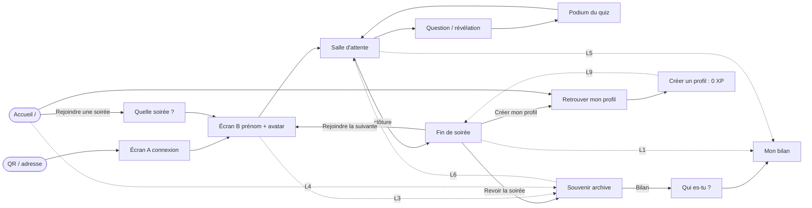

# Le parcours de l'invité, du QR au lendemain — rapport de l'expert expérience utilisateur

## En bref

Pendant la soirée, le parcours de l'invité sans compte est court et solide : **3 touchers et un
prénom** sur iPhone (4 en 360 × 640, où il faut refermer le clavier) du scan à la salle d'attente,
un de plus pour la première réponse. Un onglet fermé ramène droit dans la question en cours, et le
retardataire est bien accueilli. **Tout se défait après la clôture.** La fin de soirée n'existe
qu'en mémoire : elle disparaît dès qu'on quitte la page, et un redémarrage du serveur la remplace
par « On ne te retrouve plus dans cette soirée ». Le téléphone oublie aussi qui il était, si bien
que le bilan redemande « Qui es-tu ? », même à un profil connecté. Et le lendemain, ni l'accueil
ni l'adresse de l'espace ne mènent à la soirée d'hier : le seul bouton visible fait entrer dans la
soirée *suivante*. Une invitée qui le touche date la soirée de la semaine d'après : **bug
confirmé**, une soirée jouée le 24 est archivée « Soirée du 17 septembre ». Le profil créé après
coup part de zéro.

Les trois améliorations les plus rentables :
1. **Une fin de soirée qui reste** sur le téléphone, avec un bouton « Mon bilan » direct (`#p=`).
   Elle doit se retrouver sur l'entrée de l'espace et sur l'accueil entre deux soirées. Effort S à M.
2. **Dater la soirée par ceux qui y jouent**, pas par le premier inscrit. Et ne plus faire de
   « Rejoindre la soirée suivante » le bouton principal d'une fin de soirée. Effort S.
3. **Proposer le profil au bon moment, et dire la vérité.** Entre deux quiz, cela coûte 5 touchers
   et la soirée suit (vérifié : +28 XP). Après la clôture, c'est trop tard, et la page ne le dit
   pas. Le lien de la fin de soirée ouvre d'ailleurs la *connexion*, pas la création.

## Méthode

- **Atelier**, espace `chez-bruno` (compte activé par son lien), le 24 septembre de 15:03 à 15:35
  environ, puis de nouveau après une coupure de l'outil. Appareils :
  - `bruno`, un portable 1366 × 768, pour l'écran commun ;
  - `bruno-tel1`, un petit téléphone 360 × 640 : Mireille, anonyme ;
  - `bruno-tel2`, un iPhone 390 × 844 : Jean-Baptiste, puis Zoé (un appareil neuf pour chaque
    nouvel invité). Un téléphone 412 × 915 a servi seulement aux adresses mal tapées.
  - Quatre fantômes : Kévin, Élisabeth-Anne, Mo et Camille.
- **La soirée jouée** : un quiz de 6 questions (4 QCM et 2 estimations), sans équipes. En cours de
  route, j'ai fermé puis rouvert un onglet, fait arriver un retardataire et créé un profil en
  salle d'attente. Bruno a clos la soirée pendant la veille d'un téléphone. J'ai ensuite suivi la
  fin de soirée, le souvenir, le bilan et la carte d'un joueur. Puis vinrent le lendemain par
  l'accueil, une seconde soirée chez un autre animateur (compte `chez-voisin-bruno`, créé par l'API
  d'administration comme le fait la régie) et les adresses mal tapées.
- **Serveur jetable à moi** (`export/evaluations/parcours-invite/lendemain.ts`, sortie dans
  `lendemain.log`) : le banc des tests, avec l'horloge du processus décalée. J'y ai vérifié deux
  choses : le réveil d'un téléphone après un redémarrage, et la date de la soirée suivante. Ce
  serveur est éteint, et son dossier est effacé.
- **Preuves** :
  - les captures, dans `export/tablee/2026-09-24-atelier/captures/{bruno,bruno-tel1,bruno-tel2}/` ;
  - le carnet geste par geste : `export/evaluations/parcours-invite/carnet.md` ;
  - la lecture du code, citée en `fichier:ligne`.
- **Non couvert** : les équipes, les questions à photo, la télé en 1920 × 1080, le dialogue
  « Quitter la soirée ? » du geste retour, le QR du « Podium » de la soirée, et le souvenir de
  l'espace (`/chez-bruno/souvenir`) relu après la clôture. Le redémarrage n'a été rejoué que sur
  mon serveur, en dehors du navigateur.

## Constats

### 1. Le lendemain, aucun chemin ne mène à la soirée d'hier, et le seul bouton qui reste dérègle la soirée suivante
- **Où** : l'accueil `/` (`client/src/views/ProfilApp.tsx:106`), l'entrée de l'espace
  (`client/src/components/Entree.tsx:70-71`) et `soireeDesInvites`
  (`server/src/core/archive.ts:69-73`, appelée par `space.ts:238-239`).
- **Constat** :
  - Mireille (anonyme, 1ʳᵉ avec 1 176 pts) rouvre FiestApp le lendemain. L'accueil `/` lui
    présente « Retrouver mon profil » et rien de chez Bruno, alors que le téléphone a
    `quizz.profile.chez-bruno` en mémoire.
  - Elle touche « Rejoindre une soirée » et tape `chez-bruno`. Elle arrive sur l'écran B, déjà
    rempli pour la soirée **suivante**, sans un mot sur celle d'hier.
  - Le seul bouton, « Rejoindre la soirée », la met dans une salle vide : « 0 pts · 1ʳᵉ place —
    En attente du prochain quiz… ». Ses points ont disparu à ses yeux.
  - Surtout, elle devient la première invitée de la soirée suivante. Or le nom de cette soirée se
    tire sur l'arrivée du plus ancien invité présent, absents compris.
- **Preuve** :
  - captures `bruno-tel1/020-20-accueil-lendemain`, `022-22-lendemain-entree` et
    `023-23-lendemain-salle-vide` ;
  - rejoué avec `lendemain.ts`. Mireille rejoint le 17, la soirée 2 se joue le 24 avec Bob et
    Dora, et l'écran commun montre « Mireille (absente) ». L'historique la range en
    `2026-09-17-ogrcr « Soirée du 17 septembre 2026 »`, et la fin de soirée de Bob titre
    « Soirée du 17 septembre 2026 » (`lendemain.log`).
- **Qui ça touche** : tout invité qui revient « voir les résultats ». Le même piège vaut pour
  deux autres cas :
  - celui qui touche le bouton doré « Rejoindre la soirée suivante » à la fin de la soirée
    (constat 6) ;
  - celui qui teste le QR d'une invitation des jours avant.

  Dans les trois cas, c'est la date de la soirée suivante qui est fausse **pour toute la salle** :
  historique, titre proposé à la clôture, « Mes soirées » des profils. L'identifiant garde cette
  date, même si l'animateur corrige le titre.
- **Statut** : **bug confirmé** pour la date. **Impasse** (friction majeure) pour la relecture.
- **Piste** :
  - (serveur, S) Tirer le nom sur ceux qui ont joué. Dans `tirerSoiree()` :
    `soireeDesInvites(this.party.all().filter(p => this.answers.aRepondu(p.id)))`, où
    `aRepondu` est une méthode à écrire dans `core/answers.ts`, avec repli sur tous si personne
    n'a répondu. Le nom se tire au premier enregistrement permanent, donc après
    une question jouée : la liste est connue. On change *qui* compte, pas *quand* (invariant 11
    intact). Il faut réécrire en conséquence la phrase du README « c'est la date et l'heure
    d'arrivée du premier invité qui l'identifient ».
  - Le test à écrire, dans `server/test/cloture.test.ts` : « un invité arrivé la veille, reparti
    sans jouer, ne date pas la soirée ». Il suffit de décaler `Date.now` comme dans
    `lendemain.ts`.
  - (client, S à M) Voir le constat 2 : l'entrée de l'espace montre la dernière soirée avant de
    proposer la suivante.
- **Priorité · effort** : P2 (toute la salle, mais après coup) · S pour la date, M pour le liant.

### 2. La fin de soirée est éphémère, et elle ne mène pas au bilan de l'invité
- **Où** :
  - `client/src/socket.ts:88-90` : `soiree:fin` y appelle `oublierIdentite`, et la fin ne vit que
    dans l'état React ;
  - `FinDeSoiree.tsx:175-189` ;
  - `server/src/core/space.ts:331-337` : `dernieresFins`, « en mémoire seulement » ;
  - `BilanApp.tsx:81`.
- **Constat** :
  1. Depuis la fin, il faut **3 touchers** pour atteindre son propre bilan : « Revoir la soirée »,
     puis l'onglet « Bilan », puis « Qui es-tu ? » et son prénom. Le jeton a été oublié à la
     clôture et `FinDeSoiree` ne porte pas d'identifiant de joueur.
  2. Quitter la page de fin, par exemple pour « Créer mon profil », la perd pour de bon. Au
     retour, `/chez-bruno` affiche l'entrée de la soirée suivante.
  3. Un téléphone endormi pendant la clôture retrouve sa fin à son réveil, en environ 3 s, tant
     que le serveur n'a pas redémarré. Après un redémarrage (la mise en veille de Render au bout
     de 15 minutes, c'est-à-dire presque toujours le lendemain), il reçoit
     `unknown-token` : « On ne te retrouve plus dans cette soirée — rejoins-la ». Ce message est
     faux (la soirée est close, elle n'a pas été quittée), et l'écran suivant est l'entrée de la
     soirée d'après.
  4. Même un profil connecté se voit demander « Qui es-tu ? » dans le bilan d'une soirée tirée de
     « Mes soirées ».
- **Preuve** :
  - captures `bruno-tel2/007-08-fin-zoe-profil`, `008-09-bilan-apres-cloture`,
    `bruno-tel1/014-14-fin-anonyme` et `019-retour-apres-profil` ;
  - `veille-tel1.txt` (réveil : fin reçue) ;
  - `lendemain.log`, A1 : `soiree-close` avec la fin ; A2, après redémarrage : `unknown-token`
    sans fin.
- **Qui ça touche** : tous les invités, le lendemain, précisément quand ils veulent relire et
  partager. Le README promet que la fin de soirée donne « un lien pour la relire ».
- **Statut** : friction (3 touchers, prénom à chercher) et bug confirmé pour le message après
  redémarrage.
- **Piste** (S à M) :
  - Mettre `playerId` dans `FinDeSoiree` (`shared/fin.ts`), et remplacer « Revoir la soirée » par
    deux boutons, « Mon bilan » (`spacePath(slug,'bilan',id)+'#p='+playerId`) puis « Le souvenir ».
  - À la réception de `soiree:fin`, ranger la fin dans `localStorage` (`quizz.fin.<slug>`, sous
    try/catch, quelques centaines d'octets). L'entrée de l'espace comme l'accueil affichent alors
    une carte « Ta dernière soirée — Mireille, 1ʳᵉ · Mon bilan · Le souvenir » tant que la
    suivante n'a rien joué.
  - Sur `unknown-token` alors que l'espace a une `derniere` soirée, dire « Cette soirée est
    close — revois-la » avec un lien, au lieu du message actuel (`server/src/sockets.ts:57`).
- **Priorité · effort** : P2 · S (lien `#p=`, message) à M (fin gardée, carte).

### 3. Garder ses points après coup : pendant la soirée c'est possible (5 touchers), après la clôture c'est impossible, et rien ne le dit
- **Où** : `FinDeSoiree.tsx:186-189`, `ProfilApp.tsx:106-122`, `ProfilForm.tsx:66-85` et `:104`,
  et le lien de la salle d'attente (`PlayerApp.tsx:386-397`).
- **Constat** :
  - **Pendant la soirée** (Zoé, iPhone) : « Gagner des niveaux : créer un profil », puis
    identifiant, mot de passe, « Créer mon profil » et « C'est noté ». Cela fait 5 touchers et 2
    saisies, et l'identifiant n'est pas proposé, alors que l'entrée le déduit du prénom. Le code
    de secours s'affiche sans bouton « Copier », que l'entrée a pourtant. La soirée suit bien :
    « +28 XP » est fêté à la clôture, et « Mes soirées 1 » apparaît sur le profil.
  - **Mais le lien est mal placé.** Il est tout en bas de la salle d'attente (y ≈ 623 sur 640
    avec 7 joueurs, sous la ligne de flottaison au-delà), et il parle de « niveaux » plutôt que
    des 1 176 points qu'on vient de gagner. Au podium du quiz, moment où l'on regarde son score,
    rien n'est proposé.
  - **Après la clôture** (Mireille) : « Créer mon profil » ouvre « **Retrouver** mon profil »,
    c'est-à-dire la connexion, et il faut un toucher de plus sur « Créer un profil ». Le prénom
    est vide, et l'avatar par défaut est 🎉 au lieu du 🦉 du soir. Le profil créé affiche
    0 / 60 XP, 0 soirée et 0 haut fait : sa 1ʳᵉ place et « Le Flair » sont perdus. La phrase
    « Avec un profil, tu retrouves tes points et tes prix à la prochaine soirée » est exacte à la
    lettre, mais se lit comme une promesse sur ce soir.
- **Preuve** : captures `bruno-tel2/003-04-creer-profil-salle`, `004-05-code-secours-salle` et
  `005-06-salle-avec-profil`, puis `bruno-tel1/016-16-profil-depuis-fin`,
  `017-creer-profil-apres` et `018-18-profil-cree-apres-coup`.
- **Qui ça touche** : c'est Camille de `PARCOURS-ENTREE.md` §2 (« le lui proposer clairement,
  une fois, au bon moment »). Le bon moment existe, entre deux quiz, mais il est mal signalé.
  Et le moment où l'envie naît, la fin de soirée, arrive trop tard.
- **Statut** : friction. La réclamation après coup est une **tension** avec « La dimension sociale
  des profils » (README, « Les chemins ouverts »), qui la range parmi les pistes futures, et avec
  l'invariant 8 (pas d'infériorité de l'anonyme).
- **Piste** :
  - (S) Le lien de la fin mène à la *création* (`/profil#creer`, lu par `ProfilApp`), déjà
    remplie avec le prénom et l'avatar du soir (`loadChoix(slug)`).
  - (S) Le texte de la fin anonyme dit vrai : « Ta soirée ne rejoindra pas un profil créé
    maintenant. La prochaine fois, crée-le entre deux quiz : tout ce que tu joues ce soir-là le
    suit. »
  - (S) Dans la salle d'attente, après le premier quiz, le lien monte sous l'en-tête et parle au
    présent : « Garder mes 1 176 points : créer un profil ». On garde la même discrétion (un lien
    et non un bandeau), et il n'apparaît jamais pendant une question.
  - (S) Dans `ProfilForm` : identifiant proposé à partir du prénom, et bouton « Copier » sur le
    code, comme dans `Entree.tsx:481-497`.
  - (L, à arbitrer) Réclamer la soirée après coup, par un jeton de réclamation gardé avec la fin
    (constat 2) et une route qui rattache le joueur de l'archive au profil, puis relit ses gains
    comme `recalcul.ts`.
- **Priorité · effort** : P2 · S pour les quatre premières pistes, L pour la réclamation.

### 4. Aucun aller-retour entre le jeu et les pages de la soirée
- **Où** : la salle d'attente (`PlayerApp.tsx:375-397`), `SpaceNav.tsx:17` (onglets Souvenir,
  Bilan et Soirées seulement) et le podium du téléphone (`PlayerView.tsx:393`).
- **Constat** :
  - Du téléphone qui joue, aucun lien ne mène au souvenir ni au bilan en cours. Il faut
    connaître l'adresse, ou scanner le QR de la télé au bon moment (remise des prix, podium,
    clôture).
  - Dans l'autre sens, les pages de la soirée n'ont pas de lien « Retour à la soirée ». Il m'a
    fallu deux retours du navigateur. Sur un vrai téléphone, un QR scanné ouvre un nouvel
    onglet, et il faut retrouver l'ancien.
  - Le souvenir fait 4 087 px en 360 de large, soit 6,4 écrans, et « Relire mon bilan » est tout
    en bas. L'onglet « Bilan », en haut, rattrape ce point.
- **Preuve** : captures `bruno-tel1/010-10-salle-apres-quiz` et `012-12-souvenir-en-cours`
  (pleine page), puis les deux `retour` du carnet.
- **Statut** : liant manquant (friction).
- **Piste** (S) :
  - En salle d'attente, un lien « Mes réponses jusqu'ici » vers `spacePath(slug,'bilan')`. Le
    bilan s'ouvre alors déjà sur l'invité, grâce au jeton.
  - Dans `SpaceNav`, un onglet « La soirée » vers `/<slug>` quand `readMe(slug)` existe.
- **Priorité · effort** : P3 · S.

### 5. Les adresses tapées à la main : un faux « introuvable », et un champ qu'il faut retaper en entier
- **Où** : `client/src/routes.ts:42` (`SLUG.test(first)` avant toute normalisation) et
  `client/src/components/Rejoindre.tsx:33-49`.
- **Constat** :
  - `/Chez-Bruno` et `/chez%20bruno` affichent « Cette adresse ne mène à aucune soirée ».
    Pourtant, le serveur les accepterait : `bySlug` normalise, `auth/store.ts:213`. Le client
    rejette l'adresse avant de demander.
  - Pour `/chez-brunno`, le champ « Le nom de la soirée » est **vide**. Son exemple, « demo », est
    le nom d'un autre espace, et il n'y a pas de bouton « Revenir ».
  - Le champ, lui, tolère tout : « Chez Bruno » y donne `chez-bruno`.
- **Preuve** : capture `bruno-tel2/001-01-adresse-mal-tapee` et les sorties du carnet.
- **Statut** : bug confirmé pour la casse. Friction pour le champ vide.
- **Piste** (S) :
  - Dans `parseRoute`, passer `normalizeSlug(first)` avant le test, puis `history.replaceState`
    vers l'adresse propre.
  - Passer le nom tapé à `FormulaireSoiree` (`initial`) pour qu'on n'ait qu'une lettre à
    corriger. L'exemple devient « chez-bob ».
  - Ne **pas** proposer de noms voisins : ce serait énumérer les espaces des autres (invariant 3).
- **Priorité · effort** : P3 · S.

### 6. La fin de soirée pousse vers « la soirée suivante »
- **Où** : `FinDeSoiree.tsx:175`.
- **Constat** : le bouton doré, le premier, dit « Rejoindre la soirée suivante ». À la fin d'une
  vraie soirée, les gens rentrent chez eux. Deux touchers (ce bouton, puis « Rejoindre la
  soirée ») les inscrivent dans la soirée de la semaine d'après, avec l'effet du constat 1. Le
  README le veut (« n'ont qu'à confirmer pour rejoindre la suivante »), pour le cas de deux
  soirées enchaînées le même soir.
- **Statut** : tension avec un parti pris (README, « Faire durer le suspense », Entre deux
  soirées).
- **Piste** (S) : « Mon bilan » devient le bouton principal. « La soirée suivante » passe en
  secondaire, et n'apparaît que si l'écran commun annonce une suite. Le constat 1 (date) rend ce
  choix moins risqué, mais pas plus clair.
- **Priorité · effort** : P3 · S.

### 7. Chez un autre animateur, l'invité fidèle redevient un inconnu
- **Où** : `client/src/state.ts:82` (`choixKey` par espace) et `Entree.tsx:70-73`.
- **Constat** : Mireille, qui a joué chez Bruno, ouvre `/chez-voisin-bruno`. Elle retrouve
  l'écran de connexion, puis un prénom vide et un avatar tiré au sort (🍩 au lieu de 🦉). Cela
  fait 4 à 5 touchers, plus le prénom retapé et l'avatar à retrouver.
- **Preuve** : captures `bruno-tel1/024-24-autre-animateur` et `025-25-autre-animateur-B`.
- **Statut** : friction. Montrer l'écran A une fois par espace est une décision tranchée
  (`PARCOURS-ENTREE.md` §10), et je ne la remets pas en cause.
- **Piste** (S) : garder l'écran A dans un nouvel espace, mais préremplir l'écran B avec le
  dernier prénom et le dernier avatar utilisés sur ce téléphone, tous espaces confondus (une clé
  `quizz.dernierChoix`).
- **Priorité · effort** : P3 · S.

### 8. Petites choses sur le chemin
- « 1 invité·e·s déjà là » (`Entree.tsx:260`, `:615`) : le pluriel tombe mal à un.
- « 0 pts · 1ʳᵉ place » dans une salle d'attente vide, avant tout quiz (capture `005`, puis `023`).
- Le bilan d'une archive écrit trois fois la date (bandeau, surtitre, titre) : capture
  `bruno-tel2/008`.
- Le souvenir d'un espace sans soirée dit « La soirée n'a pas encore commencé. » sans lien vers
  la soirée (capture `bruno-tel2/002-02-souvenir-pas-commence`).
- Vu en passant, hors de ma mission et non vérifié dans le code : dans une liste collée,
  « Temps : 50 s » sur la question 1 ne s'est pas propagé. Q2 et Q3 duraient 20 s, alors que le
  panneau annonce « elles prennent le temps… de la question qui les précède ». La catégorie,
  elle, s'est propagée. C'est à signaler à l'expert de l'éditeur.

## Mesures et cartes

### Le parcours pas à pas (mesuré)

« T » compte un toucher. La saisie d'un texte compte à part.

| Étape | Écran | Gestes | Impasse ? | Lien manquant ? |
|---|---|---|---|---|
| Scan | Écran A (connexion) | 0 T : « Jouer sans compte » visible sans défiler en 360 × 640 | non | — |
| Entrer | Écran B (prénom, avatar) | 1 T « Jouer sans compte » | non | — |
| Prénom | Écran B, clavier ouvert | 1 T sur le champ, puis le prénom. En 360 × 640, le clavier cache le bouton : 1 T sur Entrée pour le refermer | non | — |
| Avatar | Écran B | 0 T (tiré au sort) ou 1 T | non | — |
| Rejoindre | Salle d'attente | 1 T | non | vers le souvenir et le bilan en cours (constat 4) |
| **Cumul jusqu'à la salle d'attente** | | **iPhone : 3 T + prénom · 360 × 640 : 4 T + prénom** (5 avec l'avatar) | | |
| Première réponse (QCM) | Question | 1 T | non | — |
| **Cumul jusqu'à la 1ʳᵉ réponse** | | **4 T (iPhone) · 5 T (360 × 640)** | | |
| Estimation | Question | champ (mis au point tout seul) + nombre + 1 T « Valider » | non | — |
| Onglet fermé, puis rouvert | Question en cours, 11 s restantes | 0 T (le jeton suffit) | non | — |
| Retardataire (pendant la révélation) | « Bienvenue ! Tu joues à partir de la prochaine question. » | 3 T + prénom | non | — |
| Podium du quiz | « Quiz terminé ! 1ʳᵉ place » + podium | 0 action possible | presque | vers le profil, au moment où l'on regarde son score (constat 3) |
| Carte d'un joueur | Boîte de dialogue | 1 T pour ouvrir, 1 T pour fermer | non | — |
| Profil entre deux quiz | Formulaire, code, salle d'attente | 5 T + 2 saisies (identifiant à inventer) | non | identifiant non proposé, pas de « Copier » |
| Clôture, téléphone éveillé | Fin de soirée | 0 T | non | — |
| Clôture, téléphone en veille | Fin de soirée au réveil (~3 s) ; après un redémarrage, l'entrée de la soirée suivante | 0 T | **oui après redémarrage** | vers la soirée close (constat 2) |
| Fin, puis mon bilan | Souvenir, puis Bilan, puis « Qui es-tu ? » | **3 T** | non | bouton direct `#p=` (constat 2) |
| Fin, puis « Créer mon profil » | « Retrouver mon profil » (connexion) | 1 T de plus pour « Créer un profil », prénom retapé, avatar 🎉 | **oui** : la soirée n'est pas gardée | création préremplie, réclamation (constat 3) |
| Quitter la fin de soirée | L'entrée de la soirée suivante | — | **oui** : la fin est perdue | fin gardée sur le téléphone (constat 2) |
| Lendemain par `/` (anonyme) | Connexion, « Rejoindre une soirée », nom, écran B de la suivante | 2 T + 10 frappes, puis le bilan d'hier reste **inaccessible** sans taper `/chez-bruno/bilan` | **oui** | carte « Ta dernière soirée » (constats 1 et 2) |
| Lendemain (profil) | `/`, défiler, « Mes soirées », la date, souvenir, Bilan, « Qui es-tu ? » | **4 T** + défilement | non | lien direct vers son bilan |
| Autre animateur, semaine suivante | Écran A, puis écran B vide | 4 à 5 T + prénom retapé + avatar à retrouver | non | prénom et avatar gardés d'un espace à l'autre (constat 7) |
| Adresse mal tapée | « Quelle soirée ? », champ vide | 1 T + le nom **en entier** + 1 T | non | champ prérempli, casse tolérée (constat 5) |

**Impasses** : 3. Le lendemain par l'accueil. Le profil créé après la clôture. La fin de soirée
perdue (après redémarrage, ou dès qu'on quitte sa page).
**Retours arrière forcés** : 2. Des pages de la soirée vers le jeu (deux retours). Du lien
« Créer mon profil » vers le bon formulaire.
**Ce qu'il faut deviner** :
- que le bilan existe pendant la soirée ;
- l'adresse de l'espace le lendemain ;
- que « Rejoindre la soirée suivante » ne montre pas celle d'hier ;
- que « Créer mon profil » après la clôture ne garde rien.

### Le liant manquant entre les pages de l'invité

| # | De | Vers | Aujourd'hui | Proposé |
|---|---|---|---|---|
| L1 | Fin de soirée | Mon bilan | 3 T via le souvenir et « Qui es-tu ? » | 1 T (`#p=playerId`) |
| L2 | Fin de soirée | Elle-même, plus tard | perdue en quittant la page, ou au redémarrage | gardée dans `localStorage` |
| L3 | Entrée de l'espace (entre deux soirées) | La dernière soirée | rien | carte « Ta dernière soirée » |
| L4 | Accueil `/` | Les espaces joués sur ce téléphone | rien, le nom est à retaper | « Chez Bruno : revoir · rejoindre » |
| L5 | Salle d'attente | Souvenir et bilan en cours | rien | « Mes réponses jusqu'ici » |
| L6 | Souvenir, bilan, soirées | Le jeu | rien (retour navigateur) | onglet « La soirée » si le jeton existe |
| L7 | « Mes soirées » (profil) | Son bilan | souvenir, Bilan, prénom | lien direct vers la ligne du joueur |
| L8 | Fin (anonyme) | Création de profil | la connexion, prénom vide, 🎉 | la création, préremplie |
| L9 | Profil créé après coup | La soirée jouée | impossible | réclamation (à arbitrer) |
| L10 | Espace A | Espace B | prénom et avatar oubliés | écran B prérempli |
| L11 | Adresse mal tapée | La bonne | champ vide, casse refusée | casse normalisée, champ prérempli |
| L12 | Profil en salle d'attente | Identifiant, code | identifiant à inventer, pas de « Copier » | identifiant proposé, « Copier » |

### La carte des pages (en pointillé : les liens qui manquent)

### Le parcours idéal, chiffré

| Moment | Aujourd'hui | Idéal | Comment |
|---|---|---|---|
| Du scan à la salle d'attente | 3 T + prénom (4 en 360 × 640) | **inchangé** | c'est la valeur de l'application |
| Jusqu'à la 1ʳᵉ réponse | 4 à 5 T | **inchangé** | — |
| Pendant la soirée, relire ses réponses | adresse à connaître + 1 T | **1 T** | L5 |
| De la fin de soirée à son bilan | 3 T | **1 T** | L1 |
| Le lendemain, anonyme, jusqu'à son bilan | impossible sans taper l'adresse | **1 T** depuis `/` ou `/chez-bruno` | L2 à L4 |
| Le lendemain, profil, jusqu'à son bilan | 4 T + défilement | **2 T** | L7 (et L3) |
| Garder sa soirée dans un profil, entre deux quiz | 5 T + 2 saisies | **3 T + 1 saisie** (le mot de passe) | L12 |
| Garder sa soirée dans un profil, après la clôture | impossible | **3 T + 1 saisie** | L8 + L9 (à arbitrer) |
| Chez un autre animateur | 4 à 5 T + prénom + avatar | **3 à 4 T, sans saisie** | L10 |
| Adresse mal tapée | le nom retapé en entier | **1 correction** (0 pour la casse) | L11 |

## Ce qui marche — à ne pas casser

- **L'entrée sans compte.** « Jouer sans compte » tient sans défiler en 360 × 640 (capture
  `001`), et sur iPhone le bouton reste visible au-dessus du clavier. En 360 × 640, la touche
  Entrée referme le clavier et le bouton revient. Ce point de l'axe 4 de la première tablée tient
  toujours.
- **L'onglet fermé puis rouvert** ramène dans la question en cours sans un écran de plus. Le jeton
  seul suffit. C'est exactement « ta place t'attend ».
- **Le retardataire** : « Bienvenue ! Tu joues à partir de la prochaine question. », sans aucun
  « Trop tard ».
- **Le téléphone endormi pendant la clôture** reçoit sa fin de soirée à son réveil (sans
  redémarrage). La fin s'ouvre en haut de la page, comme le voulait l'axe 4.
- **Le profil créé entre deux quiz** emporte toute la soirée, quiz déjà joué compris (+28 XP
  fêté), sans changer ni le prénom ni les points.
- **La carte d'un anonyme** montre sa soirée et rien de ce qui lui manque (invariant 8).
- **Le bilan pendant la soirée** s'ouvre directement sur l'invité, grâce au jeton.
- **Le champ « Quelle soirée ? »** tolère majuscules et espaces, et montre l'adresse finale avant
  qu'on valide.

## Recommandations, dans l'ordre

1. **Fin de soirée → « Mon bilan » en un toucher** (`playerId` dans `FinDeSoiree`, lien `#p=`),
   devant « Le souvenir ». P2 · S.
2. **Dater la soirée par ceux qui y ont répondu** (`tirerSoiree`), avec son test dans
   `server/test/`, et la phrase du README à réécrire. P2 · S.
3. **Garder la fin de soirée sur le téléphone** et la montrer entre deux soirées. L'entrée de
   l'espace et l'accueil affichent « Ta dernière soirée · Mon bilan · Le souvenir ». Le message
   `unknown-token` change quand l'espace a une dernière soirée. P2 · M.
4. **Le profil au bon moment et en vérité.**
   - Le lien de la salle d'attente monte et parle des points du soir.
   - « Créer mon profil » de la fin ouvre la création, préremplie.
   - Le texte de la fin dit que la soirée ne suivra pas.
   - Identifiant proposé et « Copier » dans `ProfilForm`.

   P2 · S.
5. **« Mon bilan » plutôt que « La soirée suivante »** en bouton principal de la fin. À arbitrer
   (README). P3 · S.
6. **Les liens entre le jeu et les pages de la soirée** : « Mes réponses jusqu'ici » en salle
   d'attente, onglet « La soirée » dans `SpaceNav`. P3 · S.
7. **Adresses** : casse normalisée dans `parseRoute`, champ prérempli, exemple neutre. P3 · S.
8. **Prénom et avatar gardés d'un espace à l'autre** pour préremplir l'écran B. P3 · S.
9. **Le bilan reconnaît un profil** : l'identifiant de joueur dans « Mes soirées » du profil,
   côté serveur. P3 · M.
10. **Réclamer une soirée après coup**, avec un jeton gardé par la fin de soirée et une relecture
    des gains. Tension à arbitrer avec « La dimension sociale des profils » (README). P3 · L.

## Limites

- Chromium seul. Le profil « iphone » n'en a que la taille, et le clavier comme la veille sont
  simulés. La touche Entrée qui referme le clavier en 360 × 640 reste à vérifier sur un vrai
  Android.
- Un seul quiz de 6 questions, sans équipes ni photo, avec quatre fantômes. L'écran d'équipe
  ajouterait 2 touchers à l'entrée.
- Le redémarrage (fin perdue, message `unknown-token`) et la date de la soirée suivante ont été
  rejoués sur mon serveur, pas dans l'atelier partagé. Ce que le téléphone affiche alors est lu
  dans le code (`PlayerApp.tsx:75-78`).
- Non vérifiés : le dialogue « Quitter la soirée ? », le QR du Podium de la soirée, le souvenir
  de l'espace relu entre deux soirées (`derniere`), la télé en 1920 × 1080.
- Une coupure de l'outil d'une vingtaine de minutes a écourté la fin de la séance. Les chemins
  prévus ont tous été parcourus, mais je n'ai pas pu en rejouer aucun deux fois.
