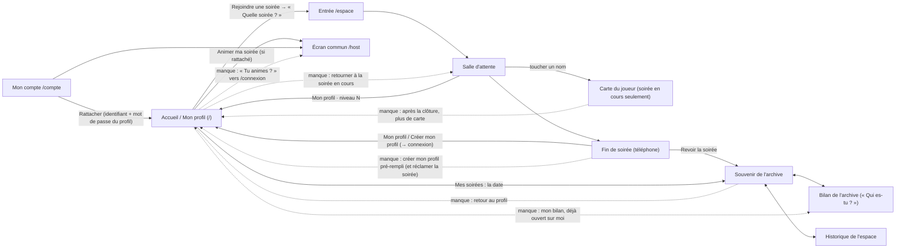

# Le profil, fil d'une soirée à l'autre — rapport de l'expert fidélisation

## En bref

Le profil relie **vraiment** deux soirées chez deux animateurs : Margaux, créée
depuis l'accueil, est reconnue d'un scan chez Denis (« Content de te revoir,
Margaux · Niveau 3 »), sa fin de soirée y fête même le lien (« Le
Globe-trotteur · Bronze », deux hôtes différents), et `/profil` aligne les deux
soirées, chacune vers son souvenir. La fin de soirée est le meilleur moment du
parcours : +404 XP, niveau 1 → 3, la Chouette d'Argent à porter d'un geste. Et
le chemin anonyme reste intact : trois gestes pour entrer, une fin de soirée
sobre, une carte sans manque affiché. Mais le fil se casse **après** la soirée
et **autour** d'elle : un **bug confirmé** fait perdre à jamais le nouveau code
de secours quand on s'en sert depuis `/profil` ; le profil créé depuis
l'accueil n'a pas d'avatar (🎉 d'office, hors de la grille) ; la même soirée
vaut +121 XP à la fin et +101 sur le profil ; et depuis le profil on ne rouvre
que le souvenir, jamais *son* bilan, sans titre de soirée ni chemin de retour.

Les trois corrections les plus rentables :
1. **Afficher le nouveau code de secours** après « J'ai oublié mon mot de
   passe » sur `/profil` (une ligne, P2·S).
2. **Choisir son avatar à la création depuis l'accueil**, et pré-remplir la
   création depuis la fin de soirée d'un anonyme (P2·S).
3. **Rendre le fil « Mes soirées » complet** : le titre de la soirée, un lien
   vers *son* bilan déjà ouvert sur soi, et le même chiffre d'expérience qu'à
   la fin (P2·M).

## Méthode

Une heure environ (dont une coupure de l'outil d'une vingtaine de minutes),
dans l'atelier (`TABLEE=export/tablee/atelier.json`), avec quatre appareils :

| Appareil | Rôle | Taille |
|---|---|---|
| `chloe` | Chloé, animatrice : activation, écran commun, `/compte` | portable 1366 × 768 |
| `denis` | Denis, animateur : activation, écran commun | portable 1366 × 768 |
| `chloe-tel1` | **Margaux**, l'invitée à profil qui passe de Chloé à Denis | téléphone 412 × 915 |
| `chloe-tel2` | le téléphone de **Chloé**, qui joue chez elle, puis **anonyme** (« Camille ») chez Denis | petit téléphone 360 × 640 |

- **Soirée chez Chloé** (« L'anniversaire de Chloé », archive
  `2026-09-24-o4d93`) : 2 quiz, 15 questions (13 QCM, 2 estimations), 8
  joueurs dont 6 fantômes anonymes (`fake-player.mjs`) — de quoi ouvrir le
  podium de soirée et les hauts faits. Margaux répond juste partout, Chloé se
  trompe trois fois.
- **Soirée chez Denis** (« Le quiz chez Denis », archive `2026-09-24-px51a`) :
  1 quiz de 6 questions, 4 joueurs (Margaux, « Camille » anonyme, 2 fantômes).
- Quiz créés par l'API (`export/evaluations/parcours-profil/creer-quiz.mjs`) :
  l'éditeur n'est pas le sujet. Réponses jouées par `jouer.sh` (même dossier),
  gestes consignés dans `journal-gestes.log`, notes dans `notes.md`.
- Lecture du code : `ProfilApp.tsx`, `ProfilForm.tsx`, `Secours.tsx`,
  `Entree.tsx`, `PlayerApp.tsx`, `FinDeSoiree.tsx`, `CarteJoueur.tsx`,
  `AccountApp.tsx`, `BilanApp.tsx`, `SpaceNav.tsx`, `profileRoutes.ts`,
  `profiles.ts`, `space.ts`, `sockets.ts`.

Captures (hors git) : `export/tablee/2026-09-24-atelier/captures/{chloe-tel1,chloe-tel2,chloe}/`,
citées ci-dessous par leur nom de fichier.

**Pas couvert, faute de temps** : le profil créé *en cours* de soirée depuis
la salle d'attente (« Gagner des niveaux : créer un profil » — lu dans le code
seulement ; PARCOURS-ENTREE §9 n° 12 dit qu'aucun test ne le vérifie) ;
« Jouer sous un autre prénom ce soir » ; le rattachement vu depuis le
portable de Chloé (vérifié depuis son téléphone) ; le détachement.

## Constats

### 1. Le code de secours utilisé depuis `/profil` ne rend jamais le nouveau code
- **Où** : `/profil` (et l'accueil `/`), déconnecté → « J'ai oublié mon mot de
  passe » — `client/src/components/ProfilForm.tsx:53-68` et `:70-88`.
- **Constat** : la demande réussit — le code est consommé, le mot de passe
  changé, la session ouverte — mais l'écran reste sur le même formulaire, sans
  un mot. Un second toucher répond « Identifiant ou code de secours
  incorrect » (le code n'existe plus). Le **nouveau** code, rendu par le
  serveur, n'est jamais affiché : la prochaine fois, le profil sera
  irrécupérable. Cause : `onDone` fait `setRecovery(…)` sans quitter le mode
  `secours`, or le rendu teste `mode === 'secours'` (l. 53) **avant**
  `recovery` (l. 70) — l'écran du code est inatteignable depuis ce mode.
  L'entrée d'une soirée, elle, passe bien par son écran C′ (`Entree.tsx:266-281`).
- **Preuve** : `chloe-tel1`, `Me déconnecter` → `J'ai oublié mon mot de passe`
  → `margaux` / `k94p gy8f h7ac tcfr` / `margaux-2027` → « Retrouver mon
  profil » : le formulaire reste (capture `019-secours-nouveau-code.png`) ;
  second toucher : « Identifiant ou code de secours incorrect »
  (`journal-gestes.log`, de 16:03:06 à 16:03:17) ; `POST /api/joueur/connexion` accepte alors
  `margaux-2027` et refuse `margaux-2026` ; un `recharger` montre Margaux
  connectée. Le nouveau code n'est apparu nulle part.
- **Qui ça touche, ce que ça coûte** : tout joueur qui a oublié son mot de
  passe et passe par l'accueil — la seule porte de retour, faute d'e-mail
  (README, « Les profils joueurs »). Il croit son code faux, et perd pour de
  bon son filet suivant.
- **Statut** : bug confirmé.
- **Piste** : passer à l'écran du code avant tout le reste —
  ```tsx
  onDone={(profile, neuf) => {
    if (profile) {
      setMode('connexion')            // quitte le formulaire de secours…
      return setRecovery({ code: neuf, profile }) // …et montre le code neuf
    }
    …
  }}
  ```
  (ou tester `recovery` avant `mode === 'secours'`). Profiter du passage pour
  donner à cet écran le bouton « Copier » de l'entrée (`Entree.tsx:481-497`) et
  un titre juste : « Ton profil est prêt » (l. 73) se lit mal après un secours
  — « Note ton nouveau code de secours ». **Test** (`server/test/` ne rend pas
  React) : un test de rendu n'existe pas dans ce dépôt ; à défaut, une
  vérification à l'œil dans la tablée — ou extraire la machine d'états du
  formulaire en fonction pure testable.
- **Priorité · effort** : P2 · S.

### 2. Le profil créé depuis l'accueil n'a pas d'avatar : 🎉 d'office, hors de la grille
- **Où** : `/` → « Créer un profil » — `ProfilApp.tsx:114-121` rend
  `ProfilForm` sans `prefill` ; `ProfilForm.tsx:104` envoie `avatar: ''` ;
  `server/src/auth/profiles.ts:701` pose alors `DEFAULT_AVATAR` = 🎉
  (`shared/avatars.ts:14`), qui n'est pas parmi les 24 emojis.
- **Constat** : le formulaire demande prénom, identifiant, mot de passe — pas
  d'avatar. Margaux devient 🎉 sans l'avoir choisi ; sur `/profil`, « Mon
  avatar » est replié, et une fois ouvert **aucune case n'est sélectionnée**.
  Elle entre ensuite partout en 🎉 : retrouvailles, écran commun, podium, fin
  de soirée (« Nouvelle finition : Argent 🎉 »). Tous les profils nés à
  l'accueil portent le même emoji : deux « Camille » ainsi créées sont
  « Camille (2) » à coup sûr — le filet n° 1 des homonymes (« les avatars
  déjà portés s'éteignent ») ne joue plus, puisque le profil entre tel quel.
  L'entrée d'une soirée, elle, tire un avatar au hasard (`Entree.tsx:45`) et
  montre la grille.
- **Preuve** : `004-profil-neuf.png`, `005-profil-avatar-ouvert.png`,
  `006-entree-retrouvailles-margaux.png`, `002-host-salle-attente.png`
  (Margaux 🎉 parmi les 📱 fantômes), `013-fin-soiree-margaux.png`.
- **Qui ça touche** : chaque profil créé « à froid », sur l'accueil — le
  chemin que README met en avant pour qui arrive sans QR.
- **Statut** : friction (confirmée à l'écran), qui fabrique des homonymes.
- **Piste** : la grille de l'écran B sous le prénom, avec un avatar tiré au
  sort d'avance (la fonction `tirage()` d'`Entree.tsx`), et `avatar` envoyé à
  l'inscription. À défaut, tirer au sort côté serveur plutôt que 🎉. Et, à la
  création, montrer l'avertissement de règle du mot de passe **avant** l'erreur
  (« Au moins 8 caractères », comme `Entree.tsx:423`), pas seulement après.
- **Priorité · effort** : P2 · S.

### 3. La même soirée vaut +121 XP à la fin et +101 sur le profil
- **Où** : fin de soirée (`FinDeSoiree.tsx:123`) contre `/profil` « Mes
  soirées » (`ProfilApp.tsx:354`).
- **Constat** : chez Denis, la fin de soirée de Margaux annonce « +121 points
  d'expérience » (paliers Globe-trotteur et Podium, bronze, compris) ; la ligne
  de la même soirée sur son profil dit « +101 ». La fin additionne les paliers
  (`server/src/core/space.ts:989-990`, `xpSoiree = g.xp + xpPaliers`) ; le
  profil les range sur une ligne à part, `#paliers`
  (`server/src/auth/profiles.ts:111`, `ecrireXpDesPaliers` l. 1138), que la
  liste des soirées n'affiche pas. Résultat : la somme des soirées ne fait pas
  non plus le total du profil.
- **Preuve** : `journal-gestes.log` (texte de la fin : « +121 points
  d'expérience … Paliers de carrière : Le Globe-trotteur · Bronze, L'Habitué du
  Podium · Bronze ») et `voir` de `/profil` : « chez Denis · 5/5 justes ·
  coup d'œil 100 % · 1ʳᵉ place · +101 » (capture `017-profil-deux-soirees.png`).
- **Qui ça touche** : la joueuse qui compare — précisément celle qui vient pour
  sa progression.
- **Statut** : bug d'affichage confirmé (deux vérités pour un même gain).
- **Piste** (S) : dire les deux à la fin — « +101 points d'expérience ·
  +20 de paliers de carrière » — plutôt que les fondre ; ou dériver, sur le
  profil, la part des paliers tombés ce soir-là (leur date de décernement) et
  l'ajouter à la ligne. La première ne touche à aucune dérivation.
- **Priorité · effort** : P3 · S.

### 4. Depuis le profil, on ne rouvre que le souvenir — ni son bilan, ni le titre, ni le retour
- **Où** : `/profil` « Mes soirées » (`ProfilApp.tsx:334-357`), le bilan
  d'archive (`BilanApp.tsx:78-88`), le fil des pages (`SpaceNav.tsx`).
- **Constat** :
  - chaque ligne ne dit que la **date** (« 24 septembre 2026 ») : deux soirées
    le même jour, chez deux hôtes, ne se distinguent que par « chez … » ; le
    titre donné à la clôture (« L'anniversaire de Chloé ») n'y est pas
    (`SoireeJouee`, `shared/profil.ts:659`, n'a pas de titre) ;
  - le seul lien mène au **souvenir** ; le bilan est à un toucher de plus
    (fil « Bilan »), et il demande « **Qui es-tu ?** » : la page ne reconnaît
    le joueur que par le jeton de la soirée (`readMe(slug)`, l. 81), que le
    téléphone oublie à la clôture (`client/src/socket.ts:88-90`) ; le profil,
    qui sait pourtant qui il est, ne le dit pas ;
  - ni le souvenir ni le bilan n'ont de chemin vers `/profil` (le fil ne
    connaît que « Mon compte », pour l'animateur) : on revient par le bouton
    retour du navigateur ;
  - la **carte** d'un joueur n'existe que pendant la soirée
    (`server/src/server.ts:444` lit la soirée en cours) : après la clôture,
    plus aucune carte — ni la sienne, ni celle d'un ami croisé.
- **Preuve** : `017-profil-deux-soirees.png` ; `015-bilan-depuis-profil.png`
  (« Qui es-tu ? Choisis ton prénom ») ; quatre gestes de `/profil` à *son*
  bilan (déplier, date, Bilan, son prénom).
- **Qui ça touche** : la joueuse fidèle, le lendemain — le moment où l'on
  revient relire et partager.
- **Statut** : friction.
- **Piste** (M) : enrichir `SoireeJouee` de `titre` (la fiche de l'archive le
  porte déjà : `archives.list`) et de `joueurId` — le joueur que ce profil
  incarnait ce soir-là, à retenir dans `profile_xp.detail` au crédit, là où le
  `(profil, soirée)` est déjà écrit. La ligne devient :
  ```
  L'anniversaire de Chloé — chez Chloé · 24 sept.
  13/13 justes · 1ʳᵉ place · +404        [Souvenir] [Mon bilan]
  ```
  avec « Mon bilan » = `/<espace>/soirees/<id>/bilan#p=<joueurId>`. Et dans
  `SpaceNav`, un lien « Mon profil » quand un cookie de profil est là (comme
  « Mon compte » pour l'animateur).
- **Priorité · effort** : P2 · M.

### 5. Un animateur non rattaché ne trouve pas sa console depuis l'accueil — et ses identifiants de compte y sont « incorrects »
- **Où** : l'accueil `/` (`ProfilApp.tsx`), l'entrée d'une soirée
  (`Entree.tsx:155-262`), `/compte` « Mon profil joueur » (`AccountApp.tsx:140-239`).
- **Constat** :
  - l'accueil ne propose que la connexion à un **profil** ; aucun lien vers
    `/connexion` (le compte) n'existe dans tout le client, hors la
    déconnexion de `/compte`. Un animateur qui n'a pas (encore) rattaché de
    profil n'a aucun chemin visible vers son écran commun depuis `/` ;
  - Chloé tape son identifiant et son mot de passe **de compte** à l'entrée de
    sa propre soirée : « Identifiant ou mot de passe incorrect » — exact pour la
    table des profils, faux pour elle, et compté comme un échec au verrou
    `joueur:chloe` ;
  - puis « Créer un profil » garde, à l'écran C, l'identifiant **et le mot de
    passe refusé**, masqué (`Entree.tsx:558` pour l'identifiant ; l'état
    `password` est partagé entre A et C) : sans y penser, on crée un profil
    avec un mot de passe qu'on ne se rappelle pas avoir choisi ;
  - le rattachement lui-même est simple (identifiant + mot de passe du profil,
    « Rattacher » : 3 gestes) et **tient ses promesses** : connectée à son
    profil sur son téléphone, Chloé voit « Animer ma soirée », qui ouvre `/host`
    d'un toucher (`009-accueil-animer-ma-soiree.png`,
    `010-host-sur-telephone.png`). Mais rien ne le suggère ailleurs qu'au
    milieu de `/compte`, et le texte y dit « crée-le depuis l'accueil » sans
    lien ;
  - une fois rattachée, « Changer de mot de passe » sur `/compte`
    (`AccountApp.tsx:361`) change celui du **compte** — celui qu'on vient
    justement d'oublier — sans le dire.
- **Preuve** : `002-entree-identifiants-compte-refuses.png`,
  `004-entree-creer-etape2-prerempli.png`, `005-compte-profil-rattache.png` ;
  `grep -rn "/connexion" client/src` (aucun lien d'accueil).
- **Qui ça touche** : chaque animateur qui joue aussi — tous, dans une bande
  d'amis.
- **Statut** : friction ; le parti pris « deux tables, `accounts.id` ne bouge
  jamais » (invariant 16) n'est pas en cause, seulement ses portes.
- **Piste** (S) : sur l'accueil, une ligne discrète sous l'échappée — « Tu
  animes ? Ouvre ton espace » → `/connexion?next=/host` ; quand la connexion au
  profil échoue, garder le message, et ne pas reporter le mot de passe refusé
  dans l'écran C (vider `password` en passant à « Créer un profil ») ; sur
  `/compte`, un lien « Créer mon profil joueur » vers `/?creer` et, une fois
  rattaché, « Changer le mot de passe **du compte** — celui de l'écran commun ».
  (M) : proposer le rattachement là où il sert — à l'activation (« Tu joues
  aussi ? ») ou quand le profil de l'animateur entre dans sa propre soirée.
- **Priorité · effort** : P2 · S (P3 · M pour les suggestions au bon moment).

### 6. La fin de soirée d'un anonyme invite à un profil… par la porte de connexion, et sans sa soirée
- **Où** : `FinDeSoiree.tsx:186-191` → `/profil`.
- **Constat** : « Avec un profil, tu retrouves tes points et tes prix à la
  prochaine soirée. **Créer mon profil** » mène à « **Retrouver mon profil** »
  (le mode connexion) : un toucher de plus pour trouver la création, puis le
  prénom à retaper, et pas d'avatar (constat 2) — le 🐱 « Camille » de la
  soirée est perdu. La soirée qu'on vient de jouer, elle, ne suit jamais :
  c'est « Réclamer sa soirée », laissé « plus tard » (RECOMPENSES.md, idée 50 —
  « le meilleur moment pour proposer un profil »). Le commentaire de
  `ProfilForm.tsx:24-27` montre que le même piège a déjà été corrigé pour la
  salle d'attente (`creer`), pas ici.
- **Preuve** : `007-fin-soiree-anonyme.png`,
  `008-fin-anonyme-creer-mon-profil.png` (`chloe-tel2`).
- **Statut** : friction ; « Réclamer sa soirée » est une idée à arbitrer.
- **Piste** (S) : `/profil?creer` ouvre `ProfilForm` en création, pré-rempli
  du dernier choix local de l'espace (`loadChoix(slug)`, déjà en
  `localStorage` : prénom et avatar du soir). (M, à arbitrer) : réclamer la
  soirée tout juste close — le jeton de la fin (`rt.finDe(token)`) désigne le
  joueur ; créditer la ligne `(profil, soirée)` à sa création respecterait
  l'idempotence (invariant 10).
- **Priorité · effort** : P2 · S ; P3 · M pour la réclamation.

### 7. Un profil connecté ne peut ni changer de mot de passe, ni relire son identifiant
- **Où** : `/profil` connecté ; `client/src/api.ts:182` (`api.joueur.motDePasse`).
- **Constat** : la route `POST /api/joueur/mot-de-passe` existe, bien gardée
  (`profileRoutes.ts:287-339`), et la fonction cliente aussi — **aucun écran ne
  l'appelle** (`grep -rn motDePasse client/src` : seule sa définition). Sur
  `/profil`, ni « Changer mon mot de passe », ni « mon identifiant : margaux ».
  Le seul moyen de changer de mot de passe est de se déconnecter et de brûler
  son code de secours (constat 1). README (« Garde-fous ») décrit pourtant ce
  changement comme une fonction du profil.
- **Preuve** : `014-profil-apres-chloe.png` (la page entière), lecture du code.
- **Statut** : manque (fonction serveur sans écran).
- **Piste** : un repli « Mon identifiant et mon mot de passe » en bas de
  `/profil` : l'identifiant en clair, le formulaire mot de passe actuel **ou**
  code de secours → nouveau, et l'affichage du code neuf quand c'est le code
  qui a servi (la route le rend déjà).
- **Priorité · effort** : P3 · S-M.

### 8. « Ce soir » sur `/profil` ignore la soirée où l'on est
- **Où** : `ProfilApp.tsx:169-184` ; `Rejoindre.tsx:49`.
- **Constat** : Margaux, en pleine soirée, touche « Mon profil · niveau 2 » :
  la carte « Ce soir » n'offre que « Rejoindre une soirée », qui demande
  « Quelle soirée ? » avec l'exemple « demo » (l'espace de l'administrateur).
  Le téléphone sait pourtant où il joue (`quizz.me.chez-chloe`). Retour
  possible seulement par le bouton du navigateur. C'était l'idée de Sofia à la
  première tablée (« Et des idées à mûrir ») : **elle tient toujours**.
- **Preuve** : `011-profil-en-pleine-soiree.png`,
  `012-profil-rejoindre-quelle-soiree.png`.
- **Statut** : friction.
- **Piste** (S) : lire les clés `quizz.me.*` (sous try/catch) et proposer
  « Retourner à La soirée de Chloé » en bouton principal ; placeholder neutre
  (« chez-bob ») à la place de « demo ».
- **Priorité · effort** : P3 · S.

### 9. Les retrouvailles ne disent pas où l'on arrive, et parlent de « badges »
- **Où** : écran B′, `Entree.tsx:283-355`.
- **Constat** : chez Chloé comme chez Denis, l'écran est identique :
  « Content de te revoir, Margaux · Niveau 3 · 11 badges » — sans le titre de
  la soirée que l'écran A et l'écran B affichent (`JoinHead`). Pour qui passe
  d'une fête à l'autre, c'est le seul écran qui ne dit pas chez qui l'on
  entre. « 11 badges » (l. 304) est le seul endroit où ce mot paraît :
  `/profil` dit « Hauts faits » (6) et « Mes prix » (5). « Content de te
  revoir » dès la première visite, et au masculin pour Margaux.
- **Preuve** : `006-entree-retrouvailles-margaux.png`,
  `016-entree-retrouvailles-denis.png`.
- **Statut** : friction (mots).
- **Piste** (S) : le surtitre de l'espace au-dessus de l'avatar (« La soirée
  de Denis ») ; « Niveau 3 · 6 hauts faits · 5 prix », ou le niveau seul ;
  « Te revoilà, Margaux » (épicène), ou « Bienvenue, Margaux » à la première
  entrée.
- **Priorité · effort** : P3 · S.

### 10. La fin de soirée tait les prix gagnés et ce qui vient ensuite
- **Où** : `FinDeSoiree.tsx`.
- **Constat** : Margaux repart avec cinq prix du palmarès rangés sur son
  étagère (le Devin, l'Éclair, l'Invincible, le Pile-Poil, le Sans-Faute) :
  la fin de soirée n'en dit rien — elle n'annonce que les hauts faits. Le
  « +404 » ne se décompose pas (questions, podiums, hauts faits), et rien ne
  dit le prochain palier (« plus que 136 XP pour le niveau 4 · Or au niveau
  6 », « 1 Foudre sur 10 pour le Tigre »). Le bouton principal, « Rejoindre la
  soirée suivante », propose une soirée qui n'existe pas encore.
- **Preuve** : `013-fin-soiree-margaux.png` ; `voir` de `/profil` « Mes prix 5 ».
- **Statut** : idée — la fin est déjà le point fort du parcours.
- **Piste** (S-M) : une section « Tes prix de la soirée » (le serveur les
  connaît au même moment que les hauts faits) ; sous la barre, « encore N XP
  pour le niveau suivant » ; « Revoir la soirée » en principal, « Rejoindre la
  soirée suivante » en second.
- **Priorité · effort** : P3 · S-M.

### 11. Créer un profil depuis l'entrée : l'étape 1 ne dit pas qu'on crée un profil
- **Où** : `Entree.tsx:566-660` (écran B avec `creation`).
- **Constat** : après « Créer un profil », l'écran est celui de « Jouer sans
  compte » — même titre, même pied « Rien à installer · ton prénom suffit ·
  j'ai un profil » —, seul le bouton dit « Continuer ». Rien n'annonce « étape
  1 sur 2 » ni que ce prénom et cet avatar seront ceux du profil, pour
  toujours (on ne les rechoisit jamais — invariant 8).
- **Preuve** : `003-entree-creer-etape1.png` (360 × 640).
- **Piste** (S) : en création, un sous-titre « Ton profil · 1/2 — le prénom et
  l'avatar que la salle verra à chaque soirée », et le pied « j'ai déjà un
  profil » seul.
- **Priorité · effort** : P3 · S.

## Mesures et cartes

### Le parcours, pas à pas (gestes comptés à l'appareil)

| Chemin | Écrans | Gestes | Ce qu'on demande |
|---|---|---|---|
| Entrer **sans compte** (écran A → B) | 2 | 3 | prénom (avatar tiré au sort) |
| **Créer un profil depuis l'accueil** | 3 (formulaire, code, profil) | 6 | prénom, identifiant, mot de passe — **pas d'avatar**, pas de « Copier » |
| **Créer un profil depuis l'entrée** (A → B → C → C′) | 4 avant la salle | 7 | prénom + avatar, puis mot de passe (identifiant pré-rempli), code avec « Copier » |
| Revenir avec un profil reconnu (B′) | 1 | 1 | rien |
| De `/profil` à **son** bilan d'une soirée passée | 3 pages | 4 | choisir son prénom dans la liste |
| Rattacher son profil à son espace (`/compte`) | 1 section | 3 | identifiant + mot de passe du profil (après avoir créé le profil ailleurs) |
| « Animer ma soirée » depuis l'accueil, une fois rattaché | 1 | 1 (connecté) · 4 (sinon) | rien de plus |
| Mot de passe oublié depuis `/profil` | 2 | 5 | identifiant, code, nouveau mot de passe — **le nouveau code n'apparaît pas** |
| Changer de mot de passe, connecté | — | — | **impossible** (pas d'écran) |

### Ce que la progression a donné

| | Chez Chloé (15 q., 8 joueurs) | Chez Denis (6 q., 4 joueurs) |
|---|---|---|
| Margaux — au podium des quiz | « +96 XP · Niveau 2 ! », puis « +53 XP » | « +76 XP » |
| Margaux — fin de soirée | **+404**, niveau 1 → 3, finition Argent, **Chouette d'Argent** (« Le porter »), 6 exploits | **+121**, niveau 3, paliers **Globe-trotteur** et Podium (bronze), la Foudre |
| Margaux — ligne de `/profil` | +404 | **+101** (constat 3) |
| Chloé, l'animatrice qui joue | +151, niveau 1 → 2, le Flair | — (anonyme ce soir-là) |
| « Camille », anonyme | — | 2ᵉ sur 4 · 976 pts, sans rien d'autre |
| Écran commun à la clôture | podium « Niv. 2 / Niv. 3 », la Chouette, « Ils montent de niveau », hauts faits **anonymes compris** (Lanterne Rouge d'Inès, Kamikaze de Karim) | — |

### La carte des liens



Relié : profil ↔ soirée en direct (salle d'attente), fin → souvenir et
profil, profil → souvenir de chaque soirée, profil → console (rattaché).
Pas relié : profil → soirée en cours, profil → *son* bilan, pages
d'archive → profil, carte après la clôture, accueil → espace animateur non
rattaché, prix → soirée où on les a gagnés (l'étagère n'a pas de date ni de
lien).

### Ce qui donne envie de revenir — et ce qui manque

Donne envie : la fin de soirée (un médaillon qu'on porte d'un geste, les
exploits en tuiles), la montée de niveau fêtée au téléphone **et** au mur, le
palier « Globe-trotteur » qui récompense exactement le passage d'un hôte à
l'autre, le catalogue visible avec ses jauges, les Divins voilés.
Manque : **le prochain objectif** dit en clair à la fin (constat 10), un
**fil de soirées** qu'on relit comme un album (titre, son bilan, ses prix de
ce soir-là — constat 4), et un pont pour l'anonyme séduit en fin de soirée
(constat 6).

### L'invité anonyme : se sent-il de seconde zone ?

Non, et c'est à garder. Vérifié : aucune pastille ni « Niv. 0 » sur ses
lignes (écran commun, podium, classement du téléphone) ; sa carte dit sa
soirée et rien de ce qui lui manque (`010-carte-karim-anonyme.png`) ; sa fin
de soirée est courte mais entière, avec une seule phrase d'invitation, sans
reproche (`007-fin-soiree-anonyme.png`) ; à la clôture, le mur fête les hauts
faits des anonymes comme les autres. Deux nuances seulement : au mur, la
pastille « Niv. 1 » d'un profil tout neuf distingue déjà les inscrits de la
salle (c'est le parti pris « l'absence, pas l'infériorité » — tension assumée,
à surveiller si les profils deviennent majoritaires) ; et les exploits d'un
anonyme, fêtés ce soir, ne sont gardés nulle part — raison de plus pour
« Réclamer sa soirée » (constat 6).

## Ce qui marche — à ne pas casser

- **La reconnaissance d'un espace à l'autre** : un cookie, un scan, un bouton
  (« Entrer dans la soirée ») — chez Denis comme chez Chloé.
- **Le chemin anonyme** : trois gestes, jamais de relance insistante, « Jouer
  sans compte » au format de « Me connecter » (vu en 360 × 640,
  `001-entree-A-petit.png`).
- **La fin de soirée** d'un profil : claire, belle, actionnable (« Le
  porter »), et son pendant au mur.
- **Le rattachement** : une fois fait, « Animer ma soirée » ouvre la console
  d'un toucher, depuis le téléphone même.
- **L'animatrice qui joue gagne comme tout le monde** : Chloé passe niveau 2
  à sa propre fête.
- **La carte** : riche pour un profil, sobre pour un anonyme.
- **Le code de secours à l'entrée** d'une soirée : affiché, copiable, puis on
  entre directement (`005-entree-code-secours.png`).

## Recommandations, dans l'ordre

1. Afficher le nouveau code de secours après un secours sur `/profil`
   (constat 1) — **P2 · S**.
2. Une grille d'avatars (avec tirage d'avance) à la création depuis
   l'accueil ; plus de 🎉 d'office (constat 2) — **P2 · S**.
3. « Créer mon profil » de la fin de soirée → création pré-remplie du prénom
   et de l'avatar du soir (constat 6) — **P2 · S**.
4. Accueil : un lien « Tu animes ? » vers `/connexion?next=/host` ; ne pas
   reporter le mot de passe refusé dans la création ; `/compte` : lien
   « Créer mon profil joueur » et « mot de passe du compte » nommé
   (constat 5) — **P2 · S**.
5. « Mes soirées » : titre, « Mon bilan » ouvert sur soi, lien retour au
   profil depuis les pages d'archive (constat 4) — **P2 · M**.
6. Un seul chiffre d'expérience par soirée : paliers dits à part à la fin
   (constat 3) — **P3 · S**.
7. « Ce soir » : retourner à la soirée en cours ; placeholder neutre
   (constat 8) — **P3 · S**.
8. Retrouvailles : le nom de la soirée, sans « badges » (constat 9) —
   **P3 · S**.
9. Changer son mot de passe et relire son identifiant sur `/profil`
   (constat 7) — **P3 · S-M**.
10. Fin de soirée : les prix du palmarès, le prochain objectif (constat 10) —
    **P3 · S-M**.
11. Étape 1 de la création : dire qu'on crée un profil (constat 11) —
    **P3 · S**.
12. À arbitrer : « Réclamer sa soirée » pour l'anonyme qui crée son profil à
    la fin (RECOMPENSES, idée 50) — **P3 · M**.

## Limites

- Deux soirées seulement, jouées le même jour : ni troisième soirée, ni
  soirée « qui ne compte pas » (jouée seul), ni retrait d'une soirée de
  l'historique vu depuis le profil.
- Le profil créé *entre deux quiz* (salle d'attente) n'a été que lu : le
  rattachement du joueur déjà inscrit reste sans test (PARCOURS-ENTREE §9,
  n° 12) — à jouer à la prochaine tablée.
- Fantômes anonymes seulement pour peupler les salles : aucun second profil
  réel en face, donc pas de carte d'un ami à profil vue par un autre, ni
  d'homonymes 🎉 réels (constat 2 déduit du code et d'un seul profil).
- Chromium seul ; clavier simulé (le bouton « Retrouver mon profil » sous le
  clavier en 412 × 915 est à revoir sur un vrai téléphone) ; presse-papier non
  éprouvé hors `localhost`.
- Le rendu de l'écran commun à la clôture (liste des hauts faits coupée en
  1366 × 768, `004-host-cloture.png`) relève de l'expert de l'écran commun.
