# Du scan du QR à la salle d'attente, en 4G moyenne — rapport de l'expert performance web

## En bref

FiestApp charge déjà bien : un invité en 4G moyenne (150 ms, 1,6 Mb/s) sur un
téléphone d'entrée de gamme (CPU ×4) voit l'écran d'entrée en **2,2 s**
(médiane de cinq) et arrive en salle d'attente **2,6 s** après le scan, si ses
gestes sont instantanés. Le rechargement à chaud coûte 606 octets. Tout se
joue sur **la bande passante** : 225 Ko pour arriver à la salle d'attente, soit
~1,1 s de transfert à 200 Ko/s. Le processeur ne compte presque pas (temps
bloqué de 13 ms à ×4, 113 ms à ×6), et précharger les morceaux de la route n'y
change rien : c'est mesuré. Les trois gains les plus rentables, tous sur les
octets : (1) **précompresser en brotli 11 au build** — la compression à la
volée (brotli qualité 4) produit des fichiers *plus gros* que gzip, et
brotli 11 à la volée coûterait 370 ms de CPU par requête ; (2) **sortir les
dessins des légendaires et des Divins (et `Carriere`) du chemin de l'invité
anonyme** — 21 Ko transférés pour des SVG qu'il n'affiche jamais ; (3)
**retirer le préchargement des deux polices** — mesuré : −157 ms sur l'entrée,
−240 ms sur le premier affichage, sans saut de police visible sur l'écran
d'entrée.

## Méthode

- **Machine** : conteneur à moi seul, 4 cœurs Xeon 2,8 GHz, charge < 0,4
  pendant les mesures (`uptime`). Chromium 1366 de Playwright (global),
  headless.
- **Le paquet** : `client/` construit par `npx vite build` (dans `client/dist`,
  non commité) et une seconde fois avec `--sourcemap` dans
  `export/evaluations/perf-chargement/dist-map`. Analyse par
  `retours/2026-09-24/experts/scripts/perf-chargement/paquet.mjs` : fermeture
  des imports statiques de chaque route, tailles brute, gzip 6 et brotli 11,
  et composition des gros morceaux par source (décodage des sourcemaps).
- **Le service** : serveur jetable `createQuizServer` sur le port 4710, bases
  dans `export/evaluations/perf-chargement/bases`, qui joue une petite soirée
  (six invités, un quiz de six questions, dont deux estimations) pour que le
  souvenir et le bilan aient du contenu —
  `retours/2026-09-24/experts/scripts/perf-chargement/serveur.ts`. En-têtes
  lus au `curl`.
- **Le ressenti** : `retours/2026-09-24/experts/scripts/perf-chargement/mesure.mjs`
  — un contexte neuf par passage (cache désactivé par CDP), profil téléphone
  360 × 640 (DPR 2, tactile, UA Android) ou portable 1366 × 768 pour `/host` et
  `/edit`, `Network.emulateNetworkConditions` (150 ms, 1,6 Mb/s descendant,
  750 kb/s montant), `Emulation.setCPUThrottlingRate` ×4 puis ×6. Mesurés dans
  la page : FCP, LCP, CLS, longues tâches (temps bloqué après le FCP), et les
  **jalons** (l'instant où un sélecteur apparaît, par `MutationObserver`) ;
  hors page (CDP) : TTFB, requêtes, octets transférés. Pour l'invité, le
  parcours complet : « Jouer sans compte » → champ prénom → « Continuer » →
  `.me-header` (salle d'attente). **Cinq passages par page et par CPU, la
  médiane** ; les séries brutes sont dans les JSON.
- **Les variantes** : `retours/2026-09-24/experts/scripts/perf-chargement/variantes.sh`
  réécrit `client/dist/index.html` (base, + `modulepreload` des 17 morceaux de
  `PlayerApp`, sans préchargement des polices, les deux) et remesure l'entrée
  de l'invité, cinq passages chacune.
- **Le réveil** : `retours/2026-09-24/experts/scripts/perf-chargement/demarrage.sh`
  — cinq démarrages à froid de la commande de Render (`node --import tsx
  src/index.ts`) sur bases vides, jusqu'au premier 200 de `/healthz` ; même
  chose avec un paquet `esbuild` du serveur (fichier temporaire, effacé).
- **Couverture** : `page.coverage` (JS et CSS) sur le parcours de l'invité
  jusqu'à la salle d'attente.
- Environ deux heures. **Pas couvert** : un vrai téléphone, une vraie 4G
  (perte de paquets, gigue), l'instance Render (0,1 CPU) et son réveil réel,
  iOS/WebKit, cinquante téléphones qui scannent en même temps.

## Constats

### 1. La compression à la volée fait moins bien que gzip, et coûte du CPU à chaque téléphone
- **Où** : `server/src/server.ts:167` (`app.use(compression())`), et
  `node_modules/compression/index.js:65` (brotli forcé à la qualité 4).
- **Constat** : `compression@1.8.1` préfère brotli dès que le navigateur
  l'accepte — tous les téléphones —, mais en **qualité 4**, qui compresse ici
  *moins bien que gzip 6* : 65 703 o contre 65 654 pour `index-*.js`, 18 163
  contre 17 113 pour le CSS, 17 391 contre 17 021 pour `HostApp`. Et elle
  recompresse chaque fichier à chaque requête, alors qu'ils sont immuables.
  Brotli 11, fait une fois au build, donnerait 55,2 Ko pour l'entrée (−15 %)
  et 14,5 Ko pour le CSS (−15 %).
- **Preuve** :
  ```
  curl -H 'Accept-Encoding: br'   …/assets/index-Dj7U8XGy.js | wc -c   → 65703
  curl -H 'Accept-Encoding: gzip' …/assets/index-Dj7U8XGy.js | wc -c   → 65654
  zlib, index.js (206 Ko) : gzip6 65 654 o · 5,5 ms | br4 65 703 o · 3,9 ms | br5 62 034 o · 6,2 ms | br11 56 370 o · 370 ms
  br4 sur les dix fichiers du chemin de l'invité : 9,1 ms de CPU par invité (ici, 4 cœurs à 2,8 GHz)
  ```
  Sur tout le chemin de l'invité (JS + CSS) : 140 Ko transférés aujourd'hui,
  ~121 Ko en brotli 11 (`paquet.mjs`, colonnes gzip / brotli).
- **Qui ça touche, ce que ça coûte** : chaque invité, à chaque premier scan :
  ~20 Ko de trop, soit ~0,1 s en 4G moyenne. Côté serveur, 9 ms de CPU par
  invité ici ; sur une instance à un dixième de processeur, de l'ordre de
  90 ms — cinquante téléphones qui scannent l'affiche en même temps, ~4 s de
  CPU pris aux diffusions de la soirée (extrapolation, non mesurée sur Render).
  Et monter la qualité à la volée serait pire : 370 ms par requête.
- **Statut** : bug confirmé (réglage contre-productif).
- **Piste** : précompresser au build, servir le `.br` s'il existe — sans
  dépendance. Un script `client/scripts/precompresser.mjs` lancé après
  `vite build` :
  ```js
  // Brotli 11 une fois pour toutes : à la volée, compression() s'en tient à
  // la qualité 4, qui fait ici moins bien que gzip — et recommence à chaque téléphone.
  for (const f of fs.readdirSync(dir)) if (/\.(js|css)$/.test(f))
    fs.writeFileSync(path.join(dir, f + '.br'), zlib.brotliCompressSync(fs.readFileSync(path.join(dir, f))))
  ```
  et, dans `server.ts`, **avant** `express.static` de `/assets` :
  ```ts
  app.get('/assets/:f', (req, res, next) => {
    const br = path.join(clientDist, 'assets', req.params.f + '.br')
    if (!/\bbr\b/.test(req.headers['accept-encoding'] ?? '') || !fs.existsSync(br)) return next()
    res.set({ 'Content-Encoding': 'br', Vary: 'Accept-Encoding', 'Cache-Control': 'public, max-age=31536000, immutable' })
    res.type(path.extname(req.params.f)).sendFile(br)
  })
  ```
  (`compression()` laisse passer une réponse qui porte déjà un
  `Content-Encoding`.) Un test dans `server/test/client.test.ts` : un
  `Accept-Encoding: br` sur un fichier d'`/assets` reçoit le `.br`, un client
  sans brotli le gzip. À défaut, le minimum : `compression({ brotli: { params:
  { [zlib.constants.BROTLI_PARAM_QUALITY]: 5 } } })` gagne 5 % pour 2 ms.
- **Priorité · effort** : P2 · S.

### 2. L'invité anonyme télécharge les dessins des légendaires et des Divins
- **Où** : `client/src/components/Avatar.tsx:4-5` (imports statiques de
  `Legendaire` et `Divin`) ; `client/src/components/CarteJoueur.tsx:8`
  (`Carriere`) ; importés par `PlayerApp.tsx:17,21`, `Entree.tsx:14`.
- **Constat** : le morceau `Niveau-*.js` (59 Ko bruts, **17,2 Ko transférés**)
  est à 85 % fait de `Divin.tsx` (25,3 Ko) et `Legendaire.tsx` (24,7 Ko) : les
  médaillons SVG. Ils arrivent chez chaque invité parce qu'`Avatar` les importe
  statiquement, alors qu'un invité anonyme n'en porte jamais, et qu'un profil
  n'en porte qu'un. `Carriere-*.js` (16,9 Ko bruts, 6,4 Ko transférés) arrive
  par `CarteJoueur`, qui ne s'ouvre qu'au toucher d'un nom : la couverture le
  dit exécuté à **4 %** jusqu'à la salle d'attente.
- **Preuve** : `paquet.mjs`, composition de `Niveau-CvMwzCpU.js` ; cascade de
  l'invité (`cpu4.json`, `pages.invite.cascade`) : `Niveau` 17 194 o et
  `Carriere` 6 432 o, partis à 1,29 s, sur les 225 Ko du parcours.
- **Qui ça touche, ce que ça coûte** : tous les invités : ~21 Ko, ~0,1 s en 4G
  moyenne, et du temps d'analyse sur un petit téléphone.
- **Statut** : friction (confirmée par la mesure, gain estimé, non remesuré).
- **Piste** : dans `Avatar`, les deux dessins en `lazy()`, l'emoji en attente
  — c'est exactement ce que voit un anonyme :
  ```tsx
  // Les médaillons pèsent 50 Ko de SVG : ils ne viennent que chez qui en porte un.
  const Legendaire = lazy(() => import('./Legendaire').then(m => ({ default: m.Legendaire })))
  const Divin = lazy(() => import('./Divin').then(m => ({ default: m.Divin })))
  …
  <Suspense fallback={<span className="avatar-emoji">{avatar}</span>}>…</Suspense>
  ```
  et `CarteJoueur` en `lazy()` dans `PlayerApp` (elle s'ouvre au toucher, un
  aller-retour de plus n'y coûte rien). `FinDeSoiree` peut suivre le même
  chemin (5,9 Ko, ne sert qu'à la clôture). À vérifier au rendu : un profil
  qui porte un légendaire voit l'emoji, puis le médaillon — préférable à un
  écran d'entrée plus lent pour toute la salle.
- **Priorité · effort** : P2 · S.

### 3. Le préchargement des polices retarde l'écran d'entrée sans l'habiller davantage
- **Où** : `client/index.html` (les deux `<link rel="preload" … as="font">`).
- **Constat** : les deux polices (45 Ko) partent en même temps que le script
  d'entrée (66 Ko) et le CSS (19 Ko), en priorité haute : en 4G moyenne, elles
  prennent la bande passante du script. Sans elles, tout arrive plus tôt, et
  l'écran d'entrée s'affiche **déjà habillé** : quand l'invité le voit (≥ 2 s),
  les polices, demandées par le CSS dès le « Chargement… », sont là.
- **Preuve** (`variantes.sh`, CPU ×4, médianes de cinq) :

  | Variante | FCP | Écran d'entrée | Salle d'attente | CLS |
  |---|---|---|---|---|
  | telle quelle | 1 188 ms | 2 179 ms | 2 611 ms | 0,000 |
  | + modulepreload de la route | 1 644 ms | 2 231 ms | 2 642 ms | — |
  | **sans préchargement des polices** | **948 ms** | **2 022 ms** | **2 461 ms** | 0,000 |
  | les deux | 1 448 ms | 2 022 ms | 2 481 ms | — |

  Captures à 2 050, 2 150 et 2 600 ms sans préchargement
  (`export/evaluations/perf-chargement/film/sanspolice-*.png`) : Cormorant
  (« Antoine ») et l'italique (« Le quiz de la soirée ») sont déjà en place
  dès la première image de l'écran d'entrée.
- **Qui ça touche, ce que ça coûte** : chaque invité, −157 ms sur l'entrée
  (−7 %), −240 ms sur le premier affichage.
- **Statut** : tension avec un parti pris — le commentaire d'`index.html`
  (« le premier écran arrive habillé ») : c'est vrai du seul « Chargement… »,
  pas de l'écran d'entrée, qui arrive après les polices dans les deux cas.
- **Piste** : retirer les deux `preload`, ou n'en garder qu'un — Figtree, qui
  écrit le « Chargement… » — et remesurer. Surtout ne pas ajouter de
  `modulepreload` des morceaux de la route : mesuré, c'est **pire** (la bande
  passante est le goulot, pas la cascade).
- **Priorité · effort** : P3 · S.

### 4. Entre 1,2 et 2,2 s, l'invité regarde « Chargement… »
- **Où** : `client/src/main.tsx` (le `Suspense` de repli) ; `PlayerApp.tsx:54`
  (`watchParty`) ; le socket vit dans le morceau `veille-*.js`.
- **Constat** : le chemin critique est en quatre temps, chacun attend le
  précédent : la page (0,16 s), l'entrée + le CSS (jusqu'à ~1,2 s), les 17
  morceaux de `PlayerApp` (~70 Ko, jusqu'à ~1,8 s), puis la poignée de main
  WebSocket et l'accusé de `party:watch` (deux allers-retours, ~0,3 s) avant
  que l'écran d'entrée ne s'affiche (2,2 s). Pendant une seconde, l'invité
  voit « Chargement… » au milieu d'un écran noir.
- **Preuve** : captures `export/evaluations/perf-chargement/film/invite-1300.png`
  et `invite-1800.png` (« Chargement… »), `invite-2400.png` (l'entrée) ;
  cascade ci-dessous.
- **Qui ça touche, ce que ça coûte** : chaque invité ; une seconde, c'est
  acceptable, mais c'est la seconde où l'on se demande si le QR a marché.
- **Statut** : idée.
- **Piste** : deux leviers, du moins cher au plus cher. (a) Un repli qui
  rassure : le serveur connaît l'espace à l'adresse `/<espace>` — il peut
  glisser dans `index.html` le nom de la soirée (`space.json` fait 145 octets)
  et le `Suspense` afficher « La soirée d'Antoine — on arrive… » dans la
  typographie de l'entrée. (b) Ouvrir le socket dès l'entrée (le sortir du
  morceau de la route vers `index`) pour que sa poignée de main se fasse
  pendant le téléchargement de `PlayerApp` : ~0,15 s de mieux, mais 16 Ko de
  plus pour les pages qui n'en ont pas besoin (souvenir, bilan, `/edit`). (a)
  d'abord.
- **Priorité · effort** : P3 · S pour (a), M pour (b).

### 5. Le réveil : une minute de page blanche, et un démarrage qui recompile le TypeScript
- **Où** : commande de démarrage de Render (`MISE-EN-LIGNE.md:163` :
  `node --import tsx src/index.ts`) ; `MISE-EN-LIGNE.md:320,341`.
- **Constat** : un serveur endormi ne sert même pas la page : l'invité qui
  scanne voit la page blanche du navigateur, sans un mot, tant que Render
  réveille l'instance (~1 min documentée). L'application n'y peut rien au
  premier passage. Ce qu'elle maîtrise, c'est son propre démarrage : ici,
  **850 ms** avec `tsx` (qui transpile tout le serveur à chaque démarrage)
  contre **480 ms** pour le même serveur empaqueté par `esbuild` (−43 %).
- **Preuve** (`demarrage.sh`, cinq démarrages à froid, jusqu'au premier 200 de
  `/healthz`) : `tsx` 814 · 836 · 851 · 870 · 937 ms ; paquet
  475 · 477 · 480 · 484 · 488 ms.
- **Qui ça touche, ce que ça coûte** : le premier invité d'une soirée où
  l'animateur a oublié d'ouvrir l'écran commun cinq minutes avant. Sur 0,1 CPU,
  les ~0,4 s d'écart peuvent devenir plusieurs secondes (non mesuré sur Render).
- **Statut** : idée — le gain local est certain, celui sur Render à vérifier.
- **Piste** : `esbuild` est déjà là (dépendance de Vite) : un
  `npm run build` qui produit aussi `server/dist/index.mjs`
  (`esbuild src/index.ts --bundle --platform=node --format=esm
  --packages=external`), et `node dist/index.mjs` au démarrage. Attention aux
  chemins résolus par `import.meta.url` (`server.ts:506`, contenus, client) :
  placer le paquet à la même profondeur que `src/`. Plus loin, pour les
  habitués seulement : un petit service worker qui, hors ligne ou sur 502/503,
  répond une page « Le serveur se réveille, patiente une minute » — mais un
  service worker est une source classique de clients figés après un
  déploiement : à ne faire qu'avec un test.
- **Priorité · effort** : P3 · M.

### 6. Un seul CSS de 87 Ko pour toutes les pages, dont l'invité utilise 10 %
- **Où** : `client/src/styles.css` (150 Ko de source), importé par `main.tsx`.
- **Constat** : l'invité télécharge les styles de l'écran commun, de
  l'éditeur, du souvenir, du bilan : 17 Ko gzip, dont **10 %** servent jusqu'à
  la salle d'attente (couverture CSS : 8 930 octets sur 86 694). Le quiz
  lui-même en demandera un peu plus, pas l'écran commun ni l'éditeur.
- **Preuve** : `page.coverage.startCSSCoverage()` sur le parcours de
  l'invité ; 116 règles de premier niveau préfixées `host`, `editor`,
  `recap`, `bilan`, `cloture`…
- **Qui ça touche, ce que ça coûte** : chaque invité, ~8–10 Ko (estimé) ; et
  le CSS bloque le premier affichage.
- **Statut** : idée.
- **Piste** : découper `styles.css` en un socle (variables, polices, boutons,
  champs, entrée) importé par `main.tsx` et des feuilles par vue importées
  par `HostApp`, `EditorApp`, `RecapApp`, `BilanApp` — Vite en fait des CSS
  par morceau, chargés avec eux. Risque : l'ordre de la cascade change ; à
  regarder au rendu, page par page.
- **Priorité · effort** : P3 · M.

### 7. React DOM, c'est 78 % du script d'entrée
- **Où** : `index-*.js` : 176 Ko de `react-dom` sur 202 Ko.
- **Constat** : l'essentiel du premier téléchargement est React DOM
  (~55 Ko transférés). Preact (`preact/compat`) en ferait ~5.
- **Qui ça touche, ce que ça coûte** : chaque première visite, ~50 Ko,
  ~0,25 s en 4G moyenne.
- **Statut** : tension avec un parti pris (« très peu de dépendances » : c'est
  un remplacement, pas un ajout, mais un changement de moteur de rendu, React
  19 et `StrictMode` compris).
- **Piste** : à ne tenter qu'une fois les quatre premiers points faits, sur
  une branche, avec `npm run verify` et une tablée.
- **Priorité · effort** : P3 · L.

### 8. Détails
- **`/edit`** a un décalage de mise en page de 0,061 à chaque chargement (CLS,
  cinq sur cinq) : la liste des quiz remplace « Chargement… ». Sous le seuil
  de 0,1, mais une hauteur réservée l'effacerait. P3 · S.
- **Le souvenir et le bilan** attendent leur JS (1,15 s) avant de demander
  leurs chiffres (`recap.json` part à 1,64 s) ; puis `/api/auth/me` part à
  2,1 s, après eux. Un `<link rel="preload" as="fetch">` injecté par le serveur
  gagnerait un aller-retour — mais la variante n° 3 montre que la bande
  passante prime : gain probable < 150 ms. P3 · S.
- **Commentaire périmé** : `server/src/server.ts:165` annonce « 320 Ko à nu,
  100 Ko compressé » ; c'est aujourd'hui 381 Ko et 121 Ko sur le chemin de
  l'invité, 202 Ko et 64 Ko pour l'entrée seule.

## Mesures et cartes

### Page × octets × requêtes × temps (4G moyenne, médianes de cinq, à froid)

Octets = transférés, en-têtes compris (CDP `encodedDataLength`) ; « Prête » =
le jalon de la page : l'écran d'entrée (« Jouer sans compte ») pour l'invité,
le formulaire pour l'accueil, l'adresse du QR pour `/host`, la liste des quiz
pour `/edit`, l'en-tête du souvenir, les onglets du bilan. « Salle d'attente »
compte des gestes instantanés.

**CPU ×4**

| Page | Ko | Requêtes | TTFB | FCP | LCP | Prête | Salle d'attente | Temps bloqué | CLS |
|---|---|---|---|---|---|---|---|---|---|
| `/<espace>` (invité, 360×640) | 225 | 23 + 1 ws | 161 | 1 176 | 2 208 | **2 184** | **2 587** | 13 | 0,000 |
| `/` (accueil) | 193 | 17 | 161 | 1 168 | 1 812 | 1 788 | — | 0 | 0,000 |
| `/host` (1366×768) | 225 | 21 + 1 ws | 161 | 1 172 | 2 380 | 2 233 | — | 157 | 0,000 |
| `/edit` (1366×768) | 184 | 16 | 161 | 1 160 | 1 804 | 1 772 | — | 36 | 0,061 |
| `/<espace>/souvenir` | 193 | 19 | 161 | 1 188 | 2 076 | 1 921 | — | 139 | 0,000 |
| `/<espace>/bilan` | 181 | 19 | 161 | 1 172 | 1 848 | 1 792 | — | 12 | 0,001 |

**CPU ×6**

| Page | FCP | LCP | Prête | Salle d'attente | Temps bloqué | Plus longue tâche |
|---|---|---|---|---|---|---|
| invité | 1 280 | 2 356 | 2 316 | 2 954 | 113 | 129 |
| accueil | 1 252 | 1 960 | 1 934 | — | 19 | 131 |
| `/host` | 1 264 | 2 664 | 2 427 | — | 323 | 215 |
| `/edit` | 1 260 | 2 036 | 1 970 | — | 97 | 147 |
| souvenir | 1 304 | 2 352 | 2 146 | — | 297 | 213 |
| bilan | 1 296 | 2 032 | 1 954 | — | 61 | 127 |

Détail du parcours de l'invité (médianes) : écran d'entrée → champ prénom
183 ms (×4) / 279 ms (×6) ; « Continuer » → salle d'attente 447 / 632 ms (un
`player:join` et sa réponse). **Rechargement à chaud** (cache du navigateur) :
1,18 s jusqu'à l'écran d'entrée, 23 réponses, **606 octets** — la page
revalidée (304), tout le reste servi par le cache immuable.

Écart-type faible : les cinq écrans d'entrée à ×4 tiennent en 41 ms
(2 162–2 203 ms). Séries brutes : `export/evaluations/perf-chargement/cpu4.json`,
`cpu6.json`, `variante-*.json` (non versionnés ; `mesure.mjs` les refait).

### Le paquet, route par route (JS seul ; plus le CSS, 84,7 Ko / 16,7 gzip / 14,5 brotli, et les polices)

| Route | Morceaux | Brut Ko | gzip Ko | brotli 11 Ko | Morceaux lourds hors entrée |
|---|---|---|---|---|---|
| `/<espace>` (invité) | 18 | 380,6 | 121,4 | 106,2 | PlayerApp 36, veille (socket.io) 47, Niveau 59, Carriere 17 |
| `/`, `/profil` | 11 | 300,9 | 95,1 | 82,5 | ProfilApp 9, Niveau 59, Carriere 17 |
| `/host` | 16 | 384,4 | 122,5 | 107,1 | HostApp 55 (dont qrcode.react 16), veille 47, Niveau 59 |
| `/edit` | 9 | 261,8 | 85,8 | 74,8 | EditorApp 45 |
| souvenir | 12 | 291,3 | 92,6 | 80,2 | RecapApp 9, Niveau 59 |
| bilan | 12 | 241,7 | 79,1 | 68,8 | BilanApp 22 |
| soirées | 8 | 219,3 | 71,3 | 61,6 | ArchivesApp 5 |

L'entrée (`index-*.js`, 202 Ko bruts, 64 gzip) est commune à tous : 176 Ko de
`react-dom`, 8 de `react`, 4 de `scheduler`, 12 de l'application. Polices :
Cormorant 600 (23,4 Ko), Cormorant italique 500 (23,9 Ko), Figtree variable
(20,2 Ko) — déjà réduites au latin ; les deux premières préchargées,
l'italique demandée par l'entrée (« Le quiz de la soirée »).

Couverture jusqu'à la salle d'attente : CSS 10 % ; `Carriere` 4 % ;
`PlayerApp` 22 % ; `Niveau` 28 % (surtout la déclaration des composants).

### Le service

| Ressource | Cache-Control | Compression | Remarque |
|---|---|---|---|
| `index.html` (toutes les adresses) | `no-cache` + ETag | br à la volée | revalidée à chaque ouverture (304) : juste |
| `/assets/*` (empreinte) | `max-age=31536000, immutable` | br q4 à la volée | juste ; mais br q4 ≥ gzip (constat 1) |
| `/fonts/*` | `max-age=2592000` | aucune (woff2) | juste |
| `manifest`, `icone.svg` | `max-age=3600` | br | juste |
| `/s/<espace>/*.json` | aucun (ETag) | br | juste pour des chiffres vivants |
| `/api/joueur/moi` | `no-store` | — | juste |

### Le chemin critique de l'invité (CPU ×4, première visite)

```mermaid
gantt
  dateFormat x
  axisFormat %L ms
  section Réseau
  Page /banc (1,7 Ko)                       :0, 280
  index.js 66 Ko + CSS 19 Ko + 2 polices 45 Ko :280, 1150
  17 morceaux de PlayerApp (~70 Ko)          :1270, 1800
  WebSocket + party:watch (2 allers-retours) :1800, 2150
  Italique (24 Ko, après l'entrée)           :2120, 2400
  section Écran
  Noir                                      :0, 1176
  « Chargement… »                           :1176, 2184
  Écran d'entrée                            :2184, 2600
```



Le goulot est la bande passante : les 225 Ko prennent à eux seuls ~1,1 s à
200 Ko/s, auxquels s'ajoutent trois étages d'allers-retours (page → entrée →
morceaux de la route → socket). Ce qui raccourcit l'attente, c'est d'envoyer
moins, pas plus tôt.

### Les optimisations, classées par gain (pour l'invité, première visite)

| # | Optimisation | Octets gagnés | Temps gagné (4G moyenne) | Mesuré ? | Effort |
|---|---|---|---|---|---|
| 1 | Médaillons et `Carriere` hors du chemin de l'anonyme | ~21 Ko | ~0,1 s | estimé | S |
| 2 | Brotli 11 précompressé au build | ~19 Ko (+ 9 ms CPU serveur/invité) | ~0,1 s | octets mesurés | S |
| 3 | Sans préchargement des polices | 0 | −157 ms sur l'entrée, −240 ms FCP | **mesuré** | S |
| 4 | CSS découpé par vue | ~8–10 Ko | ~0,05 s | estimé | M |
| 5 | Preact au lieu de React DOM | ~50 Ko | ~0,25 s | estimé | L |
| 6 | Repli qui nomme la soirée | 0 | 0 (perçu) | — | S |
| — | `modulepreload` des morceaux de la route | 0 | **+52 ms (pire)** | **mesuré** | — |

1 + 2 + 3 ensemble : environ 40 Ko de moins et ~0,35 s de moins sur l'écran
d'entrée, soit ~1,8 s au lieu de 2,2 (estimé).

## Ce qui marche — à ne pas casser

- **Le découpage par route** (`main.tsx`, `lazy()` par vue) : l'invité ne
  télécharge ni l'éditeur, ni l'écran commun, ni `qrcode.react`. C'est ce qui
  garde le chemin à 225 Ko.
- **Le cache** : fichiers à empreinte immuables un an, page toujours
  revalidée. Un invité qui recharge en pleine soirée ne retélécharge rien
  (606 octets) — et un déploiement ne laisse personne sur un vieux paquet.
- **Les polices locales et réduites au latin** (67 Ko), sans Google : la
  politique de sécurité reste à `'self'`, et le wifi local marche hors ligne.
- **Le transport `websocket` d'abord** (`client/src/socket.ts:15`) : pas de
  poignée de main en long-polling avant la vraie liaison.
- **Le processeur n'est pas un problème** : 13 ms de temps bloqué pour
  l'invité à ×4, aucune tâche au-delà de 130 ms à ×6 ; aucun décalage de mise
  en page à l'entrée (CLS 0). Le bouton « Jouer sans compte » est visible sans
  défiler en 360 × 640, et répond en 183 ms.
- **`/healthz` et le démarrage** : moins d'une seconde jusqu'à la première
  page, bases vides comprises.

## Recommandations, dans l'ordre

1. **Précompresser en brotli 11 au build et servir le `.br`** (constat 1) — −19 Ko
   par invité, et plus de compression par requête sur une instance à 0,1 CPU.
   P2 · S.
2. **Sortir `Legendaire`, `Divin` et `Carriere` du chemin de l'invité** par
   `lazy()` dans `Avatar` et `PlayerApp` (constat 2) — −21 Ko. P2 · S.
3. **Retirer le préchargement des polices** (constat 3) — −157 ms mesurés sur
   l'écran d'entrée, sans saut visible ; ne pas le remplacer par des
   `modulepreload`, mesurés pires. P3 · S.
4. **Un repli de chargement qui nomme la soirée** (constat 4a) — la seconde de
   « Chargement… » devient « La soirée d'Antoine — on arrive… ». P3 · S.
5. **Empaqueter le serveur pour son démarrage** (constat 5) — −43 % localement ;
   à mesurer sur Render. P3 · M.
6. **Découper le CSS par vue** (constat 6). P3 · M.
7. Réserver la hauteur de la liste de `/edit`, précharger les chiffres du
   souvenir et du bilan, corriger le commentaire de `server.ts:165`
   (constat 8). P3 · S.
8. **Preact** (constat 7), seulement après le reste, et en l'arbitrant avec
   le parti pris des dépendances. P3 · L.

## Limites

- **Émulation, pas un vrai téléphone** : le ralentissement ×4/×6 de Chromium
  approche un Android d'entrée de gamme, pas son moteur JS ni sa mémoire ; la
  4G émulée n'a ni perte de paquets, ni gigue, ni le démarrage lent de TCP
  d'une vraie antenne en salle bondée. iOS/WebKit n'est pas mesuré.
- **Un seul téléphone à la fois** : cinquante téléphones qui scannent
  ensemble partagent l'antenne *et* le CPU du serveur ; le coût de la
  compression à la volée sur 0,1 CPU est extrapolé, pas mesuré.
- **Le réveil de Render** n'est pas reproductible ici : la minute documentée
  et ce qu'affiche le proxy de Render pendant ce temps restent à observer sur
  la préproduction ; seul le démarrage de l'application est mesuré.
- **Les gains 1, 2, 4, 6 et 7 du tableau sont estimés** d'après les octets, pas
  remesurés après correction ; seules les variantes de `index.html` l'ont été.
- Le souvenir et le bilan ont été mesurés sur une petite soirée (six invités,
  six questions) : une soirée de cent invités alourdirait `recap.json` et le
  rendu, non mesurés.
