# Trois soirées en même temps : le pouls du serveur — rapport de l'expert perf-observateur

*La tablée du 24 septembre 2026 (`export/tablee/2026-09-24-trois-salons/`), analysée
après coup. Heures en UTC. Tous les chiffres se rejouent avec les scripts de
`export/evaluations/perf-observateur/`.*

## En bref

Le serveur n'a jamais été le goulot. Il y avait trois espaces, deux quiz joués en même temps (trois pendant une demi-minute) et quatorze invités connectés au plus. /healthz a répondu en 2 à 14 ms alors que la machine tournait à une charge de 5 à 10 sur 4 cœurs. Le journal du serveur ne contient aucune erreur, et le miroir n'a eu ni file ni échec.

Presque toute la charge venait du banc. Quand la coupure a fait taire les agents, la régie est tombée de 6–8 % à 1 % d'un cœur, alors que le quiz de Nadia continuait tout seul. Mesuré seul, le serveur joue les trois quiz de la tablée pour 1,8 % d'un cœur, et 150 invités pour 4 à 4,5 %, avec des accusés en 2 ms.

Pour un hébergement partagé, le point faible est l'arrivée, pas le jeu : chaque téléphone qui scanne coûte 30 ms de CPU, dont la moitié sert à recompresser l'application.

Les trois gains les plus rentables :
- faire dire à /healthz la charge du processus (CPU, retard de la boucle et des chronomètres, espaces actifs, latence du miroir), sans quoi la production reste aveugle ;
- compresser une fois pour toutes, au build, les fichiers immuables ;
- sortir le serveur du processus de la régie, pour que la prochaine tablée le mesure seul.

## Méthode

- **Les données de la tablée**, relues après coup, sans toucher à aucun processus :
  - `export/evaluations/perf-observateur/releves.csv` : 217 relevés, un toutes les 15 s, de 15:06:13 à 16:00:24 (script `releve.mjs`, à côté). Ce que vaut chaque colonne :
    - `healthz_ms` : un aller-retour HTTP depuis un autre processus de la même machine. Il mesure la disponibilité de la boucle du serveur, plus l'ordonnancement de la machine.
    - `regie_cpu` : le CPU du processus de la régie sur l'intervalle, lu dans `/proc`. Il compte **le serveur de jeu et le côté Node de Playwright ensemble**.
    - `rss_mo` (dit par /healthz) et `regie_rss_mo` : le même processus.
    - `chrome_cpu` et `node_cpu_total` : des sommes de moyennes sur la vie des processus (`ps`), pas des mesures d'intervalle. Je ne m'en sers que pour un ordre de grandeur.
    - `gestes_ms_*` : la médiane d'un mélange de gestes (voir le constat 3).
  - `journal.jsonl` : 1 650 lignes (1 547 gestes, 103 réponses), soit 17 agents (3 animateurs, 14 invités) sur une vingtaine d'appareils. S'y ajoutent `chronologie.mjs`, `regie.log` et les 17 retours.
  - La coupure de l'outil, de 15:25 à 15:52 : ma ligne de base.
- **L'analyse** tient dans mon dossier :
  - `analyse.mjs` : phases, minute par minute, pics, corrélations, durée par type de geste (`node export/evaluations/perf-observateur/analyse.mjs phases`, ou `minutes`, `pics`, `correl`, `types`) ;
  - `sondeurs.mjs` : le CPU de la régie face aux sondages de page en vol.
- **Une mesure courte, pour trancher « serveur ou banc ? » : le serveur seul**, sans Playwright ni Chromium dans son processus.
  - `serveur-seul.ts` démarre `createQuizServer` sur un port libre, avec des bases jetables dans `mesure/`. Il relève de l'intérieur, toutes les 2 s, le CPU, la mémoire et le retard de boucle.
  - `charge.mjs` joue les invités depuis un autre processus. Chaque invité charge la page comme Chrome (index, JS et CSS d'entrée, `PlayerApp`, polices, en acceptant brotli), rejoint la soirée, puis répond 0,5 à 4,5 s après chaque question, comme `fake-player.mjs`. Il y a deux écrans d'animateur par espace. Les quiz de 8 questions de 10 s se jouent en même temps, en enchaînement automatique à 3 s.
  - Cinq passages d'une à deux minutes, dont deux variantes (« sans page », « sans compression »), plus trois démarrages à froid (`demarrage.mjs`).
  - Conditions : machine calme (load1 entre 0,1 et 1,0), `nice -n 10`, chaque serveur éteint après son passage.
- **Pas couvert** :
  - l'écriture des quiz avant 15:06:13, car le relevé a commencé après (le journal, lui, la couvre) ;
  - aucune sonde temps réel posée ;
  - ni vrai réseau, ni Turso distant, ni Render (voir les Limites).
- Environ une heure et demie.

## Constats

### 1. /healthz ne permet pas de savoir, en production, si le serveur tient

- **Où** : `server/src/server.ts:353-365` (la route), `server/src/core/backup.ts:1191-1212` (son bloc `miroir`).
- **Constat** :
  - **Aucun chiffre de charge.** Il n'y a ni CPU, ni retard de la boucle d'événements, ni retard des chronomètres, ni tas : seulement le RSS du processus. Pendant la tablée, rien dans /healthz ne disait si un geste lent venait du serveur. Il a fallu lire `/proc`, qui mêle le serveur et Playwright (constat 3). Sur Render, personne n'a ce `/proc`.
  - **`spaces` compte les espaces chargés depuis le démarrage, pas les soirées vivantes.** C'est `registry.all()`, et un espace n'est jamais déchargé : /healthz disait « 3 » à 16:00:24, sans un invité ni un quiz.
  - **`quizzes` compte une partie arrêtée sur son podium.** Il valait 1 de 15:28:18 à 15:54:02, soit 26 minutes pendant lesquelles personne ne jouait. Le jour où l'on se demande « puis-je redéployer maintenant ? », une animatrice qui a oublié « Terminer le quiz » fait croire à une partie en cours.
  - **Le miroir n'est vu qu'à l'instant du relevé.** `enAttente` valait 0 dans 217 relevés sur 217. C'est rassurant ici, puisque la « base Turso » était un fichier local (`regie.ts:200`). Mais le relevé est muet sur ce qui comptera en ligne : la latence d'une écriture vers Turso, et la file au pire de la minute. Une file qui monte et redescend entre deux relevés ne se voit pas.
- **Preuve** : `releves.csv`, colonnes `spaces`, `quizzes` et `miroir` (lignes de 15:28:24 à 15:54:09, et 16:00:24) ; `server.ts:356-363`.
- **Qui ça touche, ce que ça coûte** : l'exploitant. C'est lui qui doit décider si l'offre gratuite suffit, et répondre à « samedi, la soirée a ramé : le serveur ou le wifi ? ». Aujourd'hui, personne ne peut le dire.
- **Statut** : friction d'exploitation, pas un bug.
- **Piste** : un petit module qui suit la charge sur la dernière minute, et quelques compteurs. Tout reste agrégé, sans aucun nom (la route est publique), et se lit en O(1) : Render et le service de réveil appellent /healthz sans cesse (`render.yaml:69`), et la route doit rester un 200.

  | Champ proposé | Ce qu'il dit | Comment (Node, sans dépendance) | Ce que la tablée n'a pas pu lire |
  |---|---|---|---|
  | `charge.cpuPct` | le CPU du processus sur la dernière minute, tous fils (zlib compris) | `process.cpuUsage()` | la part du serveur dans les 4 à 10 % de la régie |
  | `charge.boucleOccupeePct` | la part du temps où la boucle travaille | `performance.eventLoopUtilization()` | idem, sans même un minuteur |
  | `charge.retardBoucleP99Ms`, `…MaxMs` | ce qu'attend un message d'invité avant d'être lu | `monitorEventLoopDelay`, résolution retirée | les 89 et 119 ms du début : banc ou serveur ? |
  | `charge.retardChronosMaxMs` | de combien un chronomètre a sonné après son échéance | `Date.now() - echeance` dans le rappel d'`armTimer` (`engine.ts:395-411`, l'échéance y est déjà) | une révélation en retard (invariants 5 et 6) |
  | `memoire.tasMo` | le tas, à côté du RSS | `process.memoryUsage().heapUsed` | une fuite : le RSS de la régie (175–235 Mo) mêle Playwright |
  | `connexions` | les sockets ouverts | `io.engine.clientsCount` | — |
  | `espacesActifs` | les espaces avec un invité connecté ou une partie | un filtre sur `registry.all()` | « 3 espaces » à la fin, sans personne |
  | `quizEnCours` / `podiumsAffiches` | une partie qui joue, une partie arrêtée | la phase de `engine.summary()` | `quizzes` = 1 pendant 26 minutes vides |
  | `miroir.latenceP95Ms`, `miroir.enAttenteMax` | Turso, sur la dernière minute | chronométrer chaque envoi dans `backup.ts` | tout : le miroir était un fichier |
  | `diffusion.koParMin` | ce que le serveur envoie | l'événement `packetCreate` des sockets engine.io | le poids par salle (constat 4) |
  | `demarrage.pretEnMs` | le coût du réveil de l'offre gratuite | `performance.now()` à la fin de `createQuizServer` | le réveil, jamais mesuré sur Render |

  Esquisse pour les cinq premiers champs :

  ```ts
  // server/src/core/charge.ts — la charge du processus sur la dernière minute. La tablée
  // n'a pu la lire que dans /proc, qui mêlait le serveur et Playwright ; Render ne montre rien.
  import { monitorEventLoopDelay, performance } from 'node:perf_hooks'

  const RESOLUTION_MS = 20
  export function suivreLaCharge(fenetreMs = 60_000) {
    const retard = monitorEventLoopDelay({ resolution: RESOLUTION_MS })
    retard.enable()
    let cpu = process.cpuUsage()
    let boucle = performance.eventLoopUtilization()
    let depuis = performance.now()
    let chronos = 0
    const derniere = { cpuPct: 0, boucleOccupeePct: 0, retardBoucleP99Ms: 0, retardBoucleMaxMs: 0, retardChronosMaxMs: 0 }
    setInterval(() => {
      const maintenant = performance.now()
      const c = process.cpuUsage(cpu)
      derniere.cpuPct = Math.round(((c.user + c.system) / 1000 / (maintenant - depuis)) * 1000) / 10
      derniere.boucleOccupeePct = Math.round(performance.eventLoopUtilization(boucle).utilization * 100)
      // L'histogramme compte sa propre résolution dans chaque mesure : on la retire.
      derniere.retardBoucleP99Ms = Math.max(0, Math.round(retard.percentile(99) / 1e6 - RESOLUTION_MS))
      derniere.retardBoucleMaxMs = Math.max(0, Math.round(retard.max / 1e6 - RESOLUTION_MS))
      derniere.retardChronosMaxMs = chronos
      retard.reset()
      cpu = process.cpuUsage()
      boucle = performance.eventLoopUtilization()
      depuis = maintenant
      chronos = 0
    }, fenetreMs).unref()
    return {
      /** Un chronomètre sonne : de combien après son échéance ? */
      chronoSonne(echeance: number) {
        chronos = Math.max(chronos, Date.now() - echeance)
      },
      lire: () => ({ ...derniere }),
    }
  }
  ```

  Et une ligne au journal à chaque clôture, par exemple « soirée close : 7 invités, 10 questions, 53 min, 1,2 Mo diffusés ». C'est de quoi dimensionner l'hébergement à partir des vraies soirées.
- **Test à écrire** (dans `server/test/exploitation.test.ts` ; il échoue aujourd'hui) : jouer une question avec deux invités, puis lire /healthz. On vérifie que :
  - `charge.cpuPct` et `charge.retardChronosMaxMs` sont des nombres ≥ 0 ;
  - `espacesActifs` ≤ `spaces` ;
  - `quizEnCours` retombe à 0 quand la partie s'arrête sur son podium ;
  - le corps ne contient ni le nom de l'espace ni un prénom (la route est publique).

  `fenetreMs` se règle en option, pour que le test n'attende pas une minute.
- **Priorité · effort** : **P2** : aucune soirée n'est abîmée aujourd'hui, mais c'est la seule façon de savoir si l'offre gratuite en abîmera une. Effort **S** pour la charge, le tas, les connexions et les espaces actifs ; **M** pour la latence du miroir et les octets diffusés.

### 2. La ruée du scan : 30 ms de CPU par téléphone, dont la moitié pour recompresser l'application

- **Où** : `server/src/server.ts:167` (`compression()`), `server.ts:522-532` (les fichiers d'`/assets`, immuables, un an de cache).
- **Constat** : mesuré sur le serveur seul, un invité qui arrive coûte 27 à 32 ms de CPU :
  - 7 ms pour entrer dans la soirée (socket, `party:watch`, `player:join`, diffusions) ;
  - 8,5 ms pour servir la page sans compression (six requêtes, 366 Ko) ;
  - **15 ms pour la compresser**, en brotli qualité 4 (`compression` 1.8.1), jusqu'à 136 Ko.

  Cette compression se refait pour chaque téléphone, alors que ces fichiers ne changent qu'au déploiement. Cent cinquante arrivées en dix secondes prennent 40 à 45 % d'un cœur ; le jeu qui suit, 4 à 4,5 %.
- **Preuve** :
  - `mesure/grande/resume.json` : 4 530 ms de CPU pour 150 arrivées ;
  - `mesure/grande-sans-page/` : 1 060 ms ;
  - `mesure/grande-sans-compression/` : 2 330 ms, avec 366 Ko par invité au lieu de 136.

  Pour rejouer : `nice -n 10 node export/evaluations/perf-observateur/charge.mjs grande 3 50 8`, puis la même commande précédée de `SANS_PAGE=1`, puis de `SANS_COMPRESSION=1`.
- **Qui ça touche, ce que ça coûte** : sur une machine de bureau, personne (la page part en 20 ms). Sur l'offre gratuite de Render (`render.yaml:57` et `:109` : `plan: free`, annoncée à 0,1 CPU), c'est différent, si ce dixième de cœur est un plafond strict :
  - le serveur sert environ trois arrivées par seconde ;
  - une salle de 50 qui scanne en dix secondes attend jusqu'à une quinzaine de secondes sa page ;
  - pendant ce temps, les révélations des autres salons se partagent le même dixième de cœur.

  C'est exactement le cas d'un serveur partagé un samedi soir.
- **Statut** : mesuré en local ; **non confirmé** sur Render (le plafond réel se lira grâce au constat 1).
- **Piste** : compresser une fois, au build, ce qui ne change qu'au build, avec `node:zlib` et sans dépendance. Brotli à la qualité maximale, que personne ne paierait à chaque requête, allégerait aussi ce que télécharge un téléphone en 4G (à mesurer).

  ```js
  // client/scripts/precompresser.mjs, lancé après `vite build` : le serveur recompressait
  // les mêmes 430 Ko pour chaque téléphone — la moitié du CPU d'une arrivée.
  import { brotliCompressSync, constants, gzipSync } from 'node:zlib'
  import { readdirSync, readFileSync, writeFileSync } from 'node:fs'
  for (const f of readdirSync('dist/assets').filter(f => /\.(js|css|svg)$/.test(f))) {
    const brut = readFileSync(`dist/assets/${f}`)
    writeFileSync(`dist/assets/${f}.br`, brotliCompressSync(brut, { params: { [constants.BROTLI_PARAM_QUALITY]: 11 } }))
    writeFileSync(`dist/assets/${f}.gz`, gzipSync(brut, { level: 9 }))
  }
  ```

  ```ts
  // server.ts, juste avant express.static('/assets'). `compression()` laisse passer une
  // réponse déjà encodée (node_modules/compression/index.js:185-187).
  const precompresses = new Set(fs.readdirSync(path.join(clientDist, 'assets')))
  app.use('/assets', (req, res, next) => {
    const accepte = String(req.headers['accept-encoding'] ?? '')
    const nom = path.basename(req.path)
    const [enc, ext] = /\bbr\b/.test(accepte) && precompresses.has(`${nom}.br`) ? ['br', 'br']
      : /\bgzip\b/.test(accepte) && precompresses.has(`${nom}.gz`) ? ['gzip', 'gz'] : [null, null]
    if (!enc) return next()
    res.set({ 'Content-Encoding': enc, Vary: 'Accept-Encoding' })
    res.type(path.extname(nom))
    res.sendFile(path.join(clientDist, 'assets', `${nom}.${ext}`), { maxAge: '1y', immutable: true })
  })
  ```

  Le test : `/assets/<entrée>.js` demandé avec `Accept-Encoding: br` rend `Content-Encoding: br`, et le même contenu une fois décompressé ; sans l'en-tête, il rend le fichier nu. On mesure avant et après avec la phase « arrivées » de `charge.mjs`.
- **Priorité · effort** : **P3 · S-M**. Elle passe en P2 le jour où les mesures du constat 1 montrent un plafond strict pendant une ruée.

### 3. La régie mesure mal le serveur : il partage le processus et la boucle de Playwright

Ce constat porte sur le banc, pas sur l'application.

- **Où** :
  - `server/scripts/tablee/regie.ts:197-205` : le serveur démarre dans le processus de la régie ;
  - `regie.ts:275` : un seul Chromium pour tous les appareils ;
  - `regie.ts:746-760` : `stabiliser` ;
  - `regie.ts:964-977` et `:1238` : `question` sonde le téléphone toutes les 250 ms ;
  - `regie.ts:1219-1224` : `attendre` sonde toutes les 300 ms ;
  - `export/evaluations/perf-observateur/releve.mjs:43-53`.
- **Constat** :
  - **Le CPU de la régie (4 à 10,5 % d'un cœur en jeu) est surtout celui de Playwright.** La coupure le prouve. À 15:25:10, les agents se taisent, mais le quiz de Nadia continue : Q8 à Q10, sept téléphones, la console, et le miroir qui écrit jusqu'à 15:28:18. La régie tombe aussitôt à 1,1 %, puis reste à 1,0 % (écart-type 0,22) sur 95 relevés. Mesuré seul à la même échelle, le serveur prend 1,8 %.
  - **Pendant le jeu, il n'existe aucun intervalle « serveur seul ».** Une dizaine de gestes d'agents sont en vol à tout instant, et chaque attente sonde sa page 3 à 4 fois par seconde : 35 sondages par seconde en moyenne entre 15:08 et 15:25.
  - **Les deux /healthz lents du début restent à expliquer.** Ils valent 89 et 119 ms, à 15:06:13 et 15:06:24, contre 2 à 14 ms pour les 215 autres relevés. Ils tombent pendant l'écriture des quiz, quand l'éditeur de dix questions comptait plus de 800 éléments à relire à chaque geste (références jusqu'à `e841`). Le premier est probablement l'appel à froid du relevé ; le second, probablement la boucle partagée avec Playwright. **Non confirmé**, mais le serveur seul, lui, n'a jamais dépassé 67 ms de retard de boucle, même à 150 invités.
  - **La colonne `gestes_ms_med_60s` ne suit pas la charge.** Elle mélange `dire` (0 ms), `texte` (8 ms), `capture` (90 ms) et `toucher` (480 ms), si bien que sa médiane saute de 19 à 516 ms selon les gestes de la minute.
  - **Un `toucher` a un plancher d'environ 380 ms, qui vient du banc** : trois regards à 120 ms pour déclarer la page stable. À 480 ms de médiane, la part du serveur se perd dans le bruit.
- **Preuve** :
  - `analyse.mjs phases` et `analyse.mjs correl` : la régie est à 1,2 % sur les intervalles sans geste, et à 5,4–6,5 % dès qu'un geste passe, quel qu'en soit le nombre ;
  - `sondeurs.mjs` ;
  - le tableau « Les gestes, par type », plus bas.
- **Qui ça touche** : la prochaine tablée de performance, qui lirait des courbes de banc en croyant lire le serveur.
- **Statut** : friction du banc, pas de l'application.
- **Piste** :
  - démarrer le serveur de jeu dans un processus enfant de la régie, comme `serveur-seul.ts` : un `fork` qui appelle `createQuizServer` et rend son port. La régie ne se sert de l'objet serveur que pour `close()` (`regie.ts:1553`) ;
  - relever les deux processus à part ;
  - dans `releve.mjs`, calculer une médiane par type de geste (`toucher`, `ecrire`, `repondre`) plutôt qu'un mélange ;
  - une fois le constat 1 fait, lire la charge dans /healthz.
- **Priorité · effort** : **P3 · S**.

### 4. Ce que reçoit chaque téléphone grandit avec la salle

- **Où** : `server/src/core/space.ts:763-764` (l'instantané à tout l'espace, encodé une fois) ; `server/src/core/engine.ts:297`, `:427`, `:434` (les vues, une par invité, et celle des écrans).
- **Constat** : chaque invité reçoit toujours 4,5 messages par question, quelle que soit la taille de la salle : le regroupement de l'invariant 4 tient. Mais chaque message grossit d'environ 186 octets par joueur de la salle. Par invité et par question :
  - 2,7 Ko à 8 invités ;
  - 10,2 Ko à 50 ;
  - 27,9 Ko à 150, soit 4,2 Mo envoyés à chaque question pour une salle de 150.

  L'écran commun reçoit à peu près un message par réponse : 11 par question à 8 invités, 153 à 150 (80 Ko). Le CPU suit sans peine : 4,1 % d'un cœur à 150 dans une seule salle, 349 ms de CPU par question, accusés en 2 ms.
- **Preuve** : `mesure/tablee`, `mesure/grande` et `mesure/un-salon-150` (`resume.json`, champs `ko_par_invite_par_question` et `messages_par_ecran_par_question`).
- **Qui ça touche** : à 150 (le plafond par défaut, `shared/space.ts:87`), un téléphone télécharge environ 28 Ko par question, soit un demi-mégaoctet par quiz de vingt questions. Rien de grave, même en 4G. Mais c'est le premier coût quadratique du protocole.
- **Statut** : idée, à surveiller ; pas un problème aujourd'hui.
- **Piste** : avant de relever `DEFAULT_MAX_PLAYERS`, rejouer `charge.mjs <nom> 1 <n> 8`. Si le poids gêne, chercher quel champ grossit (la liste complète des invités dans l'instantané ?) et ne l'envoyer qu'aux écrans.
- **Priorité · effort** : **P3 · S** pour la mesure, M pour le changement.

### 5. Les pages du lendemain sont les gestes les plus lents de la soirée

- **Où** : « Revoir la soirée », « Bilan », « Mes soirées », « Souvenir », « les fiches à imprimer ».
- **Constat** : dix des douze `toucher` les plus lents de la tablée ouvrent ces pages : 0,93 à 1,1 s, contre 0,48 s de médiane, entre 15:21:50 et 15:24:50. C'est vrai aussi à 15:56:26, sur une machine plus calme (0,98 s, load1 3,0). Rien ici ne dit si ce temps revient au serveur (lecture des archives, dérivations) ou au navigateur (un morceau de JS à charger, un rendu long).
- **Preuve** : `analyse.mjs pics`.
- **Statut** : non confirmé ; à transmettre à l'expert `perf-chargement`.
- **Piste** : chronométrer côté serveur `/s/<espace>/recap.json` et `bilan.json` (`server.ts:401`, `:407`) sur une soirée archivée, ou les ajouter à la ligne de clôture du constat 1.
- **Priorité · effort** : **P3 · S**.

## Mesures et cartes

### La chronologie des trois soirées

```mermaid
gantt
    title Trois soirées, un serveur (24 septembre, heures UTC)
    dateFormat HH:mm:ss
    axisFormat %H:%M
    section Chez Marc
    Compte et réglages            :m1, 15:02:28, 15:03:34
    Écrit son quiz                :m2, 15:03:41, 15:07:03
    QR, équipes, arrivées         :m3, 15:07:11, 15:08:47
    Quiz de 10 questions          :crit, m4, 15:08:47, 15:18:35
    Prix et victoire              :m5, 15:18:35, 15:21:10
    Clôture et lendemain          :m6, 15:21:10, 15:24:37
    section Chez Léa
    Compte et réglages            :l1, 15:02:32, 15:03:22
    Écrit son quiz au téléphone   :l2, 15:03:27, 15:07:58
    Télé, QR, équipes             :l3, 15:08:07, 15:11:34
    Quiz de 9 questions           :crit, l4, 15:11:34, 15:18:50
    Prix, victoire, chiffres      :l5, 15:18:50, 15:22:10
    Clôture et lendemain          :l6, 15:22:10, 15:24:51
    section Chez Nadia
    Compte et réglages            :n1, 15:02:23, 15:03:07
    Écrit son quiz                :n2, 15:03:15, 15:07:53
    QR, arrivées, équipes         :n3, 15:07:54, 15:17:56
    Q1 à Q7 animées               :crit, n4, 15:17:56, 15:25:09
    Q8 à Q10 jouées seules        :crit, n5, 15:25:09, 15:28:18
    Podium affiché, personne      :done, n6, 15:28:18, 15:54:01
    Prix, victoire, clôture       :n7, 15:54:01, 15:55:32
    section Agents
    Coupure de l'outil            :done, a1, 15:25:10, 15:52:00
```



| | Chez Marc | Chez Léa | Chez Nadia |
|---|---|---|---|
| Anime depuis | la télé (1920 × 1080) | son téléphone, télé à part | un portable branché à la télé ; le quiz est écrit sur un second appareil |
| Invités | 4 (Rachid revenu en double) | 3 (et Inès, après le quiz) | 7 |
| Écrit son quiz | 15:03:41–15:07:03 : liste collée, une photo | 15:03:27–15:07:57 : liste collée, une photo, huit temps corrigés à la main | 15:03:15–15:07:53 : une question à la main, liste collée, une photo |
| Écran commun allumé | 15:07:11 | 15:09:16 | 15:07:58 |
| Joue | 15:08:47–15:18:13 | 15:11:34–15:18:28 | 15:18:14–15:28:18 (les trois dernières questions sans personne) |
| Réponses d'agents | 31 | 27 | 45 |
| Clôt | 15:21:34 | 15:22:35 | 15:55:32 |

Les trois quiz s'écrivaient en même temps (15:03–15:08). Deux se jouaient ensemble de 15:11 à 15:18, et les trois sessions n'ont coexisté qu'une demi-minute (`quizzes` = 3 à 15:18:09 et 15:18:24). Le quiz de Nadia a ensuite occupé seul le serveur.

### Les phases face aux courbes

Source : `analyse.mjs phases`. Le CPU d'un relevé porte sur les 15 s qui le précèdent.

| Phase | Heures | Ce qui se jouait | Joueurs · quiz | Gestes / min | CPU régie moy · max (% d'un cœur) | load1 moy · max | /healthz méd · max (ms) | RSS régie (Mo) |
|---|---|---|---|---|---|---|---|---|
| A | 15:02–15:08 | trois quiz écrits en même temps, listes collées, trois photos | 0–1 · 0 | 59 | 4,7 · 6,3 (dès 15:06:39) | 1,7 · 2,7 | 5 · **119** | 175–181 |
| B | 15:08–15:11 | trois écrans allumés, 12 entrées, équipes ; Marc lance à 15:08:47 | 12 · 1 | 86 | 8,3 · **10,5** | 2,6 · 4,0 | 4 · 14 | 201–220 |
| C | 15:11–15:18 | Marc et Léa jouent en même temps ; Nadia accueille ses invités | 13 · 2 (3 à 15:18) | 50 | 7,5 · 9,3 | 6,3 · **9,9** | 3 · 8 | 221–226 |
| D | 15:18–15:25 | Nadia joue Q1–Q7 ; prix et clôtures chez Marc et Léa ; pages du lendemain | 14 → 7 · 1–2 | 69 | 5,7 · 8,2 | 5,5 · 8,8 | 4 · 10 | 202–235 |
| E | 15:25–15:28 | **plus d'agents** ; Q8–Q10 de Nadia jouées seules, podium à 15:28:18 | 7 · 1 | 0 | **1,1** · 1,9 | 4,5, en décrue | 3 · 5 | 202–235 |
| F | 15:28–15:52 | ligne de base : trois espaces, sept téléphones et une console ouverts, podium affiché | 7 · 1 | 0 | **1,0** · 1,7 | 0,55 · 3,5 | 3 · 7 | 204–208 |
| G | 15:52–15:56 | Nadia revient : prix, victoire, clôture à 15:55:32 | 7 → 0 · 1 → 0 | 16 | 2,6 · 5,7 | 0,7 · 2,3 | 3 · 4 | 208–221 |
| H | 15:56–16:00 | pages du lendemain, puis plus rien | 0 · 0 | 11 | 1,4 · 4,7 | 2,2 · 3,4 | 3 · 9 | 222–223 |

Le RSS de la régie retombe à deux reprises sous l'effet du ramasse-miettes (229 → 201 Mo à 15:22:09, 234 → 202 Mo à 15:25:54). Pendant la pause, il ne gagne que 4 Mo en 24 minutes (204 → 208).

<details>
<summary>Minute par minute (<code>analyse.mjs minutes</code>)</summary>

Gestes et réponses par salon (Nadia / Marc / Léa). Chaque minute prend les relevés de t+15 s à t+75 s.

| Minute | Gestes N/M/L | Réponses N/M/L | CPU régie | load1 | /healthz max | Joueurs | Quiz | toucher méd (n) |
|---|---|---|---|---|---|---|---|---|
| 15:05 | 8/10/27 | 0/0/0 | — | 0,89 | 89 | 0 | 0 | 491 (5) |
| 15:06 | 19/16/42 | 0/0/0 | 5,0 | 1,40 | 119 | 0 | 0 | 466 (22) |
| 15:07 | 19/38/25 | 0/0/0 | 5,9 | 2,37 | 6 | 2 | 0 | 457 (24) |
| 15:08 | 46/25/34 | 0/0/0 | 8,9 | 2,26 | 14 | 7 | 1 | 446 (34) |
| 15:09 | 27/31/32 | 0/5/0 | 8,2 | 2,98 | 3 | 9 | 1 | 467 (22) |
| 15:10 | 15/43/13 | 0/5/0 | 7,3 | 2,67 | 4 | 12 | 1 | 485 (13) |
| 15:11 | 10/13/21 | 0/3/3 | 7,7 | 4,62 | 8 | 12 | 2 | 464 (6) |
| 15:12 | 6/28/24 | 0/3/2 | 7,2 | 8,05 | 7 | 13 | 2 | 507 (8) |
| 15:13 | 8/21/17 | 0/3/3 | 6,9 | 7,41 | 4 | 13 | 2 | 437 (4) |
| 15:14 | 1/5/27 | 0/0/4 | 8,0 | 7,25 | 5 | 13 | 2 | — |
| 15:15 | 0/12/26 | 0/3/5 | 7,6 | 5,91 | 5 | 13 | 2 | 450 (2) |
| 15:16 | 5/30/28 | 0/3/6 | 7,3 | 6,48 | 8 | 13 | 2 | 492 (1) |
| 15:17 | 2/24/9 | 0/6/1 | 8,4 | 5,00 | 5 | 13 | 3 | 473 (3) |
| 15:18 | 34/27/36 | 9/0/3 | 6,0 | 4,71 | 7 | 13 | 3 | 466 (6) |
| 15:19 | 41/12/14 | 5/0/0 | 6,1 | 4,78 | 9 | 14 | 1 | 445 (15) |
| 15:20 | 31/12/21 | 6/0/0 | 6,1 | 4,24 | 4 | 14 | 1 | 463 (13) |
| 15:21 | 26/19/9 | 5/0/0 | 5,9 | 4,25 | 10 | 14 | 1 | 485 (7) |
| 15:22 | 30/27/26 | 5/0/0 | 6,3 | 5,15 | 6 | 11 | 1 | 554 (12) |
| 15:23 | 36/25/27 | 9/0/0 | 5,5 | 7,22 | 4 | 7 | 1 | 582 (19) |
| 15:24 | 27/8/16 | 6/0/0 | 4,3 | 7,77 | 6 | 7 | 1 | 590 (6) |
| 15:25 | 7/0/0 | 0/0/0 | 1,2 | 5,03 | 5 | 7 | 1 | — |
| 15:26–15:52 | aucun geste | — | 0,7–1,3 | 4,4 → 0,1 | ≤ 7 | 7 | 1 | — |
| 15:53 | 4/0/0 | 0/0/0 | 1,3 | 0,27 | 3 | 7 | 1 | — |
| 15:54 | 18/0/8 | 0/0/0 | 5,3 | 0,82 | 3 | 7 | 0 | 433 (7) |
| 15:55 | 31/0/0 | 0/0/0 | 3,8 | 2,14 | 4 | 7 | 0 | 766 (8) |
| 15:56 | 40/0/0 | 0/0/0 | 1,9 | 2,85 | 4 | 0 | 0 | 502 (8) |

</details>

### Les gestes, par type

Source : `analyse.mjs types`.

| Geste | En jeu, machine chargée (15:08–15:25) : méd · p95 (n) | À la reprise, machine calme (15:52–16:00) | Ce qui le borne |
|---|---|---|---|
| `toucher` | 482 · 886 ms (171) | 516 · 828 ms (26) | environ 380 ms de stabilisation (banc) |
| `repondre` | 565 · 728 ms (103) | — | un toucher, l'accusé sondé toutes les 100 ms, la stabilisation |
| `capture` | 86 · 248 ms (183) | 65 · 125 ms (32) | Chromium : le p95 double sous la charge |
| `voir` | 16 · 43 ms (45) | 12 · 19 ms (4) | Playwright |
| `ouvrir` | 732 · 790 ms (10) | 699 · 733 ms (8) | chargement de la page et stabilisation |

Seules les captures ralentissent sous la charge, et c'est Chromium. Corrélations sur les relevés hors pause : /healthz face à load1, r = −0,07 ; la médiane des `toucher` face à load1, r = 0,26 ; face au CPU de la régie, r = −0,21.

### Les pics et leur cause

Source : `analyse.mjs pics`.

| Quand | Pic | Ce qui se passait | Cause | D'où |
|---|---|---|---|---|
| 15:06:13 et 15:06:24 | /healthz 89 et 119 ms (le reste : 2 à 14 ms) | écriture des trois quiz, envoi des photos, éditeurs de dix questions à 800 éléments | appel à froid du relevé ; puis probablement la boucle partagée avec Playwright (non confirmé) | banc, probablement |
| 15:08:09 | CPU régie 10,5 % | 31 gestes en 15 s dans les trois salons : 7 `scanner`, 7 captures, 7 touchers, 2 ouvertures de page | pages ouvertes et sondées par Playwright. Le serveur, lui, sert sept pages d'entrée, environ 0,2 s de CPU (≈ 23 ms chacune) | banc surtout |
| 15:09:24 | CPU régie 10,1 % | la télé de Léa s'allume (4 gestes `tele`), Q1 de Marc | idem | banc |
| 15:12:54 | load1 **9,88** | Léa met en pause puis reprend ; Marc passe de l'estimation des cafés à la question 5 | la régie n'est qu'à 7,1 %, /healthz à 7 ms : la charge est ailleurs (Chromium, agents, atelier) | banc |
| 15:24:39 | load1 8,76 | six réponses chez Nadia ; bilans, souvenirs et fiches chez Marc et Léa | régie à 3,9 % | banc |
| 15:23:28 | `repondre` 4 580 ms (Karim) | Karim répond juste après avoir coupé son réseau exprès (`reseau coupe`, 15:23:19) | la régie attend l'accusé 4 s (`regie.ts:1324`) ; le téléphone dit « Ta réponse n'est pas partie », comme prévu (`karim.md:31-33`) | scénario |
| 15:22:09 et 15:25:54 | RSS −28 Mo, −32 Mo | — | ramasse-miettes | — |

### Les erreurs du serveur : aucune

- `regie.log` compte 22 lignes, toutes au démarrage (15:01:23–15:01:24). Or toute la console du serveur y est recopiée (`regie.ts:155-166`). On n'y trouve donc aucun `[socket] … a échoué` (`sockets.ts:180`), aucun `[partie] le chronomètre … a échoué` (`engine.ts:408`), aucun avertissement du miroir (`backup.ts:752`).
- Le miroir : 217 relevés sur 217 avec `enAttente` 0, `echecsConsecutifs` 0 et `espacesEnRetard` 0.
- La console des agents ne montre que les 401 attendus sur `/api/auth/me` et les erreurs des coupures simulées (`lucas.md:94-95`, `karim.md:111-114`, `sofia.md:90-91`).
- Le serveur seul : 3 192 réponses simulées sur cinq passages, aucune refusée, aucune ligne d'erreur ni d'avertissement.

### Ce qui vient du banc, ce qui vient de l'application

| Qui consomme | En jeu (15:08–15:25) | En pause (15:28–15:52) | D'où je le tiens |
|---|---|---|---|
| Le serveur de jeu | ≈ 0,02 cœur | < 0,01 cœur | le serveur seul à la même échelle (1,8 %) ; la régie entière en pause (1,0 %, Playwright compris) |
| Playwright, côté Node, dans la régie | ≈ 0,04 à 0,07 cœur | ≈ 0 | la régie (5,7 à 8,3 % en moyenne), moins le serveur |
| Chromium, deux régies, une vingtaine d'appareils | ≈ 1,3 cœur | ≈ 0,2 cœur | `chrome_cpu` multiplié par l'âge du navigateur : un ordre de grandeur, faussé dès qu'un processus meurt, atelier compris |
| Tout le reste : agents, ≈ 1 550 lancements de `pilote.mjs`, atelier des experts | l'essentiel d'un load1 de 5 à 10 | load1 de 0,1 à 0,5 | `load1`, par différence |

Pendant le jeu, le serveur pesait donc moins de 0,5 % de la charge de la machine. Et il est resté disponible : /healthz ne suit pas la charge (r = −0,07).

### Le serveur seul, mesuré

Scripts `serveur-seul.ts` et `charge.mjs` ; résultats dans `mesure/<passage>/resume.json` et `serveur.csv`. Le retard de boucle est donné résolution retirée, et le CPU en pourcentage d'un cœur.

| Passage | Invités | Arrivée : CPU par invité · ruée de 10 s | Jeu : CPU moyen · par question et par salon | Accusés méd · p95 · max | Retard de boucle p99 · max | RSS · tas max | Par invité et par question | Par écran et par question |
|---|---|---|---|---|---|---|---|---|
| `tablee`, 3 × 8 | 24 | 32 ms · 7,8 % | 1,8 % · 50 ms | 2 · 5 · 17 ms | 5 · 27 ms | 151 · 21 Mo | 4,4 messages · 2,7 Ko | 11 · 5,7 Ko |
| `grande`, 3 × 50 | 150 | 30 ms · 45 % | 4,5 % · 128 ms | 2 · 3 · 14 ms | ≤ 4 (un arrêt de 59) · 67 ms | 169 · 28 Mo | 4,5 · 10,2 Ko | 54 · 28 Ko |
| `un-salon-150`, 1 × 150 | 150 | 27 ms · 40 % | 4,1 % · 349 ms | 2 · 3 · 13 ms | 5 · 53 ms | 181 · 37 Mo | 4,5 · 27,9 Ko | 153 · 81 Ko |
| `grande-sans-page` | 150 | 7 ms · 10,5 % | (2 questions) | 2 · 3 · 14 ms | — | — | — | — |
| `grande-sans-compression` | 150 | 15,5 ms · 23 %, 366 Ko au lieu de 136 | (2 questions) | — | — | — | — | — |

- **Au repos**, il faut environ 1 % d'un cœur (0,8 à 2,5 %), instrumentation comprise : l'histogramme de retard réveille le processus cent fois par seconde. Le serveur lui-même n'a qu'un minuteur périodique (`server.ts:340`, toutes les cinq minutes).
- **Démarrage à froid** (`demarrage.mjs`, trois essais), sous tsx comme en production (`render.yaml:64`) : prêt en 0,73 à 0,77 s, pour 1,05 à 1,11 s de CPU dans le processus Node. La transpilation de tsx, faite par un processus esbuild à part, n'y est pas comptée. RSS : 134 à 138 Mo.
- **Les arrêts de boucle** de 20 à 50 ms à 150 invités tombent au rythme des révélations, toutes les 8 s environ (`mesure/un-salon-150/serveur.csv`). Le p99 reste sous 4 ms.

### Un hébergement partagé par plusieurs animateurs : ce qu'on peut en dire

**Ce qui est mesuré (le serveur seul)**
- **Le jeu est léger.** Une question coûte environ 35 ms de CPU par salon, plus environ 2 ms par invité. Trois salons de 50 jouent en même temps pour 4,5 % d'un cœur (9 % au pire sur 2 s), avec des accusés en 2–3 ms (p95) et un retard de boucle sous 5 ms (p99).
- **La mémoire n'est pas la limite.** Le serveur seul occupe 115 à 181 Mo de RSS, tsx compris comme en production, pour un tas de 20 à 37 Mo. 512 Mo laissent de la place.
- **Le pire moment est la ruée du scan**, à 27–32 ms de CPU par arrivée (constat 2).
- **Les salons ne se gênent pas.** Pendant les sept minutes où Marc et Léa jouaient ensemble, ni les accusés, ni la durée des gestes, ni /healthz n'ont bougé. Le cloisonnement a tenu (« Trois salons en même temps : aucune fuite constatée », `lea.md:85`).

**Ce que cela donnerait sur l'offre gratuite de Render** (`plan: free`, annoncée à 0,1 CPU et 512 Mo : à confirmer sur son tableau de bord, qui fait foi), si ce dixième de cœur est un plafond strict. Les chiffres de droite sont une estimation.

| Moment | CPU du serveur seul (mesuré) | Au plafond de 0,1 cœur (estimé) |
|---|---|---|
| Au repos, espaces ouverts | ≈ 1 % d'un cœur | ≈ 10 % du plafond |
| Trois salons de 8 en jeu (la tablée) | 1,8 % | ≈ 18 % |
| Trois salons de 50 en jeu | 4,5 % en moyenne ; 6 % au p90 et 9 % au pire sur 2 s | ≈ 45 % en moyenne, pointes à ≈ 90 % : ça tient, tout juste |
| Un salon de 150 en jeu | 4,1 % en moyenne, 8 % au pire sur 2 s ; une révélation arrête la boucle 20 à 50 ms | ≈ 41 %, pointes à ≈ 80 % ; une révélation retardée de quelques centaines de millisecondes |
| Ruée de 50 téléphones en 10 s | 1,5 s de CPU | ≈ 15 s pour servir tout le monde ; ≈ 8 s précompressé |
| Ruée de 150 téléphones en 10 s (trois salons) | 4,5 s de CPU | ≈ 45 s ; ≈ 23 s précompressé : le vrai point de rupture |
| Réveil après la mise en veille | ≥ 1,1 s de CPU | ≥ 11 s, plus tsx et la resynchronisation du miroir |

**Ce qu'on ne peut pas en dire** : un banc de vingt navigateurs sur quatre cœurs n'est pas un Render gratuit.
- On ne sait pas si le dixième de cœur de Render est un plafond strict ou une part : les projections supposent le pire.
- Rien du réseau : ni 4G, ni TLS, ni le proxy de Render. Tout passait par la boucle locale.
- Turso : le miroir était un fichier. Les 217 relevés à zéro ne disent rien de la latence ni du CPU d'une écriture distante.
- Les vrais téléphones : Chromium sans écran, sur un processeur de bureau, n'est pas un Android de 2018 ; et le coût du JS dans la page ne se voit pas côté serveur.
- La durée : une heure d'observation. Rien sur une instance qui tournerait des jours, alors que les espaces ne sont jamais déchargés.
- Au-delà de trois espaces avec des invités. Le modèle par salon est linéaire ; c'est à vérifier.

## Ce qui marche — à ne pas casser

- **Aucune erreur en une heure**, dans trois espaces, ni sur 3 192 réponses simulées. Aucun message n'a fait tomber le serveur, et le miroir n'a eu ni file ni échec. C'est ce que tiennent `ecouter()` (invariant 7) et le miroir qui insiste (invariant 13), et c'est ce qui rend un serveur partagé sûr : l'erreur d'un salon n'éteint pas celui du voisin.
- **La boucle reste disponible sous la charge.** /healthz a répondu en 2 à 14 ms sur une machine saturée (load1 de 9,9 sur 4 cœurs). Seul, le serveur accuse une réponse en 2 ms (médiane), même à 150 invités.
- **Les chronomètres vivent sans personne** (invariant 5). Le quiz de Nadia a joué ses trois dernières questions pendant la coupure, le miroir a écrit jusqu'au podium (15:28:18), et Nadia a repris sur ce podium à 15:54 comme si de rien n'était (`nadia.md:10-11`).
- **Le regroupement de l'instantané** (invariant 4) : 4,5 messages par invité et par question quelle que soit la salle, et un instantané encodé une seule fois par salle (`space.ts:763`). Avec un seul minuteur périodique, le serveur au repos ne fait presque rien.
- **Les fichiers immuables**, un an de cache et brotli à la qualité 4 : un téléphone qui revient ne recharge rien. Ma recommandation ne fait que déplacer la compression au build.
- **Ce que les agents ont ressenti** : aucune lenteur rapportée dans les 17 retours.
  - « reconnue instantanément » (`ines.md:24`) ;
  - « les deux onglets parfaitement synchronisés » (`lucas.md:93`) ;
  - « Le podium est apparu en même temps sur la télé et sur le téléphone » (`lea.md:16`) ;
  - « Le réglage prend effet tout de suite » (`marc.md:19`).
- **/healthz reste un 200, bon marché et sans nom d'espace.** Il faut garder ces trois propriétés en l'enrichissant.

## Recommandations, dans l'ordre

1. **Faire dire la charge à /healthz** — **P2 · S, puis M.** D'abord le CPU, l'occupation et le retard de la boucle, le retard des chronomètres, le tas, les connexions, les espaces actifs, et les parties en cours distinguées des podiums affichés. Ensuite la latence du miroir et les octets diffusés. Plus une ligne de journal par clôture. Le test va dans `exploitation.test.ts` (constat 1).
2. **Mesurer une ruée et une soirée sur la préproduction** — **P2 · S.** Elle tourne sur la même offre et a sa propre base Turso : c'est le seul endroit où l'on apprendra si le dixième de cœur est un plafond strict, et ce que coûte vraiment le miroir. Il suffit d'adapter `charge.mjs` pour qu'il vise une adresse et un espace d'essai au lieu de démarrer son serveur, puis de lire les chiffres de la recommandation 1.
3. **Précompresser au build les fichiers immuables**, en brotli 11 et gzip avec `node:zlib`, et les servir tels quels — **P3 · S-M.** Elle passe en P2 si la recommandation 2 montre un plafond strict. On gagne environ 15 ms de CPU par téléphone qui arrive, soit la moitié d'une arrivée (constat 2).
4. **Le banc** — **P3 · S.** Démarrer le serveur de jeu dans un processus enfant de la régie, le relever à part, et calculer des médianes par type de geste dans `releve.mjs` (constat 3).
5. **Avant de relever le plafond de 150 invités par soirée, mesurer le poids par invité** — **P3 · S.** Il croît avec la salle, donc le trafic d'une salle croît avec le carré de sa taille (constat 4).
6. **Pages du lendemain** : chronométrer `recap.json` et `bilan.json` côté serveur, et transmettre à l'expert perf-chargement — **P3 · S** (constat 5).

## Limites

- **Pas de relevé avant 15:06:13.** L'écriture des quiz (15:03–15:06) n'est vue que par le journal, et le CPU du premier relevé manque.
- **La part du serveur pendant la tablée est déduite, pas lue.** La régie mêle serveur et Playwright : j'ai déduit cette part de la coupure, puis je l'ai mesurée à part sur le serveur seul. Les chiffres de Chromium sont un ordre de grandeur tiré de moyennes sur la vie des processus, qui compte aussi le Chromium de l'atelier.
- **Mes invités simulés ne sont pas des téléphones.** Ils parlent socket.io sans rendu, et chargent la page sans l'exécuter. Les réponses tombent entre 0,5 et 4,5 s, ce qui donne un rythme plus serré que celui des agents (4 à 9 s) : c'est le pire cas pour le serveur.
- **Rien de la production :**
  - ni réseau réel, ni TLS, ni proxy ;
  - un miroir en fichier local ;
  - un plafond de CPU supposé strict ;
  - un réveil à froid mesuré en local seulement (1,1 s de CPU pour Node, hors transpilation et resynchronisation) ;
  - une heure d'observation.
- **Vu en passant, hors de mon angle** :
  - Liam signale que le chronomètre du téléphone continue de décompter pendant une pause, alors que les réponses sont bloquées (`liam.md:125-141`). C'est pour l'expert temps réel ; je ne l'ai pas rejoué.
  - La lenteur des pages du lendemain (constat 5) est à confirmer par l'expert perf-chargement.
