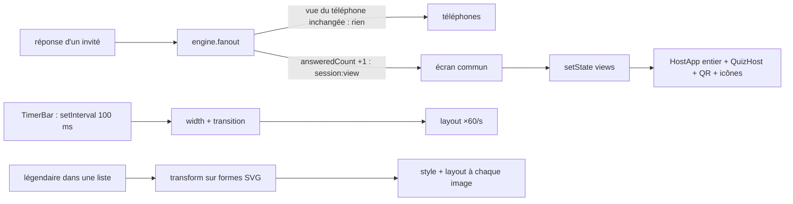

# La fluidité des écrans pendant une soirée — rapport de l'expert performance du rendu

## En bref

Une soirée « ordinaire » (invités anonymes) reste fluide partout : 60 images
par seconde sur l'écran commun ralenti ×2 comme sur un téléphone ralenti ×6,
aucune longue tâche en cours de question, et **aucune fuite** : sur trente
questions d'affilée, le tas JavaScript et le DOM restent plats (3,3 → 3,6 Mo
au téléphone, nœuds stables). Le téléphone ne redessine que son chronomètre.
Trois choses coûtent pourtant plus qu'elles ne devraient :

1. **Les médaillons légendaires animés** : leurs animations CSS portent sur des
   éléments SVG, qui ne passent pas par le compositeur. Chaque image refait
   style **et mise en page**. Une salle d'habitués (un sur trois en légendaire)
   occupe 190 à 630 ms/s du fil principal de l'écran commun en salle
   d'attente, 640 ms/s au podium, 910 ms/s à la clôture (le 5ᵉ centile
   tombe à 40 i/s). Les figer dans les listes rend 85 % de ce temps.
2. **Le chronomètre** anime `width` : réécrite tous les dixièmes de seconde,
   avec une `transition` qui ne s'arrête jamais. Cela fait 60 mises en page par
   seconde pendant toute la question, soit 5 fois le coût de l'écran de
   révélation. Posée en `transform: scaleX` par une seule animation CSS, la
   barre coûte 80 % de moins (122 → 24 ms/s sur l'écran commun, 196 → 49 au
   téléphone).
3. **L'écran commun se redessine en entier à chaque réponse d'invité** :
   `HostApp`, `QuizHost`, le QR et toutes les icônes. On compte 23 messages/s
   à 140 invités, et le coût croît avec la salle, jusqu'au plafond de 500.
   Regrouper le compteur « 12 / 50 ont répondu » côté serveur (quatre
   envois par seconde au plus) suffit.

## Méthode

- **Un serveur jetable par passe** (`createQuizServer`, bases dans
  `export/evaluations/perf-rendu/<passe>/`) et le client de `main` construit
  sur place. Un animateur scripté (socket) lance un quiz de **30 questions
  courtes** (7 à 8 s) : 20 QCM (dont des énoncés longs et des Vrai/Faux), 6
  estimations, 4 photos WebP 1280 px (≈ 146 Ko, dont 2 avec temps
  d'observation). L'enchaînement automatique est réglé à 5 s ; la soirée va
  jusqu'au podium du quiz, repasse en salle d'attente, puis se clôt.
- **Les invités** : 30 fantômes au hasard, en salle anonyme ou en salle
  décorée. Pour la salle décorée, ce sont des profils de niveau 10 à 49, un
  tiers en légendaire, un quart avec l'Éclat : on force les dérivations de
  `ProfileStore` sur ce serveur jetable, plutôt que de jouer cent soirées.
  S'y ajoute une passe à **140 invités**, avec le client non minifié pour
  nommer les composants.
- **Trois navigateurs mesurés** (Chromium sans tête, Playwright + CDP) :
  - l'écran commun (`/host`) en 1366 × 768, processeur ×2 ;
  - deux téléphones 360 × 640 (DPR 2, tactile), processeur ×4 et ×6, entrés
    par leur jeton ; ils répondent à chaque question comme un doigt, entre
    1 et 3 s.
- **Chaque seconde**, sur chaque page : les métriques CDP (`Performance.getMetrics`) :
  temps de tâche, de script, de style et de mise en page, nombre de nœuds,
  tas. S'y ajoute une sonde posée avant le premier script (`sonde.js`), qui
  compte :
  - les rendus React, par un faux `__REACT_DEVTOOLS_GLOBAL_HOOK__`
    (`onCommitFiberRoot`), et les composants rendus sur le client non
    minifié ;
  - les images, par `requestAnimationFrame`, avec la pire image ;
  - les longues tâches, les LoAF et le CLS, avec les nœuds sources ;
  - les messages socket, par événement.

  Un ramassage forcé toutes les cinq questions donne une mesure propre de la
  mémoire.
- **Deux A/B sur page réelle** (`ab-chrono.ts`) : pendant une même question,
  ou une même salle d'attente, on ne change que la feuille de style, 8 à 10 s
  par variante, en deux tours.
- **Des vérifications à l'œil** : le décalage à la révélation, en 1366 × 768 ;
  la photo en « bon 3G » (1,6 Mb/s, 150 ms), au téléphone 360 × 640.
- **Environ 1 h 30** de mesures, sur une machine à 4 cœurs et à moi seul :
  la charge est venue de mes seuls scripts (`uptime` ≈ 2 à 3).

**Scripts** : `retours/2026-09-24/experts/scripts/perf-rendu/`
- `soiree.ts` : la soirée mesurée. `cd server && RUN=… SALLE=anonyme|decoree
  FANTOMES=30 npx tsx ../retours/2026-09-24/experts/scripts/perf-rendu/soiree.ts`.
- `sonde.js` : la sonde.
- `analyse.mjs` : les tableaux ci-dessous.
- `ab-chrono.ts` : l'A/B (`MODE=deco` pour les légendaires).
- `graphique.mjs` : le graphique.

**Passes jouées** :
- `anonyme-1` : 30 questions, 30 fantômes anonymes ;
- `decoree-1` : 30 questions, 30 profils décorés ;
- `attrib-140` : 10 questions, 140 fantômes, client non minifié ;
- `ab-chrono` : deux tours ;
- `ab-deco` : deux fois deux tours.

## Constats

### 1. Les légendaires animés font refaire la mise en page à chaque image
- **Où** : `client/src/components/Legendaire.tsx` : 12 médaillons, ~140
  formes SVG, des groupes `lg-*` animés. Les animations sont dans
  `client/src/styles.css:3217-3345` (`lg-reflet`, `lg-pouls`, `lg-flamme`,
  `lg-yeux`, `lg-cercle-tourne`…), celles des Divins dans `styles.css:3368-3491`.
  Elles s'affichent partout où passe `Avatar` : salle d'attente (deux listes),
  classement, podium, clôture, et le classement du téléphone.
- **Constat** : ce sont des animations `transform`/`opacity` sur des
  éléments **à l'intérieur d'un SVG**, et Chromium ne les compose pas. À
  chaque image, il refait style **et mise en page**. Tout le reste des
  finitions (halos Holo/Prisme/Aurore qui tournent, paillettes de l'Éclat)
  coûte peu.
- **Preuve** :
  - La passe `decoree-1` (moyennes par seconde) :

    | moment | écran commun ×2, anonyme | écran commun ×2, habitués | téléphone ×6, anonyme | téléphone ×6, habitués |
    |---|--:|--:|--:|--:|
    | salle d'attente | 21 ms/s · 0 layout/s | **627 ms/s · 55 layouts/s**, 17 % des secondes < 50 i/s | 41 ms/s | 353 ms/s |
    | révélation | 31 ms/s | 184 ms/s | 47 ms/s | 49 ms/s |
    | podium du quiz | 18 ms/s | **641 ms/s**, pire image 67 ms | 39 ms/s | 318 ms/s |
    | retour en salle | 20 ms/s | 626 ms/s, longue tâche de 271 ms à l'entrée | 39 ms/s | 411 ms/s |
    | clôture | 18 ms/s | **909 ms/s, i/s p5 = 40**, pire image 167 ms | 46 ms/s | 32 ms/s |

    À la révélation, le téléphone ne montre pas d'avatars. L'écran commun, à
    la clôture, compte 3 527 nœuds.
  - L'A/B (`ab-deco`, salle d'attente, 62 avatars à l'écran dont 24 légendaires, 225 à 271 animations) :

    | variante | écran ×2 : layouts/s · occupé ms/s | téléphone ×6 : layouts/s · occupé ms/s |
    |---|--:|--:|
    | tel quel | 14 · 188 | 13 · 149 |
    | **légendaires figés** (`.lg * { animation: none }`) | **0 · 27** | **0 · 17** |
    | halos figés | 14 · 155 | 11 · 125 |
    | Éclat sans filtre ni paillettes | 15 · 180 | 12 · 133 |
    | `contain: strict` sur le médaillon | 16 · 210 | 12 · 140 |
    | `will-change: transform` sur le SVG | 15 · 206 | 14 · 158 |
    | rien d'animé | 0 · 0,3 | 0 · 0,4 |

    Le confinement et le calque n'y font rien. Seul le gel des animations
    internes fait tomber les mises en page. Par ailleurs, les avatars hors
    de vue des listes qui défilent (31 invités, 10 visibles par colonne)
    s'animent quand même.
  - Capture : `retours/2026-09-24/experts/captures/perf-rendu-2-salle-habitues.png`.
  - Graphique : `retours/2026-09-24/experts/captures/perf-rendu-1-ab-fil-principal.png`.
- **Qui ça touche, ce que ça coûte** : l'écran commun d'une bande
  d'habitués (le premier légendaire tombe vers la vingtième soirée, voir
  `RECOMPENSES.md`) : précisément aux moments de fête (podium, clôture), où
  les animations d'entrée se joueront à 40 i/s sur un portable modeste. Au
  téléphone, c'est la batterie de toute la salle entre deux quiz. Le
  problème grandit avec la fidélité : plus la bande joue, plus il y a de
  légendaires.
- **Statut** : défaut confirmé (mesuré, rejoué deux fois, isolé par A/B).
  C'est une tension légère avec le parti pris « ça tient à l'échelle d'un
  vidéoprojecteur » d'`Avatar.tsx` : la promesse visuelle tient, pas son coût.
- **Piste**, du plus simple au plus fin :
  1. **Ne les animer que là où le médaillon est le sujet** : podium du quiz
     (trois marches), clôture, carte du joueur, page du profil. Dans les
     listes, ils sont figés sur leur pose de repos :
     ```css
     /* Dans une liste, le légendaire se tient tranquille : animé, chacun
        refaisait la mise en page de tout l'écran à chaque image. */
     .lb-avatar .lg *, .lb-avatar .dv *, .team-member .lg *, .team-member .dv * { animation: none; }
     ```
     (les sélecteurs sont à ajuster aux classes des listes de la salle
     d'attente : `TeamGroup`, `Leaderboard`, `Standings`).
  2. **Suspendre ce qui est hors de vue** : un `IntersectionObserver` dans
     `Legendaire`/`Divin` qui pose `animation-play-state: paused` hors écran.
  3. **À terme** : animer le médaillon entier (un conteneur HTML composé),
     plutôt que ses formes internes ; ou limiter chaque médaillon à une
     animation.
- **Priorité · effort** : **P1** pour une salle d'habitués (la clôture à
  40 i/s sur l'écran de toute la salle), P2 aujourd'hui. **S** pour la piste 1.

### 2. Le chronomètre fait une mise en page à chaque image, pendant toute la question
- **Où** : `client/src/components/TimerBar.tsx:32` (`setInterval` à 100 ms) et
  `:59` (`style={{ width }}`) ; `client/src/styles.css:1150-1154`
  (`.timer-fill { transition: width 0.12s linear }`). Même cadence de 10 Hz
  dans `GetReady.tsx:18`, et 5 Hz dans `AutoNextPill` (`games/quiz/HostView.tsx:26`).
- **Constat** : une largeur neuve arrive tous les 100 ms et la transition
  dure 120 ms. La barre est donc **toujours** en transition de `width`,
  propriété de mise en page : 60 layouts/s et 60 recalculs de style/s, du
  début à la fin de chaque question, sur chaque téléphone et sur la télé.
  De plus, React rend `TimerBar` 10 fois par seconde, alors que le chiffre ne
  change qu'une fois par seconde. Les rendus restent bien confinés au
  composant : au téléphone, `TimerBar` est le seul composant rendu en
  question (`attrib-140`).
- **Preuve** :
  - Passe `anonyme-1`, en question QCM : écran ×2 à 146 ms/s, 56
    layouts/s, 25 ms/s de mise en page ; téléphone ×6 à 245 ms/s, 51
    layouts/s. En révélation, sans chrono : 31 et 47 ms/s.
  - L'A/B (`ab-chrono`, même question de 120 s, deux tours, moyennes) :

    | variante | écran ×2 : layouts/s · occupé ms/s | téléphone ×6 : layouts/s · occupé ms/s |
    |---|--:|--:|
    | A. tel quel | 60 · 122 | 60 · 196 |
    | B. `transition: none` | 10 · 38 | 10 · 62 |
    | C. chrono masqué (plancher) | 0 · 11 | 0 · 27 |
    | **D. barre en `transform: scaleX`, une animation CSS** | **1 · 24** | **1 · 49** |

    Au téléphone, en C, il reste ~17 ms/s de script : c'est `TimerBar`
    qui tourne encore à 10 Hz sous le masque.
- **Qui ça touche, ce que ça coûte** : chaque invité, à chaque question. Sur
  un vrai téléphone d'entrée de gamme, c'est de la batterie et de la chaleur
  sur toute une soirée, et la marge qui manquera le jour où un toast, la
  vibration ou une notification tombe pendant la question. Rien de visible
  aujourd'hui : 60 i/s tenus, aucune longue tâche.
- **Statut** : friction mesurée ; pas de saccade observée.
- **Piste** : une barre qui ne change jamais de largeur, et un chiffre qui
  ne se rend qu'à chaque seconde.
  ```tsx
  // TimerBar : la barre se vide seule, animée par le compositeur ; React ne
  // se réveille qu'à chaque seconde pleine, pour le chiffre.
  const reste = paused ? frozenMs : Math.max(0, deadline - serverNow())
  <div
    key={`${deadline}:${paused}`}           // repart à chaque échéance ou reprise
    className="timer-fill"
    style={{
      transform: `scaleX(${reste / (duration * 1000)})`,
      animation: paused ? 'none' : `timer-vide ${reste}ms linear forwards`,
    }}
  />
  // et un setTimeout calé sur la prochaine seconde pleine (reste % 1000) au lieu de setInterval(100)
  ```
  ```css
  .timer-fill { width: 100%; transform-origin: left; }   /* plus de transition: width */
  @keyframes timer-vide { to { transform: scaleX(0); } }
  ```
  L'échéance reste lue à `serverNow()` (invariant 6) : seule la manière de
  dessiner change. Même traitement pour `GetReady` (un réveil par seconde)
  et `AutoNextPill`. Un test : rendre `TimerBar` avec une horloge factice, et
  vérifier qu'il ne se rend pas plus d'une fois par seconde.
- **Priorité · effort** : P2 · **S**.

### 3. L'écran commun se redessine en entier à chaque réponse d'invité
- **Où** : `server/src/core/engine.ts:431-435` : chaque réponse change
  `answeredCount`, et donc la vue de l'écran commun, qui repart aussitôt.
  Côté client, `client/src/socket.ts:53` range la vue dans le magasin
  global, et `HostApp` (`views/HostApp.tsx:228`, `useAppState()`) se rend
  en entier. Le seul nombre qui a changé s'affiche à la ligne 527
  (« 12 / 50 ont répondu »).
- **Constat** : à 140 invités, pendant une question, l'écran commun reçoit
  **23 messages/s**. Chaque message rend `HostApp`, `QuizHost`,
  `ConsoleActions`, le `QRCodeSVG` du bandeau, les `Shape`, et environ 8
  `Icon` : 25 rendus complets par seconde et 205 icônes/s. Le script passe
  de 18 ms/s (30 invités) à **45 ms/s** (140 invités) sur l'écran ×2 ; il
  suit le nombre d'invités. Au plafond (`MAX_PLAYERS_CEILING = 500`), on
  peut attendre de l'ordre de 80 messages/s et 150 ms/s de script, à
  confirmer par une mesure. Le téléphone, lui, n'est pas touché : il reçoit
  0,3 message/s en question.
- **Preuve** : passe `attrib-140` (client non minifié), en question QCM :
  « Icon 205,8 · Shape 89,3 · TimerBar 35,2 · HostApp 25,3 · QRCodeSVG 25,3 ·
  QuizHost 25,3 · ConsoleActions 25,3 rendus/s » ; 22,9 msg/s, 1,4 rendu par
  message. Passe `anonyme-1` (30 invités) : 1 007 `session:view` reçus par
  l'écran commun en 30 questions, 475 Ko.
- **Qui ça touche, ce que ça coûte** : les grandes salles (mariages,
  séminaires), justement celles que le plafond de 500 invite. Le coût tombe
  dans les cinq premières secondes de chaque question, là où la salle
  répond le plus.
- **Statut** : friction mesurée ; 60 i/s tenus à 140 invités.
- **Piste** : **côté serveur**, regrouper l'envoi de la vue de l'écran
  commun pendant la phase `question` : au plus un envoi toutes les 250 ms,
  le dernier état gagnant. Les vues des téléphones ne changent pas, et un
  changement de phase part tout de suite. C'est la même idée que
  l'instantané regroupé de `space.ts` (invariant 4). Côté client, en
  complément : `memo` sur `QuizHost`, et sortir le compteur dans un petit
  composant abonné à `answeredCount`. Un test dans `server/test/` : 50
  réponses en 1 s font au plus 5 `session:view` à l'écran commun.
- **Priorité · effort** : P2 · S à M.

### 4. Les listes de la salle d'attente se rendent en entier à chaque instantané
- **Où** : `HostApp` → `TeamGroup` + `Leaderboard` → `Avatar`, `Niveau`,
  `Rank`, `Score` : aucun n'est mémoïsé.
- **Constat** : le retour en salle d'attente après un quiz, avec 140
  invités, fait un rendu de 568 `Avatar`, 568 `Niveau` et 310 `Icon`, et
  une **longue tâche de 151 ms** à l'entrée sur l'écran ×2 (pire image
  133 ms). À chaque instantané (une arrivée, un changement d'équipe), les
  deux listes entières se redessinent : en salle d'attente, 47 `Avatar`/s
  en médiane pendant les arrivées.
- **Preuve** : `attrib-140`, « première seconde de chaque moment », et le
  tableau de l'écran commun (retour en salle : 166 ms occupés, longues
  tâches 151 ms).
- **Qui ça touche** : l'écran commun d'une grande salle, pendant l'arrivée
  des invités et au retour d'un quiz. Il n'y a pas de saccade visible à
  140 invités.
- **Statut** : friction (idée d'amélioration).
- **Piste** : `memo` sur la ligne de liste (le joueur en props, comparé par
  identité, si l'instantané garde les objets inchangés) ; ou
  `content-visibility: auto` sur les lignes des listes qui défilent, ce
  qui soulagerait aussi le constat 1.
- **Priorité · effort** : P3 · S.

### 5. La photo n'est demandée qu'à l'ouverture de la question
- **Où** : `games/quiz/PlayerView.tsx:255` : la photo n'est pas
  préchargée pendant `getReady` ou `observe`.
- **Constat** : en « bon 3G », un cadre vide reste ~0,7 s en haut d'une
  question de 7 s, pour une photo de 177 Ko. **Rien ne bouge** : la place
  est réservée (`min-height`, `styles.css:1219`), et la grille des
  réponses reste à 350 px, avant comme après le chargement. C'est bien fait.
- **Preuve** : chargement mesuré toutes les 300 ms, grille à 350 px de 0 à
  3,5 s. Captures locales dans `export/evaluations/perf-rendu/photo/`
  (`avant.png`, `apres.png`).
- **Statut** : idée. Précharger plus tôt, c'est envoyer la photo au
  téléphone avant la question : **tension avec l'invariant 1**, tant que la
  photo fait partie de l'énoncé. Seule exception sans risque : pendant
  `observe`, la photo est déjà affichée à toute la salle, le téléphone peut
  la précharger.
- **Priorité · effort** : P3 · S.

## Mesures et cartes

**Passe `anonyme-1`** : 30 questions, 30 fantômes. Médianes par seconde. La
colonne « occupé » est le temps de tâche du fil principal (1 000 = saturé).

| Moment | écran ×2 : occupé ms/s · layouts/s · rendus/s | téléphone ×4 | téléphone ×6 |
|---|--:|--:|--:|
| salle d'attente | 21 · 0 · 0 | 29 · 0 · 0 | 41 · 0 · 0 |
| 3-2-1 | 39 · 1 · 10 | 75 · 1 · 10 | 90 · 1 · 10 |
| observation de la photo | 116 · 51 · 10 | 195 · 51 · 10 | 255 · 51 · 10 |
| question QCM | 146 · 56 · 16 | 171 · 51 · 10 | 240 · 51 · 10 |
| question à photo | 149 · 55 · 16 | 183 · 51 · 10 | 231 · 51 · 10 |
| estimation | 119 · 51 · 11 | 178 · 51 · 10 | 245 · 51 · 10 |
| révélation QCM | 31 · 1 · 5 | 37 · 0 · 0 | 47 · 0 · 0 |
| révélation estimation | 27 · 1 · 5 | 34 · 0 · 0 | 43 · 0 · 0 |
| podium du quiz | 18 · 0 · 0 | 32 · 0 · 0 | 39 · 0 · 0 |
| clôture | 18 · 0 · 0 | 32 · 0 · 0 | 46 · 0 · 0 |

- **Images** : 60 i/s de médiane partout. Le pire 5ᵉ centile est à 55 i/s
  (l'observation), sans aucune seconde sous 50 i/s.
- **Longues tâches** : une seule, de 68 ms, à l'entrée de l'observation
  (décodage et pose de la photo) sur l'écran ×2.
- **Entrée dans un moment**, la seconde où l'écran change, sur le téléphone ×6 :
  189 ms à l'ouverture d'une question (pire : 318), 208 ms à la révélation.
- **Rendus par message** au téléphone : 3 à 4 hors question ; en question,
  le chrono domine (10 rendus/s pour 0,3 message/s).
- **Messages** : un téléphone reçoit 86 `session:view` (37 Ko) et 39
  instantanés (185 Ko) pour toute la soirée.

**Passe `decoree-1`** : voir le constat 1. **Passe `attrib-140`** : voir les
constats 3 et 4.

**Mémoire** (après ramassage forcé, tas JS en Mo · nœuds DOM) : **pas de fuite**.

| point | écran ×2, anonyme | téléphone ×6, anonyme | écran ×2, habitués | téléphone ×6, habitués |
|---|--:|--:|--:|--:|
| salle d'attente | 2,79 · 1 109 | 2,13 · 230 | 4,03 · 3 293 | 2,53 · 337 |
| Q5 | 3,15 · 277 | 3,29 · 123 | 3,28 · 381 | 3,45 · 105 |
| Q15 | 3,27 · 295 | 3,48 · 133 | 3,49 · 313 | 3,60 · 115 |
| Q30 | 3,31 · 298 | 3,58 · 133 | 3,55 · 383 | 3,64 · 115 |
| podium | 3,35 · 650 | 3,55 · 182 | 4,09 · 1 742 | 3,63 · 236 |
| clôture | 3,39 · 795 | 3,50 · 161 | 4,15 · 3 527 | 3,58 · 143 |

Le tas monte de 0,1 à 0,3 Mo entre Q5 et Q30, puis se stabilise (cache
des vues et de l'instantané). Les écouteurs restent constants (302 à
l'écran, 171 à 175 au téléphone). La passe à 140 invités tient aussi :
3,5 Mo au téléphone après dix questions.

**Décalages (CLS)** : les chiffres bruts sont élevés (révélation QCM :
2,26 cumulés sur 30 révélations, à l'écran commun). Les sources,
`.ans-text`, `.quiz-enonce` et `.band-answered`, sont **des changements de
contenu d'une question à la suivante**, pas des sauts. Vérifié à l'œil en
1366 × 768 : l'énoncé (127 px) et la grille (262 px) ont la même position
en question et en révélation, la bande d'état prend la place du chrono à
hauteur égale. Au téléphone, le CLS de clôture (0,53) est le passage à
l'écran de fin. Rien à corriger.



## Ce qui marche — à ne pas casser

- **La mémoire est tenue** : 30 questions, une clôture, et rien ne s'accumule,
  ni tas, ni nœuds, ni écouteurs.
- **Le téléphone ne rend que ce qui change** : en question, `TimerBar` est
  le seul composant rendu, les autres messages de la salle ne lui arrivent
  pas (dédoublonnage serveur `changed()`, `engine.ts:455`), et 3 à 4 rendus
  par message hors question.
- **Les animations d'entrée** (`slide-in`, `pop`, `land`, `rise`,
  `grow-bar`) sont en `transform`/`opacity` : composées, gratuites.
- **La mise en page ne saute pas** : la bande d'état remplace le chrono à
  hauteur égale à la révélation, la place de la photo est réservée au
  téléphone, et la réponse enregistrée se pose hors du flux (`styles.css:1221`).
- **`prefers-reduced-motion`** coupe déjà les légendaires et les Divins
  (`styles.css:3348`, `3520`). C'est la preuve que le gel est acceptable
  visuellement.
- **Les photos** : 1 280 px en WebP 0,82 (≈ 146 Ko), servies en cache
  immuable. Une seule longue tâche mesurée (68 ms) à leur apparition, sur
  l'écran ×2.

## Recommandations, dans l'ordre

1. **Figer les légendaires et les Divins dans les listes**, et ne les animer
   qu'au podium, à la clôture, sur la carte et le profil. Écran commun d'une
   salle d'habitués : 188 → 27 ms/s en salle d'attente ; podium et clôture
   de 640 à 910 ms/s ramenés vers la centaine. **P1 · S**.
2. **Chronomètre en `transform: scaleX` par une animation CSS**, et un
   réveil React par seconde : −80 % de fil principal pendant chaque
   question, sur chaque téléphone et sur la télé. Le même traitement pour
   `GetReady` et `AutoNextPill`. **P2 · S**.
3. **Regrouper côté serveur la vue de l'écran commun pendant une question**
   (au plus quatre envois par seconde), avec son test dans `server/test/` ;
   ajouter `memo` sur `QuizHost` et isoler le compteur. **P2 · S-M**.
4. **Suspendre les animations hors de vue** (`IntersectionObserver`, ou
   `content-visibility: auto` sur les lignes) et mémoïser les lignes des
   listes de la salle d'attente. **P3 · S**.
5. **Précharger la photo au téléphone pendant l'observation**, seulement
   quand la question a un temps d'observation (invariant 1). **P3 · S**.

## Limites

- **Chromium sans tête** : le compteur d'images mesure le fil principal,
  pas la rastérisation ni le GPU. Un vrai portable Windows 10 branché à la
  télé, et surtout un Android d'entrée de gamme (Mali, 2 Go), peuvent
  saturer plus tôt, en particulier sur les `filter: blur` des halos, que le
  compositeur logiciel paie. Le ralentissement ×4-×6 n'est qu'une
  approximation du processeur, pas du GPU ni du décodage.
- **Safari (iPhone) non mesuré** : WebKit compose mieux certaines
  animations SVG. Le constat 1 y est peut-être plus doux, à vérifier sur
  un appareil.
- **La salle décorée force les dérivations** (`ProfileStore.niveauOf`,
  `legendairePorte`, `eclatsOf`) : les proportions (un tiers de légendaires)
  sont un scénario de bande très fidèle, pas une observation.
- **L'écran commun en 1920 × 1080** n'a pas été mesuré en passe complète.
  Le coût des légendaires y suit le nombre de médaillons visibles, donc
  plutôt plus.
- **500 invités** : extrapolé depuis 140 (contrainte : plafond par défaut de
  150 par espace).
- **Pas mesurés** : le son (`sound.ts`) et l'éditeur.
