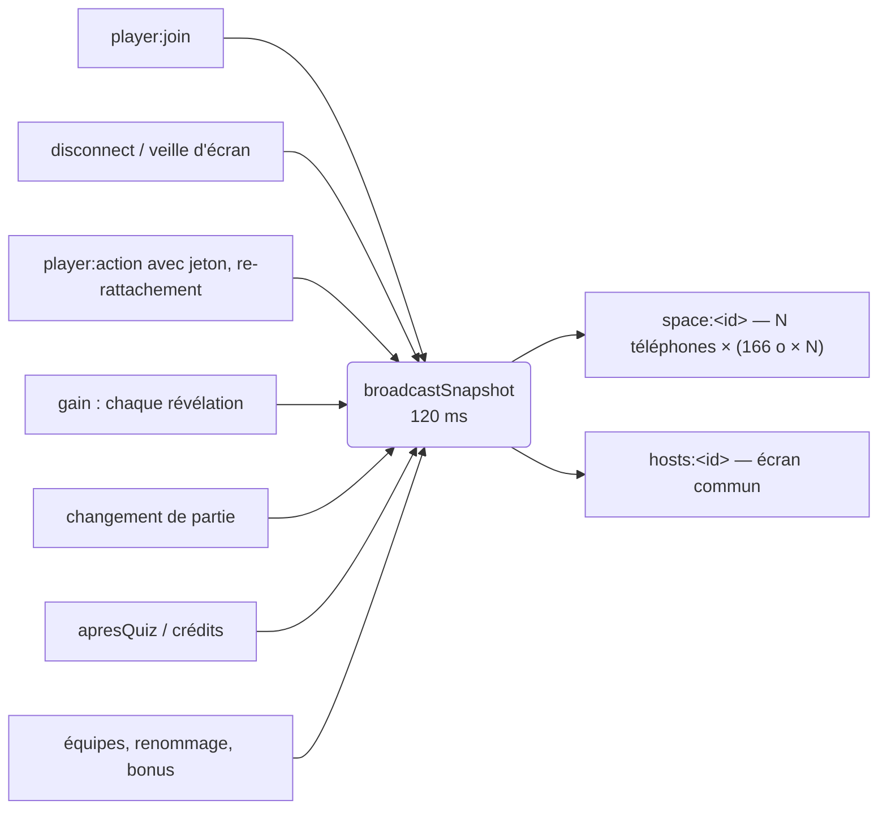

# Où le serveur dépense son temps — rapport de l'expert performance serveur

## En bref

Le moteur de jeu tient bien jusqu'à 150 invités, et sa logique est saine :
dédoublonnage des vues, mémo de diffusion, miroir isolé du jeu. Les accusés
de réponse et la révélation ne bougent pas quand Turso répond en 400 ms.
Mais trois coûts grandissent plus vite que la salle, et ce sont eux qui
décident de ce que tient l'offre gratuite de Render (un dixième de
processeur, 512 Mo) :

1. **L'instantané de la soirée renvoie toute la liste des invités à toute
   la salle à chaque arrivée, départ ou gain.** C'est donc N² octets par
   événement, et N³ sur une vague d'arrivées : **1,04 Go** émis pour 300
   invités arrivés un par un, 40 Mo à chaque révélation à 500.
2. **Le souvenir et le bilan se recalculent à chaque requête**, et d'une
   seule traite, sur la boucle d'événements : 160 ms de processeur par scan
   du QR du souvenir d'une soirée de 300 invités. 50 scans simultanés
   bloquent la boucle 2,5 à 5 s ici, et donc de l'ordre de la minute sur
   Render, pour tous les espaces à la fois.
3. **Chaque réponse d'invité recalcule et resérialise la vue des N
   téléphones, et réécrit tout l'état de la partie en SQLite** (86 Ko à 500
   invités). Une question complète à 500 invités coûte 0,9 à 1 s de
   processeur ici, soit ~10 s sur Render.

Les trois corrections les plus rentables : un instantané sans `connected`
pour les téléphones et un regroupement proportionnel à la salle (S) ; un
cache des pages publiques invalidé par les journaux (S à M) ; une diffusion
limitée à l'auteur et à l'écran commun quand ni la phase ni les
chronomètres n'ont bougé (S). Viennent ensuite le recalcul au barème du
jour (3 094 requêtes distantes en série, 68 s de démarrage pour 101
soirées) et la clôture (~8 allers-retours Turso en série par profil).

## Méthode

Tout s'est passé seul, sur mon conteneur (4 cœurs, 16 Go, charge entre 0,1
et 0,7 pendant les mesures), sans tablée ni atelier. J'ai lu les chemins
chauds (`core/engine.ts`, `core/space.ts`, `games/quiz.ts`, `core/party.ts`,
`core/scores.ts`, `core/answers.ts`, `core/backup.ts`, `core/recalcul.ts`,
`core/archive.ts`, `server.ts`, `sockets.ts`) et le côté client qui les
appelle (`PlayerApp`, `Entree`, `RecapApp`, `HostApp`, `FinDeSoiree`).

J'ai écrit cinq scripts, dans `retours/2026-09-24/experts/scripts/perf-serveur/` :

| Script | Ce qu'il mesure |
|---|---|
| `diffusion.ts` | le vrai `GameEngine` + `quizModule` + `Party` sur une vraie base, avec un faux `io` qui compte messages et octets ; 12 questions, N réponses chacune ; le temps de `persist()` et de `changed()` |
| `salle.mjs` | un vrai serveur en processus enfant (`node --import tsx src/index.ts`, la commande de Render), et N téléphones socket.io ; processeur et mémoire du serveur lus dans `/proc`, instantanés et vues comptés côté téléphones ; `--un-par-un` pour les arrivées espacées de 150 ms, `--churn k` pour des coupures |
| `derivations.ts` | `buildRecap`, `buildReview`, le rangement après un quiz (`buildArchive` + sha1 + `buildProgress`) et les dérivations de clôture, sur des journaux synthétiques de 30 à 500 invités et de 40 à 80 questions |
| `historique.ts` | le démarrage selon la taille de l'historique, le recalcul au barème du jour forcé, et 1 puis 50 scans simultanés du souvenir archivé ; latence de Turso simulée en patchant `Sqlite3Client.prototype` |
| `miroir-lent.ts` | un vrai serveur (`banc.ts`), 30 invités dont 12 profils, un quiz de 10 questions, une clôture, pour une latence distante de 0, 100 et 400 ms |

Chaque mesure a été lancée deux fois au moins ; les résultats bruts sont
dans `export/evaluations/perf-serveur/` (non versionné). **Les temps sont
ceux de ma machine.** Pour l'instance gratuite de Render, je les multiplie
par ~10 : c'est l'hypothèse du README (« un dixième de processeur »), pas
une mesure. Les octets et les nombres de messages ou de requêtes, eux, ne
dépendent pas de la machine.

Ce que je n'ai pas couvert : un vrai Turso (la latence est simulée), le
coût réseau réel du websocket (les écritures `ws` ne sont pas séparées du
reste du processeur), et plusieurs espaces simultanés (c'est la mission de
`perf-temps-reel`).

## Constats

### 1. L'instantané de la soirée : N² octets par événement, N³ par vague d'arrivées
- **Où** : `core/space.ts:757` (`sendSnapshot`), `:767` (`broadcastSnapshot`,
  regroupé à 120 ms). Il est déclenché par chaque `player:join`
  (`sockets.ts:359`), chaque coupure (`sockets.ts:636`), chaque gain
  (`onScoresChanged`) et chaque rangement.
- **Constat** : l'instantané porte la liste complète des invités, ~166 o
  par invité : 8 Ko à 50, 33 Ko à 200, 83 Ko à 500. Il part en entier à
  toute la salle (`space:<id>`) dès que quoi que ce soit change, y compris
  le seul drapeau `connected` d'un téléphone qui se met en veille. Le
  dédoublonnage (invariant 4) ne sert à rien ici, puisque le contenu a
  vraiment changé. Quand les invités arrivent plus lentement que le
  regroupement de 120 ms (le cas normal : on scanne un QR l'un après
  l'autre), chaque arrivée fait sa propre diffusion. Le total fait donc
  Σk² × 166 o ≈ N³/18 octets.
- **Preuve** (`salle.mjs`, octets reçus par l'ensemble des téléphones) :

  | Scénario | 50 | 150 | 200 | 300 | 500 |
  |---|---|---|---|---|---|
  | Arrivées par lots de 20 | 0,6 Mo | — | 14–17 Mo | — | 213–284 Mo |
  | Arrivées **une par une** (150 ms) | — | **133 Mo** (11 475 messages) | — | **1 043 Mo** (45 450 messages) | ≈ 7 Go (extrapolé) |
  | Chaque révélation | 0,39 Mo | — | 6,1 Mo | — | **38 Mo** |
  | 20 % des téléphones coupés puis revenus | 0,59 Mo | — | 9,2 Mo | — | 57 Mo |

  Processeur du serveur pour la vague de 300 arrivées une par une : 2,9 s
  ici, ~30 s sur Render.
- **Qui ça touche, ce que ça coûte** : toute la salle. Le premier arrivé
  d'une salle de 300 télécharge ~7 Mo en 4G pendant la vague. Côté
  serveur, c'est le premier poste de processeur à l'arrivée, et le trafic
  sortant de l'instance croît en N³. C'est lui, plus que le calcul des
  vues, qui justifie le plafond de 150 du README.
- **Statut** : confirmé (mesuré). Pas un bug : un coût de conception.
- **Piste**, par ordre de rentabilité :
  1. *Un instantané de téléphone sans `connected`.* Les téléphones ne
     l'utilisent que pour un compte (`Entree.tsx:116`). On leur envoie
     `connectes: number` à la place, et on dédoublonne les deux versions
     séparément : la mise en veille d'un téléphone ne repart plus qu'à
     l'écran commun.
     ```ts
     // space.ts — sendSnapshot
     const pourTel = { ...snapshot, players: snapshot.players.map(({ connected, ...p }) => p),
                       connectes: snapshot.players.filter(p => p.connected).length }
     const jsonTel = JSON.stringify(pourTel)
     if (force || jsonTel !== this.dernierTel) { this.dernierTel = jsonTel; io.to(space).except(hosts).emit('party:snapshot', pourTel) }
     const jsonEcran = JSON.stringify(ecran)          // idem pour hosts:
     ```
     Gain : les coupures ne coûtent plus rien aux téléphones (57 Mo → 0 à
     500). Le `connectes` bouge encore, mais il pourrait partir dans un
     petit message à part.
  2. *Un regroupement proportionnel à la salle* :
     `setTimeout(…, 120 + 2 * party.count())` (1,1 s à 500). La vague
     d'arrivées tombe de N diffusions à durée/délai. À 300, on passe d'un
     peu plus de 1 Go à ~60 Mo. Risque faible : l'écran commun garde sa
     réactivité, puisque la réponse au `player:join` porte déjà
     l'identité.
  3. *Plus tard (M)* : des diffs d'instantané (`party:players` avec les
     seules lignes changées), ou une liste tronquée pour les téléphones
     (les 8 premiers + soi-même, ce que montre `Leaderboard compact`).
     Cette dernière piste heurte `Entree` (recherche d'homonymes sur la
     liste), à arbitrer.
- **Priorité · effort** : P1 au-delà de 150 invités · S pour 1 et 2.

### 2. Les pages publiques se recalculent à chaque requête, et le QR les fait demander par toute la salle à la fois
- **Où** : `server.ts:401-465` → `liveRecap()` / `liveReview()`
  (`space.ts:804`, `:820`), et `archives.get` + `recapOfArchive` pour une
  soirée close. Côté client, le souvenir se rafraîchit toutes les 20 s
  (`RecapApp.tsx:56`). L'écran commun projette un QR vers `/souvenir`
  (`HostApp.tsx:665`), un autre à la clôture (`Cloture.tsx`), et le
  téléphone propose « Revoir la soirée » (`FinDeSoiree.tsx:177`).
- **Constat** : chaque requête relit tout le journal en base locale, ou
  désérialise toute l'archive (4,7 Mo de JSON à 300 invités × 40
  questions), et rejoue les dérivations d'une traite, sur le fil unique
  de Node. Rien n'est gardé entre deux requêtes, alors qu'entre deux
  questions rien ne change, et qu'une archive ne change plus du tout.
- **Preuve** (`derivations.ts`, médiane de 5, deux passes concordantes) :

  | Invités × questions | lignes | recap.json | bilan.json (taille brute) | rangement après quiz | clôture |
  |---|---|---|---|---|---|
  | 30 × 40 | 1 200 | 7 ms | 11–16 ms (254 Ko) | 6 ms | 15 ms |
  | 150 × 40 | 6 000 | 35–50 ms | 56 ms (1,1 Mo) | 33 ms | 90 ms |
  | 300 × 40 | 12 000 | 100 ms | 142–157 ms (2,3 Mo) | 117–135 ms | 240–260 ms |
  | 500 × 40 | 20 000 | 290–300 ms | 330–350 ms (3,8 Mo) | 210 ms | 600 ms |

  Sur un vrai serveur (`historique.ts`), le souvenir d'une soirée close de
  300 invités coûte 160 à 290 ms de processeur par requête et bloque la
  boucle 145 à 170 ms. **50 requêtes simultanées : 8,4 s de processeur,
  boucle bloquée 2,5 s puis 5,0 s au pire** (deux passes). Sur Render,
  comptez ~1 min 30 pendant laquelle aucun espace ne reçoit rien.
- **Qui ça touche, ce que ça coûte** : à la clôture d'une grande salle, ou
  dès que le QR du souvenir est à l'écran, tout le serveur se fige, y
  compris les soirées des autres animateurs. Même à 30 invités, 30
  souvenirs ouverts qui se rafraîchissent font 1,5 requête par seconde de
  souvenir. C'est supportable, mais c'est du processeur pour rien.
- **Statut** : confirmé (mesuré). La pureté des dérivations (invariant 14)
  n'est pas en cause : c'est l'absence de cache autour d'elles.
- **Piste** : un cache par espace, invalidé par une empreinte des journaux
  qui ne coûte rien : le nombre de lignes de gains et de réponses, le
  nombre d'invités, et un compteur incrémenté par `rename` / `assign` /
  `remove`. Il garde le JSON déjà sérialisé, voire compressé.
  ```ts
  private pageEnCache = new Map<string, { cle: string; corps: string }>()
  liveRecapJson(): string {
    const cle = `${this.answers.count()}|${this.ledger.count()}|${this.party.version}|${this.teams.version}`
    const c = this.pageEnCache.get('recap')
    if (c?.cle === cle) return c.corps
    const corps = JSON.stringify(this.liveRecap()); this.pageEnCache.set('recap', { cle, corps }); return corps
  }
  ```
  Pour les archives, un petit LRU `(space, id, archived_at)` → JSON de
  recap et de bilan (3 à 5 entrées). La première requête paie, les 49
  suivantes lisent une chaîne. Il faut aussi dédoublonner les requêtes en
  vol : garder la *promesse* dans le cache, sinon 50 requêtes arrivées
  ensemble calculent 50 fois. Invariants : les dérivations restent pures
  et partagées ; seule leur mémoïsation s'ajoute, et une invalidation
  oubliée montrerait une page en retard, jamais fausse d'une autre soirée.
  Test à écrire (`server/test/resultats.test.ts`) : deux GET successifs →
  un seul appel à `buildRecap` (espion), et une réponse après une question
  jouée qui en tient compte.
- **Priorité · effort** : P1 pour les grandes salles, P2 sinon · S (live) +
  S (archives).

### 3. Chaque réponse rediffuse (et resérialise) la vue de chacun des N téléphones, puis réécrit tout l'état
- **Où** : `engine.ts:197` → `run()` → `persist()` (`:463`) + `fanout()`
  (`:422`) → `changed()` (`:455`).
- **Constat** : pendant une question, la vue d'un téléphone ne dépend que
  de sa propre réponse. Pourtant, chaque réponse recalcule les N vues de
  joueur et les sérialise toutes (`JSON.stringify` dans `changed`) pour
  n'en envoyer qu'une ou deux. Le dédoublonnage fait bien son travail
  côté réseau : 2 messages par réponse, mesurés. Mais le coût processeur
  reste en N² par question. `persist()` réécrit à chaque réponse tout
  l'état (`sess.state`, 86 Ko à 500 invités, avec `responses`, `totals`,
  `playFrom`) et une transaction SQLite synchrone : 500 × 86 Ko = 43 Mo
  écrits dans le WAL par question.
- **Preuve** (`diffusion.ts`, moteur seul, 12 questions) :

  | Invités | question complète | pire réponse | `changed()` (appels) | `persist()` | état persisté |
  |---|---|---|---|---|---|
  | 50 | 23 ms | 10 ms | 69 ms (32 k) | 125 ms | 12 Ko |
  | 200 | 160 ms | 9,5 ms | 830 ms (488 k) | 635 ms | 37 Ko |
  | 500 | **0,9–1,0 s** | 24 ms | **5,1 s (3,0 M)** | **3,2 s** | 87 Ko |

  Serveur complet (`salle.mjs`) : 1,0 à 1,06 s de processeur par question
  à 500, 0,25 à 0,4 s à 200, 0,05 à 0,08 s à 50. À 500, `changed()` pèse
  ~45 % du coût et `persist()` ~30 %. Ce sont les chiffres du README
  (310 ms à 500) *plus* la sérialisation et l'écriture qu'il ne mesurait
  pas.
- **Qui ça touche** : sur Render, ~10 s de processeur par question de 20 à
  30 s à 500 invités. C'est la moitié de l'instance, avant les
  instantanés du constat 1, qui s'y ajoutent à chaque révélation.
- **Statut** : confirmé.
- **Piste** :
  1. *Diffuser à l'auteur seul* quand une action de joueur ne change ni la
     phase ni les chronomètres (l'`empreinte()` existe déjà) :
     ```ts
     // run(sess, fn, auteur?)
     if (auteur && empreinte(sess) === avant) this.fanoutPour(sess, [auteur]) // + écran commun
     else this.fanout(sess)
     ```
     Une réponse qui déclenche le « souffle » arme `settle`, change
     l'empreinte, et garde donc la diffusion complète. C'est la règle
     actuelle rendue explicite, puisque le commentaire de `lastSent` dit
     déjà « une vue de joueur ne change que quand il répond lui-même ».
     Gain attendu : question à 500 de ~1 s à ~0,35 s. Risque : un module
     de jeu futur dont la vue de joueur dépend des autres pendant une
     phase. Il faut le documenter dans `GameModule`, ou laisser le module
     le dire (`onPlayerAction` rend `{ portee: 'auteur' }`).
  2. *Persister à la cadence du tick* : pour une action non urgente,
     `queueMicrotask`/`setImmediate` regroupe les réponses arrivées dans
     le même paquet, ou une fenêtre de 250 ms. Le miroir attend déjà 2 s
     (`MIRROR_INTERVAL_MS`), et son commentaire accepte de perdre « deux
     secondes de réponses » ; sur Render le disque s'efface de toute
     façon au redémarrage. Gain : `persist()` divisé par ~20 à 500.
     Invariant 5 (chronomètres persistés) : tout changement d'empreinte
     reste immédiat.
- **Priorité · effort** : P1 à partir de 300 invités, P3 en dessous · S (1),
  S (2).

### 4. Le recalcul au barème du jour : des milliers de requêtes distantes en série, avant l'ouverture du port
- **Où** : `server.ts:271` (avant `listen`, `:558`), `recalcul.ts:88`, qui
  appelle `profiles.creditSoiree` : un `execute` puis un `batch` par
  profil et par soirée.
- **Constat** : au premier démarrage après un `VERSION_BAREME` incrémenté,
  chaque soirée de l'historique est relue, et chaque profil recrédité par
  deux allers-retours à Turso, strictement en série, avant que le serveur
  n'écoute son port.
- **Preuve** (`historique.ts`, latence simulée de 20 ms, deux tailles) :

  | Historique | démarrage ordinaire | démarrage avec recalcul |
  |---|---|---|
  | 31 soirées | 0,9 s (45 requêtes) | **26,5 s (1 204 requêtes)** |
  | 101 soirées | 0,9 s (45 requêtes) | **68,4 s (3 094 requêtes)** |

  C'est linéaire, ~30 requêtes par soirée de 12 profils. Au rythme d'une
  soirée par semaine, deux ans d'historique font ~2 min 30 à 20 ms de
  latence.
- **Qui ça touche** : le déploiement qui change le barème, et le premier
  réveil de l'instance après lui. Render attend l'ouverture du port puis
  `/healthz`. Un dépassement fait échouer le déploiement, ou garde
  l'ancien en service ; je ne l'ai pas vérifié sur Render.
- **Statut** : confirmé sur latence simulée ; l'effet sur Render n'est pas
  confirmé.
- **Piste** : un `batch` par soirée (toutes les lignes `profile_xp`, puis
  un seul `UPDATE profiles SET xp = (SELECT SUM…)` par profil touché, à la
  fin de la relecture), et `remplacerRecompensesDeSoiree` dans le même
  lot. On passe de ~30 à ~2 requêtes par soirée, 68 s → ~5 s. Et/ou lancer
  le recalcul *après* `listen`, pendant que `/healthz` répond déjà 200.
  Là, il faut réfléchir : une soirée qui créditerait pendant le recalcul.
  `enFile` le permettrait, mais c'est plus risqué ; je préfère le
  regroupement.
- **Priorité · effort** : P2 · S à M.

### 5. La clôture attend ~8 allers-retours Turso par profil, en série, avant la fin de soirée
- **Où** : `space.ts:965` (`crediterCloture`) et `:445`
  (`crediterExperience`) : `byId`, `creditPrecedent`, `creditSoiree` (×2),
  `accorderPaliers`, `byId`, `eclatDeLaSoiree`… dans une boucle `for …
  await`.
- **Preuve** (`miroir-lent.ts`, 30 invités dont 12 profils) :

  | Latence distante | accusé de réponse (méd. / pire) | révélation | requêtes pendant le quiz | rangement après le quiz | clôture → « fin de soirée » sur 30 téléphones |
  |---|---|---|---|---|---|
  | 0 ms | 17 / 28 ms | 0,7 s (le souffle) | 73 | 1 requête | 0,09 s (71 requêtes) |
  | 100 ms | 14 / 26 ms | 0,7 s | 24 | 40 requêtes, 4,0 s | **6,7 s** (66 requêtes) |
  | 400 ms | 14 / 20 ms | 0,7 s | 19 | 40 requêtes, 16,0 s | **26,5 s** (66 requêtes) |

  Le jeu est bien isolé du miroir : les accusés et la révélation ne
  bougent pas, et la file fusionne ses envois (73 → 19 requêtes quand la
  base ralentit). Seuls les crédits attendent. À 30 ms de latence (un
  Turso proche) et 100 profils (une salle de 300 dont un tiers de
  profils), l'estimation par extrapolation est de 100 × 8 × 30 ms ≈ 24 s
  avant que la salle lise « c'est fini ».
- **Statut** : confirmé à 12 profils ; extrapolé au-delà.
- **Piste** : paralléliser par profil, avec une petite limite de 6 à 8 en
  vol : les écritures d'un profil sont indépendantes de celles d'un autre.
  On peut aussi regrouper `creditSoiree` + `recalculerTotal` en un seul
  `batch`, et remplacer les `byId` de lecture par le cache mémoire
  (`profiles.cached`). Invariant 18 à respecter : la fin de soirée ne
  part qu'après l'effacement ; la parallélisation reste à l'intérieur de
  `enFile`. Invariant 10 : le crédit reste idempotent, et le parallélisme
  n'y change rien. Gain : ÷6 à ÷8.
- **Priorité · effort** : P2 · M.

### 6. Le rangement après chaque quiz réécrit toute l'archive, dans un format verbeux
- **Où** : `space.ts:533` (`apresQuiz`) → `buildArchive` + `sha1` de tout
  le JSON + `archives.save` (la ligne entière).
- **Constat** : l'archive répète dans chaque ligne de réponse le
  `sessionId` (36 o), le titre du quiz, `durationMs`, etc. Elle pèse
  4,7 Mo à 300 × 40 et 7,8 Mo à 500 × 40, recalculée, hachée et renvoyée
  entière à Turso à chaque podium : 117 à 210 ms de processeur ici, pour
  un envoi de plusieurs Mo au moment même où la salle regarde le podium.
  Et chaque requête du souvenir archivé (constat 2) la réanalyse.
- **Statut** : friction mesurée ; pas de panne.
- **Piste** : un format colonne pour `answers` dans l'archive (`v: 2`,
  lu par `decodeDetail`-like, à la manière des versions du barème), ou au
  minimum la factorisation de `sessionId`/`quizTitle` par partie. Une
  division par 3 est probable. À faire avec le cache du constat 2, qui
  supprime déjà la relecture.
- **Priorité · effort** : P3 · M.

### 7. La mémoire n'est pas la contrainte
- **Preuve** (`salle.mjs`, RSS du processus serveur) : 131–138 Mo à vide
  (Node + tsx + better-sqlite3 + libsql + socket.io), 159–169 Mo avec 500
  invités connectés, 183 Mo après trois questions, ~205 Mo après les
  pages publiques. Cela fait **~60 à 70 Ko par invité connecté**, socket
  compris. 200 invités : 146–151 Mo. Dix salles de 30 (300 connexions)
  tiennent donc sous 250 Mo, loin des 512 Mo.
- **Statut** : constat positif. Le poste le plus lourd à vide est le
  chargeur `tsx`, que `render.yaml` a déjà ramené du côté économe
  (`exec node --import tsx`). Un JS précompilé gagnerait quelques dizaines
  de Mo et le temps de transpilation au réveil ; je ne l'ai pas mesuré.
- **Priorité** : P3.

### 8. Un serveur mort pendant une vague d'arrivées (non confirmé)
- **Constat** : au premier essai de `salle.mjs 150 --un-par-un`, le
  processus serveur avait disparu à la fin de la vague (`ENOENT` sur
  `/proc/<pid>/stat`). Le script ne gardait pas encore son journal, et
  deux relances identiques se sont terminées sans incident. La cause la
  plus probable est une collision du port tiré au hasard (3900–3989) avec
  la passe précédente. **Non confirmé** ; le script garde désormais le
  journal du serveur s'il sort (`salle.mjs`, `serveur.on('exit')`).
- **Priorité** : à surveiller seulement.

## Mesures et cartes

**Coût processeur d'une soirée de 500 invités, sur un vrai serveur** (ms ici ; ×10 ≈ Render, par hypothèse) :

| Phase | 50 | 200 | 500 |
|---|---|---|---|
| Vague d'arrivées (lots de 20) | 280–360 | 610–880 | 1 460–1 700 |
| Lancement + « prêt » | 140–150 | 90–150 | 190–210 |
| Une question, toutes les réponses + révélation | 50–80 | 230–410 | 960–1 060 |
| Question suivante | 0–20 | 10–20 | 10–40 |
| Fin du quiz (rangement, crédits) | 30–40 | 40 | 90–110 |
| 20 % de téléphones coupés/revenus | 40 | 80–90 | 220–230 |
| `recap.json` ×5 (3 questions jouées) | 30 | 80–90 | 220 |
| `bilan.json` ×5 (3 questions jouées) | 30–40 | 90–110 | 270–380 |

**Où part le temps d'une question à 500 invités** (moteur seul) : ~45 %
`changed()` (3 M sérialisations de vues sur 12 questions), ~30 %
`persist()` (6 000 écritures de 87 Ko), ~25 % calcul des vues et du jeu.

**Ce qui déclenche l'instantané à toute la salle** :



**Que tient l'offre gratuite ?** C'est une estimation, ×10 sur mes temps :

| Salle | Ce qui coince d'abord |
|---|---|
| 10 salles de 30 | rien de mesurable : <10 ms par question et par salle ; ~1,2 Mo d'instantanés par révélation au total ; la clôture dépend de la latence Turso (constat 5) |
| 150 | tient ; vague d'arrivées ~130 Mo sortants ; un QR du souvenir scanné par 50 = quelques secondes de gel |
| 300 | la vague d'arrivées (1 Go, ~30 s de processeur) et le souvenir à la clôture (constat 2) |
| 500 | tout : ~10 s de processeur par question, 38 Mo par révélation, plusieurs Go à l'arrivée |

## Ce qui marche — à ne pas casser

- **Le dédoublonnage des vues** (`lastSent`) : 2 messages par réponse au
  lieu de N, mesuré. C'est le réseau qu'il protège ; le processeur est
  l'objet du constat 3.
- **Le mémo de diffusion** (`vctx.memo`) et le cache des marques
  d'homonymie : le podium de 500 invités se calcule en 5 ms, révélation
  comprise en 21 ms. Les gains du README tiennent.
- **Le miroir isolé du jeu** : à 400 ms de latence, ni les accusés ni la
  révélation ne bougent. La fusion des envois divise les requêtes par
  quatre quand la base ralentit, et la file est bornée (4 Mo, puis
  resynchronisation).
- **`soirees.json` ne lit que les fiches** : 2 à 12 ms et 306 o, quelle
  que soit la taille de l'historique.
- **Le démarrage ordinaire** : 45 requêtes distantes, <1 s à 20 ms de
  latence, indépendant de l'historique.
- **La compression HTTP** : le souvenir de 300 invités passe à 124 Ko en
  gzip.

## Recommandations, dans l'ordre

1. **Instantané de téléphone sans `connected`, dédoublonné à part** : les
   coupures ne repartent plus qu'à l'écran commun. P1 · S.
2. **Regroupement de l'instantané proportionnel à la salle**
   (`120 + 2 × N` ms) : la vague d'arrivées passe de N³ à ~N². P1 · S.
3. **Cache des pages publiques** (`recap.json`, `bilan.json`, souvenir et
   bilan archivés), avec la promesse en vol, invalidé par le nombre de
   lignes des journaux : un scan de QR par toute la salle ne coûte plus
   qu'un calcul. P1 · S à M.
4. **Diffuser à l'auteur seul quand l'empreinte ne bouge pas** : question
   à 500 invités ÷ ~3. P1 dès 300 · S.
5. **Persister à la cadence du tick** pour les réponses non urgentes :
   `persist()` ÷ ~20. P2 · S.
6. **Clôture parallélisée par profil** (limite 6–8) et crédits en un seul
   `batch`. P2 · M.
7. **Recalcul au barème du jour en un `batch` par soirée** : 68 s → ~5 s
   pour 100 soirées. P2 · S à M.
8. **Archive plus compacte** (réponses en colonnes, `v: 2`). P3 · M.
9. **Un test de coût par constat corrigé** dans `server/test/`, comme
   celui du podium (`temps-reel.test.ts:602`), en *comptant* plutôt qu'en
   chronométrant. Par exemple : « une arrivée à 200 invités n'envoie pas
   plus de 200 × 1 instantané aux téléphones », « un 2ᵉ GET recap ne
   rappelle pas `buildRecap` », « une réponse sérialise ≤ 2 vues ».
   P2 · S chacun.

Le plafond de 150 du README reste le bon conseil **tant que 1 à 4 ne sont
pas faits**. Avec eux, 300 invités deviennent raisonnables sur l'offre
gratuite.

## Limites

- Les temps « Render » sont une extrapolation (×10), pas une mesure ; il
  faudrait `load-test.mjs` contre la préproduction pour les confirmer.
- La latence de Turso est simulée par une attente fixe par requête, sans
  gigue ni débit ; un vrai Turso transfère aussi des archives de plusieurs
  Mo (constat 6).
- Les téléphones de `salle.mjs` tournaient sur la même machine que le
  serveur. Le processeur mesuré est bien celui du seul serveur (`/proc`),
  mais la contention n'est pas nulle.
- Les journaux de `derivations.ts` sont synthétiques (pas d'équipes, pas de
  photos, un QCM sur cinq en estimation) ; les tailles de page réelles
  peuvent varier de ±30 %.
- Plusieurs espaces simultanés, l'effet sur la latence de bout en bout et le
  débit réel du websocket relèvent de `perf-temps-reel`.
