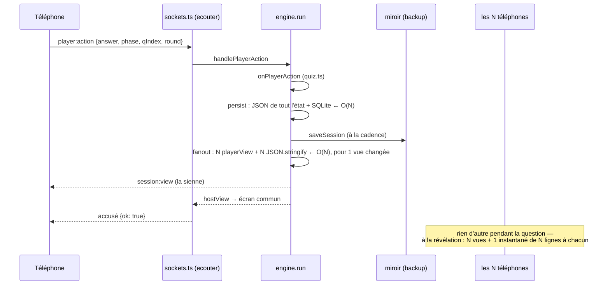

# Le temps réel sous charge, et les voisins bruyants — rapport de l'expert performance temps réel

## En bref

Sur une machine de quatre cœurs, FiestApp tient **500 invités dans un seul
espace** et **cinq soirées de 60 en même temps** sans qu'aucun téléphone le
sente : pendant le jeu, la question arrive en 13 ms (p95 : 31 ms), une réponse
reçoit son accusé en 3 ms (p95 : 14 ms), la révélation part 45 ms après le
souffle. Aucune vue, aucun instantané n'a jamais franchi la frontière d'un
espace (0 fuite sur 28 essais, 6 880 téléphones). Le vrai plafond est ailleurs :
**au dixième de cœur de Render gratuit, rejoué ici, la soirée casse entre 150
et 300 invités**. À 300, l'accusé d'une réponse prend 1,2 s en médiane et
jusqu'à 3,2 s, et l'inscription de la salle 13 s. Ce qui la fait casser, ce
n'est pas la vue de jeu (0,3 Ko, constante) mais trois coûts qui grandissent
avec la salle : **l'instantané `party:snapshot`**, qui porte toute la salle à
chaque téléphone (80 Ko à 500, 1,76 Mo par téléphone quand 50 téléphones se
réveillent) ; **la rediffusion complète à chaque réponse** (500 vues
recalculées et sérialisées pour en changer une) ; et **l'écriture synchrone
du miroir `file:`** à chaque inscription, qui fait la queue devant les
voisins (les petits espaces attendent 1,7 s au lieu de 0,2 s quand un voisin
de 400 inscrit sa salle).

Les trois améliorations qui rapporteraient le plus :
1. **Un instantané léger pour les téléphones** (top 8, soi, les compteurs) :
   −95 % des octets de la salle, et le réveil des téléphones cesse d'être un
   déni de service.
2. **Une rediffusion ciblée après une réponse** : seule la vue de celui qui
   répond et celle de l'écran commun changent ; −40 % du CPU de jeu à 500.
3. **Regrouper les écritures du miroir d'une vague d'inscriptions** (un tour
   de boucle avant de pomper) : les inscriptions cessent de bloquer les
   voisins en mode « chez soi ».

## Méthode

- **Un serveur jetable à moi**, lancé dans son propre processus par le
  générateur de charge : le vrai `createQuizServer`, bases neuves à chaque
  essai (locale SQLite, et une permanente `file:` qui sert aussi de miroir),
  instrumenté par `monitorEventLoopDelay` (résolution 1 ms : le p50 au repos
  vaut donc ~1,1 ms, pas zéro), `process.cpuUsage()` et la mémoire, lus par
  HTTP à chaque début et fin de phase —
  `retours/2026-09-24/experts/scripts/perf-temps-reel/serveur.ts`.
- **Un test de charge à plusieurs espaces** sur le modèle de
  `server/scripts/load-test.mjs` —
  `retours/2026-09-24/experts/scripts/perf-temps-reel/charge.mjs`. Il crée un
  compte d'animateur par espace comme la régie (`/api/admin/accounts`, puis
  `/api/auth/activate`), lui ouvre 500 places (`/api/space/settings`) et un
  quiz de 4 questions (2 QCM, 2 estimations, 20 s chacune), ouvre un écran
  commun par espace (`host:hello`), puis inscrit **tous les invités de tous
  les espaces en même temps** (`party:watch` puis `player:join`). Les quiz
  démarrent ensemble ; chaque invité répond entre 0,3 et 2,8 s après la
  question ; chaque animateur clique « Suivant » une seconde après la
  révélation, avec sa visée (`phase`, `qIndex`, `round`), comme la console.
  Il mesure : l'inscription (connexion → accusé du `player:join`) ; la
  **question** (clic « Suivant » → première vue de la question suivante sur
  le téléphone) ; la **lecture → question** (fin du chrono de lecture → vue
  « question » reçue) ; l'**accusé** d'une réponse ; la **révélation**
  (dernier accusé de l'espace → vue « reveal », moins le souffle de 700 ms,
  `SETTLE_MS`) ; les octets et messages par téléphone et par évènement ; et
  l'**isolation** : toute `session:view` dont la partie n'est pas celle de
  l'espace, tout instantané dont le `space.slug` n'est pas le sien compte une
  fuite.
- **Deux options qui comptent** : `--veille N` endort puis réveille N
  téléphones par espace en salle d'attente (fermeture, puis 1 à 3 s plus tard
  re-présentation avec le jeton) et compte ce que reçoit un téléphone témoin ;
  `--quota 0.1` rejoue le **dixième de cœur de Render gratuit** : le serveur
  reçoit SIGCONT au début de chaque période de 100 ms et SIGSTOP 10 ms plus
  tard (un quota CFS, comme celui d'un conteneur).
- **Les séries** : `series.sh` (solo 50/200/500 × 4, cinq × 60 × 3, voisin
  400+20+20+20 × 3 contre 20+20+20 × 3, veille 150 et 500, le quota à
  50/150/300 et le voisin 150+20+20+20) et `tableau.mjs`, qui agrège : médiane
  des p50, **pire** p95 et pire max d'une répétition à l'autre.
- **Profils CPU** : `node --cpu-prof` sur le serveur (500 invités), lus par
  poste (temps propre, temps inclusif, plus long bloc sans repos de la
  boucle).
- **Lecture du code** : `core/engine.ts`, `core/space.ts`, `core/party.ts`,
  `core/backup.ts`, `games/quiz.ts`, `sockets.ts`, et côté client
  `views/PlayerApp.tsx`, `components/Leaderboard.tsx`, `components/Entree.tsx`.
- **La machine** : 4 cœurs, rien d'autre dessus ; charge (`loadavg` 1 min)
  entre 0,04 et 0,59 avant chaque essai, notée dans chaque JSON. Le
  générateur partage les cœurs : son CPU et son retard de boucle sont mesurés
  à part (tableaux ci-dessous).
- **Durée** : environ trois heures, mesures comprises.

Ce que je n'ai pas couvert : un vrai réseau (tout passe par `localhost`, sans
TLS ni 4G) ; un miroir Turso distant (le mien est un fichier, voir constat 3) ;
le rendu des téléphones (aucune mesure navigateur : un autre expert regarde
l'écran).

## Constats

### 1. L'instantané porte toute la salle à chaque téléphone, et repart à chaque réveil

- **Où** : `server/src/core/space.ts:729` (`buildSnapshot`), `:757`
  (`sendSnapshot`), `:767` (`broadcastSnapshot`, regroupé à 120 ms) ;
  `server/src/core/party.ts:300` (`toPublic`, avec `connected`) ; côté
  client `client/src/views/PlayerApp.tsx:185`, `:188`, `:254`, `:312`, `:380`.
- **Constat** : chaque téléphone reçoit la liste complète des invités
  (identifiant, prénom, avatar, `connected`, score, équipe) **et**
  `session.participantIds`, la liste des identifiants de la partie. À 500
  invités, un instantané pèse **80,8 Ko** ; il part à toute la salle à chaque
  arrivée (regroupé à 120 ms), à chaque changement de score et de partie, et —
  surtout — **à chaque bascule de `connected`**, c'est-à-dire à chaque
  téléphone qui s'endort ou se réveille. Or le téléphone n'en montre que le
  top 8 (`Leaderboard compact` : `rows.slice(0, 8)`,
  `client/src/components/Leaderboard.tsx:29`), son propre rang, le nombre de
  connectés ; `participantIds` ne sert qu'à savoir si l'on est dans la partie
  (`PlayerApp.tsx:188`). Les identifiants (36 caractères, deux fois par
  invité) font à eux seuls près de la moitié du poids.
- **Preuve** (`charge.mjs`, JSON dans `export/evaluations/perf-temps-reel/`) :

  | Invités | Instantané le plus gros | Instantanés par téléphone (inscription + quiz) | Ko d'instantanés par téléphone et par question | Vue de jeu la plus grosse |
  |---|---|---|---|---|
  | 50 | 8,3 Ko | 7,7 | ~10 | 0,4 Ko |
  | 200 | 32,5 Ko | 9,4 | ~40 | 0,4 Ko |
  | 500 | 80,8 Ko | 9,5 | ~100 | 0,4 Ko |

  Les `session:view` restent **15 par téléphone et 4,7 Ko pour tout le quiz,
  quelle que soit la salle** ; l'instantané fait 96 % des octets de jeu à 500.
  **Le réveil** (`--veille`) : 50 téléphones sur 500 qui s'endorment et
  reviennent en 12 s font recevoir à chaque téléphone resté éveillé
  **29 instantanés, 1,76 Mo** — soit ~880 Mo sortis du serveur en 12 s. À
  150 invités et 15 réveils : 22 instantanés, 403 Ko par téléphone, ~60 Mo.
  Et c'est ce qui arrive dans une vraie salle : les écrans s'éteignent entre
  deux quiz (d'où le `ConseilVeille` de la salle d'attente).
- **Qui ça touche, ce que ça coûte** : toute la salle d'une grande soirée —
  la 4G partagée d'une salle bondée, le forfait des invités (~400 Ko par
  question à 500), et la bande passante sortante de l'hébergeur ; au dixième
  de cœur, la sérialisation (une fois par diffusion, `encodeAsString`) et
  surtout l'écriture de 500 trames sur les sockets (`writev`, 0,7 s dans le
  profil à 500) se paient dans la boucle des autres espaces.
- **Statut** : friction confirmée, qui devient panne au-delà de 200 invités
  sur un réseau réel. Invariant 4 respecté (l'instantané ne porte aucun champ
  de tick) — c'est le volume, pas la fréquence, qui coûte.
- **Piste** : deux instantanés. L'écran commun garde le complet (il affiche
  toute la salle). Les téléphones reçoivent un **instantané de salle** commun
  à tous (donc toujours dédoublonné et diffusé une fois, invariant 4 intact) :

  ```ts
  // space.ts — ce que la salle voit : le haut du classement et des compteurs.
  interface SnapshotSalle {
    top: PublicPlayer[]          // les 8 premiers, déjà classés (shared/classement.ts)
    effectif: number; connectes: number
    teams, bonuses, space, joinUrl
    session: { id: string } | null   // sans participantIds
  }
  ```

  et une ligne à soi (`party:moi` : sa fiche, son rang, `participe`), envoyée
  au seul intéressé quand elle change. `connected` n'entre plus dans ce qui
  part à la salle — seul le compte des connectés, qui ne bouge qu'à la
  transition. L'`Entree` a besoin des prénoms et avatars pour l'avertissement
  d'homonyme (`Entree.tsx:92`, `:564`) : les sockets qui n'ont pas encore
  rejoint peuvent recevoir la liste `{name, avatar}` seule (sans identifiants,
  ni scores, ni `connected`), ou poser la question au serveur. **Test à
  écrire** (`server/test/instantane.test.ts`) : à 300 invités, l'instantané
  reçu par un téléphone pèse moins de 3 Ko, et la déconnexion d'un invité ne
  renvoie rien aux téléphones — seulement aux écrans communs.
- **Priorité · effort** : **P1 · M**.

### 2. Au dixième de cœur, la soirée casse entre 150 et 300 invités

- **Où** : tout le chemin chaud d'une réponse et d'une inscription (constats
  1, 3, 4) ; l'hébergement recommandé (README, « `MAX_PLAYERS` » : « pas
  au-delà de 150 environ »).
- **Constat** : sur quatre cœurs, rien ne se voit. Mais le CPU consommé par
  question croît plus vite que la salle : **380 ms à 50, 690 ms à 200,
  1 610 ms à 500** (médiane de 4 essais, CPU du jeu ÷ 4 questions, lancement
  et podium compris). Au dixième de cœur, ces secondes deviennent dix fois
  plus longues, et la boucle, saturée, fait attendre tout le monde.
- **Preuve** (`--quota 0.1`, un essai chacun) :

  | Invités | Inscription de la salle | Inscription p50 / p95 / max | Accusé p50 / p95 / max | Révélation − souffle p50 / p95 / max | Retard de boucle p99 / max (jeu) |
  |---|---|---|---|---|---|
  | 50 | 2,5 s | 1,3 / 2,5 / 2,5 s | 42 / 87 / 117 ms | 11 / 108 / 108 ms | 92 / 495 ms |
  | 150 | 7,5 s | 4,4 / 7,2 / 7,4 s | 74 / 173 / 258 ms | 101 / 200 / 201 ms | 107 / 700 ms |
  | 300 | 13,5 s | 6,7 / 12,2 / 13,3 s | **1 183 / 2 731 / 3 203 ms** | 205 / 405 / 407 ms | **806 / 2 298 ms** |

  Le rejeu par SIGSTOP/SIGCONT est **plus dur que le vrai quota au repos** (il
  suspend le serveur 90 ms sur 100 même quand il n'a rien à faire : ~50 ms de
  retard de base sur tout, d'où les 42 ms d'accusé à 50) et **identique une
  fois saturé**, ce qui est le cas de 300.
- **Qui ça touche, ce que ça coûte** : à 300 invités sur Render gratuit,
  chaque réponse attend son accusé une à trois secondes : sur une question à
  20 s, les réponses de la dernière seconde se font refuser (`too-late`)
  malgré les 1,5 s de grâce. Le README avait vu juste (150) ; mais le
  plafond réglable (500, `MAX_PLAYERS_CEILING`) laisse un animateur ouvrir
  une soirée que son hébergement ne tiendra pas.
- **Statut** : confirmé (sous émulation du quota).
- **Piste** : les constats 1, 3 et 4 déplacent ce point ; en attendant, un
  **plafond par défaut calé sur l'hébergement** (`MAX_PLAYERS=150` dans
  `render.yaml` et dans le tableau de bord du service gratuit), et le rappel
  dans les réglages d'un espace quand il dépasse 150 (« au-delà, l'hébergement
  gratuit ralentit »). Rejouer `series.sh quota` après chaque optimisation
  pour déplacer ce tableau.
- **Priorité · effort** : **P1 · S** (le plafond), le reste par les constats
  suivants.

### 3. Chez soi, chaque inscription écrit le miroir en synchrone, et les voisins font la queue

- **Où** : `server/src/core/party.ts:131` (`backup.savePlayer`) →
  `server/src/core/backup.ts:555` (`pousser`) → `:644` (`pomper`) → `:703`
  (`envoyer`, `client.batch`). Le miroir est un fichier `file:` dès que
  `QUIZ_DB_URL` n'est pas donné (`server/src/index.ts:50`) : c'est le mode
  « chez soi » par défaut, et celui de mes essais.
- **Constat** : avec un client libsql local, `client.batch` s'exécute en
  natif **dans la boucle** ; l'envoi en vol se termine donc aussitôt, et
  `pomper` ne trouve jamais deux inscriptions à regrouper : **une transaction
  par invité**. À 500 inscriptions, le profil attribue 1 253 ms des 1 389 ms
  de `party.join` à ce seul chemin, et le plus long bloc de la boucle sans
  repos dure 652 ms (`ecouter.ok` du `player:join`). Les inscriptions étant
  traitées dans l'ordre d'arrivée, **tous les espaces font la même file**.
- **Preuve** : retard de boucle max pendant l'inscription de 500 : 1 031 ms.
  Cinq espaces × 60 inscrits ensemble : l'espace 1 attend 311 ms en médiane,
  l'espace 5 **1 104 ms** — un escalier d'espace en espace (tableau
  « cinq × 60 » plus bas). Le voisin bruyant :

  | Petits espaces (3 × 20) | Inscription p50 / p95 / max | Accusé p95 / max | Révélation − souffle max |
  |---|---|---|---|
  | seuls, 4 cœurs | 99–211 / 267 / 268 ms | 5 / 11 ms | 14 ms |
  | avec un voisin de 400, 4 cœurs | **1 642–1 673 / 2 296 / 2 310 ms** | 13 / 20 ms | 73 ms |
  | seuls, 0,1 cœur | 691–2 875 / 3 279 / 3 281 ms | 91 / 92 ms | 294 ms |
  | avec un voisin de 150, 0,1 cœur | **7 530–8 332 / 8 633 / 8 730 ms** | 244 / 318 ms | **796 ms** |

  Pendant le jeu, sur quatre cœurs, les petits ne sentent presque pas le gros
  (accusé p95 : 13 ms au lieu de 5) ; c'est l'**inscription** qui les fait
  attendre, et au dixième de cœur, tout.
- **Qui ça touche, ce que ça coûte** : chez soi (un PC, le miroir en
  fichier), tout espace dont un voisin inscrit une grande salle ; en ligne,
  le client Turso est distant et asynchrone — l'envoi reste en vol le temps
  d'un aller-retour, et les inscriptions s'y regroupent d'elles-mêmes : ce
  coût-là y est bien moindre (non mesuré, voir « Limites »).
- **Statut** : confirmé (mode `file:`), non confirmé en ligne.
- **Piste** : laisser passer un tour de boucle avant de pomper, pour qu'une
  vague d'inscriptions parte en une transaction — l'ordre de la file et
  l'insistance (invariant 13) ne changent pas, seul le moment du départ :

  ```ts
  // backup.ts — pousser()
  voie.file.push(nouveau)
  if (!voie.pompeArmee) {
    voie.pompeArmee = true
    // Un client `file:` s'exécute dans la boucle : sans ce répit, chaque
    // invité payait sa transaction, et une salle de 400 faisait la queue
    // devant les inscriptions des voisins.
    setImmediate(() => { voie.pompeArmee = false; this.pomper(voie) })
  }
  ```

  À garder hors du chemin `ouvrirLot`/`fermerLot` d'un `run()` (le lot part
  déjà d'un seul tenant). **Test** : `miroir.test.ts` — 200 `player:join` en
  rafale produisent moins de 10 transactions au miroir.
- **Priorité · effort** : **P2 · S**.

### 4. Chaque réponse recalcule et resérialise les vues de toute la salle

- **Où** : `server/src/core/engine.ts:197` (`handlePlayerAction`) → `:343`
  (`run`) → `:422` (`fanout`) → `:455` (`changed`, un `JSON.stringify` par
  vue) ; et `:463` (`persist`, `JSON.stringify(sess.state)` et écriture
  SQLite à chaque réponse).
- **Constat** : pendant une question, la vue d'un joueur ne dépend que de
  l'état commun et de **sa** réponse (`games/quiz.ts:731`, `playerView` :
  `mine = st.responses[playerId]`, aucun compteur de la salle). Une réponse ne
  change donc que deux vues — la sienne et celle de l'écran commun — mais le
  moteur en recalcule et sérialise N pour le vérifier : N² par question. Et
  `persist` réécrit tout l'état (réponses, `playFrom`, totaux de N joueurs,
  copie du quiz) à chaque réponse : encore N².
- **Preuve** : profil CPU à 500 (`--cpu-prof`), sur 7,2 s de CPU utilisateur
  pendant le jeu : `fanout` **2,9 s** inclusifs, dont `changed` 1,8 s ;
  `persist` **1,6 s** ; `playerView` seulement 0,2 s. Le téléphone, lui, ne
  reçoit que 15 vues sur tout le quiz : le filtre `changed` écarte bien 99 %
  du travail… après l'avoir fait.
- **Qui ça touche, ce que ça coûte** : l'accusé de chaque réponse part après
  cette rediffusion (`sockets.ts:410-411`) ; au dixième de cœur, c'est le
  gros de la seconde d'accusé à 300 invités — et le CPU volé aux voisins.
- **Statut** : confirmé (profil), gain estimé à ~40 % du CPU de jeu à 500
  (non rejoué : la correction n'est pas appliquée).
- **Piste** : une rediffusion ciblée quand le module le dit. Le module
  déclare les joueurs dont la vue a pu changer ; le moteur ne recalcule
  qu'eux, plus l'écran commun ; tout le reste (timers, commandes,
  exclusions, phases) garde la rediffusion complète :

  ```ts
  // engine.ts — handlePlayerAction
  this.run(sess, ctx => this.module.onPlayerAction(sess, playerId, action, ctx), {
    // Une réponse ne change que la vue de celui qui répond : quiz.ts, playerView.
    seulement: sess.state.phase === avantPhase ? [playerId] : undefined,
  })
  ```

  Le risque, pour l'invariant 1 et pour la justesse : une vue future qui
  dépendrait des réponses des autres (« 12/50 ont répondu » au téléphone)
  serait oubliée en silence. D'où un drapeau porté par le module
  (`vueDependDesAutres: false`) plutôt qu'une règle du moteur, et un **test**
  qui compare, réponse par réponse, la rediffusion ciblée à la complète sur
  une partie de 30 invités (mêmes vues envoyées). Pour `persist` :
  écrire l'état de la partie à la cadence du miroir pendant une question, et
  la réponse elle-même dans une ligne à part (la table `answers` en a déjà la
  forme) — à peser contre l'invariant 5/13 (une réponse accusée doit survivre
  à un arrêt brutal) : c'est un choix de l'équipe, pas un nettoyage.
- **Priorité · effort** : **P2 · M** (ciblage) · **P3 · M** (persist).

### 5. Le générateur de charge du dépôt ne voit ni les octets ni les voisins

- **Où** : `server/scripts/load-test.mjs`.
- **Constat** : il compte les vues (`messages`), pas les instantanés ni les
  octets, et ne joue qu'un espace : il ne pouvait voir ni le constat 1 ni le
  constat 3. Son « question » (`Date.now() - (deadline - duration)`) mesure le
  chrono de lecture, pas le geste de l'animateur.
- **Preuve** : lecture ; mes chiffres « vues reçues » à 500 (15 par
  téléphone) correspondent à ce qu'il afficherait, alors que 96 % des octets
  passent ailleurs.
- **Piste** : reprendre `charge.mjs` (plusieurs espaces, octets par
  évènement, quota, veille, isolation) comme `npm run load`, et y ajouter le
  seuil du constat 1 en garde-fou.
- **Priorité · effort** : P3 · S.

### 6. Une mesure qui ment un peu : le générateur sature avant le serveur à 500

- **Constat** : pour 500 téléphones simulés, mon générateur (un seul
  processus) analyse ~40 Mo de JSON par instantané diffusé : sa boucle prend
  jusqu'à **781 ms** de retard pendant l'inscription de 500, **1 029 ms**
  pendant la veille à 500. Les temps d'inscription (p95 2,3 s) et de retour
  d'un téléphone (p50 2,1 s) à 500 sont donc **surestimés** — ils comptent la
  lenteur du générateur. Les temps de jeu (retard du générateur p99 < 2 ms)
  sont fiables. C'est aussi, en creux, une mesure du constat 1 : un seul
  processus Node ne digère pas les instantanés de 500 téléphones.
- **Statut** : limite de la mesure, dite.

## Mesures et cartes

### Ce que coûte une réponse, et ce qu'elle déclenche



### Un espace seul, quatre cœurs (4 essais chacun)

Colonnes en ms : médiane des p50 / pire p95 / pire max.

| Invités | Inscription | Question (geste → téléphone) | Lecture → question | Accusé | Révélation − 700 ms | Ko / téléphone / question | Fuites |
|---|---|---|---|---|---|---|---|
| 50 | 124 / 290 / 296 | 4 / 11 / 12 | 3 / 9 / 10 | 2 / 5 / 45 | 3 / 16 / 17 | 11,5 | 0 |
| 200 | 534 / 875 / 893 | 5 / 15 / 16 | 5 / 13 / 17 | 2 / 5 / 27 | 20 / 33 / 36 | 41,5 | 0 |
| 500 | 1 154 / 2 306* / 2 640* | 13 / 31 / 35 | 11 / 28 / 34 | 3 / 14 / 25 | 45 / 63 / 66 | 101,7 | 0 |

\* gonflé par le générateur (constat 6).

| Invités | CPU serveur, inscription | CPU serveur, jeu (4 questions) | Retard de boucle max (inscr. / jeu) | RSS max | Générateur (jeu) |
|---|---|---|---|---|---|
| 50 | 217 ms | 1 499 ms | 126 / 40 ms | 142 Mo | 0,06 cœur |
| 200 | 700 ms | 2 662 ms | 254 / 122 ms | 172 Mo | 0,09 cœur |
| 500 | 1 639 ms | 6 313 ms | **1 031** / 153 ms | 207 Mo | 0,27 cœur |

La mémoire reste sage : ~140 Mo au repos, +65 Mo à 500 invités.

### Cinq espaces × 60, en même temps (3 essais)

| Espace | Inscription | Question | Accusé | Révélation − 700 ms | Ko / tél. / question | Fuites |
|---|---|---|---|---|---|---|
| 1 | 311 / 394 / 440 | 3 / 6 / 6 | 2 / 3 / 14 | 10 / 55 / 56 | 13,5 | 0 |
| 2 | 440 / 587 / 599 | 3 / 5 / 6 | 2 / 4 / 17 | 3 / 20 / 20 | 13,5 | 0 |
| 3 | 681 / 837 / 843 | 3 / 6 / 6 | 1 / 3 / 14 | 11 / 78 / 79 | 13,5 | 0 |
| 4 | 907 / 1 022 / 1 026 | 3 / 5 / 5 | 1 / 4 / 18 | 3 / 73 / 74 | 13,5 | 0 |
| 5 | 1 104 / 1 214 / 1 222 | 3 / 5 / 5 | 1 / 3 / 20 | 5 / 47 / 48 | 13,5 | 0 |

Serveur : 1 009 ms de CPU pour les 300 inscriptions, 3 004 ms pour les cinq
quiz ; retard de boucle max 197 ms (inscription), 72 ms (jeu). L'escalier de
l'inscription est le constat 3 ; le jeu, lui, ne se gêne pas.

### Le voisin bruyant (3 essais chacun, quatre cœurs)

| | Espace | Invités | Inscription | Question | Accusé | Révélation − 700 ms |
|---|---|---|---|---|---|---|
| seuls | 1–3 | 20 | 99–211 / 267 / 268 | 3 / 21 / 21 | 2 / 5 / 11 | 0 / 14 / 14 |
| avec le gros | gros | 400 | 864 / 1 691 / 2 319 | 11 / 31 / 35 | 3 / 11 / 61 | 38 / 71 / 73 |
| avec le gros | 2 | 20 | 1 649 / 1 708 / 1 710 | 2 / 8 / 9 | 1 / 8 / 20 | 0 / 18 / 18 |
| avec le gros | 3 | 20 | 1 642 / 1 735 / 1 737 | 4 / 18 / 19 | 1 / 8 / 16 | 0 / 73 / 73 |
| avec le gros | 4 | 20 | 1 673 / 2 296 / 2 310 | 2 / 4 / 4 | 1 / 13 / 19 | −1 / 4 / 5 |

(Une révélation « − 1 ms » : le souffle de 700 ms est un `setTimeout`, qui
peut sonner une milliseconde en avance sur l'horloge du générateur.)

### La veille (un essai chacun)

| Salle | Téléphones endormis puis réveillés en 12 s | Instantanés reçus par un témoin | Octets reçus par le témoin | Sortie totale estimée | CPU serveur |
|---|---|---|---|---|---|
| 150 | 15 | 22 | 403 Ko | ~60 Mo | 0,8 s |
| 500 | 50 | 29 | 1 761 Ko | ~880 Mo | 1,4 s |

### L'isolation

28 essais, jusqu’à cinq espaces simultanés, 6 880 téléphones au total :
**0 vue d'une autre partie, 0 instantané d'un autre espace, 0 refus**.

## Ce qui marche — à ne pas casser

- **La vue de jeu est minuscule et constante** (≤ 0,4 Ko, 15 par quiz) : le
  filtre `changed` (`engine.ts:455`) et le mémo par diffusion (`vctx.memo`)
  ont bien fait leur travail — la question arrive en 13 ms à 500, et c'est
  de là que partira la rediffusion ciblée.
- **L'isolation par espace tient sous charge** : salons `space:`,
  `player:`, `hosts:` bien séparés ; un espace qui joue n'écrit jamais chez
  son voisin.
- **L'instantané regroupé à 120 ms et dédoublonné** : sans lui, une
  inscription de 500 serait 500 diffusions de 80 Ko ; il en reste trois.
- **Le jeu d'un gros espace ne ralentit pas celui des petits** sur une
  machine qui a de la marge (accusé p95 : 13 ms au lieu de 5).
- **La mémoire** : ~210 Mo au pire à 500 invités, sans fuite visible d'un
  essai à l'autre.
- **Aucun message perdu, aucun accusé manquant** sur toutes les séries, au
  dixième de cœur compris : l'invariant 7 tient sous pression.

## Recommandations, dans l'ordre

1. **Un instantané léger pour les téléphones** — top 8, compteurs, sa
   propre ligne à part, ni `participantIds` ni `connected` pour la salle
   (constat 1). −95 % d'octets à 500, et le réveil des téléphones ne coûte
   plus rien à la salle. **P1 · M.**
2. **Caler le plafond par défaut sur l'hébergement** : `MAX_PLAYERS=150`
   sur l'offre gratuite, et un mot dans les réglages au-delà (constat 2).
   **P1 · S.**
3. **Rediffusion ciblée après une réponse**, déclarée par le module et
   vérifiée par un test d'équivalence (constat 4). ~−40 % du CPU de jeu à
   500. **P2 · M.**
4. **Un tour de boucle avant de pomper le miroir**, pour qu'une vague
   d'inscriptions parte en une transaction (constat 3). Les petits espaces
   cessent d'attendre le gros chez soi. **P2 · S.**
5. **Adopter `charge.mjs` comme test de charge du dépôt** (plusieurs
   espaces, octets, `--quota`, `--veille`, isolation), et rejouer `series.sh
   quota` après chaque optimisation (constat 5). **P3 · S.**
6. **Alléger `persist` pendant une question** (état à la cadence, réponse
   en ligne à part) — à arbitrer contre l'invariant 5/13 (constat 4).
   **P3 · M.**

## Limites

- **Pas de vrai réseau** : tout passe par `localhost`. Les temps donnés sont
  ceux du serveur et de la boucle, pas ceux de la 4G ; les octets, eux, sont
  exacts (charge JSON + nom d'évènement, sans les en-têtes WebSocket ni TLS,
  ni la compression — socket.io n'en active pas par défaut pour les
  WebSockets).
- **Pas de Turso distant** : mon miroir est un fichier, donc synchrone. En
  ligne, le constat 3 est probablement bien moindre (les envois se regroupent
  pendant l'aller-retour) ; c'est à mesurer sur la préproduction avec
  `charge.mjs` pointé dessus (sans `--quota` : le vrai quota s'appliquera),
  hors de l'adresse locale — la réserve de 60 inscriptions par adresse
  s'appliquera alors (`sockets.ts:46`) : il faudra plusieurs adresses ou
  `--etalement`.
- **Le quota est rejoué, pas réel** : SIGSTOP/SIGCONT est plus dur que CFS au
  repos (≈ 50 ms de retard de base), identique en saturation. Un seul essai
  par taille au quota.
- **À 500, le générateur sature** (constat 6) : les temps d'inscription et de
  retour y sont des majorants.
- **Les gains annoncés des pistes 3 et 4 sont estimés sur le profil**, pas
  rejoués : aucune correction n'a été appliquée.
- Rien ici sur le coût de rendu côté téléphone d'un instantané de 500 lignes
  (tri à chaque rendu, `PlayerApp.tsx:312`) : à regarder sur un vrai petit
  Android.

Les scripts : `retours/2026-09-24/experts/scripts/perf-temps-reel/`
(`serveur.ts`, `charge.mjs`, `series.sh`, `tableau.mjs`) ; les JSON bruts et
les profils CPU restent dans `export/evaluations/perf-temps-reel/` (ignoré
par git).
