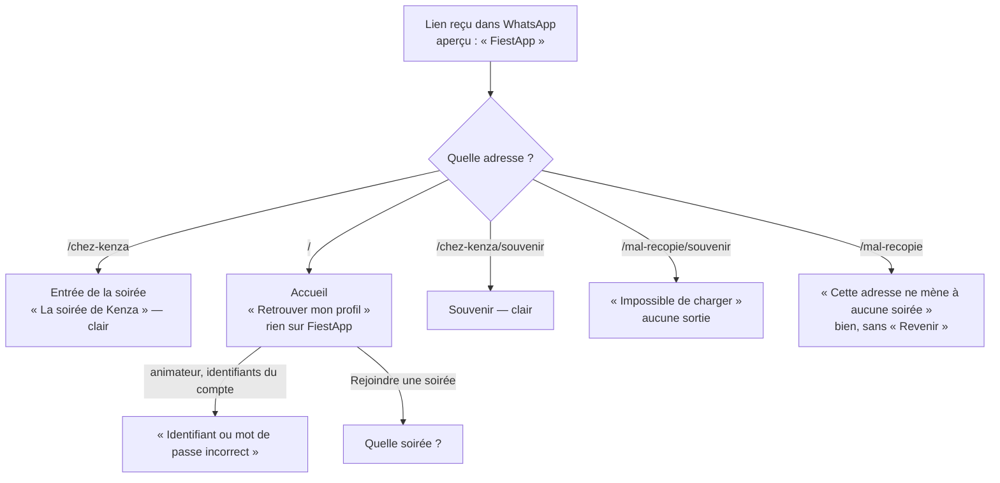

# La première visite, et les liens qu'on partage — rapport de l'expert acquisition et première impression

## En bref

Quand on arrive par le QR code, FiestApp est clair : « La soirée de / Kenza /
Le quiz de la soirée », et « Jouer sans compte » à un geste. **Tout le reste
de la première visite part de zéro** : l'accueil (`/`) ne dit ni « FiestApp »
ni « quiz » (son onglet s'appelle « Mon profil »), l'animateur qui n'a pas
relié de profil n'y trouve aucune porte, et ses identifiants y sont refusés
comme « incorrects ». **Un lien partagé dans WhatsApp ne montre rien d'autre
que « FiestApp »** : pas une balise Open Graph, pas d'image, le même HTML
pour toutes les adresses, y compris celles qui n'existent pas (200 partout,
`robots.txt` et `favicon.ico` compris). Les trois gestes qui rapporteraient
le plus : (1) injecter côté serveur un titre, une description et une image
par adresse (le serveur connaît déjà le nom de l'espace, sans requête) ;
(2) poser un bandeau de marque d'une ligne en tête de l'accueil, plus une
porte « J'anime une soirée » (mesuré : « Rejoindre une soirée » reste visible
en 360 × 640) ; (3) ne pas faire indexer les pages des soirées (`robots.txt`,
`X-Robots-Tag`) et répondre 404 aux espaces inconnus.

## Méthode

- **Atelier** : une régie à moi seul (serveur jetable, Chromium), compte
  Kenza activé par son lien, un quiz de cinq QCM collé dans l'éditeur, quatre
  joueurs fantômes (Léa, Samir, Chloé, Bastien), la soirée jouée puis close
  (archive `2026-09-24-o5b27`, « Soirée du 24 septembre 2026 »).
- **Ce que voit un robot d'aperçu** : `curl` sur dix-sept adresses (code
  HTTP, type, taille), puis lecture des balises du `<head>` servi. Un
  robot d'aperçu (WhatsApp, Slack, iMessage, Discord, Facebook) n'exécute
  pas le JavaScript : ce qu'il lit est ce que `curl` reçoit.
- **Ce que voit un humain** : le pilote, en `petit-telephone` (360 × 640) et
  `portable` (1366 × 768), sur l'accueil, l'entrée d'une soirée, les pages
  d'un espace inconnu et d'une archive inconnue, le souvenir d'une soirée
  close ; un script Playwright (`export/evaluations/premiere-visite/mesure.mjs`)
  qui mesure la position des boutons de l'accueil avant et après l'ajout d'un
  bandeau.
- **Le code** : `client/index.html`, `client/public/manifest.webmanifest`,
  `server/src/server.ts:506-552` (le service du client), `client/src/routes.ts`,
  `ProfilApp.tsx`, `ProfilForm.tsx`, `Rejoindre.tsx`, `LandingApp.tsx`,
  `RecapApp.tsx`, `SpaceNav.tsx`, `FinDeSoiree.tsx`, `BilanApp.tsx`.
- Environ une heure. **Pas couvert** : un vrai partage dans WhatsApp, Slack
  ou iMessage (pas d'accès sortant depuis l'atelier : les aperçus ci-dessous
  se déduisent des balises, non d'une capture de l'application), l'ajout à
  l'écran d'accueil sur un vrai iPhone ou Android, la production derrière
  Render.

## Constats

### 1. Un lien partagé n'a aucun aperçu : « FiestApp », et rien d'autre
- **Où** : toutes les adresses — `server/src/server.ts:547-551` renvoie le
  même `index.html` pour tout `GET *` ; `client/index.html` n'a ni
  `description`, ni `og:*`, ni `twitter:*`. Chaque page pose ensuite son
  titre en JavaScript (`document.title`, `RecapApp.tsx:61`,
  `BilanApp.tsx:61`, `PlayerApp.tsx:118`…), ce que les robots d'aperçu ne
  voient jamais.
- **Constat** : le lien d'une soirée (`/chez-kenza`), son souvenir, son bilan,
  l'archive `/chez-kenza/soirees/2026-09-24-o5b27`, le lien d'activation d'un
  compte d'animateur, et même `/n-existe-pas` : même page de 2 171 octets,
  même `<title>FiestApp</title>`, zéro balise `og:`. Dans un groupe WhatsApp,
  l'aperçu est au mieux « FiestApp » au-dessus du nom de domaine
  `…onrender.com` — rien qui dise « quiz », « soirée » ou le nom de l'hôte,
  pas d'image. Un lien `onrender.com` sans aperçu ressemble à un lien douteux.
- **Preuve** :
  ```
  $ curl -s http://localhost:39111/chez-kenza/souvenir | grep -c 'og:'
  0
  $ curl -s …/chez-kenza | grep '<title'
      <title>FiestApp</title>
  ```
  Même réponse, octet pour octet (ETag identique), pour `/`, `/chez-kenza`,
  `/chez-kenza/souvenir`, `/chez-kenza/bilan`, `/chez-kenza/soirees`,
  `/n-existe-pas/souvenir`, `/host`, `/admin`.
- **Qui ça touche, ce que ça coûte** : le lendemain, c'est **le** moment où
  FiestApp circule (« le souvenir d'hier soir 👉 lien ») ; et l'animateur qui
  invite des amis à l'avance (« ce soir on joue, voici le lien »). Un ami
  administrateur qui envoie le lien d'activation d'un compte : l'aperçu ne
  dit même pas qu'il s'agit d'ouvrir un espace d'animateur.
- **Statut** : friction (acquisition), vérifiée.
- **Piste** : voir « Mesures et cartes » pour les balises exactes, adresse
  par adresse, et la recommandation 1 pour l'extrait de serveur. Principe :
  le `app.get('*')` remplace un marqueur du `<head>` par des balises
  calculées à partir de `auth.bySlug(slug)` — synchrone, déjà en mémoire
  (`server/src/auth/store.ts:213`) — sans jamais attendre Turso.
- **Priorité · effort** : P2 · S à M (S pour le nom de l'espace ; M si l'on
  veut le titre de l'archive, qui passe par une lecture asynchrone).

### 2. L'accueil ne dit pas ce qu'est FiestApp
- **Où** : `/`, `ProfilApp.tsx:52-121` → `ProfilForm` avec `echappee`.
- **Constat** : un premier visiteur voit « ✨ Retrouver mon profil », deux
  champs, « Me connecter », « ou », « Rejoindre une soirée », « Créer un
  profil », et une note sur les profils. Ni le nom de l'application, ni le
  mot « quiz », ni ce qu'on y fait. L'onglet s'appelle « Mon profil »
  (`ProfilApp.tsx:55`) — pour quelqu'un qui n'en a pas. En 1366 × 768, le
  formulaire flotte au milieu d'un grand vide noir.
- **Preuve** : `retours/2026-09-24/experts/captures/premiere-visite-1-accueil.png`
  (360 × 640) ; extrait de `voir` : le premier titre de la page est
  « Retrouver mon profil ».
- **Qui ça touche, ce que ça coûte** : celui qui tape l'adresse sans le
  dernier mot (vu à la première tablée : Camille M. « passe par l'accueil »),
  celui qui clique un lien sans aperçu, l'ami curieux après une soirée. En
  dix secondes, il comprend « page de connexion de quelque chose ». Rien ne
  retient celui qui n'a pas de soirée à rejoindre.
- **Statut** : friction ; **tension avec un parti pris** documenté
  (`routes.ts`, `ProfilApp.tsx:26-38` : « demander "quelle soirée ?" avant
  de savoir qui est là n'avait aucun sens pour celui qui revient »). La
  proposition ne le remet pas en cause : elle garde la connexion en tête et
  ajoute une ligne au-dessus.
- **Piste** : un bandeau de marque d'une ligne (surtitre « FiestApp » + une
  phrase), au-dessus de « Retrouver mon profil » — voir « Un accueil
  proposé ». **Mesuré** en 360 × 640 : « Rejoindre une soirée » descend de
  472 px à 529 px, « Créer un profil » de 540 à 597 px — tous deux restent
  visibles sans défiler ; seule la note sur les profils passe sous la ligne
  de flottaison (maquette : `retours/2026-09-24/experts/captures/premiere-visite-3-accueil-propose.png`).
  Titre d'onglet : « FiestApp · Le quiz de vos soirées » tant qu'aucun
  profil n'est reconnu, « Mon profil » ensuite.
- **Priorité · effort** : P2 · S.

### 3. L'animateur sans profil relié n'a pas de porte sur l'accueil — et ses identifiants y sont « incorrects »
- **Où** : `/` ; aucune page publique ne renvoie à `/connexion` (seules
  `AccountApp.tsx:24` et `AdminApp.tsx:37` y redirigent, après coup).
- **Constat** : Kenza, compte activé, sans profil relié, ouvre FiestApp sur
  le PC branché à la télé. La seule connexion proposée est celle **des
  profils**. Elle y tape `kenza` et son mot de passe d'animateur : « Identifiant
  ou mot de passe incorrect ». Rien ne dit que les deux identités sont
  distinctes, ni que l'écran commun est à `/host`. Et nulle part il n'est
  dit comment on devient animateur (un ami administrateur ouvre le compte).
- **Preuve** : pilote, `bureau` en 1366 × 768 : `ouvrir /`, `ecrire "Ton
  identifiant" kenza`, `ecrire "Ton mot de passe" <mot de passe du compte>`,
  `toucher "Me connecter"` → `alert: Identifiant ou mot de passe incorrect`.
- **Qui ça touche, ce que ça coûte** : chaque nouvel animateur, le soir de
  sa première soirée, devant ses invités ; et quiconque aurait envie
  d'animer après avoir joué.
- **Statut** : bug d'usage confirmé (le message dit faux : le mot de passe
  est bon, c'est la porte qui n'est pas la bonne).
- **Piste** : (a) sous la note de l'accueil, un lien discret « J'anime une
  soirée » → `/connexion?next=/host` ; (b) sur `/connexion`, une ligne :
  « Pas encore d'espace ? Un espace d'animateur s'ouvre sur invitation :
  demande à qui t'a fait jouer. » ; (c) côté serveur, quand la connexion d'un
  **profil** échoue mais que l'identifiant désigne un **compte** et que le
  mot de passe du compte est bon, répondre « C'est l'identifiant d'un espace
  d'animateur : connecte-toi par "J'anime une soirée" » — en consommant le
  même budget d'essais (`loginBudgetOf(app)`), pour ne rien apprendre de
  plus à un attaquant qu'un essai normal. (c) est à arbitrer (invariant 16 :
  deux tables, deux identités) ; (a) et (b) suffisent déjà.
- **Priorité · effort** : P2 · S.

### 4. Tout répond 200 : `robots.txt`, `favicon.ico`, espaces et soirées inconnus
- **Où** : `server/src/server.ts:547` (`app.get('*')`), `client/public/`
  (ni `robots.txt`, ni `favicon.ico`).
- **Constat** :

  | Adresse | Réponse |
  |---|---|
  | `/robots.txt` | 200 `text/html`, 2 171 o (la page de l'application) |
  | `/sitemap.xml` | 200 `text/html` |
  | `/favicon.ico` | 200 `text/html` |
  | `/apple-touch-icon.png` | 200 `text/html` |
  | `/n-existe-pas`, `/n-existe-pas/souvenir` | 200 `text/html` |
  | `/chez-kenza/soirees/abc` (archive inconnue) | 200 `text/html` |
  | `/s/inconnu/space.json` | 404 JSON — correct |

  Un moteur lit un `robots.txt` en HTML comme « aucune règle » : tout est
  indexable. Les « soft 404 » laissent indexer des adresses mortes. Les
  navigateurs et plusieurs robots d'aperçu demandent `/favicon.ico` d'office
  et reçoivent 2 Ko de HTML.
- **Preuve** : la boucle `curl` de la méthode ; en-têtes : `Cache-Control:
  no-cache`, aucun `X-Robots-Tag`.
- **Qui ça touche, ce que ça coûte** : la vie privée des soirées (constat 5)
  et la propreté de l'aperçu (pas d'icône dans Slack, Discord…).
- **Statut** : bug confirmé (mineur).
- **Piste** : un `client/public/robots.txt` (voir recommandation 3) et un
  `favicon.ico` (32 × 32, dérivé de `icone.svg`) ; dans `app.get('*')`,
  `res.status(404)` quand la route est `join`/`public` et que
  `auth.bySlug(slug)` ne trouve rien — la page reste la même (le client
  affiche « Quelle soirée ? »), seul le code change.
- **Priorité · effort** : P3 · S.

### 5. Les soirées ne se protègent pas des moteurs de recherche
- **Où** : aucune balise `robots`, aucun en-tête `X-Robots-Tag`, pas de
  `robots.txt` (constat 4).
- **Constat** : le souvenir, le bilan et l'historique d'un espace sont
  publics par lien (c'est voulu), et nomment les joueurs par leur prénom,
  leurs réponses, leurs prix (« L'Abstentionniste »…). Qu'un lien soit posté
  sur une page publique (un forum, un Discord ouvert), et Googlebot — qui
  exécute le JavaScript — peut indexer ces pages : un prénom et une
  mauvaise réponse sortent dans un moteur de recherche.
- **Preuve** : lecture des en-têtes (`curl -si /`) ; non rejoué dans un
  vrai moteur (non confirmé en pratique, avéré dans les balises).
- **Qui ça touche, ce que ça coûte** : les invités, qui n'ont rien demandé.
- **Statut** : **tension avec le parti pris n° 2** (zéro donnée
  personnelle) — ici, ce n'est pas la collecte, c'est la diffusion.
- **Piste** : `X-Robots-Tag: noindex, nofollow` sur toute réponse sauf `/`
  (y compris `/s/*.json`), et `robots.txt` qui n'autorise que `/`. Les
  aperçus de liens ne sont pas gênés : WhatsApp, Slack, iMessage ne lisent
  pas `robots.txt` pour un lien qu'on leur colle (Slack l'honore seulement
  pour son propre robot `Slackbot-LinkExpanding` s'il est nommé : ne pas le
  nommer).
- **Priorité · effort** : P2 · S.

### 6. Une adresse inconnue du souvenir ou d'une archive : « Impossible de charger », comme une panne
- **Où** : `RecapApp.tsx:47-48`, `BilanApp.tsx:57`, `ArchivesApp.tsx:32`,
  rendus par `SpaceError` (`SpaceNav.tsx:66-72`).
- **Constat** : `/n-existe-pas/souvenir` et `/chez-kenza/soirees/abc`
  affichent en rouge « Impossible de charger le souvenir de la soirée. »,
  sous trois onglets (Souvenir, Bilan, Soirées) qui mènent à trois autres
  pages en erreur. Pas un mot sur ce qui ne va pas (l'espace n'existe pas ?
  le réseau ?), aucun lien vers l'accueil ni vers « Quelle soirée ? ». Le
  serveur, lui, sait : il répond 404 à `recap.json` (console :
  `[HTTP 404] GET /s/n-existe-pas/recap.json`). L'entrée d'un espace inconnu
  (`/n-existe-pas`), elle, le dit bien : « Cette adresse ne mène à aucune
  soirée. Vérifie le nom avec ton hôte… ».
- **Preuve** : `retours/2026-09-24/experts/captures/premiere-visite-2-souvenir-inconnu.png`.
- **Qui ça touche, ce que ça coûte** : celui qui reçoit un lien mal recopié,
  ou celui d'une soirée supprimée de l'historique. Il croit à une panne,
  recharge, abandonne.
- **Statut** : friction, confirmée.
- **Piste** : distinguer le 404 du reste (`statutPassager`/`echecPassager`
  savent déjà lire les erreurs passagères, `shared/erreurs.ts`) :
  - espace inconnu → « Cette adresse ne mène à aucune soirée. » + le
    formulaire « Quelle soirée ? » (`FormulaireSoiree perdu`) ;
  - archive inconnue d'un espace connu → « Cette soirée n'est plus dans
    l'historique de <titre de l'espace>. » + lien « Toutes les soirées » ;
  - panne réseau → le message actuel, avec « Réessayer ».
  Et masquer les onglets quand l'espace n'existe pas.
- **Priorité · effort** : P3 · S.

### 7. Trois noms pour une application : « FiestApp », « Quizz », « Quizz Romane 30 »
- **Où** : `<title>FiestApp</title>` (`client/index.html`) ;
  `"name": "Quizz"` et `"short_name": "Quizz"` (`manifest.webmanifest`) ;
  `apple-mobile-web-app-title` = « Quizz » ; `aria-label="Quizz Romane 30"`
  (`icone.svg`, ligne 1 — un reste de la maquette).
- **Constat** : ajoutée à l'écran d'accueil, l'application s'appelle
  « Quizz » ; dans l'onglet, « FiestApp » ; un lecteur d'écran qui lit
  l'icône annonce « Quizz Romane 30 ». Le README s'intitule « FiestApp ».
- **Qui ça touche, ce que ça coûte** : la mémorisation — on ne retrouve pas
  « FiestApp » parmi ses applications, ni ne peut en parler à un ami.
- **Statut** : friction ; le nom est un choix de produit, à arbitrer.
- **Piste** : un seul nom partout (« FiestApp »), `short_name` court
  identique ; `aria-label="FiestApp"` dans l'icône.
- **Priorité · effort** : P3 · S.

### 8. Icônes : une seule, en SVG — iOS l'ignore, l'aperçu ne peut pas s'en servir
- **Où** : `client/index.html` (`<link rel="apple-touch-icon" href="/icone.svg">`),
  `manifest.webmanifest` (une icône SVG, `"purpose": "any maskable"`).
- **Constat** : Safari iOS ne lit pas d'`apple-touch-icon` en SVG : il
  compose une vignette à partir d'une capture de la page (non rejoué sur un
  vrai iPhone — comportement documenté d'Apple). `"any maskable"` sur une
  même icône est déconseillé : sur Android, le masque rond rogne les coins
  du cadre doré et les quatre formes du bas (`icone.svg`, formes à
  y = 394-434 sur 512 : hors de la zone sûre de 80 %). Aucun format bitmap
  n'existe pour `og:image` : WhatsApp, Facebook et iMessage n'acceptent pas
  le SVG.
- **Statut** : non confirmé sur appareil ; avéré dans les fichiers.
- **Piste** : trois PNG dérivés de `icone.svg`, une fois pour toutes :
  `icone-180.png` (apple-touch-icon), `icone-512.png` (manifeste, `any`),
  `icone-512-maskable.png` (formes ramenées dans la zone sûre, `maskable`),
  plus `apercu.png` en 1200 × 630 pour `og:image` (voir « Mesures »).
  Une quarantaine de Ko en tout ; pas de dépendance ajoutée — les PNG se
  génèrent une fois avec le Chromium de la tablée et se committent.
- **Priorité · effort** : P3 · S.

### 9. Le souvenir ne se partage pas depuis le téléphone
- **Où** : `RecapApp.tsx` (aucun bouton de partage) ; seul le bilan a
  « Copier le lien » (`BilanApp.tsx:102-117`) ; la fin de soirée au téléphone
  propose « Revoir la soirée » (`FinDeSoiree.tsx:177`), pas « Partager ».
- **Constat** : le lien le plus partageable — le souvenir, podium et prix —
  n'a pas de bouton ; il faut passer par le menu du navigateur. Et le
  souvenir « de l'espace » (`/chez-kenza/souvenir`) montre la dernière
  soirée close **jusqu'à la prochaine** : qui copie cette adresse-là depuis
  la barre partage un lien qui changera de soirée (le bilan, lui, copie
  bien l'adresse de l'archive — `BilanApp.tsx:103-108`).
- **Statut** : idée (acquisition) ; le second point est un piège réel.
- **Piste** : un bouton « Partager » sur le souvenir, `navigator.share({ url })`
  quand il existe (partout sur téléphone), sinon « Copier le lien » comme au
  bilan — toujours l'adresse de l'archive, jamais celle de l'espace. Sous try/catch
  (un partage annulé rejette).
- **Priorité · effort** : P3 · S.

### 10. Petites choses de la première visite
- `/n-existe-pas` : « Quelle soirée ? » n'a pas de bouton « Revenir » vers
  l'accueil (`PlayerApp` le rend sans `onCancel`), alors que `LandingApp`
  en a un. (P3 · S)
- Le lien d'activation d'un compte ouvre « Espace animateur / Bienvenue /
  Choisis ton mot de passe » : ni le nom de l'application, ni l'adresse de
  l'espace qu'on va tenir (`chez-kenza`). Une ligne « Ton espace :
  …/chez-kenza — tes invités y joueront » rassurerait. (P3 · S)
- Le champ « Le nom de la soirée » a pour exemple `demo` : en production,
  c'est l'espace de l'administrateur, où atterrira celui qui tape l'exemple.
  Un exemple neutre (« chez-camille ») évite de l'y envoyer. (P3 · S)

## Mesures et cartes

### Ce que reçoit un robot d'aperçu, adresse par adresse

Le serveur de l'atelier : `http://localhost:39111`. Pour chaque lien, l'aperçu
actuel et les balises proposées. `{origine}` = `opts.publicUrl` (déjà connu du
serveur, `server/src/index.ts:12`), ou `req.protocol + '://' + req.get('host')`
à défaut. Les valeurs sont échappées (`&`, `<`, `>`, `"`). **Aucun prénom de
joueur dans un aperçu** : les robots d'aperçu gardent leur copie (WhatsApp,
Facebook, Slack la cachent des jours) — le nom de l'espace et les nombres
suffisent.

**Commun à toutes les pages** (dans `client/index.html`, remplacé par page) :

```html
<meta name="description" content="Le quiz de soirée : un écran pour la salle, ton téléphone pour jouer. Sans rien installer, sans compte." />
<meta property="og:site_name" content="FiestApp" />
<meta property="og:locale" content="fr_FR" />
<meta property="og:type" content="website" />
<meta property="og:image" content="{origine}/apercu.png" />
<meta property="og:image:width" content="1200" />
<meta property="og:image:height" content="630" />
<meta property="og:image:alt" content="FiestApp, le quiz de la soirée" />
<meta name="twitter:card" content="summary_large_image" />
```

| Lien | Aperçu actuel | `<title>` / `og:title` proposé | `og:description` proposée | Indexation |
|---|---|---|---|---|
| `/` | « FiestApp », pas d'image | FiestApp · Le quiz de vos soirées | Un écran pour la salle, ton téléphone pour jouer. Sans rien installer, sans compte. | oui |
| `/chez-kenza` (l'invitation) | « FiestApp » | La soirée de Kenza · Le quiz | Tu es invité·e au quiz ! Ouvre le lien le soir venu, choisis un prénom, et joue depuis ton téléphone. | non |
| `/chez-kenza/souvenir` | « FiestApp » | La soirée de Kenza · Le souvenir | Le podium, le palmarès et tous les chiffres de la dernière soirée. | non |
| `/chez-kenza/soirees/2026-09-24-o5b27` | « FiestApp » | Soirée du 24 septembre 2026 · La soirée de Kenza | Le souvenir de la soirée : 4 joueurs, 1 quiz. Le podium, les prix et les chiffres. | non |
| `/chez-kenza/bilan` et `…/soirees/<id>/bilan` | « FiestApp » | La soirée de Kenza · Le bilan | Chaque question, chaque réponse : relis ta soirée. | non |
| `/chez-kenza/soirees` | « FiestApp » | La soirée de Kenza · Les soirées | Toutes les soirées de Kenza, avec leur souvenir. | non |
| `/activer#t=…` | « FiestApp » | FiestApp · Ton espace d'animateur | On t'a ouvert un espace pour animer tes quiz : choisis ton mot de passe. | non |
| `/n-existe-pas` | « FiestApp », **200** | FiestApp · Quelle soirée ? | (commune) | non, **404** |

`og:url` = `{origine}{chemin}` sans le fragment (le jeton d'activation, dans
le `#`, n'atteint jamais le serveur : rien à craindre). Pour l'archive, le
titre et les nombres demandent une lecture asynchrone de l'archive ; si l'on
refuse d'attendre Turso dans le service de la page, garder le titre de
l'espace (« La soirée de Kenza · Le souvenir ») — c'est déjà dix fois mieux
qu'aujourd'hui.

### L'extrait de serveur proposé

Dans `client/index.html`, un marqueur à la place des balises variables :

```html
    <!--apercu-->
    <title>FiestApp</title>
```

Dans `server/src/server.ts`, à la place du `app.get('*')` actuel (esquisse) :

```ts
// L'aperçu d'un lien partagé : WhatsApp, Slack ou iMessage n'exécutent pas
// le JavaScript — le titre que la page pose ensuite, ils ne le voient
// jamais. Le serveur le pose donc lui-même, à partir de ce qu'il a en
// mémoire : jamais d'attente sur Turso pour servir une page. Aucun prénom
// de joueur : les robots gardent leur copie des jours durant.
app.get('*', (req, res) => {
  res.set('Cache-Control', 'no-cache')
  if (!indexHtml) return res.status(404).type('text').send('Client non compilé (npm run build)')
  const r = parseRoute(req.path) // shared : à déplacer de client/src/routes.ts
  const espace = r.kind === 'join' || r.kind === 'public' ? auth.bySlug(r.slug) : undefined
  const perdu = (r.kind === 'join' || r.kind === 'public') && !espace
  if (req.path !== '/') res.set('X-Robots-Tag', 'noindex, nofollow')
  res.status(perdu || r.kind === 'unknown' ? 404 : 200)
  res.type('html').send(indexHtml.replace('<!--apercu-->', balisesApercu(r, espace, origine(req))))
})
```

`balisesApercu` est une fonction pure (testable dans `server/test/`,
comme le veut le dépôt) qui rend le tableau ci-dessus. Test à écrire,
qui échoue aujourd'hui : `GET /chez-kenza` contient
`og:title" content="La soirée de Kenza · Le quiz"` ; `GET /n-existe-pas`
répond 404 ; `GET /chez-kenza/souvenir` porte `X-Robots-Tag: noindex` ;
`GET /robots.txt` répond `text/plain`.

`parseRoute` vit dans `client/src/routes.ts` mais ne dépend que de
`window.location` pour sa constante `route` : la fonction elle-même, pure,
passerait dans `shared/` sans rien changer au client.

### Un accueil proposé pour le premier visiteur

Sans rien retirer — la connexion reste en tête, « Rejoindre une soirée »
garde son format et reste visible sans défiler :

```
┌──────────────────────────────┐
│          FIESTAPP            │  ← surtitre (classe eyebrow)
│ Le quiz de soirée : un écran │  ← une phrase, petite
│ pour la salle, ton téléphone │
│ pour jouer.                  │
│  ✨ Retrouver mon profil     │
│  TON IDENTIFIANT  ________   │
│  TON MOT DE PASSE ________   │
│  [      ME CONNECTER      ]  │
│    J'ai oublié mon mot…      │
│  ──────────── ou ──────────  │
│  [  REJOINDRE UNE SOIRÉE  ]  │  ← 529 px (était 472) — visible
│  [     CRÉER UN PROFIL    ]  │  ← 597 px (était 540) — visible
├──────── 640 px ──────────────┤
│  Un profil retient ton niveau│  ← passe sous la ligne : acceptable
│  … n'en demande aucun.       │
│  J'anime une soirée →        │  ← /connexion?next=/host (constat 3)
└──────────────────────────────┘
```

Maquette injectée dans la vraie page, 360 × 640 :
`retours/2026-09-24/experts/captures/premiere-visite-3-accueil-propose.png`
(le surtitre n'y a pas encore le style d'`eyebrow`). Mesures du script
`mesure.mjs` : sans bandeau, `rejoindre` 472, `créer` 540, note 604,
hauteur 640 ; avec, 529 / 597 / 662 / 698. Le bandeau n'apparaît que sans
profil reconnu : celui qui revient voit son profil, comme aujourd'hui.

### La carte des premières visites



## Ce qui marche — à ne pas casser

- **L'entrée d'une soirée** (`/chez-kenza`) : « La soirée de / Kenza / Le
  quiz de la soirée », « Jouer sans compte » au format de « Me connecter »,
  « 4 invité·e·s déjà là » — on sait où l'on est et qu'il y a du monde.
  C'est le modèle de ce que l'accueil devrait dire.
- **Le chemin anonyme** : ni l'accueil ni l'entrée n'ont d'`autoFocus`, et
  « Rejoindre une soirée » tient sans défiler en 360 × 640. La proposition
  ci-dessus le préserve (mesuré).
- **« Cette adresse ne mène à aucune soirée. Vérifie le nom avec ton hôte,
  ou scanne à nouveau le QR »** : exactement le bon message, court, qui dit
  quoi faire. À étendre au souvenir et au bilan (constat 6).
- **Les adresses d'archive stables** et le bilan qui copie l'adresse de
  l'archive plutôt que celle de l'espace : un lien partagé le lendemain
  reste bon dans un an.
- **`theme-color` et le manifeste** existent, avec une valeur relevée sur le
  vrai fond : la barre du navigateur ne fait pas de bandeau blanc.
- **Les en-têtes de sécurité** (CSP, `Referrer-Policy: same-origin`,
  `frame-ancestors 'none'`) : `same-origin` évite que l'adresse d'une
  soirée fuie vers un site tiers. L'aperçu proposé n'en demande aucun
  assouplissement (l'image est servie par le même serveur).
- **Les 404 JSON sous `/s`, `/api`, `/media`** (`server.ts:516`) : le bon
  réflexe, à étendre aux pages.

## Recommandations, dans l'ordre

1. **Poser l'aperçu côté serveur** : description, `og:*`, `twitter:card`,
   titre par adresse depuis `auth.bySlug` (synchrone), une image
   `apercu.png` 1200 × 630, aucun prénom de joueur. — P2 · S (M avec le
   titre de l'archive).
2. **Un bandeau de marque d'une ligne sur l'accueil**, et le titre d'onglet
   « FiestApp · Le quiz de vos soirées » tant qu'aucun profil n'est reconnu.
   — P2 · S.
3. **Ne pas faire indexer les soirées** : `robots.txt` qui n'autorise que
   `/`, `X-Robots-Tag: noindex, nofollow` partout ailleurs, `/s/*` compris.
   — P2 · S.
   ```
   User-agent: *
   Allow: /$
   Disallow: /
   ```
4. **Une porte « J'anime une soirée »** sur l'accueil (→ `/connexion?next=/host`),
   et sur `/connexion` la phrase qui dit comment on obtient un espace. —
   P2 · S.
5. **404 pour ce qui n'existe pas** : espace inconnu, archive inconnue,
   `favicon.ico` servi pour de vrai ; et un message d'adresse inconnue au
   souvenir, au bilan et à l'historique, au lieu de « Impossible de charger ».
   — P3 · S.
6. **Un seul nom** (manifeste, `apple-mobile-web-app-title`, `aria-label` de
   l'icône) et **des icônes PNG** (180, 512, 512 maskable). — P3 · S.
7. **« Partager » sur le souvenir** (`navigator.share`, repli sur « Copier
   le lien »), toujours vers l'adresse de l'archive. — P3 · S.
8. Les petites choses du constat 10 (« Revenir » sur un espace inconnu, la
   page d'activation qui nomme l'espace, l'exemple `demo`). — P3 · S.

## Limites

- **Aucun aperçu réel** capturé dans WhatsApp, Slack, iMessage ou Discord :
  l'atelier est local et sans accès sortant. Les aperçus « actuels » se
  déduisent des balises servies (vérifiées), les comportements des robots
  de leur documentation publique. À refaire en préproduction avec les
  outils de débogage d'aperçu (Facebook Sharing Debugger, un message à soi
  dans WhatsApp et Slack) une fois les balises posées.
- **L'ajout à l'écran d'accueil** (icône SVG sur iOS, masque sur Android)
  n'a pas été rejoué sur un vrai appareil.
- **L'indexation** n'a pas été constatée dans un moteur : le risque est
  établi par l'absence de toute consigne, pas par une page trouvée.
- Je n'ai pas mesuré le coût de `parseRoute` + `bySlug` par requête sous
  charge ; les deux sont en mémoire, le risque paraît nul.
- Le parcours d'un profil **déjà connecté** à l'accueil n'était pas dans
  ma mission (il est inchangé par les propositions).
