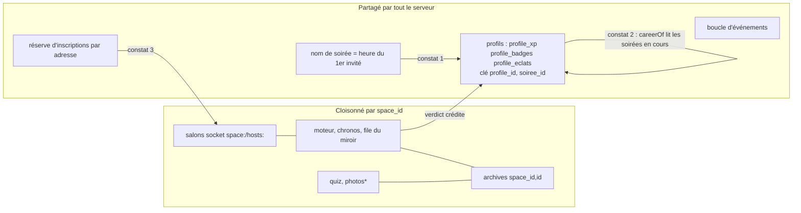

# Plusieurs soirées à la fois : étanches et solides ? — rapport de l'expert fiabilité

## En bref

Le cloisonnement entre espaces **tient** : sur 26 tentatives de fuite (commande
sur la partie du voisin, jeton d'invité présenté ailleurs, `party:watch` croisé,
carte, archive, quiz, pack) aucune ne passe, et aucun des 88 messages reçus par
13 connexions ne porte une marque d'un autre espace. Les redémarrages
(SIGTERM, SIGKILL, disque effacé ou non) reprennent **les deux** parties en
cours, à la même échéance. Trois failles cèdent pourtant, toutes aux endroits
où les espaces partagent quelque chose sans le savoir :
1. **l'identifiant d'une soirée ne porte pas l'espace** alors que l'expérience
   des profils se range par `(profile_id, soiree_id)` : deux soirées nées à la
   même milliseconde se partagent une ligne, et l'expérience de l'une écrase
   celle de l'autre (P2 · S) ;
2. **un palier de carrière compte l'essai en cours d'un autre espace** et le
   garde quand cet essai est effacé (P3 · S) ;
3. **la réserve d'inscriptions par adresse est commune à tout le serveur** :
   60 invités chez A derrière une box, et le premier invité de B derrière la
   même box est refusé (P2 · S).

## Méthode

- Lecture : `sockets.ts` (en entier), `core/space.ts` (registre, clôture,
  essai, fin de soirée), `core/engine.ts` (persistance, miroir, reprise),
  `server.ts` (pages publiques), `api.ts`, `auth/profiles.ts` (crédits,
  paliers, retraits), `core/archive.ts`, `core/budget.ts`.
- Un serveur jetable par script, bases dans
  `export/evaluations/robustesse-espaces/<script>/`, clients `socket.io-client`
  via `server/test/banc.ts`. Machine à moi seul, charge ≈ 0,2.
- Cinq fichiers dans `retours/2026-09-24/experts/scripts/robustesse-espaces/`
  (lancer depuis `server/` : `node --import tsx ../retours/2026-09-24/experts/scripts/robustesse-espaces/<fichier>.ts`) :
  - `commun.ts` — serveur jetable, création d'espaces (compte + activation),
    lecture de la base permanente, registre « TIENT / CÈDE » ;
  - `etancheite.ts` — trois espaces, les fuites, les homonymes, puis les
    couplages (réserve d'inscriptions, boucle d'événements) — 28 essais ;
  - `croisements.ts` — un profil dans deux soirées à la fois, trois fins de
    soirée à la même milliseconde, essai contre clôture, palier — 14 essais ;
  - `collision.ts` — deux soirées de deux espaces sous le même nom — 2 essais ;
  - `redemarrage.ts` — `src/index.ts` en processus enfant, quatre coupures en
    pleine question dans A et B, C en attente — 36 essais.
- Environ trois heures. **Non couvert** : le vrai Turso (lenteurs réseau
  réelles), `online: true` avec `x-forwarded-for` (la réserve y est la même,
  clé par adresse), les navigateurs (aucun écran regardé : la mission est
  côté serveur), plus de trois espaces simultanés à forte charge.

## Constats

### 1. Deux soirées nées à la même milliseconde partagent l'expérience de leurs profils
- **Où** : `server/src/core/archive.ts:44` (`archiveIdOf` : la date et les
  5 derniers chiffres base 36 de l'heure du premier invité — pas l'espace) ;
  `server/src/auth/profiles.ts:327` (`profile_xp` : `PRIMARY KEY (profile_id,
  soiree_id)`), `:921` (l'upsert ne met pas à jour `space_id`), `:994`
  (`DELETE FROM profile_eclats WHERE soiree_id = ?`, sans l'espace).
- **Constat** : les archives sont rangées par `(space_id, id)` — deux
  archives de même nom coexistent sans mal. Mais l'expérience d'un profil,
  ses badges et ses Éclats se rangent sous `soiree_id` seul. Paula joue chez
  A (8 xp) et chez B (2 xp), dont les premiers invités sont arrivés à la même
  milliseconde : il ne lui reste **qu'une ligne, 2 xp, rangée sous l'espace
  A**. Les 8 xp de A sont perdus. Symétriquement, « C'était un essai » chez B
  ne retrouve plus la ligne (`WHERE space_id = B`), et le retrait d'une
  soirée efface les Éclats de la soirée homonyme de l'autre espace.
- **Preuve** : `collision.ts` (horloge figée le temps des deux premières
  arrivées) :
  ```
  après le quiz de A : [{"soiree_id":"2026-09-24-ogzsf","space_id":"340149e0…","xp":8}]
  après le quiz de B : [{"soiree_id":"2026-09-24-ogzsf","space_id":"340149e0…","xp":2}]
  archives : [{"space_id":"2f126edc…","id":"2026-09-24-ogzsf"},{"space_id":"340149e0…","id":"2026-09-24-ogzsf"}]
  CÈDE   même nom — Paula garde une ligne d’expérience par soirée jouée — 1 ligne(s)
  ```
- **Qui ça touche** : un profil qui joue deux soirées nées à la même
  milliseconde. Rare dans une vraie salle (il faut aussi le même jour, et
  l'identifiant boucle toutes les 16 h 47 min à la milliseconde près), mais
  à la portée de n'importe quel script qui entre dans deux soirées vides en
  même temps, et le coût est silencieux et définitif (invariant 10 :
  « la ligne (profil, soirée) est remplacée »). C'est l'invariant 3 qui
  s'arrête au seuil de la base des profils.
- **Statut** : bug confirmé (déclenché ici en figeant l'horloge).
- **Piste** : mettre l'espace dans la clé, pas dans le nom (le nom est dans
  les adresses et les archives) :
  ```sql
  -- profile_xp, profile_badges : PRIMARY KEY (profile_id, space_id, soiree_id)
  -- profile_eclats : ajouter space_id, et l'effacer par (soiree_id, space_id)
  ```
  migration par table neuve comme `soirees_v2` (`archive.ts:331`), l'upsert
  en `ON CONFLICT(profile_id, space_id, soiree_id)`, et `retirerSoiree`,
  `eclatDeLaSoiree`, `xpDeLaSoiree` qui prennent l'espace. La ligne
  `#paliers` garde `space_id = ''`. À défaut (moins sûr) : écrire
  `soiree_id = <space_id>:<id>` côté profils seulement.
- **Priorité · effort** : P2 · M (migration de trois tables).

### 2. Un palier de carrière compte l'essai d'un autre espace, et le garde
- **Où** : `server/src/auth/profiles.ts:1111` (`accorderPaliers` lit
  `careerOf`, qui compte toutes les lignes `profile_xp`, soirées en cours
  des autres espaces comprises — créditées dès le verdict, invariant 10) ;
  `retirerSoireeEntiere` (`:985`) n'enlève que les paliers rangés sous la
  soirée retirée.
- **Constat** : Rémi a une soirée close (A). Il joue ensuite un essai chez A
  et une vraie soirée chez B en même temps. B clôt : sa carrière compte trois
  soirées (A1, l'essai A2 déjà crédité au verdict, B) — L'Habitué tombe, sous
  le nom de B. A efface ensuite son essai : Rémi n'a plus que **deux**
  soirées, mais garde L'Habitué (seuil 3) et ses 10 xp.
- **Preuve** : `croisements.ts`, tour 3 :
  ```
  tour 3 — L’Habitué après la clôture de B [{"badge":"hf:habitue:1","soiree_id":"2026-09-24-ofux8"}]
         · soirées restantes 2 · L’Habitué après l’essai effacé [{"badge":"hf:habitue:1",…}] · total 36
  CÈDE   palier — un essai effacé chez A ne laisse pas L’Habitué (3 soirées) à qui n’en a plus que 2
  ```
- **Qui ça touche** : le joueur qui passe d'une soirée à l'autre le même
  soir (ce que la tablée multi-salons met justement en scène). Un palier
  immérité, un badge et 10 à 40 xp. Dans un seul espace, c'est impossible :
  la seule soirée en cours est celle qui clôt.
- **Statut** : tension avec l'invariant 10 — sa lettre (« un palier ne se
  reprend que si la soirée qui l'a fait tomber est retirée ») est respectée,
  son esprit (« C'était un essai » : « une soirée qui n'a pas eu lieu ne
  laisse rien derrière elle », `space.ts:1097`) ne l'est pas.
- **Piste** : un palier ne se décide que sur des soirées closes. `SpaceRegistry`
  connaît les soirées en cours ; la clôture les passe à `accorderPaliers` :
  ```ts
  // space.ts, crediterCloture
  const enCours = this.deps.soireesEnCours().filter(id => id !== soireeId)
  const paliers = await this.deps.profiles.accorderPaliers(g.profileId, soireeId, this.spaceId, enCours)
  // profiles.ts
  async accorderPaliers(profileId, soireeId, spaceId, sauf: string[] = []) {
    const carriere = await this.careerOf(profileId, { sauf })   // historiqueOf filtré
  ```
  (avec la clé du constat 1, `sauf` porte `(space_id, soiree_id)`).
  L'autre soirée recroisera ce palier à sa propre clôture si elle est gardée.
- **Priorité · effort** : P3 · S.

### 3. La réserve d'inscriptions par adresse est commune à tous les espaces
- **Où** : `server/src/sockets.ts:46` (`JOIN_BURST = 60`, 60 par minute) et
  `:322` (`joinBudget.take(ip)` — la clé est l'adresse seule).
- **Constat** : 60 invités entrent chez A depuis une même adresse ; le
  **premier** invité de B, depuis la même adresse, est refusé : « Trop
  d'inscriptions d'un coup — réessaie dans une minute ». Le commentaire de
  `sockets.ts:30` le sait pour une salle (« toute une salle peut n'avoir
  qu'une adresse ») ; pas pour plusieurs salles derrière la même box : un
  tournoi à plusieurs animateurs, deux salles d'une même entreprise ou
  école, ou des invités 4G de deux fêtes sur la même adresse d'opérateur.
- **Preuve** : `etancheite.ts`, section « Couplages » (connexion par
  l'adresse réseau de la machine, que la réserve compte, au lieu de
  127.0.0.1) :
  ```
  CÈDE   réserve d’inscriptions — 60 invités chez A depuis une adresse, puis le premier invité de B depuis la même
         — 60 entrés chez A ; B refusé : « … Trop d’inscriptions d’un coup — réessaie dans une minute »
  ```
- **Qui ça touche** : à quatre salles de 40 derrière une box, une vague de
  scans sur deux attend une minute — l'animateur de B voit son QR « ne pas
  marcher » à cause d'une salle qu'il ne connaît pas. C'est une soirée qui
  abîme l'accueil d'une autre.
- **Statut** : bug confirmé (couplage entre espaces).
- **Piste** : la clé devient `(adresse, espace)` — le garde-fou contre le
  plaisantin reste entier pour chaque soirée, que borne déjà son plafond —,
  avec une réserve globale plus large par adresse contre l'inondation de
  tout le serveur :
  ```ts
  const cle = `${ip}|${account.id}`
  if (identitiesCreated >= JOINS_PER_SOCKET || !joinBudget.take(cle) || !joinBudgetServeur.take(ip)) …
  // joinBudgetServeur = new Budget(300, 300, { skipLoopback: true })
  ```
- **Priorité · effort** : P2 · S.

### 4. Une réponse accusée peut se perdre sur un SIGKILL avec disque effacé
- **Où** : `server/src/core/engine.ts:22` (`MIRROR_INTERVAL_MS = 2000`) et
  `mirror()` (`:496`).
- **Constat** : coupure SIGKILL + disque effacé 300 ms après une réponse :
  chez A la réponse survit, chez B (`answeredCount 0`) elle a disparu, alors
  que le téléphone avait reçu `ok: true`. C'est le compromis écrit en tête
  d'`engine.ts` (« au pire, un redémarrage perd deux secondes de réponses —
  que leurs auteurs peuvent retaper ») : un SIGTERM vide la file (tenu dans
  les quatre essais), seul un arrêt brutal sur l'hébergeur le déclenche.
- **Preuve** : `redemarrage.ts` :
  `CÈDE   SIGKILL, disque effacé — B : la réponse donnée avant la coupure est gardée — answeredCount 0`.
- **Statut** : friction connue (compromis assumé), pas propre aux espaces.
- **Piste** : le téléphone garde sa dernière réponse accusée
  (`sessionId, qIndex, round, choix`) et la renvoie à la re-présentation si
  la vue reçue dit « pas de réponse » pour la même question encore ouverte —
  le serveur la confirme sans rien réécrire (même valeur) ou l'accepte.
- **Priorité · effort** : P3 · S.

## Mesures et cartes

### Les essais — ce qui a tenu, ce qui a cédé

| Essai | Résultat |
|---|---|
| Homonyme « Camille 🦊 » dans A, B et C — aucune marque « (2) » | tient ×3 |
| `host:command` (next, pause) et `host:endSession` de A sur la partie de B | tient (partie de B intacte) |
| `host:renamePlayer` / `assignPlayer` / `removePlayer` de A sur un invité de B | tient (ni renommé, ni toast, ni exclu) |
| `player:join` chez B avec le jeton d'un invité de A | tient (`unknown-token`, rien créé) |
| la connexion d'un invité de A demande à rejoindre B | tient (« suit déjà une autre soirée ») |
| `party:watch` de B depuis l'écran commun de A | tient |
| `host:hello` avec la session de B sur une connexion qui suit A | tient |
| `player:action` chez B avec le jeton de A (connexion neuve) | tient (`unknown-player`) |
| l'invité de A vise la partie de B | tient (`ended`) |
| `selectPack` chez C avec le quiz de B | tient (« Quiz introuvable ») |
| GET / PUT / duplicate / DELETE du quiz de B avec la session de A | tient ×4 (404) |
| `/s/<B>/joueurs/<invité de A>.json` | tient (404 ; témoin chez A : 200) |
| `/s/<B>/soirees/<archive de A>/recap.json` et `bilan.json` | tient ×2 (404) |
| PUT / DELETE `/api/soirees/<archive de A>` avec la session de B | tient ×2 (404, archive intacte) |
| fouille des 88 messages reçus par 13 connexions | tient (0 marque étrangère) |
| trois quiz en parallèle, un profil dans A et B, un autre dans B et C | tient (une ligne par soirée) |
| clôture A + clôture B + essai C **dans le même tour de boucle** | tient (lignes, totaux, archives, fins au bon téléphone, 0 erreur) |
| essai chez A pendant que B clôt, même profil | tient (seule la ligne de l'essai part) |
| palier gagné grâce à l'essai d'un autre espace | **cède** (constat 2) |
| deux soirées sous le même nom | **cède** (constat 1) |
| 60 inscriptions chez A puis 1 chez B, même adresse | **cède** (constat 3) |
| clôture d'une soirée de 120 chez D pendant une question de B | tient (boucle gelée 55 ms au plus) |
| SIGTERM / SIGKILL, même disque ou effacé, en pleine question dans A et B | tient : même question, même échéance, jetons repris, révélation automatique — sauf 1 réponse (constat 4) |
| C, sans partie, retrouve ses invités après chaque coupure | tient ×4 |

Total : 80 essais, 76 tiennent, 4 cèdent.

### Redémarrages (serveur réel, `src/index.ts`)

| Coupure | Réveil | Parties reprises | Échéance | Révélation après l'échéance d'origine |
|---|---|---|---|---|
| SIGTERM, même disque | 502 ms | 2 | identique | 1 501–1 512 ms |
| SIGKILL, même disque | 501 ms | 2 | identique | 1 505–1 511 ms |
| SIGTERM, disque effacé | 502 ms | 2 | identique | 1 503–1 512 ms |
| SIGKILL, disque effacé | 502 ms | 2 | identique | 1 509–1 512 ms |

Les 1,5 s sont `GRACE_MS` (`quiz.ts:78`), la marge voulue pour les réponses
en route : le chronomètre réarmé tombe à la milliseconde près de celui
d'avant (invariant 5 tenu).

### Boucle d'événements partagée
Espace D : 120 invités, 8 questions à quatre choix, tous répondent. Retard
maximal de la boucle : **91 ms** pendant le jeu, **55 ms** pendant la clôture
(50 ms, sans profil). Un téléphone de B, en pleine question, n'a rien senti
(aller-retour `time:sync` ≤ 50 ms). Le `vctx.memo` et la clôture « en file »
font leur travail. Non mesuré : une clôture à 150 invités **avec profils**,
dont les crédits vont au vrai Turso.

### Ce que les espaces partagent (la carte des couplages)


\* les photos sont publiques par UUID, exception assumée (`api.ts:163`).

## Ce qui marche — à ne pas casser

- **`bindSpace()` une fois pour toutes** (`sockets.ts:199`) : une connexion
  qui a suivi A ne lira jamais B. C'est ce qui a fait tomber à la fois le
  `party:watch`, le `host:hello` et le `player:join` croisés.
- **Le moteur ne connaît que sa partie** : `handlePlayerAction` et
  `requireRunning` comparent l'identifiant à `this.session` — l'identifiant
  du voisin vaut « terminée », sans un mot au voisin.
- **L'espace n'est jamais lu dans la requête** (`api.ts`) : quiz et soirées
  se cherchent par `(session.space_id, id)` → 404 partout.
- **Les salons `player:<uuid>`** sont globaux mais tirés au hasard ; chaque
  geste d'animateur vérifie d'abord l'invité dans **sa** `Party` avant d'y
  émettre (le toast de `host:assignPlayer` n'est jamais parti).
- **Les homonymes restent chez eux** : `nomsAffiches()` ne regarde que sa
  `Party`.
- **`enFile` par espace + ligne remplacée + total recalculé par `SUM`** : trois
  fins de soirée à la même milliseconde n'ont rien perdu ni rien doublé.
- **La reprise** : `wakeRunning()` réveille les seules parties en cours,
  chronos réarmés sur leur échéance persistée, dans tous les espaces à la fois.

## Recommandations, dans l'ordre

1. **Clé de la réserve d'inscriptions : `(adresse, espace)`**, plus une
   réserve large par adresse pour le serveur (constat 3) — P2 · S.
2. **L'espace dans la clé des tables de profils** (`profile_xp`,
   `profile_badges`, `profile_eclats`) et dans leurs effacements (constat 1)
   — P2 · M.
3. **Un palier ne se décide que sur des soirées closes** : exclure les
   soirées en cours des autres espaces de `careerOf` à la clôture
   (constat 2) — P3 · S.
4. **Le téléphone rejoue sa dernière réponse accusée** à la re-présentation
   si la vue ne la connaît pas (constat 4) — P3 · S.
5. **Les tests ci-dessous dans `server/test/`**, pour que l'étanchéité ne
   repose plus sur ce rapport.

### Les tests à ajouter à `server/test/` (écrits ici, pas dans le dépôt)

`server/test/espaces.test.ts` — sur le modèle de `soiree.test.ts` (même
`jouerQuiz`, `clore`, `figurants`). Ils échouent aujourd'hui pour les
constats 1 à 3, passent pour le reste.

```ts
// Plusieurs espaces sur un même serveur : ce que l'un fait ne doit jamais
// toucher l'autre — ni ses invités, ni ses crédits, ni son accueil.
import { after, before, test } from 'node:test'
import assert from 'node:assert/strict'
import { createClient } from '@libsql/client'
import { ProfileStore } from '../src/auth/profiles'
import {
  connexionAnimateur, connecter, cookieDe, creerQuiz, demarrer, ecranCommun, ecrire,
  emitAck, inscrireProfil, instantane, invite, lancerQuiz, attendre, patienter, qcm, ADMIN, type Banc,
} from './banc'

ProfileStore.tirageEclat = () => false

let banc: Banc
before(async () => (banc = await demarrer()))
after(() => banc.close())

/** Un espace de plus, ouvert par l'administrateur et activé. */
async function espace(login: string, slug: string) {
  const admin = await connexionAnimateur(banc.url)
  const cree = await ecrire(banc.url, '/api/admin/accounts', { login, name: login, slug }, admin)
  const { activation, account } = (await cree.json()) as any
  const act = await ecrire(banc.url, '/api/auth/activate', { token: activation.token, password: `mdp-${login}-1234` })
  return { cookie: cookieDe(act), id: account.id as string, slug }
}

test('un animateur ne commande ni la partie ni les invités d’un autre espace', async () => {
  const B = await espace('bruno', 'chez-bruno')
  const hA = await ecranCommun(banc.url, await connexionAnimateur(banc.url))
  const hB = await ecranCommun(banc.url, B.cookie)
  const quiz = await creerQuiz(banc.url, B.cookie, [qcm('B1', ['Oui', 'Non'], 0, 60)])
  const alba = await invite(banc.url, 'Alba', '🦊', { slug: B.slug })
  await invite(banc.url, 'Basile', '🐻', { slug: B.slug })
  const sid = await lancerQuiz(hB, quiz)
  ;(hA as any).emit('host:endSession', { sessionId: sid })
  ;(hA as any).emit('host:removePlayer', { playerId: alba.playerId })
  ;(hA as any).emit('host:renamePlayer', { playerId: alba.playerId, name: 'Pirate' })
  await patienter(300)
  const snap: any = await instantane(hB)
  assert.equal(snap.session?.id, sid, 'la partie de B doit continuer')
  assert.equal(snap.players.find((p: any) => p.id === alba.playerId)?.name, 'Alba')
  // Le jeton d'un invité de B, présenté chez A : refusé, jamais recréé.
  const tel = connecter(banc.url)
  await emitAck(tel, 'party:watch', { slug: ADMIN.slug })
  const res: any = await emitAck(tel, 'player:join', { slug: ADMIN.slug, token: alba.token, name: 'x', avatar: '🦊' })
  assert.equal(res.reason, 'unknown-token')
  assert.equal((await fetch(`${banc.url}/s/${ADMIN.slug}/joueurs/${alba.playerId}.json`)).status, 404)
})

test('deux soirées nées à la même milliseconde gardent chacune l’expérience de leurs profils', async () => {
  const C = await espace('chloe', 'chez-chloe')
  const D = await espace('dora', 'chez-dora')
  const paula = await inscrireProfil(banc.url, 'paula', 'Paula', '🦉')
  const vrai = Date.now
  const T = vrai()
  Date.now = () => T
  const [tC, tD] = await Promise.all([invite(banc.url, 'Témoin', '🐻', { slug: C.slug }), invite(banc.url, 'Témoin', '🐻', { slug: D.slug })])
  Date.now = vrai
  const pC = await invite(banc.url, 'Paula', '🦉', { slug: C.slug, cookie: paula })
  const pD = await invite(banc.url, 'Paula', '🦉', { slug: D.slug, cookie: paula })
  // … jouerQuiz chez C (Paula juste, le témoin faux) puis chez D (l'inverse),
  // clore les deux (voir soiree.test.ts), puis :
  const base = createClient({ url: banc.quizDbUrl })
  const lignes = await base.execute(
    "SELECT space_id, xp FROM profile_xp WHERE soiree_id != '#paliers' AND profile_id = (SELECT id FROM profiles WHERE login = 'paula')",
  )
  base.close()
  assert.equal(lignes.rows.length, 2, 'deux soirées jouées, deux lignes — l’une n’écrase pas l’autre')
  void [tC, tD, pC, pD]
})

test('les inscriptions d’un espace n’épuisent pas la réserve d’un autre', async () => {
  // Par l'adresse réseau de la machine : 127.0.0.1 ne compte pas.
  const { networkInterfaces } = await import('node:os')
  const ip = Object.values(networkInterfaces()).flat().find(i => i?.family === 'IPv4' && !i.internal)?.address
  if (!ip) return
  const E = await espace('emma', 'chez-emma')
  const F = await espace('fanny', 'chez-fanny')
  const net = `http://${ip}:${new URL(banc.url).port}`
  for (let k = 0; k < 60; k++) await invite(net, `E${k}`, '🦊', { slug: E.slug })
  await assert.doesNotReject(invite(net, 'Premier', '🐻', { slug: F.slug }))
})

test('un palier ne se gagne pas sur l’essai en cours d’un autre espace', async () => {
  // Rémi : une soirée close chez A ; puis un essai chez A et une soirée chez B
  // en même temps ; B clôt, A efface son essai.
  // Attendu : deux soirées, et pas de `hf:habitue:1` (voir croisements.ts, tour 3).
})
```
(le deuxième et le quatrième se complètent avec les `jouerQuiz` / `clore` de
`soiree.test.ts` ; le script `croisements.ts` en donne le déroulé exact.)

## Limites

- Sur un fichier `file:` au lieu de Turso : ni latence réseau, ni panne du
  miroir pendant les croisements (déjà couvert par `miroir.test.ts` pour un
  espace, pas pour plusieurs files en panne en même temps).
- La collision du constat 1 est **provoquée** en figeant l'horloge ; sa
  fréquence réelle, à la milliseconde, est très faible — sa gravité vient de
  ce qu'elle est silencieuse et définitive, pas de sa probabilité.
- La réserve d'inscriptions n'a été testée qu'en local (adresse de la
  machine) ; en ligne, la clé vient de `x-forwarded-for` (même code).
- Aucune mesure au-delà de trois ou quatre espaces, ni de clôture à 150
  invités avec profils sur un vrai Turso.
- Rien d'observé dans un navigateur : ce rapport ne dit rien des écrans.
