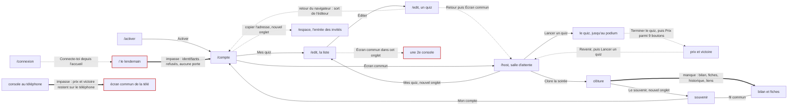
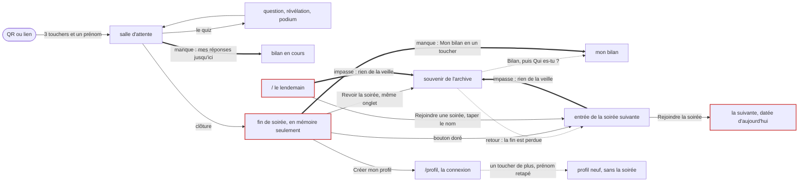
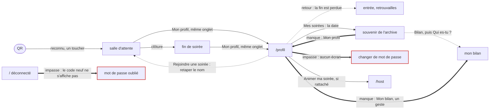
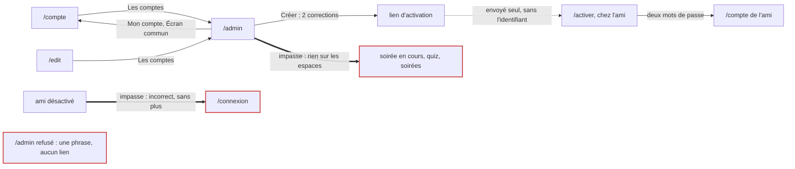

# Parcours, allers-retours et liant — la vérification

*Évaluation du 24 septembre 2026, vérificateur « parcours ». Dépôt au commit `123a1be`, le même que celui des experts.*

Rapports vérifiés : `parcours-animateur`, `parcours-invite`, `parcours-profil` (`export/evaluations/rapports/`), puis `carte-du-site`, `admin-animateurs`, `premiere-visite` et `editeur` (`retours/2026-09-24/experts/`).

Recoupés avec les retours des personnages de la tablée « trois salons » :
- animatrices et animateur : Nadia, Marc, Léa ;
- invités : Inès, Sofia, Malik, Maëlle, Camille M. ;
- en appoint : Camille D., Jeanne, Zoé, Rachid, Bertrand.

---

## En bref

**La question posée.** « Est-ce que ce n'est pas trop d'allers-retours ? Est-ce qu'il manque du liant entre certaines pages ? »

**Pendant la soirée, les allers-retours ne sont pas un problème.**
- Un invité entre en 3 touchers et un prénom.
- La console enchaîne sans qu'on cherche. Nadia : « Le gros bouton doré dit toujours la suite… Je n'ai jamais cherché quoi faire. »
- Un onglet fermé ramène droit dans la question en cours.
- Tout cela est à garder tel quel.

**Il manque du liant à trois endroits, et c'est là que se trouvent toutes les impasses.**
1. **Entre deux moments.** La fin de soirée est une porte à sens unique : elle ne vit qu'en mémoire et ne mène pas au bilan de l'invité. Le lendemain, rien ne ramène à la soirée d'hier, et le seul bouton visible fait entrer dans la soirée suivante.
2. **Entre deux rôles.** L'accueil ignore l'animateur qui n'a pas rattaché de profil : ses identifiants y sont refusés, et aucune page ne mène à `/connexion`. De son côté, `/profil` ignore la soirée qu'on vient de quitter.
3. **Entre deux appareils.** La console tenue au téléphone n'envoie ni les prix ni la victoire à la télé. Brancher la télé coûte deux adresses et deux connexions tapées à la télécommande.

**Ce manque de liant produit un vrai bug** (rejoué, IN-5).
- L'invitée qui revient « voir les résultats » ne trouve qu'un bouton, et il l'inscrit dans la soirée suivante.
- Cette soirée prend alors la date de son arrivée : jouée le 24, elle est archivée « Soirée du 17 septembre ».
- Le bouton doré « Rejoindre la soirée suivante », à la fin de chaque soirée, produit le même effet. Le QR que l'animateur teste quelques jours avant aussi.

**En chiffres**
- **65 constats** après dédoublonnage : 71 constats d'experts et une vingtaine de retours de personnages.
- **16 bugs confirmés.** J'en ai rejoué 7 : 5 sur un serveur jetable et 2 avec le vrai lecteur de listes. Les 9 autres sont lus dans le code à la ligne citée ; leur expert les avait déjà rejoués, ou un personnage les a vécus.
- **9 affirmations non confirmées ou nuancées** et **11 tensions avec un parti pris** (§4).

**Par où commencer** (détail au §7)
1. Les corrections qui ne se discutent pas :
   - PR-1, le code de secours neuf jamais montré sur `/profil` ;
   - IN-5, la date de la soirée ;
   - AN-15, le champ Temps ;
   - AD-1 et AD-2, le formulaire de création d'un compte ;
   - IN-12, un message d'erreur qui reste affiché.
2. Faire de la fin de soirée un carrefour : « Mon bilan » en un toucher, une fin qui survit au retour, une création de profil préremplie.
3. Poser les portes qui manquent : accueil → console, `/profil` → la soirée en cours, clôture → le lendemain.

---

## Méthode

- **Lectures.** Les sept rapports et leurs dossiers, puis les retours des personnages cités plus haut. Chaque bug annoncé est vérifié dans le code, et chaque ligne citée a été relue.
- **Rejeux**, sans l'atelier ni la régie en direct :
  - `export/evaluations/verification/parcours/verif-serveur.ts`, sortie dans `verif-serveur.log`. Il utilise le banc des tests (`server/test/banc.ts`) : bases dans un dossier jetable, horloge du processus décalée. Cinq scénarios, notés A à E. Le serveur est éteint et le dossier effacé à la fin.
  - `export/evaluations/verification/parcours/liste-bavarde.ts`, sortie dans `liste-bavarde.log`. Il appelle le vrai lecteur de listes (`parseImportedQuestions`), une fonction pure.
- **Captures.** Ce sont celles des experts et des personnages ; je n'en ai refait aucune.
- **Statuts utilisés**
  - **Bug confirmé** : le code fait autre chose que ce qu'il promet ; rejoué, ou lu à la ligne.
  - **Impasse** ou **détour confirmé** : un liant qui manque, vérifié.
  - **Friction** ; **idée**.
  - **Tension** : le constat heurte un parti pris, que je nomme.
  - **Non confirmé**.
- **Sources.** Dans les tableaux, « vécu : » désigne un personnage qui a buté dessus. Un constat vu par un expert **et** vécu par un personnage pèse plus.

---

## 1. La vue d'ensemble : la carte du liant

**Lire les cartes**
- Un trait plein est un lien d'un seul geste.
- Des pointillés sont un détour : un écran de plus, le retour du navigateur, ou une adresse à taper.
- Un trait épais est une impasse aujourd'hui, c'est-à-dire le lien qui manque.
- Un cadre rouge marque une page où l'on reste coincé.

### 1.1 L'animateur sans profil rattaché (tout animateur, sa première semaine)

| Passage | Aujourd'hui | Coût | Constat |
|---|---|---|---|
| lien d'activation → `/compte` | lien | 3 gestes | l'identifiant et l'espace ne sont pas dits (AN-12) |
| `/compte` → `/edit` | lien | 1 | — |
| `/compte` → l'entrée des invités | détour | 4 (copier, ouvrir un onglet, coller, fermer) | AN-9 |
| éditeur, quiz enregistré → `/host` | détour | 2 (Retour, puis Écran commun) ; le retour du navigateur sort vers `/compte` | AN-5 |
| `/host` → Mes quiz, Mon compte, Historique, Les chiffres | lien | 1, mais un nouvel onglet à chaque clic | AN-6 |
| `/edit` ouvert par la console → « Écran commun » | détour | 1, et l'onglet devient une 2ᵉ console | AN-6 |
| podium d'un quiz → remise des prix | détour | 2 (Terminer le quiz, puis Prix, parmi 9 boutons) | AN-4 |
| écran de victoire → quiz suivant | détour | 2 (Revenir, puis Lancer un quiz) | AN-4 |
| console du téléphone → télé (prix, victoire) | **impasse** | se lever et tout refaire à la télécommande | AN-7 |
| clôture → souvenir | lien | 1 (nouvel onglet) | — |
| clôture → bilan, fiches, historique | aucun lien | le lendemain, en passant par l'historique | AN-3 |
| bilan → envoyer les liens aux invités | détour | 6 gestes par invité, ou copier l'adresse à la main | AN-3 |
| souvenir → son lien stable | aucun bouton | le menu du navigateur ; et `/<espace>/souvenir` changera de soirée | AN-3 |
| `/` le lendemain → la console | **impasse** | 4 gestes perdus, puis une adresse à connaître par cœur | AN-1 |
| `/connexion` → `/` | sens unique | « Connecte-toi depuis l'accueil », d'où rien ne ramène | AN-1, AN-2 |
| soirée suivante → changer le titre | détour | 7 (Mon compte, 4 champs, Enregistrer, retour) | AN-9 |
| historique → les quiz joués (rejouer, exporter) | aucun lien | passer par « Mes quiz » | AN-11 |
| pages publiques → `/compte` | lien | 1 (fil « Mon compte ») | à garder |
| `/` avec un profil rattaché → `/host` | lien | 1 (« Animer ma soirée ») | à garder |

### 1.2 L'invité anonyme

| Passage | Aujourd'hui | Coût | Constat |
|---|---|---|---|
| QR → salle d'attente | lien | 3 touchers et un prénom (4 en 360 × 640, 2 de plus avec les équipes) | à garder |
| onglet fermé → la question en cours | lien | 0 | à garder |
| salle d'attente → souvenir ou bilan en cours | aucun lien | il faut connaître l'adresse | IN-8 |
| clôture → fin de soirée | lien | 0 ; un téléphone en veille la reçoit à son réveil ; après un redémarrage, **impasse** | IN-1 |
| fin → souvenir | lien | 1, dans le même onglet | IN-1 |
| fin → son bilan | détour | 3 touchers, puis chercher son prénom | IN-2 |
| souvenir → retour à la fin | **impasse** | la fin est perdue | IN-1 |
| fin → créer un profil | détour | la connexion s'ouvre : 1 toucher de plus, prénom retapé, avatar par défaut ; la soirée n'est pas gardée | IN-6 |
| fin → soirée suivante | lien (le bouton doré) | 2 touchers, et la suivante prend la date du jour | IN-3, IN-5 |
| pages publiques → jouer | aucun lien | — | IN-8 |
| `/` le lendemain → la soirée d'hier | **impasse** | il faut taper `/<espace>/bilan` | IN-4 |
| `/<espace>` le lendemain → la soirée d'hier | **impasse** | on arrive sur l'entrée de la suivante, préremplie | IN-4 |
| `/` → rejoindre une soirée | lien, puis une saisie | 1 toucher et le nom exact (« nadia » est refusé) | IN-9 |
| adresse mal tapée → la bonne | détour | le nom à retaper en entier ; les majuscules sont refusées | IN-9 |
| espace A → espace B | détour | 4 à 5 touchers, prénom et avatar à refaire | IN-10 |

### 1.3 Le joueur à profil

| Passage | Aujourd'hui | Coût | Constat |
|---|---|---|---|
| QR → salle d'attente | lien | 1 toucher (les retrouvailles) | à garder |
| salle d'attente → `/profil` | lien | 1, dans le même onglet | — |
| `/profil` → la soirée en cours | détour | « Rejoindre une soirée » redemande le nom ; sinon le retour du navigateur | PR-5 |
| fin → `/profil` | lien | 1, dans le même onglet ; au retour, la fin est perdue (Camille D.) | IN-1 |
| « Mes soirées » → souvenir | lien | 1 (la ligne ne montre que la date) | PR-4 |
| « Mes soirées » → son bilan | détour | 4 gestes, puis « Qui es-tu ? » | PR-4 |
| souvenir ou bilan → `/profil` | aucun lien | le retour du navigateur | PR-4 |
| `/profil` → la carte d'un ami d'hier | impasse | la carte n'existe que pendant la soirée | PR-4 |
| `/` déconnecté → mot de passe oublié | **impasse** (bug) | le code neuf ne s'affiche jamais | PR-1 |
| `/profil` → changer de mot de passe | **impasse** | aucun écran | PR-6 |
| `/` → créer un profil → choisir son avatar | détour | avatar par défaut, à changer ensuite dans « Mon avatar » | PR-2 |
| `/profil` → la console (profil rattaché) | lien | 1 | à garder |
| espace A → espace B | lien | 1 toucher : le profil est reconnu | à garder |

### 1.4 L'administrateur

| Passage | Aujourd'hui | Coût | Constat |
|---|---|---|---|
| `/compte` ou `/edit` → `/admin` | lien | 1 | — |
| `/admin` → créer un compte | lien, puis 2 corrections | l'identifiant se remplit d'une seule lettre ; le tiret ne se tape pas | AD-1, AD-2 |
| `/admin` → le message à envoyer (lien et identifiant) | détour | on n'a que le lien ; l'identifiant est sur le `/compte` de l'ami | AD-4, AN-12 |
| `/admin` → l'état des espaces | impasse | rien : ni soirée en cours, ni quiz, ni soirées | AD-4 |
| `/admin` au téléphone → Lien, Désactiver | détour | un défilement horizontal que rien ne signale | AD-5 |
| ami désactivé → `/connexion` | impasse | « Identifiant ou mot de passe incorrect » | AD-3 |
| `/admin` refusé (non-administrateur) → ailleurs | impasse | une phrase, aucun lien | PV-9 |

### 1.5 Les chiffres des experts, réconciliés

| Parcours | Mesure | Chiffre annoncé | Source | Vérifié, ou réconcilié |
|---|---|---|---|---|
| Animateur, de l'activation au lendemain (2 quiz, 6 invités) | gestes | aujourd'hui 168 (119 hors saisie) ; parcours idéal 111 (62) | parcours-animateur | Le décompte est exact (les sommes du tableau pas à pas se vérifient), mais c'est un pire cas : 36 des 57 gestes du lendemain supposent qu'on envoie **un lien à chaque invité**. Nadia, Marc et Léa ont posté un seul lien, celui où chacun choisit son prénom : 4 gestes environ. Sur ce chemin, le lendemain coûte environ 25 gestes et le total environ 136 (87 hors saisie). Le parcours idéal fait donc gagner **environ 25 gestes (−18 %)**, surtout grâce à la fin de l'impasse de l'accueil, à 5 allers-retours de moins et au bon lien à partager. |
| Animateur | « lendemain contre soirée » | 57 contre 44 | parcours-animateur | Exact dans le pire cas. Sur le chemin des personnages, c'est environ 25 contre 44. Le lendemain ne coûte pas trop de gestes : il coûte **une impasse** (l'accueil) et **un choix de lien** (lequel est stable ?). |
| Animateur | moments « où est-ce que je vais maintenant ? » | 7, et 1 dans le parcours idéal | parcours-animateur | 1 vécu : l'accueil (Léa, à la télécommande). 2 vécus à moitié : de l'éditeur à l'écran commun (Marc, en détour), et le lien à partager (Léa). 2 démentis : au podium et en salle d'attente après un quiz, Nadia n'a « jamais cherché quoi faire », et Marc comme Léa sont allés d'eux-mêmes à « Prix ». 2 non éprouvés : les premiers pas et le titre de la soirée suivante. |
| Invité anonyme | touchers, du QR à la salle d'attente | 3 et un prénom (iPhone) ; 4 en 360 × 640 | parcours-invite ; parcours-profil (« 3 gestes ») ; premiere-visite | Les trois concordent ; 2 de plus avec un écran d'équipe. Sans QR, il faut deviner le nom exact : 2 essais chacune pour Maëlle et Camille M. |
| Invité anonyme | de la fin à son bilan | 3 touchers aujourd'hui, 1 dans l'idéal | parcours-invite | Confirmé dans le code. Même ordre de grandeur depuis `/profil` : 4 gestes (parcours-profil). |
| Invité anonyme | du lendemain à son bilan | impossible aujourd'hui, 1 toucher dans l'idéal | parcours-invite | Confirmé : aucune page ne mène à la soirée d'hier. Maëlle n'y est arrivée que parce qu'elle n'avait jamais fermé l'onglet. |
| Invité | impasses et retours arrière forcés | 3 et 2 | parcours-invite | Ce sont les mêmes que les « sens uniques » de carte-du-site (fin perdue, `/profil` sans retour), comptés autrement. Pour les quatre parcours réunis : **9 impasses distinctes** (§1.6). |
| Joueur à profil | de `/profil` à son bilan | 4 gestes aujourd'hui, 1 ou 2 dans l'idéal | parcours-profil ; parcours-invite (4 touchers et un défilement) | Concordants. Sofia : « un peu étrange quand on vient d'y jouer sous son propre nom ». |
| Joueur à profil | gestes pour créer un profil | 6 (accueil), 7 (entrée), 5 touchers et 2 saisies (salle d'attente) | parcours-profil ; admin-animateurs ; parcours-invite | Concordants. L'accueil est le seul de ces chemins sans avatar (PR-2). |
| Administrateur | gestes pour ouvrir un compte à un ami | 10, dont 2 corrections | admin-animateurs | Confirmé (AD-1, AD-2) : 8 une fois corrigé. |
| Éditeur | gestes pour un quiz de 10 questions | 82 à la main, 9 par liste collée, 2 par import | editeur ; parcours-animateur (6 questions : 49 gestes ; une liste : 7) | Concordants : environ 8 gestes par question à la main. |
| Carte du site | adresses et états sans adresse | 13 et 22 | carte-du-site | Non recompté ; cohérent avec `client/src/routes.ts`. |

### 1.6 Les impasses, réunies

On y reste coincé : ni lien, ni détour raisonnable.

1. L'accueil, pour l'animateur qui n'a pas rattaché de profil (AN-1).
2. La fin de soirée, une fois quittée, rechargée, ou après un redémarrage du serveur (IN-1).
3. La soirée d'hier, le lendemain, pour l'invité anonyme (IN-4).
4. Le profil créé après la clôture : la soirée ne le suit pas (IN-6).
5. Le code de secours utilisé sur `/profil` : le code neuf ne s'affiche jamais (PR-1).
6. Changer le mot de passe d'un profil : aucun écran (PR-6).
7. La carte d'un joueur après la clôture (PR-4).
8. La télé, pour les prix et la victoire, quand on anime depuis son téléphone (AN-7).
9. Les adresses sans issue (PV-9, IN-8) :
   - le souvenir d'un espace inconnu ;
   - `/activer` sans jeton ;
   - `/admin` refusé ;
   - le souvenir « pas encore commencé ».

---

## 2. Les liens manquants qui rapporteraient le plus

Ils sont classés par rentabilité : qui en profite et à quelle fréquence, ce que ça débloque (impasse ou simple détour), rapporté à l'effort.

| # | Départ → arrivée | Qui en profite | Gain | Effort | Parti pris à ne pas froisser | Sources |
|---|---|---|---|---|---|---|
| **1** | **Fin de soirée → « Mon bilan »** (`/<espace>/soirees/<id>/bilan#p=<joueur>`), et une fin qui **survit** au retour et au rechargement | chaque invité, anonyme compris, à chaque soirée | 3 touchers et son prénom à chercher deviennent 1 toucher ; l'impasse « fin perdue » disparaît | S : ajouter `playerId` à `FinDeSoiree` et un lien. S : ranger la fin sur le téléphone (sous try/catch) et la relire au montage de `PlayerApp` | Le chemin anonyme n'a rien à créer. Rien ne quitte le téléphone, et l'identifiant de joueur est déjà public dans le bilan. | parcours-invite (L1, L2) ; carte-du-site 1 ; parcours-profil 4 · vécu : Camille D., Zoé |
| **2** | **Accueil `/` → espace animateur.** Si une session d'animateur est ouverte (`currentMe()`) : « Animer <titre> ». Sinon, un lien discret « J'anime une soirée » vers `/connexion?next=/host`. | tout animateur sans profil rattaché, c'est-à-dire tout nouvel animateur | l'impasse devient 1 geste ; 4 gestes perdus en moins, et plus d'adresse à connaître par cœur | S | L'accueil reste l'écran de connexion au profil. « Rejoindre une soirée » et « Créer un profil » restent visibles sans défiler en 360 × 640 (premiere-visite l'a mesuré avec un bandeau : 529 et 597 px). À l'échec, ne jamais dire « c'est un identifiant d'animateur ». | parcours-animateur 2 ; carte-du-site 3 ; premiere-visite 3 ; parcours-profil 5 · vécu : Léa |
| **3** | **Clôture (console) → « Le bilan », « Les fiches », « L'historique »** ; « Copier le lien » (l'adresse d'archive) sur le souvenir et sur la page du choix du prénom ; « Tous les liens », pour l'animateur | chaque animateur, à chaque soirée, et tous les invités qui recevront le lien | 2 à 4 gestes le lendemain ; surtout, **le lien stable** plutôt que `/<espace>/souvenir`, qui changera de soirée ; −32 gestes pour qui envoie un lien à chaque invité | S pour les boutons ; S-M pour « Tous les liens » (une fonction pure `liensDesBilans` et son test) | Chaque animateur chez lui : « Tous les liens » s'affiche seulement si `useIsHost`. Rien n'est exposé qui ne soit déjà public. | parcours-animateur 1 ; premiere-visite 9 · vécu : Léa · déjà demandé à la tablée du 23 (Nadia, Camille M.) |
| **4** | **`/profil` pendant une soirée → « Retourner à la soirée »** (lu dans `quizz.me.*`) | tout joueur à profil : « Mon profil · niveau N » lui est proposé en salle d'attente | « Quelle soirée ? » et le nom à retaper, ou le retour du navigateur, deviennent 1 toucher | S | Rien ne quitte le téléphone. « Rejoindre une soirée » garde son format. | parcours-profil 8 ; carte-du-site 2 · vécu : Sofia, le 23 **et** le 24 |
| **5** | **Entrée de l'espace et accueil, entre deux soirées → « La dernière soirée : le souvenir, mon bilan »** | tout invité qui revient « voir les résultats » | l'impasse devient 1 toucher ; et plus personne n'entre dans la soirée suivante pour relire la veille, ce qui est la cause d'IN-5 | M : une carte ; « mon bilan » grâce à la fin gardée du lien 1 | « Rejoindre la soirée » doit rester visible sans défiler en 360 × 640 : à mesurer. La carte ne parle que de cet espace. | parcours-invite 1 et 2 (L2 à L4) |
| **6** | **« Mes soirées » → « Mon bilan » ouvert sur soi, avec le titre de la soirée ; pages d'archive → « Mon profil »** | les joueurs à profil, le lendemain | 4 gestes et « Qui es-tu ? » deviennent 1 geste ; plus de retour du navigateur | M : ajouter `joueurId` et `titre` à `SoireeJouee`, retenus au moment du crédit | Invariant 8 : c'est de la relecture, sans aucun avantage de jeu. | parcours-profil 4 ; parcours-invite L7 · vécu : Sofia |
| **7** | **Fin de soirée (anonyme) → création de profil préremplie** avec le prénom et l'avatar du soir (`loadChoix(slug)`), et une phrase qui dit vrai | l'anonyme séduit en fin de soirée | 1 toucher de moins, ni prénom à retaper ni avatar par défaut ; plus de fausse promesse | S | L'absence, pas l'infériorité : une phrase, pas un bandeau. « Réclamer sa soirée » reste à arbitrer (README, « La dimension sociale des profils »). | parcours-invite 3 ; parcours-profil 6 · vécu : Jeanne |
| **8** | **Éditeur → « Projeter ce quiz »**, une adresse par quiz ouvert, et des onglets **nommés** depuis la console | l'animateur, avant et pendant la soirée | 2 gestes deviennent 1 ; le retour du navigateur ramène à la liste ; plus de seconde console | S | L'écran commun reste projeté : tout ce qui sort de la console ouvre un autre onglet, mais toujours le même, nommé. | parcours-animateur 4 et 8 ; carte-du-site 5 et 8 ; editeur 8 · vécu : Marc |

**Juste derrière**
- Salle d'attente → « Mes réponses jusqu'ici » (IN-8).
- Pages publiques → un onglet « Jouer » (IN-8).
- Podium d'un quiz → « Remise des prix » (AN-4).
- Console du téléphone → télé, pour les prix et la victoire (AN-7, M).
- Accueil → les espaces où ce téléphone a joué (parcours-invite L4).

---

## 3. Les constats vérifiés, par parcours

Chaque ligne donne : les sources, le statut, la preuve (`fichier:ligne`, relue, ou un rejeu), la piste, puis la priorité et l'effort. Les chemins de code sont relatifs à `client/src/` pour le client et à `server/src/` pour le serveur, sauf mention contraire.

### 3.1 L'animateur

| # | Constat | Sources | Statut | Preuve | Piste | P · effort |
|---|---|---|---|---|---|---|
| AN-1 | L'accueil n'a pas de porte pour l'animateur sans profil rattaché. Ses identifiants y sont « incorrects ». `/connexion` n'est liée de nulle part, et son aide renvoie à l'accueil. | parcours-animateur 2 ; carte-du-site 3 ; premiere-visite 3 ; parcours-profil 5 · vécu : Léa | **impasse confirmée**. Le refus est exact (deux tables) ; c'est la porte qui manque. Tension : l'accueil est la connexion au profil (§4). | `views/ProfilApp.tsx:49-53` (seul `api.joueur.moi()` est lu) et `:114-121`. Aucun lien vers `/connexion`, seulement des redirections (`views/AccountApp.tsx:24`, `:114` ; `views/AdminApp.tsx:37`). `components/Invitation.tsx:90`. Capture `lea-tele/002`. | lien 2 du §2 | P2 · S |
| AN-2 | `/connexion` refuse le mot de passe du profil rattaché. L'aide est sous le bouton, donc sous le clavier en 412 px. | admin-animateurs 3 | friction confirmée | `auth/routes.ts:68` ; `components/Invitation.tsx:86-92` | Mettre l'aide au-dessus du bouton. (M) Essayer le profil rattaché du même identifiant, avec la même réserve d'essais. | P2 · S (M) |
| AN-3 | La clôture n'ouvre pas le lendemain : elle ne propose que « Le souvenir » et « La soirée suivante ». Le bilan copie un lien à la fois, et seulement en mode « mon bilan ». Le souvenir n'a ni « Copier » ni « Partager ». Les fiches sont en pied du bilan. La carte d'historique n'offre que Souvenir et Bilan. | parcours-animateur 1 ; premiere-visite 9 · vécu : Léa (« il faut deviner quel lien copier ») ; Nadia et Marc (trouvé le lendemain par l'historique) | détour confirmé ; **récurrent** (idées de Nadia et de Camille M. le 23, toujours ouvertes) | `views/HostApp.tsx:610-629` ; `views/BilanApp.tsx:174-183` et `:192-194` ; `views/RecapApp.tsx`, sans bouton ; `views/ArchivesApp.tsx:133-147` | lien 3 du §2 | P2 · S-M |
| AN-4 | Après un quiz, la console ne propose pas la suite. Au podium, « Terminer le quiz » est seul. La salle d'attente montre 9 boutons d'égale importance. Podium, Prix, Victoire et Les chiffres apparaissent dès qu'une équipe existe, et « Clore » dès le premier invité, avant tout quiz. L'écran de victoire n'a pas de « Quiz suivant ». | parcours-animateur 3 | friction confirmée dans le code, mais **non vécue** : Nadia n'a « jamais cherché quoi faire », Marc et Léa sont allés d'eux-mêmes aux prix | `games/quiz/HostView.tsx:499-500` ; `views/HostApp.tsx:1025`, `:483` et `:942-948` | « Remise des prix » en bouton principal au podium ; les boutons de fin de soirée seulement après un quiz joué ; « Quiz suivant » à la victoire | P3 · S |
| AN-5 | De l'éditeur à l'écran commun : « Retour » seul. Le retour du navigateur sort de l'éditeur, vers `/compte`. La liste des quiz ne mène pas à « Mes soirées ». | parcours-animateur 4 ; carte-du-site 8 ; editeur 8 · vécu : Marc | détour confirmé | `views/EditorApp.tsx:705-720` ; aucun `pushState` dans ce fichier | lien 8 du §2 | P3 · S |
| AN-6 | Chaque lien de la console ouvre un nouvel onglet, jamais le même. « Écran commun », dans `/edit` et `/compte`, s'ouvre dans l'onglet courant : un onglet ouvert par la console devient une seconde console. | parcours-animateur 8 ; carte-du-site 5 | friction confirmée (rejouée par carte-du-site : `elodie → /host · onglet2 → /host`) ; les sons doublés ne sont pas confirmés | `views/HostApp.tsx:612-614`, `:1017`, `:1021`, `:1041` et `:1047` (`target="_blank"` sans nom) ; `views/EditorApp.tsx:257` ; `views/AccountApp.tsx:59` | Des onglets nommés (`fiestapp-quiz`, `fiestapp-compte`, `fiestapp-soiree`, `fiestapp-console`), ou « Revenir à la console » quand la page a un `opener` | P2 · S |
| AN-7 | La console tenue au téléphone n'envoie ni « Prix » ni « Victoire » à la télé : il faut se lever. | vécu : Léa (son bug 4) | friction confirmée : un lien qui manque entre deux appareils | `views/HostApp.tsx:428-433` : `openScreen` ne change que l'état local ; seul le jeu passe par le serveur | Diffuser aux autres consoles de l'espace l'écran choisi (podium de soirée, prix, victoire). La remise des prix en spectacle, que demande Marc, s'y grefferait. | P2 · M |
| AN-8 | Allumer la télé : passer par l'accueil, recopier `/host`, puis taper deux identifiants et deux mots de passe accentués à la télécommande. | vécu : Léa | friction confirmée ; AN-1 en retire la moitié | captures `lea-tele/001` à `003` | (M) Appairer la télé avec un code ou un QR, validé depuis le téléphone déjà connecté | P3 · M |
| AN-9 | La soirée suivante garde le titre de la veille, sans le signaler. Le titre se tape en quatre champs. L'adresse de l'entrée des invités n'est pas un lien. La date n'apparaît qu'au souvenir et au bilan. | parcours-animateur 5 · vécu : Nadia (le même nom en trois morceaux) | friction confirmée | `views/AccountApp.tsx:274-307` et `:85` (un `<code>`) ; `dateLine` n'est lu que par `views/RecapApp.tsx:109` et `views/BilanApp.tsx:211` | « La soirée suivante » demande le titre ; un seul champ « Nom de la soirée » ; « Voir l'entrée de mes invités » | P3 · S |
| AN-10 | Le choix du quiz ne dit pas « joué ce soir ». L'enchaînement repasse « au clic » à chaque quiz. | parcours-animateur 6 | friction confirmée | `games/quiz.ts:522` (le titre et le nombre de questions seulement) et `:534` | Retenir l'enchaînement pour toute la soirée (oublié à la clôture), avec son test dans `server/test/` ; `joueCeSoir` sur les cartes du choix | P3 · S |
| AN-11 | L'historique ne relie pas une soirée aux quiz qui y ont été joués (rejouer, exporter). | parcours-animateur 7 | idée | `views/ArchivesApp.tsx:150-206` | Le nom des quiz sur la carte, avec « Rejouer » et « Exporter » | P3 · M |
| AN-12 | Les premiers pas. L'activation ne dit ni l'identifiant ni l'espace, et n'a pas de champ `username` pour le gestionnaire de mots de passe. `/compte` ne dit pas par où commencer. « Crée-le depuis l'accueil » n'est pas un lien. Un lien d'activation déjà servi dit « invalide ». | parcours-animateur 9 ; admin-animateurs 9 et 11 ; premiere-visite 10 | friction confirmée ; l'effet sur le gestionnaire de mots de passe n'est pas confirmé | `views/ActivateApp.tsx:43` ; `views/AccountApp.tsx:58-77` et `:204` | L'identifiant et l'espace sur `/activer` ; « Premiers pas » tant que la bibliothèque est vide ; « Ce lien a déjà servi : connecte-toi » | P3 · S |
| AN-13 | Un nouvel espace n'a aucun quiz, et « Lancer un quiz » répond alors par un toast qui dicte « (/edit) ». | admin-animateurs 5 ; carte-du-site 10 | friction confirmée | `server.ts:252` (`seedLibrary` pour l'espace par défaut seulement) ; `games/quiz.ts:518` | À bibliothèque vide : « Partir d'un modèle » et « Importer le quiz d'un ami » ; « Créer mon premier quiz » à la place du toast | P2 · S-M |
| AN-14 | « Importer un quiz » attend un fichier, alors qu'on cherche « Coller une liste », qu'on ne trouve qu'à l'intérieur d'un quiz. | vécu : Marc | friction confirmée | `views/EditorApp.tsx:247-301` (en-tête de la liste des quiz) | « Coller une liste » aussi sur la liste des quiz, en créant le quiz | P3 · S |
| AN-15 | Le champ « Temps » ne se vide pas : on efface, on tape 45, on obtient « 2045 », ramené à 120 s sans un mot. | parcours-animateur 10 ; editeur 2 · vécu : Nadia, Léa (« 2050 » sur huit questions) | **bug confirmé** | `views/EditorApp.tsx:1559` (`question.duration \|\| DEFAULT_DURATION`) ; `questionProblem` ne contrôle aucune borne. Le même piège, à l'affichage seulement, touche « Temps d'observation » (« 010 », `:1649`), « Invités au plus » (« 020 ») et les points d'un prix libre (« 02 ») (Marc). | Garder le texte tapé, borner à la perte du focus (`blur`), dire « de 5 à 120 s » | P2 · S |
| AN-16 | Le temps d'une liste collée ne fait pas ce que promet l'aide. Le panneau dit qu'une question sans ligne `Temps :` prend « le temps et la catégorie de la question qui les précède ». C'est vrai pour la catégorie, qui suit de bloc en bloc. Mais le lecteur donne à toutes les questions le temps de la **voisine du point d'insertion** (`voisineDe`). Le format copié pour une IA le dit juste (« celui réglé dans FiestApp »), ce qui fait deux textes qui se contredisent. | editeur 4 ; parcours-invite 8 · vécu : Léa, Marc ; Nadia l'a cru juste | **bug confirmé** : l'aide promet ce que le lecteur ne fait pas (CLAUDE.md, « Un réglage de plus à la liste collée »). Rejoué : `[50, 20, 20]`, et `[50, 45, 45]` sous une voisine à 45 s. C'est pour cela que Nadia, qui avait réglé sa première question à la main, y a cru. | `views/EditorApp.tsx:1018` et `:1090-1093` ; `shared/liste.ts:115` ; `shared/library.ts:524` ; `liste-bavarde.log` | Une seule règle, dite pareil aux deux endroits. De préférence, celle que les utilisateurs attendent : `Temps :` vaut pour les blocs qui suivent, comme `# Catégorie`. Elle s'annonce dans `FORMAT_DE_LISTE` et paraît dans son exemple (`liste.test.ts`). | P2 · S |

### 3.2 L'invité anonyme

| # | Constat | Sources | Statut | Preuve | Piste | P · effort |
|---|---|---|---|---|---|---|
| IN-1 | La fin de soirée ne vit qu'en mémoire. Elle se perd au rechargement, au retour, et quand on la quitte par ses propres liens, qui s'ouvrent dans le même onglet. Après un redémarrage, le téléphone lit « On ne te retrouve plus dans cette soirée — rejoins-la ». | parcours-invite 2 ; carte-du-site 1 · vécu : Camille D. (au retour : « Content de te revoir… Entrer dans la soirée ») ; Inès (n'a jamais vu la fin de chez Marc) | **bug confirmé** (rejoué. B1 : réveil sans redémarrage → `soiree-close`, fin reçue. B2 : réveil après redémarrage → `unknown-token`, sans fin.) | `client/src/socket.ts:88-92` (`oublierIdentite` ; la fin reste dans l'état React) ; `client/src/state.ts:97` et `:172-180` ; `server/src/core/space.ts:337` (`dernieresFins`, en mémoire) ; `server/src/sockets.ts:57` et `:295-313` ; capture `carte-du-site-2-fin-perdue.png` | Ranger la fin sur le téléphone (sous try/catch) et la relire au montage. Sur `unknown-token`, quand l'espace a une soirée close (`derniere`) : « Cette soirée est close — revois-la », avec un lien. | P2 · S-M |
| IN-2 | De la fin à son bilan : 3 touchers, puis chercher son prénom. | parcours-invite 2 ; parcours-profil 4 | détour confirmé | `shared/fin.ts:33-64` (aucun identifiant de joueur) ; `components/FinDeSoiree.tsx:177-180` ; `views/BilanApp.tsx:81` (seul le jeton identifie, et il est oublié à la clôture) | lien 1 du §2 | P2 · S |
| IN-3 | « Rejoindre la soirée suivante » est le bouton doré ; « Revoir la soirée » ne vient qu'après. | parcours-invite 6 ; parcours-profil 10 · vécu : Zoé | friction confirmée ; **tension** avec le README, « Entre deux soirées » (« ils n'ont qu'à confirmer pour rejoindre la suivante ») | `components/FinDeSoiree.tsx:174-180` | « Mon bilan » en bouton principal ; la suivante en second, ou seulement si l'écran commun en annonce une | P3 · S |
| IN-4 | Le lendemain, aucun chemin ne mène à la soirée d'hier. L'accueil ne connaît pas les espaces joués. L'entrée de l'espace est celle de la suivante, préremplie. Le souvenir d'hier n'existe qu'à son adresse. | parcours-invite 1 ; carte-du-site 4 | **impasse confirmée** | `views/ProfilApp.tsx:114-121` ; `components/Entree.tsx:71` (un choix retenu mène à l'écran B, prérempli) ; aucune page de jeu ne mène à `/<espace>/souvenir` ; captures `bruno-tel1/020`, `022` et `023` | lien 5 du §2 | P2 · M |
| IN-5 | La soirée suivante prend la date de l'invité le plus ancien, absents compris : une soirée jouée le 24 est archivée « du 17 ». | parcours-invite 1 | **bug confirmé** (rejoué, A) | `server/src/core/archive.ts:69-73` (le minimum des heures d'arrivée) ; `server/src/core/space.ts:239` (`this.party.all()`) ; `verif-serveur.log` | Voir la note ci-dessous. | **P1** · S |
| IN-6 | « Créer mon profil », à la fin de la soirée, ouvre la connexion. Le prénom est vide, l'avatar est celui par défaut, et la soirée ne suit pas. La phrase se lit comme une promesse pour ce soir. | parcours-invite 3 ; parcours-profil 6 · vécu : Jeanne (« c'est très exactement ce que je cherchais ») | **bug confirmé** : le piège que `creer` a corrigé pour la salle d'attente (`components/ProfilForm.tsx:23-28`) reste ici | `components/FinDeSoiree.tsx:186-191` ; `views/ProfilApp.tsx:114-121` (ni `creer`, ni `prefill`) ; captures `bruno-tel1/016` et `chloe-tel2/008` | lien 7 du §2, et un texte qui dit vrai. « Réclamer sa soirée » : L, à arbitrer. | P2 · S |
| IN-7 | Créer un profil entre deux quiz : le lien est tout en bas de la salle d'attente, l'identifiant n'est pas proposé, et le code de secours n'a pas de bouton « Copier ». | parcours-invite 3 | friction confirmée | `views/PlayerApp.tsx:386-397` ; `components/ProfilForm.tsx:70-88`. L'entrée, elle, propose un identifiant (`components/Entree.tsx:48`) et un bouton « Copier » (`:481`). | Faire remonter le lien après un premier quiz, en parlant des points du soir ; proposer un identifiant ; ajouter « Copier » | P3 · S |
| IN-8 | Aucun lien entre le jeu et les pages de la soirée. Rien ne mène du téléphone au souvenir ou au bilan en cours ; rien ne mène des pages publiques à `/<espace>`. « La soirée n'a pas encore commencé » n'offre aucun lien. | parcours-invite 4 ; carte-du-site 4 | détour confirmé | `views/PlayerApp.tsx:375-397` ; `components/SpaceNav.tsx:17-21` ; `views/RecapApp.tsx:94-104` | « Mes réponses jusqu'ici » en salle d'attente ; un onglet « Jouer » dans le fil des pages | P3 · S |
| IN-9 | Les adresses tapées à la main. `/Chez-Bruno` est refusée par le client. Pour `/chez-brunno`, le champ est vide, l'exemple est « demo » et il n'y a pas de bouton « Revenir ». « nadia » ne mène pas à « chez-nadia ». | parcours-invite 5 ; premiere-visite 10 ; carte-du-site 6 · vécu : Maëlle, Camille M. | **bug confirmé** pour la casse ; friction pour le reste | `client/src/routes.ts:42` (`SLUG.test` avant toute normalisation ; `shared/space.ts:8`) ; `components/Rejoindre.tsx:21` et `:49` ; `views/PlayerApp.tsx:231` (sans `onCancel`) | `normalizeSlug` avant le test, puis `replaceState` ; préremplir le nom tapé ; un exemple neutre. **Pas** de noms voisins (invariant 3). | P3 · S |
| IN-10 | Chez un autre animateur, le prénom et l'avatar sont oubliés. | parcours-invite 7 | friction confirmée ; montrer l'écran A une fois par espace est une décision (PARCOURS-ENTREE §10) | `client/src/state.ts:82` (`choixKey`, rangé par espace) | Préremplir l'écran B avec le dernier choix de ce téléphone, tous espaces confondus | P3 · S |
| IN-11 | La fin de soirée d'un invité arrivé après la dernière question dit « 0 joueurs ce soir ». | vécu : Inès | **bug confirmé** (rejoué, C : `rang 0, joueurs 0`) | `server/src/core/space.ts:1044` (repli sur 0 quand il n'y a pas de relevé) ; `components/FinDeSoiree.tsx:75` | Le nombre de joueurs de la soirée, et une phrase sur sa propre participation | P3 · S |
| IN-12 | Après un code de secours réussi à l'entrée, l'erreur de la connexion ratée reste affichée sous le code neuf. | vécu : Malik | **bug confirmé** | `components/Entree.tsx:224` (« J'ai oublié… » ne vide pas `erreur`) et `:499` (l'écran C′ l'affiche) | `setErreur('')` en passant au secours | P3 · S |
| IN-13 | Petites choses : « 1 invité·e·s déjà là » ; « 0 pts · 1ʳᵉ place » avant tout quiz ; la date écrite trois fois au bilan d'une archive. | parcours-invite 8 | les deux premières confirmées ; la troisième non revérifiée | `components/Entree.tsx:260` et `:615` ; `views/PlayerApp.tsx:315` | Accorder au singulier ; pas de rang à 0 point | P3 · S |

**IN-5, en détail** (rejeu A de `verif-serveur.ts`).

Le scénario :
- Mireille entre dans « la soirée » le 17 pour relire la veille, puis repart sans jouer.
- La soirée suivante se joue le 24 avec Bob, Dora et Paula (à profil).

Ce que la date fausse touche :
- **l'identifiant d'archive** : `2026-09-17-qekx0`, donc aussi les adresses du souvenir et du bilan ;
- **la date de l'historique** (`views/ArchivesApp.tsx:167`) et celle affichée sur le souvenir et le bilan de l'archive (`views/RecapApp.tsx:109`, `views/BilanApp.tsx:211`) ;
- **le titre automatique** : la console propose « Soirée du 17 septembre 2026 » à la clôture, et la fin de soirée de chaque téléphone l'affiche. C'est le cas quand l'animateur n'a pas réglé de titre (`titreChoisi`) ;
- **pas** la ligne « Mes soirées » d'un profil, contrairement à ce qu'annonce le rapport. Elle affiche la date du premier crédit (`created_at`, posé à l'insertion : `server/src/auth/profiles.ts:919-921`), ici « 24 septembre 2026 ». Elle mène cependant à l'archive « du 17 ».

Ce qui le déclenche :
- l'invité qui revient le lendemain relire la veille (rejoué) ;
- le **bouton doré de chaque fin de soirée**, suivi de « Rejoindre la soirée ». La soirée suivante porte alors la date de la précédente, et l'historique en montre deux « du 24 » (déduit du code, par le même mécanisme) ;
- le QR testé par l'animateur quelques jours avant la soirée (déduit du code).

Pourquoi P1 plutôt que P2 :
- les déclencheurs sont fréquents ;
- le dommage est permanent : l'identifiant et `heldAt` ne se corrigent plus après coup (parti pris n° 4, « ce qui a été joué se garde ») ;
- la correction est petite.

La piste :
- tirer le nom sur les invités qui ont répondu, avec repli sur tous (la piste de l'expert). On change *qui* compte, pas *quand* : l'invariant 11 reste intact ;
- **ajout du vérificateur** : le constructeur tire aussi le nom au réveil quand des invités sont là sans nom rangé (`server/src/core/space.ts:147-158`). Comme l'hébergeur s'endort justement entre deux soirées, le repli « tous » y figerait encore la date de l'absente. Au réveil, il ne faut tirer le nom que si le journal des réponses n'est pas vide ;
- le test : « un invité arrivé la veille, reparti sans jouer, ne date pas la soirée », dans `server/test/cloture.test.ts`, en décalant `Date.now` comme le fait le script ;
- la phrase du README à réécrire (« L'historique des soirées ») : « c'est la date et l'heure d'arrivée du premier invité qui l'identifient ».

### 3.3 Le joueur à profil

| # | Constat | Sources | Statut | Preuve | Piste | P · effort |
|---|---|---|---|---|---|---|
| PR-1 | Sur `/profil`, « J'ai oublié mon mot de passe » consomme le code, change le mot de passe et ouvre la session, mais ne montre jamais le code neuf. Un second essai répond « incorrect ». | parcours-profil 1 | **bug confirmé** | `components/ProfilForm.tsx:53` teste `mode === 'secours'` avant `recovery` (`:70`), et `:60` range le code sans quitter ce mode. Le serveur rend bien le code (`auth/profileRoutes.ts:374`). Même chemin en salle d'attente : « J'ai déjà un profil », puis « J'ai oublié ». Capture `chloe-tel1/019`. | `setMode('connexion')` avant `setRecovery`, ou tester `recovery` en premier ; ajouter « Copier » ; un titre juste (« Note ton nouveau code ») | P2 · S |
| PR-2 | Le profil créé depuis l'accueil n'a pas d'avatar. Il reçoit d'office `DEFAULT_AVATAR`, l'emoji de fête, qui n'est pas dans la grille : tous les profils nés à l'accueil portent le même. | parcours-profil 2 | **bug confirmé** (rejoué, D : inscription sans avatar → l'emoji de fête). L'entrée tire pourtant un avatar au hasard, « sans ça, tous ceux qui ne touchent à rien arrivent identiques » (`components/Entree.tsx:44`). | `components/ProfilForm.tsx:104` ; `server/src/auth/profiles.ts:701` ; `shared/avatars.ts:14` ; captures `chloe-tel1/004` et `005` | La grille sous le prénom, avec un avatar tiré d'avance ; à défaut, le tirer côté serveur | P2 · S |
| PR-3 | Une même soirée, deux chiffres d'expérience. La fin compte les paliers ; « Mes soirées » ne les compte pas. La somme des lignes ne fait donc pas le total du profil. | parcours-profil 3 | **bug confirmé** (rejoué, E : la fin dit +24, dont deux paliers ; la ligne dit +4 ; total 32, somme des lignes 12) | `server/src/core/space.ts:990` ; `shared/fin.ts:45` (« paliers compris ») ; `server/src/auth/profiles.ts:1241-1242` (la ligne `#paliers` est écartée) | Dire les deux à la fin : « +4 points d'expérience · +20 de paliers de carrière ». Aucune dérivation à toucher. | P3 · S |
| PR-4 | « Mes soirées » ne montre que la date, sans titre, et ne mène qu'au souvenir. Le bilan redemande « Qui es-tu ? ». Rien ne ramène à `/profil`. Après la clôture, plus de carte de joueur. | parcours-profil 4 ; parcours-invite 2 · vécu : Sofia ; Camille D. (a touché son nom au podium du souvenir) | détour confirmé | `views/ProfilApp.tsx:334-357` ; `shared/profil.ts:659-668` (`SoireeJouee` n'a ni titre ni joueur) ; `views/BilanApp.tsx:81` ; `components/SpaceNav.tsx:55-60` ; `server.ts:444-451` | lien 6 du §2 | P2 · M |
| PR-5 | Sur `/profil`, « Ce soir » ignore la soirée en cours : « Rejoindre une soirée » redemande le nom. | parcours-profil 8 ; carte-du-site 2 · vécu : Sofia, le 23 et le 24 | détour confirmé ; **récurrent** | `views/ProfilApp.tsx:167-182` ; `views/PlayerApp.tsx:389` (lien dans le même onglet) | lien 4 du §2 | P2 · S |
| PR-6 | Aucun écran pour changer son mot de passe, ni pour relire son identifiant. | parcours-profil 7 | impasse confirmée : la route existe, pas l'écran | `client/src/api.ts:182` (`motDePasse` est défini, jamais appelé) ; `auth/profileRoutes.ts:287-339` | Un repli « Mon identifiant et mon mot de passe » | P3 · S-M |
| PR-7 | Les retrouvailles ne disent pas chez qui l'on entre, parlent de « badges », et disent « Content de te revoir » au masculin dès la première visite. | parcours-profil 9 | friction confirmée | `components/Entree.tsx:283-304` | Le surtitre de l'espace ; « Te revoilà » ; le niveau seul | P3 · S |
| PR-8 | La fin de soirée tait les prix du palmarès, ne décompose pas l'expérience et ne dit pas le prochain objectif. | parcours-profil 10 · vécu : Jeanne | idée (confirmée : `FinDeSoiree` n'a aucune section de prix) | `components/FinDeSoiree.tsx:121-171` | « Tes prix de la soirée » ; « encore N points pour le niveau suivant » | P3 · S-M |
| PR-9 | Créer un profil depuis l'entrée : l'étape 1 ne dit pas qu'on crée un profil. | parcours-profil 11 | friction confirmée | `components/Entree.tsx:566-660` (même en-tête qu'une entrée sans compte, pied « j'ai un profil ») | « Ton profil · 1/2 » | P3 · S |
| PR-10 | L'animateur à l'entrée de sa propre soirée. Ses identifiants de compte y sont refusés et comptés au verrou `joueur:<identifiant>`. Le mot de passe refusé suit dans la création du profil. Sur `/compte`, « Changer de mot de passe » change celui du compte, sans le dire. | parcours-profil 5 | friction confirmée | `components/Entree.tsx:78-79` (`login` et `password` partagés de l'écran A à l'écran C) et `:558` ; `auth/profileRoutes.ts:172-177` ; `views/AccountApp.tsx:361` | Vider le mot de passe en passant à la création ; écrire « le mot de passe du compte » | P3 · S |
| PR-11 | Une soirée où l'on n'a pas répondu n'apparaît pas dans « Mes soirées ». Le profil a bougé pendant qu'on était ailleurs, sans dire pourquoi (fin manquée). | vécu : Inès | idée. C'est voulu : pas de ligne sans gain. | — | Une ligne « n'a pas joué », sans expérience ; un « Quoi de neuf » | P3 · M |

### 3.4 L'administrateur

| # | Constat | Sources | Statut | Preuve | Piste | P · effort |
|---|---|---|---|---|---|---|
| AD-1 | L'identifiant du nouveau compte se remplit d'une seule lettre. | admin-animateurs 1 | **bug confirmé** | `views/AdminApp.tsx:277` : `if (!login)` n'est vrai qu'à la première lettre ; capture `admin-animateurs-1` | Suivre le prénom tant que l'identifiant n'a pas été retouché ; dire « trop court » | P2 · S |
| AD-2 | Le tiret ne se tape pas dans « Nom dans l'adresse ». | admin-animateurs 2 | **bug confirmé** | `views/AdminApp.tsx:307` (normalisation à chaque touche) ; `shared/space.ts:54` (retire le tiret final) | Normaliser à l'envoi et dans l'aperçu seulement | P2 · S |
| AD-3 | Un compte désactivé ne se dit jamais désactivé, et « Lien » reste proposé sur sa ligne. | admin-animateurs 4 | friction confirmée | `auth/routes.ts:68` (même 401) ; `auth/routes.ts:249-257` (lien créé sans regarder `disabledAt`) | Après vérification du mot de passe : « Ton compte est en pause » ; cacher « Lien » | P3 · S |
| AD-4 | `/admin` ne dit rien de ce qui se passe dans les espaces, et le lien d'activation ne rappelle pas l'identifiant. | admin-animateurs 6 | idée | lu par l'expert | Des colonnes « soirée en cours », « quiz et soirées », « profil rattaché » ; « Copier le message » avec l'identifiant | P3 · M |
| AD-5 | Au téléphone, les boutons Lien, Désactiver et Supprimer de `/admin` sont hors de l'écran. | admin-animateurs 7 | friction (capture) | `admin-animateurs-3-admin-au-telephone.png` | Une carte par compte sous 600 px | P3 · S-M |
| AD-6 | Supprimer un espace garde l'expérience gagnée dans ses soirées. | admin-animateurs 8 | confirmé dans le code ; **tension** avec l'invariant 10 | `server.ts:313-334` (aucun `retirerSoireeEntiere`) | Arbitrer, puis l'écrire (README, fenêtre de suppression) et le figer par un test | P3 · S |
| AD-7 | On ne peut pas se passer un quiz en texte (« Copier en liste »). | admin-animateurs 10 | idée | — | L'inverse de `parseImportedQuestions`, relu par `liste.test.ts` | P3 · M |

### 3.5 La première visite et le partage

| # | Constat | Sources | Statut | Preuve | Piste | P · effort |
|---|---|---|---|---|---|---|
| PV-1 | Un lien partagé n'a aucun aperçu : toutes les adresses rendent le même HTML, avec le même titre et aucune balise `og:`. | premiere-visite 1 | confirmé | `server.ts:548-551` ; `client/index.html` | Des balises posées par le serveur à partir de `auth.bySlug`, sans attendre Turso, et sans aucun prénom | P2 · S-M |
| PV-2 | L'accueil ne dit pas ce qu'est FiestApp, et son onglet s'appelle « Mon profil ». | premiere-visite 2 ; carte-du-site 7 | friction confirmée ; la tension est mesurée compatible (premiere-visite) | `views/ProfilApp.tsx:55` ; `components/ProfilForm.tsx:123` | Un surtitre de marque d'une ligne | P2 · S |
| PV-3 | Tout répond 200 : `robots.txt`, `favicon.ico`, les espaces et les archives inconnus. | premiere-visite 4 | **bug confirmé** (mineur) | `server.ts:548` ; `client/public/`, sans `robots.txt` ni `favicon.ico` | 404 pour un espace inconnu ; un `robots.txt` ; une icône | P3 · S |
| PV-4 | Rien n'empêche l'indexation des soirées. | premiere-visite 5 | avéré dans les en-têtes, non constaté ; **tension** avec le parti pris n° 2 (une diffusion, pas une collecte) | aucun `X-Robots-Tag` | `noindex` partout sauf `/` | P2 · S |
| PV-5 | Trois noms pour une application : FiestApp, « Quizz » et « Quizz Romane 30 ». | premiere-visite 7 | confirmé | `client/public/manifest.webmanifest:2-3` ; `client/public/icone.svg:1` | Un seul nom | P3 · S |
| PV-6 | Une seule icône, en SVG : iOS l'ignore, et un aperçu de lien ne peut pas s'en servir. | premiere-visite 8 | non confirmé sur un appareil ; avéré dans les fichiers | `client/index.html:20` | Trois PNG | P3 · S |
| PV-7 | Six pages sans titre d'onglet. Un même lieu porte cinq noms : Historique, Mes soirées, Soirées, Toutes les soirées, Les soirées. | carte-du-site 7 et 9 | confirmé | `document.title` n'est posé que dans 6 vues sur 12 ; `views/HostApp.tsx:1049`, `views/AccountApp.tsx:69`, `components/SpaceNav.tsx:20`, `components/ArchiveBanner.tsx:21`, `views/ArchivesApp.tsx:39` | Un nom par lieu, un titre par page | P3 · S |
| PV-8 | À chaque étape sans adresse, le retour du navigateur quitte la page : à l'entrée, sur l'accueil, dans l'éditeur. | carte-du-site 8 | confirmé | seuls `views/BilanApp.tsx:67` et `client/src/retour.ts:55` écoutent `popstate` | Un crochet `useEtape()` ; `?quiz=` dans l'éditeur | P3 · M |
| PV-9 | Des adresses sans issue. Un souvenir ou une archive inconnus affichent « Impossible de charger », comme une panne, sous trois onglets qui mènent à la même erreur. Aussi : `/activer` sans jeton, `/admin` refusé, un espace inconnu sans « Revenir ». | premiere-visite 6 et 10 ; carte-du-site 6 | friction confirmée | `views/RecapApp.tsx:48` ; `components/SpaceNav.tsx:66-72` ; `views/ActivateApp.tsx:22-24` ; `views/AdminApp.tsx:33` ; `views/PlayerApp.tsx:231` | Distinguer un 404 d'une panne ; une sortie sur chaque page | P3 · S |

### 3.6 L'éditeur (hors du liant, vérifié pour l'équipe)

| # | Constat | Sources | Statut | Preuve | Piste | P · effort |
|---|---|---|---|---|---|---|
| ED-1 | Une liste « bavarde » (gras, numéros, puces, étoile en fin de ligne) entre avec la première réponse comme bonne réponse, et le quiz se dit « prêt ». | editeur 1 | **bug confirmé** (rejoué : bonne réponse n° 0, « - Sydney » ; l'intitulé garde ses `**`) | `shared/library.ts:555` ; `liste-bavarde.log` | Nettoyer la mise en forme ; accepter l'étoile en fin de ligne ; une question sans étoile n'est pas prête | P1 · S |
| ED-2 | Deux appareils ouverts sur un même quiz : le dernier « Enregistrer » écrase l'autre, en silence. | editeur 3 | **bug confirmé** (dans le code ; rejoué par l'expert) | `server/src/api.ts:87-98` (aucune version comparée) | Envoyer `base` ; répondre 409 si le quiz a changé | P2 · M |
| ED-3 | Aucun réglage « pour tout le quiz ». | editeur 4 · vécu : Nadia, Léa, Marc | friction confirmée | — | « Régler tout le quiz » | P2 · S-M |
| ED-4 | « Enregistrer » et « Annuler » restent en haut d'une page longue de 5 à 45 écrans. | editeur 5 | confirmé | `client/src/styles.css:1639` (l'en-tête ne colle pas) | Un en-tête collant | P2 · S |
| ED-5 | Supprimer une question ne se défait pas. | editeur 6 | confirmé | l'annulation ne connaît que les déplacements (`views/EditorApp.tsx:418`, `:514`) | Annuler aussi une suppression | P3 · S |
| ED-6 | Le vrai/faux se tape à la main. | editeur 7 | idée | — | Un bouton « Vrai/Faux » | P3 · S |
| ED-7 | Un temps ou une cible hors bornes passe sans rien dire. | editeur 9 · vécu : Nadia, Léa | confirmé | `questionProblem` ne regarde pas la durée | « de 5 à 120 s » | P3 · S |
| ED-8 | « Nouveau quiz » crée un quiz d'office, et un quiz importé garde le même nom que l'original. | editeur 10 · vécu : Marc | confirmé | `views/EditorApp.tsx:292` | Effacer un quiz vide abandonné ; « (2) » à l'import | P3 · S |
| ED-9 | Au-delà de 30 questions, chaque frappe redessine tout le quiz. | editeur 11 | mesure de l'expert, non refaite | — | `memo` sur les cartes | P3 · S |

---

## 4. Ce qui n'est pas confirmé, ou heurte un parti pris

### Non confirmé, ou à nuancer

1. **« Mes soirées » d'un profil montre la date fausse** (parcours-invite 1) : non. La ligne affiche la date du premier crédit (`server/src/auth/profiles.ts:919-921`) : le rejeu donne « 24 septembre 2026 ». Seule l'archive vers laquelle elle mène est datée du 17.
2. **« Enregistrer ne confirme rien » sur `/compte`** (Marc) : non. Un toast « Réglages enregistrés » s'affiche (`views/AccountApp.tsx:260`), et Léa l'a lu. Il est éphémère : c'est au plus une friction.
3. **« Une ligne Temps : 45 s vaut pour toutes les suivantes »** (Nadia) : non. Les questions collées prennent le temps de leur voisine (rejoué : `[50, 45, 45]`). Voir AN-16.
4. **Les moments « où je vais maintenant ? » au podium et en salle d'attente** (parcours-animateur 3) : réels dans le code, mais non vécus par Nadia, Marc ni Léa. Rétrogradé de P2 à P3.
5. **Le lendemain à 57 gestes** (parcours-animateur) : exact dans le pire cas seulement, environ 25 sur le chemin des personnages (§1.5).
6. **Les sons doublés de deux consoles ouvertes** (carte-du-site 5) : non confirmé, y compris par l'expert.
7. **Le gestionnaire de mots de passe à l'activation** (parcours-animateur 9) : non confirmé, faute d'un vrai gestionnaire.
8. **Les icônes sur un appareil, l'indexation réelle** (premiere-visite 5 et 8) : avérés dans les fichiers et les en-têtes, non constatés.
9. **Non revérifiés** : la date écrite trois fois au bilan d'archive, les 4 087 px du souvenir en 360 de large, les temps de frappe de l'éditeur à 100 questions.

### Tensions avec un parti pris (à arbitrer, pas à corriger d'office)

1. **Une porte animateur et un bandeau sur l'accueil** (AN-1, PV-2). Parti pris en jeu : CLAUDE.md, « Ce qu'il ne faut pas faire » (l'accueil est un écran de connexion, et le chemin anonyme s'y voit sans défiler). Les deux sont compatibles si la carte est réservée aux sessions d'animateur et le lien reste discret : premiere-visite l'a mesuré.
2. **Répondre « c'est un identifiant d'animateur » à un échec** (premiere-visite 3, piste c). Ce serait énumérer les comptes, contre les garde-fous du README et l'invariant 16 : **à écarter**. Les pistes (a) et (b) suffisent.
3. **« Rejoindre la soirée suivante » en bouton principal** (IN-3). Le README, « Entre deux soirées », le veut ainsi. L'enchaînement de deux soirées le même soir reste possible en second bouton.
4. **Réclamer sa soirée après la clôture** (IN-6, parcours-profil 6). Le README range cette idée parmi « Les chemins ouverts » (« La dimension sociale des profils »), avec une tension explicite avec le parti pris n° 1. L'idempotence (invariant 10) le permettrait techniquement.
5. **Proposer des noms voisins à « Quelle soirée ? »** (Maëlle, Camille M.). Ce serait énumérer les espaces (invariant 3) : **à écarter**. Mieux vaut l'adresse en grand sur l'écran commun pendant le quiz (l'idée de Maëlle).
6. **Supprimer un espace garde l'expérience de ses soirées** (AD-6), face à l'invariant 10.
7. **L'indexation des soirées** (PV-4), face au parti pris n° 2 : c'est de la diffusion, pas de la collecte.
8. **Le bilan nominatif lisible par tous** (Bertrand). Le README le veut public par lien. Les liens « Mon bilan » proposés ici n'ouvrent rien de plus : l'identifiant de joueur est déjà dans la liste publique.
9. **L'écran A montré une fois par espace** (IN-10). C'est une décision de `PARCOURS-ENTREE.md` §10, que la piste garde.
10. **Une ligne « n'a pas joué » dans « Mes soirées »** (PR-11). L'invariant 19 (« rien pour la présence ») l'accepte tant qu'elle ne rapporte rien.
11. **Corriger la date de la soirée** (IN-5). L'invariant 11 reste intact : on change qui compte, pas quand. La phrase du README est à réécrire.

---

## 5. Ce qui est réussi — à garder

- **Le chemin anonyme** : 3 touchers et un prénom. « Jouer sans compte » a le format de « Me connecter », sans `autoFocus`, et reste visible sans défiler en 360 × 640 (trois experts l'ont vérifié). Inès, Sofia, Nadia et Marc donnent 5/5 à l'entrée.
- **Pendant la soirée**, le liant tient :
  - la garde du retour (« Quitter la soirée ? ») ;
  - l'onglet fermé qui ramène dans la question en cours ;
  - le retardataire accueilli sans « Trop tard » ;
  - le bilan qui dit « Arrivée en cours de quiz : les 2 premières questions ne comptent pas pour toi » (Maëlle, Rachid).
- **Le téléphone endormi pendant la clôture** retrouve sa fin à son réveil (rejoué, B1). C'est la brique à étendre (IN-1), pas à refaire.
- **Le profil reconnu d'un espace à l'autre** d'un seul toucher (Inès, Margaux), avec le Globe-trotteur qui récompense exactement ce passage.
- **« Animer ma soirée »** en un toucher, une fois le profil rattaché.
- **Le profil créé entre deux quiz** emporte toute la soirée (+28 points d'expérience fêtés).
- **Le fil des pages publiques** (Souvenir, Bilan, Soirées, et « Mon compte » pour l'animateur seul) : le seul liant qui marche dans les deux sens.
- **Le bilan** : `#p=` dans l'adresse, un retour du navigateur qui marche, et « Copier le lien de ce bilan », qui donne l'adresse d'archive.
- **« Revoir la soirée »** mène au souvenir **archivé**, pas à la page vide de la suivante.
- **La console pendant un quiz** : des boutons qui ne bougent pas, « Suivante : au clic · 5 s · 10 s · 20 s », et le téléphone comme télécommande pendant le jeu (Léa).
- **Le premier quiz en deux clics.** Un quiz écrit dans un autre onglet apparaît au choix sans recharger.
- **« Coller une liste »** (Nadia, Marc et Léa : « LA fonction ») et l'export-import sans perte.
- **Le cloisonnement** : 16 tentatives de l'animateur B contre A, aucune fuite (admin-animateurs).
- **« Cette adresse ne mène à aucune soirée. Vérifie le nom avec ton hôte… »** (Maëlle, premiere-visite).
- **La fin de soirée d'un profil** (+404, la Chouette d'Argent à porter d'un geste). C'est le meilleur moment du parcours, et c'est pour cela qu'elle mérite d'être le carrefour du lendemain.

---

## 6. Les captures les plus parlantes

1. `export/tablee/2026-09-24-atelier/captures/bruno-tel1/014-14-fin-anonyme.png`
   La fin de soirée de Mireille, anonyme et 1ʳᵉ sur 7. Le bouton doré mène à la soirée suivante ; « Revoir la soirée » quitte la page sans retour possible ; « Créer mon profil » ouvre la connexion. Rien ne mène à *son* bilan.
2. `retours/2026-09-24/experts/captures/carte-du-site-2-fin-perdue.png`
   Juste après : « Revoir la soirée », puis retour. La fin a disparu. À sa place, l'entrée de la soirée suivante, préremplie : un toucher suffit pour s'y inscrire, et pour la dater.
3. `export/tablee/2026-09-24-trois-salons/captures/lea-tele/002-tele-02-refus-connexion.png`
   Léa allume la télé à la télécommande. L'accueil refuse ses identifiants d'animatrice sans lui dire où est la bonne porte (1920 × 1080).
4. `export/tablee/2026-09-24-atelier/captures/aline/025-23-soiree-close.png`
   La console à la clôture : « Le souvenir » et « La soirée suivante ». Ni bilan, ni fiches, ni historique, ni lien à copier pour le groupe.

Pour PR-1, la capture de preuve est `export/tablee/2026-09-24-atelier/captures/chloe-tel1/019-secours-nouveau-code.png`. Le formulaire est encore là après un secours réussi, et le code neuf n'apparaît nulle part.

---

## 7. Par où commencer

1. **Ce qui ne se discute pas.** Des corrections de quelques lignes, et un test serveur :
   - IN-5 : la date de la soirée, avec son test et la phrase du README (P1) ;
   - PR-1 : le code de secours sur `/profil` ;
   - IN-12 : l'erreur qui reste affichée ;
   - AN-15 : le champ Temps ;
   - AD-1 et AD-2 : le formulaire de création d'un compte ;
   - IN-11 : « 0 joueurs ».
   
   Hors du liant mais P1 : **ED-1**, la liste « bavarde ».
2. **La fin de soirée comme carrefour** (S à M, surtout côté client) :
   - IN-2 : « Mon bilan » en un toucher ;
   - IN-1 : une fin qui survit, et le message `unknown-token` quand une soirée vient d'être close ;
   - IN-6 et PR-2 : une création de profil préremplie, avec son avatar ;
   - IN-3 : l'ordre des boutons, à arbitrer avec le README.
3. **Les portes** (S) :
   - AN-1 : accueil → console ;
   - PR-5 : `/profil` → la soirée en cours ;
   - AN-3 : clôture → bilan, fiches, historique, et un « Copier le lien » stable ;
   - AN-6 : des onglets nommés.
4. **Le lendemain** (M) :
   - IN-4 : « La dernière soirée » sur l'entrée et sur l'accueil ;
   - PR-4 : « Mes soirées » → « Mon bilan », avec le titre de la soirée ;
   - « Tous les liens » pour l'animateur.
5. **Entre deux appareils** (M) : AN-7, les prix et la victoire à la télé ; AN-8, appairer la télé.

Tout changement de serveur arrive avec son test dans `server/test/` (CLAUDE.md). Les changements du client n'ont pas de banc de rendu : on les regarde en 360 × 640 et en 1366 × 768, avec Chromium, comme le demande CLAUDE.md (« Regarde le rendu »).

---

## Annexe : les rejeux

`verif-serveur.ts`, sortie dans `verif-serveur.log` : un serveur jetable, l'horloge décalée.

| Scénario | Ce qu'on fait | Ce qu'on observe |
|---|---|---|
| D | Inscription d'un profil avec `avatar: ""` | 201, avatar = `DEFAULT_AVATAR` (l'emoji de fête) |
| B1 | Réveil d'un téléphone sans redémarrage du serveur | `soiree-close` : « Cette soirée est close — voici la tienne », fin reçue |
| B2 | Réveil après un redémarrage | `unknown-token` : « On ne te retrouve plus dans cette soirée — rejoins-la », aucune fin |
| A | Mireille entre le 17 ; la soirée est jouée le 24 | En cours : `2026-09-17-qekx0`, « Soirée du 17 septembre 2026 ». La console propose ce titre. La fin de Bob et l'historique le reprennent (« daté du 17 septembre »). La ligne de Paula dans « Mes soirées » affiche « 24 septembre 2026 ». |
| C | Inès arrive après la dernière question | Sa fin : `rang 0, joueurs 0`, donc « 0 joueurs ce soir » |
| E | Paula joue sa 3ᵉ soirée, chez un 2ᵉ hôte | Sa fin : +24 (L'Habitué et Le Globe-trotteur, Bronze). Sa ligne : +4. Total du profil 32, somme des lignes 12. |

`liste-bavarde.ts`, sortie dans `liste-bavarde.log` : le vrai lecteur de listes.

| Entrée | Résultat |
|---|---|
| `**1. Quelle est la capitale de l'Australie ?**` puis `- Sydney`, `- Canberra *`, `- Perth` | intitulé gardé avec ses `**` ; réponses gardées avec leurs `- ` ; bonne réponse n° 0 (Sydney) ; 1 question « sans étoile » |
| Trois questions, `Temps : 50 s` sur la première seulement | `[50, 20, 20]` sans voisine ; `[50, 45, 45]` sous une voisine à 45 s |
