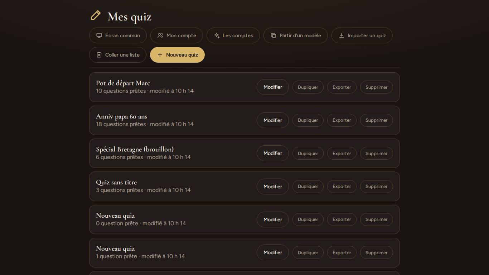
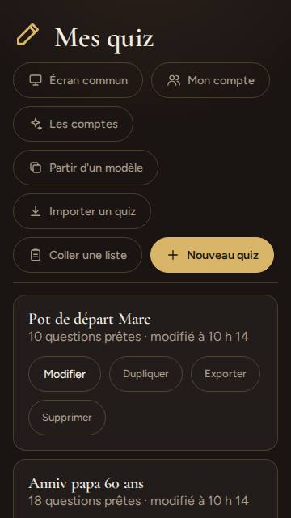
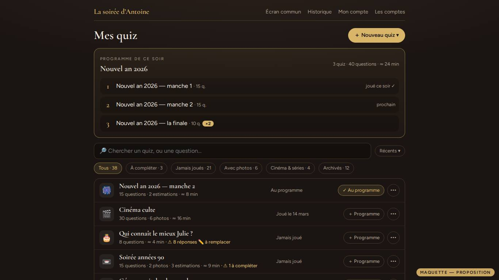
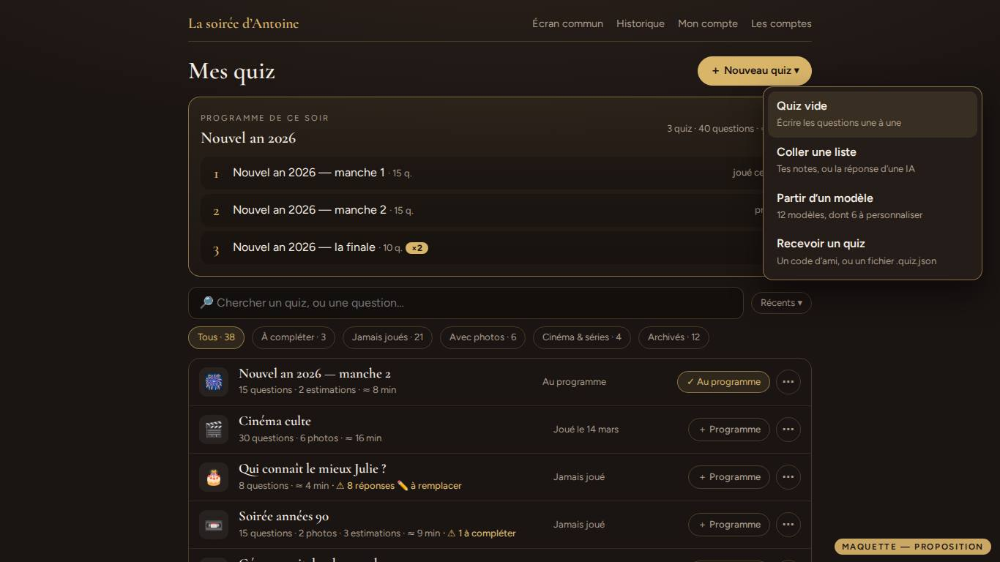
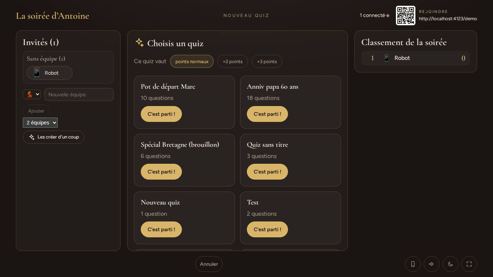
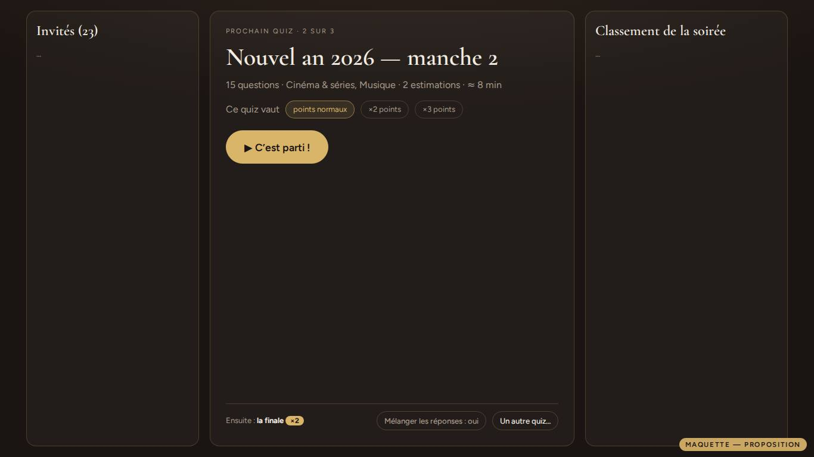
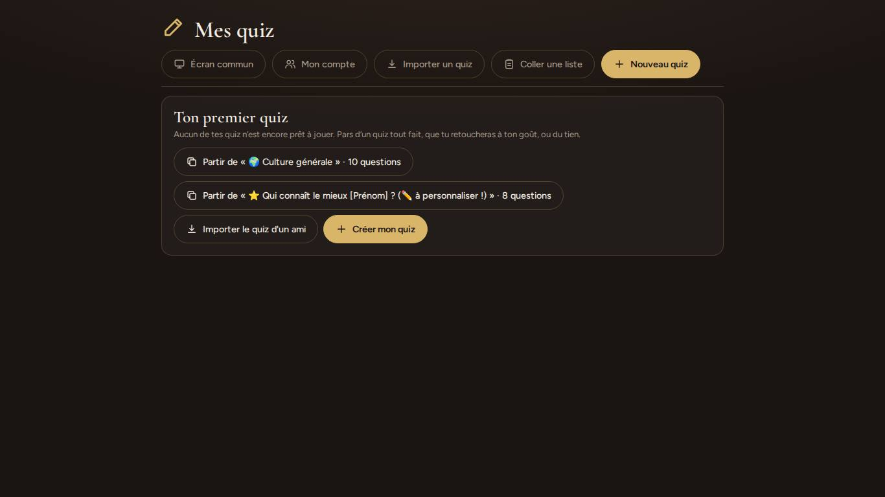
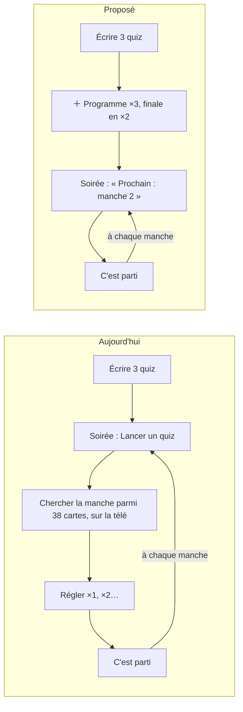
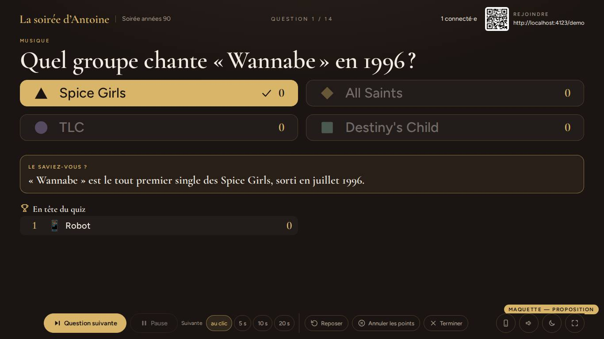

# La gestion des quiz — rapport d'expert, 25 septembre 2026

La demande : prendre le rôle d'un expert de l'interface de gestion des quiz
(« Mes quiz », l'éditeur, le choix du quiz à la soirée) et dire ce qui peut
s'améliorer. Trop de quiz, est-ce gênant — faut-il une arborescence ? Trop de
boutons ? Pas assez direct ? Que manque-t-il — une bibliothèque de départ, le
partage à tous, un mode privé ou public ? Faut-il fusionner des quiz, rendre
les questions aléatoires ? Et au moins vingt idées venues en écrivant soi-même
des quiz. **Tout n'est pas bon à prendre** : chaque proposition, les tiennes
comme les miennes, reçoit un verdict.

Plan : [En bref](#en-bref) · [Méthode](#méthode) ·
[Ce qui marche](#ce-qui-marche--à-ne-pas-casser) ·
[Tes sept questions](#tes-sept-questions-une-à-une) ·
[Constats](#les-constats) ·
[Trente idées nées en écrivant mes quiz](#trente-idées-nées-en-écrivant-mes-quiz) ·
[Ce que je déconseille](#ce-que-je-déconseille) ·
[Feuille de route](#feuille-de-route-proposée) · [Limites](#limites)

## En bref

**L'éditeur d'une question est mûr ; ce qui est au-dessus ne l'est pas.** Deux
tablées ont poli l'écriture — liste collée, format pour une IA, brouillon qui
ne perd rien, conflit entre deux appareils, « Régler tout le quiz », Vrai/Faux,
annulation. Mais la **bibliothèque** est restée une liste plate, triée par
date de modification, sans recherche ni tri ni filtre, et le **passage du quiz
préparé au quiz joué** passe par un choix parmi *tous* les quiz — affiché sur
l'écran commun, devant la salle.

Mesuré sur une bibliothèque « d'un an » (40 quiz) : **« Mes quiz » fait
5,2 écrans au portable et 13,3 au téléphone, avec 167 boutons** ; au téléphone,
l'en-tête prend 57 % du premier écran. **À la soirée, le choix du quiz montre
6 cartes sur 38 et fait défiler la télé** — « Test », « Spécial Bretagne
(brouillon) », « Anniversaire Julie — 30 ans (copie) » compris, lisibles par
toute la salle quand on anime sans télécommande.

Les trois améliorations qui rapporteraient le plus :

1. **Un programme de soirée** — les quiz de ce soir, dans l'ordre, avec leur
   multiplicateur ; la console dit « Prochain : manche 2 », un bouton, c'est
   parti. C'est la réponse à « pas assez direct » *et* à « l'arborescence » :
   le seul regroupement qui compte, c'est la soirée. (P2 · M)
2. **Une bibliothèque qui se cherche** : un champ de recherche (titres *et*
   questions), un tri, des filtres qui se dérivent sans rien saisir (à
   compléter, jamais joué, avec photos, catégories), « Archiver », et les
   gestes rares rangés sous « ⋯ ». (P2-P3 · M)
3. **Le mélange des réponses au lancement** : l'application avertit déjà « la
   bonne réponse est la première dans 6 QCM sur 10 » — mon propre quiz l'a
   déclenché —, elle peut en faire le remède. (P2 · S-M)

Puis, par ordre de rentabilité : des modèles de départ **personnels** (EVJF,
mariage, anniversaire…) avec « Pour qui ? » ; l'**anecdote** à la révélation ;
la **vue plan** de l'éditeur au téléphone ; le partage par **code** entre
animateurs d'un même serveur.

**Ce que je déconseille** : une arborescence de dossiers, un quiz « public »
en direct, la fusion de quiz, le mélange des questions par défaut, une IA
branchée sur le serveur. Les raisons sont plus bas.

## Méthode

- **Lu dans le code** : `client/src/views/EditorApp.tsx` en entier,
  `shared/library.ts`, `shared/liste.ts`, `shared/echange.ts`,
  `shared/archive.ts`, `server/src/api.ts`, `server/src/core/quizStore.ts`,
  `server/src/core/seed.ts`, le choix du quiz dans `server/src/games/quiz.ts`
  et `client/src/games/quiz/HostView.tsx`, les deux modèles de
  `server/content/quiz/`, le README (« Écrire ses quiz », « La direction ») et
  le rapport de l'expert éditeur du 24 septembre
  (`retours/2026-09-24/experts/editeur.md`).
- **Un serveur jetable** (bases dans un dossier temporaire), le client
  construit, un Chromium piloté par Playwright, en **1366 × 768** (le portable
  branché à la télé) et en **360 × 640** (le téléphone), et un invité robot
  (`server/scripts/fake-player.mjs`) pour pouvoir lancer un quiz.
- **Une bibliothèque d'un an** : aux deux modèles livrés, j'ai ajouté 38 quiz
  aux titres qu'on voit vraiment chez un animateur — manches d'un nouvel an,
  anniversaires et leur « (copie) », « Test », trois « Nouveau quiz »
  abandonnés, « Spécial Bretagne (brouillon) ».
- **Écrit moi-même, comme un animateur** :
  1. « Qui connaît le mieux Julie ? » à partir du modèle livré ;
  2. « Soirée années 90 » : quinze questions tapées dans mes notes, collées
     par « Coller une liste », deux photos jointes dont une qui disparaît ;
  3. ce quiz passé à un ami (Bob) par « Exporter » → fichier → « Importer » ;
     la bibliothèque vide d'une amie (Zoé) au téléphone ;
  4. ce quiz lancé à l'écran commun, joué jusqu'à la révélation.
- **Des maquettes** de ce que je propose, aux couleurs et aux polices de
  l'application : elles portent toutes le bandeau « Maquette — proposition »,
  **rien n'en existe dans le code**.
- Les scripts sont dans `scripts/` (à rejouer sur un serveur jetable, mode
  d'emploi en tête de `scripts/outils.mjs`) ; les captures dans `captures/`.
- **Pas couvert** : de vrais animateurs, un vrai téléphone, une vraie IA, un
  lecteur d'écran, une bibliothèque de plus de cent quiz — et surtout **le
  nombre réel de quiz par espace en production**, que je n'ai pas (voir
  [Limites](#limites) : c'est la première chose à mesurer).

**Le rapport du 24 septembre est presque entièrement appliqué** : liste
« bavarde » nettoyée, champ Temps qui se vide, en-tête collant, « Régler tout
le quiz », conflit entre appareils (409), bouton Vrai/Faux, suppression qui se
défait, adresse par quiz (`/edit?quiz=`), bornes dites, import homonyme
numéroté, cartes mémoïsées. Il en reste deux morceaux, confirmés aujourd'hui :
le quiz vide abandonné (constat 2) et les blocs ignorés qu'on ne nomme pas
(constat 8). Ce rapport ne refait pas son travail : il regarde **au-dessus de
la question**.

## Ce qui marche — à ne pas casser

- **« Coller une liste » et « Copier le format complet »** : le meilleur outil
  de création de l'application, et unique face aux concurrents — l'IA de son
  choix, gratuite, et une lecture tolérante (gras, puces, lettres, étoile en
  fin de ligne) qui **refuse de deviner** une bonne réponse. Mes quinze
  questions sont entrées du premier coup, photos comprises, estimations lues
  « **1995** », « **236** épisodes ».
- **Rien ne se perd** : brouillon dans le navigateur, attente du réveil du
  serveur, conflit entre deux appareils, annulation du dernier geste.
- **L'aperçu fidèle**, photo « mémoire » comprise, et la loupe.
- **L'export complet** (photos en clair, d'un serveur à l'autre) : c'est la
  seule voie qui traverse les serveurs, elle doit rester.
- **La copie exacte du quiz joué**, gardée avec la partie puis dans
  l'archive : retoucher la bibliothèque ne change pas le passé. C'est elle qui
  rend possibles, sans risque, le mélange des réponses et les statistiques par
  question proposés plus bas.
- **Les catégories fixes** : elles permettent des filtres sans rien saisir.
- **L'avertissement « la bonne réponse est la première »**
  (`shared/library.ts:270`) : la bonne intuition — il reste à en faire le
  remède.

## Tes sept questions, une à une

| Ta question | Verdict | En une phrase |
|---|---|---|
| Trop de quiz, c'est embêtant ? | **Oui**, mesuré | 40 quiz = 5 écrans, 167 boutons, et un choix de 38 cartes sur la télé |
| Une arborescence ? | **Non** | Recherche, tri, filtres dérivés, archives — et un seul niveau de regroupement : la soirée |
| Trop de boutons ? | **Oui**, à trois endroits | 7 dans l'en-tête, 4 par quiz, 22 par question — il faut une hiérarchie, pas moins de fonctions |
| Pas assez direct ? | **Oui**, entre « c'est prêt » et « on joue » | Le programme de soirée |
| Une bibliothèque de départ ? | **Oui, mais** petite, soignée, et surtout personnelle | Une douzaine de modèles, dont six à personnaliser, et « Pour qui ? » |
| Partager à tous ? Privé/public ? | **À quelqu'un : oui** ; **à tous : par copie publiée**, jamais un quiz public en direct | Un code de partage, puis un catalogue du serveur tenu par l'administrateur |
| Fusionner des quiz ? | **Non** tel quel | Deux besoins derrière : enchaîner (le programme) et piocher des questions (« Ajouter depuis un autre quiz ») |
| Rendre aléatoire ? | **Les réponses : oui. Les questions : en option**, et surtout en tirage | Mélange au lancement, pareil pour toute la salle ; tirage de N questions dans un gros quiz |

### 1. « Trop de quiz, c'est embêtant ? » — oui. « Une arborescence ? » — non.

**Ce que coûte une grande bibliothèque**, mesuré :

| | 2 quiz | 40 quiz |
|---|---|---|
| « Mes quiz », 1366 × 768 | 1 écran | **3 980 px = 5,2 écrans**, 167 boutons visibles |
| « Mes quiz », 360 × 640 | 1 écran | **8 542 px = 13,3 écrans** ; le premier quiz à 364 px |
| Choix du quiz, écran commun | 2 cartes | **38 cartes, 6 entièrement visibles**, un cadre de 3 309 px qui défile dans 610 |
| Choix du quiz, télécommande | — | **7 071 px = 11 écrans** |

Trois gênes distinctes, et aucune ne se règle par des dossiers :

- **Retrouver.** Aucune recherche, et l'ordre est celui de la dernière
  modification (`server/src/core/quizStore.ts:103`) : corriger une faute fait
  remonter un quiz en tête, et les modèles coulent au fond. Retrouver « la
  question sur la Macarena » demande d'ouvrir les quiz un par un.
- **Choisir, à la soirée.** Voir la question 3.
- **Faire le ménage.** Pas d'archive : on garde tout ou on supprime pour de
  bon. Et les « Nouveau quiz » vides s'accumulent tout seuls (constat 2).

**Pourquoi pas une arborescence.** (1) Le volume : un animateur de soirées a
vraisemblablement quelques dizaines de quiz, pas des milliers (à mesurer, voir
[Limites](#limites)) ; un arbre coûte un clic par niveau et une
décision de classement à chaque création (« où je le range ? ») — c'est
l'inverse de « plus direct ». (2) Un quiz appartient à plusieurs groupes à la
fois : « Noël 2025 », *et* « culture G », *et* « avec photos » ; un dossier
oblige à choisir. (3) Au téléphone, un arbre, c'est un fil d'Ariane et des
retours arrière dans 360 px. (4) Le regroupement qui compte vraiment, c'est
**la soirée** — et il a besoin d'un *ordre*, qu'un dossier n'a pas.

**À la place, dans cet ordre** :

1. **Chercher** : un champ qui filtre les titres *et le texte des questions*
   (« Macarena » trouve « Soirée années 90 »). Côté client, sur ce que
   `GET /api/quizzes` renvoie déjà — il suffit d'y ajouter les intitulés, ou
   une route de recherche bornée à l'espace.
2. **Trier** : récents (modifiés), récemment joués, A → Z — le choix retenu
   par le navigateur (sous try/catch, comme tout stockage).
3. **Filtrer par ce qui se dérive déjà**, sans rien saisir : « À compléter »
   (`readyCount < questionCount`), « Jamais joués », « Avec photos », « Avec
   estimations », et les **catégories dominantes** — la liste fixe des douze
   catégories rend ce filtre gratuit et juste chez tous les animateurs.
4. **Archiver** plutôt que supprimer : le quiz sort de la liste et du choix de
   la soirée, sans disparaître.
5. **Un seul niveau de regroupement, et c'est la soirée** : les programmes
   (question 3). Un programme nommé — « Nouvel an 2026 » — reste après la
   soirée : c'est ton « dossier », mais ordonné, et un quiz peut être dans
   plusieurs.

Seulement si, une fois tout cela fait, le besoin revient : des **étiquettes**
libres à un niveau (un quiz peut en porter plusieurs). Jamais de dossiers
imbriqués.

### 2. « Trop de boutons ? » — oui, à trois endroits

- **L'en-tête de « Mes quiz »** : sept boutons de même poids — Écran commun,
  Mon compte, Les comptes, Partir d'un modèle, Importer un quiz, Coller une
  liste, Nouveau quiz (`EditorApp.tsx:346-413`). Au téléphone, six lignes :
  le premier quiz commence à 364 px sur 640. **Proposition** : la navigation
  (Écran commun, Historique, Mon compte, Les comptes) dans une barre fine en
  haut, comme `SpaceNav` sur les pages publiques ; les quatre façons de
  commencer sous **un seul bouton « Nouveau quiz ▾ »**, chacune avec sa ligne
  d'explication — « Quiz vide », « Coller une liste (tes notes, ou la réponse
  d'une IA) », « Partir d'un modèle », « Recevoir un quiz (un code ou un
  fichier) ». On ne cache rien : la tablée cherchait « Coller une liste » en
  arrivant, il reste à un clic, et mieux expliqué.
- **Chaque ligne de quiz** : quatre boutons — Modifier, Dupliquer, Exporter,
  Supprimer — soit 160 pour 40 quiz, et le titre ne s'ouvre pas au clic.
  **Proposition** : la ligne entière ouvre le quiz ; *un* geste contextuel à
  droite (« ＋ Programme », ou « ⚠ 2 à compléter » quand il en manque) ; le
  reste sous « ⋯ » — Dupliquer, Partager/Exporter, Archiver, Supprimer.
  Supprimer n'est plus à un clic de Modifier.
- **Chaque carte de question** : 22 commandes, 377 px au portable et 796 px au
  téléphone — quinze questions font 8,5 écrans au portable et **20 au
  téléphone**. Le type (QCM / Estimation / Vrai-Faux) mérite sa place ; les six
  gestes de sa barre (↑, ↓, ＋, dupliquer, aperçu, supprimer) peuvent tenir
  dans une barre plus discrète ou un « ⋯ », et surtout **une vue « Plan »**
  (constat 9) rend la carte complète rare.

La nuance : il ne s'agit pas d'enlever des fonctions, mais de ne pas toutes les
montrer au même niveau. Un bouton principal par écran, les autres à un geste.

### 3. « Pas assez direct ? » — oui, entre « c'est prêt » et « on joue »

Aujourd'hui, pour un nouvel an en trois manches : on écrit trois quiz ; le
soir venu, **Lancer un quiz → le multiplicateur → trouver la bonne carte
parmi 38** (6 visibles, rangées par date de modification) **→ C'est parti** ;
et l'on recommence à chaque manche, en se souvenant de l'ordre et du ×2 de la
finale. Sans télécommande, **tout cela se passe sur la télé** : la salle lit
la liste (`HostView.tsx:282`), et le titre du quiz reste ensuite dans le
bandeau pendant toute la partie (`HostApp.tsx:790`).

**Le programme de la soirée.** Dans « Mes quiz », « ＋ Programme » sur un quiz
l'ajoute à la soirée ; on range, on règle le multiplicateur de chacun (la
finale en ×2). À la console, la phase de choix devient **« Prochain quiz :
Nouvel an — manche 2 (2 sur 3) »**, sa durée estimée, ses catégories, le
multiplicateur déjà réglé, et un seul bouton. « Un autre quiz… » garde
l'improvisation, avec la recherche. Le programme est nommé et reste après la
soirée : il sert de « dossier » (question 1).

Côté code, c'est modeste : la commande `selectPack` ne change pas (identifiant
et multiplicateur) ; le programme vit dans la base permanente, par espace, et
n'arrive qu'aux **écrans d'animateur** (`enPlusPourLesEcrans`, invariant 4) —
jamais aux téléphones, puisqu'il annonce les titres à venir. La liste `packs`
de la phase de choix se range programme d'abord ; `joueCeSoir` existe déjà
(`server/src/games/quiz.ts:607`).

Deux gestes directs de plus, bon marché : **« 14/15 prêtes » cliquable**, qui
emmène à la question qui manque (aujourd'hui, 8,5 écrans à parcourir au
portable, 20 au téléphone) ; et **« ＋ Programme » dès la ligne du quiz**.

### 4. « Une bibliothèque de départ ? » — oui, mais petite, soignée, et personnelle

Aujourd'hui, un nouvel animateur voit **deux modèles**. « 🌍 Culture générale »
n'a ni catégorie, ni estimation, ni photo, et un seul vrai/faux : il ne montre
pas ce que l'application sait faire. « ⭐ Qui connaît le mieux [Prénom] ? » est
la meilleure idée du dépôt — un quiz qu'aucun site de trivia ne peut écrire à
ta place — mais il s'ouvre **« 8/8 prêtes » avec ses 24 réponses « Ville A ✏️ »**
(constat 3), et son titre, « (✏️ à personnaliser !) » compris, partirait tel
quel dans le bandeau de la télé.

**Proposition** — une douzaine de modèles dans `server/content/quiz/`, pas
davantage :

- **Six à personnaliser**, le vrai terrain d'une fête : « Qui connaît le mieux
  [Prénom] ? » (existant), EVJF / EVG, Mariage (les mariés), Anniversaire,
  Pot de départ, Noël en famille. Des intitulés à trous, et des réponses que
  seul l'animateur connaît.
- **Cinq ou six thématiques qui montrent l'outil** : culture générale *avec
  catégories*, estimations folles (que des « = »), vrai ou faux express (15 s),
  un quiz photo (photos libres de droits dans `server/content/quiz/images/`,
  dont une qui disparaît), un quiz pour les 8-12 ans.
- **Des règles pour chaque modèle** : faits vérifiés (une source par
  question, dans le fichier), intemporels (jamais « le champion en titre »),
  catégorisés, bonne réponse répartie entre les cases, 10 à 15 questions,
  emojis d'avant Unicode 13 (le test `emojis.test.ts` les couvre déjà).
- **« Pour qui ? »** à la copie d'un modèle personnel : un prénom et un accord
  (elle / il), et « [Prénom] », « il/elle », « né·e » sont remplacés partout,
  titre compris. En personnalisant le modèle à la main, j'ai fait **35 gestes
  et tapé ~556 caractères avant même de penser aux vraies réponses** ; neuf de
  ces gestes — le titre et les huit intitulés — n'en font plus qu'un, et aucun
  « [Prénom] » ne peut plus rester en route.
- **Plus tard** : l'administrateur promeut l'un de ses quiz en « modèle du
  serveur » depuis l'interface, au lieu d'écrire un JSON dans le dépôt — c'est
  la même étagère, remplie autrement (question 5).

**Ce que je ne ferais pas** : une grande banque de questions de culture
générale livrée avec l'application. Des centaines de faits à vérifier et à
tenir à jour, pour un contenu que le format copié pour une IA produit déjà
mieux, gratuitement, sur le thème qu'on veut.

### 5. « Partager un quiz à tous ? Mode privé ou public ? » — à quelqu'un : oui ; à tous : par copie publiée, jamais par un quiz public

Aujourd'hui : « Exporter » → un `.quiz.json` dans les téléchargements → l'envoyer
par messagerie → l'ami : « Importer un quiz » → choisir le fichier. Ça marche
(tout voyage, photos comprises, d'un serveur à l'autre) et le message d'export
dit quoi faire — mais au téléphone, un fichier JSON dans les téléchargements
reste une épreuve.

**A. Partager à quelqu'un, sur le même serveur : un code.** « Partager » (dans
« ⋯ ») donne un code court — `K7X-2QF` — ou un lien, valable sept jours,
révocable. L'ami : « Nouveau quiz ▾ → Recevoir un quiz », il colle le code, et
une **copie** arrive dans sa bibliothèque, photos recopiées dans son espace
comme à l'import. L'invariant 3 tient : c'est le propriétaire qui ouvre la
porte, le destinataire n'apprend rien d'autre que ce quiz, et le code expire.
Le fichier reste pour passer d'un serveur à l'autre.

**B. « À tous » : un catalogue du serveur, fait de copies.** « Proposer au
catalogue » envoie une *copie* à l'administrateur, qui la valide ; elle
apparaît alors dans « Partir d'un modèle » pour tous les animateurs, avec le
prénom de son auteur. C'est l'étagère des modèles, remplie depuis
l'interface.

**Pourquoi pas un interrupteur « public » sur le quiz lui-même** :

1. **Les spoilers.** Tes invités peuvent être animateurs sur le même serveur :
   un quiz public, c'est la liste des bonnes réponses lue la veille de ta
   soirée.
2. **Les données personnelles.** « Qui connaît le mieux Julie », des photos
   d'enfants, des collègues nommés : c'est ce qu'on écrit pour une fête. Le
   parti pris n° 2 (« zéro donnée personnelle ») interdit que cela sorte de
   l'espace par défaut, ou par un clic distrait.
3. **Un quiz vivant partagé bouge sous les pieds des autres** : retouché, il
   change chez eux ; supprimé, il disparaît de leur soirée.
4. **La modération et les droits des photos**, que personne ne tient.
5. **L'invariant 3** : aujourd'hui, un identifiant qui n'est pas du sien vaut
   « introuvable ». Une copie publiée est une exception choisie et contrôlée ;
   un drapeau « public » en serait une permanente.

Et jamais de catalogue **entre serveurs** : hébergement, modération, et « chaque
animateur est chez lui » (README, « Ce qui n'est volontairement pas fait »).

### 6. « Fusionner des quiz ? » — non tel quel ; deux besoins derrière

- **Enchaîner plusieurs quiz dans une soirée** → le programme. Un quiz est
  une **manche** : son podium (qui ne distribue d'expérience qu'à partir de
  cinq questions, `SEUILS.questionsQuiz`), son multiplicateur, sa victoire.
  Fusionner trois manches, c'est perdre deux podiums et la finale en ×2 qui
  rend tout rattrapable.
- **Faire un « best of », récupérer des questions** → dans l'éditeur,
  « Ajouter des questions d'un autre quiz » : on coche, elles arrivent à la
  fin ou au numéro voulu, **photos comprises**. C'est déjà faisable par
  « Copier en liste » puis « Coller une liste », mais les photos reviennent
  « attendues ».
- Une fusion crée une troisième copie qui diverge des deux autres : la faute
  corrigée dans l'une reste dans l'autre.

### 7. « Rendre aléatoire les questions ? » — les réponses : oui ; les questions : en option, et surtout en tirage

**Les réponses, oui — et c'est le plus rentable des trois.** En tapant une
liste, on écrit la bonne réponse en premier : mon quiz des années 90 a
déclenché l'avertissement, **6 QCM sur 10**, et le modèle personnalisé **7 sur
7**. L'application le dit ; elle peut le régler :

- **Mélanger une fois, au lancement du quiz, le même ordre pour toute la
  salle** — l'écran commun et les téléphones montrent ▲◆●■ dans le même
  ordre, la répartition des réponses se lit sur la même grille. Jamais un
  ordre par téléphone.
- Le journal retient l'indice de la réponse *jouée*, et la partie garde la
  **copie exacte du quiz tel qu'il a été posé** : le bilan, le souvenir et
  l'archive restent justes. Restent les chemins de secours qui relisent la
  bibliothèque — l'export `npm run export -- --db`, ou une partie dont la
  copie exacte se serait perdue : leur vérification de cohérence
  (`consistent`, `server/src/core/review.ts:99`) attrape la plupart des
  permutations (« quiz modifié depuis »), pas toutes : quand la bonne réponse
  garde sa case, les mauvaises peuvent avoir changé de place sans que rien ne
  se voie. À renforcer avec le mélange : l'export de secours lirait la copie
  jouée, gardée au miroir, plutôt que la bibliothèque.
- **Les exceptions** : le vrai/faux garde « Vrai, Faux » ; des réponses toutes
  numériques (« 3 500 / 12 000 / 35 000 / 60 000 ») se rangent dans l'ordre
  croissant au lieu de se mélanger ; une case « ordre fixe » par question pour
  le reste (« Toutes ces réponses »).
- Avec le mélange, l'avertissement « bonne réponse en premier » n'a plus lieu
  d'être.

**Les questions, en option seulement.** Un quiz a une dramaturgie : une mise
en jambes, un crescendo, une photo puis sa question de suite, une finale.
Mélanger par défaut la casserait. Une case au lancement (« Ordre mélangé »)
suffit.

**Le vrai intérêt du hasard : le tirage.** « 15 questions au hasard parmi les
100 de ce quiz, en priorité celles jamais jouées ici » : un gros quiz devient
une **banque de questions** qu'on rejoue avec les mêmes amis sans leur reposer
les mêmes. Il faut pour cela savoir ce qui a été joué (constat 5).

## Les constats

Du plus important au moins important. Chacun a été rejoué ou lu dans le code.

### 1. Le choix du quiz s'affiche sur l'écran commun, et le fait défiler

- **Où** : la phase `pickPack`, `client/src/games/quiz/HostView.tsx:282` ; la
  liste vient de `quizLibrary` (`server/src/games/quiz.ts:212` et `:607`),
  rangée par date de modification.
- **Constat** : sans télécommande — le portable branché à la télé, le cas le
  plus courant —, « Lancer un quiz » projette la liste de tous les quiz
  prêts : 38 cartes, 6 visibles, un cadre qui défile (3 309 px dans 610). Les
  titres de travail sont lus par la salle : « Test », « Nouveau quiz », « Quiz
  sans titre », « Spécial Bretagne (brouillon) », « (copie) », et ceux qui
  gâchent une surprise (« Anniv papa 60 ans » devant papa). Le titre choisi
  reste ensuite dans le bandeau (`HostApp.tsx:790`). À la télécommande, la
  télé dit bien « Le prochain quiz arrive… », mais la liste y fait 11 écrans.
- **Preuve** : `captures/03-choix-du-quiz-a-l-ecran-commun-1366.jpg`,
  `captures/04-choix-du-quiz-a-la-telecommande-360.jpg` ;
  `scripts/02-choix-du-quiz.mjs`.
- **Qui ça touche** : toute la salle (ce qu'elle lit), l'animateur (qui
  cherche en public).
- **Statut** : friction.
- **Piste** : le programme (question 3) ; « Un autre quiz… » en liste compacte
  cherchable ; et, faute de programme, les quiz modifiés ou joués le plus
  récemment en tête — c'est déjà presque le cas.
- **Priorité · effort** : P2 · M.

### 2. « Nouveau quiz » et « Coller une liste » créent un quiz vide qui reste

- **Où** : `api.create('Nouveau quiz')` au clic, `EditorApp.tsx:388`, `:403`
  et `:2253`.
- **Constat** : ouvrir « Nouveau quiz » puis revenir, ou « Coller une liste »
  puis « Annuler », laisse chaque fois un « Nouveau quiz · 0 question prête »
  **en tête de la bibliothèque**. Rejoué : 44 quiz avant, 46 après deux
  abandons. Déjà signalé le 24 septembre, toujours là.
- **Preuve** : `scripts/08-abandons.mjs`.
- **Statut** : friction confirmée.
- **Piste** : en quittant l'éditeur, un quiz jamais modifié, sans question et
  au titre par défaut s'efface ; ou le quiz ne se crée qu'au premier
  enregistrement (le brouillon du navigateur sait déjà tenir l'entre-deux).
  Un test : ouvrir, refermer, la liste n'a pas bougé.
- **Priorité · effort** : P3 · S.

### 3. Le modèle à personnaliser se dit « 8/8 prêtes » avec ses crayons

- **Où** : `server/content/quiz/qui-le-connait.json` ; `toPlayable` et
  `questionProblem`, `shared/library.ts:301` et `:341`.
- **Constat** : copié, le modèle est jouable tel quel : « Où [Prénom] est-il/elle
  né·e ? — Ville A ✏️ ». Une réponse oubliée sur vingt-quatre, et la salle lit
  « Métier C ✏️ » comme bonne réponse. Le titre, « (✏️ à personnaliser !) »
  compris, part au bandeau de la télé.
- **Preuve** : `captures/05-modele-8-sur-8-pretes-avec-ses-crayons.jpg` ;
  `scripts/03-modele-perso.mjs` (35 gestes, ~556 caractères).
- **Statut** : bug confirmé (un quiz « prêt » qui ne l'est pas).
- **Piste** : une marque de trou — « ✏️ » ou « [Prénom] » — dans l'intitulé
  ou une réponse rend la question « à personnaliser », comme une photo
  attendue ; dans le titre, la ligne du quiz le signale ; et « Pour qui ? » à
  la copie (question 4). Un test dans
  `server/test/` : le modèle copié n'a aucune question prête.
- **Priorité · effort** : P2 · S.

### 4. Le mélange des réponses manque, alors que le problème est détecté

- **Où** : `bonneEnPremier`, `shared/library.ts:270`, affiché
  `EditorApp.tsx:1088` ; `selectPack`, `server/src/games/quiz.ts:695`.
- **Constat** : 6 QCM sur 10 dans ma liste collée, 7 sur 7 dans le modèle. Le
  remède proposé est manuel (« change-la de case dans quelques questions ») :
  retaper deux réponses par question.
- **Preuve** : `captures/06-liste-collee-bonne-reponse-en-premier.jpg`.
- **Statut** : idée, sur un problème reconnu par le code.
- **Piste** : question 7. Au `selectPack`, permuter les réponses de chaque QCM
  de la copie jouée (sauf vrai/faux et réponses numériques), recaler
  `correct`. Tests : la bonne réponse suit son texte ; le bilan lit l'ordre
  joué ; un vrai/faux ne bouge pas ; la copie archivée est celle qui a été
  jouée.
- **Priorité · effort** : P2 · S-M.

### 5. La bibliothèque ne sait rien du passé

- **Où** : `QuizSummary` (`shared/library.ts`) ; `ArchivedPack`
  (`shared/archive.ts:63`) garde le titre et les questions, pas l'identifiant
  du quiz de la bibliothèque — que la partie, elle, connaît (`st.pack.id`).
- **Constat** : aucune ligne ne dit « joué le 14 mars », ni combien de fois,
  ni quelles questions ont été ratées par toute la salle. Pour ne pas reposer
  le même quiz aux mêmes amis, il faut s'en souvenir.
- **Statut** : idée.
- **Piste** : ranger l'identifiant du quiz dans la copie archivée et dans la
  fiche de l'historique (les soirées d'avant restent sans : « jamais joué »
  vaudra « pas depuis ce changement ») ; la bibliothèque lit ces fiches
  légères, pas les archives. Ensuite : « Joué 3 fois · le 14 mars », le filtre
  « Jamais joués », et dans l'éditeur, sous chaque question, « réussie par
  23 % le 14 mars ». Dérivé des journaux, comme le reste (invariant 14).
- **Priorité · effort** : P3 · M.

### 6. Un emoji récent passe sans un mot, et fait un carré sur la télé

- **Où** : la règle et sa détection existent, mais seulement pour le code du
  dépôt : `estRecent`, `server/test/emojis.test.ts:48`.
- **Constat** : j'ai écrit « Complète le titre du film de 1995 : « Toy … » 🫠 »
  (Emoji 14). Question prête, aucun avertissement — sous Windows 10, la salle
  lira un carré vide. Les animateurs écrivent avec le clavier de leur
  téléphone, où ces emojis sont partout.
- **Preuve** : `scripts/04-liste-collee.mjs` (« avertissement : [] »).
- **Statut** : friction confirmée.
- **Piste** : déplacer `estRecent` dans `shared/` ; l'éditeur le dit sous la
  question (« 🫠 s'affichera en carré vide sur l'écran commun ») et la liste
  collée dans son résumé ; `FORMAT_DE_LISTE` demande des emojis courants
  (avec son exemple, piège du CLAUDE.md).
- **Priorité · effort** : P2 · S.

### 7. La cinquième réponse d'une liste disparaît sans un mot

- **Où** : `parseImportedQuestions`, `shared/library.ts:787`.
- **Constat** : « Joey : Tribbiani, Geller, Bing, Buffay, Green » → « Green »
  s'efface, et le panneau ne dit rien. (Si l'étoile portait sur la cinquième,
  la question attend bien qu'on choisisse : c'est le bon comportement.)
- **Statut** : friction.
- **Piste** : « 1 réponse en trop ignorée (Green) » dans le résumé du panneau.
- **Priorité · effort** : P3 · S.

### 8. « 1 bloc ignoré » ne dit pas lequel

- **Où** : `EditorApp.tsx:1597`.
- **Constat** : reste du rapport du 24 septembre. Sur trente blocs, on cherche.
- **Piste** : les premiers mots de chaque bloc ignoré, comme la liste des
  estimations lues juste en dessous.
- **Priorité · effort** : P3 · S.

### 9. L'éditeur au téléphone : une carte par écran, et rien pour s'y retrouver

- **Où** : `QuestionCard`, `EditorApp.tsx:1761` ; « n/N prêtes »,
  `EditorApp.tsx:1003`.
- **Constat** : une carte QCM fait 796 px et 22 commandes en 360 × 640 ;
  quinze questions, **20 écrans**. « 14/15 prêtes » ne mène pas à celle qui
  manque ; pour réordonner, il faut connaître les numéros.
- **Preuve** : `captures/07-editeur-360-une-carte-par-ecran.jpg` ;
  `scripts/05-editeur-telephone.mjs`.
- **Statut** : friction (l'animateur écrit aussi dans le train — c'est le cas
  qu'a traité le conflit entre appareils).
- **Piste** : **une vue « Plan »** — une ligne par question : numéro, début de
  l'intitulé, type, catégorie, temps, ⚠ ; toucher ouvre la carte ; glisser
  pour réordonner. Sept questions par écran au lieu de 0,8. Et « ⚠ 1 à
  compléter → » cliquable dans l'en-tête collant.
- **Priorité · effort** : P2 · M.

### 10. Supprimer un quiz est définitif, et il n'y a pas d'archive

- **Où** : `EditorApp.tsx:481-510` (confirmation, puis `DELETE`).
- **Constat** : la seule façon d'alléger la liste est de détruire. La
  confirmation protège d'un clic de travers, pas d'un regret le mois suivant
  (« le quiz de Noël de l'an dernier, je l'avais supprimé »).
- **Piste** : « Archiver » (hors de la liste et du choix de la soirée,
  filtrable, restaurable) ; « Supprimer » reste, sous « ⋯ », pour de bon.
- **Priorité · effort** : P3 · S-M.

### 11. Pas d'export de toute sa bibliothèque

- **Constat** : un animateur ne peut sauvegarder ses quiz qu'un par un ;
  `npm run sauvegarde` est à l'administrateur.
- **Piste** : « Exporter tous mes quiz » : un fichier, le format d'échange
  existant en tableau — et l'import qui l'accepte.
- **Priorité · effort** : P3 · S.

### 12. La bibliothèque vide propose deux fois les mêmes départs, et pas le meilleur

- **Où** : `PremiersPas`, `EditorApp.tsx:2228`, sous l'en-tête.
- **Constat** : « Importer le quiz d'un ami » et « Créer mon quiz » doublent
  « Importer un quiz » et « Nouveau quiz » juste au-dessus ; « Coller une
  liste » — le chemin le plus rapide, celui qui accueille une réponse d'IA —
  n'est que dans l'en-tête, sans explication.
- **Piste** : avec « Nouveau quiz ▾ », le panneau devient l'unique porte :
  quatre départs expliqués, dont « Faire écrire mon quiz (par un ami ou une
  IA) ».
- **Priorité · effort** : P3 · S.

### 13. Un quiz de moins de cinq questions ne rapporte pas de podium, et personne ne le sait

- **Où** : `SEUILS.questionsQuiz`, `shared/profil.ts:245`.
- **Constat** : l'éditeur accepte « Test » (2 questions) et le choix du quiz le
  propose comme les autres ; son podium ne rapportera aucune expérience aux
  profils. C'est voulu (invariant 19) — mais l'animateur qui prépare une
  « manche éclair » de quatre questions l'apprend… jamais.
- **Piste** : sous « n/N prêtes » : « 4 questions : le podium de ce quiz ne
  rapportera pas d'expérience (5 au moins) ». Sans rien changer au barème.
- **Priorité · effort** : P3 · S.

## Mesures et cartes

| Mesure | Valeur |
|---|---|
| « Mes quiz », 40 quiz, 1366 × 768 | 3 980 px = 5,2 écrans · 167 boutons |
| « Mes quiz », 40 quiz, 360 × 640 | 8 542 px = 13,3 écrans · 1er quiz à 364 px |
| Choix du quiz, écran commun | 38 cartes (2 quiz vides écartés), 6 entièrement visibles |
| Choix du quiz, télécommande | 7 071 px = 11 écrans |
| Carte de question QCM | 377 px (1366) · 796 px (360) · 22 commandes |
| Éditeur, 15 questions | 6 501 px = 8,5 écrans (1366) · 12 858 px = 20 écrans (360) |
| Personnaliser « Qui connaît le mieux [Prénom] ? » | 35 gestes, ~556 caractères, avant de penser aux réponses |
| « Soirée années 90 » par liste collée | 15 questions reconnues, 14 prêtes ; 1 à choisir (deux étoiles) ; 1 réponse en trop effacée ; 1 emoji récent non signalé ; « bonne réponse en premier » 6 sur 10 |
| Deux abandons (« Nouveau quiz », « Coller une liste ») | + 2 quiz vides en tête de liste |
| Export → import chez un ami | 2 gestes et un fichier à faire passer ; tout arrive (14/15 prêtes, photos) |

Le parcours d'aujourd'hui, et celui que je propose, pour une soirée en trois
manches :

## Trente idées nées en écrivant mes quiz

Écrire trois quiz — un anniversaire, une soirée années 90 avec photos, un quiz
passé à un ami — m'a fait vouloir des choses que l'outil n'offre pas encore.
Voici ce qui m'a manqué, au moment où ça m'a manqué, avec un verdict :
**✅ à faire**, **🟡 à creuser** (utile, mais une décision de produit ou un
coût d'abord), **❌ à écarter**.

### Écrire plus vite

1. **« Pour qui ? » à la copie d'un modèle.** *En personnalisant pour
   Julie, j'ai remplacé « [Prénom] » neuf fois, « il/elle » trois et « né·e »
   une.* Un prénom et un accord, tout est remplacé, titre compris. ✅ S.
2. **Les trous comptent « à personnaliser ».** *Le modèle disait 8/8 prêtes
   avec 25 crayons.* « ✏️ » ou « [Prénom] » restant rend la question non
   prête. ✅ S (constat 3).
3. **« Titre : … » en tête d'une liste collée.** *Collée depuis « Mes quiz »,
   ma liste s'appelait « Nouveau quiz »* ; une IA propose volontiers un titre.
   À annoncer dans `FORMAT_DE_LISTE` et son exemple, que `liste.test.ts`
   relit. ✅ S.
4. **« 1 à compléter → » cliquable.** *« 14/15 prêtes » ne disait pas
   laquelle : il fallait la chercher dans 8,5 écrans de cartes.* ✅ S.
5. **La vue « Plan ».** *Au téléphone, une question par écran et demi.* ✅ M
   (constat 9).
6. **Coller une photo (Ctrl+V) ou la glisser sur sa carte.** *J'avais la
   photo dans le presse-papiers, il a fallu l'enregistrer puis la
   rechercher.* Même chemin que l'envoi actuel (`compressImage`). ✅ S.
7. **Raccourcis clavier au portable** : Ctrl+S enregistre, Ctrl+Entrée ajoute
   une question, Alt+↑/↓ déplace. 🟡 S — utiles aux gros écrivains, invisibles
   aux autres ; sans conflit avec les raccourcis du navigateur.
8. **Coller un tableau** (des lignes copiées de Google Sheets ou d'Excel,
   séparées par des tabulations : question, réponses, bonne réponse, temps —
   les colonnes du modèle Kahoot). *On écrit souvent un quiz à plusieurs dans
   une feuille partagée.* La liste collée le reconnaîtrait à ses tabulations.
   ✅ S-M.
9. **Une demande pour l'IA toute prête.** Thème, public, niveau, nombre de
   questions, part d'estimations : un bouton copie *la demande et le format*
   d'un coup. *Aujourd'hui, on copie le format et on écrit sa demande à
   côté.* ✅ S.
10. **Un lien de contribution.** *Pour un EVJF, les questions viennent de
    toutes les copines.* Un lien que l'animateur envoie ; chacune propose des
    questions sans compte, elles arrivent en brouillon « proposée par Léa »,
    et personne ne voit celles des autres. 🟡 M — jeton, plafond d'envois,
    brouillons seulement, jamais de lecture.

### Des questions plus riches

11. **L'anecdote à la révélation** — « Le saviez-vous ? ». *À chaque question
    des années 90, j'avais une histoire à raconter, et nulle part où
    l'écrire.* Une ligne par question, sur l'écran commun à la révélation,
    dans le bilan, et dans la liste collée (« Anecdote : … », que l'IA saura
    écrire). La révélation a la place (maquette). **Jamais envoyée avant la
    révélation** (invariant 1). ✅ S-M.
12. **La note pour l'animateur**, vue à la télécommande seulement : « raconte
    le voyage à Rome ». Ni la télé, ni les téléphones. ✅ S.
13. **Une photo pour la révélation**, distincte de celle de la question : le
    bébé, puis l'adulte ; l'avant, puis l'après. ✅ M.
14. **Plusieurs bonnes réponses** (« Lesquels de ces prénoms sont ceux de
    Spice Girls ? »). *Je l'ai écrite naturellement, avec deux étoiles.* 🟡
    M-L — le barème d'une réponse à moitié juste est une décision de produit
    (et `VERSION_BAREME`).
15. **Remettre dans l'ordre** (chronologie, du plus petit au plus grand). 🟡 L
    — même décision de barème, et un geste au téléphone à dessiner.
16. **« Qui dans la salle ? »** — les réponses sont les invités, la
    révélation est la répartition. Le type le plus « fête » qui soit, déjà
    repéré par le comparatif du 24 septembre. ✅ L — avec son barème à
    décider (aucun point, ou pour qui vote comme la majorité).
17. **L'estimation « en direct »** : la bonne réponse se tape à la révélation
    — le poids du gâteau, les bonbons du bocal, la durée du discours. 🟡 M —
    le chrono ferme les réponses, l'animateur tape la valeur, les points
    tombent.
18. **Des réponses en images** (quatre drapeaux, quatre bébés). 🟡 M-L — la
    mise en page de la télé et des téléphones est à revoir.
19. **La photo qui se dévoile** (floue puis nette, ou zoom arrière) : la
    cousine de la photo qui disparaît, et un vrai moment de spectacle. 🟡 M.
20. **Le blind test** : un extrait de quelques secondes, joué par l'écran
    commun seul (la règle du son ne change pas). 🟡 L — le poids des
    extraits dans la base gratuite, et les droits : à réserver aux fichiers
    de l'animateur.
21. **L'intertitre** : une diapo sans réponse — « Manche 2 : cinéma »,
    « Pause buvette », les règles — que l'animateur passe d'un clic. ✅ M.
22. **La question « mise de côté »** : gardée dans le quiz, pas jouée — une
    question de réserve, ou qu'on a trouvée trop dure. *Aujourd'hui, pour ne
    pas jouer une question, il faut la supprimer ou la rendre incomplète.* ✅
    S.

### Préparer la soirée

23. **La durée estimée** d'un quiz et du programme : la somme des temps, plus
    une dizaine de secondes par révélation selon l'enchaînement choisi.
    *Combien de manches tiennent entre le dessert et minuit ?* ✅ S.
24. **Le mode répétition** : jouer son quiz seul, à la télé et sur son
    téléphone, sans rien enregistrer — ni expérience, ni archive, ni soirée
    à effacer ensuite par « C'était un essai ». ✅ M.
25. **La fiche de l'animateur imprimable** : questions, réponses, anecdotes,
    notes — pour lire à voix haute, et de quoi finir la soirée sur papier si le
    réseau tombe. Les pages imprimables du bilan en donnent déjà le style. ✅
    S-M.
26. **« Moins de cinq questions : pas de podium d'expérience »**, dit dans
    l'éditeur. ✅ S (constat 13).
27. **Les emojis récents signalés.** ✅ S (constat 6).
28. **La réussite des soirées passées** sous chaque question : « réussie par
    23 % le 14 mars ». *Je rejoue un quiz : lesquelles étaient trop faciles ?*
    ✅ M (constat 5).
29. **Tirer N questions au hasard, jamais jouées ici.** ✅ M (question 7).
30. **Revenir à la version jouée** : « Restaurer le quiz tel qu'il a été joué
    le 14 mars », depuis l'archive, qui en garde la copie exacte. 🟡 M.

## Ce que je déconseille

« Tout n'est pas bon à prendre » — ni dans tes idées, ni dans les miennes :

- **❌ Une arborescence de dossiers** : plus de clics et une décision de
  classement à chaque quiz, pour un volume qui ne le demande pas (question 1).
- **❌ Un interrupteur « public » sur un quiz vivant** : spoilers, données
  personnelles, quiz qui bouge ou disparaît chez les autres (question 5).
- **❌ La fusion de quiz** : elle détruit les manches et crée des copies qui
  divergent (question 6).
- **❌ Le mélange des questions par défaut**, et **❌ le mélange des réponses
  par téléphone** : la salle doit voir la même chose (question 7).
- **❌ Une IA branchée sur le serveur** : une clé payante et des données qui
  sortent, contre le parti pris n° 2 ; la demande toute prête (idée 9) donne
  l'essentiel pour zéro euro.
- **❌ Des points par difficulté, ou une « question à 1 000 points » isolée**
  sans arbitrage : c'est le barème, un choix de produit — et le multiplicateur
  par quiz couvre déjà « ça peut tout renverser ».
- **❌ La réponse tapée en texte libre, jugée par la machine** : dans le noir,
  « Tribiani » pour « Tribbiani » coûterait des points injustes. Si un jour,
  jugée par l'animateur à la télécommande.
- **❌ Une grande banque de trivia livrée** et **❌ une recherche d'images sur
  le web intégrée** : du contenu à vérifier sans fin, des droits, une
  dépendance — pour ce que l'IA de chacun et ses propres photos font déjà.

## Feuille de route proposée

Chaque lot arrive avec ses tests dans `server/test/` (CLAUDE.md : « un nouveau
comportement arrive avec son test »), et se regarde en 1366 × 768 et 360 × 640.

| Lot | Contenu | Priorité · effort | À surveiller |
|---|---|---|---|
| **1. Les petits gestes** | Quiz vide abandonné effacé (C2) ; trous « à personnaliser » et « Pour qui ? » (C3) ; emojis récents (C6) ; réponse en trop et blocs ignorés nommés (C7, C8) ; « 1 à compléter → » ; « moins de 5 questions » (C13) ; durée estimée ; « Titre : » dans la liste ; coller une photo ; la demande pour l'IA | P2-P3 · S chacun | Le format de liste : `FORMAT_DE_LISTE`, son exemple et `liste.test.ts` ensemble ; `estRecent` partagé sans casser `emojis.test.ts` |
| **2. Le hasard** | Mélange des réponses au lancement (exceptions : vrai/faux, nombres, ordre fixe) ; ordre des questions en option | P2 · S-M | La copie jouée fait foi (bilan, archive) ; l'export de secours lit la copie jouée ; même ordre partout |
| **3. Le programme de la soirée** | « ＋ Programme », ordre, multiplicateur ; la console « Prochain quiz » ; « Un autre quiz… » cherchable ; la télécommande idem | P2 · M | Écrans d'animateur seulement (invariant 4) ; `selectPack` inchangé ; une nouvelle commande `host:*` rejoint `garde-fous.test.ts` |
| **4. La bibliothèque** | Recherche (titres et questions), tri, filtres dérivés, « ⋯ », Archiver, « Nouveau quiz ▾ », barre de navigation ; export de toute la bibliothèque | P2-P3 · M | Cloisonnement par `space_id` (invariant 3) ; rien d'autre à saisir pour l'animateur |
| **5. La mémoire des quiz** | Identifiant du quiz dans l'archive et la fiche ; « joué le… », « jamais joués », réussite par question ; tirage de N questions jamais jouées | P3 · M | Dérivations pures (invariant 14) ; la liste lit les fiches, jamais les archives |
| **6. Partager** | Code de partage entre animateurs ; modèles enrichis (six personnels, cinq ou six qui montrent l'outil) ; plus tard, le catalogue du serveur validé par l'administrateur | P2-P3 · M | Invariant 3 : copie, expiration, révocation ; photos recopiées dans l'espace du destinataire |
| **7. Des questions plus riches** | Anecdote, note de l'animateur, photo de révélation, intertitre, question mise de côté ; puis « Qui dans la salle ? », plusieurs bonnes réponses, ordre, estimation en direct, blind test | P2-P3 · M → L | Invariant 1 : l'anecdote n'arrive qu'à la révélation, la note jamais aux téléphones ; tout nouveau barème le dit et incrémente `VERSION_BAREME` |

**Par où commencer** : le lot 1 (deux jours environ, et il ferme le bug du
modèle « prêt » avec ses crayons), puis le lot 2 (le plus grand effet pour le
plus petit code), puis le lot 3 — qui rend la soirée plus directe même avec
cinq quiz. Le lot 4 attend la mesure ci-dessous : s'il y a peu de quiz par
espace, il descend.

## Limites

- **La mesure qui manque** : combien de quiz par espace en production. Une
  requête en lecture seule sur Turso le dit
  (`SELECT space_id, COUNT(*) FROM quizzes GROUP BY space_id`). Si la
  plupart des espaces ont moins de dix quiz, la recherche et les filtres
  passent après le programme et le mélange ; au-delà de trente, ils passent
  devant.
- Ma bibliothèque « d'un an » est inventée ; ses titres ressemblent à ceux
  des tablées, pas à ceux de vrais animateurs.
- Les maquettes sont des images, pas du code : leurs dimensions sont
  indicatives, et elles restent à vérifier au clavier et au lecteur d'écran.
- Pas de vrai téléphone ni de vraie IA ; les gestes sont comptés sur un
  Chromium piloté.
- Les faits de mon quiz des années 90 n'ont pas été vérifiés : ils ne
  servaient qu'à écrire comme un animateur.
- Une tablée pourrait valider l'essentiel en une heure : une animatrice avec
  quarante quiz et une soirée en trois manches, avant et après le programme.
