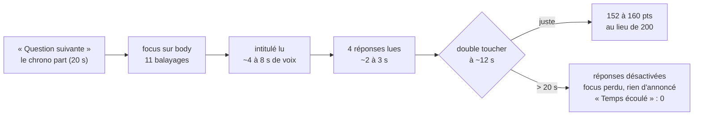

# Qui ne peut pas jouer au quiz du jour, ni lire une carte ? — rapport de l'expert accessibilité (écrans de #58 et #59)

## En bref

Les écrans de #58 et #59 sont **bien nommés et lisibles**. Les médaillons (Sphinx, légendaires de saison, Divins voilés), le laurier dans les listes, les écussons, les jauges et les onglets ont tous un nom. Aucun texte ne passe sous le seuil de contraste sur fond Velours. Les animations s'arrêtent avec « réduire les animations ». Le quiz du jour tient à 320 px.

Deux choses empêchent encore de jouer à l'oreille et au clavier :
- **Le quiz du jour** se joue sans repère. À chaque écran (question, révélation, échéance, fin, classement, correction), le focus retombe sur `body`. La correction ne dit pas, à l'oreille, quelles réponses étaient justes. Et rien ne permet d'avoir plus de temps (20 s, parfois 15 s), alors que c'est un jeu solo et asynchrone : l'exception WCAG du « temps réel » ne s'applique pas.
- **La carte d'un joueur** s'annonce comme un dialogue modal, mais le deuxième Tab en sort vers un bouton caché derrière. Échap ne rend pas le focus au nom qu'on avait touché.

Les trois améliorations qui rapporteraient le plus :
1. **Le quiz du jour** (P2 · S) : poser le focus sur l'intitulé à chaque question et sur le bandeau du résultat à la révélation, y compris à l'échéance. Dire « juste / faux / sans réponse » dans la correction.
2. **La carte** (P2 · S) : reprendre le piège de Tab et le retour du focus de `Dialog.tsx`, qui sont déjà exemplaires.
3. **« Prendre mon temps » au quiz du jour** (P2 · M, à arbitrer) : une partie sans chrono, payée sans bonus de rapidité et hors podium du jour. Cela respecte l'invariant 8 (un profil ne donne aucun avantage) et le barème.

## Méthode

J'ai travaillé environ 1 h 30, en deux temps (l'atelier a été relancé entre les deux ; tout a été rejoué sur le nouveau, http://localhost:35825). Le code est lu à `5debe4d`.

- **Pilote de l'atelier** (`TABLEE=…/atelier.json`) : un profil créé depuis l'accueil sur `iris-tel1` (`telephone`), `voir` et `lecteur` sur le profil (`lecteur-profil-apparence.txt`).
- **Scripts Playwright** (Chromium à eux, hors de la régie), dans `export/evaluations/accessibilite/` :
  - `commun.mjs` : axe-core 4.10.2 (`axe.min.js`, par `npm pack` hors du dépôt), l'arbre d'accessibilité de Chrome par CDP (la méthode de `lecteur`), un enregistreur d'annonces (régions vivantes, et `role=alert/status` insérés hors région), le focus, les contrastes composés ;
  - `jour.mjs` → `jour.txt`, `jour-arbres/` : **le quiz du jour au clavier seul** en 360 × 640. Dix questions, dont une laissée à l'échéance avec le focus sur une réponse, puis la fin, le classement (et ses onglets) et la correction. À chaque écran : axe, focus, annonces, arbre ;
  - `jour-320.mjs` : les six écrans du jour à 320 px ;
  - `profil.mjs` → `profil.txt` : les écussons bronze, argent et or en vision simulée (CDP `setEmulatedVisionDeficiency`), le contraste des anneaux de rareté, les débordements à 320 px ;
  - `profil-200.mjs` : les onglets du profil au texte à 200 % (zoom CSS, comme `zoom 200`) ;
  - `scene.ts` → `scene.txt`, `scene-arbres/` : **une scène vraie sur un serveur jetable** (`server/test/banc.ts`, horloge du jour réglée). Alice gagne onze jours de suite contre Bob et obtient ainsi un vrai laurier, un vrai Kintsugi, trois paliers du jour, le Sphinx et deux écussons bronze. Puis elle entre dans une soirée où Zoé, anonyme, **ouvre sa carte au clavier**. On y relève :
    - le laurier sur le téléphone et à l'écran commun ;
    - la carte : focus, piège, retour ;
    - le contraste **mesuré au pixel** sur les cinq fonds. Le fond seul est photographié, texte rendu transparent, puis chaque pixel de la boîte de chaque texte est comparé à sa couleur. Hors Kintsugi (le vrai), les fonds sont posés par leur classe, avec la feuille de style réelle ;
    - les animations avec et sans `prefers-reduced-motion` ;
    - le profil (onglets, choix d'avatar, vitrine, écussons en vision simulée, 320 px et 200 %) ;
    - `/jour` le lendemain.

  Pour rejouer : `cd server && nice -n 10 node --import tsx ../export/evaluations/accessibilite/scene.ts`, et `BASE=<atelier> node export/evaluations/accessibilite/<script>.mjs`.
- **Lu** :
  - `JourApp.tsx`, `Jour.tsx`, `ProfilApp.tsx`, `Apparence.tsx`, `Trophees.tsx`, `Carriere.tsx` (détails, jauges), `CarteJoueur.tsx`, `Laurier.tsx`, `Ecusson.tsx`, `Legendaire.tsx` / `Divin.tsx` (noms), `Avatar.tsx`, `Leaderboard.tsx`, `Rank.tsx`, `Niveau.tsx`, `TimerBar.tsx`, `PlayerView.tsx` (question, désactivation à l'échéance), `Dialog.tsx`, `HostApp.tsx` (puce d'invité) ;
  - `styles.css` : fonds, laurier, écussons, onglets, anneaux, `prefers-reduced-motion` ;
  - `shared/jour.ts`, `shared/fonds.ts`, `shared/ecussons.ts` ;
  - `server/src/core/jour.ts` (durée, temps de lecture, points), `server/src/games/quiz.ts` (`tempsDeLecture`, `pointsDuChoix`), `core/consigne.ts` ;
  - le rapport du 24 (`retours/2026-09-24/experts/accessibilite.md`), `jour-ecran.md/.json`, `recompenses-vitrine.md`.
- **Pas couvert** :
  - un vrai lecteur d'écran (TalkBack, VoiceOver) : les annonces sont déduites des mutations DOM et de l'arbre de Chrome ;
  - Safari et Firefox ;
  - `forced-colors` ;
  - le podium avec laurier en direct (lu dans le code) ;
  - la section « Saison » du jour hors saison (lue dans le code) ;
  - la vitrine au-delà de trois hauts faits.

**Déjà relevé ailleurs, et non refait ici** : `jour-ecran-3` (aucune annonce au lecteur d'écran dans le quiz du jour), `jour-ecran-4` (texte agrandi : question défilée), `jour-ecran-12` (petites cibles). Je les approfondis critère par critère (constat 2, tableau).

## Constats

### 1. Le quiz du jour ne laisse jamais plus de temps, et c'est un jeu solo (2.2.1)
- **Où** :
  - la durée d'une question est celle de la question de la réserve (`server/src/core/jour.ts:554`), et la consigne de l'IA n'écrit jamais de ligne « Temps » (`core/consigne.ts`) : 20 s d'office (`shared/library.ts:13`), 15 s pour certaines questions des quiz livrés ;
  - points : `pointsDuChoix` (`games/quiz.ts:187`), `tempsDeLecture` (`:172`) ;
  - à l'échéance, les réponses se désactivent (`PlayerView.tsx:705`).
- **Constat** : une question = 20 s, lecture comprise, sans aucun moyen de les allonger. Personne ne peut mettre en pause : en soirée, c'est l'animateur qui le fait ; ici, on est seul. Quitter en pleine question la perd. Le chrono ne prévient qu'à l'œil (la barre devient « urgente » à 5 s) : aucune alerte pour qui ne voit pas. À l'échéance, la réponse sous le focus se désactive et le focus tombe sur `body`.
- **Preuve** :
  - `jour.txt`, Q2 : « à 3 s de la fin : focus button.ans-btn « Le martinet » · annonces depuis : [] », puis « à l'échéance + 0,5 s : 4 réponses désactivées · focus body », puis « Temps écoulé » sans annonce ;
  - arbre de la question (`jour-arbres/q1-question.txt`) : **11 arrêts de lecteur** avant la première réponse ;
  - ce que coûte la lenteur, au barème réel, sur les 10 questions du 27 septembre (64 à 104 caractères) :

    | Réponse juste à | 4 s | 8 s | 12 s | 16 s | 19 s |
    |---|---|---|---|---|---|
    | Points sur 2 000 | 2 000 | 1 824 | 1 533 | 1 254 | 963 (la question de 15 s vaut 0) |
    | Expérience (sur 75) | 75 | 68 | 57 | 47 | 36 |

    Estimation, non mesurée sur un appareil : 11 à 14 s rien que pour entendre l'intitulé et les réponses (TTS à ~14 caractères/s, et 11 balayages à ~0,6 s).
- **Qui ça touche, ce que ça coûte** :
  - le joueur aveugle ou malvoyant, au lecteur d'écran ou à la loupe ;
  - le joueur dyslexique ;
  - le joueur à contacteur ou à commande vocale.

  Il perd un quart de l'expérience d'une partie parfaite, n'accède en pratique jamais au podium du jour (25/15/10 XP, le laurier), et chaque question longue risque « Temps écoulé ».
- **Statut** : **tension avec un parti pris**. Le chrono empêche de chercher la réponse en ligne pendant la question, et le barème est un choix de produit. Mais le quiz du jour n'est pas un événement en temps réel (chacun joue quand il veut) : l'exception « temps réel » de 2.2.1 ne s'applique pas. L'exception « essentiel » ne vaut que pour le classement, pas pour « apprendre », qui est la promesse de la page (« c'est là qu'on apprend »). Le 24, le réglage de soirée « temps généreux » (A3) n'a pas été fait ; il reste ouvert.
- **Piste** : une case « Prendre mon temps » à l'accueil du jour, choisie **avant** « Jouer ».
  - Le serveur sert alors les questions sans échéance (ou à ×3), paie une bonne réponse 100 points fixes, sans bonus de rapidité, et range la partie **hors classement et hors podium du jour** : « partie tranquille ». La série et les médailles restent comptées. L'expérience se tire de `xpDuJour`, au même barème.
  - Rien n'y est un avantage (invariant 8), et le classement garde son sens.
  - À arbitrer : les médailles (6/8/10 justes) comptent-elles en partie tranquille ?
  - Test : `jour-partie.test.ts`, une partie tranquille répondue à 60 s est payée 100 et absente du classement.

  Sans aller jusque-là (S) :
  - un `<p className="sr-only" aria-live="polite">` qui dit « 5 secondes » une seule fois par question ;
  - le focus posé sur le bandeau du résultat à l'échéance (constat 2).
- **Priorité · effort** : P2 · M (la case) ; P3 · S (l'alerte et le focus à l'échéance).

### 2. Le quiz du jour sans repère : le focus retombe sur `body` à chaque écran (2.4.3, 4.1.3) — approfondissement de jour-ecran-3
- **Où** :
  - `client/src/views/JourApp.tsx:232-269` : la question et la révélation, sans région vivante ni focus ;
  - `:271-278` et `:636-767` : la fin, le classement, la correction ;
  - `PlayerView.tsx:365-371` : « Envoi… » en `role=status`.
- **Constat**, écran par écran (rejoué deux fois, sur l'ancien puis sur le nouvel atelier) :

  | Écran | Focus à l'arrivée | Ce qu'un lecteur entendrait sans chercher |
  |---|---|---|
  | Question (×10) | `body` | rien (ni l'intitulé, ni le temps) |
  | Révélation (×9) | `body` | « Envoi… » (un `role=status` inséré avec son texte : annonce incertaine), puis rien de « Bien joué / Raté / la bonne réponse » |
  | Échéance (Q2) | réponse focalisée → `body` | rien, ni « Réponses closes » ni « Temps écoulé » |
  | Fin | `body` | rien (score, médaille, série, expérience) |
  | Classement | `body` | rien |
  | Correction | `body` | rien |

  Au clavier, le coût est faible : Chrome garde le point de départ, et un seul Tab atteint la première réponse ou « Question suivante ». Au lecteur d'écran, il faut repartir du haut : 11 balayages avant la première réponse, une dizaine avant « Bien joué ! ».
- **Preuve** : `jour.txt` (« focus à l'arrivée : body · annonces à l'arrivée : AUCUNE » ×10), `jour-arbres/q1-revelation.txt`, `q2-temps-ecoule.txt`, `20-fin.txt`.
- **Qui ça touche** : le joueur au lecteur d'écran, sur un jeu où chaque seconde de recherche coûte des points (constat 1).
- **Statut** : bug confirmé (rejoué). jour-ecran-3 a le symptôme ; ce constat ajoute l'échéance et les trois écrans d'après.
- **Piste** : pour un jeu minuté, **le focus plutôt qu'une région vivante**. Il lit ce qu'il faut, là où il faut, et la réponse suivante n'est plus qu'à un balayage.
  ```tsx
  // PlayerView.tsx, dans QuizPlayer (profite aussi aux soirées)
  const titre = useRef<HTMLHeadingElement>(null)
  useEffect(() => { if (focusSurLIntitule) titre.current?.focus() }, [v.qIndex, v.round])
  <h2 ref={titre} tabIndex={-1} className={'quiz-question' + …}>…</h2>
  // JourApp.tsx, Revelation : le bandeau prend le focus, à la réponse comme à l'échéance
  <div ref={bandeau} tabIndex={-1} className={'card result-banner ' + ton}>…</div>
  ```
  - Une prop `focusSurLIntitule` passée par `JourApp` seulement : en soirée, la région vivante de `PlayerApp.tsx:455` fait déjà ce travail.
  - Ajouter `ref.focus()` sur le `<h1>` de la fin et le `<h2>` du classement et de la correction.
  - Test de source dans `server/test/accessibilite.test.ts` : `JourApp` pose un focus (`.focus()`) ou une région `aria-live`.
- **Priorité · effort** : P2 · S.

### 3. La correction du jour : « juste » et « sans réponse » se lisent pareil (1.1.1, 1.3.1)
- **Où** : `JourApp.tsx:741-758`. La coche et la croix sont des `Icon` (décoratives, `aria-hidden`). Seul « Tu avais dit : … » (faux) se lit.
- **Constat** : à l'oreille, une question trouvée (« 2007 ») et une question laissée au temps (« Le martinet ») donnent exactement la même chose : l'intitulé, puis la bonne réponse. L'œil, lui, voit ✓ doré contre ✗ rouge. Une question annulée garde une croix ✗ (l'icône suit `q.juste`, faux), à côté de « · annulée ».
- **Preuve** : `jour-arbres/24-correction.txt` :
  ```
  listitem « En quelle année le premier iPhone est-il sorti ? » « 2007 »            ← juste
  listitem « Quel oiseau est capable de dormir en plein vol ? » « Le martinet »    ← sans réponse
  listitem « Quel pays a remporté… 2018 ? » « La France » « Tu avais dit : » « L'Allemagne »
  ```
- **Qui ça touche** : le joueur au lecteur d'écran, sur l'écran qui sert à « apprendre ».
- **Statut** : bug confirmé (rejoué).
- **Piste** :
  ```tsx
  <span className="correction-marque" role="img"
        aria-label={q.annulee ? 'Annulée' : q.juste ? 'Juste' : q.repondue ? 'Faux' : 'Sans réponse'}>
    <Icon name={q.annulee ? 'alert' : q.juste ? 'check' : q.repondue ? 'x' : 'clock'} />
  </span>
  ```
  Écrire aussi « Sans réponse » en clair pour tous : l'œil ne distingue pas non plus « faux » de « pas répondu » sans lire la ligne suivante.
- **Priorité · effort** : P2 · S.

### 4. La carte d'un joueur laisse filer le focus derrière elle, et ne le rend pas (2.4.3, 2.4.11)
- **Où** : `client/src/components/CarteJoueur.tsx:53-63` (focus à l'ouverture, Échap), sans piège de Tab ; `PlayerApp.tsx:640`, `onFermer={() => setCarte(null)}` sans retour du focus.
- **Constat** : la carte se déclare `role="dialog" aria-modal="true"` et reçoit bien le focus. Mais :
  - le **2ᵉ Tab** sort de la carte vers « Gagner des niveaux : créer un profil », **caché derrière elle** (capture) ;
  - fermée par Échap, la carte rend le focus à `body`, pas à la ligne « La carte d'Alice… » qu'on avait touchée.

  Un lecteur d'écran qui respecte `aria-modal` ne voit plus ces boutons, alors que le clavier y va.
- **Preuve** : `scene.txt` :
  ```
  Tab dans la carte : sort de la carte au 2ᵉ Tab
      button.btn « Fermer »
      button.link-inline « Gagner des niveaux : créer un ← HORS DE LA CARTE
      body ← HORS DE LA CARTE
      button.lb-row « La carte d'Alice, vainqueur du qui ← HORS DE LA CARTE
  ouverte au clavier puis Échap aussitôt : focus body
  ```
  Capture `captures/scene-03b-carte-focus-derriere.png` : le focus est sur un bouton qu'on ne voit pas.
- **Qui ça touche** : l'invité au clavier (clavier Bluetooth, contacteur), et au lecteur d'écran dès qu'il revient au classement de la soirée. C'est justement là qu'il ouvre plusieurs cartes à la suite.
- **Statut** : bug confirmé (rejoué). Non couvert le 24 (« la carte au clavier : lue dans le code seulement »).
- **Piste** : `Dialog.tsx` fait déjà tout (piège de Tab, Échap, focus rendu). En extraire un crochet `useDialogueModal(boite, onFermer)` et l'appeler dans `CarteJoueur` :
  - retenir `document.activeElement` à l'ouverture ;
  - le rendre au démontage (`useEffect(() => () => avant?.focus(), [])`) ;
  - boucler Tab et Maj+Tab sur les éléments focalisables de `.carte-joueur`.
- **Priorité · effort** : P2 · S.

### 5. Choisir un avatar, une finition, un fond ou sa vitrine : le focus tombe, la vitrine perd son ordre (2.4.3, 4.1.3, 1.3.1)
- **Où** :
  - `Apparence.tsx:90,129,248,267,362,380` : toutes les cases sont `disabled={busy}` pendant l'enregistrement (`ProfilApp.tsx:127-143`) ;
  - `Trophees.tsx:56-114` : la vitrine, `<ul role="group">` ; `:86-90` : le rang `aria-hidden` ;
  - `Apparence.tsx:187` : la légende d'un avatar dessiné se déplie **sous toute la grille**.
- **Constat** :
  - « Avatar 🐸 » + Entrée : le bouton se désactive le temps de l'enregistrement, et le focus tombe sur `body`. Il y reste, et l'état « pressé » change sans rien dire. Au clavier, Chrome reprend au bouton suivant (« Avatar 🦄 »). Au lecteur, aucune confirmation.
  - Vitrine : « Choisir moi-même » puis « Montrer ceux-là » mettent tous deux le focus sur `body`. L'ordre de choix (le chiffre 1, 2, 3 que la carte suivra) n'est dit qu'à l'œil. axe : `listitem` [serious] ×3 (le `<ul>` a perdu son rôle de liste).
  - La légende d'un légendaire s'ouvre après les 57 cases. Depuis le Phénix, une vingtaine de Tab (les 15 légendaires et les 5 Divins qui le suivent) mènent au contenu de sa légende. `aria-controls` n'est suivi que par JAWS.
- **Preuve** : `scene.txt` :
  - « Entrée sur « Avatar 🐸 » : focus pendant l'enregistrement body · après body · pressé ? true » ;
  - « « Choisir moi-même » : focus après body » ;
  - « vitrine, deux choisis (le 2ᵉ puis le 1ᵉʳ) : … [focused, pressed] … [pressed] » (aucun rang) ;
  - axe « profil · vitrine à choisir ».
- **Qui ça touche** : le joueur à profil au clavier ou au lecteur d'écran, sur la page qu'il ouvre le plus.
- **Statut** : friction confirmée (rejoué) ; `listitem`, bug confirmé (axe).
- **Piste** :
  - ne pas désactiver la case touchée pendant `busy`, mais ignorer un second clic (`if (busy) return`), ou garder `aria-disabled` au lieu de `disabled` ;
  - un `<p className="sr-only" role="status">` qui dit « Tu portes 🐸 » ;
  - vitrine : `<ul>` sans rôle (le groupe est déjà nommé par son titre) ; `aria-label={`${b.title}${pris ? `, ${rang + 1}ᵉ sur la carte` : ''}`}` ; après « Choisir moi-même » et « Montrer ceux-là », focus sur le titre « Ma vitrine » (`tabIndex={-1}`) ;
  - légende : la rendre juste après la rangée de la case ouverte, ou déplacer le focus sur son nom (`tabIndex={-1}`) à l'ouverture.
- **Priorité · effort** : P3 · S.

### 6. Les onglets (profil, classement du jour) : ni flèches, ni panneau, et au texte agrandi « Carrière » sort de l'écran (4.1.2, 1.4.10, 1.4.4)
- **Où** :
  - `ProfilApp.tsx:424-445` (profil) ; `JourApp.tsx:661-674` (classement : `role="tablist"` sans `tabpanel`) ;
  - `styles.css:5220-5246` (`.onglets` : `grid-auto-flow: column`, jamais à la ligne) et `:5787`.
- **Constat** :
  - Les trois onglets sont chacun un arrêt de Tab (`tabindex` absent), et les flèches ne font rien. Or un lecteur d'écran annonce « onglet, 1 sur 3 » : l'utilisateur essaie les flèches.
  - Au profil, l'`aria-controls` des deux onglets inactifs vise un panneau absent du DOM.
  - Au classement du jour, pas de `tabpanel` du tout.
  - À **320 px**, la rangée du profil déborde de 4 px (« Carrière », défilement horizontal).
  - Au texte à 200 % (360 × 640), « Trophées » est coupé et **« Carrière » est hors de l'écran** (467 → 644 px pour une fenêtre de 360).

  Le quiz du jour, lui, tient à 320 px sur ses six écrans.
- **Preuve** :
  - `scene.txt` : « Flèche droite sur « Apparence » : … onglet choisi Apparence » ; « Trophées:null:profil-trophees→ABSENT » ;
  - `profil.txt` : « largeurPage 324, fenetre 320, déborde : button.onglet « Carrière » » ;
  - `profil-200.mjs` : « Carrière : 467→644 (fenêtre 360) » ;
  - captures `profil-onglets-200.png`, `scene-06-profil-trophees-360-200.png` (où « Revenir chez Antoine » est aussi coupé) ;
  - `jour-320.mjs` : les six écrans du jour à 320/320.
- **Qui ça touche** : le lecteur d'écran (motif attendu), et la grand-mère au texte agrandi, qui ne trouve pas l'onglet « Carrière ».
- **Statut** : friction confirmée (rejoué). 1.4.10 échoue de 4 px à 320 px.
- **Piste** :
  - `.onglets { grid-auto-flow: row; grid-template-columns: repeat(auto-fit, minmax(min(100%, 7.5em), 1fr)); }` : la rangée passe à la ligne quand elle ne tient plus ;
  - `tabIndex={actif ? 0 : -1}`, et un `onKeyDown` Flèche gauche / droite / Début / Fin qui choisit et focalise ;
  - au classement, envelopper la liste dans `role="tabpanel" aria-labelledby` ;
  - au profil, `aria-controls` seulement sur l'onglet actif.
- **Priorité · effort** : P3 · S.

### 7. Les écussons : le palier ne se dit qu'en couleur, à l'œil (1.4.1)
- **Où** : `client/src/components/Ecusson.tsx:36-38` (le palier en toutes lettres, **pour le lecteur d'écran seulement**) ; `styles.css:3985-3987` (bronze `#c98b58`, argent `#b9c3cf`, or `#d9b56a`) ; la carte (`CarteJoueur.tsx:173`), sans légende.
- **Constat** : bronze, argent et or ont la même forme et le même emblème ; seule la teinte change. En niveaux de gris, l'argent et l'or sont à **1,09:1** l'un de l'autre, le bronze à 1,47:1 de l'or. En protanopie, bronze et or sont le même jaune olive. Au profil, la légende « 60 / 75 » laisse deviner le palier (le seuil suivant) ; sur la carte, où la salle les regarde, rien.
- **Preuve** : captures `profil-ecussons-paliers-none.png`, `-achromatopsia.png`, `-protanopia.png`, `-deuteranopia.png` (paliers 1, 2, 3 et 0 posés sur les quatre premières cases) ; luminances calculées sur les couleurs relevées (`profil.txt`).
- **Qui ça touche** : les daltoniens (8 % des hommes) et la vision basse, sur la carte de ceux qu'ils regardent.
- **Statut** : friction confirmée (rejoué). Le commentaire d'`Ecusson.tsx` (« la couleur ne parle jamais seule ») ne tient que pour l'oreille.
- **Piste** : écrire le palier sous le nom, « Bronze · 60 / 75 », et sur la carte « Histoire · bronze ». Ou un signe de forme : une à trois barres sous l'emblème, ou le liseré plein / double / couronné.
- **Priorité · effort** : P3 · S.

### 8. Fond « Aurore boréale » : le titre et le laurier passent sous 4,5:1 (1.4.3)
- **Où** : `styles.css:3848-3900` (le halo vert `rgba(70,255,170,.42)` à 28 % / 16 %, derrière l'en-tête), `.titre-porte` (`:5850`) et `.carte-laurier` (`:3737`), en `--accent-text: #e6c47c`.
- **Constat** : mesuré au pixel, les textes dorés de l'en-tête tombent sous le seuil sur l'Aurore :
  - « « L'Assidu » » : 10ᵉ centile **4,26**, minimum 3,77, médiane 4,98 ;
  - « Vainqueur du quiz du jour d'hier » : 10ᵉ centile **4,31**.

  Velours, Nuit étoilée, Kintsugi (le vrai) et Grand théâtre passent au 10ᵉ centile. Les minimums bas (1,03 à 1,17) sont des étoiles ou des fêlures isolées qui traversent une lettre.
  **Aucun fond n'est animé** (dégradés fixes). Dans la carte, les trois animations du médaillon du Sphinx tombent à **zéro** avec `prefers-reduced-motion`.
- **Preuve** : `scene.txt` (« aurore : 22 textes · sous le seuil au 10ᵉ centile : 2 … ») ; captures `scene-04-carte-aurore.png`, `-kintsugi.png`, `-nuit.png`, `-theatre.png`, `-velours.png`.
- **Qui ça touche** : la vision basse, pour celui qui a atteint le niveau 20 : son titre, sur sa carte.
- **Statut** : friction confirmée (mesurée). Le 10ᵉ centile est le critère retenu : l'ombre portée (`text-shadow`) n'entre pas dans la mesure WCAG.
- **Piste** : un voile sous l'en-tête (`.carte-fond.fond-aurore .carte-tete { background: radial-gradient(closest-side, rgba(3,10,14,.55), transparent); }`), ou le halo vert à 0,30. Remesurer avec `scene.ts` (seuil : 10ᵉ centile ≥ 4,5 pour chaque texte, sur chaque fond).
- **Priorité · effort** : P3 · S.

### 9. Le laurier : bien nommé dans les listes, dit deux fois sur la carte, avant le prénom à l'écran commun
- **Où** : `Laurier.tsx:39-45` (`role="img"`, « vainqueur du quiz du jour d'hier ») ; `CarteJoueur.tsx:105-108` et `ProfilApp.tsx:226-229` (l'image, puis le même texte en clair) ; `HostApp.tsx:205` (puce d'invité : le laurier **avant** le prénom) ; `styles.css:4670-4671` (`.host .niveau::before { content: 'Niv.\00a0' }`).
- **Constat**, lu dans l'arbre de Chrome :
  - **téléphone, classement de la soirée** : « La carte d'Alice, vainqueur du quiz du jour d'hier — rang 1, 0 point ». Juste.
  - **classement du jour** : « Rang 1, 🐸, Alice, vainqueur du quiz du jour d'hier, niveau 5, 2000 points ». Juste.
  - **carte et profil** : « image vainqueur du quiz du jour d'hier », puis « Vainqueur du quiz du jour d'hier ». Dit deux fois.
  - **écran commun, salle d'attente** : « 🦊, Niv. niveau 5, image vainqueur du quiz du jour d'hier, bouton Donner un surnom à Alice ». Le laurier arrive avant le prénom, et « Niv. » (un contenu CSS) se lit avec le « niveau » masqué.
  - **à l'œil** : 18 px sur un prénom de 16 px au téléphone, ~14 px à l'écran commun en 1366 × 768 ; aucune légende à la télé. Au téléphone, toucher le nom ouvre la carte, qui l'explique.
- **Preuve** : `scene.txt` (« Le laurier dans les listes »), `scene-arbres/02-ecran-commun-salle.txt`, `04-carte-alice.txt`, captures `scene-01-zoe-salle.png`, `scene-02-ecran-commun-salle.png`.
- **Qui ça touche** : l'animateur au lecteur d'écran (la puce) ; tout le monde au lecteur (le doublon) ; la salle qui ne sait pas ce qu'est ce petit rameau.
- **Statut** : friction confirmée (rejoué) ; « Niv. niveau » est plus ancien que #59, mais il sort aux mêmes endroits.
- **Piste** :
  - `<Laurier laurier decoratif />` (`aria-hidden`) là où le texte suit ;
  - dans `PuceJoueur`, le laurier après le bouton du prénom ;
  - `content: 'Niv.\00a0' / ''` (texte de remplacement vide pour le contenu généré, Chrome le lit ainsi) ;
  - à l'écran commun, une ligne sous la salle d'attente quand un laurier est présent : « ✦ vainqueur du quiz du jour d'hier » (à arbitrer avec `design-recompenses`).
- **Priorité · effort** : P3 · S.

### 10. Les petits noms qui manquent sur les nouveaux écrans
- **Titre sous le prénom** (`ProfilApp.tsx:223`, `CarteJoueur.tsx:104`) : « « L'Assidu » » se lit comme un surnom. Piste : `<span className="sr-only">Titre : </span>`.
- **Série** (`Jour.tsx:59-65`) : « 11 jours » sans le mot série (la flamme est muette, le `title` ne sort ni au toucher ni au clavier). Piste : `<span className="sr-only">Série : </span>`.
- **Sa ligne au classement du jour** (`JourApp.tsx:706-719`) : `.me` ne se voit qu'à l'œil ; parmi cinquante profils, rien ne dit « c'est toi ». Piste : `{moi && <span className="sr-only">, toi</span>}` (le même mot que `Course.tsx:115`).
- **`aria-label` sur des éléments sans rôle**, que les lecteurs ignorent : `CarteJoueur.tsx:129,138,173` (« Divins », « Avatars légendaires », « Écussons de savoir ») ; `.jauge` de `Trophees.tsx:310`, `Carriere.tsx:85`, `FinDeSoiree.tsx:388` (le nombre est déjà dit à côté). Piste : `role="group"` sur les trois `div`, `aria-hidden` sur les jauges.
- **Les finitions** répètent l'avatar dans chaque nom : « 🦖 Mat ouverte », « 🦖 Argent niveau 3 »… (8 fois). Piste : `aria-hidden` sur l'`Avatar` des `.finition-btn`.
- **Pas de `<h1>`** sur `/profil` (le prénom est un `h2`) ni sur la question, la révélation, le classement et la correction du jour (axe `page-has-heading-one` ; l'accueil du jour en a un). Au lendemain, le `h2` « 1ʳᵉ place sur 2 » précède le `h1`. Piste : le prénom en `h1` ; au jour, le bandeau « Le quiz du jour · 27 septembre » en `h1`.
- **Statut** : friction confirmée (arbres de `jour-arbres/`, `scene-arbres/`, axe). **Priorité · effort** : P3 · S.

## Mesures et cartes

### Critère par critère — écrans de #58 et #59 (WCAG 2.2 AA)

| Critère | Quiz du jour | Profil (3 onglets) | Carte et fonds | Laurier, titres, médaillons |
|---|---|---|---|---|
| 1.1.1 Contenu non textuel | **Échec** : coche et croix de la correction muettes (3) | Réussi : 57 cases nommées, les fermées en `img` « s'ouvre au niveau n » | Réussi : Sphinx « Le Sphinx », fonds décoratifs | Réussi : laurier « vainqueur du quiz du jour d'hier », médaille « Médaille d'or », Divins « Un Divin, inconnu » |
| 1.3.1 Information et relations | **Partiel** : pas de `h1` en jeu ; sa ligne non signalée (10) | **Partiel** : vitrine `ul role=group` (axe `listitem`), pas de `h1` | **Partiel** : `aria-label` sur des `div` sans rôle (10) | **Partiel** : titre sans « titre » (10) |
| 1.3.2 Ordre séquentiel | Réussi | **Partiel** : légende d'un avatar sous toute la grille (5) | Réussi | **Partiel** : laurier avant le prénom à l'écran commun (9) |
| 1.4.1 Couleur | Réussi : formes ▲◆●■, « Bien joué / Raté » en clair | **Échec** : palier des écussons (7) | **Échec** : écussons sur la carte (7) | Réussi |
| 1.4.3 Contraste | Réussi (axe et mesure : 0) | Réussi (0) | **Partiel** : Aurore 4,26 et 4,31 (8) ; les 4 autres passent | Réussi (le laurier or passe) |
| 1.4.4 Redimensionnement | Voir jour-ecran-4 | **Partiel** : « Carrière » hors écran, « Revenir chez… » coupé à 200 % (6) | non mesuré | — |
| 1.4.10 Redistribution | Réussi : 6 écrans à 320/320 | **Échec** léger : 324/320 (6) | Réussi (360) | — |
| 1.4.11 Contraste non textuel | Réussi (barre du chrono doublée d'un chiffre) | Réussi : anneaux de 6,6 à 7,8:1, choisi 8,6:1 | Réussi | Réussi |
| 2.1.1 Clavier | Réussi : 1 Tab jusqu'à « Jouer », à chaque réponse, à « Question suivante » | Réussi (Tab) ; flèches absentes (6) | Réussi | — |
| 2.1.2 Pas de piège | Réussi | Réussi | Réussi (mais voir 2.4.3) | — |
| **2.2.1 Réglage du délai** | **Échec / tension** : 20 s (15 s), rien à allonger, jeu solo (1) | — | — | — |
| 2.2.2 Mettre en pause | Sans objet | Réussi | Réussi : 3 animations → 0 en mouvement réduit ; fonds fixes | Réussi |
| 2.4.2 Titre de page | Réussi : « Le quiz du jour · FiestApp » | Réussi : « Mon profil · FiestApp » | — | — |
| **2.4.3 Parcours du focus** | **Échec** : `body` à chaque écran et à l'échéance (2) | **Partiel** : `body` après un choix, la vitrine (5) | **Échec** : sort au 2ᵉ Tab, pas de retour (4) | — |
| 2.4.6 En-têtes et étiquettes | Réussi | Réussi | Réussi : dialogue « Carte d'Alice » | — |
| 2.4.7 Focus visible | Réussi (anneau unique, #48) | Réussi | Réussi | — |
| **2.4.11 Focus non masqué** | Réussi | Réussi | **Échec** : focus sur un bouton caché par la carte (4) | — |
| 2.5.3 Nom dans l'étiquette | Réussi | Réussi | Réussi | Réussi : « La carte d'Alice, vainqueur… » |
| 2.5.8 Taille des cibles | Voir jour-ecran-12 (onglets de 34 px : passe les 24) | Réussi (onglets de 44 px) | Réussi | — |
| 3.2.1 / 3.2.2 Au focus, à la saisie | Réussi | Réussi | Réussi | — |
| 4.1.2 Nom, rôle, valeur | Réussi (réponses, minuteur `timer`) ; onglets sans panneau (6) | **Partiel** : `aria-controls` vers un panneau absent (6) ; `aria-pressed` et `aria-expanded` justes | Réussi : `dialog`, `aria-modal` | Réussi |
| **4.1.3 Messages d'état** | **Échec** : rien d'annoncé (2, jour-ecran-3) | **Partiel** : un choix enregistré n'est pas dit (5) | Sans objet | — |

### Ce que coûte le temps (constat 1)



### Le contraste des cartes, fond par fond (10ᵉ centile, 22 textes, `scene.ts`)

| Fond | Textes sous le seuil | Le plus faible (p10) |
|---|---|---|
| Velours | 0 | — |
| Kintsugi (gagné pour de vrai) | 0 | fêlures isolées (min 1,17 sur quelques pixels) |
| Nuit étoilée | 0 | étoiles isolées (min 1,03) |
| **Aurore boréale** | **2** | « « L'Assidu » » 4,26 · « Vainqueur du quiz du jour d'hier » 4,31 |
| Grand théâtre | 0 | le chiffre « 5 » (min 3,73) |

### Les corrections du 24 : tiennent-elles ?

| Constat du 24 | Aujourd'hui |
|---|---|
| A1 : bascules à l'état contradictoire | **Tient** : « Sons » `aria-pressed={!muted}`, thème, multiplicateur, QCM / Estimation / Sondage (`HostApp.tsx:1552,1566`, `HostView.tsx:119`, `EditorApp.tsx:2886-2904`) |
| A2 : focus des champs | **Tient** : un seul anneau de 2 px (`styles.css:463`), visible sur les nouveaux onglets et dans la carte |
| QR sans nom, titres de page, `<main>` | **Tiennent** : « QR code pour rejoindre la soirée », « Mon profil · FiestApp », « Le quiz du jour · FiestApp » ; `main` partout. Mais les nouveaux écrans n'ont pas de `h1` (10) |
| A5 : focus au changement de vue, console | **Tient** à la console ; **non repris** dans le quiz du jour (2) ni dans la carte (4) |
| Compte à rebours muet (`GetReady`) | **Tient** |
| A3 : le temps (réglage de soirée) | **Pas fait** ; la question s'étend maintenant au quiz du jour, sans animateur pour mettre en pause (1) |

## Ce qui marche — à ne pas casser

- **Les noms des récompenses** :
  - le Sphinx, la Citrouille, le Sapin et le Bouquet final se lisent par leur nom, « pas encore gagné » quand ils sont fermés ;
  - un Divin fermé reste « Un Divin, inconnu » (invariant 21 tenu jusque dans l'arbre d'accessibilité) ;
  - les écussons disent leur palier à l'oreille (« Histoire, bronze, 60 / 75 ») ;
  - la médaille se lit « Médaille d'or » ;
  - la barre d'expérience est un `progressbar` nommé.
- **Le laurier dans le nom du bouton** (`Leaderboard.tsx:90`) : « La carte d'Alice, vainqueur du quiz du jour d'hier — rang 1, 0 point ». Rang et points compris : la leçon de #30 est appliquée à la nouveauté.
- **La grille unique des avatars** : `aria-pressed` sur ce qui se porte, `aria-expanded` sur ce qui se déplie (« un bouton qui déplie, pas un interrupteur »), les emojis fermés en image « s'ouvre au niveau n », les états dits une fois (« portée » masqué quand `aria-pressed` le dit déjà).
- **Le mouvement réduit** : la règle globale (`styles.css:2572`) et celles des médaillons coupent tout (3 → 0 dans la carte). Les fonds ne bougent pas.
- **Le quiz du jour au clavier** : 1 Tab jusqu'à « Jouer », à la première réponse, à « Question suivante » ; le rappel de la question sur la révélation (« La bonne réponse : Faux » ne disait rien sans elle), utile aussi à l'oreille ; aucun défilement horizontal à 320 px ; aucun contraste sous le seuil.
- **La carte reçoit le focus à l'ouverture et se ferme par Échap** ; son nom (« Carte d'Alice ») est juste. Il ne lui manque que le piège et le retour de `Dialog.tsx`.
- **Les onglets du profil** ont un `tabpanel` nommé par son onglet, et l'onglet ouvert se garde dans l'adresse.

## Recommandations, dans l'ordre

1. **Quiz du jour : le focus sur l'intitulé à chaque question, sur le bandeau du résultat à la révélation et à l'échéance, puis sur le titre de la fin, du classement et de la correction** (constat 2, qui complète jour-ecran-3). P2 · S.
2. **Correction du jour : « Juste / Faux / Sans réponse / Annulée » dans la marque** (constat 3). P2 · S.
3. **La carte : le piège de Tab et le retour du focus de `Dialog.tsx`**, en un crochet partagé (constat 4). P2 · S.
4. **« Prendre mon temps » au quiz du jour** : sans échéance, 100 points fixes, hors classement ; et dès maintenant, « 5 secondes » dit une fois et le focus posé à l'échéance (constat 1). P2 · M (tension à arbitrer), dont une part en P3 · S.
5. **Le profil : pas de focus perdu après un choix, la vitrine en vraie liste qui dit son ordre, la légende d'un avatar près de sa case** (constat 5). P3 · S.
6. **Les onglets : à la ligne quand ils ne tiennent plus, flèches, panneau au classement** (constat 6). P3 · S.
7. **Le palier des écussons en toutes lettres, sur la carte aussi** (constat 7). P3 · S.
8. **Un voile sous l'en-tête de l'Aurore boréale**, remesuré par `scene.ts` (constat 8). P3 · S.
9. **Le laurier dit une fois, après le prénom ; « Niv. » muet pour l'oreille** (constat 9). P3 · S.
10. **Les petits noms et les `h1`** (constat 10). P3 · S.

Un test de source pour garder les trois premières, dans `server/test/accessibilite.test.ts`, au style d'`ecran.test.ts` :
- `JourApp.tsx` pose un `.focus()` après chaque changement d'`index` ;
- la marque de la correction a un `aria-label` ;
- `CarteJoueur.tsx` utilise le crochet de dialogue.

Le rendu se rejoue par `scene.ts` et `jour.mjs`.

## Limites

- Aucun vrai lecteur d'écran : les annonces sont déduites des mutations du DOM et de l'arbre de Chrome. Le temps d'écoute du constat 1 est une **estimation** (voix à ~14 caractères/s, 0,6 s par balayage), à chronométrer avec TalkBack sur un Android.
- Le texte agrandi est un `zoom` CSS, comme le geste du pilote. La taille de police d'Android réagit un peu autrement.
- Trois des cinq fonds (Nuit, Aurore, Théâtre) et les paliers argent et or ont été posés par leur classe CSS sur une vraie carte et de vrais écussons. Le rendu est celui de la feuille de style, mais le serveur ne les avait pas accordés.
- Chromium seulement ; ni Safari, ni Firefox, ni `forced-colors`.
- Non vus en direct : le podium avec laurier (lu : `Podium.tsx:39,100-104`, rang puis prénom puis laurier), la section « Saison » du jour (hors saison le 27 septembre), le signalement d'une question (le dialogue est `Dialog.tsx`, déjà bon).
- La mission demandait l'éditeur et la console au clavier : couverts le 24, et leurs corrections tiennent (tableau ci-dessus). Je ne les ai pas refaits.
