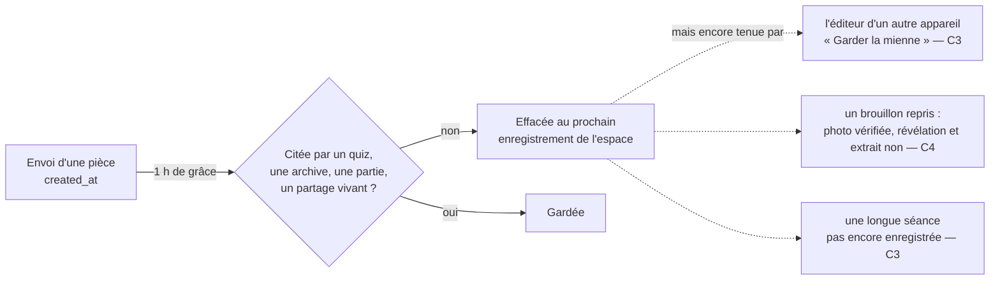

# bibliotheque — rapport de l'expert des outils de création et des formats d'échange

## En bref

**Les chemins d'échange sont solides ; ce qui perd le travail, c'est l'éditeur
lui-même et le ménage des photos.** Un quiz qui porte tout ce que l'éditeur
sait écrire (cinq sortes de questions, réglages du hasard, anecdote, note,
intertitre, « de côté », les trois pièces) arrive **entier**, octets des
pièces compris, par la duplication, le code de partage, le catalogue, le
fichier exporté (un quiz ou toute la bibliothèque) et le brouillon relu. En
revanche, **l'éditeur coupe en silence à cent questions** au premier
« Enregistrer » (rejoué dans Chromium : 120 cartes avant, 100 après, aucune
alerte), **une photo envoyée pendant qu'on déplace sa question tombe sur la
voisine** (rejoué), et **le ménage des photos compte depuis l'envoi, pas
depuis la dernière fois qu'on s'en servait** : « Garder la mienne » après un
conflit, ou un brouillon repris le lendemain avec une photo de révélation ou
un extrait, gardent des pièces que le serveur a déjà effacées.

Les trois améliorations qui rapporteraient le plus :

1. **Borner le nombre de questions là où on les ajoute, et refuser plutôt que
   couper** : l'éditeur, la liste collée, l'import et le serveur (P1 · S).
2. **Attacher une pièce à sa question par son identifiant**, jamais par sa
   place (P2 · S).
3. **Un ménage qui ne reprend pas ce qu'un éditeur ouvert tient encore** :
   compter l'orphelinat depuis qu'une photo n'est plus citée, et vérifier les
   trois pièces — à la reprise du brouillon comme à « Garder la mienne »
   (P2 · S-M).

## Méthode

- **Lu dans le code** (environ 4 h) : `shared/library.ts` en entier,
  `shared/liste.ts`, `shared/echange.ts`, `shared/brouillon.ts`,
  `client/src/brouillon.ts`, `shared/partage.ts`, `shared/modeles.ts`,
  `shared/hasard.ts`, `shared/nombres.ts`, `shared/reveil.ts`,
  `shared/programme.ts`, `server/src/core/quizStore.ts`, `core/memoire.ts`,
  `core/partages.ts`, `server/src/partages.ts`, `core/programmes.ts`,
  `core/seed.ts`, `core/export.ts`, `server/src/api.ts`, `client/src/api.ts`,
  et dans `client/src/views/EditorApp.tsx` : « Mes quiz » (import, export,
  partage, duplication), l'éditeur (enregistrement `base`/`jeton`/`essai`/
  `modifications`, conflit, brouillon, annulation), `BulkImport`,
  `QuestionCard` (envoi des pièces) ; le catalogue de `AdminApp.tsx` ;
  `raisonDEcarter` (`core/jour.ts`) pour les pièces du quiz du jour. Les
  tests existants : `liste`, `partage`, `echange`, `bibliotheque`,
  `brouillon`, `enregistrement`, `gestes`, `variantes`, `entourage`,
  `memoire`. Le rapport d'avant : `retours/2026-09-25/gestion-des-quiz.md`.
- **Écrit et rejoué** (dans `export/evaluations/bibliotheque/`, un fichier à
  la fois, `nice -n 10`, charge `uptime` < 1,6) :
  - `aller-retour-liste.test.ts` — 8 épreuves pures, dont un **test de
    propriété sur 400 quiz fabriqués au hasard** (graine fixe) : **8 en échec**.
  - `enregistrer.test.ts` — 6 épreuves sur un serveur jetable (plus de cent
    questions, conflit et ménage, brouillon, catalogue) : **6 en échec**.
  - `allers-retours.test.ts` — le quiz complet par chaque chemin, pièces
    comparées par leurs octets : **6 vertes, 1 en échec** (pièce illisible à
    l'export).
  - `editeur-navigateur.test.ts` — Chromium (Playwright) sur le client
    construit dans `dist/`, en 1366 × 768 : **2 en échec** (photo à la
    mauvaise question, 120 → 100).
  - `sonde-reponses.ts` — neuf réponses typiques, copiées en liste puis
    recollées ; `sonde-coupes.ts` — la coupe de l'export CSV et le titre
    d'une copie.
- **Pas couvert** : un vrai téléphone et une vraie 4G (l'envoi est ralenti à
  3 s par interception) ; le proxy réel de Render pendant un réveil (le
  constat 10 en dépend) ; « Pour qui ? » au-delà des tests existants ; la
  routine d'IA de la réserve (angle `jour-regles`).

## Constats

### 1. Plus de cent questions : « Enregistrer » garde les cent premières, sans un mot

- **Où** : `shared/library.ts:785` (`normalizeQuestions` : `raw.slice(0,
  MAX_QUESTIONS)`) ; `server/src/api.ts:235-244` (seul `horsBornesALEnvoi`
  refuse, et il ne regarde pas le nombre) ; `client/src/views/EditorApp.tsx:1816-1824`
  (« Ajouter une question »), `:1857-1865` (« Coller une liste »),
  `:1377-1393` (insérer, dupliquer) — aucun ne connaît `MAX_QUESTIONS`, que
  le client n'emploie que dans la demande pour une IA (`:2584`) ;
  `:1434-1437` (`poser(saved)` puis `setDirty(false)`, qui efface le
  brouillon) ; `shared/brouillon.ts:63` et `shared/echange.ts:176`.
- **Constat** : l'éditeur laisse écrire, coller et dupliquer au-delà de cent
  questions. « Enregistrer » envoie tout ; le serveur coupe à cent, répond
  200 ; l'éditeur remplace ses questions par celles de la réponse et oublie
  le brouillon. La 101ᵉ et les suivantes disparaissent pour de bon. Même
  coupe muette à l'import d'un fichier (l'avis annonce « 120 questions »,
  compté avant l'envoi) et à la relecture d'un brouillon.
- **Preuve** : `editeur-navigateur.test.ts`, épreuve 2 → `panneau : « 120
  questions reconnues · n° 1 à 120 » · cartes avant « Enregistrer » : 120 ·
  après : 100 · en base : 100 · alertes : []`. `enregistrer.test.ts`,
  épreuves 1 à 3 → `statut 200, questions gardées : 100 sur 120` ; `statut
  201, 100 questions sur 120` ; `le brouillon relu n'en rend que 100`.
- **Qui ça touche, ce que ça coûte** : l'animateur qui monte une banque de
  questions — ce que le tirage (« 15 parmi toutes, les jamais posées
  d'abord », `tirage` jusqu'à 100) l'invite justement à faire —, ou qui colle
  deux listes d'IA dans le même quiz. Le travail perdu ne se retrouve nulle
  part.
- **Statut** : bug confirmé (rejoué, navigateur et serveur).
- **Piste** : refuser plutôt que couper, comme pour le « 2045 »
  (`horsBornesALEnvoi`) :
  ```ts
  // shared/library.ts, horsBornesALEnvoi
  if (raw.length > MAX_QUESTIONS)
    return `Un quiz tient en ${MAX_QUESTIONS} questions : il en a ${raw.length}. Déplace les dernières dans un autre quiz, puis enregistre.`
  ```
  et, dans l'éditeur, griser « Ajouter », « Insérer » et « Dupliquer » à
  cent, et faire dire au panneau de la liste « 120 reconnues : 20 de trop »
  avant « Ajouter au quiz ». L'import compte ce que le serveur a gardé ;
  `lireBrouillon` ne coupe pas (l'enregistrement dira). Les trois épreuves de
  `enregistrer.test.ts` et l'épreuve 2 du navigateur deviennent les tests.
- **Priorité · effort** : P1 (perte de données, définitive et muette) · S.

### 2. Une photo envoyée pendant qu'on déplace sa question rejoint la voisine

- **Où** : `client/src/views/EditorApp.tsx:2794-2810` (`pickImage` : `await
  api.uploadImage(…)`, puis `onChange(…)`), `:2641` (`onChange={fn =>
  actions.changer(index, fn)}` : l'index **au moment du clic**), `:1259`
  (`patchQuestion` par position) ; même chemin pour la photo de la
  révélation (`pickImage(…, 'revelation')`) et l'extrait (`pickSon`, `:2818`).
- **Constat** : la photo s'attache à la **place** qu'occupait la question
  quand on l'a choisie. Une question montée, descendue, insérée ou supprimée
  au-dessus pendant l'envoi, et la photo tombe sur la question qui occupe
  maintenant cette place — en effaçant au passage sa « photo attendue ». La
  question visée reste sans photo. Le CLAUDE.md le sait pour l'attente du
  réveil (« il s'attache à la question par sa position, qu'on a pu déplacer
  entre-temps ») ; l'envoi ordinaire de quelques secondes suffit.
- **Preuve** : `editeur-navigateur.test.ts`, épreuve 1 : trois questions,
  photo choisie pour « Quel est ce monument ? » (n° 2), envoi ralenti à 3 s,
  clic sur « Monter la question 2 » pendant l'envoi, puis « Enregistrer » →
  `la photo est allée à : ["Première ?"]`.
- **Qui ça touche, ce que ça coûte** : l'animateur qui range ses questions
  pendant qu'une photo monte — au téléphone, en 4G, c'est long. La salle
  voit en soirée la mauvaise photo sous une question, et « Quel est ce
  monument ? » sans monument, « prête ».
- **Statut** : bug confirmé (rejoué).
- **Piste** : désigner la question par son identifiant, qui ne bouge pas :
  ```ts
  // ActionsDesCartes : changerParId(id, fn) — patch sur q.id === id, rien si elle a été supprimée
  const cible = question.id
  const { url } = await api.uploadImage(dataUrl)
  onChangeId(cible, q => ({ ...q, image: url, photoAttendue: null }))
  ```
  (et, la question supprimée entre-temps, le dire : « La question a été
  supprimée : la photo n'a rejoint aucune question »). Une fois l'envoi
  attaché par identifiant, il peut aussi attendre le réveil (`auReveil`),
  comme celui de la liste collée.
- **Priorité · effort** : P2 (un concours de circonstances, mais une soirée
  faussée) · S.

### 3. « Garder la mienne » après un conflit garde une photo que le ménage vient d'effacer

- **Où** : `server/src/api.ts:263` (le ménage part après chaque
  enregistrement) ; `server/src/core/quizStore.ts:27`, `:360-366` (le délai
  de grâce compte depuis **l'envoi** de la photo, `created_at`) ;
  `client/src/views/EditorApp.tsx:1699` (« Garder la mienne » → `save(conflit)`,
  `:1413-1453`, sans vérification — la reprise du brouillon, elle, vérifie,
  `:1515`).
- **Constat** : le téléphone retire la photo de la question 1 et enregistre ;
  le ménage efface aussitôt la photo, envoyée il y a plus d'une heure et que
  plus rien ne cite. Le portable, parti de la même version, reçoit 409 ;
  « Garder la mienne » réenregistre sa version, qui cite la photo effacée.
  Le serveur l'accepte, la question est « prête », la photo manque en
  soirée. Même cause, même effet pour une longue séance d'écriture : une
  photo envoyée il y a plus d'une heure et pas encore enregistrée part au
  premier enregistrement fait ailleurs dans l'espace (autre onglet, autre
  appareil).
- **Preuve** : `enregistrer.test.ts`, épreuve 4 → après l'enregistrement du
  téléphone, la photo répond 404 ; le 409 puis « Garder la mienne »
  répondent 200 et la version gardée cite la photo → `la question 1 est
  « prête » et cite une photo que le serveur ne sert plus (après le ménage du
  téléphone : 404)`.
- **Qui ça touche, ce que ça coûte** : l'animateur à deux appareils — le cas
  même que le 409 veut protéger. La perte se voit devant la salle.
- **Statut** : bug confirmé (rejoué).
- **Piste** : faire compter le délai depuis que la photo **n'est plus
  citée** : une colonne `orpheline_depuis`, posée par le premier ménage qui
  la trouve orpheline et remise à null dès qu'elle est citée de nouveau, et
  n'effacer qu'après sept jours d'orphelinat. Cela couvre d'un coup le
  conflit, la longue séance, le brouillon repris (constat 4) et l'annulation.
  À défaut : le PUT vérifie que chaque `/media/image/…` cité existe dans
  l'espace et renvoie `manquantes`, que l'éditeur signale comme à la reprise
  (`sansPhotosDisparues`).
- **Priorité · effort** : P2 · S-M.

### 4. Le brouillon repris ne vérifie que la photo de la question, pas les deux autres pièces

- **Où** : `shared/brouillon.ts:98-102` (`photosAVerifier` ne lit que
  `q.image`) et `:108-120` (`sansPhotosDisparues`, de même) ;
  `client/src/views/EditorApp.tsx:1515`. Le ménage, lui, efface les trois
  (`photosCitees` lit toute adresse `/media/image/…`).
- **Constat** : la photo de la révélation et l'extrait d'un blind test
  envoyés puis jamais enregistrés partent au ménage comme la photo ; à la
  reprise du brouillon, seule la photo est vérifiée et retirée en le disant.
  Les deux autres reviennent telles quelles, mortes : image cassée à la
  révélation, blind test muet — et la question se dit prête. C'est le piège
  « Une question a trois pièces à part », retombé.
- **Preuve** : `enregistrer.test.ts`, épreuve 5 → les trois pièces répondent
  `[404, 404, 404]` après le ménage, puis `photosAVerifier` ne rend que la
  photo : `la photo de la révélation et l'extrait reviendraient tels quels,
  morts`.
- **Qui ça touche, ce que ça coûte** : l'animateur qui reprend le lendemain
  un quiz de blind test ou de « bébés » écrit la veille sans l'enregistrer.
- **Statut** : bug confirmé (rejoué).
- **Piste** : parcourir `PIECES_DE_QUESTION` dans les deux fonctions (la
  pièce disparue se retire, et la carte le dit pour chacune) ; l'épreuve 5
  en est le test. Le constat 3 corrigé à la racine le rend rare, pas
  impossible (serveur ancien, pièce d'un autre espace).
- **Priorité · effort** : P2 · S.

### 5. « Copier en liste » : une anecdote ou une note sur plusieurs lignes abîme la question recollée

- **Où** : l'anecdote et la note se tapent dans un `<textarea>`
  (`EditorApp.tsx:3324`, `:3335`) ; `normalizeQuestions` garde le retour à
  la ligne (`texteLibre`, `shared/library.ts:855-857`, ne replie que espaces
  et tabulations) ; `ecrireListe` l'écrit tel quel (`shared/liste.ts:295-296`),
  alors qu'elle replie celui de l'intitulé (`:285`).
- **Constat** : recollée, la seconde ligne d'une anecdote devient **la
  première réponse** du QCM (ou le premier élément d'un « dans l'ordre »,
  qui change la bonne suite), sans rien signaler. Une ligne vide dans une
  note coupe la question en deux : l'intitulé part aux « blocs ignorés » et
  **le second paragraphe de la note devient l'intitulé**, projeté à toute la
  salle — une note « jamais à l'écran ».
- **Preuve** : `aller-retour-liste.test.ts`, épreuves 1 à 3 → `["La radio
  l'a sauvée.","Vrai","Faux",""]` ; `recollé : [["Elle y a vécu deux
  ans.",["Sydney","Canberra","Melbourne","Perth"],1]] · ignorés : ["Quelle
  est la capitale de l'Australie ?"]` ; `["Bell, en
  1876.","L'imprimerie","La machine à vapeur","Le téléphone"]`.
- **Qui ça touche, ce que ça coûte** : qui copie son quiz en liste pour le
  faire relire ou compléter par une IA, puis le recolle — le chemin même que
  « Copier en liste » annonce.
- **Statut** : bug confirmé (rejoué).
- **Piste** : dans `ecrireListe`, replier comme l'intitulé :
  `lignes.push(\`Anecdote : ${q.anecdote.replace(/\s*\n\s*/g, ' ')}\`)` — de
  même pour la note et l'intertitre ; et ajouter au test de propriété des
  textes sur plusieurs lignes.
- **Priorité · effort** : P2 · S.

### 6. « Copier en liste » oublie « de côté », l'extrait et la photo de la révélation — et promet le contraire

- **Où** : `shared/liste.ts:259-322` (rien pour `deCote`, `son`,
  `imageRevelation`, ni pour les réglages du quiz) ; l'annonce,
  `EditorApp.tsx:1401` : « Les photos ne voyagent pas en texte : recollée,
  chaque question attendra la sienne ».
- **Constat** : une question mise de côté revient **en jeu** ; un blind test
  revient **prêt, sans extrait** ; la photo de la révélation disparaît sans
  être annoncée. Seule la photo de la question revient « attendue ». Les
  réglages du quiz (tirage, ordre des questions) ne voyagent pas non plus —
  le format n'a pas de ligne pour eux.
- **Preuve** : `aller-retour-liste.test.ts`, épreuves 4 à 6 → la question de
  côté et le blind test recollés sont jouables (`toPlayable` non nul) ; la
  liste d'une question à photo de révélation ne dit rien d'elle.
- **Statut** : bug confirmé (rejoué) — une promesse de l'interface démentie.
- **Piste** : une ligne « De côté : oui » (lue par `parseImportedQuestions`,
  annoncée dans `FORMAT_DE_LISTE` et son exemple, piège « Un réglage de plus à
  la liste collée ») ; « Son : extrait de la question 3 » qui rend la question
  « à compléter » comme une photo attendue ; « Photo de la révélation : … »
  annoncée. Sinon, a minima, que l'annonce dise ce qui ne voyage pas.
- **Priorité · effort** : P3 · S-M.

### 7. Recollées, « - de 5 » et « + de 10 » perdent leur signe

- **Où** : `shared/library.ts:1022` (`PUCE` : un tiret ou un « + » suivi
  d'une espace et d'une lettre est une puce) et `:1027-1028` (une coche ou
  une étoile en fin de réponse est une marque) ; `shared/liste.ts:316` ne
  protège que les réponses qui ressemblent à un réglage.
- **Constat** : « - de 5 », « + de 10 », « — rien », « • un » reviennent
  « de 5 », « de 10 », « rien », « un » ; « Oui ✅ » ou « Toto* » deviennent
  des bonnes réponses (question « à choisir », ou une bonne de plus dans
  « plusieurs » sans avertissement).
- **Preuve** : `aller-retour-liste.test.ts`, épreuve 7 → `["de
  5","5 à 10","+ de 10",""]` ; propriété sur 400 quiz → **les 43 seuls écarts
  sont ces signes** : intitulés, réponses, bonnes réponses, variantes,
  cibles (−41,5 ; 0,8 ; 1e21 ; −1,5e−7), unités, en direct, temps,
  catégories, ordre fixe, anecdote/note/intertitre sur une ligne, photos et
  titre passent tous. `sonde-reponses.ts` : « Toto* » devient une bonne
  réponse de plus dans « plusieurs » (`[0,2]` → `[0,1,2]`), « = 42 » en
  réponse change le QCM en estimation, « ``` » fait perdre la question.
- **Statut** : bug confirmé (rejoué) ; « - de 5 » est courant dans un quiz
  sur des âges ou des nombres, les autres cas sont rares.
- **Piste** : la même garde que pour l'intitulé (`liste.ts:286`) : si
  `lireReponse(reponse).texte !== reponse` ou qu'elle se lit marquée,
  préfixer « - » (la puce ne se retire qu'une fois) ; pour une marque finale,
  que « Copier en liste » le signale.
- **Priorité · effort** : P3 · S.

### 8. Publier la nouvelle version d'un quiz au catalogue laisse l'ancienne en ligne

- **Où** : `server/src/core/partages.ts:162-164` (« une copie déjà publiée
  reste en ligne jusqu'à ce que l'administrateur publie la nouvelle ») et
  `:202-208` (`changerStatut` ne touche que l'entrée publiée).
- **Constat** : l'ancienne copie reste « publie » : « Partir d'un modèle »
  montre le même quiz deux fois, et l'administrateur doit penser à retirer
  l'ancienne à la main.
- **Preuve** : `enregistrer.test.ts`, épreuve 6 → `« Partir d'un modèle »
  montre : [["Géo facile",2],["Géo facile",1]]`.
- **Statut** : bug confirmé (rejoué).
- **Piste** : en publiant, retirer les autres entrées publiées du même
  `(space_id, quiz_id)` dans le même lot :
  `UPDATE catalogue SET statut = 'retire' WHERE space_id = ? AND quiz_id = ? AND statut = 'publie' AND id <> ?`.
- **Priorité · effort** : P3 · S.

### 9. Une pièce illisible au départ : la question arrive « prête » sans elle

- **Où** : `shared/echange.ts:67-91` (« le quiz part alors sans elle plutôt
  que de ne pas partir ») ; `server/src/core/quizStore.ts:298-299`
  (`copierPhotos` : « Une photo qui n'existe plus laisse sa question sans
  photo »).
- **Constat** : le choix de faire partir le quiz est bon ; mais la question
  arrive jouable, sans rien qui manque : « Qui est ce bébé ? » sans bébé,
  un blind test muet.
- **Preuve** : `allers-retours.test.ts`, épreuve 7 → `q1.image : null · q1
  prête : true`.
- **Statut** : friction confirmée (rejoué).
- **Piste** : la pièce perdue laisse une trace qui rend la question « à
  compléter » — `photoAttendue: 'photo perdue en route'` pour la photo, et
  l'équivalent pour l'extrait (voir constat 6) ; l'avis d'import le dit.
- **Priorité · effort** : P3 · S.

### 10. Un enregistrement abouti mais sans réponse fait un faux « autre appareil » au clic suivant

- **Où** : `server/src/api.ts:239-250` (`memeClic` exige le jeton du même
  clic) ; `client/src/views/EditorApp.tsx:1421` (un jeton neuf par clic).
- **Constat** : si l'hébergeur écrit un essai mais que l'éditeur renonce
  avant la réponse (deux minutes), le clic suivant — même éditeur, même
  appareil — part de l'ancienne `base` avec un jeton neuf : 409, « un autre
  appareil ? ». Rien n'est perdu (« Garder la mienne » passe), mais
  « Prendre l'autre version » ferait perdre ce qu'on a écrit depuis.
- **Preuve** : lecture du chemin (le 409 lui-même est
  `enregistrement.test.ts`, épreuve 1). Qu'un essai abandonné arrive encore
  au serveur dépend du proxy de Render : non vérifié en ligne.
- **Statut** : friction, confirmé (lecture).
- **Piste** : l'éditeur garde le jeton d'un clic resté sans réponse et le
  renvoie au clic suivant (`jetonPrecedent`), que le serveur traite comme
  `memeClic`.
- **Priorité · effort** : P3 · S.

### 11. L'export CSV coupe les intitulés avec `slice()` : une moitié d'emoji

- **Où** : `server/src/core/export.ts:195` (`short`), servi aux en-têtes de
  `invites.csv` et aux titres de `equipes.csv`.
- **Constat** : un emoji à la frontière laisse sa moitié, écrite `EF BF BD`
  (« � ») — la convention « Un texte se coupe avec `tronquer()` ».
- **Preuve** : `sonde-coupes.ts` → `"a\ud83c…"`, `<Buffer ef bf bd e2 80 a6>`.
- **Statut** : convention cassée, confirmée.
- **Piste** : `tronquer(s, max - 1) + '…'`.
- **Priorité · effort** : P3 · S.

### 12. La copie d'un quiz au titre long ne se dit pas copie

- **Où** : `server/src/core/quizStore.ts:259` (`${title} (copie)` puis
  `cleanTitle`, coupé à 80).
- **Constat** : au-delà de 72 caractères, « (copie) » tombe : deux lignes au
  même titre, ou presque, dans « Mes quiz » — ce que `titreLibre` évite
  déjà à l'import.
- **Preuve** : `sonde-coupes.ts` → le titre de 80 caractères dupliqué perd
  « (copie) ».
- **Statut** : friction, confirmée.
- **Piste** : couper le titre avant le suffixe, comme `titreLibre`
  (`tronquer(titre, MAX_TITRE - 8) + ' (copie)'`), ou passer par
  `titreLibre` lui-même.
- **Priorité · effort** : P3 · S.

## Mesures et cartes

### Le tableau des allers-retours

| Chemin | Ce qui passe | Ce qui se perd | Test |
|---|---|---|---|
| Dupliquer | tout : 11 questions, 5 sortes, réglages, anecdote/note/intertitre, « de côté », les trois pièces (mêmes adresses) | « (copie) » d'un titre de plus de 72 caractères (C12) | `allers-retours` 1 ✔ |
| Code de partage | tout, pièces recopiées chez le destinataire (octets identiques, adresses neuves) | — | `allers-retours` 2 ✔ |
| Catalogue | tout | — ; mais l'ancienne version publiée reste (C8) | `allers-retours` 3 ✔ · `enregistrer` 6 ✘ |
| Exporter → importer | tout, extrait compris | une pièce illisible au départ : question prête sans elle (C9) | `allers-retours` 4 ✔ · 7 ✘ |
| Toute la bibliothèque | tout | idem | `allers-retours` 5 ✔ |
| Brouillon relu | tout, jusqu'à 100 questions | au-delà de 100 (C1) ; au retour, les pièces mortes autres que la photo (C4) | `allers-retours` 6 ✔ · `enregistrer` 3, 5 ✘ |
| Enregistrer | tout jusqu'à 100 questions | au-delà, en silence (C1) | `enregistrer` 1 ✘ · navigateur 2 ✘ |
| Photo d'une carte | — | la mauvaise question si l'on déplace pendant l'envoi (C2) | navigateur 1 ✘ |
| « Garder la mienne » | le texte | les photos effacées par le ménage de l'autre appareil (C3) | `enregistrer` 4 ✘ |
| Copier en liste → coller | intitulés, réponses, bonne(s), 4 variantes, cibles et unités, en direct, temps, catégories, ordre fixe, anecdote/note/intertitre sur une ligne, titre, photo → attendue | anecdote/note sur plusieurs lignes (C5) ; « de côté », extrait, photo de révélation, réglages du quiz (C6) ; « - de 5 », « + de 10 », marques finales (C7) | `aller-retour-liste` 1-8 ✘ |

### Le ménage des photos, tel qu'il est



## Ce qui marche — à ne pas casser

- **Les copies emportent tout.** Code, catalogue, fichier, bibliothèque
  entière, duplication : chaque champ et les trois pièces arrivent,
  recopiées dans l'espace qui reçoit (`copierPhotos` parcourt
  `PIECES_DE_QUESTION`) ; le correctif de la photo de révélation oubliée
  tient.
- **Le protocole d'enregistrement** (`base`, `jeton`, `essai`, `unParUn`,
  `modifications`) : aucun essai rejoué n'entre en conflit avec son clic, un
  essai périmé ne réécrit rien, et ce qu'on tape pendant le réveil n'est
  jamais remplacé. Le 409 dit quoi faire et « Garder la mienne » repart de
  la bonne version.
- **Le partage** : un instantané, sept jours, annulable, chacun chez soi ;
  ses photos protégées du ménage tant que le code vit ; dix essais manqués
  par quart d'heure et par espace.
- **La liste collée** : sur 400 quiz au hasard, tout ce que la liste promet
  revient, sauf les signes du constat 7. `ecrireListe` s'auto-vérifie pour
  l'intitulé (`liste.ts:286`) — c'est le bon modèle pour les réponses.
- **Les nombres** : `ecrireNombre`/`lireNombreEnTete` relisent −41,5, 0,8,
  35 000, 1e21 et −1,5e−7 à l'identique.
- **Le rapport du 25 est tenu** : quiz neuf abandonné effacé
  (`quizAbandonne`), modèle à trous « à personnaliser », emojis récents
  signalés, réponse en trop et blocs ignorés nommés, export de toute la
  bibliothèque — lus dans le code et couverts par leurs tests.

## Recommandations, dans l'ordre

1. **Borner à cent questions à l'entrée et refuser au serveur** au lieu de
   couper (C1). P1 · S.
2. **Attacher les pièces par identifiant de question** (C2). P2 · S.
3. **Replier les retours à la ligne de l'anecdote et de la note** dans
   `ecrireListe` (C5). P2 · S.
4. **Vérifier les trois pièces** à la reprise du brouillon (C4). P2 · S.
5. **Un ménage qui compte l'orphelinat depuis la dernière citation**, ou un
   PUT qui dit les pièces manquantes (C3, et le reste de C4). P2 · S-M.
6. **Retirer l'ancienne version publiée** en publiant la nouvelle (C8). P3 · S.
7. **La liste dit ce qui ne voyage pas** — « De côté », l'extrait, la photo
   de révélation — et protège les réponses à signe (C6, C7). P3 · S-M.
8. **Une pièce perdue en route rend sa question « à compléter »** (C9). P3 · S.
9. Les trois petites : `tronquer` dans l'export CSV (C11), « (copie) » qui
   tient (C12), le jeton d'un clic resté sans réponse (C10). P3 · S.

Chaque épreuve de `export/evaluations/bibliotheque/` décrit le comportement
voulu et peut rejoindre `server/test/` avec sa correction.

## Limites

- L'envoi lent est simulé (interception, 3 s) ; sur un vrai téléphone en 4G,
  la fenêtre du constat 2 dépend du réseau et du poids de la photo.
- Le constat 10 suppose qu'un essai abandonné par le navigateur atteigne
  encore le serveur pendant un réveil de Render : à observer en
  préproduction.
- Le catalogue n'a été vérifié qu'avec les gestes de l'interface
  d'administration ; l'API permet de republier une copie retirée ou refusée
  dont les photos ont pu partir au ménage (non rejoué).
- « Pour qui ? » et les modèles livrés : couverts par `gestes.test.ts` et
  `partage.test.ts`, pas refaits ici.

## Hors mission

- Rien de sûr à signaler. (`raisonDEcarter`, `core/jour.ts:140`, n'écarte
  pas une photo de révélation ; aucune source de la réserve ne peut en porter
  aujourd'hui — tout y passe par le texte.)
