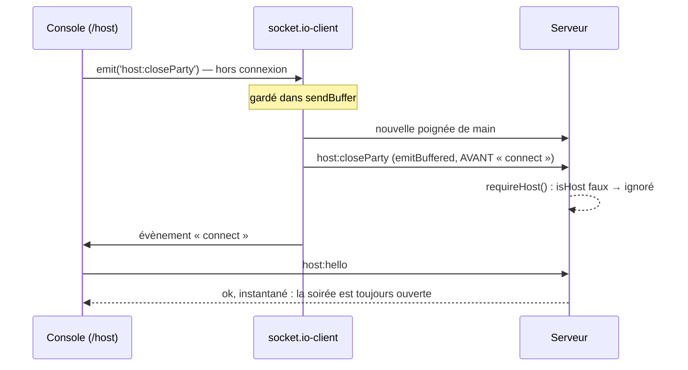

# Le client — rapport de l'expert « ce qui casse dans le navigateur »

## En bref

Le code du navigateur est solide là où on l'avait déjà vu casser : chaque
accès au stockage est sous try/catch (vingt-trois sur vingt-trois), chaque chronomètre lit
`serverNow()`, chaque écouteur a son nettoyage, un filet (`Filet`) rattrape
toute exception de rendu, et un redémarrage du serveur en pleine question se
traverse en moins d'une seconde, la réponse touchée pendant la coupure
comprise (rejoué). Ce qui casse est ailleurs : **dans ce que le client envoie
sans pouvoir savoir si c'est arrivé**. Une réponse touchée dans une liaison
morte (wifi → 4G, tunnel) se renvoie dans la même liaison morte et n'arrive
jamais ; un « Révéler » de la télécommande s'y perd pendant 14 s sans un mot ;
un « Clore la soirée » touché pendant une reconnexion est jeté par le serveur,
en silence (les trois rejoués). Et la télé pilotée par la télécommande reste
**muette toute la soirée** : son contexte audio ne naît que d'un clic sur
elle-même (rejoué). Les trois améliorations qui rapporteraient le plus :
**sonder la liaison avant le renvoi d'une réponse** (quelques lignes, prouvé
par un client corrigé : la réponse arrive seule en 6,3 s), **un accusé pour
les gestes de la console**, renvoyés après `host:hello`, et **ouvrir le son de
la télé au premier geste sur sa page** (prouvé aussi).

## Méthode

- **Lecture** (angle client, environ 1 h) : `client/src/main.tsx`, `routes.ts`,
  `state.ts`, `socket.ts`, `api.ts`, `clock.ts`, `decompte.ts`, `veille.ts`,
  `onglets.ts`, `brouillon.ts`, `format.ts`, `derniere.ts`, `retour.ts`,
  `clavier.ts`, `annonce.tsx`, `sound.ts`, `theme.ts`, `telecommande.ts`,
  `copier.ts`, `egalite.ts` ; les vues `PlayerApp`, `HostApp` (en entier),
  `ProfilApp`, `RecapApp`, `BilanApp`, `ArchivesApp`, `LoginApp`,
  `ActivateApp`, `AdminApp`, `AccountApp` (effets et gestes), `EditorApp`
  (effets, écouteurs, recherche — pas le protocole d'enregistrement,
  réservé à `bibliotheque`) ; les composants `Entree`, `Liaison`, `Absents`,
  `Reprendre`, `FinDeSoiree`, `Lendemain`, `Programme`, `Cloture`, `Coupe`,
  `ChampNombre`, `Dialog`, `AwardsBoard`, `CarteJoueur`, `Avatar`,
  `medaillons`, `Leaderboard`, `TeamBoard`, `TimerBar`, `GetReady`,
  `Appairage`, `Rejoindre`, `SpaceNav`, `StatsTable`, `RemiseEnScene`,
  `AdminDuJour` (recherche), `Jour`, `Laurier`, `Apparence`, `ProfilForm`,
  `Legendaire` ; `games/quiz/PlayerView`, `HostView`, `Course` ; côté serveur,
  pour suivre les chemins : `sockets.ts` (`party:watch`, `player:join`,
  `host:hello`, `requireHost`, `host:launch`, `host:command`,
  `host:awardTeam`, `host:seedTeams`, `host:closeParty`), `engine.ts`
  (`launch`, `endSession`), `games/quiz.ts` (réponses, `replay`),
  `core/teams.ts`, `server.ts` (réglages socket.io, service des pages), et
  `socket.io-client` 4.8.3 (`onconnect` : la réserve part avant `connect`).
- **Rejeu** : Chromium (Playwright, sans tête) — la télé en 1366 × 768, les
  téléphones en 360 × 640 tactiles —, sur le banc (`demarrer({ clientDist })`)
  qui sert le client construit dans `export/evaluations/client/dist`. Pour la
  liaison, un **relais TCP** (`trou-noir.ts`) glissé entre le navigateur et le
  serveur : il sait geler les connexions ouvertes sans les fermer (le trou
  noir d'un wifi qui bascule en 4G) ou tout couper puis rétablir. Pour
  prouver deux pistes, une **copie corrigée** du client
  (`export/evaluations/client/corrige/`, deux retouches) construite à côté et
  rejouée par les mêmes tests (`CLIENT_DIST=corrige/dist`).
- **Scripts écrits** (dans `export/evaluations/client/`) : `outils.ts`,
  `trou-noir.ts`, et dix épreuves `node:test` — `reponse-trou-noir`,
  `telecommande-trou-noir`, `cloture-perdue` (avec son témoin),
  `tele-muette` (avec son témoin), `prix-double`, `recherche-croisee`,
  `petits-etats` (deux épreuves), `deconnexion-muette`, `redemarrage` (qui
  passe : « ce qui marche »). Chacune se lance ainsi :
  `cd server && nice -n 10 node --import tsx --test --test-timeout=120000 ../export/evaluations/client/<nom>.test.ts`.
- **Pas couvert** : Safari et iOS (le cache avant/arrière, la veille réelle
  d'un iPhone, l'audio d'iOS), un vrai téléphone sur un vrai réseau, la
  mémoire sur trois heures (mesurée sans fuite le 24 par `perf-rendu`, non
  refaite), le quiz du jour (`jour-ecran`) et l'enregistrement de l'éditeur
  (`bibliotheque`).

## Constats

### 1. Une réponse touchée dans une liaison morte n'arrive jamais : le renvoi repart dans la même liaison morte

- **Où** : le téléphone, en pleine question — `client/src/socket.ts:407-411`
  (le renvoi), `:359-370` (le délai de 4 s), `:127-144` (`verifierLiaison`).
- **Constat** : `sendPlayerAction` renvoie une fois la réponse dont l'accusé
  n'est pas venu en 4 s — « tant que sa question est ouverte, on la renvoie
  une fois ». Mais le renvoi part aussitôt, par la liaison que socket.io
  croit encore vivante : il se perd comme le premier envoi. Et, à la
  différence de `demander()` (même fichier, l. 202), le délai dépassé
  n'appelle pas `verifierLiaison()` : le téléphone garde sa liaison morte
  jusqu'au battement de cœur manqué (jusqu'à 18 s), et chaque réponse
  retouchée d'ici là se perd aussi. Le cas est exactement celui que le
  commentaire de `verifierLiaison` décrit (« une connexion morte que
  socket.io croit vivante ») ; il est traité au retour au premier plan et au
  retour du réseau, pas après une réponse sans accusé.
- **Preuve** : `reponse-trou-noir.test.ts` — relais gelé juste avant le
  toucher, une seule réponse, 20 s d'observation :

  | temps | serveur | téléphone |
  |---|---|---|
  | 0,3 s | 0 réponse | « Envoi… » |
  | 8,4 s | 0 réponse | « Ta réponse n'est pas partie — touche-la à nouveau » |
  | 14,7 s | 0 réponse | bandeau « Connexion perdue » (le battement de cœur l'a vu) |
  | 16,2 s | 0 réponse | reconnecté ; la réponse n'est jamais repartie |

  Même épreuve sur la copie corrigée (piste ci-dessous) : **réponse reçue à
  6,3 s**, sans la retoucher, cochée par le serveur. Le redémarrage
  (`redemarrage.test.ts`) passe toujours avec la copie corrigée.
- **Qui ça touche, ce que ça coûte** : l'invité qui passe du wifi à la 4G,
  entre dans une cage d'escalier, ou reste accroché à un wifi sans internet
  — ses points de la question, et parfois de la suivante. Il a pourtant
  touché à temps.
- **Statut** : bug confirmé (rejoué), piste prouvée.
- **Piste** : sonder avant de renvoyer — la liaison morte est rouverte, et le
  renvoi attend dans la file de socket.io la liaison neuve (l'espace et le
  jeton qu'il porte déjà la rebranchent sur l'invité) :
  ```ts
  return envoyer()
    .then(async res => {
      if (res.ok || res.reason !== 'timeout') return res
      if (numero !== derniereReponse || !encoreOuverte()) return res
      if (!res.enFile) await verifierLiaison()   // morte : rouverte, le renvoi part dans la neuve
      if (dejaRecu) return dejaRecu
      if (numero !== derniereReponse || !encoreOuverte()) return res
      return envoyer().then(r => (!r.ok && r.reason === 'timeout' && dejaRecu ? dejaRecu : r))
    })
  ```
  et `verifierLiaison()` rend la sonde en cours plutôt que de rendre la main
  tout de suite quand `sondeEnCours` est vrai (sinon le renvoi n'attend pas
  le verdict d'une sonde lancée par `visibilitychange`).
- **Priorité · effort** : P2 · S.

### 2. À la télécommande, « Révéler » touché dans une liaison morte se perd, sans un mot, pendant 14 s

- **Où** : la console (`/host`), tenue au téléphone —
  `client/src/views/HostApp.tsx:1352` (`sendCommand` : `socket.emit('host:command', …)`
  sans accusé), et tous les gestes émis de la même façon (l. 665, 695, 767,
  776, 1100, 1149…).
- **Constat** : les gestes de l'animateur partent sans accusé. Dans une
  liaison morte, ils partent dans le vide ; rien ne déclenche
  `verifierLiaison()`, la pastille « reconnexion… » n'apparaît qu'au
  battement de cœur manqué, et le geste d'avant n'est jamais rejoué. La salle
  attend devant une question que personne ne révèle.
- **Preuve** : `telecommande-trou-noir.test.ts` — télécommande en 360 × 640
  derrière le relais, la télé sur un réseau sain ; relais gelé, un toucher
  sur « Révéler » : `0,0 s` question · `13,7 s` « reconnexion… » ·
  `14,7 s` reconnectée · **jamais révélée** en 20 s.
- **Qui ça touche, ce que ça coûte** : toute la salle, le temps que
  l'animateur comprenne et retouche ; c'est le téléphone de l'animateur, dans
  sa poche, qui change de réseau — le cas même de la télécommande.
- **Statut** : bug confirmé (rejoué).
- **Piste** : un accusé pour les gestes de la console — `ecouter` le permet
  déjà côté serveur (`repondre({ ok: true })`) —, émis par `demander()` :
  sans accusé en 3 s, la liaison est sondée et rouverte, et le geste repart
  une fois la console re-présentée (la visée, invariant 12, écarte le doublon
  et le geste périmé). En attendant : un geste sans effet visible au bout de
  2 s appelle `verifierLiaison()`.
- **Priorité · effort** : P2 · M (serveur et client).

### 3. « Clore la soirée » touché pendant une reconnexion est jeté par le serveur, en silence

- **Où** : `client/src/views/HostApp.tsx:767` (`socket.emit('host:closeParty', …)`),
  `:452-489` (`host:hello` au `connect`) ; `server/src/sockets.ts:700`
  (`requireHost()`) ; `socket.io-client` `socket.js:585-593`.
- **Constat** : hors connexion, socket.io garde le geste en réserve et
  l'envoie au retour — **avant** l'évènement `connect`, donc avant que
  `HostApp` ne se re-présente par `host:hello`. Le serveur le reçoit d'une
  connexion qui n'est pas encore l'écran commun (`socket.data.isHost` faux)
  et l'ignore. L'animateur a vu sa boîte se fermer ; la soirée reste
  ouverte, aucun invité ne reçoit sa fin, aucun message ne le dit. Même sort
  pour tout geste de la console touché pendant la reconnexion (un prix, un
  « Quiz suivant »), mais la clôture est le seul après lequel on s'en va.
- **Preuve** : `cloture-perdue.test.ts` — la télé derrière le relais, relais
  coupé (la pastille « reconnexion… » paraît), « Clore la soirée » puis la
  confirmation, relais rétabli : console revenue, **aucune fin reçue par
  l'invitée, pas d'écran de clôture, aucun message**. Le témoin, liaison
  tenue, clôt bien (l'invité reçoit `party:reset`, soirée vierge).
- **Qui ça touche, ce que ça coûte** : toute la salle si l'animateur referme
  l'ordinateur sur la foi de sa boîte fermée — pas de fin de soirée, pas de
  hauts faits ni de paliers (décidés à la clôture seulement, invariant 10),
  et la soirée suivante qui se jouerait dans la même.
- **Statut** : bug confirmé (rejoué). L'expert `concurrence` regarde un geste
  pendant une coupure côté serveur : les deux se recoupent peut-être.
- **Piste** : la même que le constat 2 (accusé + `demander()`, qui attend la
  liaison et émet après `host:hello` : les écouteurs `connect` se lisent dans
  l'ordre de leur pose). Tout de suite : « Clore la soirée » et « C'était un
  essai » grisés tant que `!s.connected`, avec « Reconnexion… — la soirée
  n'est pas close » dans la boîte.
- **Priorité · effort** : P2 · S pour le garde-fou, M pour l'accusé.

### 4. La télé pilotée par la télécommande reste muette toute la soirée

- **Où** : `client/src/sound.ts:31-68` (`initAudio`, `tone`),
  `client/src/views/HostApp.tsx:664, 694, 1554` (les trois seuls appels) ;
  les sons joués par la télé : `games/quiz/HostView.tsx:415-420`,
  `HostApp.tsx:388-391`, `components/TimerBar.tsx:61-65`,
  `components/GetReady.tsx:18-22`, `components/RemiseEnScene.tsx:31-35`.
- **Constat** : le contexte audio ne naît que dans `initAudio()`, et seuls
  trois clics **sur cette page** l'appellent : « Lancer un quiz », un
  changement de scène, le bouton des sons. Quand l'animateur pilote au
  téléphone, c'est la télé qui doit sonner — « la fanfare sonne sur l'écran
  qui montre la scène, pas sur la télécommande » (HostApp.tsx) —, et
  personne ne clique jamais sur elle : pas de contexte, `tone()` rend la main
  sans un son. Pas de 3-2-1, pas de départ, pas de tic-tac, pas de
  révélation, pas de fanfare, pas de prix remis — et l'icône des sons dit
  « allumé ». La télé s'était pourtant connectée d'un clic : le navigateur
  aurait laissé jouer.
- **Preuve** : `tele-muette.test.ts` — espion sur `AudioContext` dans la page
  de la télé ; quiz lancé et choisi à la télécommande : **0 contexte, 0 son**
  à la question. Témoin : deux clics sur « Sons » à la télé, puis
  « Révéler » à la télécommande → 1 contexte `running`, 3 sons. Copie
  corrigée (un geste quelconque sur la page ouvre le son) : 1 contexte
  `running`, **5 sons dès la question** (le 3-2-1 et le départ).
- **Qui ça touche, ce que ça coûte** : toute la salle, toute la soirée, dès
  qu'on anime à la télécommande — le mode que « Brancher la télé » met en
  avant. Une télé branchée par le code n'a même jamais vu un geste : il faut
  le lui demander. Même cause, non rejouée : l'extrait d'un blind test
  (`ExtraitSonore`) ne se lance que par un bouton… sur la télé.
- **Statut** : bug confirmé (rejoué), piste prouvée pour la télé qui a eu un
  clic.
- **Piste** : ouvrir le son au premier geste, quel qu'il soit, sur la page
  de l'écran commun (écouteurs `pointerdown` et `keydown` en capture qui
  appellent `initAudio()`), et, tant que `!ctx || ctx.state !== 'running'`
  sans être en muet, le dire à la télé : « Son en attente — touche l'écran
  une fois » (l'icône des sons en état barré).
- **Priorité · effort** : P2 · S.

### 5. Un double clic sur « Attribuer » remet le prix deux fois

- **Où** : `client/src/components/AwardsBoard.tsx:121-127`,
  `client/src/views/HostApp.tsx:1096-1101` ; `server/src/sockets.ts:822-829`.
- **Constat** : chaque clic émet `host:awardTeam`, et rien ne rend le bouton
  inerte avant que l'instantané ne revienne (120 ms de regroupement au
  moins) ; le serveur n'écarte pas le doublon. Deux points d'équipe au lieu
  d'un — de quoi retourner la victoire. Le prix libre en est protégé par
  hasard : son motif se vide au clic, et le bouton se grise.
- **Preuve** : `prix-double.test.ts` — deux équipes, un quiz de trois
  questions joué, écran « Prix » à la télé, double clic sur le premier
  « Attribuer » : **2 remises — « +1 L'Éclair, +1 L'Éclair »**. Témoin (même
  fichier) : le prix libre double-cliqué ne part qu'une fois.
- **Qui ça touche, ce que ça coûte** : le vainqueur de la soirée, devant la
  salle ; l'animateur peut retirer la ligne de trop… s'il la voit.
- **Statut** : bug confirmé (rejoué).
- **Piste** : côté page, un prix « en cours » (`Set` des clés) inerte jusqu'à
  ce que `givenTitles` le contienne ou 2 s ; côté serveur, un identifiant de
  remise tiré au clic (« Redonner » en tire un neuf) qui rend le geste
  idempotent.
- **Priorité · effort** : P2 · S.

### 6. « Mes quiz » : deux recherches qui se croisent — sous « france », la liste de « fr »

- **Où** : `client/src/views/EditorApp.tsx:444-455` ; même motif dans
  `client/src/components/AdminDuJour.tsx:94-100` (les profils du quiz du
  jour).
- **Constat** : la recherche attend 250 ms puis `api.chercher(mots).then(setTrouves)`,
  sans écarter une réponse périmée. Une recherche courte (plus de résultats,
  plus lente) suivie d'une longue : la première réponse arrive en dernier et
  remplace la liste.
- **Preuve** : `recherche-croisee.test.ts` (la réponse de « fr » retardée par
  `page.route`) : saisie « france » · d'abord `La France et ses régions |
  🌍 Culture générale` · puis `Fromages | La France et ses régions |
  🌍 Culture générale`.
- **Qui ça touche, ce que ça coûte** : l'animateur qui cherche un quiz la
  veille — un quiz qui ne correspond pas, sans rien de grave.
- **Statut** : bug confirmé (rejoué).
- **Piste** : un drapeau dans l'effet (`let perime = false` ; nettoyage :
  `perime = true` ; `.then(r => !perime && setTrouves(r))`).
- **Priorité · effort** : P3 · S.

### 7. Un jeton d'une soirée passée fait voir une salle d'attente vide avant l'entrée

- **Où** : `client/src/state.ts:245` (`me` lu du stockage),
  `client/src/views/PlayerApp.tsx:112-149` (`presente` vrai dès
  `party:watch`, avant la re-présentation), `:394`.
- **Constat** : le téléphone éteint à la clôture (ou exclu pendant son
  sommeil) garde son jeton. Au retour, la page montre la salle d'attente
  d'un invité sans prénom, « 0 pt », avec le classement de la soirée — et
  pose au passage la garde du retour —, puis l'entrée quand l'accusé refuse
  le jeton.
- **Preuve** : `petits-etats.test.ts` (1) : écrans vus « salle d'attente
  (« », 0 pt) → entrée ».
- **Qui ça touche, ce que ça coûte** : le lendemain, l'invité qui rouvre le
  lien : un éclair d'écran faux (un aller-retour, plus en 4G).
- **Statut** : bug confirmé (rejoué).
- **Piste** : tant qu'une re-présentation par jeton est en vol, `AttenteConnexion`
  (un état `representation` posé avant `joinAsPlayer`, levé à son accusé).
- **Priorité · effort** : P3 · S.

### 8. La carte d'un joueur, fermée par le quiz, se rouvre toute seule après

- **Où** : `client/src/views/PlayerApp.tsx:84`, `:640`.
- **Constat** : `carte` n'est remise à `null` que par « Fermer » ; le quiz
  prend l'écran (la carte disparaît avec la salle d'attente), puis la fin du
  quiz la rouvre — et la redemande au serveur.
- **Preuve** : `petits-etats.test.ts` (2) : carte ouverte, quiz lancé puis
  terminé → la carte est de nouveau à l'écran.
- **Statut** : bug confirmé (rejoué).
- **Piste** : `useEffect(() => setCarte(null), [sessionId])`.
- **Priorité · effort** : P3 · S.

### 9. « Me déconnecter » dit « déconnecté » quand la déconnexion a échoué

- **Où** : `client/src/views/ProfilApp.tsx:376-379`.
- **Constat** : `await api.joueur.deconnexion().catch(() => {})` puis
  `setProfil(null)` : la requête perdue (le wifi, l'hébergeur qui se
  réveille), la page montre le formulaire de connexion sans un mot, et le
  cookie du profil — un an — reste. Le téléphone prêté rouvre le profil de
  son propriétaire au rechargement suivant.
- **Preuve** : `deconnexion-muette.test.ts` (requête coupée par `page.route`) :
  formulaire affiché, aucun message ; au rechargement, profil toujours
  ouvert.
- **Statut** : bug confirmé (rejoué).
- **Piste** : en cas d'échec, garder le profil et dire `motifDe(e)` ; ne
  passer au formulaire qu'une fois la réponse du serveur reçue.
- **Priorité · effort** : P3 · S.

### 10. Petits durcissements (lecture)

- **Une panne du serveur se lit « cette adresse ne mène à rien »** —
  `PlayerApp.tsx:102` et `:365` : `party:watch` qui répond
  `{ ok: false, error: SERVER_ERROR }` (le repli d'`ecouter` sur exception)
  fait afficher `FormulaireSoiree`, qui ignore le motif : « « banc » ne mène
  à aucune soirée », jusqu'au rechargement. Piste : ne passer à
  `FormulaireSoiree` que sur le motif « espace inconnu », sinon dire le motif
  et réessayer. P3 · S, confirmé (lecture).
- **« Qui manque ? » garde son minuteur toute la soirée** — `Absents.tsx:51-56` :
  un code demandé reste dans `codes`, périmé compris, et l'intervalle de 5 s
  ne s'arrête plus. Piste : retirer les codes périmés au tic. P3 · S,
  confirmé (lecture).
- **« Copier le lien » d'activation sans presse-papiers** — `AdminApp.tsx:59` :
  en `http://` (le repli local), `navigator.clipboard` est absent,
  `writeText` lève avant le `.catch`, et rien ne se passe — ni copie, ni
  message. Piste : `copierTexte()` (`copier.ts`), comme ailleurs. P3 · S,
  confirmé (lecture).
- **La boîte « Clore la soirée » attend sans délai** — `HostApp.tsx:753` :
  `fetch(soirees.json)` n'a pas de délai ; dans une liaison morte, la boîte
  ne s'ouvre pas, et l'animateur retouche. Piste : un délai de 3 s, le titre
  par défaut ensuite. P3 · S, non confirmé.

## Mesures et cartes

**La liaison morte, en secondes après le toucher** (relais gelé ; `uptime`
0,1 à 1,6 pendant les passes — l'ordre de grandeur tient au battement de
cœur, 10 + 8 s, pas à la machine) :

| scénario | aujourd'hui | client corrigé |
|---|---|---|
| réponse d'invité touchée une fois | jamais reçue ; « pas partie » à 8,4 s ; liaison revue à 14,7 s | **reçue à 6,3 s**, sans retoucher |
| « Révéler » à la télécommande | jamais appliqué ; « reconnexion… » à 13,7 s | (piste non codée) |
| « Clore la soirée » pendant une reconnexion | jeté par le serveur, sans message | (piste non codée) |
| serveur redémarré en pleine question | liaison revenue en 0,9 s, réponse de la coupure reçue | 1,5 s, reçue |

**Le son de la télé** (espion `AudioContext`, quiz lancé à la télécommande) :

| page de la télé | contextes | sons à la question |
|---|--:|--:|
| aujourd'hui (un clic : la connexion) | 0 | 0 |
| témoin, après deux clics sur « Sons » | 1 (`running`) | 3 à la révélation |
| client corrigé | 1 (`running`) | 5 (3-2-1 + départ) |

**Pourquoi le geste de la console se perd pendant une reconnexion** :



**Les doubles gestes, bouton par bouton** :

| geste | double clic | pourquoi |
|---|---|---|
| réponse QCM / estimation / « plusieurs » | sans effet | le serveur confirme sans réécrire la même réponse |
| « Rejoindre », « Créer mon profil », « Reprendre ma place » | protégés | `busy` posé au clic, rendu avant le second |
| « C'est parti ! », « Révéler », « Question suivante » | protégés | phase vérifiée au serveur, visée (inv. 12), garde de 500 ms |
| « Les créer d'un coup », « Ajouter » (équipe) | protégés | serveur idempotent / champ vidé au clic |
| prix libre « Attribuer » | protégé par hasard (rejoué : 1 remise) | motif vidé au clic, bouton grisé avant le second |
| **prix calculé « Attribuer »** | **deux remises** | constat 5 |
| « Lancer un quiz » | deux parties créées, la première (vide) close | sans dommage (lecture) |

## Ce qui marche — à ne pas casser

- **Le redémarrage en pleine question** (rejoué) : « Pas encore partie —
  elle partira dès que le réseau revient », liaison revenue en 0,9 s, jeton
  re-présenté, réponse de la coupure reçue — grâce à l'espace et au jeton que
  porte chaque `player:action`, puisque la réserve de socket.io part avant la
  re-présentation.
- **`demander()`** : n'émet que sur une liaison qui a une chance d'aboutir,
  une seule fois, et sonde la liaison à son délai. C'est le modèle qu'il
  faut étendre aux réponses (constat 1) et aux gestes de la console (2, 3).
- **Le temps** : aucun chronomètre à `Date.now()` — la barre, le 3-2-1,
  l'enchaînement, l'échéance des réponses lisent `serverNow()` ;
  `Date.now()` ne sert qu'aux dates affichées et à l'échantillonnage.
- **Le stockage** : vingt-trois accès, tous sous try/catch ; la fin gardée est
  relue et validée (`lireGardee`, version, douze heures).
- **Les effets** : chaque `addEventListener` d'un composant a son retrait,
  chaque minuteur son `clearTimeout`, chaque `ResizeObserver` son
  `disconnect` ; aucun `requestAnimationFrame` ; les rappels de socket lisent
  `getState()` ou des refs, jamais un état figé ; les listes mémoïsées
  (`memesChamps`, `memesPuces`) ne redessinent que la ligne qui change.
- **Le filet** : `Filet` rattrape toute exception de rendu, paquet disparu
  après un déploiement compris ; les médaillons en échec valent pour toute la
  page, sans boucle de rechargement.
- **La garde des commandes** : visée (invariant 12) + `gesteAccepte` : un
  double clic ne saute ni révélation ni question.

## Recommandations, dans l'ordre

1. **Sonder la liaison avant de renvoyer une réponse** (constat 1) — P2 · S,
   prouvé par la copie corrigée.
2. **Griser les gestes de fin tant que la console est hors ligne**, et dire
   « la soirée n'est pas close » (constat 3) — P2 · S.
3. **Ouvrir le son de la télé au premier geste sur sa page, et dire quand il
   manque** (constat 4) — P2 · S, prouvé.
4. **Rendre « Attribuer » idempotent** (constat 5) — P2 · S.
5. **Un accusé pour les gestes de la console**, émis par `demander()` et
   renvoyés après `host:hello` (constats 2 et 3) — P2 · M.
6. **Écarter les réponses de recherche périmées** (constat 6) — P3 · S.
7. **Attendre la re-présentation avant la salle d'attente** (constat 7) — P3 · S.
8. **Refermer la carte quand le quiz prend l'écran** (constat 8) — P3 · S.
9. **Dire l'échec de « Me déconnecter »** (constat 9) — P3 · S.
10. **Les petits durcissements** (constat 10) — P3 · S.

### Les défauts, fichier par fichier

| fichier | défaut | scénario | correction |
|---|---|---|---|
| `client/src/socket.ts:407-411` | renvoi d'une réponse dans la liaison morte, sans sonde | wifi → 4G pendant une question | sonder, puis renvoyer (constat 1) |
| `client/src/socket.ts:127-144` | `verifierLiaison` rend la main sans verdict si une sonde court | renvoi pendant une sonde de `visibilitychange` | rendre la promesse de la sonde en cours |
| `client/src/views/HostApp.tsx:1352` (et 665, 695, 767, 776, 1100, 1149) | gestes sans accusé | télécommande dans une liaison morte ; console en reconnexion | accusé + `demander()` (constats 2, 3) |
| `client/src/views/HostApp.tsx:778-783` | « Clore la soirée » actif hors ligne | clic pendant « reconnexion… » | griser tant que `!s.connected` |
| `client/src/views/HostApp.tsx:753` | `fetch` sans délai avant la boîte de clôture | liaison morte | délai de 3 s |
| `client/src/sound.ts:31-68` | contexte audio créé par trois clics seulement | télé pilotée à la télécommande, télé branchée par code | geste quelconque → `initAudio()`, et le dire (constat 4) |
| `client/src/games/quiz/HostView.tsx:298-332` | l'extrait ne se lance que sur la télé | blind test à la télécommande, télé sans geste | même remède (non rejoué) |
| `client/src/components/AwardsBoard.tsx:121-127` | double remise | double clic | prix « en cours », identifiant de remise (constat 5) |
| `client/src/views/EditorApp.tsx:444-455` | réponse de recherche périmée | « fr » lent puis « france » | drapeau `perime` (constat 6) |
| `client/src/components/AdminDuJour.tsx:94-100` | idem | recherche d'un profil | idem |
| `client/src/views/PlayerApp.tsx:112-149, 394` | salle d'attente vide avant l'entrée | jeton d'une soirée passée | attendre l'accusé (constat 7) |
| `client/src/views/PlayerApp.tsx:84, 640` | carte rouverte | carte ouverte au départ d'un quiz | `setCarte(null)` au changement de partie (constat 8) |
| `client/src/views/PlayerApp.tsx:102, 365` | panne lue comme adresse inconnue | exception dans `party:watch` | motif distinct (constat 10) |
| `client/src/views/ProfilApp.tsx:376-379` | déconnexion muette | requête perdue | garder le profil, dire l'échec (constat 9) |
| `client/src/components/Absents.tsx:51-56` | minuteur sans fin | un code demandé une fois | purger les codes périmés (constat 10) |
| `client/src/views/AdminApp.tsx:59` | copie qui lève en `http://` | repli local | `copierTexte()` (constat 10) |

## Limites

- Rien n'est vérifié sur Safari ni sur iOS : le cache avant/arrière (aucun
  écouteur `pageshow` ; la reprise compte sur `visibilitychange`), la veille
  réelle d'un iPhone, l'audio d'iOS (qui demande un geste dans le
  gestionnaire lui-même) restent à regarder sur un vrai appareil — Playwright
  désactive le cache avant/arrière de Chromium.
- Le trou noir est simulé par un relais TCP local ; sur un vrai réseau, le
  délai avant que le battement de cœur ne voie la liaison morte varie entre
  8 et 18 s selon l'instant du dernier ping.
- Les pistes des constats 2 et 3 (accusé des gestes) ne sont pas codées ;
  celles des constats 1 et 4 le sont dans une copie (`corrige/`), pas dans le
  dépôt.
- La mémoire sur trois heures n'a pas été remesurée (le 24 : plate, tas et
  nœuds). Le quiz du jour à l'écran et l'enregistrement de l'éditeur sont à
  d'autres experts.

## Hors mission

- `server/src/core/engine.ts:214-215` : `host:launch` ne dit pas ce qu'il
  remplace, et `launch()` termine la partie en cours quelle qu'elle soit —
  un « Quiz suivant » périmé d'une seconde console couperait un quiz lancé
  par l'autre (fenêtre ~120 ms, non rejoué ; invariant 12).
- `server/src/sockets.ts:822-829` : `host:awardTeam` n'a aucun garde-fou de
  doublon — la moitié serveur du constat 5.
