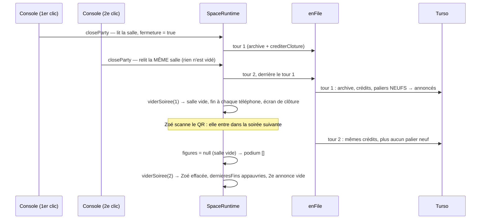

# Concurrence — rapport de l'expert des courses

## En bref

Le code asynchrone de FiestApp est construit avec soin. `ecouter()` et le filet du processus empêchent qu'un rejet arrête le serveur une fois prêt. Aucun verrou ne peut rester pris : les files `enFile`, `avecVerrou`, `unParUn` et `remise` s'avalent leurs échecs, et les promesses gardées oublient leurs pannes. Les sections critiques du quiz du jour (`#nuit`, `#tirage`, un verrou par profil) tiennent en rafale.

Les trous se trouvent là où un geste **lit, attend, puis écrit** sans exclure son jumeau :
- les deux gestes de fin de soirée ne s'excluent pas ;
- les réserves d'essais comptent un échec après l'attente du hachage ou de la base ;
- deux caches se posent dans l'ordre où les réponses reviennent (classement du jour, bibliothèque).

J'ai trouvé **onze courses**, toutes rejouées par un test qui échoue aujourd'hui.

Les trois corrections les plus rentables :
1. **Un verrou de fin de soirée, et une fin racontée depuis la base.** « Clore » et « C'était un essai » s'excluent, et une clôture rejouée redit la même chose. Cela corrige les constats 1 et 4.
2. **Compter les essais en vol dans `LoginBudget`** et dans la réserve des codes de partage (constats 2 et 9).
3. **Figer `revision` avant les attentes dans `joueursDu`**, et laisser une marge à la nuit (constats 3 et 6).

## Méthode

- **Lu en entier** : `core/space.ts`, `core/jour.ts`, `sockets.ts`, `core/engine.ts` (minuteries), `core/pages.ts`, `core/backup.ts` (file, `reset`, `direct`, resynchronisation), `core/partages.ts`, `server/src/partages.ts`, `auth/appairage.ts`, `api.ts`, `quizDuJour.ts`, `index.ts` (le filet).
- **Lu en partie** :
  - `auth/profiles.ts` : crédits, paliers, `update`, `useRecovery`, sessions ;
  - `auth/store.ts` : sessions, `linkProfile`, activations ;
  - `auth/http.ts` (`LoginBudget`), `auth/profileRoutes.ts`, `auth/routes.ts`, `auth/password.ts` ;
  - `core/archive.ts` (`save`, `rename`, `memoire`, `ecrire`), `core/quizStore.ts` (`save`, `pruneImages`), `core/recalcul.ts`, `core/distante.ts`, `core/budget.ts`, `core/pouls.ts` ;
  - `server.ts` (branchements, pages publiques, `refreshLibrary`) ;
  - côté client, `HostApp.tsx` (`clore`), `Dialog.tsx`, `socket.ts`, `Secours.tsx`, et `socket.io-client` 4.8.3 (`build/cjs/socket.js:610`).
- **Relu** : `CLAUDE.md`, le README (« La direction »), `retours/2026-09-24/experts/robustesse-espaces.md` (les couplages entre espaces, corrigés depuis), le journal de `npm run verify` (aucune trace d'échec asynchrone hors pannes simulées).
- **Écrit** : quatorze fichiers `node:test` dans `export/evaluations/concurrence/`, sur le banc (`server/test/banc.ts`), avec leur sortie à côté (`*.sortie.txt`). L'entrelacement est **forcé** de trois façons :
  - des requêtes lancées ensemble (`Promise.all`) ;
  - une méthode de magasin rallongée pour jouer la latence de Turso : `ArchiveStore.save`, `PartageStore.recevoir`, `ProfileStore.byId` ou `retirerSoireeEntiere`, `QuizStore.all` ;
  - une porte posée dans une méthode (`JourStore.enregistrer`, `ProfileStore.verify`), ou une base piégée (`RAISE(ABORT)`).
- **Machine et durée** : un seul fichier de test à la fois, `nice -n 10`, charge 0,3 à 1,9 sur quatre cœurs partagés ; environ trois heures. Aucun serveur ni processus laissé derrière moi. Le dossier `/tmp/quizz-banc-nYB8pN` n'est pas à moi : quinze déclencheurs de panne, aucun profil.
- **Pas couvert** :
  - le vrai Turso : les latences sont simulées, et le client HTTP libsql peut rendre ses réponses dans le désordre, ce que le fichier `file:` du banc ne fait jamais ;
  - deux processus sur la même base (voir Limites) ;
  - aucun écran regardé : l'angle est serveur.

## Constats

### 1. Les deux gestes de fin ne s'excluent pas : deux clôtures croisées, ou un essai effacé puis clos
- **Où** :
  - `server/src/core/space.ts:1407` (`closeParty`) et `:1684` (`discardParty`) posent `fermeture` et ne la lisent pas. Seul `apresQuiz` la lit (`:810`). `archiveParty` (`:1359`) l'ignore aussi.
  - `sockets.ts:864` et `:901` n'ont aucune garde.
  - `client/src/views/HostApp.tsx:751` : le bouton « Clore la soirée » reste affiché, sans état « en cours », tant que la salle n'est pas vidée.
- **Constat** : chaque geste lit les journaux avant sa première attente, puis passe dans la file (`enFile`) derrière l'autre. Le second relit donc la soirée entière. Il passe après le premier, qui a déjà vidé la salle, puis recrédite, réannonce et revide. Effets rejoués :
  - l'écran commun reçoit une **seconde annonce de clôture au podium vide** : la salle est déjà vidée, et `figure()` rend `null` pour tous ;
  - la fin gardée pour les téléphones endormis (`dernieresFins`, `:1623`) est remplacée par une fin **sans le palier tombé ce soir, sans niveau ni finition**. Alice lit 16 XP au lieu de 26 (le palier Globe-trotteur a disparu) ;
  - l'invitée **entrée entre les deux** (Zoé, qui scanne le QR dès la première annonce) est **effacée** par la seconde clôture. Son téléphone apprend à sa re-présentation que « La soirée est close », alors qu'elle venait d'arriver pour la suivante ;
  - « C'était un essai » puis « Clore » : l'animateur lit « **Essai effacé — rien n'a été gardé** », et pourtant la soirée est **archivée et créditée**. La clôture avait lu la soirée avant l'effacement, et l'a réécrite après.
- **Preuve** : `double-cloture.test.ts`
  ```
  annonce 1 : podium = ["Alice","Bob","Dora"]
  annonce 2 : podium = []
  fin en direct : …"niveau":1,"finition":"mat",…"profil":{"xp":26,"xpPaliers":10,…"paliers":[{"key":"hf:globe-trotteur:1",…}]
  fin au réveil : … (ni niveau ni finition) …"profil":{"xp":16,"xpPaliers":0,…"paliers":[]
  salle après les deux clôtures : []
  Zoé se re-présente : {"ok":false,"reason":"unknown-token","error":"La soirée est close. La dernière soirée de cet espace : …"}
  ```
  Et `essai-et-cloture.test.ts` :
  ```
  télé : Essai effacé — rien n’a été gardé
  téléphone : « Finalement, on garde » est close — la soirée suivante peut commencer
  archive après coup : [{"id":"2026-09-27-…","title":"Finalement, on garde"}]
  expérience après coup : [{"profile_id":"…","xp":8}]
  ```
- **Qui ça touche, ce que ça coûte** : la salle entière, au moment le plus regardé de la soirée. La fenêtre dure le temps de la clôture : le journal la mesure (« close en N ms »), et elle se compte en secondes à cent profils sur Turso. Pendant ce temps, la console n'affiche rien, ni toast ni bouton grisé : c'est exactement là qu'on clique une seconde fois. Il suffit d'une console. Une télé et un téléphone d'animateur doublent le risque. Le cas de l'essai casse la promesse de l'invariant 18 : « C'était un essai » doit tout effacer.
- **Statut** : bug confirmé (rejoué).
- **Piste** : une fin à la fois par espace, côté serveur :
  ```ts
  // space.ts
  private fin: { geste: 'close' | 'discard'; tour: Promise<unknown> } | null = null
  async closeParty(title?: string) {
    if (this.fin?.geste === 'close') return this.fin.tour as Promise<ArchiveSummary | null> // le même clic, la même issue
    if (this.fin) throw new Error('La soirée est déjà en train de s’effacer — patiente un instant')
    const tour = this.clore(title) // le corps actuel
    this.fin = { geste: 'close', tour }
    try { return await tour } finally { this.fin = null }
  }
  // discardParty : symétrique ; archiveParty : refusé pendant une fin.
  ```
  Côté console, le bouton passe à « Clôture en cours… », désactivé, jusqu'au toast.
- **Priorité · effort** : P2 · S.

### 2. Les essais de connexion en rafale passent le verrou par identifiant
- **Où** :
  - `server/src/auth/http.ts:147` : `allow` lit le verrou ; `:154` : `failed` ne l'écrit qu'après.
  - Toutes les portes passent entre les deux par l'attente de scrypt : `/api/joueur/connexion` (`profileRoutes.ts:204-209`), `/api/auth/login` (`routes.ts:63-71`), le changement de mot de passe (compte et profil), le rattachement d'un profil (`routes.ts:216-222`) et le code de secours.
- **Constat** : `LoginBudget` promet « cinq échecs et le compte se ferme un quart d'heure, d'où que viennent les essais ». Mais vingt essais partis ensemble passent tous `allow` avant que le premier échec ne soit compté : scrypt prend des dizaines de millisecondes dans le pool de threads. Seule la réserve par adresse (vingt d'un coup) les borne. On obtient donc vingt essais par adresse et par quart d'heure au lieu de cinq en tout, et autant de fois vingt que d'adresses.
- **Preuve** : `essais-en-rafale.test.ts`
  ```
  en série : 401 401 401 401 401 429 429
  en rafale : 401 ×19, puis 200
  essais faux vérifiés : 19 ; le bon mot de passe, en vingtième : 200
  ```
- **Qui ça touche, ce que ça coûte** : tout compte et tout profil, celui de l'administrateur compris. Un profil rattaché ouvre aussi la console de son espace (`identite` → `ouvrirConsole`). Pour un attaquant qui dispose de nombreuses adresses (un /64 IPv6 suffit), la garde par identifiant ne limite plus rien. Un mot de passe faible, de huit caractères au minimum, tombe en ligne.
- **Statut** : bug confirmé (rejoué), sécurité.
- **Piste** : compter les essais en vol comme des échecs tant qu'ils ne sont pas jugés :
  ```ts
  // LoginBudget
  private enVol = new Map<string, number>()
  essayer(ip: string, key: string): { echec(): void; reussite(): void } | null {
    if (!this.byIp.take(ip)) return null
    const lock = this.locks.get(key); const n = this.enVol.get(key) ?? 0
    if ((lock && lock.until > Date.now()) || (lock?.failures ?? 0) + n >= 5) return null
    this.enVol.set(key, n + 1)
    let fini = false
    const sortir = () => { if (!fini) { fini = true; this.enVol.set(key, (this.enVol.get(key) ?? 1) - 1) } }
    return { echec: () => (sortir(), this.failed(key)), reussite: () => (sortir(), this.succeeded(key)) }
  }
  ```
  Chaque porte appelle l'un ou l'autre dans un `finally`, sortie anticipée comprise (compte en pause, mot de passe neuf refusé). Le test donné se retourne : cinq essais vérifiés au plus.
- **Priorité · effort** : P2 · S.

### 3. Le classement du jour se garde sous un numéro qu'il n'a pas vu, et la nuit paie son podium dessus
- **Où** : `server/src/core/jour.ts:873-889` (`joueursDu`). Le classement lu en base (`SELECT … FROM jour_parties`, puis chaque profil par lots de huit) se range sous `revision: this.revision`, **lue après** ces attentes (`:885`). `clore` (`:1212`) lit ce même cache.
- **Constat** : une réponse écrite pendant la lecture d'un autre joueur fait monter `revision`. La lecture, partie avant la réponse, se range alors sous le numéro neuf : le classement périmé est servi à tous jusqu'à la prochaine écriture du jour. Pour la dernière réponse de la soirée, il reste jusqu'à la nuit, qui fige le podium, l'expérience, le laurier et « Le Champion du jour ». Dans le test, la réponse gagnante de Bob est écrite à 22 h 30, pendant qu'Alice ouvre le classement. Aucune réponse n'est en route à minuit.
- **Preuve** : `classement-garde-perime.test.ts`
  ```
  Bob après sa dernière réponse : rang 2 — classement : [["Alice",1800,1],["Bob",1600,2],["Chloé",0,3]]
  points en base : [1800,1800,0] — podium de la nuit : [["Alice",1,1800],["Bob",2,1600]]
  vainqueurs d’hier annoncés : ["Alice"]
  ```
- **Qui ça touche, ce que ça coûte** : les joueurs du quiz du jour quand deux d'entre eux sont actifs en même temps. La fenêtre est la durée de la lecture : après un réveil de l'hébergeur, chaque profil du classement se recharge au loin (trois allers-retours par lot de huit), soit des centaines de millisecondes. Le podium faux est **définitif** (`INSERT OR IGNORE`) : 10 XP et un laurier au mauvais joueur, un palier « Champion du jour » perdu.
- **Statut** : bug confirmé (rejoué).
- **Piste** : lire le numéro **avant** d'attendre, comme le fait déjà `ArchiveStore.memoire` :
  ```ts
  private async joueursDu(jour: string, pour: string | null, frais = false) {
    const revision = this.revision // avant la lecture : une écriture pendant la lecture la rend caduque
    …
    this.classementsGardes.set(jour, { revision, joueurs: tous })
  ```
  La nuit (`clore`) lit toujours la base, sans cache (`frais = true`).
- **Priorité · effort** : P2 · S.

### 4. Une clôture rejouée ne raconte plus ce que la première a rangé
- **Où** : `server/src/core/space.ts:1473-1528` (`crediterCloture`) et `auth/profiles.ts:1414` (`accorderPaliers`, qui ne rend que les paliers **neufs**). Les légendaires « gagnés ce soir » se comparent à ceux lus juste avant (`avant`, `:1477`).
- **Constat** : `closeParty` crédite **avant** d'effacer. Quand le miroir refuse d'effacer, l'animateur lit « Rien n'a été effacé — réessaie dans un instant », et la soirée continue. Pourtant ses paliers de carrière sont déjà rangés sous son nom. Au second clic, `accorderPaliers` ne rend plus rien de neuf : la fin de chaque téléphone et l'écran de clôture se taisent sur ces paliers, sur les légendaires qu'ils ouvrent et sur les montées de niveau qu'ils donnent. C'est aussi l'appauvrissement du constat 1 : ce que la clôture raconte se calcule en écrivant, et ne se relit pas.
- **Preuve** : `cloture-rejouee.test.ts`, le miroir piégé en `DELETE` puis rétabli
  ```
  première clôture : error Rien n’a été effacé : la sauvegarde en ligne ne répond pas — réessaie dans un instant
  paliers rangés en base : ["hf:globe-trotteur:1"]
  fin d’Alice : {"xp":8,"xpPaliers":0,"paliers":[]}
  ```
- **Qui ça touche, ce que ça coûte** : toute la salle, le soir où Turso hoquette à la clôture. Le message invite à réessayer. Le palier reste bien en base : la page du profil le montre. Mais la fin de soirée, le seul moment où on le découvre, l'oublie, et un légendaire tombé ce soir-là passe sous silence.
- **Statut** : bug confirmé (rejoué). Le déclencheur relève de la persistance, le ressort de la course.
- **Piste** : raconter depuis la base, comme le quiz du jour le fait déjà (`recompensesDuJour`). Les paliers de la fin sont ceux rangés **sous cette soirée** (`SELECT badge FROM profile_badges WHERE profile_id = ? AND soiree_id = ? AND space_id = ? AND badge GLOB 'hf:*:[123]'`), et non ceux que ce passage vient d'écrire. Les légendaires ouverts se déduisent de ces paliers (`legendairesOuvertsPar`), et `xpPaliers` de leur somme. Une clôture rejouée, ou doublée, dit alors la même chose que la première.
- **Priorité · effort** : P2 · M.

### 5. Entré pendant la clôture, effacé sans un mot
- **Où** : `server/src/core/space.ts:1720-1772` (`viderSoiree`) : `if (raison === 'discard') socket.emit('party:reset')` (`:1771`).
- **Constat** : la clôture lit la salle au départ, puis attend l'archive et les crédits, des secondes sur Turso. Pendant ce temps, la télé montre encore le QR. Qui entre alors s'inscrit dans la soirée qu'on clôt, et `viderSoiree` l'efface avec elle. Comme la raison est « close », son téléphone est détaché sans rien recevoir : ni fin (il n'était pas dans la salle lue au départ), ni `party:reset`. Il reste sur une salle d'attente dont il ne fait plus partie. Sa réponse suivante est refusée comme « reconnexion en cours ».
- **Preuve** : `entree-pendant-la-cloture.test.ts`
  ```
  salle de la soirée suivante : []
  reçu par le téléphone de Zoé : []
  Zoé change d’équipe : {"ok":false,"error":"Rejoins la soirée d’abord"}
  ```
- **Qui ça touche** : le retardataire qui scanne le QR pendant les dernières secondes. Rare, mais il ne s'en rend compte que lorsqu'une question lui est refusée.
- **Statut** : bug confirmé (rejoué).
- **Piste** : dans `viderSoiree`, tout téléphone détaché qui n'a pas reçu de fin retourne à l'entrée :
  ```ts
  const annonces = new Set(players.map(p => p.id)) // ceux à qui la fin est partie
  for (const playerId of effaces)
    for (const socket of this.detacher(playerId))
      if (raison === 'discard' || !annonces.has(playerId)) socket.emit('party:reset')
  ```
- **Priorité · effort** : P3 · S.

### 6. Le cache de la bibliothèque se pose dans l'ordre des réponses, pas des écritures
- **Où** :
  - `server/src/server.ts:301` (`refreshLibrary` : `setQuizLibrary(spaceId, await store.all(spaceId))`), appelé après chaque écriture (`api.ts`, `partages.ts`) ;
  - lu par « Lancer » (`games/quiz.ts:1032`, `selectPack`) ;
  - même motif pour `refreshProgramme` (`:311`) et `archives.surEcriture` (`:328`, les questions déjà posées).
- **Constat** : deux écritures dans le même espace, comme le portable qui enregistre le quiz A pendant que le téléphone corrige le quiz B, donnent deux relectures. Si la plus ancienne revient la dernière, elle remet en mémoire le quiz B **d'avant sa correction**. Il y reste jusqu'à la prochaine écriture de l'espace, et c'est lui que la salle joue.
- **Preuve** : `bibliotheque-perimee.test.ts` (la première relecture rendue 400 ms plus tard) : `bonne réponse révélée pour B : 0`. La salle voit « Sydney » comme capitale de l'Australie, alors que la correction « Canberra » est enregistrée.
- **Qui ça touche** : une salle entière, si deux appareils écrivent dans la même bibliothèque à la même seconde et que Turso répond dans le désordre. C'est rare.
- **Statut** : bug confirmé (rejoué).
- **Piste** : un numéro de tour par espace ; seule la relecture la plus récente pose le cache.
  ```ts
  const tours = new Map<string, number>()
  const refreshLibrary = async (spaceId?: string) => {
    if (spaceId) {
      const tour = (tours.get(spaceId) ?? 0) + 1
      tours.set(spaceId, tour)
      const quizzes = await store.all(spaceId)
      if (tours.get(spaceId) === tour) setQuizLibrary(spaceId, quizzes)
      return
    }
    …
  ```
  Même chose pour le programme et la mémoire des quiz.
- **Priorité · effort** : P3 · S.

### 7. Minuit : une réponse acceptée à 23 h 59, écrite après le podium de la nuit
- **Où** : `server/src/core/jour.ts:658` vérifie « Minuit est passé » **avant** `enregistrer` (`:663`, un aller-retour). `clore` (`:1210`) lit le classement sans attendre les réponses en route.
- **Constat** : la nuit se clôt à la première demande d'après minuit. Cette demande peut venir de n'importe quel profil, ou d'une soirée qui rediffuse sa salle (`laureats()`) : un samedi à minuit, c'est immédiat. Une réponse qui a passé la vérification de minuit mais s'écrit après la lecture du podium n'y compte pas, et le podium est figé.
- **Preuve** : `minuit-reponse-en-route.test.ts` (l'écriture de Bob retenue le temps que minuit passe) :
  ```
  classement final du jour : [["Alice",1800],["Bob",1800]]
  podium payé par la nuit  : [["Alice",1,1800,25]]
  vainqueurs d’hier annoncés : ["Alice"]
  ```
- **Qui ça touche** : celui qui répond à la dernière seconde. La fenêtre est d'un aller-retour d'écriture, d'où P3. Le résultat est le même qu'au constat 3, mais par une autre porte.
- **Statut** : bug confirmé (rejoué, entrelacement forcé).
- **Piste** : ne clore une journée qu'avec une marge (`MARGE_NUIT_MS`), plus longue que la plus longue question, `GRACE_MS` et le délai de la base (dix secondes) : par exemple `clorePasses` ne clôt que les jours antérieurs à `jourDe(maintenant - 60_000)`. Une annulation de dernière minute (`annuler` à 23 h 59, recompte après la nuit) y gagne aussi.
- **Priorité · effort** : P3 · S.

### 8. Une connexion en vol pendant un changement de mot de passe garde sa session
- **Où** :
  - `auth/profiles.ts:958` (`verify` compare le haché lu **avant** scrypt) ;
  - `:1146` (`revokeAll` ne ferme que les sessions **connues** à cet instant) ;
  - `auth/store.ts:589` (`retirerSessions`, même règle pour les consoles) ;
  - `profileRoutes.ts` : la connexion au profil ouvre aussi la console rattachée (`identite` → `ouvrirConsole`).
- **Constat** : l'intrus qui connaît l'ancien mot de passe se connecte pendant que le propriétaire le change. Sa vérification a lu l'ancien haché, et sa session s'ouvre juste après la fermeture générale : elle survit. S'il s'agit d'un profil rattaché, sa console d'animateur survit aussi. L'invariant 16 promet pourtant que toutes les sessions tombent quand le mot de passe change.
- **Preuve** : `intrus-pendant-le-changement.test.ts` (la vérification de l'intrus retenue jusqu'à la fin du changement) : `connexion de l’intrus : 200`, puis `sa session après le changement : 200`.
- **Qui ça touche** : le propriétaire qui change son mot de passe pour chasser quelqu'un. Il faut que l'intrus se connecte dans le dixième de seconde du changement, ce que fait sans effort un script qui se reconnecte en boucle.
- **Statut** : bug confirmé (rejoué, entrelacement forcé), sécurité.
- **Piste** : ouvrir la session **à condition** que le haché vérifié soit encore celui en base, en une seule requête :
  ```sql
  INSERT INTO profile_sessions (…) SELECT ?, ?, … WHERE (SELECT password_hash FROM profiles WHERE id = ?) = ?
  ```
  Si aucune ligne n'est écrite, on refuse. Même garde pour la console (`auth_sessions`) ouverte par ce profil.
- **Priorité · effort** : P3 · S.

### 9. Le code de secours sert deux fois, et l'un des codes neufs rendus est mort
- **Où** : `auth/profiles.ts:975-991` (`useRecovery`) : lecture du haché en mémoire, scrypt, puis `UPDATE profiles SET password_hash = ?, recovery_hash = ? WHERE id = ?`, **sans condition**.
- **Constat** : deux demandes simultanées (deux onglets, un envoi rejoué) passent toutes deux la vérification. Chacune rend un code neuf différent, et seul celui écrit le dernier vaut. L'écran qui montre l'autre fait noter un code mort, sur « la seule porte de retour, faute d'adresse e-mail ».
- **Preuve** : `secours-deux-fois.test.ts` : `deux demandes : 200 200`, puis `codes neufs rendus : 2 ; valables, dans l’ordre : [false,true]`.
- **Qui ça touche** : rare, parce que le formulaire se grise pendant l'envoi. Le coût est une porte de secours fermée sans qu'on le sache.
- **Statut** : bug confirmé (rejoué).
- **Piste** : `UPDATE … WHERE id = ? AND recovery_hash = ?` avec le haché vérifié. Si aucune ligne n'est touchée, on répond « Ce code vient de servir » sans rendre de code.
- **Priorité · effort** : P3 · S.

### 10. « Recevoir par un code » : la réserve de dix essais ne tient pas en rafale
- **Où** : `server/src/partages.ts:86` (la réserve se lit), `:92` (l'échec ne s'y écrit qu'après `await deps.partages.recevoir`).
- **Constat** : c'est le motif du constat 2. Toutes les requêtes parties ensemble passent la porte avant que la première ne revienne.
- **Preuve** : `codes-de-partage-en-rafale.test.ts` (30 ms de latence, comme Turso) :
  ```
  en série : 404 ×10, 429 429
  en rafale : 404 ×40 — codes essayés en base : 40 sur 40
  ```
  Sans latence, le fichier local du banc répond avant la requête suivante et la réserve semble tenir.
- **Qui ça touche** : il faut un compte d'animateur. Deviner un code sur près d'un milliard reste hors de portée, mais la borne annoncée n'en est plus une.
- **Statut** : bug confirmé (rejoué).
- **Piste** : compter l'essai **avant** l'attente et le retirer s'il réussit : `const t = Date.now(); essais.push(t); … if (recu) retirer(t)`.
- **Priorité · effort** : P3 · S.

### 11. Un geste d'animateur fait pendant une coupure part avant sa re-présentation, et se perd
- **Où** :
  - `socket.io-client` 4.8.3, `build/cjs/socket.js:610-619` : `onconnect` appelle `emitBuffered()` **puis** `emitReserved("connect")` ;
  - la console se re-présente dans son écouteur de « connect » (`HostApp.tsx:483`) ;
  - le serveur ignore en silence ce qui arrive avant (`sockets.ts:700`, `requireHost`).
- **Constat** : « Clore la soirée », « Révéler » ou « Suivant », tapés pendant un hoquet du wifi, sont gardés par le client puis envoyés à la reconnexion, **avant** `host:hello`, sur une connexion qui n'est encore l'écran de personne. Ils disparaissent sans toast. Côté invités, le même piège est déjà déjoué : `player:action` porte `slug` et `token` et se rattache tout seul (`sockets.ts:588-627`).
- **Preuve** : `geste-pendant-la-coupure.test.ts` : `re-présentations : 2 ; toasts reçus : [] ; invités après : 1`. La clôture n'a jamais eu lieu.
- **Qui ça touche** : l'animateur au wifi capricieux, qui croit avoir cliqué et attend.
- **Statut** : bug confirmé (rejoué). Friction.
- **Piste** : `requireHost()` présente d'abord la connexion par le cookie de sa poignée de main, qui est là à chaque reconnexion :
  ```ts
  const requireHost = () => {
    if (!socket.data.isHost) presenterParLeCookie() // le corps de host:hello, sans accusé ni instantané
    return socket.data.isHost ? runtime() : null
  }
  ```
  L'invariant 12 écarte déjà un geste devenu périmé.
- **Priorité · effort** : P3 · S.

## Mesures et cartes

### Les reproductions

| Fichier (`export/evaluations/concurrence/`) | Ce qu'il force | Aujourd'hui |
|---|---|---|
| `double-cloture.test.ts` | deux `host:closeParty`, archivage à 300 ms | échoue : 2 annonces, la seconde vide ; fin gardée sans palier ; Zoé effacée |
| `essai-et-cloture.test.ts` | `discardParty` puis `closeParty`, effacement à 300 ms | échoue : archive et expérience restent |
| `cloture-rejouee.test.ts` | miroir piégé en `DELETE`, puis rétabli | échoue : fin sans le palier rangé |
| `entree-pendant-la-cloture.test.ts` | un `player:join` pendant l'archivage | échoue : effacée sans un mot |
| `essais-en-rafale.test.ts` | 20 connexions ensemble | échoue : 19 essais faux vérifiés (témoin en série : tient) |
| `codes-de-partage-en-rafale.test.ts` | 40 codes ensemble, 30 ms de latence | échoue : 40 essayés (témoin en série : tient) |
| `classement-garde-perime.test.ts` | une réponse pendant la lecture du classement | échoue : rang 2 et podium faux |
| `minuit-reponse-en-route.test.ts` | minuit entre la vérification et l'écriture | échoue : Bob hors du podium |
| `bibliotheque-perimee.test.ts` | deux relectures, la plus vieille revient la dernière | échoue : la salle joue l'ancienne bonne réponse |
| `intrus-pendant-le-changement.test.ts` | connexion en vol pendant le changement | échoue : la session survit |
| `secours-deux-fois.test.ts` | deux `secours` ensemble | échoue : 2 réussites, 1 code mort |
| `geste-pendant-la-coupure.test.ts` | `closeParty` émis hors connexion | échoue : perdu |
| `nuit-en-rafale.test.ts` | 10 premières demandes du jour ensemble | **tient** : une clôture, podium payé une fois |

### La double clôture, pas à pas



### Les sections critiques

| Où | Ce qu'elle protège | Par quoi | Trou |
|---|---|---|---|
| `space.ts:418` `enFile` | l'ordre des archivages et crédits d'une soirée | promesse chaînée par espace ; un échec ne bloque pas la suite | les gestes de fin s'y suivent sans s'exclure (constat 1) |
| `space.ts:461` `fermeture` | un quiz fini pendant une clôture ne se range pas | drapeau lu par `apresQuiz` seul | ni `closeParty`, ni `discardParty`, ni `archiveParty` ne le lisent ; le premier `finally` le remet à faux (constat 1) |
| `space.ts:128` `enParallele` | 8 profils de front, rien rendu avant le dernier | ouvriers + échecs collectés | tient |
| `space.ts:71` `cloturesEnCours` | une soirée qui se clôt compte pour close ailleurs | `Set` partagé | tient |
| `space.ts:501` `relireDerniere` | une lecture d'avant clôture n'écrase pas la dernière soirée connue | promesse unique + `generationDerniere` | tient |
| `space.ts:809` lecture des journaux avant le premier `await` (apresQuiz, archiveParty, closeParty, exclure, carteDe) | ce qu'on range décrit une seule soirée | code synchrone jusqu'à la file | tient ; mais ce qui entre après la lecture est effacé sans un mot (constat 5) |
| `jour.ts:1524` `avecVerrou(profil)` | points et expérience du jour d'un profil | promesse chaînée par clé, vidée par la dernière | tient pour le jour. Les crédits de **soirée** n'y passent pas : les totaux se recalculent par `SUM` dans une transaction (aucune perte prouvée), mais `ecrireXpDesPaliers` (`profiles.ts:1518`, lecture puis écriture de `#paliers`) peut perdre un palier si le jour et une clôture l'écrivent au même instant. Trou théorique, non rejoué |
| `jour.ts:509` `#tirage` | un tirage par jour ; l'annulation | verrou + relecture dedans + `INSERT OR IGNORE` | tient |
| `jour.ts:1191` `#nuit` | la nuit close une fois | verrou + `estClos` + `INSERT OR IGNORE` | tient (`nuit-en-rafale`) ; lit le classement sans attendre les réponses en route (7) et via le cache (3) |
| `jour.ts:1477` `lauriersEnRoute` | une relecture des lauriers par rafale | promesse gardée, remise à `null` en `finally` | tient : un échec ne reste pas |
| `jour.ts:873` `classementsGardes` | un classement par révision | révision lue **après** les attentes | constat 3 |
| `api.ts:206` `unParUn` | un enregistrement de quiz à la fois ; `derniers` lu et écrit dedans | promesse chaînée par clé | tient (`enregistrement.test.ts`) |
| `quizStore.ts:239` `save(attendu)` | conflit de versions | `UPDATE … WHERE updated_at = ?` | tient |
| `server.ts:301` `refreshLibrary` (et 311, 328) | le cache de lancement | aucun : la dernière réponse arrivée gagne | constat 6 |
| `backup.ts:512` `voie.remise` + `remettreAZero` | deux remises à la file ; rien ne renaît au miroir | suspension, attente des envois en vol, retenues | tient |
| `pages.ts:95` promesse du premier calcul | une rafale, un calcul | `Map` par place + empreinte ; un échec est oublié | tient |
| `archive.ts:686` `memoire` | mémoire par révision | révision lue **avant** | tient (le bon motif, à recopier en 3) |
| `auth/http.ts:137` `LoginBudget` | 5 échecs → 15 min, par identifiant | lu avant l'attente, compté après | constat 2 |
| `partages.ts:28` `manques` | 10 codes faux / 15 min / espace | lu avant, compté après | constat 10 |
| `profiles.ts:975` `useRecovery` | code à usage unique | aucun | constat 9 |
| `profiles.ts:1146`, `store.ts:589` fermeture des sessions | les sessions tombent au changement de mot de passe | celles connues avant l'écriture | constat 8 |
| `appairage.ts:88` `valider` / `reclamer` | code et jeton à usage unique | synchrone | tient |
| `store.ts:257` `linkProfile`, `:627` `consumeActivation` | un profil par espace ; lien à usage unique | `UPDATE` conditionnel | tient |
| `sockets.ts:291` `player:join` | plafond, réserve, une identité par profil | tout est synchrone après la seule attente (le profil) | tient |
| `places.ts` | codes « Rendre sa place » | synchrone | tient |
| `partages.ts:95` `partager` | 30 codes actifs | `COUNT` puis `INSERT` | mineur : une rafale en ouvre plus de 30 |
| `partages.ts:162` `proposer` | une proposition en attente par quiz | `SELECT` puis `INSERT` | mineur : deux clics font deux propositions |
| `jour.ts:352` `ajouter` | le journal des apports | `SELECT` puis `INSERT OR IGNORE` | mineur : le journal peut compter deux fois (la réserve reste juste) |
| `profiles.ts:1607` `populationBadges` | rareté gardée une minute | invalidée à l'écriture, rangée après l'attente | mineur : une minute de rareté périmée |
| `profiles.ts:1549` `recompterRecompenses` | récompenses en mémoire | la dernière réponse gagne | théorique : un profil crédité de deux côtés au même instant pourrait se faire réannoncer un palier |

### Les promesses orphelines

Le filet (`index.ts:116`) journalise `unhandledRejection` et `uncaughtException`, et le serveur continue. Il n'est posé qu'une fois le serveur prêt : avant, un rejet orphelin arrête le démarrage, et c'est voulu. Les tests du banc n'ont pas de filet : un rejet orphelin y ferait échouer le fichier. Mes treize fichiers n'en ont produit aucun.

| Où | Ce qui part sans être attendu | À un rejet |
|---|---|---|
| `space.ts:290`, `:295` `apresQuiz()` | `.catch(console.error)` | journal ; la file continue |
| `space.ts:946` `rendreCredit()` | `.catch` | journal |
| `space.ts:268` `recopierSoiree` au réveil | `.catch(warn)`, plus `ecriture.catch(() => {})` interne | journal ; le nom repasse par la file du miroir |
| `space.ts:273` `void relireDerniere()` | rejet traité dans `.then(ok, err)` | journal ; `finally` libère |
| `space.ts:307` `void warmProfiles()` | chaque `byId` a son `.catch(() => null)` | ne rejette pas |
| `space.ts:1232`, `:1238` diffusions regroupées | `setTimeout` sans try/catch | exception → filet ; cette diffusion est perdue, la suivante repart |
| `engine.ts:521`, `:586`, `:646` chronomètres, vue de l'écran commun, écriture regroupée | try/catch | journal |
| `engine.ts:722` `armerMiroir` → `persist` | sans try/catch | filet |
| `sockets.ts:184` `ecouter` | `.catch(panne)` + try | journal, et accusé `enPanne` au client |
| `sockets.ts:864`, `:901`, `:923` clore, essai, ranger | `.then().catch(toast)` | toast d'erreur à la console |
| `sockets.ts:943` `disconnect` | try/catch | journal |
| `jour.ts:1478` `laureats()` → `clorePasses` | `.catch().finally()` | journal ; relancée à la diffusion suivante |
| `jour.ts:1529` `void fin.then(…)` | `fin` ne rejette jamais | — |
| `api.ts:120` `menageDesPhotos` | `.catch(() => {})` | silencieux |
| `server.ts:328` `surEcriture` → `memoire().then` | `.catch` | journal |
| `server.ts:427` resynchronisation toutes les 5 min | `setInterval` sans try/catch | filet ; les espaces suivants sautent ce tour |
| `server.ts:797` vérification d'une archive | `.catch().finally().catch(next)` | la page part quand même |
| `backup.ts:655` `voie.enVol = envoyer().then(ok, err)` | si `ok` lève (`surRetard` → `buildSnapshot` sur une base fermée, à l'arrêt) : rejet non observé | filet ; `pomper` sauté, la file attend le prochain `pousser` |
| `backup.ts:799` `direct` | `.catch().finally()` | la ligne repasse par la file |
| `profiles.ts:1115`, `:1121` ; `store.ts:520`, `:530` expiration et glissement des sessions | `.catch(() => {})` | silencieux |
| `pages.ts:50` `compresse()` ; `password.ts:67` `dummyHash()` | rejet gardé en cache | théorique (gzip d'un Buffer, scrypt à paramètres fixes) |

Verdict : aucune promesse orpheline ne peut arrêter le processus une fois prêt. Trois minuteries (`space.ts:1232`, `engine.ts:722`, `server.ts:427`) comptent sur le filet plutôt que sur leur propre try/catch. C'est du durcissement, pas un bug.

## Ce qui marche — à ne pas casser

- **`ecouter()`** (`sockets.ts:184`) : aucune charge ni aucun accusé venu du réseau ne peut lever hors d'un journal. Le filet du processus complète.
- **La lecture avant le premier `await`**, respectée partout dans `space.ts` : ce qu'on archive et ce qu'on crédite décrivent la même soirée. `enFile` garde l'ordre des écritures, et `enParallele` ne rend rien avant que le dernier crédit ait fini.
- **Les verrous du quiz du jour** : `#nuit`, `#tirage` et un verrou par profil, chacun relisant son état dedans. Dix premières demandes du jour ensemble donnent une clôture, et un podium payé une fois. L'annulation qui croise une réponse est déjà testée (`jour-partie.test.ts`).
- **Les écritures conditionnelles plutôt que lire-puis-écrire** : `save(attendu)` des quiz, `linkProfile`, `consumeActivation`, `INSERT OR IGNORE` de la nuit. C'est le bon motif ; les constats 9 et 8 en manquent.
- **Les promesses gardées qui oublient leurs échecs** : pages publiques, `memoire`, `lauriersEnRoute`, `relireDerniere` et sa génération. `memoire` lit sa révision avant d'attendre : c'est le modèle à recopier dans `joueursDu`.
- **Le miroir** : remise chaînée, attente des envois en vol, noms retenus pendant l'effacement. Aucune de mes courses n'a fait renaître une soirée effacée.
- **Tout ce qui se décide en mémoire se décide sans attendre** : appairage, codes « Rendre sa place », garde-fous de `player:join`. Aucune rafale ne les traverse.

## Recommandations, dans l'ordre

1. **Un verrou de fin de soirée** (`closeParty`, `discardParty`, `archiveParty`), et « Clôture en cours… » à la console. Constat 1 — P2 · S.
2. **Compter les essais en vol dans `LoginBudget`**, dans toutes les portes, sorties anticipées comprises. Constat 2 — P2 · S.
3. **`joueursDu` fige sa révision avant d'attendre** ; la nuit lit sans cache. Constat 3 — P2 · S.
4. **La fin de soirée se raconte depuis la base** : les paliers rangés sous la soirée, pas ceux que ce passage vient d'écrire. Constat 4 — P2 · M.
5. **Une marge de nuit** (`clorePasses` après minuit plus 60 s). Constat 7 — P3 · S.
6. **Un numéro de tour pour les caches relus après écriture** : bibliothèque, programme, mémoire des quiz. Constat 6 — P3 · S.
7. **Ouvrir une session à condition que le haché vérifié soit encore le bon** (profil et console). Constat 8 — P3 · S.
8. **`useRecovery` en `UPDATE … AND recovery_hash = ?`**. Constat 9 — P3 · S.
9. **`party:reset` au téléphone détaché qui n'a pas reçu de fin**. Constat 5 — P3 · S.
10. **Réserve des codes de partage comptée avant l'attente**. Constat 10 — P3 · S.
11. **`requireHost()` qui se présente par le cookie de la poignée de main**. Constat 11 — P3 · S.
12. **Durcissement** : try/catch dans les trois minuteries qui comptent sur le filet ; `ecrireXpDesPaliers` en une seule requête (`INSERT … SELECT` sur la somme des paliers). P3 · S.

Chaque test de `export/evaluations/concurrence/` est écrit pour passer le jour de sa correction, et peut rejoindre `server/test/` tel quel. Il suffit de corriger l'import du banc (`./banc`).

## Limites

- **Pas de vrai Turso.** Les latences sont jouées en rallongeant une méthode. Le client HTTP libsql lance jusqu'à vingt requêtes à la fois et peut rendre ses réponses dans le désordre, ce que le fichier `file:` du banc ne fait jamais. Les constats 6, 7 et 10 ont besoin de ce désordre ou de cette latence. Le journal de production dit la durée réelle d'une clôture (« [soirée] close en N ms »), c'est-à-dire la fenêtre du constat 1.
- **Un seul processus.** Tous les verrous (`enFile`, `avecVerrou`, `unParUn`) vivent en mémoire. Si l'hébergeur fait chevaucher l'ancienne et la nouvelle instance pendant un déploiement, deux processus écrivent un moment dans la même base permanente. La nouvelle recharge alors le miroir pendant que l'ancienne y écrit encore. Je ne l'ai pas vérifié, et `MISE-EN-LIGNE.md` n'en dit rien : c'est une question pour l'expert « exploitation ».
- **Aucun écran regardé.** L'absence d'état « clôture en cours » à la console est lue dans le code (`HostApp.tsx:751-784`), pas vue.
- Les constats 7 et 8 forcent leur entrelacement par une porte : leur fréquence réelle dépend de la latence du moment, et reste à mesurer sur un vrai appareil.

## Hors mission

- `jour.ts:1230` : si l'écriture de l'expérience échoue pour un profil du podium, `clore` s'arrête. Les suivants ne sont pas payés (ni la ligne `#jour`, ni « Champion du jour »), et la nuit, déjà inscrite dans `jour_clotures`, ne se rejoue pas. Ils attendront leur prochaine partie (persistance).
- `quizStore.ts:360` : le délai de grâce du ménage des photos est d'une heure. Un brouillon laissé plus d'une heure sans « Enregistrer » perd sa photo au premier ménage déclenché ailleurs dans l'espace (bibliothèque).
