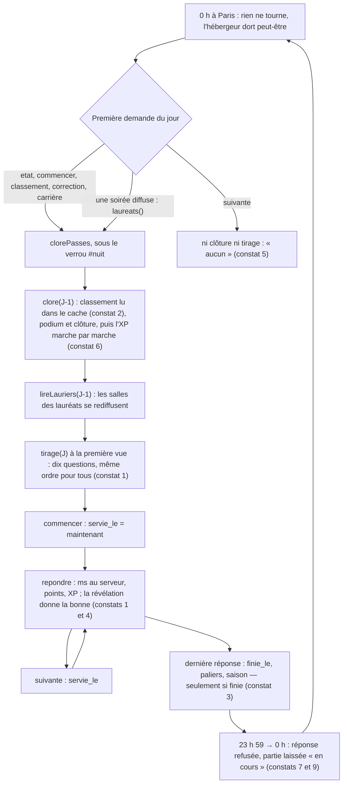

# Le jeu solo, côté serveur (`jour-regles`) — rapport de l'expert jeux compétitifs, triche et horloges

## En bref

Le quiz du jour tient ses promesses de base. Le chrono est celui du serveur,
aucune question ne se lit sans lancer son chrono, et une réponse n'est payée
qu'une fois, même envoyée dix fois en même temps. Minuit et les deux
changements d'heure tombent juste : le 25 octobre dure bien 25 h et le
28 mars 23 h. Trois nuits en retard se rattrapent d'un coup.

En revanche, le jeu n'est pas **juste**. Un second profil, qui se crée en dix
secondes, lit les bonnes réponses dans ses révélations. Les questions et les
réponses sont dans le même ordre pour tout le monde : il suffit de recopier
les index sur le vrai profil pour faire 10 sur 10 et prendre la première
marche, le Champion du jour, le Sans-Faute et le laurier. Sur un petit
serveur, c'est encore plus simple : ce second profil n'a qu'à ouvrir sa
partie pour faire « une salle », et un joueur seul se paie le podium.

Il n'est pas toujours **exact** non plus :
- le classement gardé en mémoire peut être rangé périmé, et la nuit paie
  alors le podium et le laurier à la mauvaise personne ;
- la saison et L'Assidu ne tombent qu'à la fin d'une partie, alors que la
  jauge compte les parties commencées : une Citrouille « 3 sur 3 » peut ne
  jamais tomber.

Minuit laisse aussi deux accrocs : « Question suivante » touché après minuit
affiche « la réserve est vide », et la partie d'hier reste « en cours » dans
un classement pourtant figé.

Les trois améliorations les plus rentables :
1. Ranger la lecture du classement sous la révision d'avant la lecture, et
   faire lire la nuit dans la base plutôt que dans le cache (S).
2. Décerner la saison et les paliers dès `commencer`, et faire passer
   `suivante` par la clôture et le tirage, comme `etat` (S).
3. Mélanger les réponses par profil, et reconnaître l'appareil qui joue deux
   profils le même jour (M). Le reste — deux appareils, des amis qui se
   parlent — ne se ferme pas : c'est une limite à assumer.

## Méthode

J'ai lu le code en entier, suivi chaque soupçon jusqu'à une reproduction
`node:test` sur le banc (`server/test/banc.ts`, horloge du jour réglée), et
lancé un seul fichier à la fois, en `nice -n 10`. Environ une heure et demie.
Aucun navigateur : l'écran du téléphone revient à `jour-ecran`. Aucun fichier
suivi par git n'a été modifié.

**Fichiers lus** :
- La doc et les consignes : `CLAUDE.md`, `consignes-audit.md`,
  `experts/jour-regles.md`, `modele-rapport.md`, `RECOMPENSES.md` (§ 5.13, le
  Sphinx, les saisons), `README.md` (le quiz du jour).
- Le cœur du quiz du jour : `shared/jour.ts`, `server/src/core/jour.ts` (en
  entier), `server/src/quizDuJour.ts`, `server/src/core/consigne.ts`,
  `server/src/core/saisons.ts`, `shared/saisons.ts`.
- Dans `server/src/auth/profiles.ts`, ce qui touche le jour : `byId`,
  `remember`, `recompterRecompenses`, `accorderPaliers*`, `accorderSaison`,
  `retirerSoiree*`, `ecrireXpDuJour`, `remettreAuBareme`, `recalculerTotal`,
  `apparenceDe`.
- Ce qui l'entoure : `shared/hautsfaits.ts`, `shared/legendaires.ts`,
  `shared/fonds.ts`, `shared/classement.ts`, `shared/profil.ts` (XP),
  `server/src/games/quiz.ts` (barème, `GRACE_MS`), `shared/library.ts`
  (`toPlayable`, durées), `server/src/api.ts`, `server/src/server.ts`
  (branchements), `server/src/auth/profileRoutes.ts` et `core/budget.ts`
  (inscriptions), `core/distante.ts`, `core/space.ts` (crédits).
- Le client, pour savoir quels appels il fait : `client/src/views/JourApp.tsx`
  et `client/src/components/AdminDuJour.tsx`.
- Les tests : `jour.test.ts`, `jour-partie.test.ts`, `jour-paliers.test.ts`,
  `jour-reserve.test.ts`, `sphinx.test.ts`, `laurier.test.ts`,
  `saisons.test.ts`.
- Les rapports d'avant (`retours/2026-09-2*`) ne parlent pas du quiz du jour,
  arrivé après eux : tout ce qui suit est neuf.

**Scripts écrits**, tous dans `export/evaluations/jour-regles/` :

| Fichier | Ce qu'il montre | Aujourd'hui |
|---|---|---|
| `outils.ts` | banc à horloge, `jouer`, lecture du tirage en base | — |
| `second-profil.test.ts` | constats 1 et 4 | 2 échecs |
| `cache-perime.test.ts` | constat 2, et la piste jouée par-dessus | 1 échec, 1 réussite (la piste) |
| `saison-inachevee.test.ts` | constat 3 | 2 échecs |
| `minuit.test.ts` | constats 5 et 9 | 2 échecs |
| `nuit-interrompue.test.ts` | constat 6 | 1 échec |
| `cloture-croisee.test.ts` | constat 7 | 1 échec |
| `saison-soiree-retiree.test.ts` | constat 8 | 1 échec |
| `ce-qui-tient.test.ts` | ce qui marche (6 épreuves) | 6 réussites |
| `heures.ts` | minuit, changements d'heure, saisons aux bornes | — |
| `allers-retours.ts` | appels à la base par geste | — |
| `cout-laureats.ts` | coût de `laureats()` | — |
| `empreintes.ts` | collisions d'empreinte | — |
| `compte-amorce.ts` | ce que la réserve prend des modèles | — |

Chaque fichier de test se lance ainsi :
```bash
cd server && nice -n 10 node --import tsx --test --test-timeout=120000 ../export/evaluations/jour-regles/<fichier>.test.ts
```

**Ce que je n'ai pas couvert** : un vrai Turso (les courses sont jouées en
retenant une écriture ou un `byId`, comme le fait déjà
`jour-partie.test.ts`), deux instances réelles sur la même base, et le
rendu sur téléphone.

## Constats

### 1. Un second profil souffle les réponses au premier : 10 sur 10, première marche, Sans-Faute, Champion du jour, laurier

- **Où** :
  - `server/src/core/jour.ts:544` : une seule copie jouée pour tous, graine
    tirée du jour (`suiteFixe(graineDe(jour))`), donc mêmes questions, mêmes
    réponses, même ordre.
  - `:746` : chaque révélation porte `bonne`, en index.
  - `:1289` : la correction entière s'ouvre dès qu'on a fini.
  - `server/src/auth/profileRoutes.ts:60` : un profil se crée sans rien
    prouver, dix d'un coup puis cinq par minute et par adresse.
- **Constat** : Mallory crée un second profil et le fait jouer d'abord, au
  hasard. En dix gestes (87 ms en test), elle lit l'index de chaque bonne
  réponse. Elle joue ensuite son vrai profil en recopiant ces index, sans
  lire : 2 000 points et 10 sur 10. Alice, qui a joué honnêtement et très
  bien (1 800 points), est reléguée à la deuxième marche. Et puisque l'ordre
  est le même pour tous, un groupe d'amis peut se passer « B, D, A, C… » sans
  rien créer du tout.
- **Preuve** : `second-profil.test.ts`, épreuve 1, qui échoue.
  ```
  Mallory : 2000 pts, 10/10, médaille or ; Alice : 1800 pts
  podium : [["Mallory",1,25],["Alice",2,15]] ; vainqueurs d'hier vus par Alice : Mallory
  paliers de Mallory : hf:champion-du-jour:1, hf:sans-faute:1 ; laurier : true
  ```
- **Qui ça touche, ce que ça coûte** : tous les honnêtes du haut du
  classement. Le tricheur prend chaque jour la première marche (25 XP) et le
  Champion du jour, qui monte vers l'Argent à 5 victoires et l'Or à 20. Il
  décroche le Kintsugi à 10 victoires, le Sans-Faute, et **le Sphinx en dix
  jours** par la voie des dix sans-faute. Son laurier suit son prénom
  jusque dans les soirées, sur l'écran commun. Aucune compétence n'est
  requise : deux navigateurs suffisent.
- **Statut** : faille confirmée (rejouée). C'est une **tension** avec deux
  partis pris : la révélation après chaque réponse (« c'est là qu'on
  apprend ») et un profil sans friction (ce qui sert aussi « jouer sans
  compte »). Comme pour tout quiz quotidien identique pour tous, on ne peut
  pas fermer entièrement la porte à deux appareils ou à des amis qui se
  parlent.
- **Piste** : fermer le gros de la porte pour pas cher.
  1. **Réponses mélangées par profil** : une permutation tirée de
     `(jour, profileId)`, appliquée par `questionVue`, `revelationDe`,
     `correction` et `vueDe`, et inversée par `repondre` avant `enregistrer`.
     `jour_reponses` garde l'index du tirage, si bien que `trouveePar`,
     `categoriesDe` et le recompte n'y voient rien. Cela tue « B, D, A, C » et
     la recopie d'index ; un tricheur doit alors relire les textes, question
     par question. Mélanger aussi l'ordre des questions par profil double
     l'effort.
  2. **Un appareil, une partie par jour qui compte** (voir le constat 4).
  3. **Pour l'administrateur** : dans `/admin`, la liste des parties du jour
     jouées depuis le même appareil, pour s'en servir avec « masquer ».

  Le test passera le jour où les index soufflés ne font plus 10 sur 10, ou
  le jour où cette partie ne monte plus sur le podium.
- **Priorité · effort** : P1 · M.

### 2. Le classement gardé en mémoire se range périmé — et la nuit paie le podium sur ces points-là

- **Où** : `server/src/core/jour.ts:874-886`
  (`joueursDu`) : la lecture se range sous `this.revision` **lue à la fin**,
  après deux `await` (la requête SQL, puis les `byId` huit par huit). La
  clôture (`clore`, `:1212`) lit ce même cache.
- **Constat** : une réponse écrite pendant qu'une autre requête lit le
  classement fait monter la révision **avant** que cette lecture périmée soit
  rangée. La lecture d'avant passe alors pour fraîche, et elle écrase même la
  lecture fraîche que le joueur venait de faire pour sa propre vue. Tout le
  serveur voit le classement d'avant jusqu'à l'écriture suivante. Si cette
  réponse était la dernière de la journée, la nuit relit le cache et paie le
  podium sur ces points périmés, pour de bon.
- **Preuve** : `cache-perime.test.ts`, épreuve 1. Un `byId` est retenu le
  temps d'un aller-retour Turso, comme le fait déjà `jour-partie.test.ts`
  (« une annulation qui croise une réponse en route »).
  ```
  classement lu après la réponse d'Alice : Bob 1500 1er, Alice 1400 2e
  podium payé : Bob rang 1 (1500, 25 XP), Alice rang 2 (1400, 15 XP)
  points en base : Bob 1500, Alice 1600
  vainqueurs d'hier : Bob — classement figé d'hier : Alice 1600 1re, Bob 1500 2e
  ```
  L'épreuve 2 rejoue le même scénario avec la piste ci-dessous : elle passe
  (Alice 1re, 25 XP).
- **Qui ça touche, ce que ça coûte** : de façon passagère, tout le serveur
  (un rang faux, un « à 100 pts de Bob » faux, pendant quelques secondes). De
  façon définitive, le vainqueur du jour quand la course touche la dernière
  écriture avant minuit : sa première marche, son Champion du jour et son
  laurier partent à un autre, sans retour possible. La fenêtre est large
  juste après un réveil ou un déploiement, quand aucun profil n'est encore en
  mémoire : chaque `byId` coûte alors un aller-retour.
- **Statut** : bug confirmé (rejoué).
- **Piste** :
  ```ts
  if (!tous) {
    // La révision d'AVANT la lecture : une écriture qui passe pendant qu'on
    // lit rend aussitôt cette lecture périmée, et la suivante relit la base.
    const revision = this.revision
    const res = await this.client.execute(...)
    ...
    this.classementsGardes.set(jour, { revision, joueurs: tous })
  }
  ```
  En plus, `clore` lit la base directement : elle ne passe qu'une fois par
  jour.
- **Priorité · effort** : P2 · S.

### 3. « Une partie commencée compte » pour la jauge, pas pour la récompense : la Citrouille « 3 sur 3 » ne tombe jamais

- **Où** :
  - `server/src/core/jour.ts:1257-1264` (`joursDeSaison`) et `:996-1016`
    (`statsDuJour.joues`) comptent les parties **commencées**, comme le dit
    RECOMPENSES.md § 5.13.
  - Mais la saison et les paliers ne se décernent que dans `ecrireXp(…, paliers)`
    (`:1251-1254`). Ce `paliers` n'est vrai qu'à la **dernière** réponse
    (`:723`), ou pour un podium à la nuit.
  - `commencer` (`:600-618`) ne décerne rien.
- **Constat** : le troisième jour d'Halloween est commencé mais pas fini (le
  téléphone a sonné, ou minuit est passé : la réponse est alors refusée). La
  page affiche « Halloween : 3 jours sur 3 » toute la journée, mais la
  Citrouille ne tombe pas. Le lendemain, la période est finie :
  `accorderSaison` n'y trouve plus de saison, et la Citrouille ne tombera
  jamais. Même mécanique pour L'Assidu : la jauge affiche 7 sur 7 et le
  Bronze attend la prochaine partie finie, pour se ranger sous un autre jour.
  Au centième jour, le Sphinx arrive donc un jour en retard, ou jamais.
- **Preuve** : `saison-inachevee.test.ts`, deux échecs.
  ```
  le 1er novembre au soir : {"nom":"Halloween",…,"joues":3,"requis":3}
  le 2 novembre, partie finie : légendaires annoncés undefined ; les siens : []
  après avoir commencé le septième jour : {"valeur":7,"prochain":7,"fois":0}
  ```
- **Qui ça touche, ce que ça coûte** : un joueur dont le jour qui compte est
  le dernier de la période, ou qui joue sa dernière partie de la période
  autour de minuit. Le Nouvel An ne dure que quatre jours, et « minuit sonne »
  en est justement le thème. Le légendaire est perdu pour un an, et l'écran
  vient de lui dire qu'il l'avait mérité.
- **Statut** : bug confirmé (rejoué).
- **Piste** : dans `commencer`, sous le verrou, quand l'`INSERT` a pris,
  décerner tout de suite.
  ```ts
  if (res.rowsAffected > 0) {
    this.revision++
    // « Une partie commencée compte » : la saison et L'Assidu le disent dès maintenant.
    await this.deps.profiles.accorderPaliersDuJour(profil.id, jour, await this.statsDuJour(profil.id))
    await this.accorderSaison(profil.id, jour)
  }
  ```
  Rangés sous `#jour:<jour>`, ils seront toujours annoncés à la fin de la
  partie par `recompensesDuJour` : rien ne change pour l'écran.
- **Priorité · effort** : P2 · S.

### 4. Un joueur seul et son second profil font « une salle » : podium, Champion du jour et laurier sans adversaire

- **Où** : `server/src/core/jour.ts:1212-1217`. Les marches valent
  `xpDuPodium(rang, joueurs.length)` (`shared/jour.ts:54-57`), et
  `joueurs.length` compte toute partie ouverte, même à zéro point, même
  jamais jouée.
- **Constat** : sur un petit serveur, Zoé est seule à jouer. Seule, elle ne
  monte sur rien : c'est l'invariant 19, « rien seul ». Son second profil
  touche seulement « Jouer » et s'en va. Cela fait deux joueurs, donc une
  marche : Zoé, avec 3 sur 10, prend 25 XP, le Champion du jour · Bronze et
  le laurier.
- **Preuve** : `second-profil.test.ts`, épreuve 2.
  ```
  « Hier » de Zoé : {"rang":1,"joueurs":2,"points":600,"xpPodium":25,"paliers":[{"key":"hf:champion-du-jour:1",…}]} ; laurier : true
  ```
- **Qui ça touche, ce que ça coûte** : les petits serveurs auto-hébergés, où
  une famille ou une bande joue à deux ou trois. Chaque jour, cela fait
  25 XP de podium en plus, le Kintsugi en dix jours, l'Or du Champion en
  vingt, et un laurier qui s'affiche dans les soirées.
- **Statut** : faille confirmée (rejouée). C'est une **tension** : la même
  astuce marche en soirée avec un deuxième téléphone anonyme, mais là,
  l'animateur voit la salle.
- **Piste** :
  - Poser un cookie d'appareil (`qz_appareil`, tiré au premier `/api/jour`,
    un an) et le noter sur `jour_parties`. Quand deux profils jouent depuis le
    même appareil le même jour, seule la première partie compte dans la salle
    et peut monter sur le podium ; la seconde garde son expérience de partie.
  - Ou bien, au minimum, ne compter dans la salle que les parties qui ont
    répondu à au moins une question.

  Une fenêtre privée contourne le cookie, mais le geste naïf, lui, tombe.
- **Priorité · effort** : P2 · S à M.

### 5. « Question suivante » après minuit : le serveur répond qu'il n'y a pas de quiz aujourd'hui

- **Où** : `server/src/core/jour.ts:624-628`. `suivante` lit le tirage du
  jour **sans le tirer** (`this.tirage(jour)`) et ne passe pas par
  `clorePasses`. Faute de tirage, elle rend `vueDe(…, null, null)`, c'est-à-dire
  `etat: 'aucun'` (`:788-807`). Le téléphone l'écrit : « Pas de quiz
  aujourd'hui : la réserve de questions est vide. Il revient demain. »
  (`client/src/views/JourApp.tsx:291-292`), sans bouton pour jouer.
- **Constat** : Alice commence à 23 h 58, répond, et lit l'anecdote. À
  0 h 00 min 30, elle touche « Question suivante ». Personne n'a encore ouvert
  le quiz du jour : le serveur répond « aucun », alors qu'un `GET /api/jour`
  au même instant répond `a-jouer` avec 10 questions. Le « Hier » de cette
  réponse est en plus calculé avant la clôture : 0 XP de podium, pas de
  laurier.
- **Preuve** : `minuit.test.ts`, épreuve 1.
  ```
  suivante → jour 2026-09-27, état « aucun », 0 questions ; GET /api/jour juste après → état « a-jouer », 10 questions
  ```
- **Qui ça touche, ce que ça coûte** : ceux qui jouent autour de minuit sur un
  serveur calme. L'onglet reste sur « pas de quiz » tant qu'on ne recharge
  pas, et la page ne se recharge pas d'elle-même. Beaucoup croiront qu'il n'y
  a pas de quiz ce jour-là.
- **Statut** : bug confirmé (rejoué).
- **Piste** : faire comme `etat` et `commencer`.
  ```ts
  async suivante(profil) {
    const jour = jourDe(this.maintenant())
    await this.clorePasses(jour)
    return this.avecVerrou(profil.id, async () => {
      const tirage = await this.tirage(jour, true)
  ```
- **Priorité · effort** : P2 · S.

### 6. La nuit interrompue : le podium est écrit, jamais payé

- **Où** : `server/src/core/jour.ts:1219-1230`. `clore` écrit
  `jour_clotures` et `jour_podiums` dans un seul lot, **puis** l'expérience
  de chaque marche, une à une. Au passage suivant, `estClos` rend vrai et
  `clore` s'arrête (`:1211`).
- **Constat** : si Turso lâche au premier crédit, la première visite du matin
  échoue (500). La suivante trouve le jour « clos » et ne recrédite personne.
  « Hier » annonce +25 et +15 XP que le total n'a jamais reçus, et le
  Champion du jour n'est pas décerné. Tout attend la prochaine partie jouée
  de chacun, qui recalcule la ligne `#jour`, ou n'arrive jamais s'il ne
  rejoue pas. Même motif au dernier geste d'une partie : si
  `ecrireXp(…, derniere)` échoue après le lot, la réponse rejouée rend
  seulement la révélation (`:653`), et paliers et saison attendent (voir le
  constat 3).
- **Preuve** : `nuit-interrompue.test.ts`.
  ```
  Alice : « Hier » {"rang":1,…,"xpPodium":25} ; XP 85 → 85
  Bob : « Hier » {"rang":2,…,"xpPodium":15} ; XP 67 → 67
  ```
- **Qui ça touche, ce que ça coûte** : les deux ou trois du podium d'une nuit
  où Turso a hoqueté (le délai du client est de 10 s).
- **Statut** : bug confirmé (rejoué, panne simulée).
- **Piste** : n'écrire `jour_clotures` qu'**après** les crédits. Podium en
  `INSERT OR IGNORE` et `ecrireXp` sont idempotents : un second passage
  refait tout sans dommage. Si le constat 7 est corrigé en même temps, une
  colonne `paye_le` sépare « fermé aux écritures » de « payé ».
- **Priorité · effort** : P3 · S.

### 7. Une réponse de 23 h 59 écrite après la clôture : le jour figé contredit son podium

- **Où** : `server/src/core/jour.ts:655-663`. `repondre` vérifie l'heure,
  **puis** écrit. `clore` (`:1210-1228`) lit, puis écrit, et rien n'empêche
  une écriture déjà partie d'arriver entre les deux.
- **Constat** : la réponse juste d'Alice part à 23 h 59 min 59, et son
  écriture traîne le temps d'un aller-retour. Pendant ce temps, Bob ouvre le
  quiz du jour et la veille se clôt. L'écriture passe ensuite.
  - Le classement figé met Alice première avec 1 800.
  - Le podium a payé Bob, avec 1 700.
  - Le « Hier » d'Alice dit « rang 1, 0 XP ».
- **Preuve** : `cloture-croisee.test.ts`, où l'écriture est retenue comme dans
  `jour-partie.test.ts`.
  ```
  podium payé : [["Bob",1,1700]] ; classement figé : [["Alice",1800,1],["Bob",1700,2]] fige = true
  « Hier » d'Alice : {"rang":1,…,"points":1800,"xpPodium":0}
  ```
- **Qui ça touche, ce que ça coûte** : rarement quelqu'un. Il faut que
  l'écriture traîne plus longtemps que les deux ou trois allers-retours de la
  clôture. Le cache du constat 2 élargit cette fenêtre.
- **Statut** : bug confirmé (rejoué, lenteur simulée).
- **Piste** :
  - Conditionner l'écriture au jour non clos, par
    `AND NOT EXISTS (SELECT 1 FROM jour_clotures WHERE jour = ?)` sur
    l'`UPDATE jour_parties` et un `INSERT … SELECT … WHERE NOT EXISTS` pour la
    réponse. `rowsAffected === 0` rend alors « Minuit est passé ».
  - Et `clore` ferme d'abord, puis lit (voir la colonne `paye_le` du
    constat 6).
- **Priorité · effort** : P3 · M.

### 8. La Citrouille gagnée des deux façons se perd avec la soirée qu'on retire

- **Où** : `server/src/auth/profiles.ts:1503`. `accorderSaison` ne range
  rien si le profil a déjà `saison:halloween`, même quand il la tient d'une
  **soirée**. Or `retirerSoireeEntiere` (`:1284-1301`) efface les récompenses
  de cette soirée.
- **Constat** : Alice a gagné la Citrouille en soirée le 30 octobre. Elle
  joue ensuite trois jours au quiz du jour pendant Halloween, mais rien n'est
  rangé sous le jour, puisqu'elle l'avait déjà. Le 5 novembre, l'animatrice
  retire la soirée de l'historique : la Citrouille part. Ses trois jours
  suffisaient pourtant (« l'une des deux suffit »), et la période est passée.
- **Preuve** : `saison-soiree-retiree.test.ts`.
  ```
  rangées sous : ["2026-09-27-…"] (la soirée seule)
  après le retrait : 3 jours de quiz du jour pendant Halloween ; légendaires : []
  ```
- **Qui ça touche, ce que ça coûte** : peu de monde. Il faut une soirée
  retirée **après** la troisième journée.
- **Statut** : bug confirmé (rejoué).
- **Piste** : ranger aussi la saison sous le jour quand aucune ligne
  `#jour:%` ne la porte encore. Pour ne pas la fêter deux fois, n'annoncer que
  ce qui manquait avant : `legendairesOuvertsPar` retire la clé entière de
  `avant`, quel que soit son compte.
- **Priorité · effort** : P3 · S.

### 9. La partie d'hier jamais finie reste « en cours » dans le classement figé

- **Où** : `server/src/core/jour.ts:882`. `enCours: r.finie_le == null` est
  vrai pour toujours pour une partie que minuit a coupée ; `lignes` le recopie
  (`:931`). Ce champ signifie « ses points peuvent encore monter »
  (`shared/jour.ts:249`).
- **Preuve** : `minuit.test.ts`, épreuve 2 : `{"fige":true,"lignes":[["Alice",200,true]]}`.
- **Qui ça touche, ce que ça coûte** : l'affichage du classement d'hier et du
  mois, pour tous. C'est de la confusion, pas une perte.
- **Statut** : bug confirmé (rejoué).
- **Piste** : ne pas marquer `enCours` quand le jour est clos (`fige`), ou
  poser `finie_le` sur les parties ouvertes au moment de la clôture.
- **Priorité · effort** : P3 · S.

### 10. Le lendemain se relit avec les règles d'aujourd'hui

- **Où** :
  - `server/src/core/jour.ts:971-973` : `sonJour` recalcule le rang d'hier
    avec les masques d'aujourd'hui, alors que `xpPodium` (`:969`) est celui
    de la nuit.
  - `:983` et `:1086` : la médaille d'hier et le compte des médailles de la
    carrière se donnent aussi aux parties **jamais finies**, alors que la vue
    du jour même la refuse (`:826`, « partie finie seulement »).
- **Constat** :
  - Si le premier d'hier est masqué après la nuit, le deuxième lit
    « 1er · +15 XP ».
  - Une partie abandonnée à six bonnes réponses compte un bronze à la page du
    profil.
- **Statut** : confirmé (lecture).
- **Piste** : lire le rang dans `jour_podiums` quand il y figure ; ne compter
  la médaille que des parties finies (`finie_le IS NOT NULL`).
- **Priorité · effort** : P3 · S.

### 11. L'annulation : un clic sans retour, et un cache qui ne se périme pas si elle tombe à mi-chemin

- **Où** :
  - `server/src/core/jour.ts:1407-1412` : `revision++` n'arrive qu'après
    **tous** les recomptes. Si l'un échoue (le cas de « une annulation tombée
    en panne à mi-chemin »), le classement gardé montre jusqu'à l'écriture
    suivante les points d'avant l'annulation de ceux qui ont déjà été
    recomptés.
  - Aucune route ne défait une annulation, et le bouton « Annuler ses points
    pour tous » part en un seul clic (`client/src/components/AdminDuJour.tsx:259-266`).
- **Constat** : une annulation par erreur est définitive. Elle retire les
  points de tous et peut avoir décerné des Sans-Faute (le recompte décerne,
  `:1442`) qu'on ne reprend pas.
- **Statut** : confirmé (lecture).
- **Piste** : `try { … } finally { this.revision++ }`. Côté écran, une
  confirmation (« 23 joueurs perdent leurs points de cette question »). Si
  l'on veut un retour arrière, il faut la route inverse, et accepter qu'un
  Sans-Faute déjà tombé reste.
- **Priorité · effort** : P3 · S.

### 12. La réserve accepte jusqu'à 120 secondes par question : de quoi chercher la réponse

- **Où** : `server/src/core/jour.ts:140-146` : `raisonDEcarter` ne regarde
  pas la durée. `:554` : `duree: p.duration`. « Coller une liste » lit
  « Temps : 120 s » (`shared/library.ts:1163`, bornes 5-120 s).
- **Constat** : une liste collée par l'administrateur avec « Temps : 60 s »
  donne au quiz du jour des questions d'une minute. C'est assez pour les
  chercher sur internet et garder 150 points et plus. La consigne de l'IA ne
  parle pas de durée, donc la routine écrit 20 s.
- **Statut** : confirmé (lecture).
- **Piste** : dans `tirer`, une durée fixe pour le quiz du jour
  (`DEFAULT_DURATION`), ou bornée à 30 s.
- **Priorité · effort** : P3 · S.

### 13. Les questions à venir se lisent ailleurs que dans la partie

- **Où** :
  - `server/src/core/jour.ts:447-476` : la consigne rappelle 300 intitulés, **les prêts d'abord**.
    Trois semaines d'avance, soit environ 210 questions, y sont en entier, et
    cette consigne sort derrière `RESERVE_TOKEN` (`quizDuJour.ts:146-152`)
    comme dans « Copier la consigne pour une IA ».
  - `:479-486` : « Voir les prochains jours » montre 70 questions **avec leurs
    réponses**.
  - `:334-346` et `:521-522` : les 38 questions amorcées sont tirées en
    premier et reviennent à sec après trente jours. Elles viennent des
    modèles livrés « Culture générale », « Vrai ou faux » et « 8-12 ans »,
    que tout animateur ouvre dans sa bibliothèque et que beaucoup d'invités
    ont joués en soirée (`compte-amorce.ts` : 38 questions, 3 jours).
- **Constat** :
  - L'administrateur, qui a sans doute un profil, voit les réponses des
    prochains jours.
  - Un jeton de réserve qui fuit donne les intitulés de trois semaines. Le
    CLAUDE.md dit pourtant que ce jeton « ne lit ni n'efface rien ».
  - Les trois premiers jours sont connus d'avance.
- **Statut** : tension (le rôle d'administrateur est de confiance, et la
  consigne a besoin de savoir ce qui existe déjà).
- **Piste** :
  - Dans la consigne, ne rappeler que les intitulés **posés** et les
    catégories. Les prêts se protègent déjà des copies exactes par
    l'empreinte.
  - Exclure du podium le profil rattaché au compte administrateur, ou le lui
    dire.
  - Amorcer la réserve derrière la première livraison de l'IA plutôt que
    devant (`ajoutee_le` ancien = tiré en premier).
- **Priorité · effort** : P3 · S.

### 14. `laureats()` recalcule le jour de Paris à chaque appel, pour chaque profil de chaque instantané

- **Où** : `server/src/core/jour.ts:1474-1476`, appelé par
  `profiles.laurierDe` (`server/src/server.ts:293`) dans `apparenceDe` et
  `toPublic` pour chaque joueur à profil.
- **Preuve** : `cout-laureats.ts` mesure 4,8 µs par appel (`Intl.formatToParts`
  plus `jourAvant`), soit **2,4 ms par instantané pour 500 profils**
  (charge 0,3, deux passes concordantes). Le commentaire promet une lecture
  « en mémoire, sans attendre ».
- **Statut** : confirmé (mesuré).
- **Piste** : garder `aujourdhui` jusqu'au prochain minuit de Paris, calculé
  une fois ; `laureats()` ne compare plus qu'un nombre.
- **Priorité · effort** : P3 · S.

### 15. L'empreinte d'un intitulé confond ce que `[a-z0-9]` ne voit pas

- **Où** : `server/src/core/jour.ts:128-132`.
- **Preuve** : `empreintes.ts`.
  - « Combien font 6 × 7 ? » = « Combien font 6 + 7 ? ».
  - « Que vaut π… » = « Que vaut φ… ».
  - Toute question en cyrillique ou en grec se réduit à « qui a ecrit ».
  - « C++ » = « C# » = « C ».

  La seconde est refusée comme « déjà dans la réserve ».
- **Statut** : confirmé (rejoué).
- **Piste** : `.replace(/[^\p{L}\p{N}+×÷=<>%]+/gu, ' ')`.
- **Priorité · effort** : P3 · S.

### 16. L'expérience du jour est gardée, pas dérivée : un barème qui change ne relit pas les jours passés

- **Où** :
  - `server/src/core/jour.ts:1241-1250` : `ecrireXp` additionne les `xp`
    **écrits** dans `jour_parties` et `jour_podiums`.
  - `server/src/auth/profiles.ts:1754-1760` : `remettreAuBareme` ne fait que
    changer la version de la ligne `#jour`.
  - Pourtant `XP_MAX_DU_JOUR` et `XP_PODIUM_DU_JOUR` se dérivent de `XP`
    (`shared/jour.ts:35-38`).
- **Constat** : si l'on change `XP.juste` et que l'on incrémente
  `VERSION_BAREME`, les soirées passées se relisent (invariant 20), mais pas
  les jours passés. Le commentaire « le quiz du jour ne dépend pas du barème
  des soirées » est faux pour le plafond.
- **Statut** : confirmé (lecture) ; dette face à l'invariant 20.
- **Piste** : au recalcul, refaire `jour_parties.xp = xpDuJour(points, possibles)`
  et `jour_podiums.xp = xpDuPodium(rang, joueurs)` (`jour_clotures.joueurs`
  les garde). Sinon, le dire dans le commentaire et dans RECOMPENSES.md.
- **Priorité · effort** : P3 · S.

### 17. Deux tirages concurrents marquent dix questions « posées » sans les tirer

- **Où** : `server/src/core/jour.ts:506-510` et `:561-573`. Le verrou
  `#tirage` ne vaut que dans un processus. Si l'`INSERT OR IGNORE` du tirage
  est ignoré, l'`UPDATE … posee_le` du même lot passe quand même.
- **Constat** : deux instances sur la même base, un matin de déploiement ou
  avec le PC de secours du CLAUDE.md. La seconde lit la réserve après le lot
  de la première : elle choisit dix **autres** questions et les marque posées
  aujourd'hui, sans les jouer. Elles ne reviennent qu'après trente jours, et
  seulement si la réserve est à sec.
- **Statut** : non confirmé (lecture seule ; une seule instance en test).
- **Piste** : lier l'`UPDATE` au tirage réellement écrit
  (`… AND ? = (SELECT questions FROM jour_tirages WHERE jour = ?)`).
- **Priorité · effort** : P3 · S.

## Mesures et cartes

### La chronologie d'une journée, du tirage à la nuit



| Étape | Ce qui se passe | Ce qui peut mal tourner |
|---|---|---|
| 0 h, Paris | Rien. `laureats()` se tait (la liste d'avant-hier) et lance la clôture en arrière-plan à la première diffusion d'une soirée | Un échec de lecture est rattrapé à la diffusion suivante, un essai à la fois (`lauriersEnRoute`) : ça tient |
| Première demande | `clorePasses` clôt chaque jour passé qui a des parties, dans l'ordre ; plusieurs nuits d'un coup après un long sommeil (`ce-qui-tient` 4) | `suivante` n'y passe pas (5). Le podium est lu dans un cache peut-être périmé (2). Une panne à mi-chemin laisse un podium écrit mais jamais payé (6). Un profil seul fait une salle avec son second profil (4) |
| Laurier | `lireLauriers(hier)`, masqués écartés, puis `laurierChange` rediffuse les salles | — |
| Tirage | À la première `etat`/`commencer` : deux par catégorie d'abord, puis le reste ; à sec, celles de plus de trente jours ; mélange à la graine du jour ; verrou `#tirage` (`ce-qui-tient` 6) | Même ordre pour tous (1). Durée jusqu'à 120 s (12). Deux instances marquent dix questions de trop (17). Les trois premiers jours sont connus (13) |
| Partie | `commencer` sert la première ; `repondre` compte au serveur (`GRACE_MS` 1,5 s, lecture offerte), paie une fois ; `suivante` sert la suivante, l'échéance est gardée au rechargement | La révélation et la correction donnent la bonne à un second profil (1). Rien n'est décerné tant que la partie n'est pas finie (3) |
| Journée | Classements du jour et du mois, signalements, annulation (aujourd'hui seulement, recompte sous chaque verrou), masquage | Un cache pas invalidé si l'annulation tombe à mi-chemin, et pas de retour arrière (11) |
| 23 h 59 → 0 h | La réponse d'hier est refusée ; la partie reste ouverte | La partie reste « en cours » dans un classement figé (9). La réponse qui traîne passe après la clôture (7). La saison est perdue si c'était le jour qui compte (3) |
| Le lendemain | « Hier », vainqueurs, correction ouverte à tous, laurier toute la journée, jusque dans les soirées | Le rang se relit avec les masques du jour, et la médaille va aux parties inachevées (10) |

### Le tableau des tricheries essayées

| Tricherie | Possible ? | Preuve |
|---|---|---|
| Lire la bonne réponse avant d'avoir répondu (`etat`, `commencer`, `suivante`) | Impossible | `questionVue` (`jour.ts:1564`) n'a ni `bonne` ni anecdote ; `jour-partie.test.ts` |
| Lire la question suivante sans lancer son chrono | Impossible | Une question ne se montre que si `servie_le` est écrit (`jour.ts:837`), et seules `commencer`/`suivante` l'écrivent |
| Répondre après l'échéance (plus 1,5 s) | Impossible : 0 point, `tropTard` | `jour.ts:661` ; `jour-partie.test.ts` |
| Répondre deux fois, ou dix à la fois | Impossible : payée une fois | Verrou par profil et `UPDATE … WHERE question = ?` ; `ce-qui-tient` 1 |
| Dix `commencer` ou dix `suivante` à la fois | Impossible : une partie, une échéance | `ce-qui-tient` 1 |
| Répondre à une question pas encore servie | Impossible (400) | `jour.ts:654` ; `ce-qui-tient` 2 |
| Index −1, `NaN`, 1,5, 10, 99, `'1e1'`, absent | Impossible (400) | `ce-qui-tient` 2. Seule bizarrerie : `index: null` vaut 0, la question à l'écran, sans gain |
| Choix hors bornes, `"1"`, −1 | Sans gain : compte « sans réponse », la question passe | `jour.ts:662` ; `ce-qui-tient` 2 |
| Rejouer une réponse avec un autre choix | Impossible : rend la révélation d'origine | `jour.ts:653` ; `ce-qui-tient` 2 |
| Recharger, deux onglets, deux appareils pour regagner du temps | Impossible : l'échéance est gardée | `jour.ts:632-635` ; `jour-partie.test.ts` |
| Répondre à la question d'hier après minuit | Impossible | `jour.ts:658` ; `jour-partie.test.ts` |
| Forger le bonus de vitesse | Impossible : mesuré au serveur, borné de 100 à 200 | `quiz.ts:187-191` |
| **Un second profil lit les bonnes réponses (révélations, correction) et les souffle** | **Possible** : 10 sur 10, 1re marche, Sans-Faute, Champion, laurier | `second-profil.test.ts` 1 |
| **Des amis se soufflent « B, D, A, C… »** | **Possible** : même ordre pour tous | `jour.ts:544` |
| **Un second profil qui ouvre seulement sa partie fait la salle d'un joueur seul** | **Possible** : 25 XP, Champion, laurier | `second-profil.test.ts` 2 |
| Chercher sur internet pendant les 20 s | Possible, et inhérent. Le bonus de vitesse le fait payer ; jusqu'à 120 s par liste collée | Constat 12 |
| Connaître d'avance les trois premiers jours (modèles livrés) | Possible | Constat 13 ; `compte-amorce.ts` |
| Administrateur : « Voir les prochains jours », la consigne | Possible (rôle de confiance) | Constat 13 |
| Jeton de réserve fuité : la consigne liste les intitulés prêts | Possible (textes, pas les réponses) | Constat 13 |

### Minuit et les changements d'heure (`heures.ts`)

| Instant (UTC) | Heure de Paris | `jourDe` |
|---|---|---|
| 2026-10-24 21:59:59.999 | 24 oct. 23:59:59 (été) | 2026-10-24 |
| 2026-10-24 22:00 | 25 oct. 0:00 | 2026-10-25 |
| 2026-10-25 01:00 | 25 oct. 2:00, la seconde fois | 2026-10-25 |
| 2026-10-25 22:59:59.999 | 25 oct. 23:59:59 (hiver) | 2026-10-25 |
| 2027-03-28 01:00 | 28 mars 3:00 (été) | 2027-03-28 |
| 2027-03-28 22:00 | 29 mars 0:00 | 2027-03-29 |
| 2026-12-31 23:00 | 1er janv. 0:00 | 2027-01-01 |

- Le 25 octobre 2026 dure **25 h**, le 28 mars 2027 **23 h** : le serveur ne
  suppose jamais un jour de 24 h (aucun `24 * 3600` dans le code du jour).
- Les séries du 24 au 26 octobre, du 27 au 29 mars, du 31 décembre au
  1er janvier et du 28 février au 1er mars 2028 (année bissextile) valent
  toutes 3 ou 2, comme attendu.
- `periodeDu` tient ses bornes : le 24 octobre est hors saison, le
  25 octobre et le 1er novembre sont Halloween, le 2 novembre ne l'est plus,
  et le Nouvel An va du 30 décembre au 2 janvier de l'année suivante.
- Le chrono compte en instants absolus : une question servie à 2 h 59 min 59
  (été) et répondue à 2 h 00 min 10 (hiver) a bien duré 11 s.

### Allers-retours vers la base par geste (`allers-retours.ts`, base `file:`)

| Geste | Allers-retours | Dont après l'écriture de `servie_le` |
|---|---|---|
| `etat` (nuit close) | 5 | — |
| `commencer` | 7 | 5 (3 niveaux en série) |
| `repondre` | 6 ; 7 pour la dernière (paliers, saison) | — |
| `suivante` | 8 | 5 (3 niveaux en série ; 4 à 5 avec une partie d'hier, +1 en saison) |
| classement du jour (cache chaud) | 1 | — |

Le chrono tourne donc pendant trois à cinq allers-retours avant que le
téléphone ne voie la question, soit 100 à 250 ms sur Turso. Le temps de
lecture offert (au moins 1 s + 55 ms par caractère) l'absorbe. Après un
réveil, en revanche, `joueursDu` va chercher chaque profil du jour huit par
huit : servir la question **après** avoir calculé la vue serait plus juste.
C'est une idée, pas un constat.

### La réserve amorcée (`compte-amorce.ts`)

38 questions : Culture générale 10/10, Vrai ou faux 15/15, 8-12 ans 13/14,
Noël en famille 0/10. Elles sont tirées en premier, soit **trois jours**, et
reviennent à sec après trente jours.

## Ce qui marche — à ne pas casser

- **Le chrono au serveur, l'échéance gardée.** `servie_le` est écrit avant
  que la question parte, la même échéance est rendue au rechargement, sur un
  autre téléphone ou après dix `suivante` d'un coup, et `expirer` paie zéro
  partout : partie, classement, médaille, Sans-Faute, expérience
  (`ce-qui-tient` 3).
- **L'idempotence à deux étages** : le verrou par profil, **plus** une base
  qui refuse d'avancer deux fois (`UPDATE … WHERE question = ?`,
  `INSERT OR IGNORE`). Même deux processus ne paieraient pas deux fois une
  réponse.
- **Invariant 1 tenu** : ni `bonne` ni anecdote avant la réponse, et la
  correction fermée tant qu'on n'a pas fini.
- **Invariant 15 tenu partout** : `classer`, `rangDansLesTries`, et les
  vainqueurs lus dans `rang = 1` ; tous les ex æquo gagnent.
- **L'annulation sous le verrou de chacun** (piège du CLAUDE.md) : la
  course réponse/annulation est gardée par un test, et l'annulation se refuse
  après minuit, par design.
- **La nuit sans tâche de fond**, rattrapée à la première demande. Trois
  nuits d'un coup se paient dans l'ordre, et le laurier va à la veille seule
  (`ce-qui-tient` 4). `closJusqua` évite de relire la base à chaque requête.
- **Le laurier lu en mémoire**, rediffusé quand il change de tête, retenté
  après un échec.
- **Les dates** : `Intl` pour le jour de Paris, calendrier pur pour la série
  et les saisons, instants absolus pour le chrono.
- **La porte de la réserve** : jeton comparé par empreinte en temps constant,
  **avant** de lire le corps ; 256 ko et 100 questions au plus.
- **Le classement** : 50 lignes, la sienne à part, un mois de 31 jours, un
  mois vide figé (`ce-qui-tient` 5) ; les masqués écartés partout sauf pour
  eux-mêmes.

## Recommandations, dans l'ordre

1. **Ranger la lecture du classement sous la révision d'avant la lecture**, et
   faire lire la nuit dans la base (constat 2). P2 · S. Le test est prêt, et
   la piste y est déjà jouée.
2. **Faire passer `suivante` par `clorePasses` et `tirage(jour, true)`**
   (constat 5). P2 · S.
3. **Décerner saison et paliers dès `commencer`** (constat 3). P2 · S.
4. **Réponses mélangées par profil** (constat 1). P1 · M. Cela casse « B, D,
   A, C » et la recopie d'index ; y ajouter l'ordre des questions par profil.
5. **Un appareil, une partie qui compte par jour**, pour la salle et le
   podium, avec la liste des paires suspectes à `/admin` (constats 1 et 4).
   P2 · S à M. Tension avec un profil sans friction, à arbitrer.
6. **Écrire la clôture après les crédits**, puis fermer le jour aux
   écritures avant de le lire (`paye_le`) (constats 6 et 7). P3 · M.
7. **Saison rangée aussi sous le jour** (constat 8), **`enCours` effacé du
   jour clos** (constat 9), **rang d'hier lu au podium** et **médaille aux
   parties finies** (constat 10). P3 · S chacun.
8. **Durée fixe au quiz du jour** (constat 12), **consigne sans les intitulés
   prêts** (constat 13), **empreinte en `\p{L}\p{N}`** (constat 15). P3 · S.
9. **`revision++` en `finally` dans `annuler`**, et une confirmation avant
   « Annuler ses points pour tous » (constat 11). P3 · S.
10. **`laureats()` sans `Intl` par appel** (constat 14) ; **l'XP du jour
    dérivée au recalcul** (constat 16) ; **l'`UPDATE posee_le` lié au tirage
    écrit** (constat 17). P3 · S.

## Limites

- Les courses (constats 2, 6 et 7) sont rejouées en retenant une écriture ou
  un `byId` dans le processus, comme les tests du dépôt le font. Leur
  fréquence réelle dépend des latences de Turso, que je n'ai pas mesurées ici.
  Mon estimation : rare, mais certaine sur un serveur fréquenté, et large
  juste après un réveil ou un déploiement.
- Je n'ai pas lancé deux instances sur la même base : le constat 17 reste
  une lecture.
- Je n'ai rien regardé sur un téléphone. L'effet de « aucun » à l'écran, la
  jauge « 3 sur 3 » et « 1er · +15 XP » restent à voir avec `jour-ecran`.
- Le coût réel de la triche au second profil dépend de la taille du serveur.
  Je ne sais pas combien de joueurs quotidiens aura un serveur typique.
- Le quiz du jour de ce rapport est celui de `main` (b57035c) : les
  estimations à tolérance, les variantes et les photos ne sont pas encore dans
  la réserve.

## Hors mission

- **`remember()` range le profil dans la mémoire avant ses récompenses**
  (`server/src/auth/profiles.ts:1864-1873`). Un `byId` concurrent au premier
  chargement voit `recompensesOf` vide : légendaire invisible un instant,
  paliers du jour qu'on pourrait redécerner sous un autre jour. Non confirmé.
  Pour `recompenses-comptes` et `concurrence`.
- **Aucune limite de débit sur `/api/jour/*`** : signalements, classement du
  mois recalculé à chaque appel, `?jour=` qui chasse le jour courant du cache
  à huit entrées. Pour `securite-portes` et `perf-serveur`.
- **Une annulation du jour fait baisser l'expérience totale, donc le niveau,
  en pleine soirée** (le recompte réécrit `profiles.xp`), ce qui heurte
  l'esprit de l'invariant 19. Non confirmé. Pour `invariants`.
- **L'en-tête de `shared/jour.ts:11-12` est périmé.** Il dit que les
  « paliers de carrière, légendaires » restent aux soirées, alors que le
  Sphinx, les saisons et trois paliers se gagnent au quiz du jour depuis la
  PR #59. Pour `mots`.
