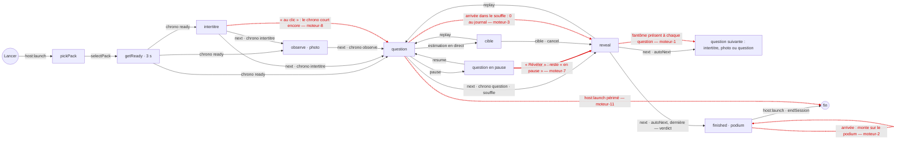

# Le moteur de soirée — rapport de l'expert moteur (phases, chronos, points)

## En bref

Le moteur tient. 162 000 gestes tirés au hasard ont été rejoués sur le vrai
`GameEngine` et le vrai module du quiz : réponses, commandes à jour ou
périmées, pauses, annulations, questions reposées, arrivées, exclusions,
coupures, temps qui file. Après chacun, la partie, le journal des gains et
celui des réponses donnaient le même total pour chaque invité. Aucun
chronomètre n'était hors de sa phase, aucune bonne réponse n'est partie avant
la révélation, et un redémarrage pris à 200 moments différents a reprise la
même partie à la même échéance. **Un défaut compte vraiment** (P2) : le
fantôme d'un téléphone mort reste présent à chaque question dans la moyenne de
son équipe, qu'on ne l'attende plus ou qu'il soit le second Rachid « laissé »
après la reprise de sa place. À jeu égal, son équipe perd un quart de sa
moyenne (600 contre 800), et l'animateur n'a plus aucun moyen de le corriger.
Le reste est une série de P3 aux bords des phases : l'arrivée au podium ou
dans le souffle, la liste de « Qui dans la salle ? », la pause, l'intertitre,
et deux gestes sans visée.

Les trois corrections qui rapporteraient le plus :
1. Ne plus écrire au journal la ligne vide d'un invité qu'on n'attend plus et
   qui est hors ligne (moteur-1). Deux lignes dans `logQuestion`.
2. Classer au quiz seulement ceux qui ont pu jouer une question (moteur-2). Le
   même filtre, dans `classement()`, règle aussi le podium des petites salles.
3. Arrivé pendant le souffle, commencer à la question suivante (moteur-3).
   Ajouter aussi l'instantané au geste de `player:reprendre` (moteur-6).

## Méthode

- **Lu en entier** : `server/src/core/engine.ts`, `server/src/games/quiz.ts`,
  `shared/games/quiz.ts`, `server/src/core/party.ts`, `core/teams.ts`,
  `shared/teams.ts`, `core/scores.ts`, `core/answers.ts`,
  `shared/classement.ts`, `shared/course.ts`, `shared/hasard.ts`,
  `shared/homonymes.ts`, `core/programmes.ts`, `shared/programme.ts`,
  `shared/fin.ts`, `server/src/sockets.ts`, `core/types.ts`.
- **Lu en partie** : `core/space.ts` (instantané, scène, exclusion, reprise,
  clôture, `apresQuiz`, `lancementDeQuiz`) ; `core/jour.ts` (laurier) ;
  `server.ts` (branchements, filet de cinq minutes) ; `index.ts` (filet
  global) ; `core/recap.ts` et `core/stats.ts` (usage du journal) ;
  `shared/library.ts` (copie jouable). Côté client :
  `client/src/games/quiz/HostView.tsx`, `PlayerView.tsx`, `Course.tsx`,
  `views/PlayerApp.tsx` et `views/HostApp.tsx` (lancement, `iAmIn`), et
  `socket.ts`.
- **Aussi lus** : les rapports du 24 septembre (`synthese.md`,
  `verification/salons-marc-lea.md`), la PR #49 (téléphone perdu), les tests
  existants du moteur (`protocole`, `classement-en-cours`, `salle-vide`,
  `telephone-perdu`, `equipes`, `au-geste`, `programme`, `temps-reel`).
- **Écrits** (`export/evaluations/moteur/`) :
  - `harnais.ts` : le vrai moteur, le vrai module et les vrais registres, sur
    une base en mémoire. L'horloge avance à la main (`mock.timers`) et une
    fausse diffusion retient chaque envoi, salon par salon. `redemarrer()`
    fait relire la base à un moteur neuf.
  - `fuzz.test.ts` : le fuzz. Un premier passage fait 150 graines de 600
    gestes sur un quiz de neuf questions de toutes les sortes. Un second fait
    9 sortes × 40 graines × 200 gestes sur des quiz d'une seule question.
  - `reprise.test.ts` : un redémarrage à 200 moments tirés au hasard.
  - `phases.test.ts` : sept reproductions sur le module (moteur-2 à 5, 7 à 9).
  - `fantome-equipe.test.ts`, `reprise-au-geste.test.ts`,
    `renommage-profil.test.ts`, `lancer-vise.test.ts` : des reproductions sur
    un vrai serveur (`server/test/banc.ts`), avec sockets.
  - `sonde.test.ts` : les sondes exploratoires, sans assertion.
- **Durée et charge** : environ une heure et demie, en deux séances coupées
  par la limite d'usage. Un seul fichier de test à la fois, `nice -n 10`, sur
  une machine à charge 0,2 à 0,9. Aucune mesure de temps n'est donnée :
  seulement des états, des lignes et des messages. Rien de ce que j'ai lancé
  ne tourne encore.
- **Pas couvert** : le miroir et Turso (mission `persistance`), les courses
  entre crédits asynchrones (`concurrence`), les messages forgés en général
  (`securite-temps-reel`), le rendu dans un navigateur.

## Constats

### 1. Le fantôme pèse sur la moyenne de son équipe, jusqu'à la fin du quiz
- **Où** : `server/src/games/quiz.ts:856-892` (`logQuestion`, filtre `:869`),
  `server/src/core/space.ts:987-997` (`laisserPlace` : le second Rachid reste
  participant, seulement dispensé), `shared/teams.ts:56-81` et `:105-109`
  (présents et moyenne au prorata).
- **Constat** : à chaque révélation, `logQuestion` écrit une ligne « présent,
  sans réponse, 0 point » pour tout participant qui pouvait jouer. Le filtre
  ne regarde que `playFrom` : il ne tient compte ni de `dispenses` ni du
  téléphone éteint. Deux fiches sont ainsi comptées présentes à chaque
  question, sous leur équipe (`teamId` figé à l'écriture) :
  1. la fiche du téléphone mort, que l'animateur a choisi de « ne plus
     attendre » ;
  2. après « Rendre sa place », le second Rachid « laissé ». C'est la même
     personne, qui joue désormais sous l'autre fiche : le serveur le sait
     (`laissees`, et la dispense posée par `laisserPlace`).

  Rachid compte donc deux fois dans les présents de son équipe, une fois avec
  ses points et une fois à zéro.
- **Preuve** : `export/evaluations/moteur/fantome-equipe.test.ts`, sur un
  vrai serveur. Les Rouges (Alice, Rachid) et les Bleus (Bruno, Chloé)
  répondent juste pendant le temps de lecture : 200 points par question pour
  chacun. Le téléphone de Rachid meurt à la Q2. Il revient sur un téléphone
  emprunté dans son équipe, et l'animateur n'attend plus la fiche d'origine.
  Rachid reprend sa place avec le code après la Q2. À la fin, la salle lit
  **Rouges 600 · Bleus 800**, pour deux équipes qui ont joué exactement
  pareil : à la Q2, (200 + 0 + 200) / 3 ; aux Q3 et Q4, (200 + 200 + 0) / 3.
  L'épreuve échoue aujourd'hui : `600 !== 800`.
- **Qui ça touche, ce que ça coûte** : toute équipe dont un téléphone meurt.
  Le 24 septembre, cela s'est produit dans un salon sur trois. Le verdict des
  équipes conclut la soirée, et un quart de moyenne en moins le retourne sans
  peine. Le fantôme rafle aussi L'Abstentionniste et Le Somnambule, et reste
  dans « 3 / 5 ont répondu ». La limite : un téléphone mort n'est pas
  participant au quiz suivant (seuls les connectés le sont au lancement), donc
  le dégât s'arrête avec le quiz où il est mort.
- **Statut** : **bug confirmé (rejoué). Déjà vu le 24 septembre**, et la
  correction ne tient pas. La vérification avait écrit « il dilue l'équipe
  Commercial, dont la moyenne tombe de 743 à 557 » et « il rafle
  L'Abstentionniste ». La PR #49 a réglé l'attente et la reprise, pas la
  moyenne. Elle ajoute même un second cas : le Rachid « laissé ».

  La parade de Marc ne marche plus : il avait sorti le fantôme de son équipe
  après le quiz. Les lignes figent maintenant leur équipe, et pendant un quiz
  la console n'offre que « Ne plus l'attendre » et « Rendre sa place »
  (`Absents.tsx`). L'exclure après coup retourne le verdict annoncé dans
  l'autre sens, et retire à Rachid les points qu'il a marqués sous cette fiche.
- **Piste** : ne pas écrire de ligne pour un participant qu'on n'attend plus,
  qui est hors ligne et n'a pas répondu. `logQuestion` a `ctx.connected` :
  ```ts
  sess.participantIds
    .filter(id => (st.playFrom[id] ?? 0) <= st.qIndex)
    // Ni attendu ni là : absent de la question — pas « présent, sans réponse ».
    .filter(id => id in st.responses || !st.dispenses?.includes(id) || ctx.connected(id))
  ```
  La fiche laissée est dispensée pour le reste du quiz et le fantôme l'est dès
  que l'animateur le décide. Tous deux sortent donc des présents et du compte
  de L'Abstentionniste, sans toucher au podium du quiz (`st.totals`). Pour les
  deux cas, l'épreuve passerait à 800 / 800 (calculé, non rejoué : je n'ai
  pas le droit de modifier le code).

  C'est une règle de produit à écrire dans `regleDesEquipes` : un joueur
  présent qui ne répond pas continue de compter zéro, sinon une équipe aurait
  intérêt à faire taire ses faibles. Seule l'absence constatée par
  l'animateur sort de la moyenne.
- **Priorité · effort** : P2 · S.

### 2. Arrivé au podium, il monte sur le podium
- **Où** : `server/src/games/quiz.ts:633-642` (`classement()` prend tous les
  participants), `:747-771` (`standings`, `podiumDe`), `:1295-1296` et
  `:1416` (podium des téléphones, classement de l'écran). L'intention écrite
  est à `:1165-1174`.
- **Constat** : un invité qui arrive après la dernière question reçoit
  `playFrom = qIndex + 1`. Le commentaire de `onPlayerJoin` le dit : « arrivé
  au podium, il y tenait une place de dernier ». Le correctif a retiré sa
  `place`, mais pas sa ligne du classement : `classement()` range tous les
  `participantIds`. À zéro, il se range parmi les ex æquo par ordre
  alphabétique. Dans une petite salle, il monte ainsi sur le podium, en
  chasse un joueur qui a joué les questions, et son téléphone se voit
  surligné sur la marche.
- **Preuve** : `phases.test.ts`, épreuve moteur-2. Zoé 400, Xavier 0 et
  Yves 0 ont joué ; Aaron arrive au podium. L'écran montre
  `Zoé, Aaron, Xavier, Yves` et le podium des téléphones
  `Zoé, Aaron, Xavier` : Yves en sort. Aaron reçoit `yourPodiumIndex: 1` et
  `yourQuizRank: 2`. `classement-en-cours.test.ts` ne vérifie que `place`.
- **Qui ça touche, ce que ça coûte** : les petites salles, où moins de trois
  joueurs ont des points. Cela se voit sur la télé au moment du podium. Aucune
  expérience n'est en jeu : elle se lit au journal, où Aaron n'est pas.
- **Statut** : bug confirmé (rejoué). Le code ne fait pas ce que son
  commentaire annonce.
- **Piste** : ne ranger dans `classement()` que ceux qui ont pu jouer une
  question, `(st.playFrom[id] ?? 0) <= st.qIndex`. Le même filtre dans
  `indexDesPlaces` devient alors redondant. `rangDe` sait déjà classer celui
  qui n'est pas dans la liste.
- **Priorité · effort** : P3 · S.

### 3. Arrivé pendant le souffle : 600 ms pour lire, puis « Pas de réponse », et un zéro au journal
- **Où** : `server/src/games/quiz.ts:1165-1173` (`onPlayerJoin` en phase
  `question`) et `:1024`, `:1202` (le souffle, armé quand plus personne n'est
  attendu, révèle sans revérifier).
- **Constat** : toute la salle a répondu et le souffle de 700 ms court.
  L'invité qui entre à ce moment reçoit `playFrom = qIndex` : la question est
  la sienne. Mais le souffle n'est pas remis en cause, et la question se
  révèle dans les 600 ms suivantes. Il lit « Pas de réponse » au lieu de
  « Bienvenue ». Une ligne à 0 part au journal, donc dans la moyenne de son
  équipe et dans ses statistiques. C'est le symptôme que le correctif de la
  phase `cible` avait réglé.
- **Preuve** : `phases.test.ts`, épreuve moteur-3 :
  `phase reveal, justArrived false, au journal : {"answered":false,"points":0}`.
- **Qui ça touche** : le retardataire qui scanne au mauvais moment, et son
  équipe. C'est rare : la fenêtre ne dure que 700 ms.
- **Statut** : bug confirmé (rejoué).
- **Piste** : dans `onPlayerJoin`, si tous les autres participants de la
  question ont répondu (la salle a fini), faire commencer le nouvel arrivé à
  la question suivante :
  `playFrom = awaited(sess).every(id => id === playerId) ? st.qIndex + 1 : st.qIndex`.
- **Priorité · effort** : P3 · S.

### 4. « Qui dans la salle ? » : un candidat exclu devient « ??? » sur tous les téléphones
- **Où** : `server/src/games/quiz.ts:778-782` (`reponsesMontrees` lit
  `vctx.playerName`), `server/src/core/engine.ts:142` (`?? '???'`) et
  `quiz.ts:1176-1195` (`onPlayerLeave` ne touche pas à `candidats`).
- **Constat** : les candidats sont figés quand la question est posée, et
  l'exclusion renvoie leur vue à toute la salle. Le nom de l'exclu, qui n'est
  plus inscrit, vaut `'???'`. Chaque téléphone affiche alors un bouton
  « ??? », qu'on peut toucher pour voter. Le fantôme qu'on exclut en pleine
  question est justement un candidat : les candidats sont tous les
  participants, téléphones morts compris.
- **Preuve** : `phases.test.ts`, épreuve moteur-4 : la liste devient
  `["Alice","Bruno","???"]`.
- **Statut** : bug confirmé (rejoué).
- **Piste** : rendre `null` pour un candidat parti ; le téléphone grise ce
  bouton et `onPlayerAction` refuse ce vote (`invalid`). Les index des votes
  restent ceux de la liste figée.
- **Priorité · effort** : P3 · S.

### 5. « Qui dans la salle ? » : deux Camille aux avatars différents sont deux boutons identiques
- **Où** : `server/src/games/quiz.ts:778-782` (des prénoms seulement),
  `shared/homonymes.ts:36-52` (la marque suppose le même prénom **et** le
  même avatar), `client/src/games/quiz/PlayerView.tsx:255-274` (le bouton
  n'affiche que `{nom}`).
- **Constat** : l'invariant 17 ne marque pas deux Camille sur deux animaux
  différents, parce que « une ligne, c'est un avatar autant qu'un prénom ».
  La liste de vote n'a pas d'avatar : le votant a deux « Camille » sous le
  doigt et ne sait pas laquelle il désigne.
- **Preuve** : `phases.test.ts`, épreuve moteur-5 :
  `["Camille","Camille","Hugo"]`.
- **Statut** : bug confirmé (rejoué). La prémisse de l'invariant 17 manque à
  cet endroit. `recompenses-vitrine` (constat 6) traite de l'avatar du
  résultat du sondage à la télé, pas de cette liste de vote.
- **Piste** : envoyer les avatars avec les candidats (`avatars: string[]` dans
  la vue, décorés comme ailleurs) et les afficher sur le bouton.
- **Priorité · effort** : P3 · S.

### 6. « Rendre sa place » : la vue arrive avant l'instantané qui compte la fiche (invariant 4)
- **Où** : `server/src/sockets.ts:578-579`, à comparer avec `:445`
  (`player:join`).
- **Constat** : `player:join` envoie à son auteur l'instantané qui le compte
  parmi les participants avant sa première vue (`joinLate(id, avantLesVues)`).
  `player:reprendre` ne le fait pas : il appelle `broadcastSnapshot()`, qui
  est regroupé, puis `joinLate(res.id)`, qui envoie la vue tout de suite.
  Supposons que la fiche reprise ne soit pas participante (le téléphone est
  mort avant le lancement). La page lit alors `iAmIn` à faux
  (`PlayerApp.tsx:305`) et affiche « tu entres à la prochaine question » par
  dessus la question, pendant 120 ms plus 2 ms par invité.
- **Preuve** : `reprise-au-geste.test.ts`, sur un vrai serveur. À sa première
  vue après l'accusé, le dernier instantané du téléphone ne compte pas la
  fiche.
- **Statut** : bug confirmé (rejoué).
- **Piste** : dans `sockets.ts`,
  `rt.engine.joinLate(res.id, () => socket.emit('party:snapshot', rt.buildSnapshot(false)))`,
  comme dans `player:join`.
- **Priorité · effort** : P3 · S.

### 7. « Révéler » pendant une pause : la révélation reste « en pause »
- **Où** : `server/src/games/quiz.ts:431-443` (`reveal()` ne remet pas
  `pausedMs` à zéro), `:1264` et `:1376` (les deux vues). Côté client :
  `HostView.tsx:628` (pastille de la télécommande) et `:509` (bouton de la
  console).
- **Constat** : l'animateur met la question en pause, puis clique
  « Révéler », qui reste actif. Toute la révélation porte alors
  `paused: true, remainingMs: 20000`. La télécommande affiche « En pause » à
  côté de la bonne réponse, et le bouton grisé de la console reste
  « Reprendre ». La question suivante efface l'état.
- **Preuve** : `phases.test.ts`, épreuve moteur-7. Le fuzz ne trouve que
  cette violation-là : « pause hors question », `reveal pausedMs=20000`.
- **Statut** : bug confirmé (rejoué). Il est seulement visuel.
- **Piste** : `st.pausedMs = null` dans `reveal()`, avant le détour par
  `cible`.
- **Priorité · effort** : P3 · S.

### 8. « au clic » pendant un intertitre : il part quand même tout seul
- **Où** : `server/src/games/quiz.ts:1120-1135` (la commande `autoNext`
  n'éteint que le chrono `autoNext`), `:385-388` (l'intertitre arme le sien
  d'après l'enchaînement), `:1337` et `HostView.tsx:690` (la pastille de
  compte à rebours).
- **Constat** : l'enchaînement pose un intertitre avec son compte à rebours.
  L'animateur choisit « au clic » pour prendre la parole. La console affiche
  bien « au clic », mais la pastille continue de décompter et, dix secondes
  plus tard, la question part d'elle-même.
- **Preuve** : `phases.test.ts`, épreuve moteur-8. La vue garde
  `deadline: 1023700` et la phase passe à `question` sans clic.
- **Statut** : bug confirmé (rejoué).
- **Piste** : dans `case 'autoNext'`, quand `seconds === null` et que la phase
  est `intertitre`, appeler `ctx.clearTimer('intertitre')` et poser
  `st.deadline = 0`.
- **Priorité · effort** : P3 · S.

### 9. Un palier d'enchaînement illisible fait sauter toutes les révélations
- **Où** : `server/src/games/quiz.ts:1121-1122`.
- **Constat** : `{ type: 'autoNext' }` sans `seconds`, ou avec une chaîne
  illisible, donne `Math.round(undefined)`, c'est-à-dire `NaN`. `NaN !== null`
  arme l'enchaînement, et `setTimeout(NaN)` part à 1 ms : chaque révélation
  enchaîne aussitôt sur la question suivante, jusqu'au prochain réglage.
  `createInitialState` lit pourtant ce même réglage avec `Number.isFinite`.
- **Preuve** : `phases.test.ts`, épreuve moteur-9 : `réglage lu : NaN`. La
  sonde montre la question 2 posée dans le même tour que la révélation de la
  question 1.
- **Statut** : bug confirmé (rejoué). Il faut une console authentifiée : la
  page d'aujourd'hui n'envoie qu'un nombre ou `null`. `securite-temps-reel`
  ne l'a pas relevé.
- **Piste** : `typeof seconds === 'number' && Number.isFinite(seconds) ? borné : null`,
  comme au lancement.
- **Priorité · effort** : P3 · S.

### 10. Le renommage de l'animateur tombe quand un profil arrive sur un second appareil
- **Où** : `server/src/sockets.ts:402-409`.
- **Constat** : `declare = !known || !token`. Un profil qui ouvre la soirée
  sur un autre appareil n'a pas de jeton : c'est donc une déclaration, et le
  prénom du profil écrase celui que l'animateur avait mis (« GrosBill »
  renommé « Bill » redevient « GrosBill »). Le réveil du téléphone, lui, est
  bien couvert par `temps-reel.test.ts`.
- **Preuve** : `renommage-profil.test.ts` : `vu : GrosBill`.
- **Statut** : **tension** entre l'invariant 8 (le profil ne rechoisit
  jamais son prénom) et le geste de modération que protège l'invariant 9.
  C'est écrit tel quel au commentaire de `sockets.ts:387-399`.
- **Piste** : à arbitrer. Soit un profil déjà dans la soirée ne redéclare
  rien (`declare = !known`), soit on garde un « renommé par l'animateur » sur
  la fiche.
- **Priorité · effort** : P3 · S.

### 11. `host:launch` ne dit pas ce qu'il remplace (invariant 12)
- **Où** : `server/src/sockets.ts:702-713` et
  `server/src/core/engine.ts:214-215`.
- **Constat** : `next`, `cancel`, `replay` et `cible` portent leur visée,
  `endSession` porte sa partie et la scène porte `depuis`. « Lancer un quiz »
  et « Quiz suivant » ne portent rien, et `launch()` termine la partie en
  cours, quelle qu'elle soit. Prenons deux écrans d'animateur, la console et
  la télécommande. L'un lance et choisit le quiz ; le clic parti de l'autre
  avant qu'il ait vu la partie (ou retardé sur une liaison qui hoquette)
  arrête net la question en cours pour toute la salle.
- **Preuve** : `lancer-vise.test.ts`, sur un vrai serveur, avec deux écrans :
  `session:ended` part en pleine question. L'expert `client` l'a cité en
  « Hors mission » sans le rejouer.
- **Statut** : bug confirmé (rejoué). La fenêtre est courte : il faut deux
  écrans d'animateur.
- **Piste** : `host:launch` porte
  `{ depuis: <partie affichée> | null }`, et le serveur ignore le geste s'il
  ne désigne pas la partie en cours. Un champ absent garde l'ancien
  comportement, comme ailleurs.
- **Priorité · effort** : P3 · S.

### 12. Le laurier de minuit ne rejoint pas le podium affiché
- **Où** : `server/src/server.ts:379-381` (`laurierChange` appelle seulement
  `broadcastSnapshot`) et `server/src/games/quiz.ts:761` et `:842`
  (`distinctions` dans les lignes du podium et des estimations).
- **Constat** : le laurier du quiz du jour change de tête à minuit. Les
  instantanés suivent, mais pas les vues de partie : un podium resté à
  l'écran, le sort ordinaire du dernier quiz, garde les lauriers de la veille
  jusqu'à la prochaine diffusion de la partie. `apresQuiz` rafraîchit déjà
  les vues pour une montée de niveau (`rafraichirVues`), mais pas ce geste-ci.
- **Statut** : confirmé (lecture), non rejoué.
- **Piste** : `rt.engine.rafraichirVues()` à côté de `broadcastSnapshot()`
  dans `laurierChange`.
- **Priorité · effort** : P3 · S.

## Mesures et cartes

### Les phases d'une question et d'un quiz

Les transitions en rouge, et les pointillés, sont celles qui fautent.



### Les chronomètres, phase par phase (ce que le fuzz vérifie après chaque geste)

| Phase | Chronomètres armés | À l'échéance |
|---|---|---|
| getReady | `ready` (3 s) | question 1 (ou son intertitre ou sa photo) |
| intertitre | `intertitre`, si un enchaînement est réglé, **et même passé « au clic »** (moteur-8) | photo ou question |
| observe | `observe` (`observeSeconds`) | question |
| question | `question` (durée + 1,5 s) ; `settle` (0,7 s) quand plus personne n'est attendu | révélation, ou `cible` |
| question en pause | aucun | — |
| cible | aucun | attend la mesure |
| reveal | `autoNext`, si réglé et que quelqu'un a répondu | question suivante, ou podium et verdict |
| finished | aucun | — |

### Ce que disent le fuzz et le redémarrage

| Épreuve | Volume | Résultat |
|---|---|---|
| Fuzz, quiz de neuf questions de toutes les sortes (QCM, estimation, photo, sondage, plusieurs, ordre, en direct, intertitre) | 150 graines × 600 gestes = 90 000 | une seule sorte de violation : la pause gardée à la révélation (moteur-7) |
| Fuzz, quiz d'une seule question, chaque sorte | 9 × 40 × 200 = 72 000 | la même, et rien d'autre |
| Vérifié après chaque geste | — | partie = gains = journal pour chaque invité ; aucune ligne en double ; aucun exclu au journal ; aucun chrono hors de sa phase ; aucune question ouverte sans chrono ; aucune pause qui court ; aucun `correct`, `bonnes`, `ordre`, `anecdote`, `imageRevelation`, `target`, `votes` ni `place` dans une vue de téléphone pendant la question, la photo ou l'intertitre ; participants sans doublon et tous inscrits |
| Redémarrage à un moment tiré au hasard (base locale) | 200 moments | même état, mêmes échéances (au plus tôt, 50 ms), aucun chrono perdu ni en trop |
| Fantôme dans une équipe (`fantome-equipe.test.ts`) | 4 questions, 2 équipes de 2 | Rouges 600 · Bleus 800 à jeu égal : −25 % |

## Ce qui marche — à ne pas casser

- **La visée (invariant 12).** Dans le fuzz, une commande sur cinq était
  périmée : aucune n'a sauté une révélation ni annulé la question suivante.
  Un double clic, « Révéler » contre le souffle, une annulation confirmée
  trop tard : chacun est ignoré sans un mot. Les réponses d'un autre tour
  reçoivent `too-late`.
- **Les trois journaux se tiennent.** Annuler retire du journal et reverse
  les gains, reposer fait de même puis rouvre, et exclure efface partout, la
  partie en mémoire comprise. Sur 162 000 gestes, jamais un point n'a manqué
  ou compté double.
- **Les chronomètres.** Ils sont persistés avec leur échéance et réarmés à
  l'identique ; un chrono qui lève une exception s'arrête au journal ;
  `stop()` écrit ce qui attendait.
- **La promesse `vueDependDesAutres: false` tient.** Pendant la question, une
  vue de téléphone ne lit que sa propre réponse et des éléments communs figés
  (les candidats du sondage). Le rang et le podium ne se calculent qu'aux
  changements de phase.
- **L'instantané (invariant 4).** Aucun champ ne change à chaque tick. Les
  distinctions et le laurier de #59 ne bougent qu'à un crédit, à minuit ou
  quand l'administrateur masque un profil ; `laurierChange` ne rediffuse
  qu'une fois par salle grâce au regroupement ; `connected` ne part qu'aux
  écrans.
- **Le barème.** Le temps de lecture est offert, le bonus fond ensuite
  jusqu'à la moitié, une pause ne coûte rien, l'estimation se juge par la
  médiane avec `ecartEstimation`, et « plusieurs » et « ordre » sont en tout
  ou rien avec `reponseJuste`. « L'ordre à retrouver » n'apparaît jamais dans
  le bon ordre.
- **Les homonymes.** Les trois portes du prénom passent par `nomAffiche` dans
  le moteur, dans « Qui manque ? », dans les toasts de reprise et à la
  clôture. La liste du sondage est la seule exception (moteur-5).

## Recommandations, dans l'ordre

1. Sortir de la moyenne des équipes le fantôme qu'on n'attend plus
   (moteur-1), et écrire la règle dans `regleDesEquipes`. P2 · S.
2. Ne classer au quiz que ceux qui ont pu jouer (moteur-2). P3 · S.
3. Arrivé pendant le souffle, commencer à la question suivante (moteur-3).
   P3 · S.
4. Envoyer l'instantané au geste de `player:reprendre` (moteur-6). P3 · S.
5. « Qui dans la salle ? » : un candidat parti est grisé, et les avatars
   sont sur les boutons (moteur-4, moteur-5). P3 · S.
6. Fermer les bords des phases : la pause effacée à la révélation, « au
   clic » qui arrête l'intertitre, un palier lu comme au lancement
   (moteur-7, 8, 9). P3 · S, une demi-heure pour les trois.
7. Donner sa visée à `host:launch` (moteur-11). P3 · S.
8. Rafraîchir les vues de partie quand le laurier change (moteur-12). P3 · S.
9. Arbitrer le renommage d'un profil (moteur-10). Tension, P3.

Chaque reproduction échoue aujourd'hui et deviendra le test de sa correction
dans `server/test/` : `phases.test.ts` s'y déplace tel quel, harnais compris.

## Limites

- Le moteur est éprouvé sur une base locale : le miroir, Turso et la
  resynchronisation après un disque effacé relèvent de `persistance`.
- Le fuzz tire des gestes au hasard, pas des courses entre attentes
  asynchrones (crédits, clôture) : c'est le terrain de `concurrence`, dont le
  constat 5 couvre l'invité effacé pendant la clôture.
- Aucun navigateur n'a été ouvert. Ce que la télécommande affiche pour la
  pause (moteur-7), la liste du sondage (moteur-4, 5) et le podium
  (moteur-2) est lu dans le client, pas photographié.
- La fenêtre réelle du lancement périmé (moteur-11) n'est pas mesurée : elle
  dépend de la liaison du second écran.
- L'effet du retardataire sur l'expérience du podium (« une marche de moins
  que la salle ») et des hauts faits n'est pas examiné : c'est l'angle des
  récompenses.

## Hors mission

- `server/src/server.ts:427-429` : le filet de cinq minutes envoie
  l'instantané forcé (`sendSnapshot(true)`) à chaque téléphone, même
  inchangé. À 500 invités, la liste entière part à chacun. À mesurer par
  `perf-serveur`.
