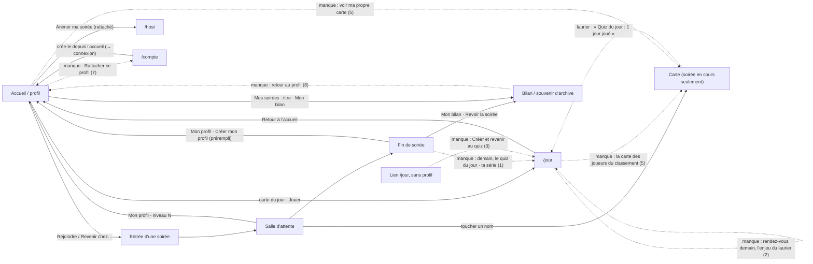

# Le profil, fil d'une soirée à l'autre — et d'un jour à l'autre — rapport de l'expert fidélisation

## En bref

Le profil relie toujours bien les soirées : Solène, créée depuis un lien
`/jour`, est reconnue d'un scan chez Chloé puis chez Denis (« Te revoilà,
Solène · Niveau 2 », sous le titre de la soirée), sa fin de soirée fête le
Globe-trotteur, et « Mes soirées » aligne les deux soirées sous leur titre,
avec « Mon bilan » ouvert sur elle et le même chiffre qu'à la fin. Sur les
douze constats de l'audit du 24, neuf sont corrigés et tiennent à l'écran, et
le chemin anonyme reste entier : « Jouer sans compte » se voit sans défiler en
360 × 640, et rien du quiz du jour n'y entre. Le quiz du jour est bien placé
pour qui a un profil : il est visible sans défiler sur l'accueil, et le
lendemain le récompense. Mais **les deux fils ne se parlent pas** : la
soirée ne parle jamais du quiz du jour (ni de la série qu'elle vient
d'allonger), la partie du jour ne donne pas rendez-vous le lendemain (le
laurier, son plus bel enjeu, n'est annoncé ni avant ni après), et le
lendemain ouvre sur « 3ᵉ place sur 3 · 0 pt » pour qui a perdu. L'anonyme
qui reçoit le lien `/jour` n'a qu'une porte, « Me connecter à mon profil »,
et personne ne le ramène au quiz une fois inscrit.

Les trois améliorations les plus rentables :
1. **Jeter le pont entre la soirée et le quiz du jour** : une ligne à la fin
   de soirée d'un profil (« Demain, le quiz du jour · ta série : 1 jour »)
   (P2 · S).
2. **Donner rendez-vous à la fin de la partie du jour, et dire le laurier** :
   « Si tu restes en tête à minuit, tu porteras le laurier demain, jusque dans
   tes soirées », puis, le lendemain, « Tu portes le laurier aujourd'hui »
   (P2 · S).
3. **Ouvrir `/jour` aux nouveaux venus** : « Créer mon profil » et « J'ai déjà
   un profil » avec retour au quiz (`?next=/jour`) ; dire le quiz du jour
   dans la phrase qui vante le profil sur l'accueil (P2 · S).

## Méthode

Une heure environ de jeu en deux temps (une coupure de l'outil, puis la
régie de l'atelier relancée sur de nouvelles bases), dans l'atelier
(`TABLEE=export/tablee/atelier.json`, serveur `:35825`) et sur un serveur
jetable à moi pour « le lendemain ».

| Appareil | Rôle | Taille |
|---|---|---|
| `chloe-tel1` | **Solène**, profil créé depuis un lien `/jour` ; quiz du jour, puis soirées chez Chloé et chez Denis ; puis anonyme « Nina » et Léa (lendemain) | téléphone 412 × 915 |
| `chloe-tel2` | l'accueil et `/jour` vus par un anonyme ; **Karim**, profil créé à l'entrée chez Chloé ; déconnecté, anonyme « Camille » chez Denis ; secours par code ; **Hugo**, vainqueur d'hier (lendemain) | petit téléphone 360 × 640 |
| `chloe`, `denis` | écrans communs ; `/compte` et rattachement d'un profil (Denis) | portable 1366 × 768 |

- **Soirée chez Chloé** (« Le dimanche de Chloé ») : 1 quiz de 6 QCM,
  5 joueurs (Solène, Karim, 3 fantômes). **Soirée chez Denis** (« Le brunch
  de Denis ») : 1 quiz de 5 QCM, 4 joueurs (Solène, Camille anonyme,
  2 fantômes). Comptes activés et quiz créés par
  `export/evaluations/parcours-profil/preparer.ts` (l'éditeur n'est pas le
  sujet).
- **Quiz du jour** du 27 septembre joué en entier par Solène (9 sur 10).
- **Le lendemain** : `export/evaluations/parcours-profil/lendemain-serveur.ts`
  démarre un serveur jetable (banc, client construit recopié dans mon
  dossier) dont l'horloge du jour est décalée de −24 h ; trois profils y
  jouent « hier » (Hugo et Zoé ex æquo en tête, Léa à 0), puis l'horloge
  revient au jour réel et je regarde au navigateur : l'accueil et `/jour`
  d'Hugo et de Léa, la soirée de l'espace `banc` avec Hugo lauréat et une
  anonyme (Nina). Éteint à la fin (son dossier jetable effacé).
- Gestes consignés dans `export/evaluations/parcours-profil/notes.md` ;
  captures recopiées dans `export/evaluations/parcours-profil/captures/`
  (citées par leur nom ci-dessous).
- **Lu** : `ProfilApp.tsx`, `JourApp.tsx`, `Jour.tsx`, `Apparence.tsx`,
  `Trophees.tsx`, `Carriere.tsx`, `Laurier.tsx`, `CarteJoueur.tsx`,
  `FinDeSoiree.tsx`, `ProfilForm.tsx`, `AccountApp.tsx` (rattachement),
  `SpaceNav.tsx`, `shared/jour.ts`, `shared/course.ts`, `shared/carte.ts`,
  `shared/glossaire.ts`, `server/src/quizDuJour.ts`, `core/space.ts`
  (`carteDe`), `server.ts` (route de la carte) ; README (« Les profils
  joueurs », « La direction »), RECOMPENSES §5.12-5.13 et feuille de route ;
  l'audit du 24 (`retours/2026-09-24/experts/parcours-profil.md`) ; les JSON
  de `jour-ecran`, `jour-regles`, `recompenses-vitrine`,
  `recompenses-comptes`, `client`, `invariants` et les titres de
  `design-recompenses.md`, pour ne pas refaire leurs constats.

**Pas couvert** : le passage réel de minuit dans l'atelier (lancé après
minuit, il n'avait pas de veille jouée — d'où le serveur à horloge
décalée) ; une saison (hors période) ; le Sphinx ; une troisième soirée ;
un vrai téléphone.

## Constats

### 1. La soirée ne parle jamais du quiz du jour — ni de la série qu'elle vient d'allonger
- **Où** : fin de soirée d'un profil, `client/src/components/FinDeSoiree.tsx`
  (aucune mention du quiz du jour, ni de la série — les actions,
  l. 283-321) ; salle d'attente (`PlayerApp.tsx`).
- **Constat** : le quiz du jour est le fil quotidien du profil, et la soirée
  en est le moment le plus chaud — mais elle n'y renvoie jamais. Karim, profil
  créé à l'entrée chez Chloé, repart avec +27 XP, « Le Globe-trotteur, 1 sur
  2 » et son Éclair : rien ne lui dit qu'un quiz l'attend demain matin. La
  série compte pourtant la soirée (« la fête ne casse jamais une série ») :
  Karim a une flamme « 1 jour » sur son accueil sans jamais avoir joué au
  quiz du jour, et sans que la soirée le lui ait dit. Il ne découvre le quiz
  qu'en touchant « Mon profil ».
- **Preuve** : `010-g01-fin-soiree-solene.png`,
  `tel2-006-g02-fin-soiree-karim.png`, `013-h04-fin-denis-solene.png` (trois
  fins de profil, aucune ligne sur le quiz du jour) ;
  `tel2-007-g03-profil-karim-360.png` (la carte du jour et « 1 jour » sur
  l'accueil de Karim, après la seule soirée) ;
  `grep -n "jour" client/src/components/FinDeSoiree.tsx` : seulement la date
  et l'import de `NOM_FINITION`.
- **Qui ça touche, ce que ça coûte** : chaque profil, à chaque soirée — et
  surtout le profil créé ce soir-là, qui ne reviendra que s'il sait pourquoi.
- **Statut** : friction (un pont manquant entre deux fonctions livrées).
- **Piste** : sous « Tu t'en approches », pour un profil seulement (le bloc
  `gain` existe déjà : l'anonyme ne voit rien de plus) :
  ```tsx
  {gain && (
    <section className="card fin-demain">
      <Flamme /> <b>Demain, le quiz du jour</b>
      <span className="muted small">Dix questions dès minuit, les mêmes pour tous
        les profils — ta série : {serie} jour{serie > 1 ? 's' : ''}.</span>
      <a className="link-inline" href="/jour">Le quiz d'aujourd'hui</a>  {/* s'il n'y a pas encore joué */}
    </section>
  )}
  ```
  La série se calcule déjà côté serveur (`JourStore.serieDe`,
  `server/src/core/jour.ts:1161`, privée) : l'exposer, et l'ajouter à
  `FinDeSoiree.profil` à la clôture avec « a joué aujourd'hui » (une ligne
  de `jour_parties`). Même idée, en une
  ligne, sous « Mon profil · niveau N » dans la salle d'attente d'un profil
  qui n'a pas joué aujourd'hui.
- **Priorité · effort** : P2 · S.

### 2. La partie du jour ne donne pas rendez-vous, et le laurier n'est dit ni avant, ni après
- **Où** : fin de partie, `client/src/views/JourApp.tsx:446-549` (la seule
  ligne tournée vers demain : l. 531-533) ; le lendemain,
  `JourApp.tsx:601-631` (`Lendemain`) ; la carte de l'accueil,
  `client/src/components/Jour.tsx:71-135`.
- **Constat** :
  - à la fin de la partie, Solène lit « Pour l'instant : 1ʳᵉ place sur 3 »,
    puis « Le classement se fige à minuit. Le podium gagne 25, 15 et 10 XP ».
    Rien ne dit **l'enjeu le plus visible** : rester en tête à minuit, c'est
    porter le laurier demain, « jusque dans les soirées ». Rien non plus sur
    demain (« dix nouvelles questions à minuit »), ni sur le prochain palier
    (L'Assidu : 1 sur 7), que l'onglet Trophées connaît pourtant (« Les plus
    proches ») ;
  - le lendemain, Hugo, vainqueur, lit « Vainqueur du quiz du jour d'hier »
    sous son prénom sur l'accueil, et, un toucher plus loin (derrière
    « Jouer »), « 1ʳᵉ place sur 3 · +25 XP de podium · Nouveau palier : Le
    Champion du jour ». Nulle part : « tu portes le laurier aujourd'hui : la
    salle le verra à côté de ton prénom ». Le laurier est la seule récompense
    du jour que les autres voient, et c'est la seule que la page ne raconte
    pas. Sa carte de l'accueil ne dit pas non plus son podium (le détail
    attend sur `/jour`).
- **Preuve** : `003-d01-fin-jour.png` (fin de partie) ;
  `tel2-013-j01-lendemain-accueil-hugo-premiere.png` (accueil du lauréat) ;
  `tel2-014-j02-lendemain-jour-hugo.png` (« Hier, au quiz du jour » : podium
  et palier, pas de laurier) ; `grep -n laurier client/src/views/JourApp.tsx`
  : seulement `NomLaure` dans le classement.
- **Qui ça touche, ce que ça coûte** : chaque joueur du jour, chaque jour —
  c'est la boucle « je reviens demain » elle-même.
- **Statut** : friction (le ressort existe, il n'est pas dit).
- **Piste** (textes) :
  - fin de partie, en tête ou ex æquo : « Reste en tête jusqu'à minuit, et tu
    porteras le laurier demain — au classement du jour et dans tes
    soirées. » ; sinon, rien sur le laurier, et pour tous : « Demain, dix
    nouvelles questions dès minuit · L'Assidu : 1 jour sur 7 » (réutiliser
    `lesPlusProches` filtré sur les paliers `duJour`) ;
  - `Lendemain` du vainqueur : une ligne `<Laurier laurier /> Tu portes le
    laurier aujourd'hui : la salle le verra à côté de ton prénom.` ;
  - `CarteDuJour` : quand `sonHier.rang` est sur le podium, « Hier : 1ʳᵉ
    place · +25 XP » sous la date, pour que la récompense se voie là où l'on
    arrive.
- **Priorité · effort** : P2 · S.

### 3. L'anonyme qui reçoit le lien `/jour` n'a qu'une porte : « Me connecter à mon profil » — et rien ne l'y ramène
- **Où** : `JourApp.tsx:181-196` (sans profil) ; `ProfilApp.tsx:183-187`
  (`onDone` : relire le profil, pas de retour) ; l'accueil,
  `shared/profil.ts:761` (`PITCH_PROFIL`).
- **Constat** :
  - un ami partage `/jour` (« fais celui d'aujourd'hui ! ») : l'anonyme lit
    « Dix questions, chaque jour · Les mêmes pour tous les profils », et un
    seul bouton, « **Me connecter à mon profil** » — à quelqu'un qui n'en a
    pas. Il mène à la connexion de l'accueil, où il faut trouver « Créer un
    profil » sous le « ou » ;
  - une fois le profil créé, on atterrit sur l'accueil, pas au quiz : il faut
    retrouver la carte, « Jouer », puis encore « Jouer » sur `/jour`. Au
    total, **8 touchers et 2 saisies** du lien à la première question
    (6 sans changer d'avatar) ; un profil existant déconnecté : 4 touchers et
    2 saisies, dont deux « Jouer » d'affilée ;
  - l'accueil anonyme vante le profil (« Un profil garde ton niveau, tes prix
    et tes avatars d'une soirée à l'autre ») sans un mot du quiz du jour, la
    seule chose qu'un profil offre **entre** deux soirées.
- **Preuve** : `002-a02-jour-anonyme-360.png`, `001-a01-accueil-anonyme-360.png`,
  `001-c01-profil-apres-creation-depuis-jour.png`, `002-c02-jour-intro.png` ;
  gestes dans `notes.md`.
- **Qui ça touche** : le principal chemin d'acquisition d'un jeu quotidien —
  le lien qu'un joueur envoie à un ami.
- **Statut** : friction. **Tension** avec « un anonyme n'y voit rien qui lui
  manque » (`shared/jour.ts:13`) pour la phrase de l'accueil : je la crois
  levée, car cette phrase est une invitation, à l'endroit même où l'on
  propose « Créer un profil », pas un manque montré en soirée.
- **Piste** :
  ```tsx
  // JourApp, sans profil
  <a className="btn btn-primary btn-big btn-block" href="/?creer=1&next=/jour">Créer mon profil et jouer</a>
  <a className="btn btn-block" href="/?next=/jour">J'ai déjà un profil</a>
  ```
  et, dans `ProfilApp`, lire `next` avec la règle de `shared/securite.ts`
  (jamais ailleurs que chez soi) : `onDone` → `location.assign(next)` si
  présent. Sur l'accueil : « Un profil garde ton niveau, tes prix et tes
  avatars d'une soirée à l'autre — et t'ouvre le quiz du jour, dix questions
  chaque matin. »
- **Priorité · effort** : P2 · S.

### 4. Le lendemain ouvre sur « 3ᵉ place sur 3 · 0 pt » : la défaite en titre
- **Où** : `JourApp.tsx:601-631` (`Lendemain`, le titre l. 609) ; la fin de
  partie (« Pour l'instant : Nᵉ place sur N », l. 472-477), la carte de
  l'accueil (`Jour.tsx:97-101`) et « Mes jours » (`Jour.tsx:165`).
- **Constat** : Léa, qui a joué hier et marqué 0, revient : la première
  chose que `/jour` lui montre, en grand, est « 3ᵉ place sur 3 », puis
  « 0 pt ». Le dépôt a pourtant tranché le 25 septembre, pour la course au
  fil du quiz : « les bonnes nouvelles seulement : “sur 12” ne se dit qu'à la
  moitié haute, jamais “dernier”, et pas de rang à zéro point »
  (`shared/course.ts:11-13`). Le quiz du jour, qui se joue devant tout le
  serveur, dit exactement l'inverse — et à cent joueurs ce sera
  « 87ᵉ place sur 100 » en titre, à celui qu'on veut voir revenir.
- **Preuve** : `018-j08-lendemain-jour-lea.png` ; l'API le confirme :
  `GET /api/jour` (Léa) → `"sonHier":{"rang":3,"joueurs":3,"points":0,
  "xpPodium":0,"medaille":null}`.
- **Qui ça touche** : la moitié basse du classement, chaque matin.
- **Statut** : friction ; écart avec un parti pris écrit (`shared/course.ts`).
- **Piste** : appliquer la règle de la course : le rang seulement sur le
  podium ou dans la moitié haute (« 5ᵉ sur 23 »), sinon un titre qui dit ce
  qu'on a appris (« Hier : 4 bonnes réponses · +12 XP ») et la correction ;
  jamais de rang à zéro point. Même règle pour « Pour l'instant » et « Mes
  jours ». Un test pur de la phrase, comme pour `course.ts`.
- **Priorité · effort** : P3 · S.

### 5. La carte, seule vitrine des cosmétiques, ne se voit qu'en pleine soirée
- **Où** : `server/src/server.ts:614-621` et `core/space.ts:598` (la carte
  n'existe que pour un invité de la soirée en cours) ; classement du jour,
  `JourApp.tsx:706-719` (des lignes, pas des boutons) ; `/profil` (n'importe
  pas `CarteJoueur`) ; `Apparence.tsx:348-397` (le fond de carte).
- **Constat** : les #58 et #59 ont multiplié ce qui ne se voit **que** sur la
  carte — le titre, la vitrine qu'on choisit, les écussons, le fond (Nuit
  étoilée à 30 jours de quiz du jour, Kintsugi à 10 victoires au quiz du
  jour). Or la carte ne s'ouvre qu'en touchant un nom dans une soirée en
  cours : ni depuis le classement du jour, où se retrouvent justement les
  joueurs du quotidien, ni après la clôture, ni **par son propriétaire** —
  Solène choisit « La Foudre » pour titre, ses trois hauts faits et son fond
  sans jamais voir la carte qu'elle compose (« Ce que la salle voit » ne
  montre qu'une ligne de classement). Le fond gagné au quiz du jour n'a de
  public qu'à la prochaine soirée.
- **Preuve** : `004-d02-classement-jour.png` (lignes inertes) ;
  `014-i01-apparence-titre-paon.png` ; `tel2-005-e06-carte-solene.png` (la
  carte n'est vue que depuis la salle d'attente de Chloé) ; lecture de la
  route.
- **Qui ça touche** : tout profil qui personnalise — ce que le lot 6 et le
  lot 7 ont construit.
- **Statut** : friction (S) ; idée à arbitrer (M) pour le classement du jour.
- **Piste** : (S) « Voir ma carte » sur `/profil` : une route
  `GET /api/joueur/carte` qui rend la partie `profil` de `CarteDeJoueur`
  (même code que la seconde moitié de `carteDe`, sans `ceSoir`), affichée par
  `CarteJoueur` ; « Ce que la salle voit » y mène. (M, à arbitrer) la carte
  depuis le classement du jour — voir la tension du constat 9 : n'y mettre
  que ce que le classement montre déjà et la vitrine.
- **Priorité · effort** : P3 · S (sa carte) ; P3 · M (celle des autres).

### 6. La série, ressort quotidien, ne s'explique pas au toucher et ne prévient jamais
- **Où** : `client/src/components/Jour.tsx:55-63` (`Serie`, un `title` que le
  doigt ne voit pas) ; `shared/glossaire.ts` (pas d'entrée « série ») ;
  fin de partie, `JourApp.tsx:510-521`.
- **Constat** : une flamme « 1 jour » en haut de la carte du jour, sans
  légende au toucher ni place dans « Que veulent dire ces mots ? ». La fin
  de partie l'explique une fois (« Un soir de soirée compte aussi »), mais
  rien, jamais, ne dit qu'elle se perd à minuit si l'on ne joue pas —
  c'est pourtant ce qui fait revenir, dans tout jeu quotidien. Karim l'a
  gagnée en soirée sans le savoir (constat 1).
- **Preuve** : `005-d03-accueil-apres-jour.png`,
  `tel2-007-g03-profil-karim-360.png`, `017-j07-lendemain-accueil-lea.png`.
- **Statut** : friction.
- **Piste** : `serie` au glossaire (« Les jours d'affilée où tu as joué, au
  quiz du jour ou en soirée. Minuit la casse. ») ; sur la carte de
  l'accueil, quand la série atteint 2 et qu'on n'a pas joué aujourd'hui :
  « Ta série de 4 jours tient jusqu'à minuit ». Sans notification ni
  culpabilisation : une phrase, sur la page qu'on ouvre de soi-même.
- **Priorité · effort** : P3 · S.

### 7. Rattacher son profil : retaper ce qu'on vient de créer, et pas de chemin de l'accueil vers `/compte`
- **Où** : `client/src/views/AccountApp.tsx:233-238` (« crée-le depuis
  l'accueil » → `/`, la **connexion**) ; `ProfilApp.tsx:474-475` (profil
  connecté, console ouverte, non rattaché : « Animer « … » », rien de plus).
- **Constat** : Denis, animateur, veut jouer aussi. `/compte` → « crée-le
  depuis l'accueil » ouvre « Me connecter » ; il trouve « Créer un profil »,
  le crée ; l'accueil lui propose alors « Animer « La soirée de Denis » »,
  mais pas de rattacher ce profil ; il faut **taper l'adresse** `/compte`
  (l'accueil n'y mène pas), puis retaper l'identifiant et le mot de passe
  qu'il vient de choisir. ≈ 7 touchers, 5 saisies, une adresse tapée. Une
  fois fait, « Animer ma soirée » paraît sur l'accueil : la promesse tient.
- **Preuve** : `notes.md` (déroulé Denis) ; `/compte` après rattachement :
  « Identifiant denis — il ouvre cette console depuis l'accueil ».
- **Statut** : friction ; l'invariant 16 n'est pas en cause.
- **Piste** : lien `/?creer=1` sur `/compte` (la création, pas la connexion) ;
  sur l'accueil d'un profil connecté quand une console non rattachée est
  ouverte (`!espace && console_`) : « Rattacher ce profil à « La soirée de
  Denis » », qui ne redemande que le mot de passe du profil — la session
  d'animateur est la seconde preuve (à arbitrer : elle n'est pas un mot de
  passe fraîchement tapé).
- **Priorité · effort** : P3 · S.

### 8. Le souvenir et le bilan n'ont toujours pas de retour au profil
- **Où** : `client/src/components/SpaceNav.tsx:47-62` (Jouer · Souvenir ·
  Bilan · Historique · « Mon compte » pour l'animateur).
- **Constat** : depuis « Mes soirées », « Mon bilan » s'ouvre bien sur
  Solène, sans « Qui es-tu ? » (corrigé) ; mais pour revenir, seul le bouton
  retour du navigateur — « Jouer » mène à l'entrée de l'espace. C'est le
  reste du constat 4 du 24.
- **Preuve** : `020-k02-bilan-depuis-profil.png` ; liens relevés par `voir`.
- **Statut** : friction (résidu).
- **Piste** : dans `SpaceNav`, « Mon profil » quand un cookie de profil est
  là (le pendant de « Mon compte »).
- **Priorité · effort** : P3 · S.

### 9. Tension : le classement du jour met côte à côte tous les profils du serveur, tous espaces confondus
- **Où** : `server/src/core/jour.ts:892` (`classementDuJour`, sans espace) ;
  README, « La direction » : « Ce qui n'est volontairement pas fait :
  classement public entre espaces (chaque animateur est chez lui) »
  (`README.md:613`).
- **Constat** : dès le premier jour, Solène se classe devant « Étroite » et
  « Clavier » — des profils d'autres espaces qu'elle n'a jamais croisés. Le
  choix est écrit (RECOMPENSES §5.13 : « tout le serveur »), mais il
  contredit la phrase du README, et il pèse sur l'envie de revenir : on
  revient pour battre Hugo, qu'on a vu mardi chez Chloé, pas pour être
  87ᵉ d'inconnus.
- **Preuve** : `004-d02-classement-jour.png`.
- **Statut** : tension avec un parti pris (README, « La direction »).
- **Piste** : à arbitrer. Une voie qui respecte les deux : un onglet « Mes
  proches » — les profils croisés en soirée (dérivable de `profile_xp` :
  même `(espace, soirée)`), rien de nouveau n'est exposé ; et corriger la
  phrase du README.
- **Priorité · effort** : P3 · M.

### 10. Tension : le laurier fait entrer dans la soirée une distinction gagnée ailleurs
- **Où** : `Leaderboard.tsx:77`, `CarteJoueur.tsx:105-109`,
  `PlayerApp.tsx` (salle d'attente).
- **Constat** : le parti pris n° 1 tient — l'anonyme Nina n'a ni laurier
  gris ni place gardée, et la carte d'Hugo dit ce qu'est le sien
  (« Vainqueur du quiz du jour d'hier »). Mais c'est le premier signe, dans
  la liste de la soirée, d'un jeu **auquel l'anonyme ne peut pas jouer**, et
  rien ne le lui dit : il voit la couronne, lit « quiz du jour », et ne sait
  ni ce que c'est ni que c'est réservé aux profils.
- **Preuve** : `015-j05-anonyme-voit-laurier.png`,
  `016-j06-carte-hugo-laurier.png`.
- **Statut** : tension avec le parti pris n° 1 — à surveiller, pas à
  corriger : aujourd'hui, l'absence reste une absence.
- **Piste** : ne rien ajouter à la ligne ; si l'on veut éclairer, le faire
  sur la carte, en petit, pour tous : « Le quiz du jour : dix questions
  chaque jour, pour les profils. » Mesurer à la prochaine tablée si un
  anonyme s'y arrête.
- **Priorité · effort** : P3 · S.

### 11. Idée : deux listes au lieu d'un fil
- **Où** : onglet Carrière, `ProfilApp.tsx:315-359` (« Mes jours » puis « Mes
  soirées ») ; l'onglet ouvert par défaut, Apparence (`ProfilApp.tsx:411-422`).
- **Constat** : les jours et les soirées sont deux listes l'une sous l'autre,
  chacune avec son lien, et le prochain objectif (« Les plus proches ») est
  sous Trophées, derrière l'onglet Apparence qu'un profil neuf ouvre
  d'abord. Le « fil quotidien » ne se lit nulle part d'un seul tenant.
- **Statut** : idée.
- **Piste** : un « Mon fil » chronologique (« Dim. 27 · quiz du jour · 1 800
  pts · argent » ; « Le brunch de Denis · 1ʳᵉ · Mon bilan » ; « Le dimanche
  de Chloé · 1ʳᵉ ») — deux dérivations déjà servies, fusionnées par date ; et
  « Les plus proches » repris en une ligne sous la barre d'expérience de
  l'en-tête, quel que soit l'onglet.
- **Priorité · effort** : P3 · M.

## Mesures et cartes

### Le parcours, pas à pas (gestes comptés à l'appareil)

| Chemin | Gestes | Ce qu'on demande | Depuis le 24 |
|---|---|---|---|
| Entrer **sans compte** (A → B) | 3 | prénom (avatar tiré au sort) | = |
| **Créer un profil depuis l'accueil** | 3 touchers + 2 saisies (+2 pour changer d'avatar) | prénom, avatar tiré d'avance, mot de passe ; identifiant proposé | avatar ✔ (plus de 🎉) |
| **Créer depuis l'entrée** (« Créer ton profil · 1/2 ») | 5 touchers + 2 saisies, puis la salle | prénom + avatar, mot de passe (« Au moins 8 caractères » d'avance), code avec « Copier » | « 1/2 » ✔ |
| **Lien `/jour` reçu, sans profil → 1ʳᵉ question** | 8 touchers + 2 saisies | tout, puis retrouver le quiz soi-même (constat 3) | nouveau |
| Lien `/jour`, profil existant déconnecté → 1ʳᵉ question | 4 touchers + 2 saisies | dont deux « Jouer » d'affilée | nouveau |
| Une partie du jour | 20 touchers | 10 réponses, 9 « Question suivante », « Voir mon résultat » | nouveau |
| Revenir avec un profil reconnu | 1 | rien | = (et le titre de la soirée ✔) |
| Fin de soirée anonyme → création préremplie | 1 + mot de passe | prénom et avatar du soir repris | ✔ |
| Mot de passe oublié (code de secours) | 3 touchers + 3 saisies | le **code neuf s'affiche** | ✔ |
| `/profil` → **son** bilan | 3 (Carrière, Mes soirées, Mon bilan) | rien (« Qui es-tu ? » disparu) | ✔ (4 avant) |
| Rattacher un profil (animateur) | ≈ 7 touchers + 5 saisies + une adresse tapée | identifiants retapés (constat 7) | lien ✔, reste long |

### Ce que la progression a donné

| | Solène (profil, `/jour`) | Karim (profil créé à l'entrée) | Hugo / Léa (lendemain) |
|---|---|---|---|
| Quiz du jour | 9 sur 10, 1 800 pts, **+67 XP**, niveau 1 → 2 (non fêté, cf. `recompenses-vitrine-1`), argent, série 1 | — | Hugo : +25 XP de podium, Le Champion du jour, laurier ; Léa : 0 pt, « 3ᵉ place sur 3 » |
| Chez Chloé | +72 au podium du quiz, **+97** à la fin, 2 prix, la Foudre | **+27**, l'Éclair | — |
| Chez Denis | **+91 · +10 de paliers**, niveau 2 → 3, Argent, Globe-trotteur | anonyme « Camille » : 2ᵉ, 2 prix non gardés | — |
| « Mes soirées » | +97 et +91 : **le même chiffre qu'à la fin** ✔ | — | — |

### La carte des liens



Relié : profil ↔ soirée (retrouvailles, « Revenir chez… »), fin → bilan et
souvenir, profil → chaque soirée et son bilan, profil → quiz du jour, carte →
existence du quiz du jour. Pas relié : **soirée → quiz du jour**, quiz du
jour → carte des joueurs, profil → sa propre carte, archives → profil,
lien `/jour` → retour au quiz après inscription.

### Ce qui donne envie de revenir — et ce qui manque

Donne envie : la carte du jour sur l'accueil (visible sans défiler en
360 × 640), la partie elle-même (on apprend : la bonne réponse, « trouvée par
67 % », l'anecdote), « Les plus proches » (L'Assidu 1 sur 7, Le Sphinx),
« Tu t'en approches » à la fin de soirée (le Globe-trotteur qui pousse vers
un autre hôte), le lendemain du vainqueur (podium, palier, laurier sous son
prénom et dans la salle).
Manque : le **rendez-vous** (constat 2), le **pont** depuis la soirée
(constat 1), la **série** expliquée (constat 6), un lendemain qui ménage
celui qui a perdu (constat 4), et un public pour ce qu'on compose (constat 5).

### L'invité anonyme : se sent-il de seconde zone ?

Non, toujours pas — et c'est à garder. Vérifié : l'entrée tient « Jouer sans
compte » au format de « Me connecter » en 360 × 640, sans rien du quiz du
jour (`tel2-001-e01-entree-A-360.png`) ; sa salle d'attente, ses lignes et sa
fin de soirée n'ont ni pastille, ni laurier gris, ni reproche
(`tel2-008-h02-salle-attente-anonyme-360.png`,
`tel2-010-h05-fin-denis-anonyme.png`) ; l'invitation dit vrai (« celle-ci ne
s'y ajoute pas ») et mène à une création préremplie. Deux points à
surveiller : le laurier, première trace dans la soirée d'un jeu qui lui est
fermé (constat 10), et le quiz du jour qu'il ne peut découvrir que par la
carte d'un autre (constat 3).

### Ce que l'audit du 24 est devenu

| Constat du 24 | Aujourd'hui |
|---|---|
| 1. Code de secours perdu sur `/profil` | ✔ corrigé : « Note ton nouveau code » (`tel2-012-h07-secours-code-neuf.png`) |
| 2. 🎉 d'office à l'accueil | ✔ avatar tiré d'avance, « changer » (`002-b02-grille-avatar.png`) |
| 3. +121 à la fin, +101 au profil | ✔ « +91 · +10 de paliers » à la fin, +91 au profil |
| 4. Mes soirées sans titre ni bilan ; pas de retour ; carte après clôture | ✔ titre et « Mon bilan » ; ✗ retour au profil (constat 8) ; ✗ carte hors soirée (constat 5) |
| 5. Accueil sans porte d'animateur | ✔ « J'anime une soirée » ; « mot de passe du compte » nommé ; reste long (constat 7) |
| 6. « Créer mon profil » ouvrait la connexion | ✔ création préremplie |
| 7. Pas de changement de mot de passe | ✔ « Identifiant et mot de passe » (Carrière) — lu, non rejoué |
| 8. « Ce soir » ignorait la soirée en cours | ✔ « Revenir chez Antoine » |
| 9. Retrouvailles sans titre, « badges » | ✔ titre de la soirée, « Te revoilà », plus de badges |
| 10. Fin sans prix ni prochain objectif | ✔ prix, collection, « Tu t'en approches », « Mon bilan » d'abord |
| 11. Étape 1 muette | ✔ « Créer ton profil · 1/2 » |
| 12. Réclamer sa soirée | toujours à arbitrer (RECOMPENSES, « Plus tard » n° 1) |

## Ce qui marche — à ne pas casser

- **La reconnaissance d'un espace à l'autre**, un scan et un bouton, sous le
  titre de la soirée.
- **Le chemin anonyme**, intact en 360 × 640, et le quiz du jour qui ne
  l'effleure pas.
- **La carte du jour sur l'accueil** : à jouer, reprendre ou joué, sa place,
  sa série — sous « Ce soir », visible sans défiler.
- **Le lendemain du vainqueur** : podium, palier, laurier sous le prénom,
  dans la salle d'attente d'une soirée et sur sa carte.
- **« Mes soirées »** : titre, « Mon bilan » ouvert sur soi, le même chiffre
  qu'à la fin.
- **La fin de soirée** d'un profil (prix, collection, « Tu t'en approches »)
  et celle d'un anonyme, courte, entière et honnête.
- **Le titre et l'emoji de collection** se portent d'un toucher, et l'en-tête
  du profil se met à jour aussitôt.

## Recommandations, dans l'ordre

1. Fin de soirée d'un profil : « Demain, le quiz du jour · ta série »
   (constat 1) — **P2 · S**.
2. Fin de partie et lendemain : le rendez-vous, l'enjeu du laurier, « Tu
   portes le laurier aujourd'hui », le podium d'hier sur la carte de
   l'accueil (constat 2) — **P2 · S**.
3. `/jour` sans profil : « Créer mon profil et jouer » / « J'ai déjà un
   profil » avec `next=/jour` ; le quiz du jour dans la phrase de l'accueil
   (constat 3) — **P2 · S**.
4. Le lendemain et la fin de partie selon la règle de la course : pas de
   « dernier », pas de rang à zéro point (constat 4) — **P3 · S**.
5. La série au glossaire, et « elle tient jusqu'à minuit » sur la carte
   (constat 6) — **P3 · S**.
6. « Voir ma carte » sur `/profil` (constat 5) — **P3 · S** ; la carte depuis
   le classement du jour, à arbitrer — **P3 · M**.
7. « Mon profil » dans le fil des pages d'archive (constat 8) — **P3 · S**.
8. Rattacher un profil d'un toucher depuis l'accueil, `/?creer=1` sur
   `/compte` (constat 7) — **P3 · S**.
9. À arbitrer : le classement du jour limité ou filtrable à ses proches, et
   la phrase du README (constat 9) — **P3 · M**.
10. Un « Mon fil » qui mêle jours et soirées ; « Les plus proches » sous la
    barre d'expérience (constat 11) — **P3 · M**.
11. À surveiller : ce que l'anonyme comprend du laurier (constat 10) — **P3 · S**.

## Limites

- Le passage de minuit n'a été vu que sur un serveur à horloge décalée, pas
  dans l'atelier ; une seule veille, trois joueurs. Le laurier à l'écran
  commun relève de `design-recompenses` (son constat 5).
- Pas de saison, pas de Sphinx, pas de troisième soirée ; le changement de
  mot de passe connecté a été lu, pas rejoué.
- Chromium seul, clavier simulé. Mon banc partage les cookies de `localhost`
  entre les ports (la connexion de Léa sur mon serveur a déconnecté Solène de
  l'atelier) : un artefact du banc, pas de l'application.
- Constats déjà portés ailleurs et non repris ici : le niveau gagné au quiz
  du jour non fêté (`recompenses-vitrine-1`), le laurier absent de « Ce que la
  salle voit » et de l'en-tête du téléphone (`recompenses-vitrine-11`) — et de
  l'écran des retrouvailles, vu ici (`tel2-015-j03-retrouvailles-laureat.png`),
  le « Hugo a gagné hier » lu par Hugo (`jour-ecran-12`), le lendemain sans
  laurier à la première visite (`jour-ecran-7`, non reproduit ici : la
  diffusion de la soirée avait déjà clos la nuit), les deux profils d'un même
  joueur (`jour-regles-1`, `-4`).
