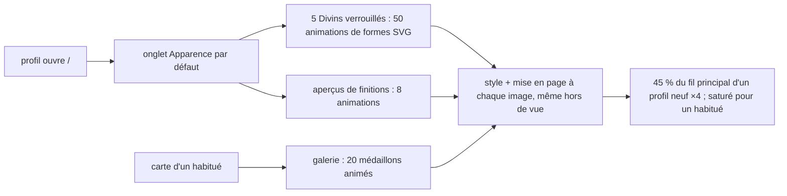

# Le client après #58 et #59 : ce qu'il pèse et ce qu'il coûte à dessiner — rapport de l'expert perf-client (perf-chargement + perf-rendu)

## En bref

Les corrections du 24 septembre tiennent toutes : la précompression brotli 11
est servie (57,7 Ko pour l'entrée au lieu de 65,7), les médaillons restent hors
du chemin de l'invité (`medaillons.test.ts` passe, aucun dessin demandé sur
`/banc`), une seule police part en tête, le chronomètre ne réveille React
qu'une fois par seconde et n'anime plus que `transform`, et les légendaires se
figent dans les listes (0 mise en page par seconde dans une salle d'attente de
30 profils dont 10 légendaires). Mais #58/#59 ont repris une bonne part du
gain de l'axe 9 sur le chemin du QR : **+69 ms jusqu'à l'écran d'entrée en
HTTP/2** (1 759 → 1 828 ms, +12,9 Ko, 6 requêtes de plus), **+259 ms en
HTTP/1.1** (la méthode du 24 septembre) — surtout un CSS commun passé de 114 à
137 Ko (l'invité en utilise 7 %) et la carte, la fin de soirée et `Jour.tsx`
chargés devant l'écran d'entrée. Au rendu, le vrai coût neuf n'est pas dans les
fonds de carte (ils ne sont pas animés et ne coûtent rien au repos), mais dans
les **médaillons animés des écrans de profil** : l'onglet Apparence, celui qui
s'ouvre par défaut, tient le téléphone de **tout profil, même neuf**, à ~45 %
de son fil principal (×4) — cinq Divins verrouillés y tournent en continu — et
la carte d'un habitué le sature. Les trois gestes les plus rentables :
(1) **figer les Divins verrouillés et les aperçus de finitions** (une règle
CSS : 430 → 20 ms/s, mesuré) ; (2) **réserver la place de la carte du quiz du
jour** sur l'accueil d'un profil (CLS 0,175 à chaque ouverture) ; (3) **sortir
la carte, la fin de soirée et le CSS des autres pages du chemin du QR**
(mesuré : retour à 1 759 ms en HTTP/2, 2 018 ms en HTTP/1.1).

## Méthode

- **Code** : `main` à b57035c (#59 fusionnée). Comparé, construit dans mon
  dossier par `git archive` (jamais le dépôt) : `a6fc98b` (juste avant #58) et
  `9dd100e` (le client de l'audit du 24 septembre — ses empreintes
  `index-Dj7U8XGy.js`, `index-DYfM5twH.css` sont celles du rapport).
- **Fichiers lus** : `CLAUDE.md` ; `retours/2026-09-24/experts/perf-chargement.md`,
  `perf-rendu.md`, `retours/2026-09-24/verification/perf.md` et leurs scripts ;
  les rapports de `export/evaluations/rapports/` (dont `recompenses-vitrine`,
  `client`, `jour-ecran`) ; `client/vite.config.ts`, `client/index.html`,
  `client/src/main.tsx`, `views/{PlayerApp,ProfilApp,JourApp,HostApp}.tsx`,
  `components/{Avatar,medaillons,CarteJoueur,Apparence,Trophees,Carriere,Jour,Laurier,Leaderboard,Legendaire,Divin,TimerBar,GetReady,FinDeSoiree}.tsx`,
  `decompte.ts`, `retour.ts`, `styles.css` (fonds, légendaires, Divins,
  finitions, Éclat, chronomètre) ; `shared/{fonds,saisons,legendaires,divins}.ts` ;
  `server/src/{server.ts,core/precompresse.ts,core/space.ts (carteDe),core/jour.ts (vue du jour),auth/profiles.ts,auth/profileRoutes.ts}` ;
  `server/test/{banc,medaillons.test,jour-partie.test}.ts`.
- **Scripts écrits** (tous dans `export/evaluations/perf-client/`) :
  - `paquet.mjs` (fermeture statique des imports par route, tailles brute /
    `.gz` / `.br` réellement servies, composition par source) ;
    `sources-route.mjs` (ce que #58/#59 ont ajouté, source par source) ;
    `css-sections.mjs`, `css-part.mjs` (poids du CSS par famille) ;
  - `monde.ts` : serveur jetable qui sert le client construit, profils aux
    dérivations **forcées** sur ce serveur seulement (niveau, légendaires,
    Divins, fonds ouverts, Éclat, laurier) — les choix (fond, légendaire,
    finition) passent par la vraie route `PUT /api/joueur/moi` ;
  - `chargement.ts` : la méthode de `mesure.mjs` du 24 septembre (contexte
    neuf, cache désactivé, 4G moyenne 150 ms / 1,6 Mb/s, CPU ×4 ou ×6,
    **cinq passages, médiane**), plus octets par type, dessins demandés,
    couverture JS/CSS ; `h2.ts` : un mandataire **HTTP/2** (TLS local) devant
    le serveur, pour mesurer aussi comme en ligne ; `service.ts` (encodages et
    cache au fil, sans décompression) ; `cls-profil.ts` (sources des décalages) ;
  - `mesure.ts` (fenêtres : images par `requestAnimationFrame`, rendus React
    par le crochet `__REACT_DEVTOOLS_GLOBAL_HOOK__` de `sonde.js` — reprise de
    perf-rendu —, longues tâches, CDP `Performance.getMetrics`, trace de
    peinture) ; `rendu-profil.ts` (carte × 4 fonds × « réduire les
    animations », grille d'Apparence, onglets, réactivité) ;
    `rendu-jour.ts` ; `rendu-soiree.ts` (30 profils, lauriers, écran ×2 et
    téléphone ×6 en même temps) ; `ab-medaillons.ts` (A/B par feuille de style
    injectée, deux tours alternés) ; `qui-anime.ts` ; `composees.ts` ;
    `fuite-carte.ts` (ramassage forcé et instantané du tas) ;
  - trois **variantes** du client, construites depuis une copie de travail :
    `variante-onglets.mjs` (onglets du profil à la demande), `variante-invite.mjs`
    (carte, fin de soirée et fête d'un gain à la demande), `css-elague.mjs`
    (CSS de l'invité sans les familles qu'il ne voit pas) ;
  - `chemins.test.ts` : les reproductions en `node:test` (quatre épreuves, qui
    **échouent aujourd'hui**).
- **Appareils** : Chromium 1194 sans tête (Playwright global), téléphone
  360 × 640 DPR 2 tactile (CPU ×4 et ×6), écran commun 1366 × 768 (CPU ×2).
  Un seul navigateur à la fois, `nice -n 10`.
- **Charge** : machine partagée avec d'autres experts ; `uptime` de 0,4 à 3,6
  pendant les mesures, noté dans chaque JSON. Les séries de temps de
  chargement restent serrées (≤ 50 ms d'écart sur cinq, sauf un passage) ; je
  donne d'abord des comptes (octets, requêtes, animations, mises en page,
  rendus), les temps ensuite.
- **Durée** : environ une heure de mesures. **Pas couvert** : un vrai
  téléphone et un vrai GPU, iOS/WebKit, la mémoire sur trente questions (non
  refaite : rien n'y a changé du côté des vues de jeu), l'éditeur, le souvenir
  et le bilan au rendu, la clôture et sa fin de soirée.

## Constats

### 1. L'onglet Apparence, ouvert par défaut, occupe le téléphone de tout profil — même neuf
- **Où** : `client/src/components/Divin.tsx:872` (un Divin verrouillé porte
  `dv-voile`, mais garde ses animations) ; `styles.css:4545-4546`
  (`.dv-brume`, `.dv-nebuleuse`) et les autres formes animées des Divins ;
  `components/Apparence.tsx:163-186` (les cinq Divins de la grille) et
  `MesFinitions` (les aperçus des finitions Holo, Prisme, Aurore,
  Constellation, animés même verrouillés) ; `views/ProfilApp.tsx:421`
  (« sinon « Apparence » ») — l'accueil `/` d'un profil ouvre cet onglet.
- **Constat** : un profil qui vient d'être créé a dans sa grille cinq Divins
  verrouillés (« une nébuleuse sans nom ») et, plus bas, les aperçus des
  finitions : **58 animations** tournent en permanence, dix par Divin
  (`dv-respire` ×2, `dv-tourne`, `dv-scintille` ×6, `dv-pouls`), sur des formes
  internes d'un SVG, que le navigateur ne compose pas — 60 mises en page par
  seconde, **hors de l'écran compris** (mesuré avec la grille sous le pli). Les
  légendaires verrouillés, eux, sont déjà figés (`styles.css:4347`,
  `.lg-verrou * { animation: none !important; }`) : les Divins verrouillés ont
  été oubliés.
- **Preuve** : `qui-anime.txt` (le détail des 58 animations) ; `ab-medaillons.ts`,
  même page, deux tours alternés, CPU ×4 :

  | Variante (grille d'un profil neuf) | Fil principal | Mises en page | Animations |
  |---|---|---|---|
  | telle quelle | **420–430 ms/s** | 60/s | 58 |
  | Divins verrouillés figés (`.dv-voile *`) | 108–109 ms/s | 0/s | 8 |
  | + aperçus de finitions figés | **19–20 ms/s** | 0/s | 0 |
  | rien d'animé (plancher) | 20 ms/s | 0/s | 0 |

  À ×6 : 647 ms/s au repos ; changer d'onglet y prend **287 ms au lieu de
  206** (Trophées) et 351 au lieu de 288 (Apparence) quand les animations
  tournent (`rendu-profil-cpu6-…reactivite…json`). Reproduction :
  `chemins.test.ts`, épreuve 4 (échoue : « une règle fige les formes d'un Divin
  verrouillé »).
- **Qui ça touche, ce que ça coûte** : chaque profil, à chaque ouverture de
  l'accueil ou de son profil, tant que la page reste ouverte : la batterie et la
  chaleur d'un téléphone d'entrée de gamme, et des gestes 20 à 40 % plus lents.
  Rien ne saccade à l'œil (60 i/s tenues à ×4).
- **Statut** : défaut confirmé (rejoué, isolé par A/B). Pas de tension : ce
  qu'on ne possède pas encore n'a pas à bouger, c'est déjà la règle des
  légendaires verrouillés.
- **Piste** :
  ```css
  /* Pas encore descendu : sa nébuleuse se tient tranquille, comme la
     silhouette d'un légendaire verrouillé. Dix formes animées par Divin, que
     le navigateur ne compose pas : les cinq de la grille tenaient le
     téléphone de chaque profil à 45 % de son processeur, grille hors de vue
     comprise. */
  .dv-voile * { animation: none !important; }
  /* Les aperçus de finitions : figés tant qu'on ne les regarde pas de près. */
  .finitions .av::before, .finitions .av::after { animation: none; }
  ```
  (ou, pour garder le mouvement des aperçus : ne l'animer qu'au survol ou
  quand la finition est choisie). Plus loin, suspendre toute animation hors de
  vue (`IntersectionObserver` → `animation-play-state: paused`).
- **Priorité · effort** : P2 · S.

### 2. Le chemin du QR a rendu une bonne part de ce que l'axe 9 lui avait fait gagner
- **Où** : `client/src/styles.css` (importé par `main.tsx:9`, une seule feuille
  pour toutes les pages) ; `views/PlayerApp.tsx:36-37` (imports statiques de
  `FinDeSoiree`/`Celebration` et `CarteJoueur`) ; `components/CarteJoueur.tsx:15`
  (`import { Flamme } from './Jour'`, qui tire tout `Jour.tsx`).
- **Constat** : jusqu'à l'écran d'entrée, l'invité anonyme télécharge 12,9 Ko de
  plus qu'avant #58 (HTTP/2), en 28 requêtes au lieu de 22. Le JS de sa route
  passe de 102,8 à 111,0 Ko brotli (+8,2), le CSS commun de 19,3 à 22,8 Ko
  brotli (114 → 137 Ko bruts). Ce qui s'y est ajouté ne sert pas avant la
  salle d'attente : les fonds de carte (11,8 Ko bruts de dégradés), le quiz du
  jour, les onglets du profil dans le CSS ; `Jour.tsx` entier (4,1 Ko) pour une
  seule icône, `FinDeSoiree` (+3,4 Ko), la carte d'un joueur, `hautsfaits`
  (+3,1 Ko) dans le JS. La couverture le dit : **7 %** du CSS et 38 % du JS
  servent jusqu'à la salle d'attente.
- **Preuve** : `paquet.mjs` (trois constructions), `sources-route.txt`,
  `css-part.txt` ; `chargement.ts`, 4G moyenne, CPU ×4, médianes de cinq :

  | Client | Protocole | Écran d'entrée | Salle d'attente | Ko | Requêtes |
  |---|---|---|---|---|---|
  | 9dd100e (24/09, avant l'axe 9) | HTTP/2 | 1 947 | 2 284 | 209,8 | 23 |
  | a6fc98b (avant #58) | HTTP/2 | **1 759** | 2 150 | 192,3 | 22 |
  | **b57035c (aujourd'hui)** | HTTP/2 | **1 828** | 2 215 | 205,2 | 28 |
  | a6fc98b | HTTP/1.1 | 1 907 | 2 312 | 207,0 | 22 |
  | **b57035c** | HTTP/1.1 | **2 166** | 2 544 | 224,1 | 28 |
  | a6fc98b | HTTP/1.1, CPU ×6 | 1 985 | 2 501 | 207,0 | 22 |
  | **b57035c** | HTTP/1.1, CPU ×6 | **2 254** | 2 790 | 224,1 | 28 |

  Séries de l'écran d'entrée (HTTP/1.1, ×4) : aujourd'hui 2 135–2 183 ms,
  avant #58 1 890–1 933 ms — elles ne se recouvrent pas. Reproduction :
  `chemins.test.ts`, épreuves 2 et 3 (échouent : « `components/CarteJoueur.tsx`
  ne part pas avec l'écran d'entrée », « les fonds de carte ne partent pas avec
  la feuille de chaque page »).
- **Qui ça touche, ce que ça coûte** : chaque invité, à chaque premier scan :
  ~70 ms en ligne (HTTP/2, que le frontal de l'hébergeur parle
  vraisemblablement — non vérifié ici), bien plus sur un serveur qui parle
  HTTP/1.1 à 150 ms de latence, où chaque morceau de plus attend l'une des six
  connexions. Chaque page de l'application paie aussi le CSS commun : le quiz
  du jour, l'accueil, l'écran commun.
- **Statut** : régression confirmée (rejouée, A/B sur trois constructions).
- **Piste**, mesurée sur deux variantes construites dans mon dossier :
  1. **À la demande dans `PlayerApp`** : `CarteJoueur` (au toucher d'un nom),
     `FinDeSoiree` (à la clôture) et `Celebration` (après un podium, profils
     seulement), chacun sous un `<Suspense fallback={null}>` ; et `Flamme` sortie
     de `Jour.tsx` vers `Icon.tsx`. Mesuré (`variante2`) : −7,0 Ko brotli,
     2 requêtes de moins, **1 828 → 1 775 ms** (HTTP/2), 2 166 → 2 071 ms (HTTP/1.1).
     ```tsx
     // La carte ne s'ouvre qu'au toucher d'un nom, la fin de soirée qu'à la
     // clôture : ni l'une ni l'autre n'a à passer devant l'écran d'entrée.
     const CarteJoueur = lazy(() => import('../components/CarteJoueur').then(m => ({ default: m.CarteJoueur })))
     ```
  2. **Le CSS coupé par vue** (le constat 6 du 24 septembre, devenu plus
     rentable) : les fonds et la carte avec `CarteJoueur`, le quiz du jour avec
     `JourApp`, le profil avec `ProfilApp`, l'écran commun, l'éditeur, le
     souvenir et le bilan avec leur vue — Vite en fait des feuilles par morceau.
     Mesuré en élaguant ces familles (`variante3`, 476 règles) : CSS 22,9 →
     16,4 Ko, **1 775 → 1 759 ms** (HTTP/2), 2 071 → 2 018 ms (HTTP/1.1) —
     retour au niveau d'avant #58.
  3. Garder le gain : les épreuves de `chemins.test.ts` rejoignent
     `medaillons.test.ts`.
- **Priorité · effort** : P3 · S pour (1), M pour (2).

### 3. L'accueil d'un profil saute de 233 px quand la carte du quiz du jour arrive (CLS 0,175)
- **Où** : `client/src/components/Jour.tsx:71-84` (`CarteDuJour` rend `null`
  jusqu'à la réponse de `/api/jour/etat`) ; `views/ProfilApp.tsx:262` (elle
  est posée au-dessus des onglets).
- **Constat** : à chaque ouverture de `/` ou de `/profil` par un profil, la
  page s'affiche, puis ~400 ms plus tard (4G, ×4) la carte du quiz du jour
  s'insère au-dessus des onglets et les pousse de 275 à 508 px. Un pouce qui
  visait un onglet touche la carte. Le score de décalage (0,175) dépasse le
  seuil « bon » de 0,1, **cinq passages sur cinq**, et pour un profil neuf
  comme pour un habitué.
- **Preuve** : `cls-profil.ts` : « `div.onglets.onglets-profil 275→508`,
  `div.profil-onglet 347→580` », valeur 0,1749, à 2 568–2 588 ms ; `chargement.ts`
  (`profil` : CLS 0,175 en médiane).
- **Qui ça touche** : chaque profil, à chaque visite de sa page d'accueil.
- **Statut** : défaut confirmé (rejoué).
- **Piste** : réserver sa place — un cadre `jour-carte` vide de la même hauteur
  tant que `partie` est inconnu (et rien s'il n'y a pas de quiz, ce qui ne
  décale que vers le haut une fois) ; ou faire porter l'état du jour par la
  réponse de `/api/joueur/moi`, qui arrive déjà avant le premier rendu du profil.
- **Priorité · effort** : P3 · S.

### 4. Les écrans d'un habitué animent tous ses médaillons à la fois : la carte et la grille saturent le téléphone
- **Où** : `components/CarteJoueur.tsx:129-147` (la galerie : un `Dessin` par
  légendaire et par Divin, tous animés) ; `components/Apparence.tsx:139-186`
  (la grille : les légendaires gagnés et les Divins descendus, tous animés) ;
  l'en-tête du profil et de la carte (`Avatar` d'un légendaire porté, avec sa
  finition et son Éclat).
- **Constat** : « animés là où ils sont le sujet » (`CLAUDE.md`) vaut médaillon
  par médaillon, pas galerie par galerie. Une carte de joueur ordinaire (son
  légendaire porté et deux dans la galerie : 3 médaillons, 7 animations) prend
  déjà **31 % du fil principal** d'un téléphone ×4 (45 % à ×6), contre 5 % en
  « réduire les animations ». La carte d'un habitué complet (22 médaillons,
  138 animations) le sature, la grille aussi (140 animations ; à ×6, 44–51 i/s,
  pire image 50 ms). Revenir sur l'onglet Apparence d'un habitué coûte une
  longue tâche de 109–132 ms à chaque fois (×4 ; 1 825 nœuds, 22 SVG).
- **Preuve** : `rendu-profil.ts` (trace comprise, qui ajoute ~20 % au temps
  mesuré) et `ab-medaillons.ts` (sans trace), CPU ×4 :

  | Carte de l'habituée (22 médaillons) | Fil principal | Mises en page |
  |---|---|---|
  | telle quelle | **766–775 ms/s** | 59/s |
  | galerie figée (seul l'avatar de tête bouge) | 354–367 ms/s | 60/s |
  | seules les deux rangées visibles animées | 608–640 ms/s | 60/s |
  | rien d'animé | 24 ms/s | 0 |

  Les fonds n'y changent presque rien (même carte, avec trace) : aucun fond
  909 ms/s · Nuit étoilée 974 · Aurore 969 · Kintsugi 911 · Grand théâtre 968 ;
  la peinture passe de 202 à 215–233 ms/s — et **tombe à 0** avec « réduire les
  animations », fond compris, au repos comme en défilant (le défilement est
  composé : 81–158 ms/s). L'avatar de tête seul (un légendaire éclaté, la
  finition Constellation) coûte ~340 ms/s à ×4.
- **Qui ça touche, ce que ça coûte** : aujourd'hui, peu de monde — le premier
  légendaire tombe vers la vingtième soirée ; à terme, chaque carte ouverte
  d'un habitué et chaque visite de son propre profil. La carte s'ouvre au
  téléphone de n'importe quel invité, pendant la salle d'attente.
- **Statut** : friction mesurée ; tension légère avec « animés là où ils sont
  le sujet » — le sujet de la carte est le joueur, pas chacun de ses vingt
  médaillons.
- **Piste** : dans une galerie (carte, grille), un médaillon ne bouge que s'il
  est le sujet — celui qu'on vient de toucher (la case `ouverte` de la grille),
  celui qu'on vient de gagner ; les autres gardent leur pose de repos :
  ```css
  /* Une galerie montre ce qu'on a : vingt médaillons qui bougent ensemble
     refaisaient la mise en page de la carte à chaque image. Celui qu'on
     regarde bouge. */
  .carte-legendaires :is(.lg, .dv) *,
  .grille-unique .case-avatar:not(.ouverte) :is(.lg, .dv) * { animation: none; }
  ```
  Mesuré : 766 → 354 ms/s sur la carte. Plus loin : un seul mouvement par
  médaillon (le reflet), ou l'animer entier (un conteneur HTML composé) plutôt
  que ses formes internes.
- **Priorité · effort** : P3 · S (P2 le jour où les habitués auront leurs
  galeries).

### 5. Le coût mesuré de `recompenses-vitrine-9` : l'accueil anonyme et les dessins
- **Où** : `views/ProfilApp.tsx:14-16` (Carrière, Apparence, Trophées importés
  statiquement), `components/Apparence.tsx:5-6`, `Trophees.tsx:3`.
- **Constat** (déjà rapporté par recompenses-vitrine ; je ne le refais pas, je
  le mesure) : un anonyme qui ouvre `/` télécharge 15,8 Ko de dessins
  (Légendaires 8 745 o, Divins 7 069 o au fil) et les trois onglets qu'il ne
  verra pas ; il en exécute 15 à 22 %.
- **Preuve** : `variante-onglets.mjs` (les onglets en `lazy()`, chaque panneau
  sous son `Suspense`), cinq passages, CPU ×4 : **1 854 → 1 675 ms** jusqu'à
  « Me connecter » en HTTP/2 (−179 ms, −21,1 Ko, 26 → 23 requêtes) ; 2 046 →
  1 869 ms en HTTP/1.1. Revers mesuré : pour un profil, la grille arrive
  228 ms plus tard (2 178 → 2 406 ms) si l'import attend le premier rendu ; et
  Rollup redécoupe les morceaux partagés — le chemin de l'invité est passé de
  28 à 31 requêtes dans cette variante. Reproduction : `chemins.test.ts`,
  épreuve 1.
- **Piste** : les onglets à la demande, **l'import lancé dès que
  `/api/joueur/moi` répond avec un profil** (en parallèle du reste de la
  page) ; vérifier que le chemin de l'invité garde ses morceaux
  (`chemins.test.ts`, épreuve 2).
- **Priorité · effort** : P3 · S (comme recompenses-vitrine-9).

### 6. Pour un légendaire, la page télécharge aussi les cinq Divins
- **Où** : `client/src/components/medaillons.ts:43`
  (`importer: () => Promise.all([import('./Legendaire'), import('./Divin')])`).
- **Constat** : le premier dessin demandé fait venir les deux morceaux. Or les
  Divins sont les plus rares des récompenses. En saison (du 25 octobre au
  1er novembre, etc.), le quiz du jour d'un profil qui n'a pas le légendaire de
  saison affiche **une** silhouette verrouillée (`JourApp.tsx:345`) et
  télécharge 14,3 Ko de dessins, dont 6,3 Ko de Divins ; dans une salle où
  quelqu'un porte un légendaire, **chaque téléphone** télécharge les Divins
  (6,1 Ko brotli) que personne ne porte.
- **Preuve** : `SAISON=1 H2=1 PAGES=jour chargement.ts` (profil neuf, horloge du
  quiz du jour au 26 octobre) : « dessins : `/assets/Legendaire 8011`,
  `/assets/Divin 6335` » ; lecture : `PlayerApp.tsx:181-191` — `chargerDessins()` dès qu'un profil est connu, `useDessins(porteUnDessin(joueurs))` dès que quelqu'un porte un médaillon.
- **Piste** : `chargerDessins('lg' | 'dv')`, un `import()` par sorte — le
  téléphone qui revient dans une salle décorée, qui attend ses dessins sous
  « Connexion… » (`PlayerApp.tsx:198`, jusqu'à 2,5 s), en attendra moitié moins ;
  `useDessins` et `porteUnDessin` disent laquelle il faut (`divin(cle)`).
  `complets()` devient « ce qu'il faut est là ».
- **Priorité · effort** : P3 · S.

### 7. Les paillettes de l'Éclat et les halos des finitions tournent encore dans les listes
- **Où** : `styles.css:4650-4657` (le gel des listes ne vise que `.lg *` et
  `.dv *`) ; `styles.css:3658-3676` (`.av-eclat::after`, `av-paillettes`) et
  3624-3636, 4557-4610 (halos Holo, Prisme, Aurore, Constellation).
- **Constat** : dans la salle d'attente d'un téléphone, un seul Éclat dans la
  liste fait **60 recalculs de style par seconde** toute la soirée ; à l'écran
  commun, les halos des finitions d'une salle d'habitués comptent 27
  animations en salle d'attente (97–104 ms/s à ×2, sans mise en page).
- **Preuve** : `ab-medaillons.ts`, salle d'attente, ×4 : 71,5–74 ms/s → **20 ms/s**
  paillettes figées ; réécrire `av-paillettes` en `transform: scale()` n'y
  change rien (70 ms/s) : ce n'est pas la propriété animée.
- **Réserve** : mesuré dans Chromium sans tête et sans GPU ; sur un vrai
  téléphone, une animation d'`opacity`/`transform` sur un élément HTML peut
  être composée et coûter bien moins. **Non confirmé sur appareil.**
- **Piste** : les ajouter au gel des listes (`.av.lb-avatar:not(.av-sujet)::before,
  ::after`, `.player-chip .av::before, ::after`) après une mesure sur un vrai
  Android. Au passage, le commentaire d'`av-tourne` (`styles.css:3682-3683`,
  « centré par un `translate` ») est périmé : `.av::before` est centré par des
  marges (`styles.css:3604-3607`).
- **Priorité · effort** : P3 · S.

### 8. Détails
- **Les fonds de carte ne sont pas animés** (contrairement à ce qu'annonçait
  la mission) : quatre décors fixes, 70 dégradés radiaux pour la nuit, 35 et un
  `filter: blur(1.5px)` pour l'aurore. Leur coût tient dans le CSS commun
  (constat 2), pas dans le rendu (constat 4). Rien à corriger au rendu.
- **Le commentaire de `server/src/server.ts:197`** (« 320 Ko de JS à nu, 106 Ko
  compressé ») est de nouveau faux : 380,5 Ko et 111,0 Ko. Un nombre dans un
  commentaire dérive à chaque lot ; une épreuve (`chemins.test.ts`) ou un
  budget d'octets au build le garderait mieux.
- **`/host` et `/jour`** : l'écran commun est passé de 2 287 à 2 397 ms (HTTP/1.1,
  ×4 ; 236,7 → 248,0 Ko) — les dessins y sont importés à dessein ; `/jour`
  s'ouvre en 2 070 ms (201,7 Ko), sans longue tâche. Rien d'urgent.
- **Ce qui n'est pas un bug — à savoir pour la prochaine mesure** : cliquer
  avec Playwright fait croire à une fuite. Ouverte et refermée par
  `page.click`, la carte « retient » 1 461 nœuds et 3 écouteurs à chaque fois,
  ramassage forcé compris ; ouverte et refermée par des `click()`
  JavaScript, **rien ne reste** (364 nœuds stables sur dix cycles,
  `fuite-carte.ts`). C'est Playwright qui garde la cible de ses clics. De même,
  en HTTP/1.1 à 150 ms, chaque morceau de plus paie une file de six
  connexions : les conclusions de nombre de requêtes (« `modulepreload` est
  pire ») sont à revérifier en HTTP/2 (`h2.ts`).

## Mesures et cartes

### Le paquet, route par route (JS statique ; brotli 11 et gzip 9 tels que servis)

| Route | 9dd100e (24/09) morceaux · brut · br | a6fc98b (avant #58) | **b57035c** | Dessins sur le chemin |
|---|---|---|---|---|
| `/<espace>` (invité) | 18 · 379,8 · 105,5 Ko | 17 · 358,7 · 102,8 | **23 · 380,5 · 111,0** | non (oui le 24/09) |
| `/`, `/profil` | 11 · 300,5 · 82,0 | 15 · 379,6 · 106,0 | **19 · 418,6 · 117,3** | oui |
| `/jour` | — | — | **17 · 307,3 · 88,6** | non (oui en saison, à la demande) |
| `/host` | 16 · 383,7 · 106,4 | 23 · 442,2 · 125,6 | **26 · 459,3 · 130,7** | oui (voulu) |
| `/edit` | 9 · 261,4 · 74,3 | 16 · 341,9 · 98,1 | 18 · 346,2 · 99,3 | non |
| souvenir | 12 · 290,8 · 79,7 | 16 · 256,4 · 74,7 | 17 · 266,4 · 77,9 | non |
| bilan | 12 · 241,2 · 68,2 | 13 · 256,0 · 73,3 | 13 · 261,1 · 74,7 | non |
| **CSS commun (toutes les pages)** | 84,7 · 14,5 br | 114,0 · 19,3 | **136,8 · 22,8** | — |
| Entrée (`index-*.js`, 86 % React DOM) | 201,6 · 55,0 | 203,7 · 55,9 | 205,1 · 56,4 | — |

Variantes : onglets à la demande → `/` 16 morceaux · 335,5 · **96,5 Ko** br ;
carte et fin de soirée à la demande → invité 21 morceaux · 358,6 · **104,0 Ko** br ;
CSS élagué → **16,6 Ko** br.

Ce que #58/#59 ont ajouté au chemin de l'invité (octets minifiés attribués,
`sources-route.txt`) : `Jour.tsx` +4,1 Ko · `FinDeSoiree` +3,4 · `shared/hautsfaits`
+3,1 · `Icon` +1,5 · `api` +1,4 · `CarteJoueur` +1,1 · `Laurier` +1,0 ·
`shared/legendaires` +0,9 · `Ecusson` +0,9 · `shared/jour` +0,8 · autres +1,6.
Le CSS : fonds de carte 11,8 Ko bruts (2,0 br), quiz du jour ~10,8, profil en
onglets 4,6, écussons 1,2 (`css-sections.txt`, `css-part.txt`).

### Page × octets × requêtes × temps (4G moyenne, CPU ×4, médianes de cinq, à froid)

| Page (b57035c) | Protocole | Ko | Requêtes | FCP | LCP | Prête | Salle | TBT | CLS |
|---|---|---|---|---|---|---|---|---|---|
| `/banc` (invité) | HTTP/1.1 | 224,1 | 28 + ws | 1 032 | 2 200 | 2 166 | 2 544 | 5 | 0,000 |
| `/banc` (invité) | HTTP/2 | 205,2 | 28 + ws | 1 028 | 1 872 | 1 828 | 2 215 | 0 | 0,000 |
| `/` (anonyme) | HTTP/1.1 | 227,9 | 26 | 1 028 | 2 064 | 2 046 | — | 0 | 0,000 |
| `/` (anonyme) | HTTP/2 | 210,6 | 26 | 1 012 | 1 876 | 1 854 | — | 0 | 0,000 |
| `/profil` (habituée) | HTTP/1.1 | 232,1 | 29 | 1 008 | 2 560 | 2 178 | — | **179** | **0,175** |
| `/jour` (profil) | HTTP/1.1 | 201,7 | 24 | 1 036 | 2 088 | 2 070 | — | 0 | 0,000 |
| `/host` (1366 × 768) | HTTP/1.1 | 248,0 | 32 + ws | 1 024 | 2 500 | 2 397 | — | 58 | 0,000 |

« Prête » : l'écran d'entrée pour l'invité, « Me connecter » pour l'accueil,
les onglets pour le profil, la date du jour, l'adresse du QR. Le 24 septembre,
avec le même script : invité 2 184 / 2 587 ms, accueil 1 788, `/host` 2 233.
Rechargée par le même serveur aujourd'hui, la construction du 24 septembre
fait 2 090 / 2 438 ms en HTTP/1.1 et 1 947 / 2 284 ms en HTTP/2
(`chargement-dist-9dd100e-*`). Polices : 66–68 Ko sur chaque page (trois
fichiers), inchangé.

### Le service (au fil, `service.txt`)

| Ressource | brotli | gzip | nu | Cache-Control |
|---|---|---|---|---|
| `/banc` | 1 675 o | 1 718 | 3 950 | `no-cache` (+ ETag) |
| `index-….js` | **57 718** (65 703 en brotli 4 le 24/09) | 67 010 | 210 016 | `public, max-age=31536000, immutable` |
| `index-….css` | 23 358 | 27 584 | 140 044 | idem |
| `Legendaire-….js` | 7 947 | 9 221 | 33 025 | idem |
| police Cormorant 600 | — | — | 23 396 | `public, max-age=2592000` |

### Le chemin critique de l'invité aujourd'hui (HTTP/1.1, ×4, premier passage)

```mermaid
gantt
  dateFormat x
  axisFormat %L ms
  section Réseau
  Page /banc (2,4 Ko)                               :0, 183
  index.js 58,5 Ko + CSS 24,1 Ko + Cormorant 24,1 Ko :183, 988
  22 morceaux de la route (74,8 Ko)                 :988, 1800
  WebSocket + party:watch                           :1800, 2166
  section Écran
  Noir                                              :0, 1032
  « Chargement… »                                   :1032, 2166
  Écran d'entrée                                    :2166, 2544
```



Le CSS (24,1 Ko au fil) part avec le script d'entrée et bloque le premier
affichage ; la moitié des 22 morceaux de la route ne sert qu'après l'entrée
(la question, la carte, la fin de soirée).

### Le rendu, écran par écran (téléphone 360 × 640)

Fil principal occupé (ms par seconde, 1 000 = saturé), sans trace sauf mention.

| Écran | CPU | Telle quelle | « Réduire les animations » | Animations | Mises en page/s |
|---|---|---|---|---|---|
| Salle d'attente (un Éclat dans la liste) | ×4 | 71–78 | 20 (paillettes figées) | 1 | 0 |
| Carte ordinaire (3 médaillons, Nuit étoilée) † | ×4 / ×6 | 309 / 452 | — | 7 | 71 |
| Carte de l'habituée (22 médaillons) | ×4 | 766–775 (909–974 †) | 49–55 | 138 | 59–72 |
| … en défilant † | ×4 | 1 007–1 091 | 81–158 | 138 | 73–77 |
| Grille Apparence, profil neuf | ×4 / ×6 | 420–430 / 647 | 44–47 / 65–72 | 58 | 60 |
| Grille Apparence, habituée † | ×4 / ×6 | 1 109–1 173 / 1 131–1 149 (44–51 i/s) | 45–49 / 65–71 | 140 | 44–72 |
| Onglet Trophées (en-tête animé) | ×4 | 246 | — | 4 | 60 |
| Onglet Carrière (en-tête animé) | ×4 | 190 | — | 4 | 60 |
| Quiz du jour, question | ×4 | 55–65 · **1 rendu React/s (`TimerBar` seul)** | — | 1 | 2 |
| Quiz du jour, révélation | ×4 | 19–22 | — | 0 | 0 |

† mesuré avec la trace de peinture, qui ajoute ~20 %.

Gestes (×4, habituée) : ouvrir une carte 220–390 ms (la première attend ses
dessins) ; onglet Trophées 206 ms (317 la première fois, longue tâche de
87 ms), Carrière 118 ms, **Apparence 328 ms avec une longue tâche de
109–132 ms à chaque retour**. Réponse → révélation au quiz du jour : 130–143 ms.

### Une soirée de 30 profils avec lauriers (écran commun ×2 en 1366 × 768, téléphone ×6, en même temps)

10 légendaires portés (dont les trois de saison et le Sphinx), une finition
chacun, 5 lauriers. Tout tient à **60 i/s, sans longue tâche, pire image 17 ms**.

| Moment | Écran ×2 : ms/s · layouts/s · rendus/s · anim | Téléphone ×6 : ms/s · layouts/s · rendus/s · anim |
|---|---|---|
| Salle d'attente | 92–104 · **0** · 0 · 27 | 121–127 · 0 · 0 · 4 |
| Question | 57–65 · 4–6 · 4,8 · 1 | 106–127 · 2,4 · 0,8 · 1 |
| Révélation | 43–50 · 0 · 0 · 3 | 31–32 · 0 · 0 · 0 |
| Podium du quiz | 130 · 60 · 0 · 11 | 283–289 · 60 · 0 · 9 |
| Retour en salle | 95–105 · 0 · 0 · 26 | 104–112 · 0 · 0 · 3 |

Le laurier, statique : 0 contre 30 lauriers, la salle d'attente de l'écran
commun reste à 101–104 ms/s (60 lauriers affichés, +1 560 nœuds) ; au podium
animé, +30 ms/s à l'écran (130 → 160) et +24 ms/s au téléphone (283 → 307).



## Ce qui marche — à ne pas casser

- **La précompression** (`vite.config.ts`, `core/precompresse.ts`) : brotli 11
  servi, 12 % de moins que le brotli 4 à la volée, et plus aucun calcul au
  scan ; cache d'un an, page revalidée.
- **Les dessins à la demande** pour l'invité : aucun sur `/banc`, même dans une
  salle décorée avant que quelqu'un n'en porte ; `medaillons.test.ts` le garde.
- **Une seule police en tête** : l'italique n'arrive qu'après l'écran d'entrée,
  sans le retarder.
- **Le chronomètre** : `TimerBar` est le seul composant rendu pendant une
  question, une fois par seconde, et la barre se vide sans mise en page (2/s au
  quiz du jour et au téléphone d'une soirée). La correction du 24 septembre tient.
- **Le gel des légendaires dans les listes** : 0 mise en page par seconde dans
  une salle d'attente de 30 profils dont 10 légendaires, y compris les
  nouveaux (Sphinx, saison) ; le podium seul anime ses trois médaillons.
- **Les fonds de carte** : décors fixes, rien à repeindre au repos, défilement
  composé ; « réduire les animations » ramène toute carte à 50 ms/s.
- **Le laurier** : un SVG fixe, sans coût mesurable au repos.
- **Le quiz du jour** : 2 070 ms jusqu'à sa date, sans longue tâche ni décalage.

## Recommandations, dans l'ordre

1. **Figer les Divins verrouillés et les aperçus de finitions** (constat 1) :
   une règle CSS, 430 → 20 ms/s sur l'accueil de chaque profil. P2 · S.
2. **Réserver la place de la carte du quiz du jour** (constat 3) : CLS 0,175 → 0
   sur l'accueil de chaque profil. P3 · S.
3. **Carte, fin de soirée et fête d'un gain à la demande ; `Flamme` dans
   `Icon`** (constat 2, piste 1) : −7 Ko, −53 ms sur le QR (HTTP/2). P3 · S.
4. **Onglets du profil à la demande, importés dès que le profil est connu**
   (constat 5) : −21 Ko, −179 ms sur l'accueil anonyme ; garder les morceaux
   du chemin de l'invité (`chemins.test.ts`). P3 · S.
5. **Dans une galerie, seul le médaillon regardé bouge** (constat 4) :
   766 → 354 ms/s sur la carte d'un habitué ; puis suspendre ce qui est hors
   de vue. P3 · S.
6. **`chargerDessins` par sorte** (constat 6) : −6 Ko par téléphone d'une
   salle décorée, et au quiz du jour en saison. P3 · S.
7. **Le CSS par vue** (constat 2, piste 2) : −6,5 Ko sur chaque page qui n'est
   pas la sienne, retour au niveau d'avant #58 sur le QR. P3 · M.
8. **Mesurer en HTTP/2 et garder un budget** : `h2.ts` pour les prochaines
   mesures ; les quatre épreuves de `chemins.test.ts` dans `server/test/`. P3 · S.
9. **Paillettes et halos figés dans les listes**, après une mesure sur un vrai
   Android (constat 7) ; corriger les commentaires périmés (`server.ts:197`,
   `styles.css:3682`). P3 · S.

## Limites

- **Chromium sans tête, sans GPU** : le coût des animations d'éléments HTML
  (halos, paillettes, barre du chrono) y est peut-être surestimé ; celui des
  animations de formes SVG (mises en page à chaque image) est robuste — le
  24 septembre l'avait isolé de la même façon. Un vrai Android d'entrée de
  gamme (Mali, 2 Go) reste à mesurer, iOS/WebKit aussi.
- **Les profils sont forcés** (dérivations remplacées sur mon serveur jetable) :
  un habitué à 16 légendaires et 5 Divins est le pire cas lointain, pas une
  observation. Le profil neuf du constat 1, lui, est le cas de tout le monde.
- **HTTP/2 simulé** par un mandataire local : je n'ai pas vérifié ce que parle
  le frontal de Render ; en HTTP/1.1, la régression du QR est quatre fois
  plus forte.
- **Machine partagée** (`uptime` 0,4 à 3,6) : les temps sont des médianes de
  cinq passages aux séries serrées ; les comptes (octets, requêtes, animations,
  mises en page, rendus) n'en dépendent pas.
- **Non refait** : la mémoire sur trente questions, le réveil d'un serveur
  endormi, l'éditeur, le souvenir, le bilan, la clôture.
