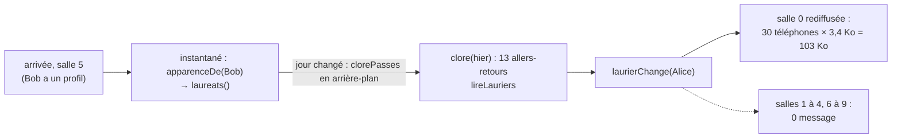

# Où le serveur dépense son temps — rapport de l'expert perf-serveur (audit du 27 septembre 2026, code `b57035c`)

## En bref

En production, la base permanente est distante (Turso, 20 à 80 ms par aller-retour). Les PR #58 et #59 l'interrogent beaucoup plus que la soirée. **Le jeu des soirées n'en souffre pas** :

- le laurier coûte 15 octets par lauréat ;
- à minuit, il ne fait rediffuser que la salle où joue un lauréat.

Le quiz du jour et la page du profil, eux, ont trois défauts qui grandissent avec le nombre de joueurs :

1. **Au réveil de l'hébergeur, le classement de la veille charge ses joueurs un par un**, à raison de trois allers-retours par profil, huit profils à la fois. Pour 500 joueurs, cela fait 1 543 allers-retours, soit 12 s à 50 ms et 19 s à 80 ms. **Tous ceux qui arrivent pendant ce temps attendent**, y compris sur l'accueil d'un profil connecté. À 700 joueurs, l'attente dépasse les 20 s au bout desquelles le téléphone abandonne.
2. **Chaque réponse du jour périme le classement figé d'hier.** Chaque « Question suivante » le relit donc deux fois. Pendant l'heure de pointe, cela fait 60 % des lignes lues et la moitié du processeur d'une partie.
3. **L'accueil d'un profil rapatrie les points de tous les joueurs de ses trente derniers jours** : 6 700 lignes à chaque visite.

J'ai prototypé les trois corrections dans mon atelier, sans toucher au dépôt. Leurs quatre reproductions passent alors, et les gains sont les suivants :

- la première visite du jour passe de 12 s à 2,4 s ;
- l'heure de pointe lit 90 % de lignes en moins ;
- une partie demande 42 % de processeur en moins.

Reste un quatrième chantier, plus long : une partie attend la base **154 fois en série**, soit 0,7 s par question à 50 ms.

## Méthode

J'ai travaillé seul, en 45 minutes environ, sur une machine de 4 cœurs partagée avec d'autres experts. La charge (load1) allait de 1,2 à 3,5, et chaque mesure la donne. Tout a tourné sous `nice -n 10`, un fichier à la fois.

**Lu d'abord** : le rapport perf-serveur du 24 septembre, `perf-temps-reel.md`, `verification/perf.md`, `2026-09-25/classement-perf.md`. J'ai aussi lu les JSON de recompenses-comptes, jour-regles, concurrence et persistance, pour ne pas refaire leurs constats.

**Code lu** :

| Fichier | Ce que j'y ai lu |
|---|---|
| `core/distante.ts` | le client libsql |
| `core/jour.ts` | en entier |
| `quizDuJour.ts` | les routes du quiz du jour |
| `auth/profiles.ts` | `init`, `byId`, `remember`, `toDetail`, `badgesOf`, `historiqueOf`, `careerOf`, les paliers, `recalculerTotal`, `ecrireXpDuJour` |
| `auth/profileRoutes.ts` | les routes du profil |
| `core/space.ts` | `carteDe`, l'instantané, `broadcastSnapshot` |
| `core/party.ts` | `toPublic` |
| `server.ts` | le démarrage, `laurierChange`, la route de la carte |
| `core/recalcul.ts` | le recalcul au barème du jour |
| côté client | `ProfilApp.tsx`, `JourApp.tsx`, `api.ts` : qui appelle quoi, et quand |

**Comment je compte** :

- `compteur.ts` enveloppe `Sqlite3Client.prototype.execute` et `.batch` : c'est le client de la base `file:` du banc. Il compte les allers-retours, les instructions, les lignes rendues et les octets utiles (les valeurs seules, soit une borne basse de ce que Turso renvoie). Il retrouve aussi l'appelant, par la pile.
- Il simule enfin la latence de Turso par une attente fixe avant chaque appel. Les **comptes** ne dépendent pas de la machine. Les durées « à 50 ms » sont dominées par la latence simulée ; la colonne « à 80 ms » est calculée (allers-retours en série × 80).
- Un `execute` ou un `batch` du client HTTP de Turso vaut un aller-retour, et ce client en lance 20 au plus à la fois (`concurrency`, défaut de `@libsql/core`).

**Les données** (`peupler.ts`, écrites dans la base permanente du banc, tirées d'une graine) :

- 500 profils, dont 200 avec une session ;
- trente jours de quiz du jour, joués par environ 200 profils chacun ;
- la veille, jouée par les 500 et pas encore close ;
- de 0 à 25 soirées et une étagère par profil.

**Scripts** (tous dans `export/evaluations/perf-serveur/`) :

| Script | Ce qu'il fait |
|---|---|
| `reproductions.test.ts` | **4 épreuves qui échouent aujourd'hui** et passent avec le prototype |
| `routes.test.ts` | chaque route, à 50 ms ; l'heure de pointe (199 parties) ; minuit ; les réveils. `mesures-routes.json`, `-prototype.json` |
| `reveil.test.ts` | 15 visiteurs simultanés au réveil, à 50 ms et 80 ms, avec 500 puis 700 joueurs la veille |
| `cpu.test.ts` | le processeur d'une partie, sur un **vrai processus** (`node --import tsx src/index.ts`), lu dans `/proc` : 2 × 50 parties, avant et avec le prototype |
| `laurier.test.ts` | minuit dans dix salles de trente invités |
| `memoire.test.ts` | le tas par profil gardé ; le coût d'`apparenceDe` |
| `demarrage.test.ts` | le démarrage ordinaire, avant #58 (`a6fc98b`, extrait par `git archive` dans `avant/`) et aujourd'hui |
| `annulation.test.ts` | « Annuler pour tous » à 500 joueurs |
| `plans.test.ts` | les plans SQLite des requêtes lourdes |
| `prototype.ts` | les pistes 1 à 3, posées à chaud pour mesurer leur gain (**pas une correction**) |

Chaque mesure de comptes a été rejouée au moins deux fois, et à l'identique : les comptes sont déterministes. Les temps de processeur ont été mesurés 4 fois.

**Non couvert** :

- un vrai Turso : pas de gigue, ni de débit, ni de format hrana réel. Le format réel enveloppe chaque valeur de son type, donc les octets sont sous-estimés ;
- Render lui-même : le « ×8,7 » du passage au dixième de cœur est la mesure de `verification/perf.md`, pas la mienne ;
- le comportement du navigateur quand la requête dépasse 20 s, que j'ai lu dans le code sans le rejouer.

## Constats

### 1. Au réveil, le quiz du jour charge les joueurs d'hier un par un, et tout le monde attend

- **Où** :
  - `server/src/core/jour.ts:873-889` (`joueursDu`) et `:899-913` (`classementDuMois`) : `parLots(rows, PROFILS_EN_VOL = 8, byId)` (`:117`, `:1557`) ;
  - `auth/profiles.ts:539-544` (`byId`) → `:1841-1873` (`remember`) : pour un profil absent de la mémoire, `SELECT * FROM profiles`, puis `SELECT avatar FROM profile_eclats`, puis `recompterRecompenses` (`:1549`) : **trois allers-retours en série par profil** ;
  - le verrou de la nuit : `clorePasses` (`jour.ts:1188-1206`, verrou `#nuit`), attendu par `etat` (`:582`), `commencer` (`:603`), `classementDuJour` (`:893`), `correction` (`:1285`), et `carriereDe` (`:1061`). Ce dernier sert `GET /api/joueur/moi` (`profileRoutes.ts:79`), qui est l'accueil `/` de tout profil connecté (`ProfilApp.tsx:87`).
- **Constat** : l'hébergeur gratuit s'endort après 15 minutes sans trafic (MISE-EN-LIGNE.md:112), et la mémoire des profils repart vide. Deux cas se présentent :
  - **la première visite du jour** clôt la veille : `clore` → `joueursDu(hier)` charge alors les 500 joueurs un par un ;
  - **chaque première visite après un réveil** passe par `vueDe` → `vainqueursDe(hier)` et `sonJour(hier)`, qui rechargent eux aussi tous les joueurs d'hier. Les marques d'homonymie demandent toute la salle.

  Le classement du mois fait de même. Pendant ce temps, le verrou `#nuit` fait attendre chaque visiteur du quiz du jour **et de l'accueil**.
- **Preuve** :
  - `reproductions.test.ts`, épreuves 1 et 2, **échouent** : 613 et 603 allers-retours pour 200 joueurs, dont 200 `SELECT * FROM profiles WHERE id = ?` chacune ;
  - `routes.test.ts`, à 50 ms :

    | Situation | Allers-retours | En série | Durée à 50 ms | À 80 ms (calculé) |
    |---|---|---|---|---|
    | 1re visite du jour, la veille à 500 joueurs | 1 543 | ≈ 240 | 12,0 s | 19 s |
    | Réveil, rien à clore, la veille à 200 joueurs | 608 | — | 2,3 s | — |
    | Classement du mois au réveil (500 profils) | 1 501 | — | 9,9 s | — |

  - `reveil.test.ts` : 10 `GET /api/jour` et 5 `GET /api/joueur/moi` partis dans les deux premières secondes finissent **tous** ensemble :

    | Latence | Joueurs la veille | Attente de chacun |
    |---|---|---|
    | 50 ms | 500 | 9,9 à 12,0 s |
    | 80 ms | 500 | 16,6 à 18,9 s |
    | 80 ms | 700 | **22,7 à 25,0 s** |

  - le client abandonne à 20 s (`DELAI_REQUETE_MS`, `client/src/api.ts:66`) :
    - l'accueil montre alors **la page d'un invité anonyme** à un profil connecté (`ProfilApp.tsx:98-99`, `relire().catch(() => setProfil(null))`) ;
    - `JourApp` montre une erreur.

    Ce comportement client est lu dans le code, pas rejoué dans un navigateur.
- **Qui ça touche, ce que ça coûte** : chaque matin, et après chaque sommeil de l'instance, les premiers profils qui ouvrent l'accueil ou le quiz du jour. Rien n'est perdu, mais la page semble en panne, ou déconnectée, exactement quand on vient jouer. À 50 profils par jour, le coût reste d'environ 1 s. Il grandit linéairement : 3 allers-retours par joueur d'hier, en tranches de 8.
- **Statut** : confirmé (rejoué).
- **Piste** : un chargement par paquets dans `ProfileStore`, que `joueursDu` et `classementDuMois` appellent au lieu de `byId`. `recompterRecompenses` sait déjà prendre une liste :
  ```ts
  /** Plusieurs profils d'un coup : trois allers-retours pour 400 profils, pas trois par profil. */
  async byIds(ids: readonly string[]): Promise<Map<string, ProfileRec>> {
    const manquants = [...new Set(ids)].filter(id => !this.profiles.has(id))
    for (let i = 0; i < manquants.length; i += 400) {
      const paquet = manquants.slice(i, i + 400)
      const marques = paquet.map(() => '?').join(', ')
      const [lignes, eclats] = await this.client.batch([
        { sql: `SELECT * FROM profiles WHERE id IN (${marques})`, args: paquet },
        { sql: `SELECT profile_id, avatar FROM profile_eclats WHERE profile_id IN (${marques})`, args: paquet },
      ], 'read')
      // … ranger les Éclats du paquet, puis recompterRecompenses(paquet), puis remember(row) sans relecture
    }
    return new Map(ids.flatMap(id => { const p = this.profiles.get(id); return p && !p.disabledAt ? [[id, p] as const] : [] }))
  }
  ```
  **Mesuré avec le prototype** (`prototype.ts`) :

  | Situation | Aujourd'hui | Avec le prototype |
  |---|---|---|
  | 1re visite du jour (500 joueurs) | 1 543 allers-retours, 12,0 s | 50, 2,4 s. Le reste est le podium de la nuit, payé marche par marche |
  | Réveil, la veille à 200 joueurs | 608 allers-retours, 2,3 s | 9, 0,31 s |
  | Classement du mois (500 profils) | 1 501 allers-retours, 9,9 s | 8, 0,44 s |

  Aucun invariant n'est touché : il s'agit seulement de remplir le cache, avec les mêmes lignes. En bonus, sans risque : `clorePasses` cherche les jours à clore dans `jour_tirages` (une ligne par jour) plutôt que dans `jour_parties`. Son `SELECT DISTINCT … WHERE jour < ?` parcourt l'index de **toutes** les parties passées à chaque réveil (`plans.test.ts`), soit 73 000 entrées après un an à 200 joueurs par jour.
- **Priorité · effort** : P2 · S.

### 2. Chaque réponse du jour périme le classement figé d'hier : « Question suivante » le relit deux fois

- **Où** :
  - `core/jour.ts:200` : une seule `revision` pour tous les jours. Elle monte à chaque réponse (`:719`), à chaque partie commencée (`:612`), à la nuit (`:1229`), à l'annulation (`:1412`) et au masquage (`:1454`) ;
  - `:874-875` : le classement gardé d'un jour n'est valable qu'à la révision courante ;
  - `:783-787` : `vueDe` lance en parallèle `vainqueursDe(hier)` (`:955`) et `sonJour(hier)` (`:971`), qui appellent chacun `joueursDu(hier)`. Aucune lecture en vol n'est partagée.
- **Constat** : un jour clos ne change plus, sauf à la nuit, à l'annulation ou au masquage. Pourtant, chaque réponse de n'importe qui aujourd'hui rend son classement « périmé ». Chaque « Question suivante », chaque `commencer` et chaque `GET /api/jour` relisent donc **deux fois** toutes les parties d'hier, et les reclassent deux fois (`classer`, `nommer`).
- **Preuve** :
  - `reproductions.test.ts`, épreuve 4, **échoue** : sur 10 « Question suivante », le classement d'hier (200 joueurs) est relu 20 fois, soit 4 000 lignes ;
  - l'heure de pointe (`routes.test.ts`, 199 parties à 200 profils, la veille à 500 joueurs) :
    - `suivante` fait 13,1 allers-retours et rend **1 126 lignes** par requête, dont 1 000 viennent d'hier ;
    - `suivante` pèse 56 % des 46 422 allers-retours de l'heure, et environ 2,2 des 3,7 millions de lignes rendues.
  - le processeur (`cpu.test.ts`, vrai processus, 4 passes de 50 parties, charge de 1,3 à 2,9) :
    - une partie coûte **125 à 133 ms** ici, dont 62 à 64 ms pour les dix `suivante` ;
    - avec le prototype, elle coûte **73 à 77 ms** (−42 %), dont 28 ms pour les `suivante`.

    C'est une borne haute : ici, SQLite travaille dans le processus. Avec Turso, le serveur paie à la place le HTTP et le décodage de réponses de 1 000 lignes.
- **Qui ça touche, ce que ça coûte** :
  - chaque joueur, à chaque question : 2 allers-retours de plus et 1 000 lignes à décoder ;
  - l'instance : avec le rapport ×8,7 mesuré au dixième de cœur (`verification/perf.md`), une partie coûte **environ 1,1 s de processeur sur l'offre gratuite**. 200 parties dans l'heure en font environ 225 s, soit **près des deux tiers** des 360 s qu'un dixième de cœur offre par heure, entre 20 h et 21 h, à l'heure où jouent les soirées. C'est une estimation, non mesurée sur Render. Le prototype ramène ce chiffre à environ 130 s.
- **Statut** : confirmé (rejoué). La part Render est une extrapolation.
- **Piste** : une révision **par jour**, lue *avant* la lecture, et la lecture en vol partagée.
  ```ts
  private revisions = new Map<string, number>()                    // jour → révision
  private monter(jour: string) { this.revisions.set(jour, (this.revisions.get(jour) ?? 0) + 1) }
  // enregistrer, commencer : monter(partie.jour) ; clore(jour), annuler(jour) : monter(jour).
  // masquer : rien — les masqués se filtrent après le cache (:888).
  private enVol = new Map<string, Promise<Joueur[]>>()             // `${jour}|${rev}` → lecture
  ```
  La révision lue avant l'`await` corrige aussi le cache rangé périmé de jour-regles-2 et concurrence-3 : c'est le même endroit, et un seul correctif suffit. Le masquage garde son effet, puisqu'il est filtré après le cache. Un renommage aussi : `Object.assign(rec, …)` (`profiles.ts:1068`) modifie l'objet que le cache tient. `classementsGardes` doit garder au moins 31 jours pour la piste 3.
- **Priorité · effort** : P2 · S.

### 3. L'accueil d'un profil rapatrie les points de tous les joueurs de ses trente derniers jours

- **Où** : `core/jour.ts:1108-1125` (`joursJoues`) : `SELECT jour, points FROM jour_parties WHERE jour IN (<ses 30 derniers jours>) AND …`, appelé par `carriereDe` (`:1099`) ← `detailDe` (`auth/profileRoutes.ts:79`) ← `GET /api/joueur/moi` (`:254`). C'est l'accueil `/` et `/profil` (`ProfilApp.tsx:87`), et `JourApp` l'appelle deux fois par partie (`JourApp.tsx:75`, `:146`).
- **Constat** : pour ranger sa place de chacun de ses trente derniers jours, le serveur lit les points de **tous** les joueurs de ces jours. Il le fait à chaque visite de chaque profil. Le plan SQLite (`plans.test.ts`) parcourt toute la table `profiles` puis sonde l'index par profil et par jour (500 × 30 sondes), et rend toutes les lignes.
- **Preuve** :
  - `reproductions.test.ts`, épreuve 3, **échoue** : 6 248 lignes rendues pour une visite, dont 6 176 par `joursJoues` ;
  - `routes.test.ts` : 6 722 lignes et 139 Ko pour l'assidue. En pointe, la moyenne est de 3 020 lignes par visite, soit environ 1,2 million de lignes par heure pour les seules visites de l'accueil ;
  - le coût grandit comme (joueurs par jour) × (jours joués).
- **Qui ça touche, ce que ça coûte** : chaque visite de l'accueil d'un profil qui joue au quiz du jour. Les allers-retours ne changent pas (7 à 9), mais le serveur décode des milliers de lignes, et Turso sert et facture des lignes lues pour rien.
- **Statut** : confirmé (rejoué).
- **Piste** : lire la place de chaque jour dans les classements gardés (pistes 1 et 2), chargés en une requête pour les jours qui manquent. Le rang passe toujours par `rangDansLesTries` (invariant 15).
  - Prototypé : **6 248 → 117 à 172 lignes par visite**. La première visite après un réveil charge les 30 jours une fois (8 891 lignes).
  - Sur l'heure de pointe, avec les pistes 1 et 2 : **3,72 millions → 0,36 million de lignes**, et 170 → 38 Mo.
  - L'alternative en SQL (`RANK() OVER (PARTITION BY jour ORDER BY points DESC)`, qui rend 30 lignes) serait une **seconde règle des ex æquo** hors de `shared/classement.ts`. C'est une tension avec l'invariant 15, à éviter.
- **Priorité · effort** : P3 · S à M.

### 4. Une partie du quiz du jour attend la base 154 fois en série

- **Où** :
  - `repondre` (`core/jour.ts:646-667`) enchaîne 6 allers-retours en série, 12 à la dernière réponse :
    - `tirage` (`:506`), relu à chaque geste alors qu'il est figé pour la journée ;
    - `partieDe` (`:758`) ;
    - `enregistrer` (`:685`, un lot) ;
    - `ecrireXp` (`:1241`, un lot de sommes) ;
    - `ecrireXpDuJour` → `recalculerTotal` (`profiles.ts:1782` → `:1233`, un lot) ;
    - `revelationDe` (`:727`, un lot) ;
  - `suivante` (`:624-641`), puis `vueDe` (`:776-871`), fait 8 à 9 allers-retours en série.
- **Constat** : chaque étape attend la précédente, alors que les sommes, le total et la révélation tiendraient dans le même lot d'écriture.
- **Preuve** (`routes.test.ts`, à 50 ms) :

  | Geste | Allers-retours | En série | À 50 ms |
  |---|---|---|---|
  | `repondre` | 6 | 6 | 0,31 s |
  | `repondre`, la dernière | 12 | 12 | 0,62 s |
  | `suivante` | 12 ou 13 | 8 ou 9 | 0,42 à 0,47 s |
  | **une partie de 10 questions** | **198** | **154** | **8,0 s** (12,3 s à 80 ms, calculé) |

  Le prototype des pistes 1 à 3 n'y change presque rien (187 allers-retours, 154 en série).
- **Qui ça touche, ce que ça coûte** : chaque joueur. La révélation arrive 0,3 à 0,5 s après le toucher, et la question suivante 0,4 à 0,7 s après le bouton, sans compter le trajet du téléphone jusqu'à Render. Ce n'est pas une panne, c'est une partie qui traîne.
- **Statut** : confirmé (rejoué) ; c'est une optimisation.
- **Piste** :
  - garder en mémoire le tirage du jour, invalidé par `annuler` ;
  - écrire la réponse, la partie, la ligne `#jour` (les sommes en sous-requêtes, la version en entier littéral : voir recompenses-comptes-1) et le total dans **un seul** lot, qui rend aussi la révélation. `repondre` passe ainsi de 6 à 2 allers-retours ;
  - pour `suivante`, `UPDATE … RETURNING *`, et garder par jour les vainqueurs d'hier, et par (profil, jour) son « hier ». `suivante` passe ainsi de 8 à environ 3.

  Le gain attendu est de 0,7 s à environ 0,25 s par question à 50 ms.

  Le risque : deux instances pendant un déploiement ne partageraient pas le tirage gardé, et une annulation ne serait vue que de la sienne (persistance-1 décrit ce chevauchement). Il faut garder le verrou par profil tel quel.
- **Priorité · effort** : P3 · M.

### 5. « Annuler pour tous » un soir de 500 joueurs dépasse le délai de la page d'administration

- **Où** : `core/jour.ts:1384-1413` (`annuler` → `parLots(…, recompter)`) et `:1416-1443` (`recompter`). Le tirage (4,9 Ko) y est relu par joueur, puis viennent un lot, un `UPDATE`, et `ecrireXp` (un lot, le total, les statistiques des paliers).
- **Preuve** (`annulation.test.ts`, profils en mémoire, paliers déjà décernés, à 50 ms) : **3 019 allers-retours, ≈ 415 en série, 20,7 s**. Le tirage est relu 501 fois, soit 2,4 Mo. La première annulation, profils froids et paliers à décerner, en fait 6 994.
- **Qui ça touche** : l'administrateur. Le client abandonne à 20 s (`api.ts:66`) et affiche une erreur pendant que le serveur continue ; un second clic relance tout le recompte. jour-regles-11 décrit l'annulation qui échoue à mi-chemin ; ce constat en donne une cause ordinaire.
- **Statut** : confirmé (rejoué).
- **Piste** : passer le tirage à `recompter` au lieu de le relire, et fondre `recompter` et `ecrireXp` en un seul lot par profil. On passe de 7 à 2 allers-retours par joueur, et le verrou par profil reste. On peut aussi répondre tout de suite et recompter en arrière-plan, avec une ligne au journal.
- **Priorité · effort** : P3 · S.

### 6. Le démarrage attend 60 allers-retours en série avant d'ouvrir le port

- **Où** : `server.ts:242-352`. Les magasins s'initialisent l'un après l'autre. `ProfileStore.init` (`profiles.ts:405-530`) fait 5 `ajouterColonne`, soit 5 `PRAGMA table_info`, plus les drapeaux de durcissement. `JourStore.init` (`jour.ts:226-317`) en fait 3. `PartyBackup.init` (`backup.ts:431-440`) fait 6 `ajouterColonne`.
- **Preuve** (`demarrage.test.ts`, à 50 ms) :

  | Démarrage | a6fc98b (avant #58) | b57035c (aujourd'hui) |
  |---|---|---|
  | ordinaire | 54 allers-retours, 2,7 s | **60 allers-retours, 3,0 s** (4,8 s à 80 ms) |
  | sur une base vide | 73 | 85 |

  Chaque réveil de l'offre gratuite paie ce temps en plus de sa minute.
- **Statut** : confirmé (rejoué) ; c'est une optimisation.
- **Piste** : initialiser en parallèle les magasins indépendants (profils, quiz du jour, bibliothèque, programmes, partages, historique), et regrouper les `PRAGMA table_info` d'un magasin en un seul lot. La profondeur tombe alors à celle du miroir (environ 19), soit environ 1 s à 50 ms.

  Trois ordres sont à garder :
  - `ensureDefaultSpace` avant `backup.init` ;
  - `restoreInto` avant `stampLegacySpace` ;
  - le recalcul après l'historique.

  Le recalcul perpétuel au prochain `VERSION_BAREME` est le constat recompenses-comptes-1 (629 requêtes à chaque démarrage pour 101 soirées) : je ne le refais pas.
- **Priorité · effort** : P3 · S.

## Mesures et cartes

**Chaque route, sur le serveur de 500 profils** (`mesures-routes.json`, deux passes identiques ; charge de 1,3 à 3,5) :

| Route | Allers-retours | En série | À 50 ms | À 80 ms (calculé) | Lignes | Ko (borne basse) | Avec le prototype (allers-retours · durée · lignes) |
|---|---|---|---|---|---|---|---|
| 1re visite du jour, `GET /api/jour` (clôt la veille, 500 joueurs, serveur réveillé) | 1 543 | 240 | 12,0 s | 19,2 s | 3 080 | 186 | 50 · 2,4 s · 3 080 |
| `GET /api/jour`, visite suivante | 8 | 5 | 0,27 s | 0,4 s | 59 | 8 | idem |
| `GET /api/jour`, au réveil, la veille à 200 joueurs | 608 | 45 | 2,3 s | 3,6 s | 1 429 | 79 | 9 · 0,31 s · 64 |
| `GET /api/joueur/moi` (l'assidue : 25 soirées, 30 jours) | 9 | 7 | 0,36 s | 0,6 s | **6 722** | 139 | 10 · 0,37 s · 6 222 (1re) |
| `GET /api/joueur/moi`, visite suivante | 7 | 6 | 0,29 s | 0,5 s | **6 678** | 138 | 7 · 0,27 s · **286** |
| `GET /api/joueur/moi`, au réveil | 14 | 12 | 0,59 s | 1,0 s | 6 733 | 140 | 19 · 0,83 s · 8 891 (charge les 30 jours) |
| Carte d'un profil, `/s/<espace>/joueurs/<id>.json` | 5 | 2 | 0,11 s | 0,2 s | 53 | 14 | idem |
| Carte d'un anonyme | 0 | 0 | 3 ms | — | 0 | 0 | idem |
| `POST /api/jour/commencer` | 11 | 7 | 0,36 s | 0,6 s | 562 | 34 | 10 · 0,36 s · 62 |
| `POST /api/jour/repondre` | 6 | 6 | 0,31 s | 0,5 s | 8 | 3 | idem |
| `POST /api/jour/repondre`, la dernière | 12 | 12 | 0,62 s | 1,0 s | 27 | 3 | idem |
| `POST /api/jour/suivante` | 12 ou 13 | 8 ou 9 | 0,42 à 0,47 s | 0,6 à 0,7 s | 563 à 565 | 35 | 11 ou 12 · 0,42 à 0,47 s · 63 à 65 |
| **Une partie** (commencer + 10 × répondre et suivante) | **198** | **154** | **8,0 s** | **12,3 s** | 6 293 | 409 | 187 · 8,0 s · 793 |
| `GET /api/jour/classement`, du jour | 1 | 1 | 0,06 s | 0,1 s | 0 (gardé) | 0 | idem |
| `GET /api/jour/classement`, du mois | 1 | 1 | 0,06 s | 0,1 s | 500 | 20 | idem |
| `GET /api/jour/classement`, du mois, au réveil | 1 501 | 199 | 9,9 s | 15,9 s | 2 672 | 139 | 8 · 0,44 s · 2 672 |
| `GET /api/jour/correction/<jour>` | 4 | 4 | 0,21 s | 0,3 s | 22 | 3 | idem |
| 0 h 05, la nuit close (200 joueurs, podium de 3, profils en mémoire) | 42 | 39 | 1,95 s | 3,1 s | 288 | 27 | idem |
| `POST /api/admin/jour/annuler` (500 joueurs) | 3 019 | 415 | 20,7 s | 33 s | 4 520 | 2 417 | non prototypé |
| Démarrage ordinaire | 60 | 60 | 3,0 s | 4,8 s | 458 | 37 | idem |

**L'heure de pointe** : 199 profils jouent une partie entière, dans l'ordre des appels de `JourApp`, soit `moi` et `jour` à l'ouverture, `commencer`, 10 fois `repondre` et `suivante`, `moi` à la fin, et le classement du jour pour un joueur sur deux. Compté sans latence :

| | Aujourd'hui | Avec le prototype |
|---|---|---|
| Allers-retours | 46 422 (233 par partie ; 12,9 par seconde en moyenne sur l'heure) | 42 044 (211 par partie) |
| dont `suivante` | 26 069 (56 %) | 22 089 |
| Lignes rendues | **3,72 millions** | **0,36 million** |
| Octets utiles (borne basse) | 170 Mo | 38 Mo |
| Processeur par partie (vrai processus, 4 × 50 parties) | 125 à 133 ms | 73 à 77 ms |

12,9 allers-retours par seconde à 50 ms font environ 0,65 requête en vol en moyenne. Le plafond de 20 du client libsql est loin : la pointe coûte en attente et en processeur, pas en débit.

**Minuit dans dix salles de trente** (`laurier.test.ts`, à 50 ms). Alice (lauréate) joue dans la salle 0, Bob dans la salle 5 ; les autres salles n'ont que des anonymes. Un invité arrive dans la salle 5 à 0 h 00 min 30 :



- Le laurier ajoute **15 octets** au joueur qui le porte (`"laurier":true`).
- Les salles sans lauréat ne reçoivent **rien**.
- Une salle sans aucun profil ne réclame jamais les lauriers : c'est une salle à profil, ou une visite au quiz du jour, qui clôt la nuit.
- Avec 500 joueurs froids la veille, la clôture en arrière-plan coûte les 1 543 allers-retours du constat 1. Rien n'attend, sauf les visiteurs du quiz du jour et de l'accueil pendant ce temps.

**Décoration d'un instantané** (`memoire.test.ts`) : `apparenceDe` sur 300 invités à profil prend 0,17 ms sans laurier, et **1,6 ms** (p90 6,3 ms) avec, faute de garder le jour de Paris. Cela concorde avec jour-regles-14 (2,4 ms pour 500), déjà rapporté. C'est deux fois par diffusion, pour les écrans et pour les téléphones.

**Mémoire** : un profil gardé coûte **3,4 Ko** de tas (500 profils : 1,7 Mo), et relire ne fait pas grandir le tas (+0,4 Mo après cinq relectures, puis rien).

- `JourStore` : `verrous` se vide à chaque fin de travail (`jour.ts:1524-1532`), `classementsGardes` est borné à 8 jours, `lauriers` tient un seul ensemble, `masques` ne tient que les masqués.
- `ProfileStore` garde, sans jamais les évincer, les profils lus et leurs Éclats, récompenses, gardes et acquis, ainsi que toutes les sessions de profil valides (un an), chargées au démarrage. C'est borné par le nombre de profils et de connexions, pas par les jours : 5 000 profils feraient environ 17 Mo. Et l'instance se vide à chaque sommeil.

## Ce qui marche — à ne pas casser

- **Les corrections du 24 septembre tiennent** :
  - l'instantané des téléphones sans `connected`, et le regroupement en 120 + 2N ms ;
  - les pages publiques gardées sous empreinte (`core/pages.ts`) ;
  - la réponse qui ne recalcule que deux vues ;
  - l'état écrit en fin de tour de boucle ;
  - la clôture créditée huit profils à la fois ;
  - le recalcul au barème, passé de 3 094 requêtes et 68 s à 829 et 6,5 s pour 101 soirées à 20 ms, d'après la mesure de recompenses-comptes.
- **Le laurier dans les soirées est bon marché.** 15 octets, une rediffusion par salle concernée, aucune pour les autres (`laurierChange`, `server.ts:379-381`), et une lecture en mémoire qui n'attend jamais. Seul le jour de Paris recalculé à chaque appel coûte quelque chose (jour-regles-14).
- **La carte d'un joueur** coûte 5 allers-retours, dont 2 en série (0,11 s). Celle d'un anonyme n'en coûte aucun. `resumeDe` y recompte ce que `careerOf` vient de lire (`carriere.jour`) : un aller-retour à économiser, pas plus.
- **`vueDependDesAutres`, `lastSent`, `vctx.memo`** : rien de ce que les PR #58 et #59 ajoutent ne passe par les vues de partie.
- **Les classements gardés et la population des badges gardée une minute** : c'est le bon réflexe. Il ne leur manque qu'une clé plus fine (constat 2).
- **La mémoire n'est toujours pas la contrainte.**

## Recommandations, dans l'ordre

1. **`ProfileStore.byIds`**, par paquets de 400, utilisé par `joueursDu` et `classementDuMois`. Le premier matin passe de 12 s à 2,4 s, et le réveil de 2,3 s à 0,3 s. Les épreuves 1 et 2 de `reproductions.test.ts` en deviennent les tests. P2 · S.
2. **Une révision par jour**, lue avant la lecture, et la lecture en vol partagée. Le classement figé d'hier n'est plus relu à chaque réponse : 2,2 millions de lignes de moins par heure de pointe, et −42 % de processeur par partie (pistes 1 à 3 ensemble). Cela ferme aussi jour-regles-2 et concurrence-3. L'épreuve 4 en devient le test. P2 · S.
3. **La place des trente derniers jours lue dans les classements gardés** (`rangDansLesTries`, invariant 15) : de 6 700 à environ 150 lignes par visite de l'accueil. L'épreuve 3 en devient le test. P3 · S à M.
4. **`clorePasses` sur `jour_tirages`** : une ligne par jour au lieu de toutes les parties à chaque réveil. P3 · S.
5. **`repondre` et `suivante` en moins d'allers-retours** : le tirage du jour gardé, un seul lot d'écriture, `RETURNING`, et « hier » gardé. On passe de 0,7 s à environ 0,25 s par question à 50 ms. P3 · M.
6. **L'annulation** : le tirage passé à `recompter`, un lot par profil, ou le recompte en arrière-plan. P3 · S.
7. **Le démarrage en parallèle** : de 60 allers-retours en série à environ 20. P3 · S.
8. **Un test de coût par correction**, en *comptant* : `compteur.ts` est réutilisable tel quel dans `server/test/`, puisqu'il ne dépend que de `Sqlite3Client`. P2 · S.

## Limites

- **La latence est simulée** par une attente fixe, sans gigue, sans débit et sans le format hrana : les octets sont une borne basse, sans doute plusieurs fois plus gros sur le fil. Un vrai Turso peut aussi paralléliser moins bien.
- **Le processeur** est mesuré sur ce conteneur chargé (load1 de 1,3 à 2,9), avec SQLite dans le processus : c'est une borne haute pour le serveur. Le passage à Render (×8,7) est celui de `verification/perf.md`, et reste une hypothèse. Je n'ai pas mesuré Render.
- **Les données sont synthétiques.** 500 profils et 200 joueurs par jour, c'est une hypothèse de croissance, pas l'état de la production, dont le nombre de profils m'est inconnu. Tous les coûts des constats 1 à 3 sont linéaires : à 50 joueurs par jour, divisez par 4 à 10.
- **Côté navigateur**, l'accueil « anonyme » après 20 s (`ProfilApp.tsx:98-99`) est lu dans le code, pas rejoué.
- **Le prototype** remplace à chaud trois méthodes pour mesurer. Ce n'est pas la correction : sa règle « un jour clos ne bouge plus » est un raccourci de la révision par jour.

## Hors mission

- **L'accueil prend tout échec de `GET /api/joueur/moi` pour « pas de profil »** (`client/src/views/ProfilApp.tsx:98-99`) : une base muette, un 500 ou un délai montrent la page d'un invité anonyme à un profil connecté, qui croit sa session perdue. `JourApp` distingue déjà `UnauthorizedError` du reste (`JourApp.tsx:81-84`).
