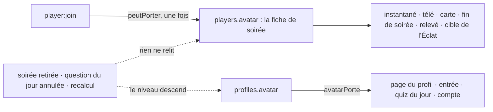

# Ce que les récompenses montrent, et à qui — rapport de l'expert `recompenses-vitrine`

## En bref

La vitrine tient pour l'essentiel. Côté écriture, rien de ce qui n'est pas gagné ne s'écrit : 17 appels forgés à la page du profil sont refusés, et un `player:join` forgé par un anonyme repart avec l'avatar par défaut, sans rien d'autre (contrôle `ecritures-forgees.test.ts`, qui passe). Côté affichage, le serveur relit presque tout à chaque diffusion. Les niveaux passent partout par `niveauDuProfil`, et la salle, la carte, la fin de soirée et le classement du jour prennent leurs distinctions d'une seule fonction (`apparenceDe`). Les invariants 8 (l'anonyme n'affiche rien) et 22 tiennent. Le 21 tient aussi, sauf sur une route.

Il reste des trous en bordure :
- une dérivation qui ne regarde que le palier de bronze (`hautsFaitsGagnes`) et contredit les autres après une soirée retirée ;
- l'emoji recopié dans la fiche de soirée, que plus rien ne relit ;
- des soirées jouées seul qui font des écussons ;
- trois écrans qui montrent l'emoji caché sous un légendaire ;
- `/api/auth/me`, qui envoie le récit d'un Divin à la télé branchée chez un tiers.

Surtout, le quiz du jour fait gagner la plupart des niveaux mais n'annonce jamais ce qu'ils ouvrent.

Les trois améliorations qui rapporteraient le plus :
1. Annoncer, à la fin d'une partie du jour, le niveau, les finitions et les emojis de collection qu'elle ouvre.
2. Tenir un haut fait de carrière pour gagné dès son premier palier atteint, quel qu'il soit.
3. Relire l'avatar d'une fiche à profil à chaque diffusion, comme tout le reste.

Aucun constat n'abîme une salle entière : 11 constats P3 dans mon angle, et un P2 hors mission (les paliers qui tombent en jouant seul).

## Méthode

Environ 1 h 30 : lecture du code, 10 fichiers d'épreuves `node:test` sur banc jetable (un à la fois, `nice -n 10`, charge machine entre 0,2 et 1,0), un build du client dans mon dossier, et une mesure Playwright (Chromium sans cookie, 360 × 640).

**Lus** :
- `CLAUDE.md`, `RECOMPENSES.md` (tout), `README.md` (« La direction »), `retours/2026-09-24/synthese.md` (axe 9 : les médaillons sur le chemin de l'invité) ;
- `shared/` : `avatars.ts`, `profil.ts`, `fonds.ts`, `ecussons.ts`, `carte.ts`, `proches.ts`, `legendaires.ts`, `saisons.ts`, `glossaire.ts`, `divins.ts`, `hautsfaits.ts` (catalogue, `hautsFaitsGagnes`, `cleRangee`, `plusBeaux`), `fin.ts`, `categories.ts`, `jour.ts` (types) ;
- `server/src/auth/` : `profiles.ts` (`avatarPorte`, `peutPorter`, `titrePorte`, `vitrineChoisie`, `fondPorte`, `legendairePorte`, `apparenceDe`, `toPublic`, `toDetail`, `update`, `register`, paliers, étagère), `profileRoutes.ts`, `routes.ts` (`/api/auth/me`, `/api/space/profil`), `appairage.ts` ;
- `server/src/core/` : `space.ts` (`carteDe`, `vitrineDeLaCarte`, crédits, clôture, `annoncerFin`, `warmProfiles`), `party.ts`, `progress.ts`, `jour.ts` (classement, lauriers, nuit, saisons, `categoriesDe`, `statsDuJour`), `saisons.ts`, `objectifs.ts`, `divins.ts` (`divinsDebloques`, `raconter`) ;
- `server/src/sockets.ts` (`player:join`), `games/quiz.ts` (`standings`, `votesDuSondage`, `guessRows`), `server.ts` (branchements du laurier), `api.ts` (`DELETE /api/soirees/:id`) ;
- `client/src/components/` : `Avatar`, `medaillons`, `Laurier`, `Ecusson`, `CarteJoueur`, `Apparence`, `Trophees`, `Carriere` (`DetailLegendaire`), `FinDeSoiree`, `Podium`, `Leaderboard`, `Cloture`, `Entree`, `AwardsBoard`, `Niveau` ;
- `client/src/views/` : `ProfilApp`, `PlayerApp`, `JourApp`, `HostApp`, `AccountApp`, et `games/quiz/{PlayerView,HostView,Course}.tsx`, `main.tsx`, `egalite.ts` ;
- les épreuves existantes `collection`, `laurier`, `ecussons`, `eclat`, `medaillons`, `emojis`, `variantes` (sondage).

**Écrits**, tous dans `export/evaluations/recompenses-vitrine/` :

| Fichier | Rôle | Aujourd'hui |
|---|---|---|
| `jour-niveau.test.ts` | la partie du jour qui fait monter de niveau le dit | échoue (constat 1) |
| `palier-un.test.ts` | bronze retiré avec sa soirée, argent resté : titre et vitrine | échoue (constat 2) |
| `seul.test.ts` | un écusson et un palier gagnés en jouant seul | échoue (constat 3 et hors mission) |
| `collection-en-soiree.test.ts` | le niveau redescend en pleine soirée : le paon reste | échoue (constat 4) |
| `divin-recit.test.ts` | le récit d'un Divin vers la télé branchée | échoue (constat 5) |
| `sondage.test.ts` | « Qui dans la salle ? » sans le légendaire porté | échoue (constat 6) |
| `eclat-porte.test.ts` | garde : l'éclat d'un avatar porté passe par `cibleEclat` | échoue (constat 7) |
| `avatar-recent.test.ts` | un avatar d'Unicode 13+ forgé | échoue (constat 8) |
| `octets-accueil.ts` | mesure Playwright des dessins téléchargés à `/` et `/banc` | constat 9 |
| `ecritures-forgees.test.ts` | contrôle : 17 écritures forgées et 3 entrées forgées | **passe** |
| `hors-mission-jour-muet.test.ts` | la page du profil face au quiz du jour illisible | échoue (hors mission) |
| `dist/` | le client construit (`npx vite build --outDir …`) | — |

Pour les lancer : `cd server && nice -n 10 node --import tsx --test --test-timeout=120000 ../export/evaluations/recompenses-vitrine/<fichier>`.

**Pas couvert** :
- le rendu à l'écran (tailles 1366 × 768 et 1920 × 1080, `Coupe` et laurier sur une longue liste), qui relève de `design-recompenses` ;
- la comptabilité des récompenses (`recompenses-comptes`) ;
- un vrai téléphone.

## Constats

### 1. Le quiz du jour ouvre niveaux, finitions et emojis de collection sans jamais les annoncer

- **Où** :
  - la fin de partie, `client/src/views/JourApp.tsx:447` (`Fin`) ;
  - son type `PartieDuJour` (`shared/jour.ts:311`), sans niveau d'avant ni d'après ;
  - `server/src/core/jour.ts:842-849`, qui n'ajoute que les paliers et les légendaires.
- **Constat** :
  - L'expérience du jour (75 XP au plus par partie, plus le podium) fait monter de niveau. La fin de partie montre la barre, mais ni « Niveau 2 ! », ni la finition, ni l'emoji de collection ouvert, ni son bouton « Le porter ». Tout cela, la fin de soirée sait le montrer (`FinDeSoiree.tsx:55`, `collectionGagnee`).
  - La soirée suivante ne le dira pas non plus : son « niveau avant » est `niveauDuProfil(profil.xp - xpSoiree)`, qui compte déjà l'expérience du jour (`space.ts:1502`).
- **Preuve** : `jour-niveau.test.ts`. Un profil à 55 XP fait dix sur dix : `xp de la partie : +75 · niveau 2 · ouvre ["🦚"] · champs de la fin de partie : categories, comptees, etat, joueurs, jour, justes, maintenant, medaille, paliers, points, pointsPossibles, rang, serie, sonHier, total, vainqueursDHier, xp`. Rien ne dit le niveau.
- **Qui ça touche** : tout profil assidu. Dans le scénario de RECOMPENSES.md § 5.13 (une soirée par mois, le quiz du jour 25 jours sur 30), il rapporte 1 105 XP par mois contre 255 en soirée : environ quatre montées de niveau sur cinq se font là. La promesse du lot 7 (« chaque niveau jusqu'au 17 ouvre une chose ») s'y tient, mais en silence, et l'emoji apparaît sans bruit dans la grille.
- **Statut** : friction (confirmé, rejoué).
- **Piste** : à la fin de la partie, rendre `niveauAvant` et `niveauApres` — le niveau avant se lit sous le verrou du profil, avant `ecrireXpDuJour`. Côté client, réutiliser le bloc « Nouvel avatar de collection » et la ligne « Nouvelle finition » de `FinDeSoiree`, qui ne dépendent que de ces deux nombres.
- **Priorité · effort** : P3 · S–M.

### 2. Le bronze retiré, l'argent reste : titre et vitrine tombent, et le serveur refuse ce que la page propose

- **Où** :
  - `shared/hautsfaits.ts:460-465` : `hautsFaitsGagnes` ne regarde que `clePalier(h.key, 1)` ;
  - les utilisateurs de cette fonction : `titrePorte` et `vitrineChoisie` (`server/src/auth/profiles.ts:732-752`), et `update` (`profiles.ts:1034-1049`) ;
  - en face, le client reconstruit les paliers 1 à `fois` (`shared/proches.ts:33`, `recompensesDe`) : `MonTitre` (`Apparence.tsx:297`) et `MaVitrine` (`Trophees.tsx:52`).
- **Constat** : chaque palier se range sous la soirée qui l'a fait tomber, et `DELETE /api/soirees/:id` emporte les siens. Retirer la soirée du bronze laisse l'argent et l'or sur l'étagère, sur la carte, derrière le Renard ou la Comète, et derrière le fond « Grand théâtre ». Pourtant :
  - le titre porté disparaît ;
  - la vitrine choisie l'oublie ;
  - la page propose toujours ce titre, et le serveur le refuse : « Ce titre se gagne d'abord ».

  `cleRangee` et `progresSur` (légendaires) lisent « n'importe quel palier » ; seule `hautsFaitsGagnes` lit « le bronze ».
- **Preuve** : `palier-un.test.ts` (deux vraies soirées, les paliers rangés comme `accorderPaliers` les range, puis le vrai `DELETE`). Sortie : `titre=null vitrineChoisie=null étagère=["hf:bavard:2"] PUT titre → 400 {"error":"Ce titre se gagne d’abord : c’est le nom d’un de tes hauts faits"}`.
- **Qui ça touche** : un profil dont une ancienne soirée — typiquement un essai gardé par erreur — a été retirée de l'historique, tant que sa prochaine clôture n'a pas redonné le bronze. Rien n'est perdu en base : `titre` et `vitrine` y restent.
- **Statut** : bug (confirmé, rejoué).
- **Piste** :

  ```ts
  // shared/hautsfaits.ts
  ...HAUTS_FAITS_DE_CARRIERE.filter(h => cleRangee(h.key, recompenses) !== null).map(h => h.key),
  ```

  C'est la même règle que `cleRangee` et `progresSur`, et le test passe.
- **Priorité · effort** : P3 · S.

### 3. Seul devant son quiz : un écusson que toute la salle voit

- **Où** :
  - `server/src/core/progress.ts:79-83` : la catégorie compte toute bonne réponse, même quand la question n'est pas `valide` (posée à un seul joueur) ;
  - `shared/profil.ts:526` : `carriereDe` additionne `categories` de toutes les soirées sans regarder `soireeQuiCompte`, contrairement à `c.soirees` ;
  - `space.ts:641` (la carte) et `profileRoutes.ts:84` (la page) en font les écussons (`ecussonsDe`).
- **Constat** :
  - Une soirée jouée seul « ne compte pas » : la fiche dit 0 soirée, sans Éclat, sans saison ni L'Habitué. Mais ses bonnes réponses font des écussons, et la carte les montre à la salle.
  - L'animateur qui joue seul son propre quiz de 200 questions de sport — dont il a écrit les réponses — porte l'écusson d'or du sport dès le lendemain.
  - Même chemin pour les paliers qui comptent des réponses : voir hors mission.
- **Preuve** : `seul.test.ts`. Une soirée seule, 20 QCM de sport et 3 estimations exactes : `fiche.soirees=0 · écusson Sport : 20 bonnes réponses, palier 1 · sur la carte : [{"categorie":"Sport","palier":1}] · paliers tombés seul : ["hf:devin"] · xp=10`.
- **Qui ça touche** : la crédibilité de ce qui se montre. Pas de gain de jeu (invariant 8).
- **Statut** : tension avec l'invariant 19 (« rien seul »), qu'appliquent déjà l'Éclat, L'Habitué et les saisons (`core/saisons.ts`, `soireeQuiCompte`). Confirmé, rejoué.
- **Piste** : faire les écussons sur les seules soirées qui comptent, par exemple `ecussonsDe(carriereDe(soirees.filter(s => soireeQuiCompte(s.gain)), …).categories, jour)`. Ou, plus simplement, faire sauter `categories` dans `carriereDe` pour une soirée qui ne compte pas — ce qui change aussi la réussite par catégorie de la fiche, à arbitrer avec `recompenses-comptes`, qui tranchera pour les paliers.
- **Priorité · effort** : P3 · S.

### 4. L'emoji de collection entré dans une soirée n'est plus relu : le paon à côté de « Niv. 1 »

- **Où** :
  - `server/src/sockets.ts:407-410` : `peutPorter` est vérifié une fois, au `player:join` ;
  - `server/src/core/party.ts:357-375` : `toPublic` rend `p.avatar`, recopié dans la fiche ;
  - `server/src/core/progress.ts:200` : `releve.avatar` et la cible de l'Éclat.
- **Constat** : « relus à chaque affichage (`avatarPorte`) : une soirée retirée qui fait redescendre sous le niveau de son emoji le lui reprend » (RECOMPENSES.md § 5.5). C'est vrai partout sauf dans la soirée où il joue. Quand le niveau redescend pendant la soirée, l'instantané, la télé, sa carte et sa fin de soirée gardent l'emoji qu'il n'ouvre plus, à côté du niveau redescendu. Le relevé l'enregistre (Le Collectionneur), et l'Éclat du soir peut tomber dessus.
- **Preuve** : `collection-en-soiree.test.ts`, que des routes réelles. Une soirée donne le niveau 2 ; Alice entre dans la suivante avec 🦚 ; l'animateur retire la première de l'historique. Sortie : `page du profil : niveau 1, avatar 🦊 · salle : niveau 1, avatar 🦚 · carte : niveau 1, avatar 🦚`.
- **Qui ça touche** : rare. Il faut qu'un niveau redescende en pleine soirée : une soirée retirée ailleurs, une question du jour annulée par l'administrateur, un recalcul au redémarrage.
- **Statut** : bug (confirmé, rejoué).
- **Piste** : faire rendre l'avatar visible par la décoration.

  ```ts
  // space.ts, le BadgeLookup de Party
  const visible = deps.profiles.peutPorter(profile, avatar) ? avatar : deps.profiles.avatarPorte(profile)
  return { ...deps.profiles.apparenceDe(profile, visible), avatar: visible }
  // party.ts, toPublic
  avatar: badge?.avatar ?? p.avatar,
  ```

  `buildProgress` devrait lire le même avatar visible (relevé, cible de l'Éclat).
- **Priorité · effort** : P3 · S.

### 5. Le récit d'un Divin part vers toute session du compte — la télé du bar comprise

- **Où** : `server/src/auth/routes.ts:98-110` (`GET /api/auth/me` rend `profiles.toPublic(profil)`), `server/src/auth/profiles.ts:776` (`divins: raconter(...)`), `server/src/auth/appairage.ts:196-199`.
- **Constat** :
  - Invariant 21 : le récit, « qui en dit presque autant que la règle », ne va qu'à son porteur. Or `/api/auth/me` répond à toute session du compte avec le profil rattaché au complet : récits des Divins, identifiant du profil. Cela vaut pour la télé branchée par un code — « souvent celle de quelqu'un d'autre — le bar, les parents, la salle louée » — et pour qui connaît le mot de passe du compte.
  - Chaque page le demande (`currentMe`, `client/src/api.ts:464-467`), et aucune n'affiche le récit.
- **Preuve** : `divin-recit.test.ts`. Le profil d'Alice, rattaché, a Hélios ; la télé branchée lit `/api/auth/me` : `profil.login=alice · divins=[{"key":"dv:helios","legende":"Rien de ce qu’on lui a demandé ne lui a échappé.","ton":"eclat"}]`.
- **Qui ça touche** : un animateur qui a un Divin, rarissime. La fuite se lit dans le réseau d'un navigateur tiers, pas à l'écran.
- **Statut** : invariant 21 (confirmé, rejoué). Pour les autres pouvoirs de la télé branchée, voir `securite-portes`, constat 1.
- **Piste** : une projection pour le compte, sans les récits.

  ```ts
  const { divins, ...leger } = deps.profiles.toPublic(profil)
  profil: { ...leger, divins: divins.map(d => ({ key: d.key, legende: '', ton: d.ton })) }
  ```

  Mieux : seulement ce que `ProfilLie` affiche — prénom, avatar, finition, éclats, légendaire, niveau, identifiant.
- **Priorité · effort** : P3 · S.

### 6. Trois écrans montrent l'emoji caché sous un légendaire

- **Où** :
  - « Qui dans la salle ? » à la télé : `server/src/games/quiz.ts:806-819` (`votesDuSondage` ne rend que nom, emoji et votes) et `client/src/games/quiz/HostView.tsx:351` ;
  - la « Remise des prix » de la console : `client/src/components/AwardsBoard.tsx:71` (`{a.player.avatar} {a.player.name}`, du texte) ;
  - « ont gagné hier » au quiz du jour : `server/src/core/jour.ts:951-961` (`vainqueursDe` : nom et emoji) et `client/src/views/JourApp.tsx:622`.
- **Constat** : un légendaire porté « remplace l'emoji partout où l'on se voit » (§ 5.4). À ces trois endroits, c'est l'emoji qu'il cache qui paraît, sans finition, niveau ni laurier. La salle désigne au sondage quelqu'un qu'elle voit en Phénix depuis le début, et la télé le montre en renard.
- **Preuve** :
  - sondage : `sondage.test.ts` ; Alice en Phénix dans l'instantané, sa ligne de sondage vaut `{"name":"Alice","avatar":"🦊","votes":2}` ;
  - les deux autres : lecture.
- **Qui ça touche** : quiconque porte un légendaire ou un Divin.
- **Statut** : incohérence d'affichage (sondage rejoué ; prix et vainqueurs d'hier confirmés à la lecture).
- **Piste** :
  - sondage : `...distinctions(joueur)` dans `votesDuSondage` (`VoteDeSondage extends Distinctions`) et un `<Avatar … legendaire>` avec `NomLaure` dans `VotesDuSondage`. `variantes.test.ts` ne lit que nom, emoji et votes : il passe toujours ;
  - vainqueurs d'hier : `apparenceDe` dans `vainqueursDe`, rendu par `Avatar` ;
  - remise des prix : sans enjeu d'archive, sur la console seulement.
- **Priorité · effort** : P3 · S.

### 7. « Mon profil joueur », à la page du compte, calcule l'Éclat sur l'emoji même sous un légendaire

- **Où** : `client/src/views/AccountApp.tsx:199` : `eclat={profil.eclats.includes(profil.avatar)}`, là où toutes les autres pages passent par `cibleEclat` (`ProfilApp.tsx:211`, `Apparence.tsx:47`, `Entree.tsx:345` et `:612`).
- **Constat** : sous un légendaire, la page montre sa version rare (`lg-eclate`, `Legendaire.tsx:949`) quand c'est l'emoji caché qui a éclaté, et sa version ordinaire quand c'est le légendaire. Une version rare montrée sans l'avoir gagnée.
- **Preuve** : `eclat-porte.test.ts`, une garde sur tous les `<Avatar … legendaire=…>` du client dont l'éclat se calcule au client. Elle échoue sur `client/src/views/AccountApp.tsx:199`. Le rendu de la version rare pour `eclat` sous un légendaire est déjà prouvé par `eclat.test.ts`.
- **Qui ça touche** : l'animateur, sur sa propre page de compte.
- **Statut** : bug (confirmé, rejoué par la garde).
- **Piste** : `eclat={profil.eclats.includes(cibleEclat(profil.legendaire, profil.avatar))}`.
- **Priorité · effort** : P3 · S (une ligne).

### 8. Un avatar forgé peut être un emoji d'Unicode 13 ou plus : un carré vide sur la télé

- **Où** : `shared/avatars.ts:68-73` : `cleanAvatar` garde n'importe quels quatre points de code.
- **Constat** : la règle d'avant Unicode 13 est gardée pour le code (`emojis.test.ts`) et pour les quiz écrits (`emojisRecents`), pas pour l'avatar. La grille ne propose que des emojis anciens, mais un `player:join` ou un `PUT /api/joueur/moi` forgé pose 🫠 ou 🥲, que la salle verra en carré.
- **Preuve** : `avatar-recent.test.ts` : `invité anonyme : 🫠 · profil : 🥲`.
- **Statut** : durcissement (confirmé, rejoué).
- **Piste** : `shared/emojis.ts` n'importe rien, donc sans cycle :

  ```ts
  return short && emojisRecents(short).length === 0 ? short : DEFAULT_AVATAR
  ```

- **Priorité · effort** : P3 · S.

### 9. L'accueil (`/`) télécharge les dessins des médaillons à un visiteur anonyme

- **Où** :
  - `client/src/main.tsx` : `route.kind === 'landing'` sert `ProfilApp` ;
  - `ProfilApp` importe `Apparence`, qui importe statiquement `Legendaire` et `Divin` (`Apparence.tsx:5-6`), et `Trophees.tsx:3` ;
  - `server/test/medaillons.test.ts` ne vérifie que `PlayerApp`.
- **Constat** : le chemin du QR (`/<espace>`) est propre. L'accueil sans profil, qui ne montre que « Me connecter » et « Rejoindre une soirée », télécharge et évalue pourtant les deux paquets de dessins. Ce n'est pas une régression de la PR #59 : avant la #58, `ProfilApp` importait déjà `Carriere`.
- **Preuve** : `octets-accueil.ts`, sur le client construit, Chromium sans cookie :
  - `/` : 19 fichiers JS, dont `Legendaire` (7 947 o transférés) et `Divin` (6 271 o) ;
  - `/banc` : 23 fichiers JS, aucun dessin.
- **Statut** : perf (mesuré).
- **Piste** : charger à la demande les onglets du profil connecté (`lazy(() => import('./Apparence'))`…). Étendre la garde de `medaillons.test.ts` à « `ProfilApp` sans profil », ou mesurer avec `perf-chargement`.
- **Priorité · effort** : P3 · S–M.

### 10. Rechargé en pleine question, un téléphone attend les dessins d'un autre

- **Où** : `client/src/views/PlayerApp.tsx:190-209` et `:391` (`attendreDessins` remplace toute la page par « Connexion… ») ; `:112` (le porteur lui-même attend avant d'être présenté).
- **Constat** : dans une salle où quelqu'un porte un légendaire, un téléphone qui recharge — ou le porteur lui-même — attend ses dessins jusqu'à 2,5 s avant de revoir la question. Le chrono tourne au serveur, et le bonus de rapidité fond. D'ordinaire, c'est 14 Ko en cache ou en 4G ; au pire, 2,5 s.
- **Statut** : tension avec l'esprit de l'invariant 8 (un cosmétique ne change rien au jeu), assumée dans le code (« une fois »). Confirmé à la lecture.
- **Piste** : ne pas attendre quand une question est ouverte (`phase === 'question'`) : l'emoji tient la place, comme le prévoit déjà `Avatar`.
- **Priorité · effort** : P3 · S.

### 11. Petites incohérences d'affichage

- **Où** et **Constat** :
  - Le laurier manque à « Ce que la salle voit » (`Apparence.tsx:38-55`, prénom sans `NomLaure`) et à l'en-tête « moi » du téléphone (`PlayerApp.tsx:553-562`), alors que la salle le voit.
  - La carte prend la marque d'homonymie pour un surnom : `CarteJoueur.tsx:110` compare `p.prenom` au nom affiché (`space.ts:612`, marque comprise), et lit « « Camille (2) » ce soir — Camille sur son profil ».
  - `DetailLegendaire` (`Carriere.tsx:54`) dit « Il a éclaté : c'est sa version rare » d'un légendaire verrouillé, dont une soirée retirée a repris la condition mais pas l'Éclat. Le médaillon, lui, reste sans version rare (`Legendaire.tsx:949`).
  - L'entrée d'un anonyme sur un téléphone où un profil a joué pré-sélectionne son emoji de collection (`Entree.tsx:94`, `choix.avatar`). Aucune case n'est allumée, « ton 🦚 vous distinguera » peut s'afficher, et le serveur donne 🎉.
- **Statut** : confirmé à la lecture.
- **Piste** :
  - `NomLaure` dans les deux en-têtes ;
  - comparer le prénom du profil au `name` brut (`p.name`, qui n'a pas la marque) ;
  - taire « Il a éclaté » quand `!gagne` ;
  - dans l'entrée, ne reprendre `choix.avatar` que s'il est dans `AVATARS`.
- **Priorité · effort** : P3 · S.

## Mesures et cartes

### La matrice : récompense × endroit × fonction qui la relit

Légende : ✔ relu à chaque affichage · ✗ valeur brute, ou absente là où elle devrait être · — absent par choix · ≈ relu, mais la dérivation a un défaut.

| Récompense | Salle (instantané : téléphones et télé — attente, classements, podiums, course, estimations, clôture) | Sondage · prix · vainqueurs d'hier | Carte | Fin de soirée (et gain par quiz) | Page du profil · entrée | Page du compte | Quiz du jour | Écriture (API) |
|---|---|---|---|---|---|---|---|---|
| Emoji de collection | ✗ fiche recopiée au `join` (`peutPorter` une fois) — n° 4 | ✗ même fiche | ✗ même fiche — n° 4 | ✗ `fin.avatar` | ✔ `avatarPorte` | ✔ `avatarPorte` | ✔ `avatarPorte` | ✔ `niveauRequis` > `niveauOf` → 400 ; `join` : `peutPorter` |
| Légendaire porté | ✔ `apparenceDe` → `legendairePorte` | ✗ emoji — n° 6 | ✔ | ✔ | ✔ `toPublic` → `legendairePorte` | ✔ | ✔ classement · ✗ vainqueurs d'hier | ✔ `legendairesOf` (Sphinx, saisons) |
| Divin porté | ✔ idem ; `Avatar` ignore finition et Éclat | ✗ emoji | ✔ liste seule | ✔ récit au porteur | ✔ récit au porteur | ✗ récit envoyé — n° 5 | ✔ | ✔ `divinsOf` |
| Finition | ✔ `finitionPortee(…, niveauOf)` | ✗ absente | ✔ | ✔ | ✔ `choixDeFinition` | ✔ | ✔ | ✔ bornée à `auto` |
| Éclat | ✔ `eclatsOf` ∋ `cibleEclat(legendairePorte, avatar joué)` | ✗ absent | ✔ | ✔ | ✔ client `cibleEclat` | ✗ calculé sur l'emoji — n° 7 | ✔ | — (tirage serveur) |
| Niveau | ✔ `niveauOf` / `niveauDuProfil` | ✗ absent | ✔ | ✔ `niveauDuProfil` (gardes) | ✔ `progression` | ✔ | ✔ classement · ✗ fin de partie — n° 1 | — |
| Titre | — (pas dans les listes, par choix) | — | ≈ `titrePorte` (bronze seul) — n° 2 | — | ≈ `titrePorte` / client `recompensesDe` — n° 2 | — | — | ≈ `hautsFaitsGagnes` — n° 2 |
| Vitrine | — | — | ≈ `vitrineDeLaCarte(badgesOf, vitrineChoisie)` — n° 2 | — | ≈ même dérivation au client — n° 2 | — | — | ≈ `hautsFaitsGagnes`, 1 à 3 |
| Fond de carte | — (la carte seule, par choix) | — | ✔ `fondPorte` → `fondsOuverts` | — | ✔ `fondsOuverts` | — | — | ✔ `fondsOuvertsDe` → 400 |
| Écussons | — | — | ≈ `plusBeauxEcussons(ecussonsDe(carrière, jour))` : solo compté — n° 3 | — | ≈ `ecussonsDe` — n° 3 | — | ✔ annulées écartées | — (dérivés) |
| Laurier | ✔ `laureats()` (masqués écartés, minuit) · ✗ en-tête « moi » — n° 11 | ✗ absent | ✔ | ✔ (figure) | ✔ en-tête · ✗ « Ce que la salle voit » — n° 11 | — | ✔ classement | — (dérivé) |
| Galerie (légendaires, Divins possédés) | — | — | ✔ `legendairesOf` / `divinsOf` (clés seules) | ✔ nouveaux | ✔ grille, silhouettes | — | ✔ Sphinx, saison | — |
| Annonces (niveau, finition, collection) | ✔ montées à la télé | — | — | ✔ `collectionGagnee`, `finitionsOuvertes` | — | — | ✗ jamais — n° 1 | — |

**Invité anonyme, tous endroits** : ✔ rien. `Party.toPublic` sans décoration, carte réduite à « ce soir », fin de soirée sans le bloc du profil, `Niveau` rend `null`, `distinctions()` ne recopie que ce qui existe. Le contrôle le vérifie : `Bob 🎉`, `Ève lg:p`, ni `niveau`, ni `finition`, ni `legendaire`, ni `laurier`, même forgés dans `player:join`.

**Archives (souvenir, bilan, historique)** : l'emoji du soir, figé par choix (README, « Les archives figées »).

### Où se relit un avatar, et où il ne se relit plus



### Les octets de l'invité (client construit le 26 septembre, brotli servi)

| Page, sans cookie | Fichiers JS | Dessins des médaillons |
|---|---|---|
| `/banc` (le QR d'une soirée) | 23 | aucun |
| `/` (l'accueil) | 19 | `Legendaire` 7 947 o + `Divin` 6 271 o = **14 218 o** (59 076 o décompressés) |

### Le contrôle des écritures (passe)

17 appels `PUT /api/joueur/moi` forgés sur un profil de niveau 1, tous refusés en 400 avec un message clair :
- avatars de collection, doublés ou suivis d'un sélecteur de variante ;
- légendaires ordinaire, de saison, Sphinx ; un Divin ;
- titres `hf:oracle`, `hf:bavard`, `dv:arbre`, `saison:noel` ;
- vitrines non gagnées, en chaîne, vide ;
- fonds `aurore`, `nuit`, `__proto__`.

Une finition trop haute se lit `auto`. Trois `player:join` forgés, avec `legendaire`, `niveau` et `laurier` dans la charge, n'y gagnent rien.

## Ce qui marche — à ne pas casser

- **Une seule décoration pour la salle** : `apparenceDe` (`profiles.ts:1801`) sert l'instantané, la carte, la fin de soirée, la clôture et le classement du jour. Légendaire relu, finition bornée au niveau, Éclat sur ce qu'on porte, laurier : ajouter une récompense là la fait paraître partout d'un coup.
- **L'invariant 22 tient** : aucun `niveauPour(` hors de `shared/profil.ts` (recherche dans `server/`, `client/`, `shared/`). Les montées se fêtent avec les gardes (`space.ts:753-794`, `:1501-1520`).
- **L'écriture est étanche** : `update` relit chaque champ contre ce qui est gagné, en clair, et `player:join` vérifie `peutPorter` sur la chaîne brute avant `cleanAvatar`. Un sélecteur de variante ou un emoji doublé ne passe pas, pas plus qu'un ZWJ, retiré par `INVISIBLE`, l'emoji restant compté.
- **Les Divins restent secrets dans le paquet** : dans le client construit, aucune règle ni aucun récit, seulement « personne ne sait ce qui le fait descendre ». Aucun compte ne bouge : `badges` écarte `dv:` et `saison:`, la carte ne compte que `hf:`, et l'étagère ne les montre pas.
- **Le chemin du QR ne charge aucun dessin** : le graphe du build (`PlayerApp` n'importe ni `Legendaire` ni `Divin`) et la mesure Playwright le confirment. Un légendaire verrouillé n'a jamais sa version rare (`Legendaire.tsx:949`).
- **Le laurier** : les masqués sont écartés à la nuit comme au masquage ; il s'éteint à minuit sans tâche planifiée, et la salle où joue un lauréat se rediffuse (`laurierChange`). `laurier.test.ts` le garde.
- **Après un redémarrage**, `warmProfiles` (`space.ts:311`) recharge les profils de la salle avant que la télé ne les affiche en anonymes.

## Recommandations, dans l'ordre

1. **Annoncer ce que la partie du jour ouvre** — niveau, finitions, emojis de collection, en réutilisant les blocs de `FinDeSoiree` (constat 1). P3 · S–M.
2. **`hautsFaitsGagnes` : n'importe quel palier** — une ligne, `cleRangee(h.key, recompenses) !== null` (constat 2). P3 · S.
3. **Relire l'avatar d'une fiche à profil à la diffusion** — la décoration rend l'avatar visible, et `buildProgress` le lit aussi (constat 4). P3 · S.
4. **Écussons : seulement les soirées qui comptent**, et arbitrer les paliers avec `recompenses-comptes` (constat 3, hors mission). P3 · S.
5. **`/api/auth/me` : un profil léger, sans récit** (constat 5). P3 · S.
6. **Distinctions sur le sondage, les prix et les vainqueurs d'hier** (constat 6). P3 · S.
7. **`AccountApp.tsx:199` → `cibleEclat`**, et garder la règle par `eclat-porte.test.ts` (constat 7). P3 · S.
8. **`cleanAvatar` refuse les emojis récents** (constat 8). P3 · S.
9. **L'accueil sans profil sans les dessins** : onglets du profil à la demande, et `medaillons.test.ts` étendu (constat 9). P3 · S–M.
10. **Ne pas faire attendre les dessins pendant une question** (constat 10). P3 · S.
11. **Les petites incohérences** : laurier dans les deux en-têtes, marque d'homonymie sur la carte, « Il a éclaté » verrouillé, entrée d'un anonyme (constat 11). P3 · S.

## Limites

- Rien n'a été regardé à l'écran : la place du laurier dans une longue liste coupée (`Coupe`), sur la télé en 1366 × 768 et en 1920 × 1080, reste à photographier (`server/scripts/rendu-ecran.ts`, angle `design-recompenses`).
- Les seuils des écussons (20, 75, 200) et des fonds sont des choix de produit, que je n'ai pas évalués.
- Les constats 4 et 5 demandent des circonstances rares : un niveau qui redescend en pleine soirée, un animateur qui a un Divin. Je ne les ai pas pondérés par une fréquence réelle.
- Le constat 10 est lu, pas mesuré sur une 4G réelle.
- Pas d'appareil réel ; Windows 10 n'a pas été vu (constat 8, déduit de la règle du dépôt).

## Hors mission

- **Des paliers de carrière tombent en jouant seul** (invariant 19, angle `recompenses-comptes`, P2).
  - Rejoué : Le Devin · Bronze, +10 XP, sur une soirée seule (`seul.test.ts`).
  - Même chemin pour Le Bavard, L'Encyclopédie, Le Collectionneur (un avatar forgé par soirée) et Le Globe-trotteur : `carriereDe` additionne toutes les soirées, et `accorderPaliers` court pour chaque gain (`space.ts:1496`).
- **Une saison gagnée deux fois se perd avec la soirée** (`recompenses-comptes`). Quand une soirée a déjà rangé `saison:halloween`, `accorderSaison` (`profiles.ts:1503`) ne range pas la ligne du jour. Retirer ensuite la soirée, hors période, reprend la Citrouille à qui avait aussi ses trois jours. Confirmé à la lecture.
- **La page du profil tombe avec le quiz du jour** (robustesse). `detailDe` (`profileRoutes.ts:79`) lit `jour.carriereDe` et `categoriesDe` sans filet, là où la carte et `statsDuJourDe` en ont un. Une table du jour illisible fait répondre 500 à `/api/joueur/moi`, l'accueil d'un profil connecté (`hors-mission-jour-muet.test.ts`).
